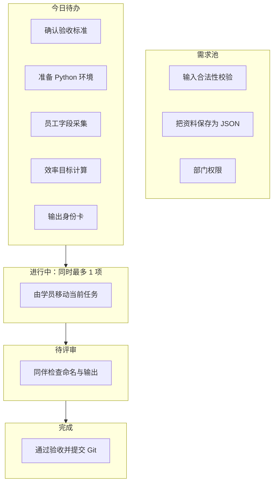
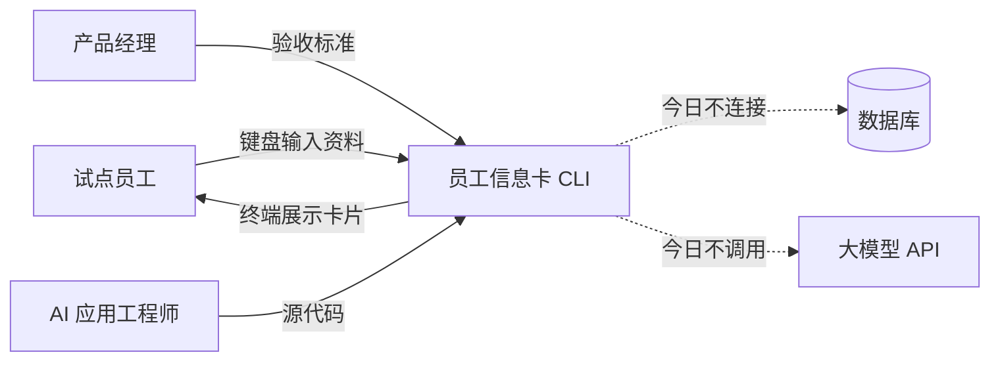
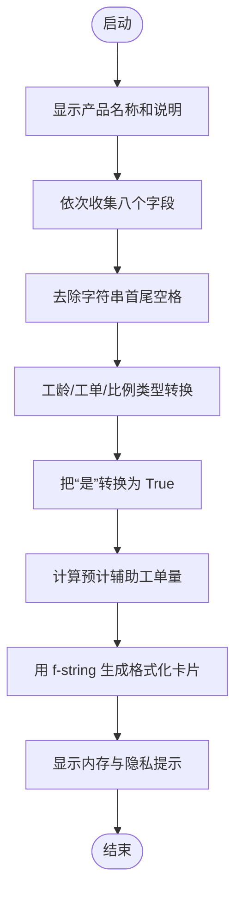
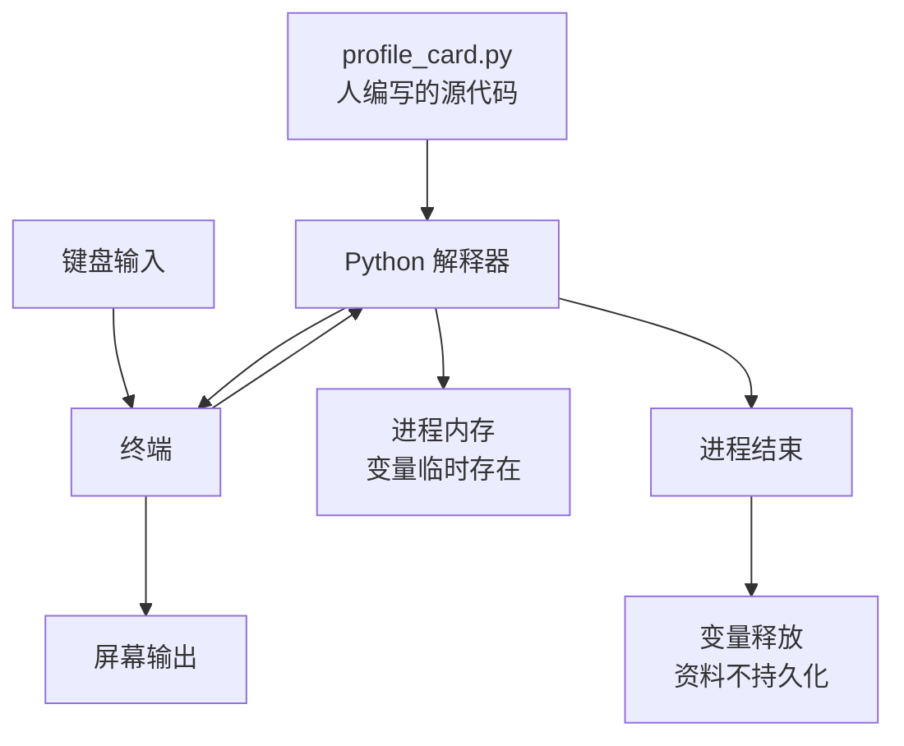
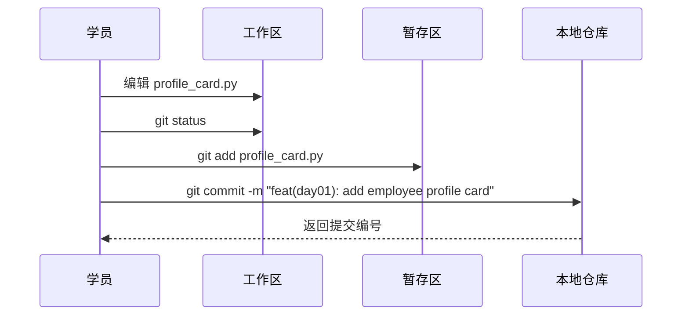
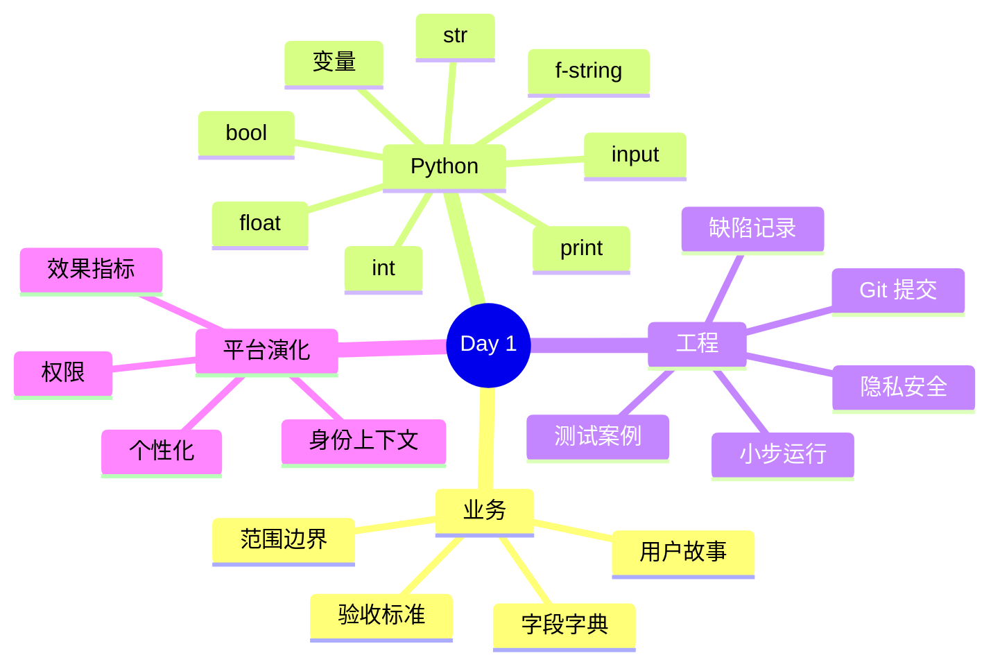

# Day 1｜从业务问题到第一段可验收代码：智枢员工信息卡

> 课程阶段：第一阶段·Python 编程基础  
> 建议课时：授课 3 小时 + 实操 3.5 小时 + 晚自习 2 小时  
> 项目版本：NexusAI 0.0.1  
> 今日需求编号：US-FOUNDATION-001  
> 今日交付：可运行的命令行员工信息卡、验收记录、第一次 Git 提交  

---

## 0. 开场旁白：今天写的不是“玩具代码”

【讲师旁白】

欢迎加入智枢企业智能协作平台项目组。今天是入职第一天。你面前没有一道孤立的 Python 练习题，而是一份来自业务部门的真实风格需求：集团准备启动企业 Agent 试点，需要收集首批员工的身份与业务目标。身份并不是简单的姓名标签。未来系统回答制度问题时，要知道提问者属于哪个部门；调用退款工具时，要判断他的岗位是否有权限；推荐工作流时，要理解他的日常任务；统计试点收益时，还要比较 Agent 上线前后的工单量。

因此，我们的第一段程序从“员工信息卡片”开始。它今天只在命令行里运行，退出后数据也会消失，看起来十分简单。但是其中的员工编号、部门、岗位、工龄、工单量、提效目标和试点意愿，会在后续课程里沿着同一条演化路线前进：


你今天会第一次经历“业务提出问题—产品澄清需求—工程师设计—编写代码—执行测试—业务验收—团队复盘”的闭环。企业开发的核心不是背语法，而是持续把不确定的业务语言变成确定、可运行、可验证的系统行为。Python 是我们今天使用的表达工具。

零基础并不意味着降低工程标准。我们会控制语法范围，只使用变量、基础数据类型、`print`、`input`、类型转换和最简单的计算；但需求编号、验收标准、边界意识、命名、注释、代码评审和版本记录从第一天就按团队方式执行。

---

## 1. 今日学习成果与完成定义

### 1.1 学习成果

完成今天课程后，学员能够：

1. 解释程序、编程语言、解释器、源代码、终端之间的关系。
2. 在自己的环境中确认 Python 版本并运行 `.py` 文件。
3. 使用 `print()` 输出文字和简单排版。
4. 使用变量保存 `str`、`int`、`float`、`bool` 四类基础数据。
5. 使用 `input()` 接收终端输入，并解释为什么返回值总是字符串。
6. 使用 `int()` 和 `float()` 完成业务计算所需的类型转换。
7. 使用 f-string 把变量放进可读的文本模板。
8. 根据验收标准手工验证一个程序，而不是只看“没有报错”。
9. 用 Git 保存一次有意义的版本快照。
10. 说清楚今天产物如何成为未来 Agent 的身份上下文。

### 1.2 今日完成定义（Definition of Done）

只有同时满足以下条件，任务才算完成：

- 程序能够通过 `python profile_card.py` 启动。
- 用户能录入员工编号、姓名、部门、岗位、工龄、月均工单量、期望提效比例和试点意愿。
- 程序输出一张标签清晰、字段完整的信息卡。
- 程序能正确计算“预计每月由 Agent 辅助的工单数”。
- 输入示例数据后，终端结果符合验收案例。
- 代码中没有真实密码、手机号、身份证号或 API Key。
- 变量名称能够表达业务含义，不使用无意义的 `a`、`b`、`x1`。
- 学员能逐行解释自己提交的代码。
- 修改已经形成 Git 提交，提交信息能够说明业务变化。
- 学员完成基础作业；进阶和企业挑战题按个人进度选择。

### 1.3 今日不做什么

范围控制是工程能力的一部分。今天明确不做：

- 不把资料保存到文件或数据库；Day 5 和 Day 24 分别实现。
- 不实现完整输入校验；Day 3 的条件判断和 Day 10 的异常处理会补齐。
- 不调用大模型 API；Day 12 才引入网络和模型服务。
- 不实现登录、密码和权限；现在只建立身份字段。
- 不制作网页界面；Day 22 至 Day 24 完成。

这些不是“遗漏”，而是进入需求池的后续能力。过早引入尚未理解的语法，会让学员只能复制代码，无法解释系统。

---

## 2. 一天的迭代看板

### 2.1 时间安排

| 时间 | 团队活动 | 学习主题 | 可检查产物 |
|---|---|---|---|
| 09:00-09:20 | 项目启动会 | 行业、业务背景、70 天路线 | 项目使命陈述 |
| 09:20-10:00 | 需求访谈 | 角色、痛点、价值、范围 | 用户故事草案 |
| 10:00-10:10 | 休息 | — | — |
| 10:10-11:00 | 环境准备 | Python、VS Code、终端 | 版本检查截图 |
| 11:00-12:00 | 技术讲解 | 程序、变量、类型、输入输出 | 随堂实验 |
| 12:00-14:00 | 午休 | — | — |
| 14:00-14:30 | 迭代计划会 | 任务拆分、验收口径 | 看板任务 |
| 14:30-15:30 | 结对编码一 | 启动页、字段采集 | 可运行版本 0.0.1 |
| 15:30-15:40 | 休息 | — | — |
| 15:40-16:40 | 结对编码二 | 类型转换、指标计算、卡片 | 可演示版本 0.0.2 |
| 16:40-17:10 | 测试验收 | 正常、边界、错误输入 | 测试记录 |
| 17:10-17:30 | 评审复盘 | 代码走查、技术债 | 复盘卡 |
| 19:00-19:30 | 晚自习 | Git 与 GitHub 概念 | 首次提交 |
| 19:30-20:20 | 独立作业 | 基础与进阶题 | 作业代码 |
| 20:20-21:00 | 答疑讲评 | 对照答案、自我纠错 | 学习日志 |

### 2.2 看板



【讲师旁白】

“进行中同时最多一项”叫作限制在制品。初学者常见的问题是同时打开安装教程、变量视频、Git 文档和五个报错页面，最后没有一个闭环。今天要求一次只解决一个清晰问题：先让 Python 能运行，再输出固定文本，再收集一个字段，再组成完整卡片。每一步都能运行，就是小步反馈。

---

## 3. 企业需求文档

### 3.1 文档信息

| 项目 | 内容 |
|---|---|
| 需求名称 | 首批试点员工信息卡初始化 |
| 需求编号 | US-FOUNDATION-001 |
| 提出部门 | 数字化转型办公室 |
| 业务负责人 | 林岚 |
| 产品负责人 | 周宁 |
| 目标版本 | 0.0.1 |
| 优先级 | P0，项目启动依赖 |
| 使用环境 | 培训与试点准备环境 |

### 3.2 业务现状

集团准备从客户服务部挑选首批 Agent 试点员工。现有报名资料来自聊天消息和电子表格，字段名称不统一：有人写“客服”，有人写“客户服务中心”；提效目标有的写“20%”，有的写“每天少做一小时”。项目组暂时不建设完整人力系统，但需要先确定最小身份字段和统一展示方式，以便后续模型对话、权限与效果指标沿用。

### 3.3 用户故事

> 作为一名 Agent 试点员工，  
> 我希望按照清晰提示录入自己的身份与工作指标，  
> 从而得到一张统一格式的信息卡，并让后续 Agent 能理解我的业务背景。

### 3.4 业务价值

1. 建立统一字段，减少后续需求沟通歧义。
2. 将提效目标从模糊愿望转成可计算指标。
3. 为个性化回答、工具权限和审计归属提供身份基础。
4. 让项目团队用最小成本验证命令行交互链路。

### 3.5 字段字典

| 字段中文名 | Python 变量名 | 示例 | 数据类型 | 业务含义 | 后续用途 |
|---|---|---|---|---|---|
| 员工编号 | `employee_id` | E10086 | `str` | 企业内唯一业务编号 | 用户主键、审计归属 |
| 姓名 | `name` | 张伟 | `str` | 展示与称呼 | 个性化回答 |
| 部门 | `department` | 客户服务部 | `str` | 组织归属 | 知识范围、权限 |
| 岗位 | `job_title` | 客服专员 | `str` | 工作职责 | 工具权限、Prompt |
| 工龄 | `years_of_service` | 3 | `int` | 整数年 | 回答深度偏好 |
| 月均工单量 | `monthly_ticket_count` | 240 | `int` | 当前工作基线 | 收益测量 |
| 目标提效比例 | `target_efficiency_percent` | 20.0 | `float` | 希望 Agent 辅助比例 | 目标计算 |
| 是否试点负责人 | `is_pilot_owner` | True | `bool` | 是否主动参与反馈 | 试点运营 |

### 3.6 验收标准

采用 Given-When-Then 格式，把模糊要求转为可观察行为。

**AC-01：完整采集**

- Given：员工启动程序。
- When：员工按提示依次输入八项资料。
- Then：程序应显示包含八项业务信息的卡片。

**AC-02：指标计算**

- Given：月均工单量为 `240`，期望提效比例为 `20`。
- When：程序生成卡片。
- Then：预计辅助工单应为 `48 单/月`，计算口径为 `240 × 20 / 100`。

**AC-03：布尔标记**

- Given：用户对试点意愿输入“是”。
- When：程序处理输入。
- Then：内部变量 `is_pilot_owner` 应为布尔值 `True`，而不是字符串 `"True"`。

**AC-04：隐私提示**

- Given：程序完成输出。
- When：用户看到结果。
- Then：程序应明确说明当前数据只在内存中存在，退出后不会保留。

### 3.7 非功能要求

- 可读性：标签使用中文，列名含义明确。
- 可维护性：变量用英文业务名称，不使用拼音缩写。
- 兼容性：Python 3.10 及以上。
- 安全性：只使用模拟资料，不收集身份证、私人电话、密码。
- 可追溯性：代码进入 Git；提交信息关联需求编号。
- 性能：本地输入后的反馈应近似即时，今天无需专门压测。

### 3.8 风险与假设

| 编号 | 类型 | 内容 | 今日处理 |
|---|---|---|---|
| R-01 | 风险 | 用户把“工龄”输入为“三年”，`int()` 会报错 | 记录为已知限制，Day 10 修复 |
| R-02 | 风险 | 部门名称可能不统一 | Day 3 用候选菜单约束 |
| R-03 | 隐私 | 初学者可能输入真实个人信息并提交 | 课堂强制使用模拟数据 |
| A-01 | 假设 | 试点用户能使用终端 | Day 1 现场辅导 |
| A-02 | 假设 | 提效比例暂按辅助工单占比解释 | 由业务负责人确认 |

---

## 4. 从业务语言到程序结构

### 4.1 上下文图



虚线表示未来依赖，不表示今天已经实现。架构图最重要的价值不是画得复杂，而是明确系统边界。今天的系统只有一个外部用户和一个进程，不需要强行引入服务、消息队列或微服务。

### 4.2 输入—处理—输出



### 4.3 极简运行时架构



【讲师旁白】

请注意“变量在内存里”不是抽象术语。程序运行时，解释器为我们的值提供临时存放位置；程序结束后，这些位置不再属于程序。今天重复运行时需要重新输入，正好帮助我们理解为什么 Day 5 要学习 JSON 持久化。技术学习应由业务痛点推动：先亲眼看到数据丢失，再学习文件保存，记忆会更牢固。

---

## 5. 开发环境：先建立共同事实

### 5.1 工具职责

| 工具 | 今天的职责 | 常见误解 |
|---|---|---|
| Python 解释器 | 读取并执行 `.py` 源代码 | Python 不等于编辑器 |
| VS Code | 编辑文件、显示目录、辅助运行 | 关闭 VS Code 不一定卸载 Python |
| 终端 | 输入命令、观察输出和错误 | 终端不是“黑客工具” |
| Git | 保存可追踪的版本快照 | Git 不等于 GitHub |
| GitHub | 远程托管和团队协作平台 | 没网络时 Git 仍能本地提交 |

### 5.2 环境检查命令

Windows 常见命令：

```powershell
py --version
py -m pip --version
git --version
```

macOS 或 Linux 常见命令：

```bash
python3 --version
python3 -m pip --version
git --version
```

输出版本应为 Python 3.10 或更高。`python`、`python3`、`py` 的差异主要来自操作系统和安装方式，不要机械复制命令；先确认自己机器上哪个命令指向正确解释器。

### 5.3 解释器与文件路径

假设终端当前目录为课程仓库根目录，运行参考实现：

```bash
python course/day01/solution/profile_card.py
```

命令可以拆成两部分理解：

- `python`：请 Python 解释器开始工作。
- `course/day01/solution/profile_card.py`：把这个源代码文件交给解释器。

如果出现“找不到文件”，先检查当前目录和路径，不要立刻重装 Python。报错通常在陈述一个具体事实：解释器按给定路径没有找到文件。

### 5.4 国内镜像源的正确边界

今天的程序只使用 Python 标准能力，不需要安装第三方包。配置镜像是为后续下载依赖提速，并不是运行第一行代码的前提。企业中不应随意执行来源不明的安装脚本。镜像配置必须来自学校或企业认可的源，后续依赖需要记录在项目清单中。

### 5.5 第一个诊断实验

新建 `hello_nexus.py`：

```python
print("智枢项目环境准备完成")
print("我正在运行第一段可追踪的 Python 代码")
```

运行后应看到两行输出。然后故意把第一个右括号删除：

```python
print("智枢项目环境准备完成"
```

再次运行，观察 `SyntaxError`。把括号补回并确认恢复。

【课堂笔记】

错误不是失败结论，而是系统反馈。初学阶段采用四步读错法：

1. 看最后一行：错误类型和简短说明是什么。
2. 看文件与行号：解释器在哪一行发现问题。
3. 看箭头附近：括号、引号、冒号是否配对。
4. 一次只改一个猜测，然后重新运行。

---

## 6. Python 核心概念课堂笔记

### 6.1 程序与顺序执行

程序是一组明确指令。当前文件默认从上到下执行：

```python
print("第一步：启动")
print("第二步：采集资料")
print("第三步：生成卡片")
```

终端顺序与代码一致。如果把第二行和第三行交换，业务叙事就不合理：资料尚未采集，不能先生成卡片。顺序本身就是程序逻辑。

### 6.2 `print()`：把内部状态变成可观察结果

```python
print("智枢 NexusAI")
print(240)
print(240 * 0.2)
```

引号包围的是字符串；没有引号的数字可参与计算。`print` 不只是展示最终答案，也能帮助调试。未来代码变复杂时，我们会用日志系统替代随意的 `print`，但“让系统状态可观察”的原则不会改变。

常见错误：

```python
# 错误：中文引号不是 Python 字符串定界符
print(“智枢”)

# 错误：右括号缺失
print("智枢"

# 错误：未定义的名字不会自动变成文字
print(智枢)
```

### 6.3 变量：给业务数据一个可理解的名字

```python
employee_id = "E10086"
monthly_ticket_count = 240
```

等号在这里表示赋值：先计算右边的值，再把它绑定到左边的名字。它不是数学中的“永远相等”。下面的代码合法：

```python
monthly_ticket_count = 240
monthly_ticket_count = 260
```

第二次赋值后，变量当前值是 `260`。在企业代码中，变量名承担沟通责任：

```python
# 不推荐：必须猜测含义
x = 240
p = 20

# 推荐：业务含义直接可读
monthly_ticket_count = 240
target_efficiency_percent = 20
```

命名约定：

- 使用小写英文单词。
- 多个单词用下划线连接，即 snake_case。
- 名字描述“它是什么”，不要描述临时位置。
- 避免拼音、模糊缩写和 Python 内置名称，如 `str`、`list`。
- 同一业务概念在需求、代码、接口、数据库中尽量统一。

### 6.4 `str`：字符串

员工编号 `E10086` 虽然含数字，但它不是用于加减的数量，因此使用字符串：

```python
employee_id = "E10086"
department = "客户服务部"
```

字符串可以拼接：

```python
full_title = department + " / " + job_title
```

但展示多变量时，f-string 通常更清晰：

```python
print(f"部门 / 岗位：{department} / {job_title}")
```

`strip()` 返回去除首尾空白的新字符串：

```python
raw_name = "  张伟  "
clean_name = raw_name.strip()
print(clean_name)
```

它不会删除姓名中间合法的空格。字符串不能被原地修改，后续课程会进一步解释不可变对象。

### 6.5 `int`：整数

工龄与工单量按当前业务口径使用整数：

```python
years_of_service = 3
monthly_ticket_count = 240
```

整数可进行加减乘除。注意 `/` 即使整除，结果也通常是浮点数：

```python
print(240 / 2)  # 120.0
```

### 6.6 `float`：浮点数

比例可能带小数：

```python
target_efficiency_percent = 15.5
```

浮点数适合当前展示性估算，但金额结算不能草率使用二进制浮点数。财务模块将使用更合适的十进制定点方式。这一提醒用于建立边界意识，今天不展开实现。

### 6.7 `bool`：布尔值

布尔值只有 `True` 与 `False`，首字母必须大写且不加引号：

```python
is_pilot_owner = True
```

以下三个值并不相同：

```python
is_pilot_owner = True       # bool
text_value = "True"         # str
numeric_value = 1           # int
```

今天通过比较生成布尔值：

```python
pilot_owner_text = input("是否愿意成为试点用户（是/否）：")
is_pilot_owner = pilot_owner_text.strip() == "是"
```

当清理后的输入恰好为“是”，比较结果为 `True`；其他输入均为 `False`。它还不够健壮，因为“愿意”“yes”“YES”都会被当作否。Day 3 学习条件判断后再完善。

### 6.8 用 `type()`观察类型

课堂实验：

```python
employee_id = "E10086"
monthly_ticket_count = 240
target_efficiency_percent = 20.0
is_pilot_owner = True

print(type(employee_id))
print(type(monthly_ticket_count))
print(type(target_efficiency_percent))
print(type(is_pilot_owner))
```

预期输出：

```text
<class 'str'>
<class 'int'>
<class 'float'>
<class 'bool'>
```

`type()` 是观察工具。初学者不要只凭长相猜类型，尤其是来自 `input()` 的 `"240"`。

### 6.9 `input()`：终端输入永远先得到字符串

```python
ticket_text = input("月均工单量：")
print(type(ticket_text))
```

即使输入 `240`，类型仍为 `str`。键盘传来的字符不会自动知道业务含义。类型转换是工程师明确表达意图：

```python
monthly_ticket_count = int(ticket_text)
```

如果写成：

```python
monthly_ticket_count = input("月均工单量：")
print(monthly_ticket_count * 2)
```

输入 `240` 后会得到 `240240`，因为字符串乘二代表重复两次。正确做法：

```python
monthly_ticket_count = int(input("月均工单量：").strip())
print(monthly_ticket_count * 2)
```

### 6.10 类型转换不是数据校验

`int("240")` 能成功，`int("三百")` 会抛出 `ValueError`。类型转换只声明“我希望把它解释为整数”，并不保证任意输入都有效。完整输入处理至少包含：

1. 清理：去掉无意义空白。
2. 校验：内容是否满足格式和范围。
3. 转换：变成计算所需类型。
4. 反馈：无效时告诉用户如何修正。

今天实现第 1、3 步，明确记录第 2、4 步为技术债。这样既不假装程序健壮，也不引入尚未学习的异常处理。

### 6.11 运算符与指标口径

预计辅助工单：

```python
estimated_assisted_tickets = int(
    monthly_ticket_count * target_efficiency_percent / 100
)
```

以 `240` 和 `20` 为例：

```text
240 × 20 ÷ 100 = 48
```

为什么最后转成 `int`？业务当前把工单作为完整单数展示，不展示 `48.0 单`。但 `int()` 是向零截断，不是四舍五入。如果输入 `235` 与 `15.5`，结果约为 `36.425`，当前展示 `36`。产品经理已接受“保守取整”的试点口径。工程计算必须记录口径，不能只追求代码能跑。

### 6.12 f-string 与输出格式

```python
name = "张伟"
target_efficiency_percent = 20

print(f"姓名：{name}")
print(f"期望提效比例：{target_efficiency_percent:.1f}%")
```

`f` 告诉 Python 字符串中包含待求值的花括号。`:.1f` 表示按浮点格式保留一位小数。百分号写在花括号外，仅作为展示文字。

多行卡片可通过重复字符建立视觉边界：

```python
CARD_WIDTH = 52
print("=" * CARD_WIDTH)
print("智枢 NexusAI｜员工信息卡")
print("-" * CARD_WIDTH)
```

这比手工输入 52 个等号更易维护。修改 `CARD_WIDTH` 就能统一调整宽度。

### 6.13 注释：解释原因，不复述符号

低价值注释：

```python
# 把 240 赋值给 monthly_ticket_count
monthly_ticket_count = 240
```

更有价值的注释：

```python
# 工单按完整单数统计，当前试点口径不保留小数。
estimated_assisted_tickets = int(
    monthly_ticket_count * target_efficiency_percent / 100
)
```

代码已经说清“做什么”，注释补充“为什么这样做、有哪些边界”。Day 1 的参考代码注释比生产代码密，是为了教学；随着团队熟练，应保留决策型注释，删除逐字翻译式注释。

---

## 7. 课堂实操：从空文件到业务切片

### 7.1 实操规则

1. 不直接粘贴最终答案。
2. 每完成一个小步骤就运行。
3. 报错时先完整阅读，再提问。
4. 使用虚构资料。
5. 结对时由“驾驶员”敲键盘，“领航员”对照需求；十五分钟交换。

### 7.2 步骤一：启动页

创建 `profile_card.py`：

```python
print("=" * 46)
print("智枢 NexusAI｜员工信息卡片创建向导")
print("=" * 46)
```

运行检查：

- 是否恰好三行？
- 中文是否正常显示？
- 文件是否保存？
- 运行的是不是刚编辑的那个文件？

【讲师巡视提示】

如果学员修改代码后输出不变，优先检查文件是否保存、终端运行路径是否指向另一个同名文件。不要先怀疑解释器缓存。建立证据顺序比猜测重要。

### 7.3 步骤二：收集字符串字段

```python
employee_id = input("员工编号（示例 E10086）：").strip()
name = input("姓名：").strip()
department = input("部门：").strip()
job_title = input("岗位：").strip()
```

临时打印观察：

```python
print(employee_id)
print(name)
print(department)
print(job_title)
```

输入时故意在姓名两边加空格，观察 `.strip()` 后输出。确认后可以删除临时观察代码，后续用正式卡片替代。

### 7.4 步骤三：收集数值字段

先写一个会产生业务错误的版本：

```python
monthly_ticket_count = input("当前月均处理工单数：")
target_efficiency_percent = input("期望提效比例：")
print(monthly_ticket_count * 2)
```

输入 `240`，观察 `240240`。讨论：Python 没有算错，它忠实执行了“字符串重复”。随后修复：

```python
years_of_service = int(input("工龄（整数年）：").strip())
monthly_ticket_count = int(input("当前月均处理工单数：").strip())
target_efficiency_percent = float(input("期望提效比例（%，示例 20）：").strip())
```

使用 `type()` 临时验证三者类型，再删除诊断输出。

### 7.5 步骤四：转换试点意愿

```python
pilot_owner_text = input("是否愿意成为试点用户（是/否）：").strip()
is_pilot_owner = pilot_owner_text == "是"
```

分别输入“是”和“否”运行两次，观察布尔结果。再输入“YES”，记录当前局限，不急于加入没学过的复杂逻辑。

### 7.6 步骤五：计算业务指标

```python
estimated_assisted_tickets = int(
    monthly_ticket_count * target_efficiency_percent / 100
)
```

先手算测试数据，再运行程序。测试不是“程序告诉我答案”，而是我们预先知道期望，再比较实际。

### 7.7 步骤六：输出卡片

```python
print("\n" + "=" * 52)
print("智枢 NexusAI｜员工信息卡")
print("-" * 52)
print(f"员工编号      ：{employee_id}")
print(f"姓名          ：{name}")
print(f"部门 / 岗位   ：{department} / {job_title}")
print(f"工龄          ：{years_of_service} 年")
print(f"月均工单量    ：{monthly_ticket_count} 单")
print(f"期望提效比例  ：{target_efficiency_percent:.1f}%")
print(f"预计辅助工单  ：{estimated_assisted_tickets} 单/月")
print(f"试点意愿      ：{is_pilot_owner}")
print("-" * 52)
print("资料已在内存中创建；退出程序后不会保留。")
print("=" * 52)
```

这里的空格用于简单对齐。不同终端对中英文字符宽度处理可能不同，今天不追求像素级一致。未来 Web 界面由 CSS 负责布局，CLI 只要求清晰可读。

### 7.8 步骤七：对照参考实现

仓库文件：

- 起步版：`course/day01/starter/profile_card.py`
- 参考版：`course/day01/solution/profile_card.py`
- 验收脚本：`course/day01/tests/test_profile_card.py`

对照时依次问：

1. 我的变量名是否表达相同业务含义？
2. 类型选择是否一致？若不同，为什么？
3. 计算口径是否满足 AC-02？
4. 是否误把布尔值保存成字符串？
5. 注释是在解释决策还是复述代码？
6. 输出是否明确数据不会持久化？

不要把“与参考答案字符完全一致”当成唯一正确。满足需求、边界清晰、能解释的实现可以不同。

---

## 8. 完整代码逐段解读

以下代码与仓库参考实现保持一致。课堂上先完成自己的版本，再阅读。

```python
"""Day 1 参考实现：智枢员工信息卡。

Day 1 只使用零基础学员已经接触的变量、基础数据类型、输入和输出。
"""

PRODUCT_NAME = "智枢 NexusAI"
CARD_WIDTH = 52

print("=" * CARD_WIDTH)
print(f"{PRODUCT_NAME}｜员工身份卡初始化")
print("=" * CARD_WIDTH)
print("请根据提示录入资料。当前版本仅在本次运行中使用这些信息。\n")

employee_id = input("员工编号（示例 E10086）：").strip()
name = input("姓名：").strip()
department = input("部门：").strip()
job_title = input("岗位：").strip()

years_of_service = int(input("工龄（整数年）：").strip())
monthly_ticket_count = int(input("当前月均处理工单数：").strip())
target_efficiency_percent = float(input("期望提效比例（%，示例 20）：").strip())

pilot_owner_text = input("是否愿意成为试点用户（是/否）：").strip()
is_pilot_owner = pilot_owner_text == "是"

estimated_assisted_tickets = int(
    monthly_ticket_count * target_efficiency_percent / 100
)

print("\n" + "=" * CARD_WIDTH)
print(f"{PRODUCT_NAME}｜员工信息卡")
print("-" * CARD_WIDTH)
print(f"员工编号      ：{employee_id}")
print(f"姓名          ：{name}")
print(f"部门 / 岗位   ：{department} / {job_title}")
print(f"工龄          ：{years_of_service} 年")
print(f"月均工单量    ：{monthly_ticket_count} 单")
print(f"期望提效比例  ：{target_efficiency_percent:.1f}%")
print(f"预计辅助工单  ：{estimated_assisted_tickets} 单/月")
print(f"试点意愿      ：{is_pilot_owner}")
print("-" * CARD_WIDTH)
print("资料已在内存中创建；退出程序后不会保留。")
print("Day 5 将使用字典和 JSON 保存它，Day 24 将迁移到数据库。")
print("=" * CARD_WIDTH)
```

### 8.1 为什么常量使用大写

`PRODUCT_NAME` 和 `CARD_WIDTH` 是程序运行期间不应随业务输入变化的配置。Python 不会禁止修改它们，大写是团队约定，提醒阅读者谨慎对待。相比在每一行重复写 `"智枢 NexusAI"` 和 `52`，集中命名避免修改遗漏。

### 8.2 为什么一行完成输入、清理和转换

```python
years_of_service = int(input("工龄（整数年）：").strip())
```

执行顺序从内向外：

1. `input()` 得到字符串。
2. `.strip()` 得到清理后的字符串。
3. `int()` 尝试转换为整数。
4. 赋值给 `years_of_service`。

生产代码可能拆开以提供精确错误提示；Day 1 的有效输入假设下，一行能保持主流程紧凑。设计没有绝对形式，要看当前需求。

### 8.3 为什么保留原始意愿文本

代码先得到 `pilot_owner_text`，再生成 `is_pilot_owner`。两个变量代表不同层次：

- 前者是用户界面的原始文本。
- 后者是程序内部的标准布尔语义。

以后接 API、数据库和 Agent 状态时，边界层负责把外部输入转换为内部模型。这是今天最早的一次“边界标准化”。

### 8.4 为什么输出内存提示

用户可能误以为看到“创建完成”就代表资料已保存。界面必须准确描述系统能力，否则会制造业务风险。清楚说“退出后不会保留”，既符合 AC-04，也为 Day 5 的持久化需求提供真实动机。

---

## 9. 测试与验收

### 9.1 测试思维

“程序没有报错”只说明某次执行没有异常终止，不代表计算正确、字段完整或业务可用。测试至少回答：

1. 实际行为是什么？
2. 预期行为是什么？
3. 两者是否一致？
4. 不一致时，最小复现输入是什么？

### 9.2 手工测试用例

| 用例 | 输入摘要 | 预期结果 | 类型 |
|---|---|---|---|
| TC-01 | E10086/张伟/客服/240/20/是 | 辅助 48 单，试点 True | 正常 |
| TC-02 | E10087/李梅/销售/0/15.5/否 | 辅助 0 单，试点 False | 边界 |
| TC-03 | 姓名前后各两个空格 | 展示时首尾空格消失 | 数据清理 |
| TC-04 | 工单 100/比例 12.5 | 辅助 12 单，按当前口径截断 | 计算边界 |
| TC-05 | 工龄输入“三” | 程序报 ValueError | 已知缺陷 |
| TC-06 | 意愿输入 YES | 当前得到 False | 已知限制 |

### 9.3 验收记录模板

```text
需求编号：US-FOUNDATION-001
测试人员：
Python 版本：
操作系统：
执行时间：

TC-01：通过 / 失败
实际输出：
证据位置：

TC-02：通过 / 失败
实际输出：
证据位置：

已知限制：
阻塞问题：
验收结论：通过 / 有条件通过 / 不通过
```

### 9.4 自动验收演示

讲师运行：

```bash
python course/day01/tests/test_profile_card.py
```

预期：

```text
Day 1 验收通过：核心字段、业务计算和试点标记均符合要求。
```

学员今天不需要掌握 `subprocess` 与 `assert` 的全部语法。讲师只解释概念：脚本模拟键盘输入，捕获终端输出，再逐项检查验收标准。测试能重复执行，避免每次都手工录入。后续学完函数、模块和测试框架后会重构它。

### 9.5 缺陷单示例

```text
缺陷编号：BUG-FOUNDATION-001
标题：工龄输入中文数字时程序直接退出
环境：Python 3.12 / Windows 11
前置条件：从终端启动 profile_card.py
复现步骤：
1. 前四项输入合法文本
2. 工龄输入“三”
3. 按回车
实际结果：程序显示 ValueError 并退出
预期结果：提示“请输入整数年”，允许重新输入
严重程度：中
优先级：P2
处理计划：Day 10 学习异常处理后修复
```

缺陷可以被记录、排序和计划，不需要为了追求“零缺陷”在 Day 1 引入无法解释的代码。但涉及数据泄露或安全红线的缺陷不能如此延期。

---

## 10. Git 与团队协作

### 10.1 Git 保存的是什么

Git 保存的是项目文件在某个时刻的可追踪快照，以及谁、何时、为什么形成这个快照。它帮助团队比较变化、回到历史、并行协作和评审。GitHub 是托管远程仓库的平台，两者不是同一个概念。

### 10.2 最小工作流



命令示例：

```bash
git status
git add course/day01/solution/profile_card.py
git commit -m "feat(day01): add employee profile card"
git log --oneline
```

如果课程仓库由讲师统一管理，学员应在自己的练习分支或个人仓库操作，不要直接向共享主分支提交。

### 10.3 提交信息

推荐：

```text
feat(day01): add employee profile card
```

不推荐：

```text
修改
作业
终于能跑了
aaa
```

好的提交信息说明变化的性质和范围。`feat` 表示功能，`day01` 表示课程范围，后半句说明业务能力。

### 10.4 安全红线

禁止提交：

- API Key、账号密码、访问令牌。
- 真实身份证、手机号、住址和员工隐私。
- 公司未授权的内部文档。
- `.env` 中的秘密配置。

今天只使用模拟员工资料。到了 Day 12，API Key 将通过环境变量读取，并配置忽略规则。

### 10.5 代码评审清单

结对互评时只给证据明确的反馈：

- [ ] 文件可以从仓库根目录按说明运行。
- [ ] 八个字段均有业务清晰的变量名。
- [ ] 工龄和工单量是 `int`。
- [ ] 提效比例是 `float`。
- [ ] 试点意愿最终是 `bool`。
- [ ] `240 × 20%` 得到 `48`。
- [ ] 卡片字段标签完整且可读。
- [ ] 提示数据尚未持久化。
- [ ] 使用模拟数据，无隐私和密钥。
- [ ] 注释解释关键原因，没有大段无意义复述。

反馈格式：

```text
观察：第 18 行 monthly_ticket_count 来自 input，当前类型是 str。
影响：第 25 行乘以 2 会重复字符串，不能进行工单计算。
建议：清理后用 int() 转换，并用 type() 临时验证。
```

不要说“这段代码很烂”或只给“建议优化”。反馈应定位事实、说明影响、提供可执行建议。

---

## 11. 课堂会议模拟

### 11.1 项目启动会

**林岚（业务负责人）**：我们希望尽快做一个能回答问题、能处理工作的企业智能体。

**周宁（产品经理）**：范围太大。第一批用户是谁？最急的工作是什么？成功如何衡量？

**林岚**：先从客服试点。员工每天重复查制度和商品资料，希望减少重复工单处理。

**陈工（技术负责人）**：在模型能力之前，必须先统一用户身份与效果基线。否则回答无法个性化，权限也无法审计。

**学员（AI 应用工程师）**：今天先做命令行员工卡，采集部门、岗位、工单量和提效目标；不保存数据，也不调用模型。

**赵敏（测试）**：请把“提效”换成可计算口径。240 单、20% 时应得到多少？

**林岚**：按预计由 Agent 辅助处理的工单占比计算，应为 48 单。试点阶段保守取整。

**顾晴（安全）**：培训环境只能使用模拟数据，不得录入真实个人敏感信息。

会议结论形成需求字段、验收标准与风险表。代码从会议结论开始，而不是从“我想写什么”开始。

### 11.2 迭代计划会

任务拆分：

| 任务 | 负责人 | 依赖 | 验证方式 |
|---|---|---|---|
| DEV-001 启动页 | 驾驶员 A | Python 可运行 | 看到标题 |
| DEV-002 字符串字段 | 驾驶员 B | DEV-001 | 输入后正确回显 |
| DEV-003 数值字段 | 驾驶员 A | DEV-002 | `type()` 观察 |
| DEV-004 指标计算 | 驾驶员 B | DEV-003 | 240/20 得 48 |
| DEV-005 卡片输出 | 驾驶员 A | DEV-004 | 对照 AC-01 |
| TEST-001 验收 | 赵敏/全员 | DEV-005 | TC-01 至 TC-06 |
| DOC-001 提交记录 | 全员 | TEST-001 | Git 日志 |

### 11.3 每日站会模板

每人控制在一分钟：

```text
昨天：无，今天是项目第一天。
今天：完成 US-FOUNDATION-001 的输入、计算与输出。
阻塞：尚不确定 Python 命令在本机叫 python 还是 python3。
风险：真实资料可能被误提交，统一使用模拟数据。
需要协作：结对伙伴帮助核对验收字段。
```

站会不是向上级朗读工作日志，而是让团队发现依赖和阻塞。

### 11.4 评审会

演示顺序：

1. 先复述用户故事和“不做什么”。
2. 用 TC-01 数据完整运行。
3. 展示 `48 单/月` 和 `True`。
4. 演示输入“三”时的已知缺陷。
5. 说明修复计划，不掩盖限制。
6. 展示 Git 提交。

【讲师旁白】

成熟工程师不会只演示成功路径。主动展示已知限制，说明风险已被理解和安排，可信度更高。企业交付最怕“现场才发现”，而不是“提前记录的限制”。

---

## 12. 常见问题与排障手册

### 12.1 `SyntaxError`

示例：

```text
SyntaxError: '(' was never closed
```

检查报错行及上一行的括号、引号。解释器可能在下一行才确认前一行不完整，因此箭头位置不一定是根因位置。

### 12.2 `NameError`

示例：

```text
NameError: name 'employee_name' is not defined
```

通常是变量还未赋值、拼写不一致或大小写不同。`employee_name` 与 `Employee_Name` 是不同名字。

### 12.3 `ValueError`

示例：

```text
ValueError: invalid literal for int() with base 10: '三'
```

含义是字符串 `'三'` 不能按十进制整数规则转换。今天输入阿拉伯数字；把它登记为已知限制，不要删除 `int()` 来“消除报错”，否则业务计算会产生更隐蔽的问题。

### 12.4 输出 `240240`

原因：变量仍为字符串。使用：

```python
monthly_ticket_count = int(input("月均工单量：").strip())
```

### 12.5 中文乱码

确认源文件使用 UTF-8 保存，终端支持 UTF-8，Python 版本正确。不要在不理解影响时随意修改系统编码。先把最小示例 `print("中文")` 单独运行，判断问题是在源文件、终端还是业务代码。

### 12.6 找不到文件

示例：

```text
python: can't open file 'profile_card.py'
```

检查：

1. 当前终端目录是什么？
2. 文件真实保存在哪里？
3. 文件扩展名是否被隐藏成 `profile_card.py.txt`？
4. 命令中的相对路径是否从当前目录出发？

### 12.7 `git status` 显示不是仓库

Git 命令必须在仓库目录或其子目录运行。先确认打开的是课程仓库，不要在整个桌面目录随意执行初始化，以免把无关文件纳入版本管理。

### 12.8 求助模板

低效提问：“老师，运行不了。”

高效提问：

```text
目标：运行 course/day01/my/profile_card.py
命令：python course/day01/my/profile_card.py
Python 版本：3.12.2
完整错误：ValueError: invalid literal for int() with base 10: '三'
最小复现：工龄输入“三”后出现
已经尝试：改成数字 3 可以运行
我的判断：int() 不能解析中文数字，希望确认今天是否需要处理
```

有效求助本身就是工程协作能力。

---

## 13. 随堂练习与即时答案

### 练习 1：判断数据类型

为每个值写出最合适的类型：

1. `"E001"`  
2. `320`  
3. `12.5`  
4. `False`  
5. `"False"`  
6. `"320"`  

答案：

1. `str`，编号不参与算术且含字母。
2. `int`，完整工单数量。
3. `float`，含小数的比例。
4. `bool`，逻辑否。
5. `str`，引号中的文本。
6. `str`，引号中的数字字符。

### 练习 2：预测输出

```python
ticket_count = "120"
print(ticket_count * 3)
```

答案：`120120120`。字符串乘整数表示重复。若期望 `360`，应先使用 `int(ticket_count)`。

### 练习 3：修复变量名

把以下变量改为可评审的业务命名：

```python
a = "李梅"
b = 180
c = 15
```

答案示例：

```python
employee_name = "李梅"
monthly_ticket_count = 180
target_efficiency_percent = 15
```

### 练习 4：找出差异

```python
is_pilot_owner = "True"
```

答案：当前值是字符串，不是布尔值。正确布尔常量为：

```python
is_pilot_owner = True
```

### 练习 5：计算口径

月均工单 `300`，目标提效 `12.5%`，预计辅助多少单？

答案：`300 × 12.5 ÷ 100 = 37.5`，按今日保守取整口径为 `37` 单。

### 练习 6：f-string

已有：

```python
name = "王芳"
department = "销售部"
```

输出 `王芳来自销售部`。

答案：

```python
print(f"{name}来自{department}")
```

### 练习 7：解释执行顺序

```python
count = int(input("工单数：").strip())
```

答案：先显示提示并接收字符串，再去掉首尾空白，再转成整数，最后赋值给 `count`。

### 练习 8：安全判断

为了让卡片更真实，是否应录入自己的真实手机号和身份证号并提交 GitHub？

答案：不应。需求没有要求这些敏感字段，培训必须使用虚构数据；数据最小化优先于“看起来真实”。

---

## 14. 课后作业

### 14.1 基础作业 A：个人信息卡增强

在自己的练习目录中实现 `profile_card_basic.py`。

要求：

1. 采集员工编号、姓名、城市、部门、岗位。
2. 采集每天处理工单数和每月工作日。
3. 计算月度工单基线：每天工单数 × 工作日。
4. 输出统一格式卡片。
5. 至少使用一次 `int`、一次 `float`、一次 `bool`。
6. 所有数据使用虚构内容。
7. 添加两条解释“为什么”的注释。

验收数据：

```text
员工编号：E20001
姓名：李梅
城市：杭州
部门：客户服务部
岗位：客服专员
每天工单：18
每月工作日：22
目标提效：15.5
愿意试点：是
```

预期月度工单基线：`396`。

### 14.2 进阶作业 B：时间收益估算器

业务补充：每张工单平均需要 8 分钟。估计 Agent 辅助后每月节省的分钟数和小时数。

计算口径：

```text
预计辅助工单 = 月度工单基线 × 提效比例 ÷ 100
节省分钟 = 预计辅助工单 × 单张工单分钟
节省小时 = 节省分钟 ÷ 60
```

输出小时保留一位小数。记录取整发生在哪一步，并解释原因。

### 14.3 企业挑战 C：需求评审

业务负责人提出：“顺便收集员工密码，后续登录就不用再做了。”

提交一份不超过 500 字的评审意见，至少包含：

- 为什么当前不能直接实现。
- 涉及哪些安全风险。
- 需要补充哪些需求与设计。
- 今天可以接受的替代方案。

### 14.4 排障作业 D

逐一运行并记录错误类型、原因和修复方式：

```python
print("智枢"
```

```python
employee_name = "张伟"
print(employe_name)
```

```python
ticket_count = int("二百")
```

### 14.5 Git 作业 E

完成以下证据：

1. `git status` 截图或文字记录。
2. 只暂存自己的 Day 1 作业文件。
3. 使用提交信息 `feat(day01): complete employee profile exercise`。
4. 用 `git log --oneline` 找到提交编号。
5. 在学习日志中写明这次提交满足哪个需求。

---

## 15. 课后作业完整参考答案

### 15.1 基础作业 A 参考实现

```python
"""Day 1 基础作业：增强员工信息卡。"""

PRODUCT_NAME = "智枢 NexusAI"
CARD_WIDTH = 56

print("=" * CARD_WIDTH)
print(f"{PRODUCT_NAME}｜试点员工登记")
print("=" * CARD_WIDTH)

employee_id = input("员工编号：").strip()
name = input("姓名：").strip()
city = input("所在城市：").strip()
department = input("部门：").strip()
job_title = input("岗位：").strip()

daily_ticket_count = int(input("每天处理工单数：").strip())
monthly_workdays = int(input("每月工作日：").strip())
target_efficiency_percent = float(input("目标提效比例（%）：").strip())

pilot_text = input("是否愿意参加试点（是/否）：").strip()
is_pilot_user = pilot_text == "是"

# 月度基线是后续比较 Agent 上线前后效果的共同口径。
monthly_ticket_baseline = daily_ticket_count * monthly_workdays

print("\n" + "=" * CARD_WIDTH)
print(f"{PRODUCT_NAME}｜试点员工信息卡")
print("-" * CARD_WIDTH)
print(f"员工编号      ：{employee_id}")
print(f"姓名 / 城市   ：{name} / {city}")
print(f"部门 / 岗位   ：{department} / {job_title}")
print(f"每日工单      ：{daily_ticket_count}")
print(f"每月工作日    ：{monthly_workdays}")
print(f"月度工单基线  ：{monthly_ticket_baseline}")
print(f"目标提效比例  ：{target_efficiency_percent:.1f}%")
print(f"是否试点用户  ：{is_pilot_user}")
print("-" * CARD_WIDTH)
# 明示数据生命周期，避免用户误以为信息已经写入企业系统。
print("提示：当前资料只存在于本次运行内存中。")
print("=" * CARD_WIDTH)
```

验收数据下：

```text
月度工单基线  ：396
目标提效比例  ：15.5%
是否试点用户  ：True
```

### 15.2 进阶作业 B 参考实现

```python
"""Day 1 进阶作业：Agent 时间收益估算。"""

monthly_ticket_baseline = int(input("月度工单基线：").strip())
target_efficiency_percent = float(input("目标提效比例（%）：").strip())
minutes_per_ticket = float(input("单张工单平均分钟数：").strip())

# 先保留浮点精度完成连贯计算，最后仅在展示工单数量时取整。
assisted_ticket_exact = (
    monthly_ticket_baseline * target_efficiency_percent / 100
)
saved_minutes = assisted_ticket_exact * minutes_per_ticket
saved_hours = saved_minutes / 60

# 业务界面把工单展示为整数，但时间收益沿用精确估算，避免过早截断累积误差。
assisted_ticket_display = int(assisted_ticket_exact)

print("\n智枢 Agent 试点收益估算")
print(f"预计辅助工单：{assisted_ticket_display} 单/月")
print(f"预计节省时间：{saved_minutes:.1f} 分钟/月")
print(f"预计节省时间：{saved_hours:.1f} 小时/月")
```

以月度基线 `396`、提效 `15.5`、每单 `8` 分钟为例：

```text
精确辅助工单 = 396 × 15.5 ÷ 100 = 61.38
展示辅助工单 = 61
节省分钟 = 61.38 × 8 = 491.04
节省小时 = 491.04 ÷ 60 = 8.184
最终展示 = 8.2 小时/月
```

参考实现没有先把 `61.38` 截成 `61` 再计算时间，因为过早截断会丢失估算精度。工单展示与收益计算可以采用不同精度，但必须把口径写清楚。

### 15.3 企业挑战 C 参考答案

当前不能直接收集密码。首先，US-FOUNDATION-001 的目标是建立试点身份字段和业务基线，登录认证不在范围内；“顺便保存”会在没有认证方案的情况下引入高风险数据。其次，密码不能以明文出现在变量输出、日志、截图、Git 或普通文件中。完整登录能力需要明确身份源、密码哈希算法、传输加密、重置流程、失败锁定、权限模型、审计、隐私告知和数据保留策略，并由安全人员评审。企业若已有单点登录，应优先集成统一身份，而不是重复保存密码。Day 1 的替代方案是只使用虚构员工编号作为展示字段，明确它不构成认证；把“统一身份接入”登记为独立需求，在安全设计完成后实施。

### 15.4 排障作业 D 参考答案

第一段：

```python
print("智枢"
```

- 错误：`SyntaxError`。
- 原因：左括号没有对应的右括号。
- 修复：

```python
print("智枢")
```

第二段：

```python
employee_name = "张伟"
print(employe_name)
```

- 错误：`NameError`。
- 原因：赋值时是 `employee_name`，输出时少写了一个 `e`。
- 修复：

```python
employee_name = "张伟"
print(employee_name)
```

第三段：

```python
ticket_count = int("二百")
```

- 错误：`ValueError`。
- 原因：`int()` 默认不能把中文数字文本解析为十进制整数。
- 今日修复：按提示输入 `"200"`。

```python
ticket_count = int("200")
```

生产版本还应捕获无效输入并友好提示，Day 10 实现。

### 15.5 Git 作业 E 参考过程

```bash
git status
git add path/to/profile_card_basic.py
git commit -m "feat(day01): complete employee profile exercise"
git log --oneline
```

学习日志示例：

```text
提交编号：以本机 git log 实际结果为准
关联需求：US-FOUNDATION-001
变化：增加员工身份字段、月度工单基线计算与试点意愿展示
验证：使用 E20001 案例运行，月度工单基线为 396
已知限制：数值输入非法时仍会退出，计划 Day 10 修复
```

---

## 16. 讲师逐字稿与关键提问

### 16.1 09:00 项目开场

【讲师】

“从现在开始，请把自己视为智枢项目组的新成员。七十天后，我们要交付的不是一个只会聊天的页面，而是一个知道员工身份、能够检索企业知识、调用工具、经过审批执行动作、留下审计证据并能部署运行的平台。今天屏幕上只有几行文字，但系统能力就是由这样的小切片逐日累积。请不要轻视第一行代码，也不要急于追赶尚未理解的框架。”

关键提问：

- 如果 Agent 不知道提问者属于哪个部门，会发生什么？
- 同一个“退款”请求，客服专员与财务经理的权限是否相同？
- 如果无法记录上线前工单基线，如何证明 Agent 创造了价值？

期待方向：个性化、权限、安全、效果测量。无需给出完整技术方案。

### 16.2 09:20 需求访谈

【讲师】

“业务人员说‘做一个员工卡’，工程师不能马上打开编辑器。我们要确认谁使用、解决什么问题、最少需要哪些字段、完成后怎么判断、哪些事情明确不做。需求不是越多越好，今天的目标是找到最小但完整的价值闭环。”

追问：

- 员工编号为什么不能用整数？
- 提效 20 的单位是什么？
- “试点用户”是文本标签还是逻辑状态？
- 用户看到“创建完成”会不会误以为资料已经保存？

### 16.3 10:10 环境准备

【讲师】

“每个人先运行版本命令，把实际输出记录下来。不要只告诉我‘已经安装’。工程讨论需要证据。两台电脑表现不一致时，版本、命令、路径和完整报错是共同事实。”

巡视重点：

- 学员是否把终端当前目录与文件目录混淆。
- 是否同时安装多个 Python，命令指向旧版本。
- 是否把文件保存成隐藏扩展名的文本文件。
- 是否执行来源不明的脚本。

### 16.4 11:00 变量与类型

【讲师】

“类型不是考试名词，而是允许进行哪些操作的业务约束。员工编号看起来有数字，但我们不会把两个员工编号相加；工单量要参与计算，所以必须是数值；试点意愿以后决定是否进入反馈群，它是逻辑真或假。先问业务含义，再选类型。”

黑板练习：让学员把字段卡片贴到 `str/int/float/bool` 四列，并说明理由。

### 16.5 14:00 计划会

【讲师】

“我们不把任务写成‘完成员工系统’，那无法判断进展。拆成启动页、字符串字段、数值转换、指标计算、卡片展示和验收。每完成一项就运行。小步不是慢，而是缩短发现错误的距离。”

### 16.6 14:30 结对编码

【讲师】

“驾驶员负责敲键盘，但不能独自决定；领航员对照需求、预判下一步并检查错误。十五分钟后交换。领航员不直接抢键盘，也不只说‘照我的写’，而要解释证据。”

检查点一：

```text
程序是否能启动？
标题是否出现？
```

检查点二：

```text
输入 240 后，type(monthly_ticket_count) 是什么？
```

检查点三：

```text
在运行前手算 240 × 20%，写下预期。
```

### 16.7 16:40 测试

【讲师】

“测试不能只挑自己确信会成功的数据。正常路径证明核心能力，边界路径暴露假设，异常路径告诉我们系统如何失败。今天允许记录尚未修复的缺陷，但不允许不知道缺陷存在。”

### 16.8 17:10 复盘

【讲师】

“复盘不问谁犯了错，问哪个事实帮助我们下次更早发现问题。若多人都遇到字符串重复，明天就在输入之后先观察类型；若多人找不到文件，运行说明里补充从仓库根目录执行的完整命令。把个人踩坑变成团队资产。”

---

## 17. 课堂笔记页：可直接打印

### 17.1 今日语法速查

```python
# 输出
print("文本")

# 字符串变量
name = "张伟"

# 整数变量
ticket_count = 240

# 浮点变量
efficiency = 20.0

# 布尔变量
is_pilot = True

# 输入与去空格
name = input("姓名：").strip()

# 输入后转换为整数
ticket_count = int(input("工单数：").strip())

# f-string
print(f"姓名：{name}")

# 一位小数
print(f"比例：{efficiency:.1f}%")

# 查看类型
print(type(ticket_count))
```

### 17.2 今日概念关系



### 17.3 一页排障卡

```text
1. 完整复制错误，不要只截第一行。
2. 读最后一行错误类型。
3. 定位文件与行号。
4. 检查上一行是否有未闭合括号或引号。
5. 用 print(type(...)) 观察类型。
6. 写一个最小输入复现。
7. 一次只改一处并重新运行。
8. 求助时提供目标、命令、版本、错误、输入和已尝试动作。
```

---

## 18. 复盘与次日衔接

### 18.1 团队复盘模板

**继续保持**

- 先写验收数据，再写计算代码。
- 每加入少量代码就运行。
- 使用业务变量名。
- 主动展示已知限制。

**需要停止**

- 不保存文件就反复运行。
- 看到报错立刻重装环境。
- 把字符串数字直接用于算术。
- 用真实隐私资料做演示。

**明天开始**

- 学习运算符优先级，验证复杂计算。
- 学习字符串索引、切片和清洗方法。
- 将部门、岗位等输入做标准化清洗。
- 实现敏感词替换，为 Prompt 输入治理建立基础。

### 18.2 技术债台账

| 编号 | 技术债 | 原因 | 计划 |
|---|---|---|---|
| TD-001 | 非法数字输入会退出 | 尚未学习异常处理 | Day 10 |
| TD-002 | 部门和岗位自由文本不统一 | 尚未学习条件与集合 | Day 3-5 |
| TD-003 | 数据退出后丢失 | 尚未学习文件与 JSON | Day 5/11 |
| TD-004 | 代码在模块导入时会直接执行 | 尚未学习函数与主入口 | Day 6/10 |
| TD-005 | 无真实身份认证 | 当前只做展示身份 | Day 24 后设计 |
| TD-006 | 没有权限控制 | Agent 工具尚未出现 | Day 41-49 |

### 18.3 明日需求预告

产品经理发现员工输入存在以下情况：

```text
"  客户服务部  "
"CUSTOMER SERVICE"
"客户服务中心"
"本人主要处理  退款   和物流问题"
```

Day 2 将创建“文本清洗工作台”，学习字符串索引、切片、`split`、`join`、`strip`、`replace` 与 f-string，让进入未来 Prompt 和知识库的数据更整洁。Day 1 的员工卡会直接复用这些清洗规则，而不是另起一个无关练习。

### 18.4 学员离场检查

- [ ] 我能从终端运行 Python 文件。
- [ ] 我能解释 `input()` 为什么返回字符串。
- [ ] 我能区分 `"True"` 与 `True`。
- [ ] 我能解释员工编号为何使用字符串。
- [ ] 我能手算并验证预计辅助工单。
- [ ] 我知道当前资料不会被保存。
- [ ] 我没有提交任何真实隐私或密钥。
- [ ] 我完成了一次 Git 提交。
- [ ] 我能说出至少一个已知限制和后续修复日期。
- [ ] 我知道 Day 2 会如何复用今天的产物。

---

## 19. 教学质量验收

讲师在课程结束后记录：

| 指标 | 目标 | 采集方式 |
|---|---:|---|
| 环境成功率 | 100% | 每人运行 hello_nexus.py |
| 核心程序完成率 | ≥ 90% | TC-01 |
| 类型理解正确率 | ≥ 80% | 随堂练习 1、2、4 |
| 业务口径正确率 | ≥ 90% | AC-02 |
| Git 首次提交率 | 100% | 提交编号 |
| 隐私违规数 | 0 | 代码评审 |

若核心程序完成率不足，不通过加速讲授 Day 2 来“赶进度”。先根据错误分布安排 30 分钟补救：环境路径问题、语法问题、类型转换问题分别分组，使用最小示例修复。培训进度以能力闭环衡量，不以幻灯片翻页数衡量。

---

## 20. 今日交付清单

```text
docs/course-blueprint.md
course/day01/day01-lesson.md
course/day01/starter/profile_card.py
course/day01/solution/profile_card.py
course/day01/tests/test_profile_card.py
```

版本结论：NexusAI 0.0.1 形成了第一个可运行、可验收、可追踪的业务切片。它还不是 Agent，却已经建立 Agent 平台最重要的工程起点：明确用户、统一数据、量化价值、承认边界并留下演化路径。

【收尾旁白】

“今天你写下的每个变量，都会在未来获得更完整的生命。`employee_id` 会成为审计记录的操作者，`department` 会参与知识访问范围，`job_title` 会影响工具权限，`monthly_ticket_count` 会进入效果看板，`is_pilot_owner` 会触发反馈流程。企业平台不是在最后一天突然出现的；它从今天这张朴素的信息卡开始，一次需求、一次运行、一次测试、一次提交地长出来。”
