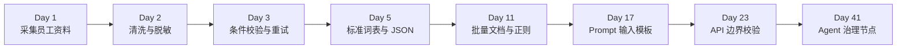
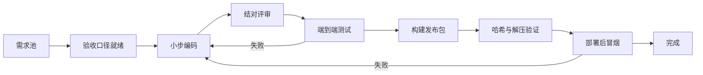
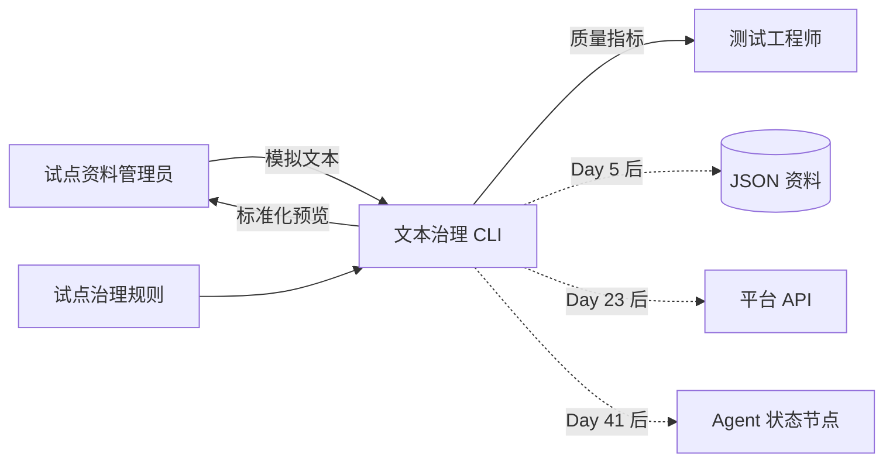
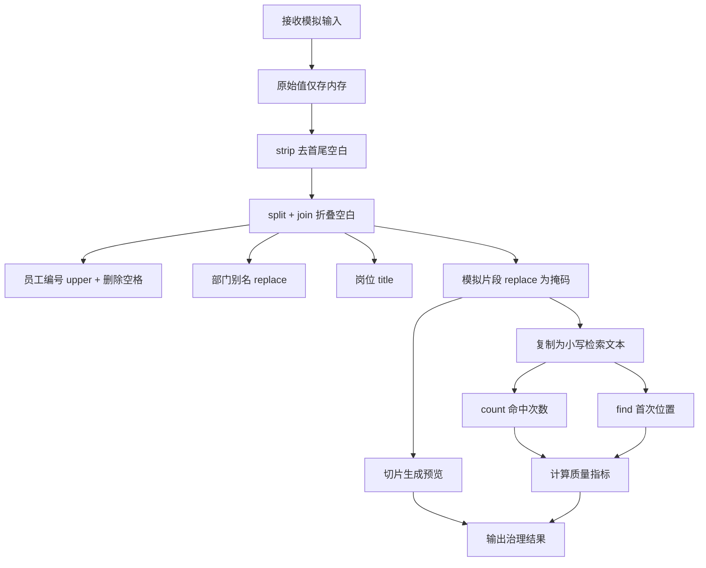
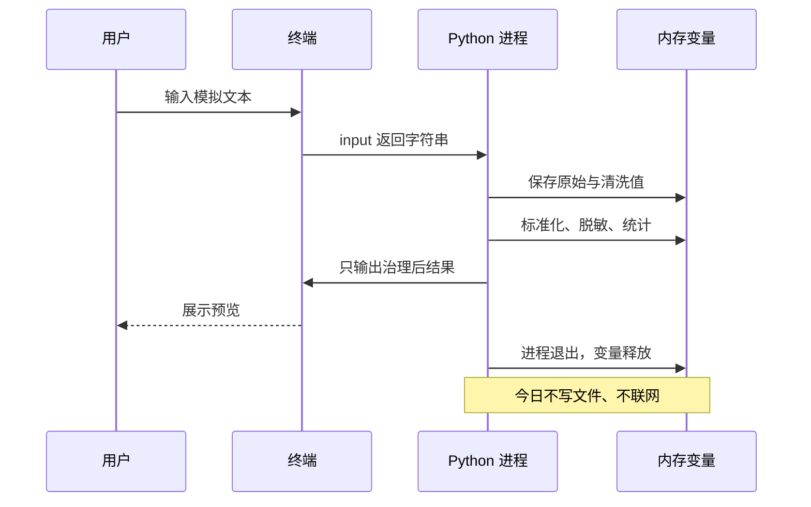
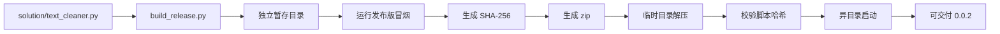
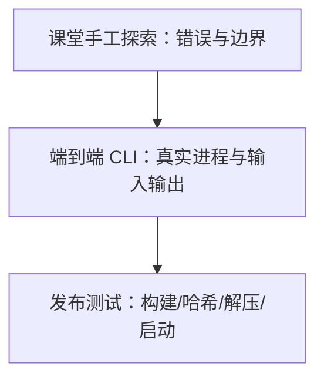
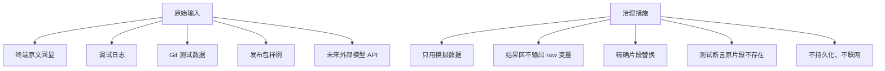
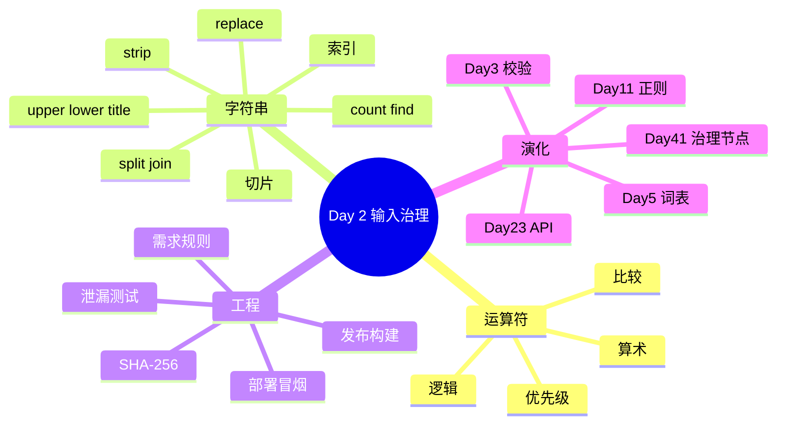

# Day 2｜让脏文本进入 Agent 之前先变干净：字符串、运算符与输入治理

> 课程阶段：第一阶段·Python 编程基础  
> 建议课时：授课 3 小时 + 实操 3.5 小时 + 晚自习 2 小时  
> 项目版本：NexusAI 0.0.2  
> 今日需求编号：US-FOUNDATION-002  
> 前置产物：Day 1 员工信息卡与字段字典  
> 今日交付：文本清洗 CLI、端到端验收、可校验发布包  

---

## 0. 开场旁白：Agent 的答案质量，从输入数据开始

【讲师旁白】

昨天，智枢项目组完成了第一个员工信息卡。业务负责人林岚试用后，把三条资料放到一起：

```text
员工 A：部门 = "客户服务部"
员工 B：部门 = "  客户服务中心  "
员工 C：部门 = "客服部"
```

三个人实际属于同一个部门，但程序会把它们视为三个不同字符串。另一位员工的任务描述是：

```text
"  Customer reports   ORDER-A100，手机号 DEMO-13800000000，等待查询 order 状态。 "
```

这里有首尾空格、连续空格、英文大小写差异和不应继续传播的模拟敏感片段。如果这些内容原样进入未来的 Prompt、向量库或审计日志，会产生一连串问题：同一部门无法统一授权；搜索 `order` 可能受大小写影响；多余空白浪费 Token；敏感内容可能发送给外部模型；数据质量报表把一个组织拆成多个组织。

今天我们不调用大模型。我们在模型入口之前增加第一道“输入治理”能力。它会标准化员工编号、折叠空白、统一已知部门别名、规范岗位英文大小写、精确替换模拟敏感片段，并提供关键词命中和字符质量指标。

这不是普通字符串练习。未来每一条发给模型的消息都必须经过边界治理。Day 2 的一行：

```python
task_description = task_description.replace(sensitive_fragment, "[已脱敏]")
```

会在 Day 11 演化为正则脱敏，在 Day 23 成为 API 请求校验，在 Day 41 成为 Agent 状态入口节点，在 Day 57 接入企业内容安全与审计策略。今天建立的是“外部输入不可信，进入核心系统前必须标准化”的工程习惯。



---

## 1. 昨日回顾、今日目标与完成定义

### 1.1 昨日可复用资产

Day 1 不是已经结束的孤岛，今天直接复用：

| Day 1 资产 | Day 2 用法 |
|---|---|
| `employee_id` 字符串 | 去空格并统一大写 |
| `department` 字符串 | 折叠空白、别名映射 |
| `job_title` 字符串 | 统一英文单词大小写 |
| 员工任务描述 | 增加为 Agent 个性化上下文 |
| 验收标准 | 延续 Given-When-Then |
| Git 提交规则 | 每个业务增量可追踪 |
| 技术债 TD-002 | 今天部分偿还“组织文本不统一” |

### 1.2 学习成果

完成课程后，学员能够：

1. 使用算术、比较和逻辑运算符表达简单业务规则。
2. 解释字符串索引从 `0` 开始、负索引从尾部开始。
3. 使用切片生成安全的固定长度预览。
4. 使用 `strip`、`split`、`join` 处理首尾和连续空白。
5. 使用 `lower`、`upper`、`title` 规范英文大小写。
6. 使用 `replace` 做明确、可审计的精确替换。
7. 使用 `count` 和 `find` 生成关键词统计。
8. 使用 f-string 的格式说明符展示百分比。
9. 区分“文本清洗”“数据校验”“隐私脱敏”的边界。
10. 运行端到端测试并构建带 SHA-256 的发布包。

### 1.3 今日完成定义

- [ ] `text_cleaner.py` 能在 Python 3.10+ 启动。
- [ ] ` e 10086 ` 被标准化为 `E10086`。
- [ ] 连续空白被折叠为单空格。
- [ ] `客户服务中心`、`客服部` 统一为 `客户服务部`。
- [ ] 英文岗位 `ai support engineer` 变为 `Ai Support Engineer`。
- [ ] 用户指定的模拟敏感片段不会出现在输出中。
- [ ] 关键词检索不受英文大小写影响。
- [ ] 展示关键词次数与首次索引。
- [ ] 短文本切片不会报错。
- [ ] 端到端测试覆盖正常和边界场景。
- [ ] 发布包经过构建、哈希校验、解压和异目录启动测试。
- [ ] 课件质量门禁通过。

### 1.4 今日范围边界

今天不做：

- 不用 `if` 判断空输入，Day 3 实现。
- 不用循环反复要求用户输入，Day 3 实现。
- 不使用字典维护大规模别名，Day 5 实现。
- 不使用函数封装清洗规则，Day 6 实现。
- 不用正则识别手机号和身份证，Day 11 实现。
- 不保存原始或清洗后文本，Day 5/11 实现。
- 不声称精确替换等价于生产级隐私防护。

范围边界必须写在需求和界面里。“有一个 `replace`”不代表系统已经满足全部合规要求。

---

## 2. 今日企业迭代节奏

| 时间 | 团队活动 | 知识与实操 | 交付证据 |
|---|---|---|---|
| 09:00-09:20 | 晨会 | 回顾 Day 1 缺陷与今日风险 | 站会记录 |
| 09:20-10:00 | 数据质量评审 | 脏数据样本、治理口径 | 需求文档 |
| 10:00-10:10 | 休息 | — | — |
| 10:10-11:00 | 运算符实验 | 算术、比较、逻辑、优先级 | 实验记录 |
| 11:00-12:00 | 字符串实验 | 索引、切片、方法 | 随堂练习 |
| 14:00-14:20 | 计划会 | 任务拆分与验收数据 | 看板 |
| 14:20-15:20 | 结对编码一 | 标识、空白、别名标准化 | 0.0.2-alpha |
| 15:20-15:30 | 休息 | — | — |
| 15:30-16:20 | 结对编码二 | 脱敏、搜索、质量指标 | 0.0.2-rc |
| 16:20-17:00 | 全链路测试 | CLI 正常/边界/泄漏测试 | 验收报告 |
| 17:00-17:30 | 发布演练 | 构建、SHA-256、解压、冒烟 | zip 发布包 |
| 19:00-20:20 | 分层作业 | 清洗器扩展与评审 | 作业 |
| 20:20-21:00 | 复盘答疑 | 缺陷、债务、Day 3 输入 | 复盘卡 |



---

## 3. 企业需求文档

### 3.1 基本信息

| 项目 | 内容 |
|---|---|
| 需求名称 | 员工文本标准化与输入治理 |
| 编号 | US-FOUNDATION-002 |
| 提出人 | 客服运营负责人 |
| 产品负责人 | 周宁 |
| 技术负责人 | 陈工 |
| 安全评审 | 顾晴 |
| 目标版本 | NexusAI 0.0.2 |
| 优先级 | P0 |

### 3.2 业务问题

试点资料由不同员工手工输入，存在空白、大小写、部门别名和模拟敏感内容。未经治理的数据无法稳定用于身份匹配、统计、检索和模型上下文。项目组需要一个本地命令行工具验证最小规则，并证明清洗后的文本可以安全地进入下一环节。

### 3.3 用户故事

> 作为试点资料管理员，  
> 我希望在资料进入 Agent 平台前统一格式并替换指定敏感片段，  
> 从而减少重复数据、提高检索一致性并降低信息泄漏风险。

### 3.4 输入字段

| 字段 | 变量 | 示例 | 规则 |
|---|---|---|---|
| 原始员工编号 | `raw_employee_id` | ` e 10086 ` | 去首尾、内部空格，转大写 |
| 原始部门 | `raw_department` | ` 客户服务中心 ` | 折叠空白，映射已知别名 |
| 原始岗位 | `raw_job_title` | `ai support engineer` | 折叠空白，英文标题格式 |
| 原始任务描述 | `raw_task_description` | 含连续空格的模拟文本 | 折叠空白、精确脱敏 |
| 模拟敏感片段 | `sensitive_fragment` | `DEMO-13800000000` | 全部替换为 `[已脱敏]` |
| 检索词 | `search_keyword` | `ORDER` | 去空格、转小写 |

### 3.5 输出字段

| 字段 | 含义 |
|---|---|
| 标准员工编号 | 后续身份键的候选值 |
| 标准部门/岗位 | 后续权限和个性化上下文 |
| 清洗后描述 | 可进入后续治理链路的文本 |
| 30 字符预览 | 列表界面预览雏形 |
| 首尾字符 | 索引/切片观察值 |
| 命中次数 | 关键词出现数量 |
| 首次命中索引 | `-1` 表示未找到 |
| 字符差值 | 清洗前后总长度差 |
| 字符保留比例 | 清洗后长度/原始长度 |

### 3.6 验收标准

**AC-01 标识标准化**

- Given 原始员工编号为 ` e 10086 `。
- When 执行清洗。
- Then 输出员工编号为 `E10086`。

**AC-02 组织标准化**

- Given 部门为 `客户服务中心` 或 `客服部`。
- When 执行规则。
- Then 输出均为 `客户服务部`。

**AC-03 空白治理**

- Given 任务文本含首尾空格、连续空格或 Tab。
- When 执行清洗。
- Then 首尾空白消失，词间连续空白统一为一个半角空格。

**AC-04 精确脱敏**

- Given 用户指定模拟片段 `DEMO-13800000000`。
- When 该片段在任务中出现一次或多次。
- Then 输出中不得出现原片段，每处显示 `[已脱敏]`。

**AC-05 大小写无关检索**

- Given 任务中有 `ORDER-A100` 和 `order`。
- When 检索词输入 `ORDER`。
- Then 命中次数为 `2`，首次索引为 `17`。

**AC-06 短文本预览**

- Given 清洗后任务为 `查件`。
- When 生成 30 字符预览。
- Then 输出 `查件` 且程序不报错。

**AC-07 未命中语义**

- Given 任务中没有 `退款`。
- When 查询 `退款`。
- Then 次数为 `0`，首次索引为 `-1`。

**AC-08 发布独立性**

- Given 发布 zip 已解压到仓库之外。
- When 使用 Python 3.10+ 启动其中脚本。
- Then 核心清洗能力正常，不依赖仓库内其他文件。

### 3.7 非功能要求

- 安全：原始任务和模拟敏感片段不出现在结果区，不持久化。
- 可解释：每条试点规则在需求中有明确来源。
- 兼容：只依赖 Python 标准库，支持 Python 3.10+。
- 可移植：发布包在独立临时目录运行。
- 完整性：发布脚本附 SHA-256。
- 可测试：真实 CLI 进程可接受模拟输入并捕获输出。
- 性能：单条短文本应即时完成；今天不做批量性能承诺。

### 3.8 风险、假设与决策

| 编号 | 内容 | 结论 |
|---|---|---|
| R-02-01 | 空的敏感片段会导致 `replace("", MASK)` 插入大量掩码 | Day 3 校验非空 |
| R-02-02 | 精确值替换不能自动识别未知手机号 | Day 11 正则治理 |
| R-02-03 | `.title()` 会把 AI 变成 Ai | 试点接受，Day 5 词表修正 |
| R-02-04 | 多个部门别名靠多行 replace 难维护 | Day 5 字典映射 |
| R-02-05 | 原始总长度为零会除零 | 验收假设非空，Day 3 防护 |
| ADR-002 | Day 2 发布单文件标准库 CLI | 降低零基础环境复杂度 |

---

## 4. 架构设计与数据流

### 4.1 系统上下文



### 4.2 清洗流水线



顺序很重要。先折叠空白再检索，索引对应的是“清洗后可见文本”；先脱敏再输出，敏感片段不会经过预览路径泄漏。若先生成预览再脱敏，预览可能含原始敏感内容。

### 4.3 数据生命周期



### 4.4 发布链路



【架构旁白】

Day 2 所说的部署不是生产服务器上线。当前产品是单文件本地 CLI，最合理的部署形态是可复现的 zip 分发。过早使用 Docker并不会让程序更企业级，反而会掩盖基础问题。企业级意味着交付物与当前风险匹配：文件集合明确、来源可验证、在目标环境可启动、测试有证据。Day 56 才会把完整服务容器化。

---

## 5. 运算符课堂笔记

### 5.1 算术运算符

```python
raw_length = 100
clean_length = 82

removed = raw_length - clean_length
retention = clean_length / raw_length * 100
print(f"字符差值：{removed}")
print(f"保留比例：{retention:.1f}%")
```

常见运算符：

| 运算符 | 作用 | 示例 | 结果 |
|---|---|---|---|
| `+` | 加法/字符串拼接 | `2 + 3` | `5` |
| `-` | 减法 | `100 - 82` | `18` |
| `*` | 乘法/字符串重复 | `"=" * 3` | `===` |
| `/` | 除法 | `5 / 2` | `2.5` |
| `//` | 整除 | `5 // 2` | `2` |
| `%` | 取余 | `5 % 2` | `1` |
| `**` | 幂 | `2 ** 3` | `8` |

数据治理中，长度差可能为负数。例如把敏感片段 `x` 替换成 `[已脱敏]` 会增加字符数。因此“字符差值”只是观测，不应简单解释为越大越好。

### 5.2 运算优先级

```python
retention_percent = clean_total_length / raw_total_length * 100
```

乘除同级，从左向右。为了让业务口径更醒目，可以写：

```python
retention_percent = (clean_total_length / raw_total_length) * 100
```

括号不是多余装饰，它降低阅读者的推理成本。复杂公式先拆变量再组合。

### 5.3 比较运算符

```python
print(clean_length == raw_length)
print(clean_length != raw_length)
print(clean_length < raw_length)
print(keyword_count >= 1)
```

比较结果是 `bool`。今天观察结果，Day 3 用它控制程序分支。

`=` 是赋值，`==` 是比较：

```python
department = "客户服务部"
print(department == "客户服务部")
```

### 5.4 逻辑运算符

```python
has_keyword = keyword_count > 0
has_changed = clean_total_length != raw_total_length
ready_for_review = has_keyword and has_changed
```

- `and`：两边都为真。
- `or`：至少一边为真。
- `not`：逻辑取反。

今天不依赖逻辑分支完成主流程，但用真值表建立概念：

| A | B | A and B | A or B |
|---|---|---|---|
| True | True | True | True |
| True | False | False | True |
| False | True | False | True |
| False | False | False | False |

生产规则要警惕过长逻辑表达式。先给中间布尔变量起业务名字，比一口气写十个条件更可读。

### 5.5 字符串运算

```python
department = "客户" + "服务部"
separator = "-" * 20
print("服务" in department)
print("财务" not in department)
```

`in` 判断子串是否存在。与 `find` 不同，它返回布尔值，不告诉位置。需求只问“有没有”时用 `in` 更自然；需要索引时用 `find`。

---

## 6. 字符串索引与切片课堂笔记

### 6.1 索引从零开始

字符串 `ORDER` 的位置：

```text
字符： O  R  D  E  R
正索引 0  1  2  3  4
负索引-5 -4 -3 -2 -1
```

```python
text = "ORDER"
print(text[0])   # O
print(text[-1])  # R
```

直接访问空字符串的 `text[0]` 会 `IndexError`。今日参考实现采用：

```python
first_character = task_description[0:1]
```

空字符串切片安全返回空字符串。这样展示功能无需提前引入 `if`。

### 6.2 切片规则

```python
text[start:stop:step]
```

包含 `start`，不包含 `stop`：

```python
text = "ORDER-A100"
print(text[0:5])   # ORDER
print(text[:5])    # ORDER
print(text[6:])    # A100
print(text[-4:])   # A100
print(text[::-1])  # 001A-REDRO
```

30 字符预览：

```python
task_preview = task_description[:30]
```

字符串短于 30 时返回完整字符串；长于 30 时只返回前 30 个字符。它按 Unicode 字符切片，不等价于界面像素宽度，也不保证不会截断一个语义词组。Day 22 的 Web UI 会处理显示省略，Day 28 文档分块会讨论语义边界。

### 6.3 字符串不可变

```python
raw = "  客服部  "
clean = raw.strip()
```

`strip()` 不会修改 `raw`，而是返回新字符串。必须接住返回值：

```python
# 无效：结果被丢弃
raw.strip()

# 有效
clean = raw.strip()
```

保留 `raw_*` 与清洗变量便于计算差异，但原始值风险更高。生产系统是否保留原文必须遵循数据策略，不能为了“方便调试”无限期保存。

---

## 7. 字符串方法课堂笔记

### 7.1 `strip`

```python
raw = "\t  客户服务部  \n"
clean = raw.strip()
```

默认移除两端空白，不删除中间空格。`lstrip` 只处理左边，`rstrip` 只处理右边。

注意：

```python
"www.example.com".strip("com.")
```

参数不是“删除完整后缀”，而是移除两端属于给定字符集合的字符。处理前后缀应使用更明确的方法；今天不滥用带参数的 `strip`。

### 7.2 `split` 与 `join`

```python
raw = "  Customer   reports\tORDER  "
words = raw.split()
clean = " ".join(words)
```

执行后：

```text
words = ["Customer", "reports", "ORDER"]
clean = "Customer reports ORDER"
```

不传参数的 `split()` 会把连续空白视为分隔，并忽略两端空白。这正适合当前规则。若写 `split(" ")`，Tab 不会被处理，连续空格还可能产生空字符串。

`join` 的调用者是连接符：

```python
"-".join(["A", "B", "C"])  # A-B-C
```

常见错误是写成 `words.join(" ")`。

### 7.3 大小写方法

```python
employee_id = " e10086 ".strip().upper()
keyword = "ORDER".lower()
job_title = "ai support engineer".title()
```

- `upper()`：英文转大写。
- `lower()`：英文转小写。
- `title()`：英文单词首字母大写。
- 中文通常保持不变。

大小写转换不等于完整的国际化规范。例如缩写 AI 变成 Ai，人名和某些语言也有特殊规则。今天只实现经过业务确认的试点规则。

### 7.4 `replace`

```python
department = department.replace("客户服务中心", "客户服务部")
task = task.replace(sensitive_fragment, "[已脱敏]")
```

`replace` 默认替换全部精确匹配。它区分大小写，也不会理解“这是手机号”。优点是规则简单、可预测；缺点是只处理已知文本。

危险边界：

```python
"abc".replace("", "[已脱敏]")
```

会在字符之间插入替换文本。今日假设敏感片段非空，Day 3 必须在调用前校验。

### 7.5 `count`

```python
searchable = "ORDER-A100 and order-b200".lower()
count = searchable.count("order")
```

结果为 `2`。`count` 统计不重叠匹配：

```python
"aaaa".count("aa")  # 2
```

它不是分词器。查询 `or` 也可能命中 `order` 的一部分。后续语义检索不能依靠简单子串统计。

### 7.6 `find`

```python
index = searchable.find("order")
```

找到时返回首次起始索引，未找到返回 `-1`。与 `index()` 相比，`find()` 未命中不会抛异常，适合今天在尚未学习异常处理时输出观测值。

`-1` 必须在接口文档中说明。用户可能误以为它表示“倒数第一个字符”，但在 `find` 结果中约定为未找到。

### 7.7 `len`

```python
length = len(task_description)
```

`len` 返回 Python 字符串中的字符数量，不是 UTF-8 字节数，也不是 Token 数，更不是屏幕宽度。Day 15 会使用模型分词器计算 Token，不能拿字符数直接当 API 成本。

---

## 8. 课堂实操：逐步形成治理流水线

### 8.1 实操一：制造脏数据

输入：

```text
员工编号： e 10086
部门：  客户服务中心
岗位： ai support engineer
任务：  Customer reports   ORDER-A100
```

先原样输出，记录问题。没有坏样本就无法证明清洗规则有价值。

### 8.2 实操二：员工编号

```python
raw_employee_id = input("员工编号：")
employee_id = raw_employee_id.strip().upper().replace(" ", "")
```

从左到右观察每一步：

```python
print(raw_employee_id)
print(raw_employee_id.strip())
print(raw_employee_id.strip().upper())
print(raw_employee_id.strip().upper().replace(" ", ""))
```

最终删除的是半角空格。全角空格和其他隐藏字符需要更完整规则，今天记录边界。

### 8.3 实操三：折叠空白

```python
raw_task_description = input("工作描述：")
task_description = " ".join(raw_task_description.split())
```

在输入中加入多个空格或 Tab。对照清洗前后 `repr` 是更精确的观察方式，但零基础课堂可先用方括号包围输出：

```python
print(f"原始：[{raw_task_description}]")
print(f"清洗：[{task_description}]")
```

正式结果不输出原文，调试输出验证后删除。

### 8.4 实操四：部门别名

```python
department = department.replace("客户服务中心", "客户服务部")
department = department.replace("客服部", "客户服务部")
```

运行三次，分别输入标准名、旧称和简称。标准名应保持不变，两个别名应统一。规则顺序可能互相影响，增加规则前必须补测试。

### 8.5 实操五：模拟脱敏

```python
sensitive_fragment = input("模拟敏感片段：").strip()
task_description = task_description.replace(sensitive_fragment, "[已脱敏]")
```

只允许虚构值，如 `DEMO-13800000000`。检查终端结果中原片段是否完全消失。不要截图包含真实联系方式的终端。

### 8.6 实操六：不区分大小写检索

```python
search_keyword = input("检索词：").strip().lower()
searchable_task = task_description.lower()
keyword_count = searchable_task.count(search_keyword)
first_keyword_index = searchable_task.find(search_keyword)
```

必须同时把文本和关键词转换为同一种大小写。只转换一边会留下不一致。

### 8.7 实操七：切片与指标

```python
task_preview = task_description[:30]
first_character = task_description[0:1]
last_character = task_description[-1:]
```

质量指标：

```python
raw_total_length = (
    len(raw_employee_id)
    + len(raw_department)
    + len(raw_job_title)
    + len(raw_task_description)
)
clean_total_length = (
    len(employee_id)
    + len(department)
    + len(job_title)
    + len(task_description)
)
normalized_character_count = raw_total_length - clean_total_length
retention_percent = clean_total_length / raw_total_length * 100
```

这里没有把 `sensitive_fragment` 和 `search_keyword` 纳入业务资料长度，因为它们是操作参数，不是员工资料。

### 8.8 实操八：治理后输出

输出顺序应保证只展示标准化变量：

```python
print(f"员工编号        ：{employee_id}")
print(f"部门 / 岗位     ：{department} / {job_title}")
print(f"清洗后工作描述  ：{task_description}")
print(f"命中次数        ：{keyword_count}")
print(f"首次命中索引    ：{first_keyword_index}")
print(f"字符保留比例    ：{retention_percent:.1f}%")
```

代码评审时搜索所有 `raw_` 变量是否被打印。原始员工编号虽然风险较低，但统一原则是结果区只输出治理值。

---

## 9. 参考实现逐段解读

仓库位置：

```text
course/day02/starter/text_cleaner.py
course/day02/solution/text_cleaner.py
course/day02/tests/test_text_cleaner.py
course/day02/deploy/build_release.py
course/day02/tests/test_release.py
```

### 9.1 配置常量

```python
PRODUCT_NAME = "智枢 NexusAI"
CARD_WIDTH = 64
MASK = "[已脱敏]"
```

统一掩码是产品约定，不让每一行散落不同文本。Day 5 会把规则与配置整理为字典，Day 10 拆模块。

### 9.2 保留原始值的目的与风险

```python
raw_department = input("部门：")
department = " ".join(raw_department.split())
```

保留原值只为本次运行计算差异。它既有诊断价值，也增加敏感面。今日不写磁盘、不输出、不联网，进程退出即释放。生产日志不得默认记录请求原文。

### 9.3 链式调用的可读性

```python
employee_id = raw_employee_id.strip().upper().replace(" ", "")
```

每一步都返回字符串，适合链式表达。若链条超过阅读负担，拆成有意义变量。不要用“行数越少越高级”衡量代码质量。

### 9.4 为什么先创建 `searchable_task`

```python
searchable_task = task_description.lower()
```

检索副本只服务比较，不改变最终展示的大小写。若直接把 `task_description` 转小写，用户看到的 `Customer` 会变成 `customer`，属于不必要的数据损失。

### 9.5 为什么使用安全切片

`task_description[0]` 对空字符串报错，`task_description[0:1]` 返回空字符串。虽然 Day 3 会禁止空任务，但展示层仍采用更稳健的切片成本很低。

### 9.6 为什么当前指标可能超过 100%

掩码可能比原敏感片段更短，也可能更长；部门别名也可能变长。`retention_percent` 可能超过 100%。因此界面叫“字符保留比例”，而不是“清洗率”或“质量分”。指标命名不能暗示未经证明的价值。

---

## 10. 测试策略与全链路验收

### 10.1 测试金字塔在 Day 2 的简化形态



由于业务代码尚未学习函数，无法优雅地逐函数单元测试。今天选择真实进程端到端测试，代价是定位粒度较粗；Day 6 重构函数后补单元测试。

### 10.2 正常场景

测试输入：

```text
 e 10086
  客户服务中心
 ai support engineer
  Customer reports   ORDER-A100，手机号 DEMO-13800000000，请查询 order 状态。
DEMO-13800000000
ORDER
```

关键断言：

- 退出码为 0。
- 员工编号是 E10086。
- 部门是客户服务部。
- 岗位是 Ai Support Engineer。
- 输出不含 `DEMO-13800000000`。
- 输出含 `[已脱敏]`。
- 命中次数 2。
- 首次索引 17。

### 10.3 边界场景

```text
e20002
<Tab>客服部<Tab>
客服专员
  查件
不存在的模拟片段
退款
```

预期：

- 短预览为“查件”。
- 首尾字符为“查 / 件”。
- 命中 0。
- 首次索引 -1。
- 程序不异常。

### 10.4 泄漏测试

安全断言不是只检查掩码存在：

```python
assert sensitive_demo not in normal_result.stdout
assert "[已脱敏]" in normal_result.stdout
```

两者缺一不可。只检查掩码存在，程序可能同时输出原文和掩码；只检查原文不存在，程序可能把整段任务错误删除。

### 10.5 发布测试

发布测试验证：

1. 构建脚本正常退出。
2. zip 文件真实存在。
3. zip 只含脚本、README、SHA256SUMS。
4. 解压后的脚本哈希与清单一致。
5. 从仓库之外的临时目录启动。
6. 部门、岗位与脱敏仍正确。

运行：

```bash
python3 course/day02/tests/test_text_cleaner.py
python3 course/day02/tests/test_release.py
```

### 10.6 测试报告模板

```text
版本：NexusAI 0.0.2
需求：US-FOUNDATION-002
解释器：
操作系统：

功能端到端：通过/失败
敏感片段泄漏：通过/失败
边界预览：通过/失败
发布构建：通过/失败
哈希完整性：通过/失败
异目录启动：通过/失败

阻塞缺陷：
已知限制：
发布结论：
```

---

## 11. 构建、部署与回滚演练

### 11.1 构建命令

```bash
python3 course/day02/deploy/build_release.py --output artifacts/day02
```

产物：

```text
artifacts/day02/
├── nexus-text-cleaner-0.0.2/
│   ├── README.txt
│   ├── SHA256SUMS
│   └── text_cleaner.py
└── nexus-text-cleaner-0.0.2.zip
```

`artifacts/` 是本地构建结果，不提交 Git。源代码与构建脚本可重现它。

### 11.2 SHA-256 的作用

SHA-256 根据文件字节生成固定长度摘要。接收方重新计算后若不同，说明文件发生变化。它提供完整性检查，不自动证明发布者身份，也不等于数字签名。不要把“哈希一致”夸大成全部供应链安全。

### 11.3 部署步骤

1. 获取 `nexus-text-cleaner-0.0.2.zip`。
2. 记录发布方提供的压缩包摘要。
3. 解压到空目录。
4. 检查仅包含预期三项文件。
5. 校验 `text_cleaner.py` 与 `SHA256SUMS`。
6. 运行 `python3 text_cleaner.py`。
7. 使用模拟冒烟数据。
8. 检查员工编号、部门、岗位、脱敏和退出码。

### 11.4 回滚

当前工具不写数据，因此回滚只需停止使用 0.0.2，恢复经过验证的上一发布包。若版本已被篡改或测试失败：

- 隔离失败包，不继续分发。
- 保留哈希、环境、命令和错误证据。
- 恢复上一已知可用版本。
- 建立缺陷并修复源代码。
- 重新走完整构建链路，不直接手改 zip。

未来写数据库后，代码回滚与数据迁移回滚将是两个问题。

### 11.5 部署验收不是开发机验收

直接运行 `solution/text_cleaner.py` 成功，只证明源目录可运行。发布测试必须解压到独立目录，防止脚本暗中依赖仓库路径、测试文件或本机配置。今天的 `test_release.py` 使用临时目录模拟这一事实。

---

## 12. 安全与隐私评审

### 12.1 威胁图



### 12.2 今天能保证什么

- 对用户明确指定的非空模拟片段执行全部精确替换。
- 治理结果不输出该片段。
- 自动测试防止样例片段回归泄漏。
- 程序不写磁盘、不联网。

### 12.3 今天不能保证什么

- 不能自动识别任意手机号、证件号、地址。
- 不能识别变体、空格分隔或同音替代。
- 不能判断上下文是否属于个人信息。
- 不能替代企业 DLP、内容审核或合规评估。

准确描述安全能力比写“已脱敏，绝对安全”更专业。

### 12.4 数据最小化

若业务不需要某字段，就不要采集。今天新增任务描述是为了后续个性化和检索实验，并使用模拟文本。不能为了测试字符串方法随意增加真实生日、家庭地址等字段。

---

## 13. 团队协作模拟

### 13.1 晨会

**学员**：昨天完成员工卡，今天处理 TD-002 的文本不一致。  
**产品经理**：先支持两个确认过的部门别名，不扩成组织系统。  
**测试工程师**：验收必须证明原模拟敏感片段不在输出。  
**安全同事**：界面注明只使用模拟值，不能宣传生产级脱敏。  
**技术负责人**：发布形态采用单文件 zip，验证异目录运行。

### 13.2 需求评审争议

产品提议：“把所有空格都删掉更干净。”

工程师给出反例：

```text
Customer reports ORDER
```

删除全部空格变成：

```text
CustomerreportsORDER
```

语义和可读性受损。因此规则是“删除首尾、折叠连续空白”，不是“删除所有空格”。员工编号是例外，因为它是无空格标识符。治理规则必须按字段语义设计。

### 13.3 任务拆分

| 任务 | 验收证据 |
|---|---|
| DEV-02-01 编号标准化 | AC-01 |
| DEV-02-02 组织与岗位标准化 | AC-02/03 |
| DEV-02-03 精确脱敏 | AC-04 |
| DEV-02-04 检索与预览 | AC-05/06/07 |
| TEST-02-01 CLI 端到端 | 两个场景通过 |
| OPS-02-01 发布构建 | zip 与 SHA-256 |
| OPS-02-02 部署冒烟 | 独立目录通过 |

### 13.4 代码评审清单

- [ ] 规则来源能对应验收标准。
- [ ] 原始变量未进入结果区。
- [ ] 敏感片段先替换再切片。
- [ ] 文本与关键词统一大小写后比较。
- [ ] 空白使用无参数 `split()` 折叠。
- [ ] 部门规则不会破坏标准名称。
- [ ] 未命中 `-1` 有文档说明。
- [ ] 构建包不包含缓存和本地配置。
- [ ] 测试检查“不泄漏”而非只检查“有掩码”。

### 13.5 评审反馈示例

```text
观察：第 42 行先生成 task_preview，第 47 行才替换 sensitive_fragment。
影响：若敏感片段位于前 30 个字符，预览会泄漏原文。
建议：把精确替换移动到所有切片和输出之前，并增加泄漏断言。
```

这是基于数据流的反馈，不是审美争论。

---

## 14. 常见错误与排障

### 14.1 方法忘记括号

```python
employee_id = raw_employee_id.upper
```

这里保存的是方法对象，不是转换结果。应为：

```python
employee_id = raw_employee_id.upper()
```

### 14.2 未接收返回值

```python
department.strip()
print(department)
```

字符串不可变，原变量没变化：

```python
department = department.strip()
```

### 14.3 `join` 方向错误

错误：

```python
words.join(" ")
```

正确：

```python
" ".join(words)
```

### 14.4 只把关键词转小写

```python
keyword = input("检索词：").lower()
count = task_description.count(keyword)
```

任务中的 `ORDER` 仍为大写。正确：

```python
count = task_description.lower().count(keyword)
```

### 14.5 用 `index` 处理可能未命中

`index()` 未找到会抛 `ValueError`。今天使用 `find()` 返回 `-1`，Day 3 再根据结果显示友好文案。

### 14.6 空敏感词导致异常结果

不是 Python 出错，而是需求前置条件未校验。记录最小复现：

```text
敏感片段输入：直接回车
实际：每个字符间插入掩码
期望：提示不可为空并重新输入
计划：Day 3 条件与循环
```

### 14.7 发布测试通过但源测试失败

先确认执行的是同一提交的构建产物，清理旧输出目录并重新构建。构建脚本已主动删除同名暂存目录，避免旧文件污染。

### 14.8 高质量求助模板

```text
目标：ORDER 与 order 均应被检索
输入：任务 "ORDER-A100 and order-b200"，关键词 "ORDER"
实际：命中 1
预期：命中 2
相关代码：task_description.count(search_keyword.lower())
判断：只转换了关键词，没有转换任务副本
环境：Python 3.12
```

---

## 15. 随堂练习与答案

### 练习 1：预测空白清洗

```python
raw = "  A   B\tC  "
print(" ".join(raw.split()))
```

答案：`A B C`。

### 练习 2：索引

`text = "Agent"`，`text[0]`、`text[-1]`、`text[1:4]` 分别是什么？

答案：`A`、`t`、`gen`。

### 练习 3：安全切片

为什么预览用 `text[:30]` 而不是逐个访问 30 个索引？

答案：切片简洁，文本不足 30 字符时安全返回已有部分；逐索引可能越界。

### 练习 4：字符串不可变

```python
name = "  张伟 "
name.strip()
print(f"[{name}]")
```

答案：仍含空白，因为返回值未赋回。修复 `name = name.strip()`。

### 练习 5：`find`

```python
"abcabc".find("bc")
```

答案：`1`，返回第一次匹配起始位置。

### 练习 6：`count`

```python
"Order order ORDER".lower().count("order")
```

答案：`3`。

### 练习 7：运算优先级

```python
clean = 80
raw = 100
print(clean / raw * 100)
```

答案：`80.0`。

### 练习 8：规则评审

“将所有文本统一 lower 后保存”有什么风险？

答案：会破坏展示、专有名词和部分标识的原始形式。应创建检索副本，展示值保留规范大小写。

### 练习 9：安全断言

为什么只写 `assert "[已脱敏]" in output` 不够？

答案：程序可能同时输出原始敏感值和掩码，仍然泄漏；还要断言原值不在输出。

### 练习 10：指标解释

字符保留比例 110% 是否一定是 Bug？

答案：不一定。替换掩码或标准名称可能比原文本更长。指标应作为观测，不应直接当质量分。

---

## 16. 课后作业

### 16.1 基础作业 A：工单标题清洗器

输入工单编号、标题、渠道和模拟敏感片段。要求：

1. 工单编号去空格转大写。
2. 标题折叠连续空白。
3. 渠道转小写。
4. 模拟敏感片段替换为 `[已脱敏]`。
5. 输出标题前 20 字符。
6. 输出关键词出现次数和首次索引。
7. 不输出原始敏感片段。

验收数据：

```text
编号： t 1001
标题：  ORDER   delayed，contact DEMO-MOBILE
渠道： WEB
敏感片段：DEMO-MOBILE
关键词：order
```

### 16.2 进阶作业 B：Prompt 空白预处理器

输入 system 指令、user 输入和检索词，分别折叠空白，但不得把两段拼成一个无法区分角色的字符串。输出：

- 两段清洗后的文本。
- 各自长度。
- 总长度。
- user 输入前 25 字预览。
- 大小写无关关键词次数。

解释为什么角色边界不能通过简单字符串拼接丢失。

### 16.3 企业挑战 C：规则冲突分析

规则一：所有员工编号删除空格。  
规则二：所有自然语言只折叠空格。  
规则三：所有文本都转小写。  
规则四：模拟敏感片段精确替换。  

写一份 600 字以内评审，指出规则三为什么范围过大，并为标识、自然语言、检索副本、展示文本分别给出策略。

### 16.4 测试作业 D

为自己的基础作业写至少六个手工测试：

- 正常值。
- 首尾空白。
- 连续空格。
- 大小写关键词。
- 关键词未命中。
- 敏感片段出现两次。

每项必须先写预期，再运行实际。

### 16.5 发布作业 E

把作业脚本复制到一个全新的临时目录，只保留脚本和 README：

1. 从新目录启动。
2. 用验收数据冒烟。
3. 记录 Python 版本。
4. 记录文件 SHA-256。
5. 删除临时目录中的模拟输出。

---

## 17. 课后作业完整参考答案

### 17.1 基础作业 A 参考实现

```python
"""Day 2 基础作业：工单标题清洗器。"""

MASK = "[已脱敏]"

raw_ticket_id = input("工单编号：")
raw_title = input("工单标题：")
raw_channel = input("渠道：")
sensitive_fragment = input("模拟敏感片段：").strip()
keyword = input("检索词：").strip().lower()

ticket_id = raw_ticket_id.strip().upper().replace(" ", "")
title = " ".join(raw_title.split())
channel = raw_channel.strip().lower()
title = title.replace(sensitive_fragment, MASK)

searchable_title = title.lower()
preview = title[:20]
keyword_count = searchable_title.count(keyword)
first_index = searchable_title.find(keyword)

print("\n工单治理结果")
print(f"工单编号：{ticket_id}")
print(f"渠道：{channel}")
print(f"标题：{title}")
print(f"20 字预览：{preview}")
print(f"命中次数：{keyword_count}")
print(f"首次索引：{first_index}")
print("提示：原始文本未保存。")
```

验收结果应包含：

```text
工单编号：T1001
渠道：web
标题：ORDER delayed，contact [已脱敏]
命中次数：1
首次索引：0
```

### 17.2 进阶作业 B 参考实现

```python
"""Day 2 进阶作业：Prompt 空白预处理器。"""

raw_system_prompt = input("System 指令：")
raw_user_prompt = input("User 输入：")
keyword = input("检索词：").strip().lower()

system_prompt = " ".join(raw_system_prompt.split())
user_prompt = " ".join(raw_user_prompt.split())

system_length = len(system_prompt)
user_length = len(user_prompt)
total_length = system_length + user_length
user_preview = user_prompt[:25]
keyword_count = user_prompt.lower().count(keyword)

print("\nPrompt 预处理结果")
print(f"[system] {system_prompt}")
print(f"[user] {user_prompt}")
print(f"System 字符数：{system_length}")
print(f"User 字符数：{user_length}")
print(f"总字符数：{total_length}")
print(f"User 预览：{user_preview}")
print(f"User 关键词次数：{keyword_count}")
```

角色边界必须保留，因为模型 API 中 system 与 user 承担不同语义和优先级。若只拼成一段普通文本，后续无法稳定恢复消息角色，也增加指令与用户数据混淆风险。Day 16 会把它们放入标准消息结构。

### 17.3 企业挑战 C 参考答案

规则三“所有文本都转小写”范围过大。员工编号等标识符可以按企业规范统一大小写，因为它们用于精确匹配；自然语言展示文本不应无差别转小写，否则会破坏缩写、品牌、姓名和原始表达；检索场景可以创建临时小写副本，让比较不受英文大小写影响，但不覆盖展示值；敏感片段应在输出和后续传输之前替换，且原始值不进入日志。规则一适用于明确声明不允许空格的标识字段，不能套用到自然语言；规则二适合当前英文与中文混合的描述，但仍需评估换行是否有语义；规则四只覆盖已知精确片段，不应被描述为自动隐私识别。规则必须绑定字段、目的和生命周期，不能以“所有文本”为默认作用域。

### 17.4 测试作业 D 参考表

| 用例 | 输入变化 | 预期 |
|---|---|---|
| T01 | 标准输入 | 字段与计算正确 |
| T02 | 编号两端空白 | 输出无首尾空白 |
| T03 | 标题三个连续空格 | 输出单空格 |
| T04 | 标题 ORDER/检索 order | 命中 |
| T05 | 检索 refund | 次数 0、索引 -1 |
| T06 | 模拟片段出现两次 | 两处掩码，原值零出现 |

测试记录必须保存实际结果和结论，不能只写“测过了”。

### 17.5 发布作业 E 参考说明

Linux/macOS 可使用：

```bash
python3 --version
python3 ticket_cleaner.py
sha256sum ticket_cleaner.py
```

Windows PowerShell 可使用：

```powershell
py --version
py ticket_cleaner.py
Get-FileHash ticket_cleaner.py -Algorithm SHA256
```

不同平台命令不同，但验证目标一致：解释器版本明确、脚本在独立目录启动、摘要可记录、只使用模拟数据。

---

## 18. 讲师逐字稿

### 18.1 09:00 晨会

【讲师】

“昨天我们的程序相信用户输入的每一个字符。今天先看证据：同一个部门出现三个名字，一段任务描述有连续空格、大小写变化和模拟敏感片段。如果直接把它发给模型，问题不会被模型神奇修复，只会进入更昂贵、更难追踪的环节。今天的目标是在最靠近输入的位置降低不确定性。”

提问：

- 哪些变化只影响展示？
- 哪些变化影响权限匹配？
- 哪些内容根本不应进入模型？
- 清洗后还需不需要保留原文？

### 18.2 09:20 规则评审

【讲师】

“不要说‘把文本弄干净’，这无法验收。请把规则写成输入和确定输出：连续空白变一个空格；两个确认别名变标准部门；指定模拟片段全部变掩码。规则越明确，代码和测试越直接。”

### 18.3 10:10 运算符

【讲师】

“运算符不是为了做数学题。字符差值帮助观察规则影响，比较结果会成为明天的分支条件，逻辑运算会组合多个业务状态。先用真实字段理解，再抽象记忆符号。”

### 18.4 11:00 字符串

【讲师】

“字符串看起来像一整段文字，Python 允许按位置观察和截取。但位置不是语义。`[:30]` 适合预览，不适合 RAG 分块；`lower()` 适合比较副本，不一定适合保存。每个方法都要问：它作用于哪个字段、为了什么、会丢失什么。”

### 18.5 14:20 结对编码

【讲师】

“每完成一条规则就用一个最小反例验证。写 `strip` 后，在两端放空格；写 `split/join` 后，加入三个空格和 Tab；写大小写检索后，在正文放 ORDER 和 order；写脱敏后，断言原片段消失。不要等全部写完才运行。”

### 18.6 16:20 测试

【讲师】

“今天最关键的测试不是输出看起来整齐，而是敏感样例不再出现。安全属性经常是负向要求：某个值绝不能出现、某个文件绝不能进入发布包。负向要求同样可以自动验证。”

### 18.7 17:00 发布

【讲师】

“开发目录能运行不等于可交付。我们把脚本放进干净目录、生成说明与哈希、压缩、再解压到另一个临时目录运行。交付链每多一个未经验证的环节，就多一个现场失败机会。”

### 18.8 收尾

【讲师】

“Day 1 让系统得到身份字段，Day 2 让字段进入系统前有统一规则。明天会故意输入空敏感片段、负数、未知部门和错误菜单选项，用条件与循环让程序不再直接接受一切。平台的可靠性就是这样一层层形成。”

---

## 19. 课堂笔记速查页

```python
# 首尾空白
clean = raw.strip()

# 折叠任意连续空白
clean = " ".join(raw.split())

# 大小写
upper_value = raw.upper()
lower_value = raw.lower()
title_value = raw.title()

# 精确替换
masked = text.replace(secret, "[已脱敏]")

# 计数与位置
count = text.lower().count(keyword.lower())
index = text.lower().find(keyword.lower())

# 切片
preview = text[:30]
first = text[0:1]
last = text[-1:]

# 长度与比例
length = len(text)
percent = clean_length / raw_length * 100
print(f"{percent:.1f}%")
```



---

## 20. 复盘与次日衔接

### 20.1 复盘

**保持**

- 每条清洗规则都有坏样本和验收输出。
- 原始值与展示值分开。
- 脱敏发生在切片和输出之前。
- 发布包在独立目录验证。

**停止**

- 用“更干净”代替可验收规则。
- 把所有字段套同一大小写策略。
- 只验证掩码存在，不验证原值消失。
- 在 zip 内手工修改发布文件。

**开始**

- Day 3 校验空值、范围和菜单选项。
- 对无效输入给出明确反馈并允许重试。
- 为 `find == -1` 展示用户可读提示。
- 维护有效部门候选。

### 20.2 技术债更新

| 编号 | 状态 | 说明 | 下一步 |
|---|---|---|---|
| TD-002 | 部分完成 | 两个组织别名已统一 | Day 5 字典词表 |
| TD-007 | 新增 | 空敏感片段未拒绝 | Day 3 |
| TD-008 | 新增 | 原始总长度为零会除零 | Day 3 |
| TD-009 | 新增 | AI 被 title 转成 Ai | Day 5 |
| TD-010 | 新增 | 精确脱敏覆盖有限 | Day 11 |
| TD-011 | 新增 | 主流程未函数化 | Day 6 |

### 20.3 Day 3 输入

测试工程师赵敏提交四个失败样例：

```text
1. 员工编号为空
2. 模拟敏感片段直接回车
3. 月均工单输入 -5
4. 部门输入“宇宙部”
```

Day 3 将学习 `if/elif/else`、`while`、`for`、`range`、`break/continue`，把清洗器升级成能拒绝无效输入、给出原因并允许重试的交互程序。Day 2 的比较与逻辑表达式会直接成为条件。

### 20.4 离场检查

- [ ] 我能解释为什么员工编号和自然语言采用不同空格规则。
- [ ] 我能用 `split/join` 折叠连续空白。
- [ ] 我能解释字符串方法返回新值。
- [ ] 我能用安全切片处理短文本。
- [ ] 我知道 `find` 的 `-1` 含义。
- [ ] 我能实现大小写无关检索但保留展示大小写。
- [ ] 我能说明精确替换不是生产级自动脱敏。
- [ ] 我能解释为何泄漏测试需要两个断言。
- [ ] 我能说明发布包为何要在独立目录启动。
- [ ] 我知道明天要修复哪些无效输入。

---

## 21. 教学质量与交付验收

| 指标 | 目标 | 证据 |
|---|---:|---|
| 核心清洗完成率 | ≥ 90% | AC-01 至 AC-05 |
| 字符串练习正确率 | ≥ 85% | 随堂练习 |
| 敏感样例泄漏 | 0 | 自动断言 |
| 边界场景通过率 | 100% | E2E 第二场景 |
| 发布构建成功率 | 100% | 构建日志 |
| 哈希校验成功率 | 100% | 发布测试 |
| 异目录启动成功率 | 100% | 部署冒烟 |
| 真实隐私使用次数 | 0 | 评审 |

若泄漏断言或发布测试失败，不允许以“课堂演示能跑”为由交付。修复后必须重新执行功能端到端、发布构建、解压校验和部署后冒烟整条链路。

---

## 22. 今日交付清单与收尾旁白

```text
course/day02/day02-lesson.md
course/day02/starter/text_cleaner.py
course/day02/solution/text_cleaner.py
course/day02/tests/test_text_cleaner.py
course/day02/deploy/build_release.py
course/day02/tests/test_release.py
tools/verify_day02.py
```

【收尾旁白】

“昨天我们让平台认识员工，今天让平台不盲信员工输入。`strip` 去掉边界噪声，`split/join` 建立空白规范，`replace` 执行明确治理，`lower` 创建检索副本，`count/find` 提供可观察结果，切片形成预览，测试守住不泄漏要求，发布链证明离开开发目录仍能运行。这些能力很小，却共同构成企业 Agent 的输入边界。可靠平台不是靠最后加一句‘请注意安全’得到的，而是从每一个进入系统的字符串开始设计、验证和交付。”
