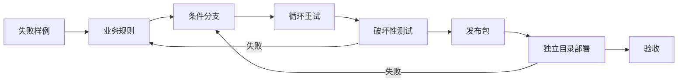
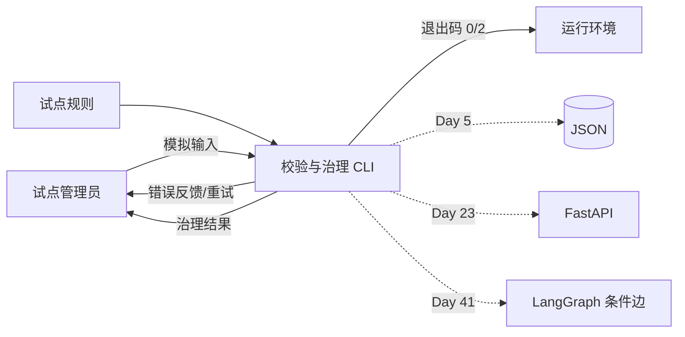
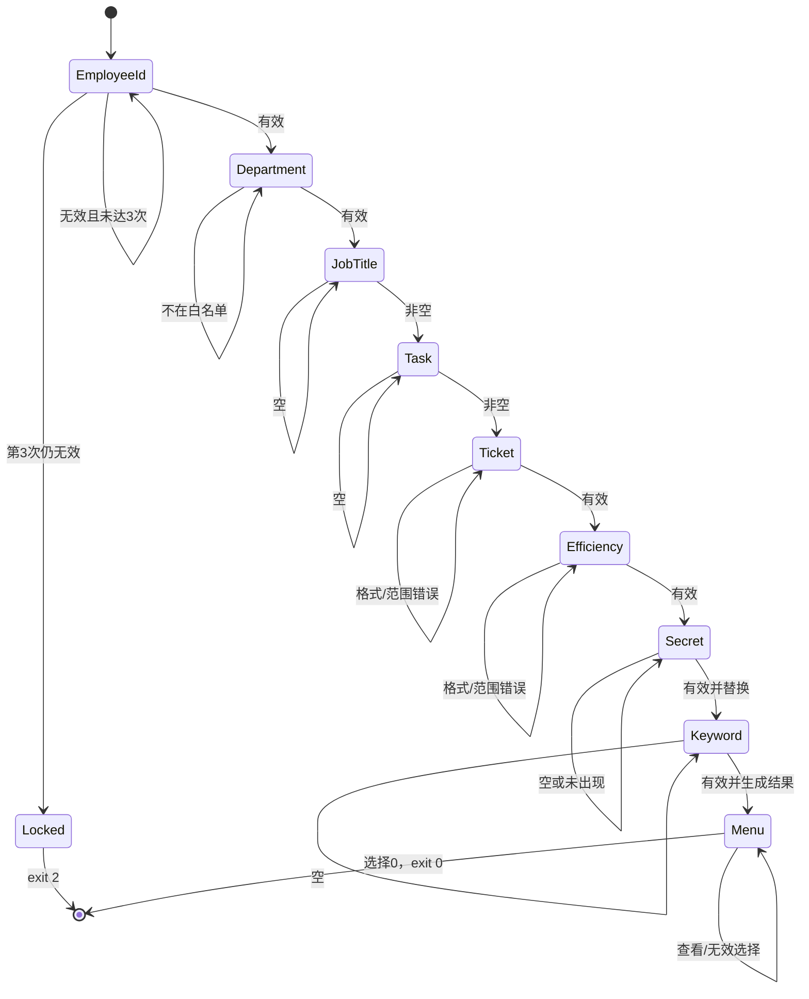
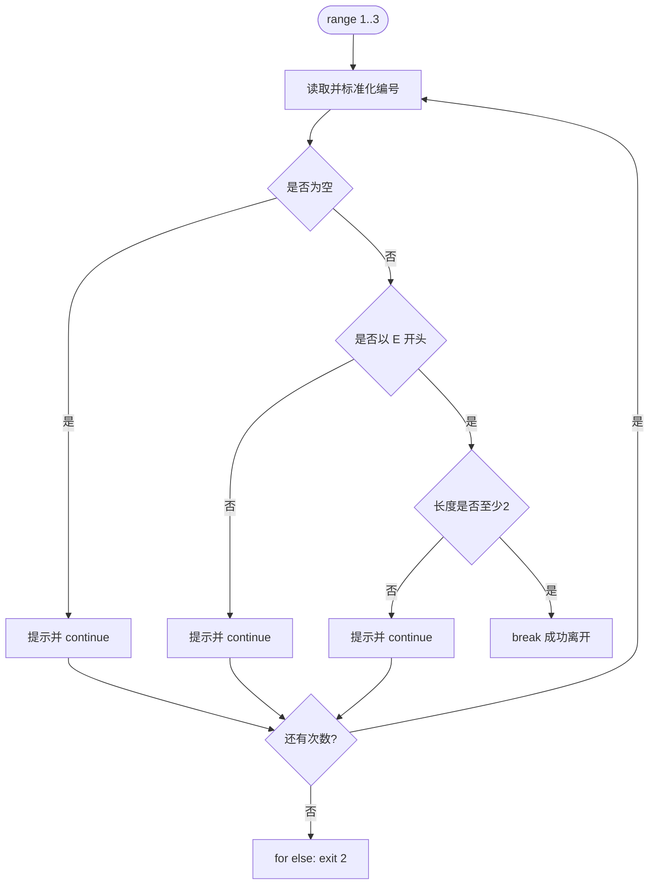
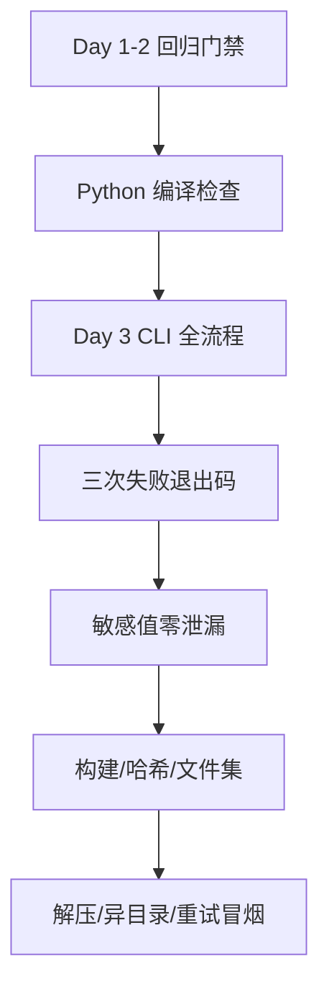
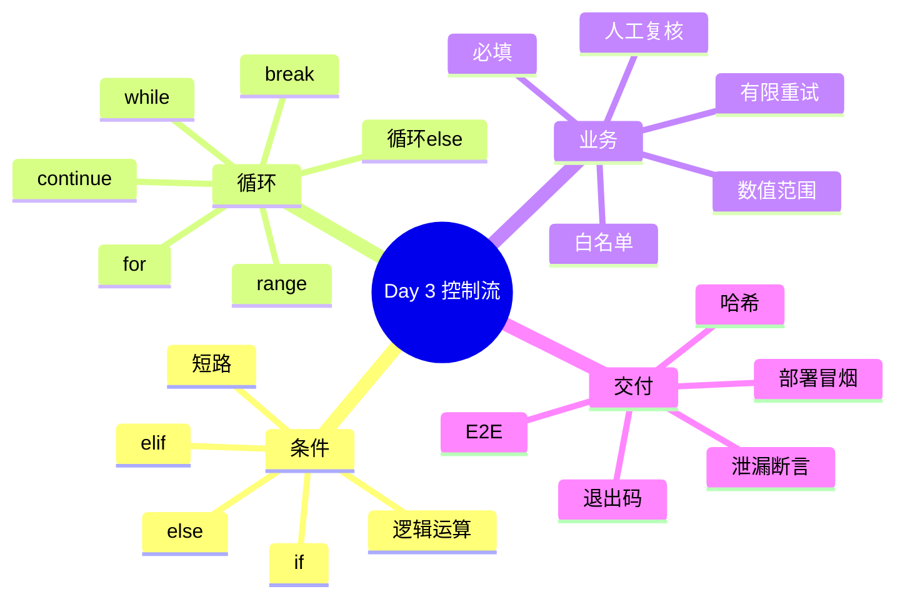

# Day 3｜让程序面对错误输入仍能工作：条件、循环与可恢复交互

> 课程阶段：第一阶段·Python 编程基础  
> 建议课时：授课 3 小时 + 实操 3.5 小时 + 晚自习 2 小时  
> 项目版本：NexusAI 0.0.3  
> 今日需求：US-FOUNDATION-003  
> 前置产物：Day 1 身份字段、Day 2 文本治理流水线  
> 今日交付：可校验治理 CLI、重试状态机、菜单、全链路发布包  

---

## 0. 开场旁白：真实用户不会永远按示例输入

【讲师旁白】

Day 2 的文本清洗器通过了既定样例，但测试工程师赵敏没有立即同意进入下一阶段。她在输入“模拟敏感片段”时直接按回车，结果 `replace("", "[已脱敏]")` 在每个字符之间插入掩码；她把月均工单写成 `-5`，业务指标失去意义；她输入不存在的“宇宙部”，程序照样把它交给后续流程；她把检索词留空，`count("")` 得到一个容易误解的数字。

这些不是用户“不会用”，而是软件没有守住自己的输入契约。企业应用不能把正确使用方式只写在培训手册里，然后期待每个人永不出错。系统必须在边界处判断：什么可以继续、什么需要重试、什么风险过高必须安全退出。

今天我们用 `if/elif/else` 表达选择，用 `while` 处理次数未知的重试，用 `for` 和 `range` 实现有限次数策略，用 `break` 离开已完成流程，用 `continue` 放弃本次无效输入。Day 2 的比较表达式今天不再只是打印 `True/False`，而是决定程序下一步行动。


Day 3 的控制流也是未来 Agent 工作流的最小原型：条件决定路由，循环实现重试，达到上限后转人工，菜单让用户选择动作。我们今天不用框架，先理解底层行为。

---

## 1. 昨日缺陷与今日完成定义

### 1.1 Day 2 缺陷转需求

| 缺陷 | Day 2 行为 | Day 3 目标 |
|---|---|---|
| 空员工编号 | 继续输出空身份 | 提示并重试，三次失败安全退出 |
| 未知部门 | 原样接受 | 只允许试点白名单 |
| 空岗位/任务 | 继续计算 | 必填，空值重试 |
| 工单 `abc` | 转换失败 | 格式判断后再转换 |
| 工单 `-5` | 可能接受 | 限定 1-10000 |
| 提效 `120` | 产生不合理指标 | 限定 0-100 |
| 空敏感片段 | 掩码插入字符间 | 明确拒绝 |
| 不存在的片段 | 声称已脱敏 | 要求片段确实存在 |
| 空检索词 | 计数无业务意义 | 明确拒绝 |
| 错误菜单 | 无菜单 | 提示后继续等待 |

### 1.2 学习成果

完成后能够：

1. 使用 `if/elif/else` 把业务规则变成分支。
2. 理解缩进决定代码块归属。
3. 使用比较与逻辑运算组合校验条件。
4. 使用 `while` 实现次数未知的重试。
5. 使用 `for range` 实现有限次数重试。
6. 区分 `break` 与 `continue`。
7. 理解循环 `else` 的执行条件。
8. 避免常见死循环和越界转换。
9. 用退出码区分正常退出与策略性拒绝。
10. 将交互流程表达为状态图并端到端验证。

### 1.3 完成定义

- [ ] 员工编号不能为空、必须以 E 开头、E 后有内容。
- [ ] 员工编号连续三次失败时退出码为 2。
- [ ] 部门只能为客户服务部、销售部或财务部。
- [ ] 两个客服别名继续映射为标准名称。
- [ ] 岗位和任务描述不能为空。
- [ ] 工单量只接受 1-10000 的整数。
- [ ] 提效比例只接受 0-100 的数字。
- [ ] 模拟敏感片段必须非空且存在于任务中。
- [ ] 检索词不能为空。
- [ ] 未命中或目标高于 80% 时标记人工复核。
- [ ] 菜单支持摘要、诊断、退出；非法项可恢复。
- [ ] 敏感样例不出现在终端输出。
- [ ] 功能、锁定、发布、哈希、解压和部署冒烟全通过。

### 1.4 今日不做

- 不用列表保存部门白名单，Day 4。
- 不用字典映射部门别名，Day 5。
- 不用函数消除重复，Day 6。
- 不用 `try/except` 解析任意数字格式，Day 10。
- 不用正则识别未知敏感数据，Day 11。
- 不保存会话和操作记录，Day 5/11。

“不做”不是省略，而是明确当前实现的适用边界。

---

## 2. 一天的企业迭代

| 时间 | 活动 | 内容 | 证据 |
|---|---|---|---|
| 09:00-09:20 | 晨会 | 回放 Day 2 失败输入 | 缺陷清单 |
| 09:20-10:00 | 需求评审 | 有效范围、重试上限、退出策略 | 验收标准 |
| 10:10-11:00 | 条件课堂 | if/elif/else、比较、逻辑、缩进 | 判断练习 |
| 11:00-12:00 | 循环课堂 | while/for/range/break/continue | 状态实验 |
| 14:00-14:20 | 计划会 | 按校验关卡拆任务 | 看板 |
| 14:20-15:20 | 结对编码一 | 身份、部门、文本必填 | alpha |
| 15:30-16:20 | 结对编码二 | 数值、脱敏、菜单 | rc |
| 16:20-17:00 | 破坏性测试 | 错误、边界、锁定、泄漏 | 报告 |
| 17:00-17:30 | 发布 | 构建、解压、异目录运行 | 0.0.3 |
| 19:00-20:20 | 作业 | 菜单与重试扩展 | 作业 |
| 20:20-21:00 | 复盘 | 状态机、死循环、Day 4 输入 | 日志 |



---

## 3. 企业需求文档

### 3.1 文档信息

| 项目 | 内容 |
|---|---|
| 名称 | 试点资料校验与可恢复交互 |
| 编号 | US-FOUNDATION-003 |
| 业务负责人 | 林岚 |
| 产品经理 | 周宁 |
| 技术负责人 | 陈工 |
| 测试负责人 | 赵敏 |
| 安全负责人 | 顾晴 |
| 版本 | 0.0.3 |
| 优先级 | P0 |

### 3.2 用户故事

> 作为试点资料管理员，  
> 我希望系统在输入无效时说明原因并允许修正，在风险达到阈值时安全退出，  
> 从而避免错误资料和虚假的治理状态进入未来 Agent 平台。

### 3.3 业务规则

**BR-01 员工编号**

- 清理后不能为空。
- 首字符必须为 `E`。
- `E` 后至少一个字符。
- 最多三次；三次失败退出码 2。

**BR-02 部门**

- 白名单：客户服务部、销售部、财务部。
- 客服部、客户服务中心映射为客户服务部。
- 无次数上限，直到输入有效；生产系统后续会增加取消。

**BR-03 必填文本**

- 岗位和任务描述清洗后不能为空。
- 连续空白继续按 Day 2 规则折叠。

**BR-04 工单量**

- 必须由十进制数字字符组成。
- 整数范围 1-10000。

**BR-05 提效比例**

- 接受整数或一个小数点的非负数字。
- 数值范围 0-100。

**BR-06 模拟脱敏**

- 指定片段非空。
- 指定片段必须出现在清洗后任务中。
- 全部精确匹配替换为 `[已脱敏]`。
- 原片段不得进入输出。

**BR-07 人工复核**

满足任一条件即为 `True`：

- 关键词未命中。
- 提效目标大于 80%。

**BR-08 操作菜单**

- `1` 查看身份摘要。
- `2` 查看检索诊断。
- `0` 安全退出。
- 其他值提示并重试。

### 3.4 验收标准

**AC-01 三次重试**

Given 依次输入空、`A10086`、` e 10086 `；When 校验；Then 前两次分别显示原因，第三次得到 `E10086` 并继续。

**AC-02 锁定退出**

Given 三次输入均无效；When 第三次失败；Then 显示安全退出，不询问部门，进程退出码 2。

**AC-03 白名单**

Given 先输入“宇宙部”，再输入“客服部”；Then 第一次被拒绝，第二次标准化为客户服务部。

**AC-04 数值恢复**

Given 工单依次为 `abc`、`0`、`240`；Then 前两次被拒，最终为 240。提效依次为 `20..5`、`120`、`20`，最终为 20。

**AC-05 脱敏前置条件**

Given 依次输入空片段、不存在片段、任务中的模拟片段；Then 前两次拒绝，第三次替换，输出中原片段零出现。

**AC-06 人工复核**

Given 关键词未命中或提效 85%；Then `requires_manual_review` 为 `True`。

**AC-07 菜单恢复**

Given 菜单输入 `9` 后输入 `1`；Then 提示仅支持 0/1/2，随后正确显示摘要。

**AC-08 发布独立性**

Given zip 解压到临时目录；When 运行并先输入未知部门再输入财务部；Then 重试生效、脱敏正确、安全退出。

### 3.5 非功能要求

- 错误反馈说明字段、规则和修正方向。
- 无效输入不得静默改成默认值。
- 高风险身份失败有有限重试和非零退出码。
- 敏感模拟值不得出现在输出和发布样例中。
- 仅用 Python 标准库，支持 Python 3.10+。
- 发布包只含脚本、README、SHA256SUMS。
- 所有测试可无人工干预重复执行。

### 3.6 风险与假设

| 编号 | 风险/假设 | 处理 |
|---|---|---|
| R3-01 | 部门 while 可无限等待 | CLI 允许重试，Day 13 加超时概念 |
| R3-02 | `isdigit` 不接受负数 | 当前范围本就不允许负数 |
| R3-03 | 浮点预检不支持 `.5`/科学计数 | Day 10 异常处理 |
| R3-04 | 员工编号仅检查前缀和长度 | Day 11 正则 |
| R3-05 | 三次锁定不持久化 | 当前进程级策略 |
| R3-06 | 80% 阈值是试点规则 | 产品确认，后续配置化 |

---

## 4. 架构与状态设计

### 4.1 系统上下文



### 4.2 总状态机



### 4.3 员工编号有限重试



### 4.4 数据治理顺序


如果在验证片段存在前就执行替换，错误信息失去证据；如果在替换前输出预览，可能泄漏。控制流与数据流必须一起评审。

---

## 5. 条件判断课堂笔记

### 5.1 最小 if

```python
employee_id = input("员工编号：").strip()
if employee_id == "":
    print("员工编号不能为空")
```

冒号开始代码块，缩进表示属于条件的语句。Python 通常使用四个空格。混用 Tab 与空格会造成错误或难以评审。

### 5.2 if/else

```python
if employee_id[0:1] == "E":
    print("通过")
else:
    print("必须以 E 开头")
```

两个分支互斥。条件为真执行 if，否则执行 else。

### 5.3 if/elif/else

```python
if menu_choice == "1":
    print("身份摘要")
elif menu_choice == "2":
    print("检索诊断")
elif menu_choice == "0":
    print("退出")
else:
    print("无效选项")
```

从上到下判断，命中第一项后跳过其余分支。顺序会影响结果。范围判断通常先处理更具体或更高风险规则。

### 5.4 独立 if 与 elif 的差异

```python
if score >= 60:
    print("及格")
if score >= 90:
    print("优秀")
```

95 会输出两条，因为是两个独立判断。若需求只允许一个等级：

```python
if score >= 90:
    print("优秀")
elif score >= 60:
    print("及格")
else:
    print("未及格")
```

### 5.5 逻辑组合

```python
requires_manual_review = (
    keyword_count == 0 or target_efficiency_percent > 80
)
```

业务语言“未命中或者目标过高”直接对应 `or`。

德摩根观察：

```python
not (A and B)
```

等价于：

```python
not A or not B
```

初学阶段优先写可读的业务变量，不追求压缩表达式。

### 5.6 短路求值

```python
if text != "" and text[0] == "E":
    print("前缀正确")
```

当 `text != ""` 为 False，右侧不会执行，避免空字符串索引越界。参考实现使用安全切片 `text[0:1]`，同样能避免越界。理解短路对后续空值保护很重要。

### 5.7 真值与显式比较

Python 可以写：

```python
if employee_id:
    print("非空")
```

但零基础业务校验中：

```python
if employee_id == "":
```

更直接表达“空字符串”规则。之后熟悉真值语义再选择简洁形式。

---

## 6. while 循环课堂笔记

### 6.1 为什么需要循环

没有循环时：

```python
department = input("部门：")
if department == "":
    print("不能为空")
```

程序提示后继续往下，用户没有机会修正。`while` 让流程回到输入状态。

### 6.2 条件 while

```python
department = ""
while department == "":
    department = input("部门：").strip()
```

循环前必须初始化变量。每轮应有机会改变条件，否则可能死循环。

### 6.3 `while True` + break

```python
while True:
    department = input("部门：").strip()
    if department == "销售部":
        break
    print("请重新输入")
```

这种结构适合“持续获取，直到通过”的验证。必须明确哪些路径会触发 `break`。

### 6.4 continue

```python
while True:
    text = input("工单量：").strip()
    if not text.isdigit():
        print("必须是数字")
        continue
    count = int(text)
    break
```

`continue` 跳过本轮剩余语句，回到循环顶部。它防止无效文本进入 `int`。

### 6.5 死循环诊断

```python
count = 0
while count < 3:
    print(count)
```

`count` 从未变化，将永远循环。修复：

```python
count = 0
while count < 3:
    print(count)
    count = count + 1
```

交互 `while True` 也可能永远等待，但用户每次输入改变状态，且有效值有 `break`。产品仍应考虑取消、超时和最大次数。

### 6.6 嵌套条件

菜单内根据是否命中显示不同诊断：

```python
elif menu_choice == "2":
    if has_keyword:
        print("命中")
    else:
        print("未命中，人工复核")
```

缩进体现“只有选择 2 时才判断 has_keyword”。嵌套过深会难读，Day 6 用函数拆分。

---

## 7. for、range 与循环 else

### 7.1 range

```python
for attempt in range(1, 4):
    print(attempt)
```

输出 1、2、3。`range` 右边界不包含，和切片一致。

常见形式：

```python
range(3)        # 0,1,2
range(1, 4)     # 1,2,3
range(2, 10, 2) # 2,4,6,8
```

### 7.2 已知次数用 for

员工编号最多三次，次数明确，`for range` 比手工计数的 while 更清晰：

```python
for attempt in range(1, 4):
    value = input(f"第 {attempt}/3 次：")
```

部门重试次数当前未知，用 `while True`。选择循环依据业务，不是个人偏好。

### 7.3 break

`break` 只离开最近一层循环，不会自动结束整个程序。员工编号成功后离开 for，继续部门校验；菜单选择 0 后离开菜单 while，程序自然结束。

### 7.4 continue

员工编号为空时：

```python
if employee_id == "":
    print("不能为空")
    continue
```

后面的前缀和长度判断不再执行，避免一次输入显示多个互相干扰的错误。

### 7.5 for else

```python
for attempt in range(1, 4):
    ...
    if valid:
        break
else:
    print("三次均失败")
```

`else` 在循环正常耗尽、没有遇到 `break` 时执行。它不是“if 的 else”。适合搜索未找到或有限重试失败。

### 7.6 退出码

```python
raise SystemExit(2)
```

正常菜单退出的进程码为 0；三次身份失败为 2。调用者、脚本或部署平台可据此区分结果。非零不一定是程序崩溃，也可以是明确策略拒绝。

---

## 8. 数字输入的渐进式校验

### 8.1 为什么不直接 int

```python
count = int(input("工单量："))
```

输入 `abc` 会 `ValueError` 并退出。Day 10 会用 `try/except` 统一处理。今天先检查字符串形态：

```python
ticket_text = input("工单量：").strip()
if ticket_text.isdigit():
    count = int(ticket_text)
```

### 8.2 格式与范围分开

```python
if not ticket_text.isdigit():
    print("必须是正整数数字")
    continue

count = int(ticket_text)
if count < 1 or count > 10000:
    print("必须在 1 到 10000")
    continue
```

格式错误和范围错误给出不同反馈。把两者混成“输入错误”会让用户不知道怎么改。

### 8.3 简单小数预检

```python
efficiency_text.replace(".", "", 1).isdigit()
```

只删除第一个点后检查其余是否数字：

| 输入 | 结果 |
|---|---|
| `20` | 接受 |
| `20.5` | 接受 |
| `20..5` | 拒绝 |
| `-1` | 拒绝 |
| `.5` | 当前接受，因为删除点后为 5 |
| `1e2` | 拒绝 |

这不是完整数字解析器。通过需求范围控制复杂度，并记录 Day 10 改进。

### 8.4 业务范围不是技术范围

Python 可以保存很大的整数，但业务规定月均工单最多 10000。技术“能存”不代表业务“有效”。类似地，提效 120 在数学上可计算，在当前定义中不合法。

---

## 9. 课堂实操：逐关卡升级 Day 2

### 9.1 关卡一：员工编号三次重试

先画状态，再写代码。测试序列为空、A100、E100。观察 `continue` 与 `break`。

```python
for attempt in range(1, 4):
    employee_id = input("员工编号：").strip().upper()
    if employee_id == "":
        print("不能为空")
        continue
    if employee_id[0:1] != "E":
        print("必须以 E 开头")
        continue
    break
else:
    raise SystemExit(2)
```

### 9.2 关卡二：部门白名单

```python
while True:
    department = " ".join(input("部门：").split())
    if department == "客服部" or department == "客户服务中心":
        department = "客户服务部"
    if (
        department == "客户服务部"
        or department == "销售部"
        or department == "财务部"
    ):
        break
    print("不在白名单")
```

这段长逻辑正是 Day 4/5 数据结构的需求来源。

### 9.3 关卡三：必填文本

岗位和任务使用相同模式，但今天暂不抽函数。复制结构时逐处确认提示和变量，防止复制后仍修改错误变量。

### 9.4 关卡四：工单和比例

先判断格式，再转换，再判断范围。每一步运行：

```text
abc -> 格式拒绝
0 -> 范围拒绝
240 -> 通过
```

### 9.5 关卡五：脱敏前置

```python
if sensitive_fragment == "":
    ...
if sensitive_fragment not in task_description:
    ...
```

只有两个条件都通过才替换。用片段出现两次的任务验证 `replace` 全部替换。

### 9.6 关卡六：复核规则

```python
has_keyword = keyword_count > 0
requires_manual_review = (
    not has_keyword or target_efficiency_percent > 80
)
```

至少测试四种组合：

| 命中 | 目标>80 | 复核 |
|---|---|---|
| True | False | False |
| False | False | True |
| True | True | True |
| False | True | True |

### 9.7 关卡七：菜单

输入 9、1、2、0。验证错误项不退出、摘要与诊断可重复查看、0 清晰结束。

### 9.8 关卡八：代码走查

从每个 `continue` 往下看：无效数据是否可能进入转换？从每个 `break` 往上看：是否所有规则都已满足？从每个输出往上追：敏感原文是否已替换？

---

## 10. 参考实现关键解读

### 10.1 为什么员工编号有限、部门无限

身份入口更敏感，三次错误后停止能限制误操作；部门输错风险较低，当前课堂允许持续修正。生产策略还需取消按钮、会话超时和服务端限流。

### 10.2 为什么先标准化再校验

` e 10086 ` 若先判断首字符，会看到空格而失败。先按已确认规则标准化，再验证标准值，能接受等价输入。安全字段不能做过度宽松标准化，规则需评审。

### 10.3 为什么敏感片段必须存在

若不存在仍显示“已替换”，属于虚假安全状态。校验存在让系统声明与实际操作一致。测试同时断言原值不在输出、掩码存在。

### 10.4 为什么未命中进入人工复核

简单关键词检索召回能力有限。未命中不代表任务无关，自动拒绝可能漏掉业务。试点选择人工复核，未来 RAG 会用语义检索提升召回。

### 10.5 为什么高提效目标复核

超过 80% 可能是不现实目标或高自动化风险。该阈值不是行业定律，是业务试点规则，后续应配置化并用数据调整。

### 10.6 为什么暂不保存

循环让程序更可靠，但身份认证和隐私存储尚未完成。可靠输入不等于允许持久化。Day 5 使用模拟 JSON，后续再设计真实数据策略。

---

## 11. 测试策略与全方位检测

### 11.1 测试层次



### 11.2 主流程测试

一次会话故意穿过所有重试：

- 编号：空、错误前缀、有效。
- 部门：未知、别名。
- 岗位/任务：空、有效。
- 工单：格式错、范围错、有效。
- 比例：格式错、范围错、有效。
- 敏感片段：空、不存在、有效。
- 关键词：空、有效。
- 菜单：非法、摘要、诊断、退出。

这样验证的是控制流，不只是最终输出。

### 11.3 锁定测试

输入 `""`、`A1`、`E`：

- 三条明确错误。
- 退出码 2。
- 不出现部门提示。

最后一项证明流程真正停止，而不是只打印“退出”后继续。

### 11.4 人工复核测试

财务场景中关键词“退款”未命中，提效 85。断言命中 0、索引 -1、复核 True、诊断建议人工。

### 11.5 泄漏测试

测试值只出现在模拟 stdin，不出现在代码提示。输出断言：

```python
assert secret not in result.stdout
assert "[已脱敏]" in result.stdout
```

Day 2 曾发现提示文本固定样例污染输出，因此 Day 3 延续通用提示。

### 11.6 发布链测试

1. 在临时目录构建。
2. 检查 zip 存在。
3. 文件集合必须恰好三项。
4. 解压并计算脚本 SHA-256。
5. 从解压目录启动。
6. 故意输入未知部门，确认发布版可重试。
7. 验证脱敏、摘要和退出。

### 11.7 测试命令

```bash
python3 course/day03/tests/test_validated_cleaner.py
python3 course/day03/tests/test_release.py
python3 tools/verify_day03.py
```

### 11.8 缺陷报告模板

```text
编号：BUG-FND-003-xx
规则：
环境：
输入序列：
预期分支：
实际分支：
退出码：
是否泄漏模拟敏感值：
最小复现：
严重度：
```

交互缺陷必须记录完整输入顺序，否则很难复现状态。

---

## 12. 发布、部署与回滚

### 12.1 构建

```bash
python3 course/day03/deploy/build_release.py --output artifacts/day03
```

产物：

```text
nexus-validated-cleaner-0.0.3/
  README.txt
  SHA256SUMS
  validated_cleaner.py
nexus-validated-cleaner-0.0.3.zip
```

### 12.2 部署前检查

- Python 版本至少 3.10。
- zip 来源明确。
- 文件数量和名称符合清单。
- 脚本哈希与 SHA256SUMS 一致。
- 目录无真实输入数据。

### 12.3 部署后冒烟

使用模拟员工 E80008，先输入未知部再输入财务部，验证：

- 错误反馈出现。
- 重试后继续。
- 模拟片段消失。
- 摘要可查看。
- 0 正常退出且退出码 0。

### 12.4 回滚

0.0.3 不写数据。失败时停止分发、保留证据、恢复上一已验证 zip。不得直接在线编辑发布包；修复源代码后重新构建、测试、生成新哈希。

### 12.5 哈希边界

SHA-256 能发现字节变化，不证明发布者身份。完整企业供应链还需要受控 CI、签名、制品库、权限和审计，后续部署阶段实现。

---

## 13. 安全与可靠性评审

### 13.1 威胁与控制

| 威胁 | 控制 | 剩余风险 |
|---|---|---|
| 猜测员工编号 | 三次失败退出 | 不跨进程计数 |
| 未知部门绕过 | 白名单 | 规则硬编码 |
| 非法数字崩溃 | 预检后转换 | 格式覆盖有限 |
| 空片段破坏文本 | 非空判断 | 无自动识别 |
| 不存在片段虚假治理 | 必须存在 | 只做精确匹配 |
| 原值泄漏 | 输出负向断言 | 内存仍短暂存在 |
| 菜单错误中断 | else 重试 | 无取消/超时 |

### 13.2 有限重试不是认证

员工编号重试只能改善当前 CLI 流程，不能防暴力破解，也没有密码、会话和身份源。界面称“编号校验”，不能称“登录成功”。

### 13.3 白名单优于自动修正

未知部门不能随意猜测最接近值，否则可能把员工分配到错误权限域。当前拒绝并让用户重输，后续从权威组织目录选择。

### 13.4 安全退出

锁定路径用非零退出码，不继续采集其他字段；正常菜单退出明确说明数据未持久化。退出行为也是接口契约。

---

## 14. 团队协作模拟

### 14.1 晨会对话

**赵敏**：空敏感片段会破坏整段文本。  
**学员**：今天在 replace 前校验非空和存在。  
**顾晴**：三次编号失败后必须停止，不得继续询问业务资料。  
**周宁**：部门白名单先支持三个试点部门。  
**陈工**：用退出码和端到端测试证明流程真的停止。

### 14.2 需求争议：所有字段都三次锁定吗

结论：不机械统一。身份字段错误可能代表会话对象不明确，有限重试；部门和普通文本允许持续修正。策略依据风险，而非代码整齐。

### 14.3 任务拆分

| 任务 | 证据 |
|---|---|
| 编号有限重试 | AC-01/02 |
| 部门白名单 | AC-03 |
| 文本必填 | E2E |
| 数值格式与范围 | AC-04 |
| 脱敏前置 | AC-05 |
| 人工复核 | AC-06 |
| 菜单 | AC-07 |
| 发布 | AC-08 |

### 14.4 代码评审清单

- [ ] 所有循环有明确退出路径。
- [ ] continue 前有可操作反馈。
- [ ] 数字转换发生在格式检查之后。
- [ ] 范围使用 `or` 正确组合。
- [ ] 敏感片段在所有输出前替换。
- [ ] 三次失败退出码非零且不继续。
- [ ] 菜单非法值不会退出。
- [ ] 原始敏感值没有写入提示或测试报告。
- [ ] 发布版从独立目录运行。

### 14.5 评审反馈示例

```text
观察：ticket_text 在 isdigit 检查之前传给 int。
影响：输入 abc 会在进入重试分支前抛 ValueError，破坏可恢复要求。
建议：先检查字符串形态，失败 continue；通过后再转换和检查范围。
```

---

## 15. 常见错误与排障

### 15.1 忘记冒号

```python
if value == ""
```

产生 SyntaxError。条件、for、while、else 后需要冒号。

### 15.2 缩进错误

```python
if invalid:
print("错误")
```

块内语句必须缩进。若 `break` 缩进错位，可能第一轮就退出或永不退出。

### 15.3 `=` 与 `==`

条件中比较用 `==`。赋值 `=` 不能替代比较。

### 15.4 `and`/`or` 范围错误

错误：

```python
if count < 1 and count > 10000:
```

一个数不可能同时小于 1 且大于 10000，条件永远 False。越界是任一端发生，所以用 `or`。

### 15.5 continue 跳过转换

若 continue 放在错误位置，合法值也可能永远无法转换。用流程图逐条走查。

### 15.6 break 只离开一层

嵌套循环中 break 不会退出外层。当前主流程避免不必要嵌套，菜单中的 if 不属于循环层。

### 15.7 输入耗尽 EOF

自动测试若少提供一行，`input()` 会遇到 EOFError。这通常是测试脚本没有覆盖完整菜单退出，不是业务程序随机失败。

### 15.8 死循环排查四问

1. 循环条件是否可能变化？
2. 有效路径是否到达 break？
3. 无效路径是否能得到新输入？
4. 测试是否提供最终退出选项？

### 15.9 求助模板

```text
目标：工单 0 应提示范围错误后重试
输入顺序：E1/销售部/岗位/任务/0
实际：程序接受 0
相关条件：if count < 1 and count > 10000
判断：两端越界误用了 and
预期修复：改为 or，并补 0、1、10000、10001 四个边界
```

---

## 16. 随堂练习与答案

### 练习 1

`if/elif/else` 中有几个分支可能在一次执行中运行？

答案：最多一个，按顺序命中第一项。

### 练习 2

`range(1, 4)` 产生什么？

答案：1、2、3，不包含 4。

### 练习 3

`continue` 与 `break` 区别？

答案：continue 放弃本轮并开始下一轮；break 结束最近循环。

### 练习 4

为什么空值判断必须在 `text[0]` 前？

答案：空字符串没有索引 0，会 IndexError；可用短路或安全切片。

### 练习 5

判断 1-100：

```python
if value < 1 or value > 100:
```

何时为 True？答案：小于 1 或大于 100，即越界。

### 练习 6

`"20..5".replace(".", "", 1).isdigit()` 结果？

答案：False，删除一个点后仍有点。

### 练习 7

for else 何时执行？

答案：循环正常耗尽且未 break 时。

### 练习 8

关键词未命中且提效 20，是否人工复核？

答案：是，因为 `not has_keyword` 为 True，or 整体 True。

### 练习 9

关键词命中且提效 85，是否复核？

答案：是，因为第二条件大于 80。

### 练习 10

打印“安全退出”后不退出是什么缺陷？

答案：声明与状态不一致。需真正结束流程并验证后续提示不出现。

### 练习 11

为什么菜单适合 while True？

答案：操作次数未知，用户可重复查看直到选择 0。

### 练习 12

退出码 2 是否必然代表崩溃？

答案：不是，可表示程序有意执行的策略拒绝。

---

## 17. 课后作业

### 17.1 基础作业 A：可恢复工单登记

要求：

1. 工单编号最多三次，必须以 T 开头。
2. 渠道只能 web、phone、email。
3. 优先级只能 1-5。
4. 标题不能为空。
5. 模拟敏感片段非空且存在。
6. 菜单支持查看摘要和退出。
7. 三次编号失败退出码 2。

### 17.2 进阶作业 B：质检评分器

循环输入 0-100 整数。分级：

- 90-100：优秀。
- 75-89：通过。
- 60-74：需改进。
- 0-59：不通过。

菜单可重复查看等级、是否人工复核（低于 75）和退出。必须测试边界 0、59、60、74、75、89、90、100、101。

### 17.3 企业挑战 C：重试策略评审

写 800 字以内评审：

- 哪些字段有限重试，哪些允许持续修正？
- 锁定是进程级、账号级还是设备级？
- 如何防止锁定被用于拒绝服务？
- 错误提示应透露多少规则？
- 哪些动作必须转人工？

### 17.4 测试作业 D

设计状态覆盖表，至少包含每个 continue、break、for else、菜单 else 和两个人工复核条件。

### 17.5 发布作业 E

在空目录部署作业，记录文件清单、哈希、Python 版本、正常退出码、锁定退出码。发布包不得含输入记录。

---

## 18. 课后作业完整参考答案

### 18.1 基础作业 A

```python
"""Day 3 基础作业：可恢复工单登记。"""

MASK = "[已脱敏]"
ticket_id = ""

for attempt in range(1, 4):
    ticket_id = input(f"工单编号 {attempt}/3：").strip().upper()
    if ticket_id == "":
        print("编号不能为空")
        continue
    if ticket_id[0:1] != "T" or len(ticket_id) < 2:
        print("编号必须以 T 开头且包含后续字符")
        continue
    break
else:
    print("三次失败，安全退出")
    raise SystemExit(2)

while True:
    channel = input("渠道 web/phone/email：").strip().lower()
    if channel == "web" or channel == "phone" or channel == "email":
        break
    print("渠道不受支持")

while True:
    priority_text = input("优先级 1-5：").strip()
    if not priority_text.isdigit():
        print("优先级必须是整数")
        continue
    priority = int(priority_text)
    if priority < 1 or priority > 5:
        print("优先级必须在 1-5")
        continue
    break

while True:
    title = " ".join(input("标题：").split())
    if title != "":
        break
    print("标题不能为空")

while True:
    secret = input("模拟敏感片段：").strip()
    if secret == "":
        print("片段不能为空")
        continue
    if secret not in title:
        print("标题中未找到")
        continue
    break

title = title.replace(secret, MASK)

while True:
    choice = input("1=摘要，0=退出：").strip()
    if choice == "1":
        print(f"{ticket_id}｜{channel}｜P{priority}｜{title}")
    elif choice == "0":
        print("安全退出")
        break
    else:
        print("无效选项")
```

### 18.2 进阶作业 B

```python
"""Day 3 进阶作业：质检评分器。"""

while True:
    score_text = input("质检分数 0-100：").strip()
    if not score_text.isdigit():
        print("必须输入整数")
        continue
    score = int(score_text)
    if score < 0 or score > 100:
        print("分数越界")
        continue
    break

if score >= 90:
    grade = "优秀"
elif score >= 75:
    grade = "通过"
elif score >= 60:
    grade = "需改进"
else:
    grade = "不通过"

requires_review = score < 75

while True:
    choice = input("1=等级，2=复核状态，0=退出：").strip()
    if choice == "1":
        print(f"等级：{grade}")
    elif choice == "2":
        print(f"人工复核：{requires_review}")
    elif choice == "0":
        break
    else:
        print("无效选项")
```

边界期望：

| 输入 | 等级 | 复核 |
|---:|---|---|
| 0/59 | 不通过 | True |
| 60/74 | 需改进 | True |
| 75/89 | 通过 | False |
| 90/100 | 优秀 | False |
| 101 | 拒绝并重试 | — |

### 18.3 企业挑战 C 参考答案

身份标识和高风险授权字段应有限重试，因为持续猜测可能扩大滥用风险；部门、普通描述等低风险资料可允许持续修正，但应提供取消和超时。当前 CLI 只有进程级计数，重启即可清零，不能宣称账号锁定。生产锁定若设计不当，攻击者可故意输错使他人账号不可用，因此需要速率限制、风险评分、分层验证和人工恢复。错误提示要帮助合法用户修正，但不应泄露账号是否存在等敏感事实。退款、外发、合同签署、权限变更，以及检索未命中却准备执行动作的场景必须人工确认。策略应由威胁模型、业务损失和用户体验共同决定。

### 18.4 测试作业 D 参考矩阵

| 路径 | 输入 | 预期控制流 |
|---|---|---|
| 编号空 | 空 | continue |
| 编号错前缀 | A1 | continue |
| 编号有效 | E1 | break |
| 三次失败 | 空/A1/E | for else、exit 2 |
| 部门无效 | 未知 | while 下一轮 |
| 工单非数字 | abc | 转换前 continue |
| 工单越界 | 0 | 范围 continue |
| 片段空/不存在 | 空/x | 两条 continue |
| 菜单非法 | 9 | else、继续 |
| 菜单退出 | 0 | break、exit 0 |

### 18.5 发布作业 E 参考验收

```text
Python：记录实际版本
文件：脚本、README、SHA256SUMS
正常路径：exit 0
三次编号失败：exit 2
哈希：解压后与清单一致
敏感值：终端输出零出现
仓库依赖：无
```

---

## 19. 讲师逐字稿

### 19.1 开场

【讲师】

“昨天程序只会处理我们精心准备的正确输入。今天测试工程师把回车、负数、未知部门和错误菜单交给它。可靠性不是用户配合出来的，而是系统对错误有明确、可恢复、可验证的行为。”

### 19.2 条件

【讲师】

“if 不是语法填空，它是业务规则的分岔口。每个条件都要能回答：规则来自哪里？真时去哪？假时去哪？错误信息能否帮助用户？是否会泄露不该透露的信息？”

### 19.3 循环

【讲师】

“循环不是让代码重复，而是让状态向目标推进。输入失败后获得新输入，计数增加，或用户选择退出。若状态不变化，就是死循环风险。”

### 19.4 有限重试

【讲师】

“为什么编号三次而部门不限？因为风险不同。不要为了代码统一把所有字段都设三次。工程一致性不能凌驾于业务语义。”

### 19.5 数字

【讲师】

“先格式、再转换、再范围。abc 与 120 都无效，但修正方式不同。错误反馈要具体，测试也要分别覆盖。”

### 19.6 脱敏

【讲师】

“显示‘已脱敏’之前必须证明片段非空、确实存在并已替换。安全状态不能靠一句文案宣布。”

### 19.7 测试

【讲师】

“我们今天故意让程序失败。测试不是证明开发者聪明，而是让错误在交付前以可控方式出现。特别检查三次失败后部门提示没有出现，这证明状态机真的停止。”

### 19.8 发布

【讲师】

“源文件通过还不够。发布版要经过复制、哈希、压缩、解压和异目录启动。任何一步都可能改变事实，所以每一步都留下自动证据。”

### 19.9 收尾

【讲师】

“Day 1 有了数据，Day 2 有了治理，Day 3 有了边界与恢复。明天我们不再只处理一条任务，而要用列表保存、排序、切片和批量操作。今天的循环将直接用于遍历任务集合。”

---

## 20. 课堂速查

```python
# 条件
if condition:
    ...
elif other:
    ...
else:
    ...

# 未知次数重试
while True:
    value = input("值：")
    if invalid:
        continue
    break

# 三次重试
for attempt in range(1, 4):
    ...
    if valid:
        break
else:
    raise SystemExit(2)

# 范围
if value < minimum or value > maximum:
    ...

# 组合状态
requires_review = not has_keyword or efficiency > 80
```



---

## 21. 企业故障注入推演

### 故障一：范围判断误用 and

把 `count < 1 or count > 10000` 改成 and。输入 0 和 10001 都会被接受，因为不可能同时满足两端。测试必须覆盖边界两侧。

### 故障二：删除 continue

格式错误后仍执行 `int("abc")`，程序崩溃。错误提示出现不代表流程已恢复，必须检查后续控制流。

### 故障三：锁定后不退出

只打印“安全退出”但没有 `SystemExit`，程序继续询问部门。锁定测试通过断言部门提示不存在发现问题。

### 故障四：先输出再脱敏

预览泄漏模拟值。负向泄漏断言失败。

### 故障五：菜单错误使用 break

用户输入 9 后程序结束，不符合可恢复要求。测试序列 9、1、0 能发现。

### 故障六：构建包夹带缓存

文件集合不等于预期三项，发布测试失败。构建脚本只从明确清单复制，不打包整个目录。

### 评审结论模板

```text
故障：
被哪个验收标准覆盖：
自动测试是否发现：
若未发现，新增什么断言：
是否影响安全/数据/可用性：
是否需要全链路重跑：
```

任何控制流修复都要重跑功能与发布测试，因为部署包包含业务脚本。

---

## 22. 复盘与次日衔接

### 22.1 继续保持

- 先写失败样例再写条件。
- 格式与范围分别反馈。
- 每个循环有退出路径。
- 安全文案与实际状态一致。
- 发布版在独立目录验证。

### 22.2 停止

- 把用户输错归咎于用户。
- 用一个“输入错误”覆盖所有原因。
- 打印退出但继续运行。
- 只测最终结果、不测中间重试。
- 把精确替换称为完整脱敏。

### 22.3 技术债

| 编号 | 内容 | 计划 |
|---|---|---|
| TD-007 | 空片段 | Day 3 已完成 |
| TD-008 | 空数据除零 | 主流程移除该指标，已规避 |
| TD-012 | 白名单逻辑冗长 | Day 4/5 |
| TD-013 | 校验代码重复 | Day 6 |
| TD-014 | 数字格式有限 | Day 10 |
| TD-015 | 编号格式宽松 | Day 11 |
| TD-016 | 无取消/超时 | Day 13 |

### 22.4 Day 4 输入

业务不再满足于一条任务。管理员希望：

- 保存多条待办任务。
- 查看全部任务。
- 按优先级排序。
- 删除指定任务。
- 显示前 N 条。
- 防止重复任务。

Day 4 将学习列表、元组、集合、索引、切片、排序和列表推导式，构建命令行待办管理器。Day 3 的菜单 while 和输入校验原样承接。

### 22.5 离场检查

- [ ] 我能把业务规则写成分支。
- [ ] 我理解 if 链和多个 if 的区别。
- [ ] 我能选择 while 或 for。
- [ ] 我能解释 break、continue、for else。
- [ ] 我能避免转换前崩溃。
- [ ] 我能写上下界校验。
- [ ] 我能说明退出码 0 与 2。
- [ ] 我能测试锁定后不再继续。
- [ ] 我能解释人工复核条件。
- [ ] 我能说明 Day 4 如何复用菜单。

---

## 23. 教学质量门禁

| 指标 | 目标 |
|---|---:|
| 课件字符 | ≥ 30000 |
| Mermaid 图 | ≥ 8 |
| 必备章节 | 全部 |
| 主流程重试覆盖 | 100% |
| 锁定退出 | exit 2 |
| 正常退出 | exit 0 |
| 模拟敏感值泄漏 | 0 |
| 发布文件集合 | 100% 精确 |
| SHA-256 | 一致 |
| 异目录部署冒烟 | 通过 |
| Day 1-2 回归 | 通过 |

若任一门禁失败，不交付。修复后从 Day 1 回归、Day 2 回归、Day 3 功能、发布链到最终构建全部重跑。

---

## 24. 路径覆盖实验室：逐条证明控制流

这一部分用于下午的测试工作坊。学员不能只看最终卡片，而要为每条输入写出“当前状态—条件结果—执行动作—下一状态”。每组先在纸上预测，再运行程序比对。若实际与预测不同，先缩小到最短输入序列，不直接改动多处代码。

### 实验 1：员工编号第一次为空

输入：第一次直接回车。

预测：

1. `strip()` 后为 `""`。
2. `employee_id == ""` 为 True。
3. 输出“员工编号不能为空”。
4. 执行 `continue`，本轮后续前缀和长度判断不运行。
5. `range` 进入第二次，提示中显示 `2/3`。

观察重点：一次无效输入只给最相关的一条反馈。如果同时显示“不能为空”“必须以 E 开头”“长度不足”，说明缺少 `continue` 或条件组织不合理。

### 实验 2：编号前缀错误

输入：` A 10086 `。

标准化后是 `A10086`，非空判断通过，前缀判断失败，进入下一轮。注意内部空格删除是员工标识专用规则，不能复制到自然语言任务。测试应检查错误消息，而不仅是最终第三次成功。

### 实验 3：只输入 E

输入：`E`。

非空和前缀通过，`len(employee_id) < 2` 为 True。这个案例证明多个校验要按依赖顺序执行。若先检查长度也能工作，但错误优先级应保持稳定，便于用户修正和自动测试。

### 实验 4：第三次成功

输入序列：空、A1、` e 10086 `。

第三次通过后执行 `break`。for 的 `else` 不执行，程序进入部门阶段。记录实际提示数量：两条失败、一条通过。若出现安全退出，说明成功路径没有到达 `break`。

### 实验 5：三次全部失败

输入序列：空、A1、E。

第三轮执行 `continue` 后，循环自然耗尽，进入 for-else，退出码为 2。测试还要断言输出中没有部门提示。仅断言退出码可能漏掉“先采集部门再退出”的隐私问题。

在 Linux/macOS 可观察：

```bash
python3 course/day03/solution/validated_cleaner.py
echo $?
```

Windows PowerShell 可观察 `$LASTEXITCODE`。课堂统一使用自动测试，避免平台差异影响验收。

### 实验 6：部门标准名称

输入 `客户服务部`。两个别名替换条件都不命中，白名单条件命中并 break。标准值不应被再次改写，这叫规则幂等性的直观表现：对已经标准的数据再次执行规则，结果保持不变。

### 实验 7：部门别名

分别运行 `客服部` 与 `客户服务中心`。两者先映射为客户服务部，再通过白名单。若先做白名单、后做别名，它们会被拒绝；这证明同一字段内部的规则顺序也属于需求。

### 实验 8：未知部门后恢复

输入“宇宙部”、再输入“财务部”。第一轮不命中任何白名单条件，输出反馈后 while 自然回到顶部；第二轮 break。这里没有 `continue` 也能回到下一轮，因为错误提示已经是循环体最后一句。为清晰可显式写 continue，但不应为了形式增加无意义代码。

### 实验 9：纯空白岗位

输入三个空格。`split()` 得到空结果，`join` 后是空字符串，条件失败。说明必填校验必须作用于清洗后值，否则 `"   " != ""` 会被错误接受。

同样原则适用于任务、关键词和未来 API 字段：先执行不会改变合法语义的标准化，再判断有效性。

### 实验 10：任务中的换行边界

终端 `input()` 一次只读取一行，因此课堂 CLI 不接收真正多行任务。`split()` 仍可处理 Tab 和连续空格。若未来网页请求允许换行，是否折叠换行需要重新评审，因为段落边界可能有语义。不要把当前 CLI 行为无条件推广到文档和 Prompt。

### 实验 11：工单非数字

输入 `abc`。`isdigit()` 为 False，`not` 后为 True，输出格式错误并 continue。关键证明：`int(ticket_text)` 没有执行。可以临时在转换前后加诊断输出观察，验证后删除。

### 实验 12：工单下边界

依次输入 0 和 1。

- 0：格式合法，转为整数，`< 1` 为 True，范围拒绝。
- 1：格式合法，范围两端均 False，通过。

格式合法不等于业务有效。测试应将这两个层次分开。

### 实验 13：工单上边界

依次输入 10000 和 10001。前者通过，后者拒绝。边界测试至少包含“边界内、恰好边界、边界外”，不要只测中间值 240。

### 实验 14：负工单

输入 `-5`。`isdigit()` 为 False，因此得到“必须是正整数数字”，不会进入范围判断。反馈与业务一致。若未来允许负数调整记录，就不能继续使用这一预检，需要新的解析规则。

### 实验 15：比例整数

输入 `20`。删除最多一个小数点后仍为 `20`，isdigit True，float 得 20.0，范围通过。最终格式化为 `20.0%`。

### 实验 16：比例小数

输入 `20.5`。删除一个点得到 `205`，格式通过；转换得到 20.5。预计辅助工单使用 `int` 保守截断，课件需说明该口径来自 Day 1。

### 实验 17：多个小数点

输入 `20..5`。只删除第一个点后仍为 `20.5`，其中还有点，isdigit False。程序不执行 float。这个技巧只覆盖简单格式，不是完整解析器。

### 实验 18：比例范围两端

测试 0、100、100.1：

- 0 与 100 均合法，因为规则是闭区间。
- 100.1 格式合法但范围拒绝。

若把比较写成 `>= 100`，会错误拒绝边界 100；验收标准必须说明是否包含端点。

### 实验 19：空模拟片段

直接回车。条件命中并 continue，绝不能执行 replace。可在代码评审中搜索 `replace(sensitive_fragment`，确认其位置位于循环之后。

### 实验 20：不存在的片段

输入 `DEMO-NOT-FOUND`。非空通过，`not in` 为 True，提示核对。程序不能静默继续并显示“已替换”，因为那会制造虚假治理状态。

### 实验 21：片段出现两次

任务：

```text
请核对 DEMO-X，并删除备份中的 DEMO-X
```

指定 `DEMO-X`。`replace` 默认全部替换，结果应有两个 `[已脱敏]`，原值零出现。测试要同时检查计数或完整字符串，避免只替换第一次的实现漏过。

### 实验 22：敏感片段与检索词相同

若指定片段正好是检索词，脱敏发生后关键词可能不再命中，从而进入人工复核。这是当前顺序的必然结果：安全优先于检索。产品若希望检索敏感类别，应搜索“联系方式”等安全标签，而不是保留原值。

### 实验 23：空检索词

空字符串在 Python 中是任意字符串的子串，`count("")` 通常得到长度加一，业务没有意义。因此必须在 count 前拒绝。这个案例说明语言允许的操作不一定符合业务。

### 实验 24：大小写检索

任务含 `ORDER-7` 和 `order`，关键词输入 `Order`。文本副本与关键词都 lower，命中 2。展示任务保持原大小写，验证检索标准化没有覆盖展示值。

### 实验 25：未命中人工复核

关键词不存在，`keyword_count` 为 0，`has_keyword` False，`not has_keyword` True，`requires_manual_review` True。菜单选择 2 后显示“建议人工复核”，而不是自动判定任务无效。

### 实验 26：高目标人工复核

关键词命中但提效 85。第一个 or 条件 False，第二个 True，复核仍为 True。用真值表解释 or，不要把规则误写成 and。

### 实验 27：无需复核

关键词命中且提效 20。两个风险条件均 False，复核 False。这个正常案例防止系统把所有任务都送人工，造成规则形同虚设。

### 实验 28：非法菜单恢复

输入 9。if/elif 都不命中，进入 else，打印支持范围。while 没有 break，回到菜单。随后输入 1 应显示摘要，证明错误没有破坏会话状态。

### 实验 29：重复查看

依次输入 1、1、2、1。菜单支持重复操作，身份与检索结果保持一致。当前变量在内存中不变，未来若菜单允许编辑，必须重新计算依赖指标。

### 实验 30：安全退出

输入 0。显示数据未持久化并 break，程序自然以 0 结束。测试应提供最终 0，否则自动输入耗尽会触发 EOFError，误以为业务程序崩溃。

### 实验 31：发布包文件集合

解压后只允许 README、SHA256SUMS、validated_cleaner.py。若出现测试输入、`__pycache__`、`.env` 或编辑器配置，构建失败。白名单打包比“排除若干已知垃圾”更稳健。

### 实验 32：哈希篡改

复制发布脚本后添加一个空格，重新计算 SHA-256，应与清单不同。恢复原文件后重新一致。不要在正式制品上演练，使用临时副本。

### 实验 33：异目录部署

把 zip 解压到不含仓库文件的临时目录，从该目录启动。若脚本引用课程相对路径会失败。当前发布脚本为单文件标准库实现，应完全独立。

### 实验 34：历史回归

运行 Day 1、Day 2 门禁。Day 3 只新增文件，理论上不应破坏历史，但“理论上”不能替代执行证据。尤其 README、忽略规则和共享工具变化可能产生意外影响。

### 实验记录表

```text
实验编号：
需求/规则：
输入序列：
预测的条件值：
预测的输出：
预测的下一状态：
实际输出：
实际退出码：
是否一致：
若不一致的最小复现：
修复后回归范围：
```

### 覆盖复盘

完成 34 个实验后，小组把每个 `if`、`elif`、`else`、`continue`、`break` 和循环 `else` 标在打印代码上。至少一个实验必须经过每条业务分支。代码覆盖数字不是今天的重点，重点是每条路径都能对应业务理由和可观察证据。Day 10 引入测试框架后，再用覆盖率工具辅助发现遗漏。

### 覆盖率的教学边界

走过每条分支不等于业务必然正确。测试可能执行了范围错误分支，却没有检查错误文案；可能执行了脱敏分支，却只看到掩码而没有确认原值消失；也可能执行了退出分支，却没有验证退出码和后续提示。路径覆盖回答“这段代码是否运行过”，断言回答“运行结果是否符合约定”，需求评审回答“约定本身是否解决业务问题”。三者缺一不可。

因此，小组为每个实验同时写三类证据：状态证据说明程序走到哪里，数据证据说明变量和输出是什么，业务证据说明为什么这是可接受结果。若阈值从 80 调成 90，代码仍可能达到相同覆盖率，但人工复核业务口径已经变化，验收数据必须同步更新。企业测试追求的是对风险的可信说明，不是单一数字达到 100%。

---

## 25. 今日交付与收尾旁白

```text
course/day03/day03-lesson.md
course/day03/starter/validated_cleaner.py
course/day03/solution/validated_cleaner.py
course/day03/tests/test_validated_cleaner.py
course/day03/deploy/build_release.py
course/day03/tests/test_release.py
tools/verify_day03.py
```

【收尾旁白】

“今天平台第一次学会说‘不’，但不是粗暴失败。它说明原因、允许修正、在安全阈值后停止，并把不确定结果转给人工。条件和循环让静态代码成为可恢复流程；退出码让外部系统理解结果；端到端测试证明每条路径；发布链证明离开开发目录仍成立。这就是企业可靠性的早期形态。”
