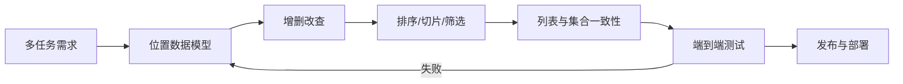
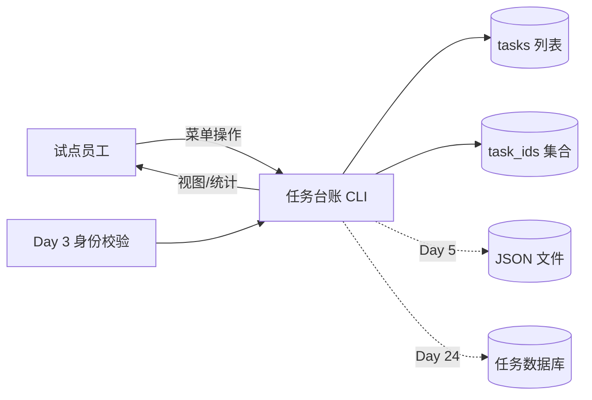
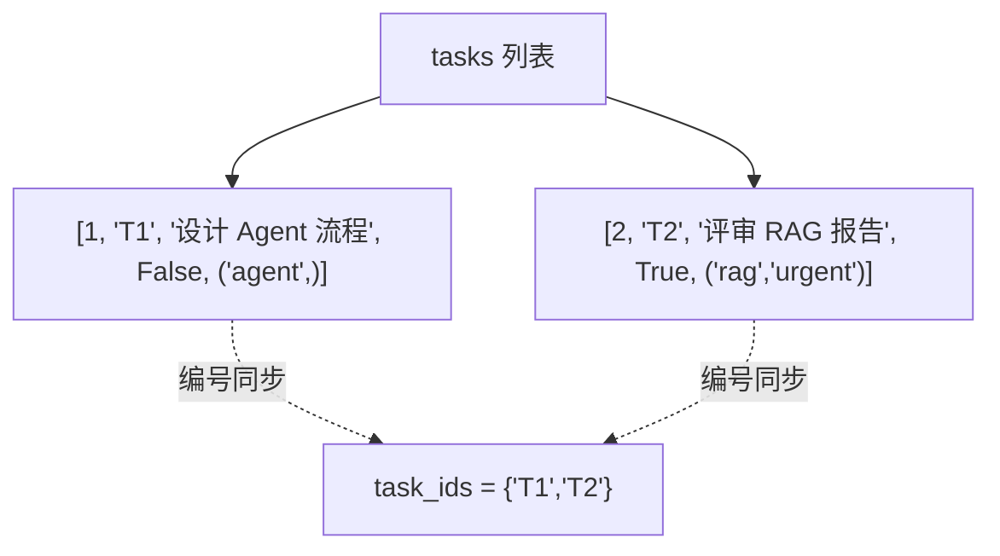
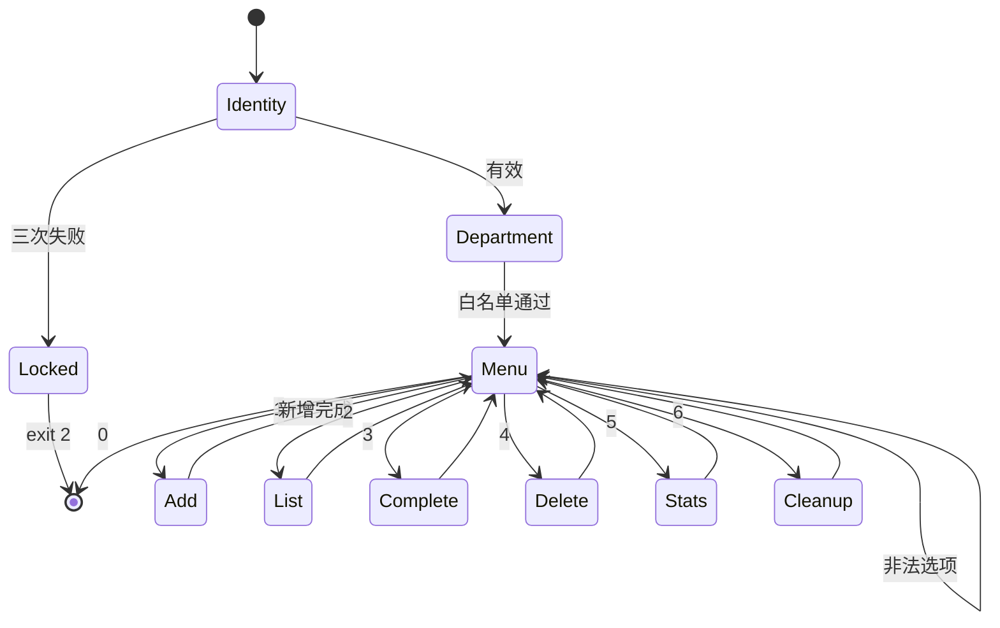
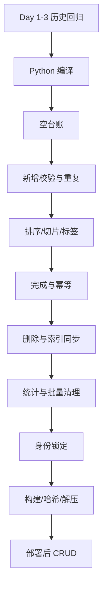
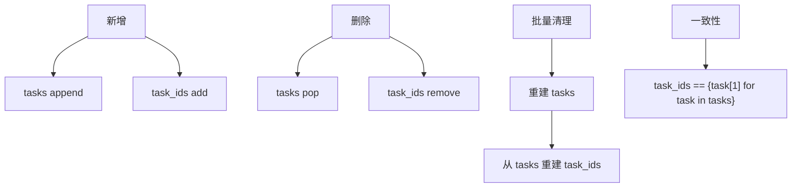

# Day 4｜从一条任务到团队任务台账：列表、元组、集合与批量操作

> 课程阶段：第一阶段·Python 编程基础  
> 建议课时：授课 3 小时 + 实操 3.5 小时 + 晚自习 2 小时  
> 项目版本：NexusAI 0.0.4  
> 今日需求：US-FOUNDATION-004  
> 前置产物：Day 3 可校验输入与操作菜单  
> 今日交付：内存任务台账、CRUD、排序、统计、发布包  

---

## 0. 开场旁白：企业 Agent 面对的不是一条任务

【讲师旁白】

Day 3 的治理工具能够稳定接收一条任务，并在错误输入时恢复。但客服试点组很快提出新问题：同一名员工上午要处理知识库评估，中午要评审 Agent 审批流程，下午还要整理会议纪要。只保存一组变量意味着新增第二条任务时会覆盖第一条；程序无法回答“现在有多少任务”“哪个优先级最高”“哪些已经完成”“标签有哪些”。

今天我们把单条变量升级为集合化数据。列表负责按顺序保存多条任务并支持增删改查；嵌套列表表示一条任务的多个字段；元组保存一旦创建便不希望随意变化的标签快照和有效部门选项；集合维护唯一任务编号和唯一标签；切片生成首页前三条预览；列表推导式筛选进行中、已完成和高优先级任务。


今天的数据仍只存在内存，退出就丢失。这不是缺陷伪装，而是课程演化的刻意边界：先把集合操作和业务状态做正确，Day 5 再引入字典与 JSON 持久化。企业系统也是这样分解风险，每次只增加一类核心复杂度。

---

## 1. 昨日承接与今日完成定义

### 1.1 复用 Day 3

| Day 3 能力 | Day 4 复用 |
|---|---|
| 员工编号三次重试 | 任务台账入口身份 |
| 部门白名单 | 用元组简化成员判断 |
| while 菜单 | 扩展为七个操作 |
| 必填与范围校验 | 新增任务字段 |
| 安全退出 | 明确内存数据未保存 |
| 退出码 2 | 身份失败继续沿用 |

### 1.2 今日学习成果

学员能够：

1. 创建列表并解释有序、可变和可重复特性。
2. 使用 `append`、`pop`、索引和切片完成 CRUD。
3. 遍历嵌套列表并按固定位置读写字段。
4. 使用 `sort` 完成优先级排序。
5. 使用元组表达固定候选和标签快照。
6. 使用集合做成员检查与去重。
7. 解释列表与集合保持同步的风险。
8. 使用列表推导式筛选任务。
9. 使用 `enumerate` 生成可读序号。
10. 为多步骤 CLI 编写端到端状态测试。

### 1.3 完成定义

- [ ] 身份与部门校验沿用 Day 3。
- [ ] 可新增多条任务。
- [ ] 编号必须 T 开头且不可重复。
- [ ] 标题必填，优先级只能 1-5。
- [ ] 标签清理、小写、去空、去重、稳定排序。
- [ ] 查看时按优先级和编号排序。
- [ ] 首页预览最多前三条。
- [ ] 可完成任务，重复完成给出明确反馈。
- [ ] 可删除任务并同步释放编号。
- [ ] 可统计总数、状态、高优先级和唯一标签。
- [ ] 可批量清理已完成任务。
- [ ] 清理后原编号可重新使用。
- [ ] 空台账、未知编号和非法菜单可恢复。
- [ ] 发布包在仓库外可完成 CRUD。

### 1.4 今日范围边界

- 不使用字典字段名，Day 5 重构。
- 不保存 JSON，Day 5。
- 不使用函数，Day 6。
- 不设计类，Day 8。
- 不处理多用户并发，数据库阶段。
- 不宣称集合能替代数据库唯一约束。

---

## 2. 企业迭代安排

| 时间 | 活动 | 内容 | 产物 |
|---|---|---|---|
| 09:00-09:20 | 晨会 | 单任务覆盖问题复盘 | 新需求 |
| 09:20-10:00 | 数据建模 | 任务字段与位置契约 | 模型表 |
| 10:10-11:00 | 列表课堂 | CRUD、索引、切片、排序 | 实验 |
| 11:00-12:00 | 元组集合课堂 | 固定值、去重、成员检查 | 实验 |
| 14:00-14:20 | 计划会 | 菜单与任务拆分 | 看板 |
| 14:20-15:20 | 结对编码 | 新增、查看、完成 | alpha |
| 15:30-16:20 | 结对编码 | 删除、统计、清理 | rc |
| 16:20-17:00 | 端到端测试 | 空/重复/边界/同步 | 报告 |
| 17:00-17:30 | 发布演练 | 构建、哈希、部署 CRUD | 0.0.4 |
| 19:00-20:20 | 作业 | 多任务扩展 | 作业 |
| 20:20-21:00 | 复盘 | 位置模型债务、Day 5 | 日志 |



---

## 3. 企业需求文档

### 3.1 文档信息

| 项目 | 内容 |
|---|---|
| 名称 | Agent 试点任务内存台账 |
| 编号 | US-FOUNDATION-004 |
| 业务负责人 | 林岚 |
| 产品经理 | 周宁 |
| 技术负责人 | 陈工 |
| 测试负责人 | 赵敏 |
| 目标版本 | 0.0.4 |
| 优先级 | P0 |

### 3.2 用户故事

> 作为 Agent 试点员工，  
> 我希望在一个会话中新增、查看、完成、删除和统计多条任务，  
> 从而按优先级管理当天工作，并为未来 Agent 任务队列建立数据基础。

### 3.3 任务位置模型

```text
[priority, task_id, title, is_done, tags_tuple]
```

| 索引 | 字段 | 类型 | 示例 | 含义 |
|---:|---|---|---|---|
| 0 | priority | int | 1 | 1 最高、5 最低 |
| 1 | task_id | str | T100 | 唯一编号 |
| 2 | title | str | 评审 RAG 报告 | 任务标题 |
| 3 | is_done | bool | False | 完成状态 |
| 4 | tags | tuple | (`rag`, `urgent`) | 标签快照 |

优先级放索引 0 是为了让默认列表排序先比较优先级；编号放索引 1，在同优先级时提供稳定次序。这是当前知识边界下的设计，不代表最佳长期模型。位置字段可读性差，Day 5 用字典修复。

### 3.4 业务规则

**BR-04-01 身份**

- 员工编号沿用三次重试。
- 部门来自固定元组。

**BR-04-02 新增**

- 任务编号非空、T 开头、至少两字符、全局唯一。
- 标题清洗后非空。
- 优先级为集合 `{1,2,3,4,5}` 成员。
- 标签按英文逗号拆分、清理、小写、去空、去重、排序，最终元组。
- 新任务默认未完成。

**BR-04-03 查看**

- 空台账显示“当前没有任务”。
- 非空按优先级、编号排序。
- 显示状态、优先级、编号、标题、标签。
- 首页预览最多前三个编号。

**BR-04-04 完成**

- 找到后把索引 3 改为 True。
- 已完成任务再次操作不改变状态。
- 未找到明确提示。

**BR-04-05 删除**

- 按编号删除完整任务。
- 同步从 `task_ids` 删除编号。
- 未找到不改变数据。

**BR-04-06 统计**

- 总任务数。
- 进行中和已完成数。
- 进行中且优先级 1-2 的高优先级数。
- 所有唯一标签排序展示。

**BR-04-07 清理**

- 一次删除全部已完成任务。
- 重建编号集合。
- 输出移除数量。

### 3.5 验收标准

**AC-01 空台账**

Given 尚未新增；When 查看、完成或删除；Then 分别显示可理解的空状态，程序继续。

**AC-02 新增校验**

Given 编号依次为空、A2、T2；标题先空后有效；优先级依次 x、0、2；Then 各错误被拒，最终新增 T2。

**AC-03 标签治理**

Given `rag, urgent, RAG, ,`；Then 保存 `('rag', 'urgent')`。

**AC-04 唯一编号**

Given T2 已存在；When 再新增 T2；Then 拒绝并继续询问新编号。

**AC-05 排序预览**

Given T2/P2、T1/P1、T3/P5；When 查看；Then顺序 T1、T2、T3，首页预览同序。

**AC-06 完成幂等**

Given T2 未完成；When 完成两次；Then 第一次成功，第二次提示已完成。

**AC-07 删除同步**

Given 删除 T1；Then列表和编号集合均移除。已完成 T2 清理后，可重新新增 T2。

**AC-08 统计**

三条任务中 T2 完成时：总数 3、进行中 2、已完成 1、高优先级进行中 1、唯一标签 agent/rag/urgent。

**AC-09 发布独立性**

zip 解压至临时目录后，可新增、查看、完成、统计、删除并以 0 条安全退出。

### 3.6 非功能要求

- 单文件、标准库、Python 3.10+。
- 所有模拟任务只在内存。
- 操作反馈包含任务编号。
- 排序与标签输出稳定，便于测试和审计。
- 发布包只含脚本、README、SHA256SUMS。
- 修改两个数据结构时必须保持一致。

### 3.7 风险

| 编号 | 风险 | 处理 |
|---|---|---|
| R4-01 | 位置索引难读 | Day 5 字典 |
| R4-02 | 列表与集合可能不同步 | 删除/清理测试 |
| R4-03 | 内存退出丢失 | 明示，Day 5 JSON |
| R4-04 | 默认 sort 依赖字段顺序 | 文档化模型契约 |
| R4-05 | 无并发控制 | 当前单进程 |
| R4-06 | 标签只按逗号 | 产品确认试点格式 |

---

## 4. 架构与数据模型

### 4.1 上下文图



### 4.2 内存关系



`tasks` 是事实主数据，`task_ids` 是派生索引。任何新增、删除、批量清理都必须同时维护。若发生冲突，应以 tasks 重建集合。

### 4.3 菜单状态机



### 4.4 CRUD 数据流

```mermaid
flowchart TD
    AddInput[新增输入] --> Validate[编号/标题/优先级校验]
    Validate --> NormalizeTags[标签拆分清理去重]
    NormalizeTags --> Append[tasks.append]
    Append --> AddId[task_ids.add]
    Read[查看] --> Sort[tasks.sort]
    Sort --> Iterate[遍历展示]
    Complete[完成] --> Search1[遍历按编号查找]
    Search1 --> Update[task[3] = True]
    Delete[删除] --> Search2[按索引查找]
    Search2 --> Pop[tasks.pop]
    Pop --> RemoveId[task_ids.remove]
```

---

## 5. 列表课堂笔记

### 5.1 列表特征

```python
tasks = []
priorities = [1, 2, 3]
```

列表有顺序、可变、允许重复、可包含不同类型。任务台账需要保持多条记录并修改状态，适合列表。

### 5.2 增加

```python
task = [1, "T1", "设计 Agent 流程", False, ("agent",)]
tasks.append(task)
```

`append` 把整个任务作为一个元素。若误用 `extend(task)`，会把五个字段拆散加入主列表，破坏嵌套结构。

### 5.3 索引

```python
print(task[0])  # priority
print(task[1])  # id
task[3] = True  # 更新状态
```

位置模型简洁但脆弱。`task[3]` 无法从代码直观看出含义，字段顺序一改，所有访问都要改。今天刻意体验这一痛点，为字典建立动机。

### 5.4 删除

```python
removed = tasks.pop(index)
```

`pop` 返回被删除任务，便于输出审计反馈。删除后后续索引左移，因此遍历中删除要谨慎。当前找到一个即 break，避免继续使用已变化索引。

### 5.5 切片

```python
top_tasks = tasks[:3]
```

返回新列表，原列表不变。任务不足三条时安全返回全部。切片是首页预览，不是分页系统；数据库分页以后实现。

### 5.6 排序

```python
tasks.sort()
```

原地修改列表。嵌套列表按元素依次比较：先优先级，再编号。当前字段设计有意支持这个规则。

```python
sorted_tasks = sorted(tasks)
```

`sorted` 返回新列表，不改变原列表。何者合适取决于是否允许修改主顺序。当前产品接受查看时整理顺序。

### 5.7 遍历

```python
for task in tasks:
    print(task[1], task[2])
```

带位置：

```python
for position, task in enumerate(tasks, start=1):
    print(position, task[1])
```

显示序号不是任务主键。删除任务后序号会变，业务操作必须使用 task_id。

### 5.8 列表推导式

```python
done_tasks = [task for task in tasks if task[3]]
active_tasks = [task for task in tasks if not task[3]]
```

阅读顺序：为 tasks 中每个 task，若条件成立，就把 task 放入新列表。推导式适合简单映射/筛选，复杂逻辑用普通循环更清晰。

### 5.9 清理已完成

```python
tasks = [task for task in tasks if not task[3]]
```

创建新列表并重新绑定变量。原列表对象不再作为主数据。若其他变量引用旧列表会产生一致性问题；当前单文件没有外部引用。

---

## 6. 元组课堂笔记

### 6.1 元组不可变

```python
VALID_DEPARTMENTS = ("客户服务部", "销售部", "财务部")
```

元组有顺序、允许重复，但不能像列表那样修改元素。它表达“当前版本固定候选”。

### 6.2 单元素元组

```python
tags = ("agent",)
```

逗号不可少；`("agent")` 只是字符串。

### 6.3 标签快照

```python
tags = tuple(sorted(set(tag_list)))
```

标签先集合去重、排序稳定，再转元组。任务创建后不会在今天的菜单中编辑标签，因此用元组表达快照。不可变不等于安全或持久化，只是对象接口不支持原地修改。

### 6.4 解包

可以写：

```python
priority, task_id, title, is_done, tags = task
```

字段数量不匹配会报错。当前位置模型可用解包提升可读性，但参考代码保留索引，让学员看清 CRUD 位置操作；评审时可比较两种风格。

---

## 7. 集合课堂笔记

### 7.1 集合特征

```python
task_ids = set()
```

集合无重复，适合成员检查，不保证业务展示顺序。

### 7.2 新增与检查

```python
if task_id in task_ids:
    print("重复")
task_ids.add(task_id)
```

列表也能 `in`，但集合表达“唯一编号索引”的意图更明确。数据量大时集合成员检查通常更快。

### 7.3 删除

```python
task_ids.remove(task_id)
```

不存在时 `remove` 报错。参考实现只在已从 tasks 找到相同任务后调用，因此前置事实成立。`discard` 不存在时不报错，但可能掩盖同步缺陷。

### 7.4 去重

```python
tag_list = ["rag", "urgent", "rag"]
unique_tags = set(tag_list)
```

结果含两个值，但顺序不应依赖。展示前 `sorted`。

### 7.5 集合推导式

```python
task_ids = {task[1] for task in tasks}
```

批量清理后从主列表重建索引，确保一致。

### 7.6 常见集合运算

```python
a | b  # 并集
a & b  # 交集
a - b  # 差集
```

今天可用于比较标签，未来权限集合会大量使用。注意集合元素必须可哈希，列表不能直接放入集合，因此 task_ids 只存字符串。

---

## 8. 标签清洗流水线

原始输入：

```text
rag, urgent, RAG, ,
```

步骤：

```python
raw_tags.split(",")
```

得到包含空白和空项的列表。推导式：

```python
tag_list = [
    tag.strip().lower()
    for tag in raw_tags.split(",")
    if tag.strip() != ""
]
```

得到：

```python
["rag", "urgent", "rag"]
```

再执行：

```python
tags = tuple(sorted(set(tag_list)))
```

得到稳定结果：

```python
("rag", "urgent")
```


处理顺序决定结果。若先 set 再 lower，`RAG` 与 `rag` 会暂时被视为不同值；虽然后续还可处理，但更复杂。先标准化再去重符合“比较标准值”的原则。

---

## 9. 课堂实操

### 9.1 建立空台账

```python
tasks = []
task_ids = set()
```

运行统计，确认总数为 0。不要用一个变量同时承担完整数据和唯一索引。

### 9.2 新增一条

按规则得到字段后：

```python
task = [priority, task_id, title, False, tags]
tasks.append(task)
task_ids.add(task_id)
```

先更新主列表还是集合？单线程内两行都会完成；生产系统需要事务保证原子性。今天通过测试防止遗漏。

### 9.3 新增三条

```text
T2 P2 评审 RAG 报告
T1 P1 设计 Agent 审批
T3 P5 整理会议纪要
```

观察插入顺序与排序后顺序。列表有序不代表自动按业务优先级排序。

### 9.4 查看

调用 sort 后 enumerate。状态文字由布尔值决定：

```python
status = "已完成" if task[3] else "进行中"
```

这是条件表达式，适合在两个简单值之间选择；复杂行为使用普通 if。

### 9.5 完成

遍历找到编号，修改嵌套列表中的状态。`found` 区分“没找到”和“找到了但已完成”。

### 9.6 删除

使用索引遍历：

```python
for index in range(len(tasks)):
    if tasks[index][1] == target_id:
        tasks.pop(index)
        task_ids.remove(target_id)
        break
```

删除后立即 break，避免继续使用变化后的范围。

### 9.7 统计

推导式生成三个视图，嵌套循环汇总标签。视图是新列表，不会修改主任务。

### 9.8 清理

筛选未完成任务后重建 task_ids。测试清理后的已完成编号能否重新新增，这是同步一致性的关键证据。

---

## 10. 参考实现逐段解读

仓库：

```text
course/day04/starter/task_board.py
course/day04/solution/task_board.py
course/day04/tests/test_task_board.py
course/day04/deploy/build_release.py
course/day04/tests/test_release.py
```

### 10.1 为什么任务是列表而非元组

完成操作需要把 `is_done` 从 False 改为 True。若整条任务用元组，就需创建新元组并替换列表元素。Day 8 的对象模型会提供更清晰方法。

### 10.2 为什么标签是元组

今天不支持编辑单个任务标签，创建后作为标准化快照。外层任务可变，内层标签不可变，表达不同生命周期。

### 10.3 为什么编号另建集合

主列表用于排序与展示，集合用于唯一检查。多个结构各自服务不同访问模式，但增加同步成本。数据库中会用唯一索引解决。

### 10.4 为什么删除不用 `tasks.remove`

已知的是编号，不是完整任务值。先查找索引再 pop，可以取得被删任务用于反馈，并同步编号。

### 10.5 为什么默认排序可用

嵌套列表索引 0、1 分别是优先级、编号。默认字典序正好满足当前规则。若需要已完成置后、截止日期等，必须使用 key；lambda 在后续课程讲。

### 10.6 为什么统计每次重算

数据量很小，重算保证与主列表一致。若维护多个计数变量，每次 CRUD 都要同步，风险更大。先保证正确，再根据性能证据优化。

---

## 11. 测试策略与全方位检测

### 11.1 测试层次



### 11.2 单会话全流程

自动测试在同一个进程里依次：

1. 身份、部门重试。
2. 空列表查看/完成/删除。
3. 新增 T2，覆盖编号、标题、优先级错误。
4. 新增 T1 时先触发 T2 重复。
5. 新增 T3。
6. 查看排序和前三条。
7. 完成未知任务、完成 T2、重复完成。
8. 验证统计。
9. 删除未知任务、删除 T1。
10. 清理 T2。
11. 重新新增 T2，证明集合同步。
12. 非法菜单后安全退出。

### 11.3 排序断言

不仅检查字符串存在，还比较输出位置：

```python
assert output.index("P1 T1") < output.index("P2 T2")
```

存在不等于顺序正确。

### 11.4 一致性断言

清理完成后重新新增相同编号成功。若只更新 tasks、未重建 task_ids，测试会卡在重复编号重试或输出错误。

### 11.5 锁定回归

空、A1、E 三次失败，退出码 2，不出现部门和菜单。新增集合功能不能破坏身份边界。

### 11.6 发布测试

构建后检查三项文件、哈希、解压，并在临时目录新增财务审计任务，完成、统计、删除，再验证总数 0。

### 11.7 命令

```bash
python3 course/day04/tests/test_task_board.py
python3 course/day04/tests/test_release.py
python3 tools/verify_day04.py
```

---

## 12. 发布、部署与回滚

### 12.1 构建命令

```bash
python3 course/day04/deploy/build_release.py --output artifacts/day04
```

产物：

```text
nexus-task-board-0.0.4/
  task_board.py
  README.txt
  SHA256SUMS
nexus-task-board-0.0.4.zip
```

### 12.2 冒烟路径

部署版新增 T2/P2 和 T1/P1，查看时预览 T1、T2；完成 T2；统计唯一标签；清理已完成；退出时剩一条。这个路径覆盖核心集合能力。

### 12.3 回滚

工具无持久化，回滚是停止使用 0.0.4、恢复上一制品。不要把 0.0.4 的内存任务误认为可恢复数据。Day 5 引入文件后，回滚必须考虑数据格式版本。

### 12.4 完整性边界

SHA-256 发现字节变化，不能证明身份。发布目录不得含模拟会话输入、缓存或环境文件。构建脚本使用明确白名单。

---

## 13. 数据一致性与安全评审

### 13.1 双结构一致性



任意操作后应满足等式。今天自动测试通过行为间接验证，进阶作业可显式断言。

### 13.2 任务编号不是权限

集合保证本进程内编号不重复，不认证操作者，也不阻止另一个进程使用相同编号。不要把“唯一”误解为“安全”。

### 13.3 标签输入

只接受模拟业务标签。标签可能在未来影响路由和权限，因此不能直接把任意标签当可信授权。今天标签仅用于展示统计。

### 13.4 删除与审计

当前删除是真正从内存移除，没有审计记录。生产任务通常需要软删除、操作者、时间和原因。Day 11 日志、Day 24 数据库逐步实现。

---

## 14. 团队协作模拟

### 14.1 晨会

**业务**：一天有多条任务，要优先处理。  
**产品**：需要增查完删和统计。  
**测试**：清理后编号能否重用必须验证。  
**安全**：任务仅模拟，标签不用于授权。  
**技术**：先用位置模型理解集合，Day 5 字典重构。

### 14.2 设计争议：只用一个列表

只用 tasks 也能查重，但每次要遍历。增加集合提高意图和访问效率，却带来同步风险。团队选择双结构并用测试守护；这是明确权衡，不是无条件“集合更高级”。

### 14.3 设计争议：序号是否可作编号

不能。排序、删除后序号变化。界面序号只用于阅读，操作使用稳定 task_id。

### 14.4 任务拆分

| 任务 | 证据 |
|---|---|
| 数据模型 | 字段表 |
| 新增与去重 | AC-02/03/04 |
| 查看排序 | AC-05 |
| 完成幂等 | AC-06 |
| 删除同步 | AC-07 |
| 统计清理 | AC-08 |
| 发布部署 | AC-09 |

### 14.5 代码评审清单

- [ ] 每处索引符合字段契约。
- [ ] 新增同时更新 tasks/task_ids。
- [ ] 删除同时移除编号。
- [ ] 清理后重建编号集合。
- [ ] 标签先标准化再去重。
- [ ] 集合展示前排序。
- [ ] 遍历删除后立即 break。
- [ ] 空状态不会继续索引。
- [ ] 序号不作为主键。
- [ ] 退出明确不持久化。

---

## 15. 常见错误与排障

### 15.1 append 与 extend

`append(task)` 添加一条嵌套任务；`extend(task)` 会拆字段。打印 `tasks` 判断结构层级。

### 15.2 索引错位

把 `task[2]` 当状态会覆盖标题。字段常量或字典能降低风险，Day 5 修复。

### 15.3 排序类型冲突

若同优先级、同编号后继续比较标题通常可行；若位置混入不可比较类型可能 TypeError。唯一编号避免比较到后续字段。

### 15.4 遍历中删除

对列表 `for task in tasks` 同时连续删除可能跳项。当前按索引找到一个即 break；批量删除用推导式构造新列表。

### 15.5 集合无顺序

直接打印集合顺序不稳定。测试和界面使用 `sorted(all_tags)`。

### 15.6 忘记同步编号

任务已删除但重新新增仍提示重复。检查 `task_ids.remove` 和批量清理后的集合重建。

### 15.7 空标签

`"".split(",")` 产生含空字符串的列表。推导式条件过滤清理后空值。

### 15.8 元组逗号

单标签必须 `("agent",)`。没有逗号是字符串，join 和遍历行为会按字符进行。

### 15.9 EOFError

自动测试输入序列漏掉某个重试值或最终 0。根据最后提示定位状态，不要盲目增加空行。

### 15.10 求助模板

```text
目标：清理完成 T2 后允许重新新增 T2
实际：仍提示编号已存在
前置：tasks 中 T2 已移除
观察：task_ids 仍包含 T2
判断：批量清理只重建 tasks
建议：从保留后的 tasks 重建 task_ids，并补端到端断言
```

---

## 16. 随堂练习与答案

### 练习 1

列表与元组最大差异？答案：列表可变，元组不可变；两者都有序可重复。

### 练习 2

集合适合什么？答案：唯一值和成员检查，不适合依赖展示顺序。

### 练习 3

`tasks[:3]` 在只有两条时？答案：返回两条，不报错。

### 练习 4

`append([1,2])` 与 `extend([1,2])`？答案：前者加一个列表元素，后者加两个元素。

### 练习 5

为什么任务编号不用显示序号？答案：排序删除后序号变化，主键需稳定。

### 练习 6

`set(["RAG","rag"])` 有几个？答案：两个，大小写标准化应先做。

### 练习 7

如何筛选已完成？

```python
[task for task in tasks if task[3]]
```

### 练习 8

为什么清理后重建集合？答案：集合是主列表派生索引，需保持一致。

### 练习 9

默认排序为何按优先级？答案：优先级设计在索引 0。

### 练习 10

删除后为何 break？答案：列表长度和索引变化，且编号唯一只需删一个。

### 练习 11

空列表统计是否应报错？答案：不应，len 为 0，标签集合为空。

### 练习 12

元组不可变是否代表数据已保存？答案：不是，进程结束仍丢失。

---

## 17. 课后作业

### 17.1 基础作业 A：知识文档队列

用嵌套列表管理文档：

```text
[priority, document_id, title, processed, tags]
```

支持新增、查看、标记已处理、删除、统计、清理。编号 D 开头，标签去重。

### 17.2 进阶作业 B：标签筛选

在任务菜单增加：

- 按标签查询。
- 显示交集标签。
- 显示当前未使用的候选标签。

使用集合交集和差集，输出必须排序。

### 17.3 企业挑战 C：一致性事故分析

模拟“任务删除但编号集合未删除”，写 800 字事故分析：现象、影响、根因、检测、修复、防复发，以及数据库唯一索引如何改变问题。

### 17.4 测试作业 D

设计至少 20 条状态测试，覆盖空列表、重复编号、排序同优先级、标签重复、重复完成、未知删除、清理 0 条/多条、编号复用。

### 17.5 发布作业 E

独立目录执行新增→查看→完成→统计→删除→空统计→退出，记录哈希和退出码。

---

## 18. 课后作业完整参考答案

### 18.1 基础作业 A

```python
"""Day 4 作业：知识文档处理队列。"""

documents = []
document_ids = set()

while True:
    choice = input("1新增 2查看 3完成 4删除 5统计 6清理 0退出：").strip()
    if choice == "1":
        while True:
            document_id = input("文档编号：").strip().upper()
            if document_id[0:1] != "D" or len(document_id) < 2:
                print("编号必须以 D 开头")
                continue
            if document_id in document_ids:
                print("编号重复")
                continue
            break
        title = " ".join(input("标题：").split())
        while title == "":
            print("标题不能为空")
            title = " ".join(input("标题：").split())
        priority = int(input("优先级 1-5："))
        raw_tags = input("标签：")
        tags = tuple(sorted(set(
            tag.strip().lower()
            for tag in raw_tags.split(",")
            if tag.strip() != ""
        )))
        documents.append([priority, document_id, title, False, tags])
        document_ids.add(document_id)
    elif choice == "2":
        documents.sort()
        for document in documents:
            print(document)
    elif choice == "3":
        target = input("编号：").strip().upper()
        for document in documents:
            if document[1] == target:
                document[3] = True
                break
    elif choice == "4":
        target = input("编号：").strip().upper()
        for index in range(len(documents)):
            if documents[index][1] == target:
                documents.pop(index)
                document_ids.remove(target)
                break
    elif choice == "5":
        done = [item for item in documents if item[3]]
        print(f"总数 {len(documents)}，已处理 {len(done)}")
    elif choice == "6":
        documents = [item for item in documents if not item[3]]
        document_ids = {item[1] for item in documents}
    elif choice == "0":
        break
    else:
        print("无效菜单")
```

参考答案为了聚焦数据结构，优先级转换仍较简化；完整作业应复用 Day 3 校验。

### 18.2 进阶作业 B

```python
query_tag = input("查询标签：").strip().lower()
matched = [task for task in tasks if query_tag in task[4]]
for task in matched:
    print(task[1], task[2])

all_tags = set()
for task in tasks:
    all_tags = all_tags | set(task[4])

candidate_tags = {"rag", "agent", "urgent", "audit", "sales"}
unused_tags = candidate_tags - all_tags
print(f"未使用候选标签：{sorted(unused_tags)}")
```

### 18.3 企业挑战 C 参考答案

事故现象是任务已从列表删除，但新增同编号仍被拒绝。业务影响包括任务无法重建、用户误以为数据仍存在、支持人员可能建议使用不规范新编号。根因是系统维护 tasks 与 task_ids 两份状态，删除路径只更新主列表，没有更新派生索引。检测可通过不变量 `task_ids == {task[1] for task in tasks}`、删除后编号复用端到端测试和统计对账。修复是在单条删除时同步 remove，在批量清理后从主列表重建集合。防复发包括集中封装 CRUD、减少重复状态、代码评审检查所有写路径。数据库阶段使用任务表唯一约束可把唯一性放到同一事实源，但仍需事务和正确处理冲突，数据库不会自动修复错误业务流程。

### 18.4 测试作业 D 参考分类

| 分类 | 案例 |
|---|---|
| 空状态 | 查看/完成/删除/统计 |
| 新增 | 空编号/前缀/重复/空标题 |
| 优先级 | 非数字/0/1/5/6 |
| 标签 | 空/重复/大小写/多空格 |
| 排序 | 不同优先级/同优先级编号 |
| 完成 | 存在/未知/重复 |
| 删除 | 存在/未知/删除后复用 |
| 清理 | 无完成/一个/多个/集合同步 |
| 菜单 | 非法/退出 |

### 18.5 发布作业 E 参考记录

```text
文件集合：脚本、README、SHA256SUMS
哈希：与清单一致
新增：通过
排序预览：通过
完成与统计：通过
删除后总数0：通过
退出码：0
持久化：无，符合版本声明
```

---

## 19. 讲师逐字稿

### 19.1 开场

【讲师】

“一组变量只能表达当前任务，多任务需要容器。今天不是背 append 和 pop，而是设计一个数据模型，让新增、查询、更新、删除和统计都围绕同一事实工作。”

### 19.2 数据模型

【讲师】

“为什么优先级放第零位？因为我们暂时不用排序 key，希望默认排序符合业务。这是受知识边界影响的设计，必须文档化，并在 Day 5 主动偿还。”

### 19.3 列表

【讲师】

“列表的可变让状态更新简单，也意味着任何位置都可能被误改。每次写 task[3] 都对照字段表。体验痛点后，你会理解字典和对象的价值。”

### 19.4 集合

【讲师】

“集合能快速判断重复，但不是免费午餐。我们现在有两份相关状态，所有写路径都要同步。清理后重新新增同编号，是最重要的一致性测试。”

### 19.5 标签

【讲师】

“先清理大小写，再去重；展示前排序。集合内部顺序不属于产品契约，稳定输出是可测试和可审计的基础。”

### 19.6 删除

【讲师】

“删除改变列表长度。找到唯一编号后 pop 并立即 break。批量删除不在遍历中反复 pop，而是构造保留项的新列表。”

### 19.7 测试

【讲师】

“CRUD 要在同一会话连续测试，因为很多错误只在操作组合中出现。单独测试新增和单独测试清理，都可能发现不了编号集合残留。”

### 19.8 发布

【讲师】

“部署冒烟不只启动程序，要完成一个最小业务闭环。今天是新增、查看、完成、统计、清理、退出。可启动不等于可用。”

### 19.9 收尾

【讲师】

“Day 4 已经像一个小型业务系统，但 task[0]、task[1] 的位置语义很脆弱，退出后也丢数据。明天字典会让字段具名，JSON 会让台账跨进程存在。”

---

## 20. 路径覆盖实验室

### 实验 1：空列表查看

预期显示空状态并回菜单，不调用排序后的元素索引。空集合是正常业务状态，不是异常。

### 实验 2：空列表完成

预期不询问目标编号，避免让用户输入一个必然找不到的值。

### 实验 3：空列表删除

同样快速反馈。测试分别断言完成失败和删除失败文案。

### 实验 4：编号三层校验

依次输入空、A2、T2。三个条件分别覆盖非空、前缀和有效路径。T 后至少一个字符。

### 实验 5：重复编号

已有 T2 后再次 T2，集合成员判断命中，必须留在编号输入循环，而不是退出整个新增流程。

### 实验 6：标题空白

输入多个空格，split/join 后为空，拒绝。有效标题折叠连续空格。

### 实验 7：优先级格式

输入 x，不执行 int；输入 0，转换后不在集合；输入 1 或 5，通过。

### 实验 8：空标签

输入空字符串，推导式得到空列表，最终空元组。展示为“无”，不能显示奇怪的空字符。

### 实验 9：标签重复

`rag, RAG, rag` 标准化后集合只有 rag。排序后元组稳定。

### 实验 10：插入顺序

按 T2/P2、T1/P1、T3/P5 新增，tasks 初始为插入顺序。查看调用 sort 后变业务顺序。

### 实验 11：同优先级

新增 T2/P1、T1/P1，默认排序比较第二字段，T1 在前。编号字符串排序中 T10 可能在 T2 前，若业务要求自然数字序需新规则。

### 实验 12：首页不足三条

一条或两条时 `[:3]` 安全返回现有任务。

### 实验 13：首页超过三条

四条时只展示前三编号，但总列表仍显示四条，切片不修改主列表。

### 实验 14：完成未知编号

遍历结束 found False，主数据不变，反馈包含目标编号。

### 实验 15：完成任务

找到后把索引 3 设 True 并 break。统计已完成增加一、进行中减少一。

### 实验 16：重复完成

状态保持 True，输出“已经完成”，不能反转回 False。

### 实验 17：删除未知编号

循环耗尽 removed False，列表和集合不变。

### 实验 18：删除存在任务

pop 返回任务用于反馈，集合同步 remove。统计总数减少。

### 实验 19：删除后复用

重新新增被删编号应成功，证明集合同步。

### 实验 20：统计空台账

推导式得到空列表，标签集合为空，所有计数 0，输出 `[]`。

### 实验 21：高优先级进行中

只统计未完成且优先级 <=2。已完成 P1 不应计入。

### 实验 22：标签全集

嵌套循环把各任务元组标签加入集合。重复标签只显示一次。

### 实验 23：清理零条

无已完成任务时移除 0，任务与编号集合保持。

### 实验 24：清理多条

多个完成任务同时移除，列表推导式不会出现遍历删除跳项。

### 实验 25：清理后重建集合

显式检查保留任务编号集合与 task_ids 相等。

### 实验 26：非法菜单

输入 9 后继续，所有任务状态保持，随后正常操作。

### 实验 27：身份锁定

三次失败退出 2，不出现部门和任务菜单，沿用 Day 3 安全边界。

### 实验 28：发布文件白名单

zip 恰好三项，不含缓存、测试输入、artifact 嵌套包。

### 实验 29：哈希变化

临时修改脚本后摘要变化，证明完整性检查能发现字节差异。

### 实验 30：异目录 CRUD

解压至临时目录，新增财务任务、查看、完成、统计、删除，退出总数 0。证明不依赖仓库。

### 覆盖记录

```text
实验编号：
前置 tasks：
前置 task_ids：
输入：
预期列表变化：
预期集合变化：
预期输出：
实际：
一致性等式是否成立：
```

路径覆盖要同时检查两个结构和用户可见结果。只看到“删除成功”不足以证明集合已同步。

---

## 21. 复盘与次日衔接

### 21.1 保持

- 字段模型先文档化。
- 稳定编号与显示序号分开。
- 标准化后去重。
- 集合展示前排序。
- CRUD 组合端到端测试。
- 部署冒烟完成业务闭环。

### 21.2 停止

- 用多个独立变量覆盖前一任务。
- 依赖集合自然顺序。
- 遍历列表时连续 pop。
- 只删主列表不删索引。
- 把内存状态说成已保存。

### 21.3 技术债

| 编号 | 内容 | 计划 |
|---|---|---|
| TD-012 | 白名单硬编码 | Day 5 字典 |
| TD-017 | 位置字段难读 | Day 5 |
| TD-018 | 无持久化 | Day 5 JSON |
| TD-019 | CRUD 重复 | Day 6 函数 |
| TD-020 | 无操作审计 | Day 11 |
| TD-021 | 无并发唯一约束 | Day 24 |

### 21.4 Day 5 输入

业务要求退出后任务仍在，并希望字段名称清晰。Day 5 将：

- 用字典表示员工和任务。
- 用嵌套字典/列表组织数据。
- 理解 JSON 对象、数组、字符串、数字、布尔和 null。
- 使用 loads/dumps/load/dump。
- 将任务台账保存并恢复。
- 增加数据格式版本。

### 21.5 离场检查

- [ ] 我能选择列表、元组、集合。
- [ ] 我理解嵌套任务索引契约。
- [ ] 我能增删改查列表。
- [ ] 我能用切片做预览。
- [ ] 我能用集合去重和查重。
- [ ] 我能用推导式筛选。
- [ ] 我能维护两个结构一致。
- [ ] 我能测试删除后编号复用。
- [ ] 我能说明内存与持久化区别。
- [ ] 我知道 Day 5 如何重构。

---

## 22. 教学质量门禁

| 指标 | 目标 |
|---|---:|
| 课件字符 | ≥30000 |
| Mermaid 图 | ≥8 |
| 必备章节 | 全部 |
| CRUD 路径 | 100% |
| 排序/切片 | 通过 |
| 标签去重 | 通过 |
| 列表集合一致性 | 通过 |
| 身份锁定 | exit 2 |
| 发布哈希 | 一致 |
| 异目录 CRUD | 通过 |
| Day 1-3 回归 | 通过 |

任一失败则不交付。修改后从历史回归到最终部署完整重跑。

---

## 23. 今日交付与收尾旁白

```text
course/day04/day04-lesson.md
course/day04/starter/task_board.py
course/day04/solution/task_board.py
course/day04/tests/test_task_board.py
course/day04/deploy/build_release.py
course/day04/tests/test_release.py
tools/verify_day04.py
```

【收尾旁白】

“今天智枢第一次同时管理多条业务任务。列表保存顺序和状态，元组表达固定快照，集合守住唯一编号和标签，推导式生成业务视图，CRUD 测试守住两个结构的一致性。它仍然是内存系统，但已经具备未来任务服务的行为骨架。明天我们会给每个位置字段一个名字，并让数据跨进程保存。”
