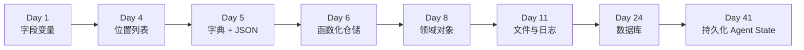
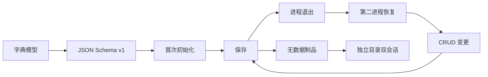
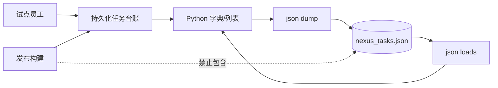
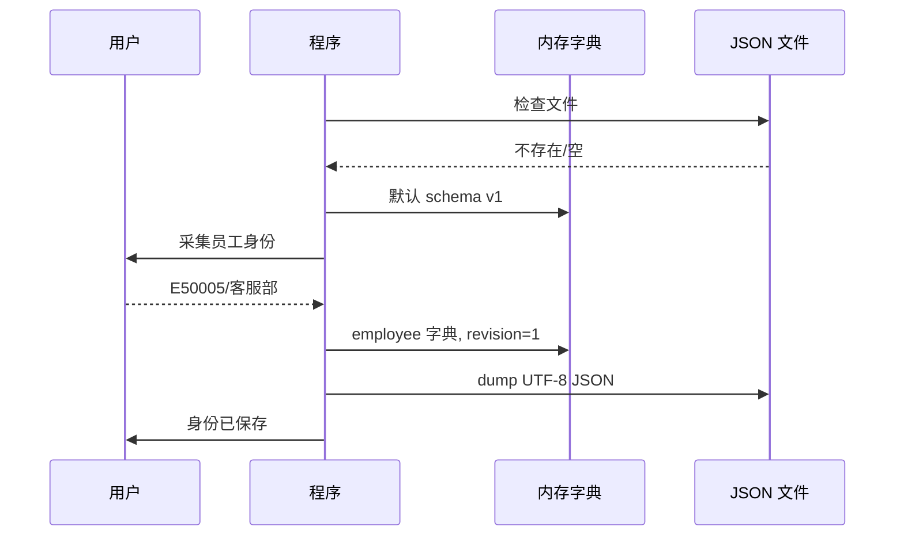
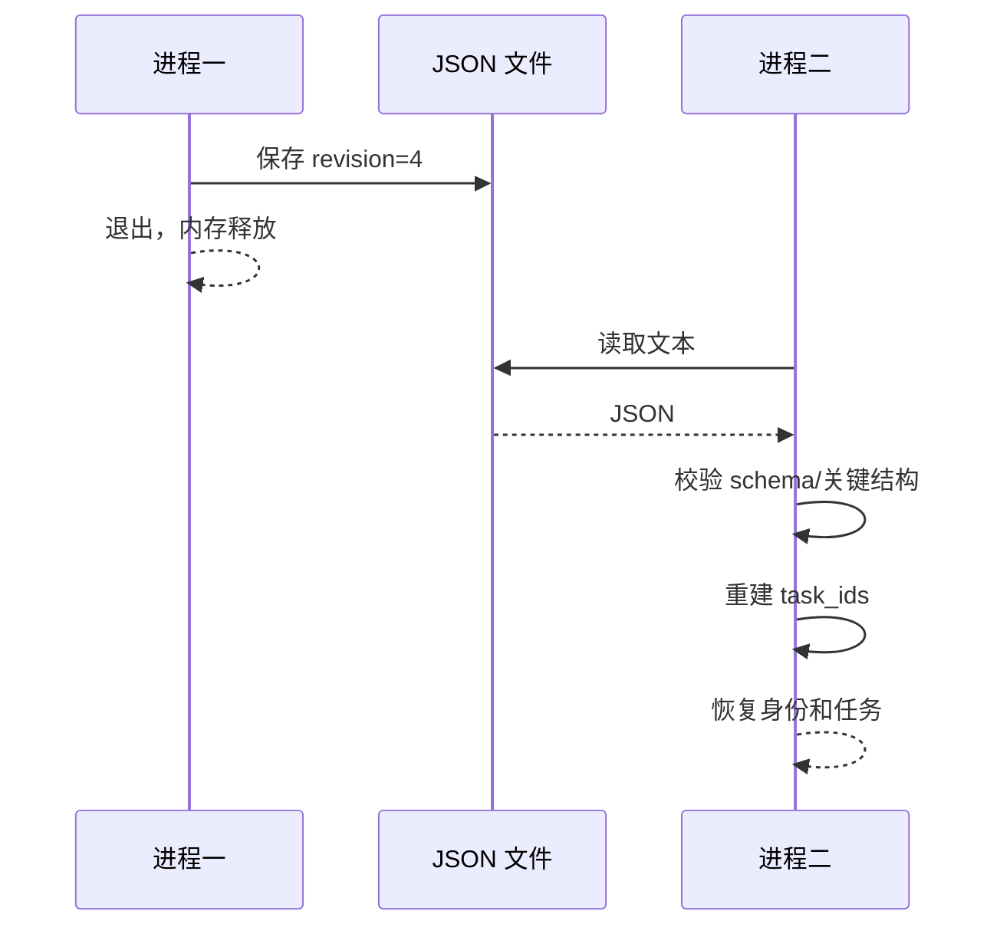
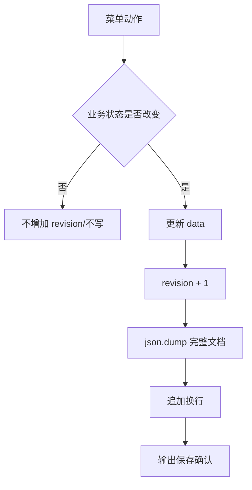
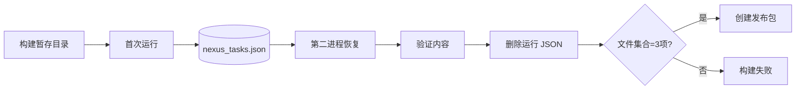
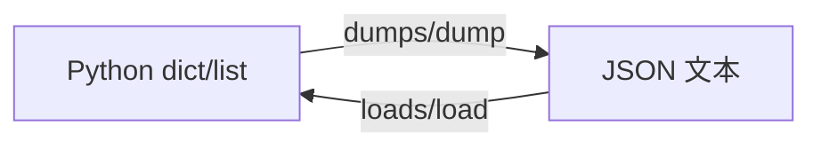
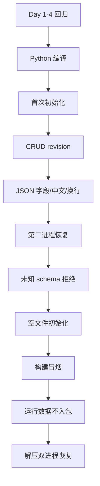

# Day 5｜让任务跨进程存在：字典、JSON Schema 与持久化边界

> 课程阶段：第一阶段·Python 编程基础  
> 建议课时：授课 3 小时 + 实操 3.5 小时 + 晚自习 2 小时  
> 项目版本：NexusAI 0.0.5  
> 今日需求：US-FOUNDATION-005  
> 前置产物：Day 4 多任务内存台账  
> 今日交付：具名字典模型、JSON 保存恢复、版本拒绝、无数据发布包  

---

## 0. 开场旁白：退出程序不应等于业务记录消失

【讲师旁白】

Day 4 的任务台账已经能新增、排序、完成、删除和统计多条任务，但只要选择退出，所有任务就从内存消失。第二天重新启动时，员工身份和任务都要重新输入。更危险的是，Day 4 每条任务依赖位置记忆：

```python
[1, "T1", "设计 Agent 流程", False, ("agent",)]
```

`task[0]` 是优先级，`task[3]` 是完成状态。新同事只看代码很难理解，字段顺序稍有变化就会静默写错。

今天我们同时解决两个问题。第一，用字典把字段从位置变成名字：

```python
{
    "task_id": "T1",
    "title": "设计 Agent 流程",
    "priority": 1,
    "is_done": False,
    "tags": ["agent"],
}
```

第二，把 Python 字典和列表序列化为 JSON 文件。首次运行创建身份与任务，第二个进程恢复同一数据；每次真实变更增加 revision 并立即保存。发布包必须只包含程序、说明和校验清单，构建冒烟产生的 `nexus_tasks.json` 必须在打包前删除，防止业务数据进入制品。



JSON 是未来 API 请求、模型 messages、工具参数、配置和数据库交换的基础格式。今天不是只学 `json.dump`，而是第一次定义可演化的数据契约。

---

## 1. 昨日承接与今日完成定义

### 1.1 Day 4 痛点

| Day 4 现状 | Day 5 改进 |
|---|---|
| `task[3]` 无语义 | `task["is_done"]` |
| 退出后任务丢失 | JSON 跨进程恢复 |
| 身份每次重输 | employee 字典保存 |
| 标签元组不能直接表达 JSON 类型 | JSON 数组/ Python 列表 |
| 无格式版本 | schema_version |
| 无变更序号 | revision |
| 构建冒烟可能留下数据 | 打包前清除并白名单检查 |

### 1.2 学习成果

学员能够：

1. 创建、读取、更新、删除字典键值。
2. 遍历 `keys`、`values`、`items`。
3. 使用嵌套字典与列表表示业务文档。
4. 解释 JSON 六类核心值。
5. 区分 `loads/dumps` 与 `load/dump`。
6. 使用 UTF-8 和 `ensure_ascii=False` 保存中文。
7. 使用 `indent` 与 `sort_keys` 生成稳定可评审文件。
8. 设计 schema_version 与 revision。
9. 在未知版本时拒绝覆盖。
10. 用两个独立进程验证真正持久化。
11. 区分程序制品与运行时业务数据。

### 1.3 完成定义

- [ ] Day 4 位置列表重构为具名字典。
- [ ] 顶层包含 schema_version、revision、employee、tasks。
- [ ] 首次运行采集并保存身份。
- [ ] 恢复运行不再次询问身份。
- [ ] 新增、完成、删除、清理后立即保存。
- [ ] 无状态变化不增加 revision。
- [ ] 中文以可读 UTF-8 保存。
- [ ] JSON 文件以换行结束且格式稳定。
- [ ] 未知 schema 退出码 3，原文件不变。
- [ ] 空文件可初始化。
- [ ] 跨进程 CRUD 数据一致。
- [ ] 发布 zip 不含 `nexus_tasks.json`。
- [ ] 解压后首次创建、二次恢复均通过。

### 1.4 今日范围边界

- JSON 语法损坏的友好捕获安排 Day 10 异常处理。
- 原子写入、备份、锁、权限系统讲解安排 Day 11/24。
- 保存逻辑重复，Day 6 用函数封装。
- 不支持多进程并发写入。
- 不把 JSON 文件当生产数据库。
- 不保存真实个人和业务敏感数据。

---

## 2. 企业迭代安排

| 时间 | 活动 | 内容 | 证据 |
|---|---|---|---|
| 09:00-09:20 | 晨会 | 数据丢失与位置错写复盘 | 缺陷 |
| 09:20-10:00 | Schema 评审 | 顶层结构、字段、版本 | JSON 样例 |
| 10:10-11:00 | 字典课堂 | CRUD、遍历、嵌套 | 实验 |
| 11:00-12:00 | JSON 课堂 | 类型映射、序列化 | 实验 |
| 14:00-14:20 | 计划会 | 首次/恢复/写路径拆分 | 看板 |
| 14:20-15:20 | 结对编码 | 加载、身份、首次保存 | alpha |
| 15:30-16:20 | 结对编码 | CRUD 自动保存、版本 | rc |
| 16:20-17:00 | 双会话测试 | 保存→退出→恢复→变更 | 报告 |
| 17:00-17:30 | 发布 | 数据隔离、哈希、部署恢复 | 0.0.5 |
| 19:00-20:20 | 作业 | JSON API 样例解析 | 作业 |
| 20:20-21:00 | 复盘 | 数据契约与 Day 6 | 日志 |



---

## 3. 企业需求文档

### 3.1 文档信息

| 项目 | 内容 |
|---|---|
| 名称 | JSON 持久化任务台账 |
| 编号 | US-FOUNDATION-005 |
| 业务负责人 | 林岚 |
| 产品经理 | 周宁 |
| 技术负责人 | 陈工 |
| 测试负责人 | 赵敏 |
| 安全负责人 | 顾晴 |
| 版本 | 0.0.5 |
| 优先级 | P0 |

### 3.2 用户故事

> 作为试点员工，  
> 我希望退出后身份和任务仍可恢复，并看到数据版本与变更序号，  
> 从而连续管理工作，而不是每次重新录入。

### 3.3 JSON 文档契约

```json
{
  "employee": {
    "department": "客户服务部",
    "employee_id": "E50005"
  },
  "revision": 4,
  "schema_version": 1,
  "tasks": [
    {
      "is_done": true,
      "priority": 2,
      "tags": [
        "rag",
        "urgent"
      ],
      "task_id": "T2",
      "title": "评审 RAG 数据集"
    }
  ]
}
```

### 3.4 字段字典

| 路径 | JSON 类型 | 必填 | 规则 |
|---|---|---|---|
| schema_version | number/int | 是 | 当前仅 1 |
| revision | number/int | 是 | 从 0 开始，真实写变更 +1 |
| employee | object/null | 是 | 首次前 null |
| employee.employee_id | string | 身份后是 | E 开头 |
| employee.department | string | 身份后是 | 试点白名单 |
| tasks | array | 是 | 任务对象列表 |
| tasks[].task_id | string | 是 | T 开头、唯一 |
| tasks[].title | string | 是 | 非空 |
| tasks[].priority | number/int | 是 | 1-5 |
| tasks[].is_done | boolean | 是 | true/false |
| tasks[].tags | array[string] | 是 | 标准化、唯一、排序 |

### 3.5 业务规则

**BR-05-01 首次初始化**

文件不存在或为空时使用默认文档；完成身份校验后 revision 从 0 到 1 并保存。

**BR-05-02 恢复**

文件非空时读取 JSON。schema 必须为 1，revision/employee/tasks 必须存在，tasks 必须是列表。恢复后不再询问身份。

**BR-05-03 变更计数**

- 新增成功：+1。
- 首次完成：+1。
- 删除成功：+1。
- 清理至少一条：+1。
- 查看、统计、摘要、重复完成、失败操作、清理零条：不增加。

**BR-05-04 保存**

每次真实变更后写完整文档，UTF-8、中文可读、两空格缩进、键排序、文件末尾换行。

**BR-05-05 未知版本**

不支持 schema_version 时退出 3，不进入身份/菜单，不覆盖原文件。

**BR-05-06 发布数据隔离**

冒烟产生的 JSON 必须删除；zip 只允许脚本、README、SHA256SUMS。

### 3.6 验收标准

**AC-01 首次运行**

Given 无文件；When 输入 E50005/客服部；Then 创建 JSON，revision=1，身份标准化保存。

**AC-02 CRUD 写入**

新增 T2、T1，完成 T2；Then revision=4，JSON 两条任务，T2 完成且标签去重。

**AC-03 跨进程恢复**

When 第二个进程启动；Then 显示 revision=4/任务2，不询问员工编号。

**AC-04 后续变更**

第二进程删除 T1、清理完成 T2、重新新增 T2；Then revision=7，最终仅新 T2。

**AC-05 中文与格式**

原文件包含可读“客户服务部”，不含 `\u5ba2`，并以换行结束。

**AC-06 版本拒绝**

Given schema_version=99；Then exit 3，原字节不变。

**AC-07 空文件**

Given 已存在零字节文件；Then 视为首次初始化并可保存。

**AC-08 发布恢复**

zip 无数据；解压后首次创建 T9，第二进程恢复并完成 T9，revision 从2到3。

### 3.7 非功能要求

- 数据文件在当前工作目录，行为可预测。
- 稳定序列化便于 Git diff 和人工评审。
- 制品与运行数据隔离。
- 未知版本 fail closed。
- 仅标准库、Python 3.10+。
- 测试全部使用临时目录。

### 3.8 风险

| 编号 | 风险 | 当前处理/计划 |
|---|---|---|
| R5-01 | 写一半进程中断 | Day 11 原子写 |
| R5-02 | JSON 语法损坏 | Day 10 try/except |
| R5-03 | 两进程覆盖 | Day 24 数据库事务 |
| R5-04 | 文件权限过宽 | Day 11 |
| R5-05 | schema 只浅校验 | 后续 Pydantic |
| R5-06 | 无备份恢复 | Day 11 |

---

## 4. 架构与数据生命周期

### 4.1 组件图



### 4.2 首次启动时序



### 4.3 恢复时序



### 4.4 写路径



### 4.5 发布隔离



---

## 5. 字典课堂笔记

### 5.1 创建

```python
task = {
    "task_id": "T1",
    "title": "设计 Agent 流程",
    "priority": 1,
    "is_done": False,
    "tags": ["agent"],
}
```

字典由键值对构成。键在同一字典中唯一，字符串键最适合 JSON 交换。

### 5.2 读取

```python
print(task["task_id"])
print(task.get("owner"))
```

方括号缺键会 KeyError；get 缺键返回 None，或可提供默认值。关键 schema 字段不应悄悄给默认值掩盖损坏，因此恢复时显式检查。

### 5.3 更新

```python
task["is_done"] = True
task["title"] = "评审 Agent 流程"
```

已有键修改，新键则新增。拼写错误如 `is_dnoe` 会创建新键而不是报错，这也是 schema 校验的重要性。

### 5.4 删除

```python
removed = task.pop("temporary")
```

今天删除完整任务对象，不删除任务字段。字典 `pop` 的错误行为 Day 10 结合异常讨论。

### 5.5 遍历

```python
for key in task:
    print(key)

for key, value in task.items():
    print(key, value)
```

`keys()`、`values()`、`items()` 分别提供视图。业务输出不要依赖未经约定的键展示顺序，JSON 使用 sort_keys。

### 5.6 成员判断

```python
if "task_id" in task:
    ...
```

对字典 `in` 默认检查键，不检查值。

### 5.7 嵌套

```python
data["employee"]["department"]
data["tasks"][0]["task_id"]
```

从外向内读：顶层 tasks 列表，第 0 条任务，task_id 字段。结构越深越需要 schema 和函数封装。

### 5.8 从位置模型迁移

Day 4：

```python
task[3] = True
```

Day 5：

```python
task["is_done"] = True
```

后者更长但更可读，字段重排不影响访问。字典不是自动类型安全，仍需规则。

---

## 6. JSON 基础课堂笔记

### 6.1 JSON 是文本格式

JSON 不是 Python 字典本身。内存对象经过序列化变成文本，文本经过反序列化变回对象。



### 6.2 类型映射

| JSON | Python |
|---|---|
| object | dict |
| array | list |
| string | str |
| number 整数 | int |
| number 小数 | float |
| true/false | True/False |
| null | None |

JSON 使用双引号，布尔值小写，null 不是 None。不能把 Python `repr` 当合法 JSON。

### 6.3 dumps 与 loads

结尾 s 可理解为 string：

```python
text = json.dumps(data, ensure_ascii=False)
data_again = json.loads(text)
```

它们处理字符串，不直接指定文件。

### 6.4 dump 与 load

```python
with open("data.json", "w", encoding="utf-8") as file:
    json.dump(data, file, ensure_ascii=False)
```

```python
with open("data.json", "r", encoding="utf-8") as file:
    data = json.load(file)
```

参考实现先 read 再 loads，是为了区分空文件。Day 11 系统学习文件 API。

### 6.5 ensure_ascii

默认可能把中文写成 `\uXXXX`，语义不变但人工阅读差：

```python
json.dump(data, file, ensure_ascii=False)
```

配合 UTF-8 保存可读中文。

### 6.6 indent

`indent=2` 生成多行缩进，文件更大但便于教学、评审和排障。机器高吞吐场景可紧凑序列化。

### 6.7 sort_keys

`sort_keys=True` 让对象键稳定排序，降低无意义 diff。数组顺序仍按原列表。

### 6.8 JSON 不支持的 Python 类型

set 和 tuple 不是 JSON 原生类型。tuple 通常会编码成数组，读取后是 list；set 默认不能序列化。因此 Day 5 tags 直接用排序后的列表，task_ids 每次从任务重建，不写 JSON。

### 6.9 文件末尾换行

`json.dump` 不自动加换行：

```python
file.write("\n")
```

文本工具和 diff 对末尾换行更友好。

---

## 7. Schema 与版本课堂笔记

### 7.1 为什么需要 schema_version

未来可能把 `is_done` 改为 status、增加 owner、把 tags 改对象。如果新程序误读旧结构，可能覆盖数据。版本让程序知道自己是否理解文档。

### 7.2 fail closed

```python
if data.get("schema_version") != 1:
    raise SystemExit(3)
```

未知时停止且不写回，比猜测结构安全。退出码 3 表示数据契约拒绝，与身份失败 2 区分。

### 7.3 revision

revision 是文档变更序号，不是 schema 版本：

- schema_version：结构如何解释。
- revision：这份数据发生了几次有效写变更。

查看和失败操作不应增加 revision，否则无法表达真实变化。

### 7.4 浅校验边界

今天只检查顶层关键键和 tasks 是列表，没有逐字段验证。后续 Pydantic 会建立完整模型。课件不能声称已经完成生产级 Schema Validation。

### 7.5 迁移

未来支持 schema 2 时，需要：

1. 识别旧版本。
2. 备份原文件。
3. 明确转换规则。
4. 验证迁移结果。
5. 写入新版本。
6. 支持失败回滚。

今天只拒绝，不自动迁移。

---

## 8. 持久化策略

### 8.1 保存时机

选择每次成功变更后立即保存，减少正常退出前丢失窗口。代价是重复代码和更多写入。当前数据小，正确性优先。

### 8.2 不保存的动作

- 查看。
- 统计。
- JSON 摘要。
- 无效输入。
- 重复完成。
- 删除不存在。
- 清理零条。

### 8.3 完整文档写入

每次写整个 JSON，而非手工拼接一段。简单且结果一致。大数据量需要数据库或日志式存储。

### 8.4 当前非原子

直接 `"w"` 会先截断文件，进程中途失败可能留下空或半文件。Day 11 使用临时文件、flush、替换和备份讨论。当前风险写入技术债并用模拟数据。

### 8.5 工作目录

数据文件相对当前工作目录，而不是脚本目录。这样部署测试可以在临时目录隔离。用户必须从预期数据目录运行，README 明确说明。

---

## 9. 课堂实操

### 9.1 字典化一条任务

把 Day 4 位置访问逐一替换。每替换一个字段运行测试，避免一次大改无法定位。

### 9.2 建立顶层 data

```python
data = {
    "schema_version": 1,
    "revision": 0,
    "employee": None,
    "tasks": [],
}
```

先用 `json.dumps` 打印观察。

### 9.3 首次保存

身份校验后设置 employee，revision +1，dump。退出后直接打开 JSON 观察类型和中文。

### 9.4 恢复

再次运行，不输入身份。确认“身份已恢复”。若仍询问，检查工作目录和文件名。

### 9.5 新增保存

任务字典 append，集合 add，revision +1，dump。JSON tags 应为数组。

### 9.6 完成保存

只在 False 变 True 时 changed=True 并保存。第二次完成不增加 revision。

### 9.7 删除保存

找到并 pop 后保存；未找到不保存。

### 9.8 清理保存

重建 tasks 后必须赋回 `data["tasks"]`，否则 dump 可能仍引用旧列表。这个区别来自变量重新绑定：

```python
tasks = [...]
data["tasks"] = tasks
```

### 9.9 未知版本

在临时目录手写 schema 99，运行并观察 exit 3。确认文件哈希或原文未改变。

### 9.10 双进程

不要在同一进程内“保存后读取变量”冒充持久化。真正退出再启动第二进程。

---

## 10. 参考实现关键解读

### 10.1 为什么 task_ids 不保存

它完全由 tasks 派生，保存会增加不一致风险。恢复时集合推导式重建。

### 10.2 为什么 tags 保存列表

JSON 原生数组读取为 Python list。当前标签已排序去重，不需要元组。领域层若要不可变可在加载后转换。

### 10.3 为什么字典排序要装饰

字典不能直接比较大小。尚未学习 lambda，先构建：

```python
[priority, task_id, task]
```

排序后取第三项。唯一 task_id 保证比较不会进入字典。

### 10.4 为什么清理后赋回 data

原 tasks 与 data["tasks"] 起初指向同一列表；推导式创建新列表并让 tasks 指向它，data 仍指旧列表。显式赋回恢复关系。

### 10.5 为什么恢复时身份不重输

持久化目标包含上下文连续性。但生产身份不能只信本地 JSON，后续接统一认证。当前仅模拟。

### 10.6 为什么保存代码重复

课程尚未学习函数。重复让学员观察所有写路径，也暴露维护痛点。Day 6 的首个重构目标是 save_data。

---

## 11. 测试策略与全方位检测

### 11.1 测试矩阵



### 11.2 首次进程

身份保存 revision 1；新增两条到 3；完成 T2 到 4。查看排序和摘要。退出后解析真实文件。

### 11.3 文件断言

- schema 1。
- revision 4。
- employee 精确。
- tasks 两条。
- T2 完成。
- tags 去重。
- 中文未转义。
- 末尾换行。

### 11.4 第二进程

恢复 revision4；删除 T1 到5；清理 T2 到6；摘要 task_count0；重新新增 T2 到7。最终文件仅新 T2。

### 11.5 版本拒绝

写 schema99，记录原文本。运行后 exit3，输出拒绝，原文件逐字相同。

### 11.6 空文件

预创建零字节文件，首次初始化成功。覆盖容器挂载空文件场景。

### 11.7 发布隔离

构建脚本自身会运行两次应用产生 JSON，然后明确删除并检查白名单。发布测试再次检查 zip 名称中不含数据文件。

### 11.8 部署恢复

解压后首次创建 T9/revision2；第二进程恢复并完成到 revision3；直接解析 JSON 验证 bool true。

### 11.9 测试命令

```bash
python3 course/day05/tests/test_persistence.py
python3 course/day05/tests/test_release.py
python3 tools/verify_day05.py
```

---

## 12. 发布、部署与回滚

### 12.1 构建

```bash
python3 course/day05/deploy/build_release.py --output artifacts/day05
```

### 12.2 文件白名单

```text
persistent_task_board.py
README.txt
SHA256SUMS
```

明确不包含：

- nexus_tasks.json。
- 真实或模拟会话数据。
- `__pycache__`。
- `.env`。
- 测试临时文件。

### 12.3 部署

解压至空目录，校验哈希，运行脚本。数据文件会在该目录创建。第二次运行确认恢复。

### 12.4 数据目录备份

当前教学版回滚程序前应复制 JSON，防止不同版本误读。0.0.5 只支持 schema1。制品回滚和数据回滚是两个问题。

### 12.5 不把数据打进制品

制品应可在多个环境复用，业务数据属于环境状态。把员工任务打进 zip 会泄漏、污染新部署并破坏可重复性。

---

## 13. 安全与可靠性评审

### 13.1 威胁表

| 风险 | 当前控制 | 剩余风险 |
|---|---|---|
| 未知 schema 覆盖 | exit3 不写 | 语法损坏未友好捕获 |
| 中文乱码 | UTF-8 | 外部编辑器配置 |
| 制品夹带数据 | 删除+白名单+zip断言 | 人工另行打包 |
| 并发覆盖 | 单进程假设 | 两进程无锁 |
| 中途写坏 | 技术债 | 非原子 |
| 本地身份伪造 | 仅模拟声明 | 无真实认证 |

### 13.2 JSON 不是安全存储

文件明文可读，没有加密、访问控制和审计。只允许模拟数据。未来密钥绝不放此 JSON。

### 13.3 schema 拒绝的价值

不理解的数据停止处理，避免“尽力解析”后覆盖。错误必须包含支持版本但不泄露敏感内容。

### 13.4 revision 不是并发锁

revision 可观察变更，不阻止两个进程同时读取4并分别写5。数据库事务或乐观锁以后实现。

---

## 14. 团队协作模拟

### 14.1 晨会

**业务**：昨天退出后任务全没了。  
**开发**：今天引入 schema1 JSON。  
**测试**：必须用两个进程证明恢复。  
**安全**：发布包不能带冒烟数据。  
**运维**：未知版本必须拒绝覆盖。

### 14.2 Schema 评审

产品问“为什么不只保存 tasks”。技术说明 employee 是任务上下文，schema/version 支持演化，revision支持变更观测。安全强调都只能是模拟数据。

### 14.3 任务拆分

| 任务 | 证据 |
|---|---|
| 字典模型 | 字段契约 |
| 首次初始化 | AC-01 |
| CRUD 保存 | AC-02 |
| 恢复 | AC-03/04 |
| 格式 | AC-05 |
| 版本拒绝 | AC-06 |
| 空文件 | AC-07 |
| 发布隔离 | AC-08 |

### 14.4 代码评审清单

- [ ] 不再使用位置索引访问任务。
- [ ] 每个真实写变更 revision+1。
- [ ] 无变化不写。
- [ ] 清理后 data["tasks"] 指向新列表。
- [ ] task_ids 从 tasks 重建。
- [ ] ensure_ascii=False/UTF-8。
- [ ] 未知 schema 在任何写前退出。
- [ ] 发布前删除运行 JSON。
- [ ] 测试使用临时目录。

---

## 15. 常见错误与排障

### 15.1 单引号不是 JSON

Python 打印字典可能有单引号，JSON 要双引号。用 json 模块，不手工 `str(data)`。

### 15.2 True 与 true

Python 是 True，JSON 文本是 true。json 模块自动转换。

### 15.3 set 不可序列化

不要把 task_ids 或标签 set 直接 dump。转换排序列表，或只保存主数据。

### 15.4 忘记 ensure_ascii

数据仍可读取，但人工文件出现转义。按验收设置 False。

### 15.5 工作目录错误

程序看似“丢数据”可能是从另一个目录运行，创建了另一个同名文件。记录 cwd，部署 README 明确。

### 15.6 清理未赋回 data

内存 tasks 正确，退出后恢复旧任务。检查新列表是否赋给 data["tasks"]。

### 15.7 revision 乱增

查看、重复完成或清理0条不应增加。把加法放在 changed 路径内。

### 15.8 空文件 loads 失败

读取后 strip，只有非空才 loads。

### 15.9 语法损坏

当前会 JSONDecodeError。不要删除文件掩盖问题；保留证据，Day10加入捕获与恢复建议。

### 15.10 求助模板

```text
目标：清理后重启不恢复已完成任务
实际：当前进程已清理，第二进程又出现
JSON：仍含旧任务
观察：tasks 被推导式重新绑定，data["tasks"] 未更新
建议：保存前赋回，并增加双进程测试
```

---

## 16. 随堂练习与答案

1. `task["title"]` 比 task[2] 优势？字段具名、重排安全。
2. 字典 in 检查什么？键。
3. JSON object 对应？dict。
4. JSON array 对应？list。
5. JSON null 对应？None。
6. dumps 的 s？处理 string。
7. ensure_ascii=False？中文可读。
8. indent=2？格式化缩进。
9. schema 与 revision 区别？结构版本与数据变更序号。
10. task_ids 为什么不保存？可从主数据重建。
11. 未知 schema 怎么做？拒绝且不覆盖。
12. 两次启动为什么重要？证明跨进程而非同内存。
13. JSON 是数据库吗？不是。
14. set 可直接 dump 吗？默认不行。
15. 清理0条 revision 变化吗？不变。

---

## 17. 课后作业

### 17.1 基础作业 A：API 响应解析

解析模拟模型响应 JSON，提取 id、model、choices[0].message.role/content、usage 三项 token。不得使用真实 API 数据。

### 17.2 进阶作业 B：知识文档持久队列

把 Day 4 文档队列改为字典与 JSON，支持 schema、revision、首次/恢复、处理/删除/清理。

### 17.3 企业挑战 C：Schema v2 设计

增加 owner、created_at、status，写 v1→v2 迁移设计，不必实现。包含备份、验证、失败回滚。

### 17.4 测试作业 D

覆盖首次、恢复、无变化、每条写路径、空文件、未知版本、数据不入包。

### 17.5 发布作业 E

构建包先冒烟再删除运行数据，检查白名单，解压后执行两个进程。

---

## 18. 课后作业完整参考答案

### 18.1 基础作业 A

```python
import json

raw = """
{
  "id": "chatcmpl-demo",
  "model": "demo-model",
  "choices": [
    {
      "message": {
        "role": "assistant",
        "content": "这是模拟回答"
      }
    }
  ],
  "usage": {
    "prompt_tokens": 20,
    "completion_tokens": 8,
    "total_tokens": 28
  }
}
"""

response = json.loads(raw)
message = response["choices"][0]["message"]
print(f"id: {response['id']}")
print(f"model: {response['model']}")
print(f"role: {message['role']}")
print(f"content: {message['content']}")
print(f"prompt: {response['usage']['prompt_tokens']}")
print(f"completion: {response['usage']['completion_tokens']}")
print(f"total: {response['usage']['total_tokens']}")
```

### 18.2 进阶作业 B 核心答案

```python
data = {
    "schema_version": 1,
    "revision": 0,
    "documents": [],
}

document = {
    "document_id": "D1",
    "title": "员工制度",
    "priority": 1,
    "processed": False,
    "tags": ["hr", "policy"],
}
data["documents"].append(document)
data["revision"] += 1

with open("documents.json", "w", encoding="utf-8") as file:
    json.dump(data, file, ensure_ascii=False, indent=2, sort_keys=True)
    file.write("\n")
```

完整作业应把每个真实变更写回，恢复时校验 schema。

### 18.3 企业挑战 C 参考答案

v2 将任务增加 owner、created_at，并把 is_done 改为 status。迁移前复制原文件并计算哈希；读取 v1 后逐任务生成 v2 字段，is_done true 映射 done，false 映射 active；owner 可从顶层 employee_id 填充；created_at 无历史事实时不能伪造精确时间，应设 null 或标记 migrated_at。转换后验证任务数、编号集合、状态映射和必填字段，再写临时文件并原子替换。任一步失败保留 v1，不覆盖备份。程序同时记录迁移版本与结果。生产实现需异常处理、权限、审计和回滚演练。

### 18.4 测试作业 D 参考矩阵

| 场景 | revision | 文件 |
|---|---:|---|
| 首次身份 | 1 | 创建 |
| 新增 | +1 | 更新 |
| 查看 | 不变 | 不写 |
| 首次完成 | +1 | 更新 |
| 重复完成 | 不变 | 不写 |
| 删除未知 | 不变 | 不写 |
| 清理有数据 | +1 | 更新 |
| 清理0条 | 不变 | 不写 |
| 未知 schema | 不变 | 原文不变 |

### 18.5 发布作业 E 参考步骤

```text
1. 复制脚本/README，生成哈希
2. 首次冒烟创建 JSON
3. 第二进程验证恢复
4. 删除冒烟 JSON
5. 检查暂存目录恰好三项
6. 压缩
7. 检查 zip 不含 JSON
8. 解压到临时目录
9. 校验哈希
10. 再执行双进程恢复
```

---

## 19. 讲师逐字稿

### 19.1 开场

【讲师】

“昨天任务活在内存，今天要跨过进程边界。持久化不是加一行 dump，还要定义文件结构、版本、何时写、失败时是否覆盖，以及发布包能不能带数据。”

### 19.2 字典

【讲师】

“task[3] 能运行，但只有作者记得含义。task['is_done'] 把业务语言写进代码。具名字段减少认知成本，不等于自动校验。”

### 19.3 JSON

【讲师】

“JSON 是文本契约，不是 Python 代码。双引号、true、null 都有自己的规则。永远使用 json 模块，不手拼。”

### 19.4 Schema

【讲师】

“文件能解析不代表程序理解。schema 99 时停止且不覆盖，是比猜测更可靠的行为。”

### 19.5 revision

【讲师】

“revision 只记录真实状态变化。用户看一眼列表不应改变数据。它不是并发锁，也不是 schema 版本。”

### 19.6 测试

【讲师】

“在同一个进程先 dump 再读变量，不能证明恢复。必须让第一个进程退出，第二个进程从磁盘重建全部状态。”

### 19.7 发布

【讲师】

“构建冒烟必然产生数据。如果直接压缩暂存目录，员工和任务会进入制品。测试通过后删除数据，再用白名单检查，这是今天最重要的部署边界。”

### 19.8 收尾

【讲师】

“现在系统有了记忆，但保存代码重复、文件写入不原子、损坏错误不友好。明天函数会把加载、保存、校验和菜单拆成可测试单元。”

---

## 20. 路径覆盖与数据实验室

### 实验 1：无文件

确认默认 data，身份后 revision1，文件创建。

### 实验 2：空文件

预创建零字节文件，raw strip为空，不 loads，正常初始化。

### 实验 3：首次身份失败

三次无效 exit2，文件不应写入身份。若原本不存在，程序不应制造伪数据文件。

### 实验 4：客服别名

保存的是标准“客户服务部”，恢复也显示标准值。

### 实验 5：新增字典

JSON 中字段名齐全、类型正确，is_done 是 false 而非字符串。

### 实验 6：标签

重复大小写标签最终是排序数组，不是元组表示。

### 实验 7：两条排序

JSON 可保持新增顺序，但查看视图按优先级。持久化顺序与展示视图可不同。

### 实验 8：完成

首次完成 revision+1，文件 true；第二次不变。

### 实验 9：删除未知

revision 与文件内容不变。

### 实验 10：删除存在

任务和集合同步，revision+1，第二进程不恢复被删任务。

### 实验 11：清理

新 tasks 必须赋给 data，保存后旧完成任务消失。

### 实验 12：清理0条

removed_count0，不增加 revision、不必写。

### 实验 13：摘要

只输出结构元信息，不打印整份可能包含业务文本的 JSON。

### 实验 14：schema99

exit3，原文件逐字节不变，不询问身份。

### 实验 15：缺 tasks

exit3，不用空列表默认值掩盖损坏。

### 实验 16：tasks 非列表

exit3。浅校验至少守住主容器类型。

### 实验 17：中文

文件包含中文字符，解析后语义一致。

### 实验 18：末尾换行

read_bytes 最后一字节为换行，文本工具友好。

### 实验 19：键顺序

相同数据多次 dump 结果稳定，减少 diff 噪声。

### 实验 20：工作目录

两个临时目录各自拥有独立数据文件，证明隔离。

### 实验 21：第二进程

不提供身份输入也能进入菜单；若程序询问会 EOF，测试失败。

### 实验 22：revision链

身份1、新增2、新增3、完成4、删除5、清理6、新增7，逐项核对。

### 实验 23：构建冒烟数据

暂存目录冒烟后确实出现 JSON，证明清理动作有对象。

### 实验 24：打包前删除

删除后文件集合恰好三项。

### 实验 25：zip 检查

所有 archive name 不含 nexus_tasks.json。

### 实验 26：解压首次

解压目录起初无数据，运行后生成 revision2（身份1+新增1）。

### 实验 27：解压恢复

第二进程显示 revision2，完成后3。

### 实验 28：哈希

解压脚本与 SHA256SUMS 一致。

### 实验 29：数据与制品哈希

运行后脚本哈希不变，数据文件单独变化。不要把动态数据纳入脚本完整性清单。

### 实验 30：历史回归

Day1-4 门禁全部通过，字典重构不改旧日示例。

### 实验记录模板

```text
实验：
启动前文件状态：
输入：
预期内存：
预期 revision：
预期 JSON：
预期退出码：
实际：
第二进程结果：
```

---

## 21. Schema 设计与事故推演

### 21.1 事故：误把 revision 当 schema

开发每次保存都增加 schema_version，第二次启动看到4便拒绝。根因是混淆结构演化和数据变更。修复为 schema固定1、revision单独递增。

### 21.2 事故：发布包夹带任务

构建在暂存目录冒烟后直接 zip，测试员工与任务进入所有部署。影响包括隐私泄漏、新环境污染和审计混淆。修复为删除运行数据、文件白名单和 zip负向断言。

### 21.3 事故：清理只改局部变量

当前进程显示已清理，重启又恢复。根因是新列表没有赋回 data。双进程测试发现。

### 21.4 事故：未知版本被默认空数据覆盖

程序对不认识的文件返回默认结构，用户一操作便覆盖原数据。正确策略是停止、保留文件、提示支持版本。

### 21.5 数据契约评审问题

1. 哪些字段必填？
2. null 与缺键有何差异？
3. 数字范围在哪里验证？
4. 未知字段保留还是拒绝？
5. 版本由谁升级？
6. 写失败如何恢复？
7. 数据目录权限如何设置？
8. 制品为何不含数据？
9. 备份保留多久？
10. 如何迁移和回滚？

### 21.6 ADR-005

```text
决策：使用 schema v1 JSON 作为 Day 5 单用户模拟持久化
原因：标准库、可读、与 API 数据格式一致
保护：版本拒绝、revision、UTF-8、稳定格式、临时目录测试、制品数据隔离
限制：无原子写、无并发、无加密、浅校验
演化：Day6函数、Day10异常、Day11文件可靠性、Day24数据库
```

---

## 22. 复盘与次日衔接

### 22.1 保持

- 先定义 Schema 再写文件。
- 只在真实变更时 revision+1。
- 未知版本拒绝覆盖。
- 用双进程证明恢复。
- 制品与运行数据隔离。

### 22.2 停止

- 用位置索引猜字段。
- 手拼 JSON。
- 把 set 直接序列化。
- 把同进程变量当持久化证据。
- 冒烟数据直接打包。

### 22.3 技术债

| 编号 | 内容 | 计划 |
|---|---|---|
| TD-017 | 位置模型 | Day5 已完成 |
| TD-018 | 无持久化 | Day5 已完成 |
| TD-022 | 保存代码重复 | Day6 |
| TD-023 | JSON 错误未捕获 | Day10 |
| TD-024 | 非原子写 | Day11 |
| TD-025 | 无并发 | Day24 |

### 22.4 Day 6 输入

把加载、保存、身份校验、新增、查询、完成、删除、统计拆为函数；学习位置/关键字/默认参数、返回值、作用域、`*args/**kwargs`，为后续模型适配器建立接口意识。

### 22.5 离场检查

- [ ] 我能用字典表达任务。
- [ ] 我理解 JSON 类型映射。
- [ ] 我能区分 load/dump 与 loads/dumps。
- [ ] 我能解释 schema/revision。
- [ ] 我知道何时保存。
- [ ] 我能验证跨进程恢复。
- [ ] 我能拒绝未知版本。
- [ ] 我知道 JSON 不是安全数据库。
- [ ] 我能保证制品不带数据。
- [ ] 我知道 Day6重构目标。

---

## 23. 教学质量门禁

| 指标 | 目标 |
|---|---:|
| 课件字符 | ≥30000 |
| Mermaid | ≥9 |
| 必备章节 | 全部 |
| 首次/恢复 | 通过 |
| CRUD落盘 | 通过 |
| revision | 精确 |
| 中文/换行 | 通过 |
| schema拒绝 | exit3且不覆盖 |
| 空文件 | 通过 |
| 制品数据泄漏 | 0 |
| 解压双进程 | 通过 |
| Day1-4回归 | 通过 |

任一失败不交付。修复后完整重跑历史、功能、文件、发布和部署链。

---

## 24. 今日交付与收尾旁白

```text
course/day05/day05-lesson.md
course/day05/starter/persistent_task_board.py
course/day05/solution/persistent_task_board.py
course/day05/tests/test_persistence.py
course/day05/deploy/build_release.py
course/day05/tests/test_release.py
tools/verify_day05.py
```

【收尾旁白】

“今天智枢第一次拥有跨进程记忆。字典让业务字段具名，JSON 让内存状态成为可交换文本，schema_version 守住结构解释，revision 记录真实变更，双进程测试证明恢复，发布白名单防止业务数据进入制品。它还不是数据库，却已经建立数据契约、版本边界和环境隔离意识。”
