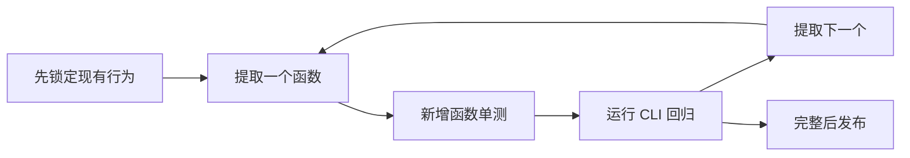
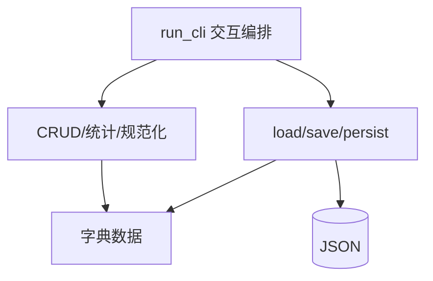
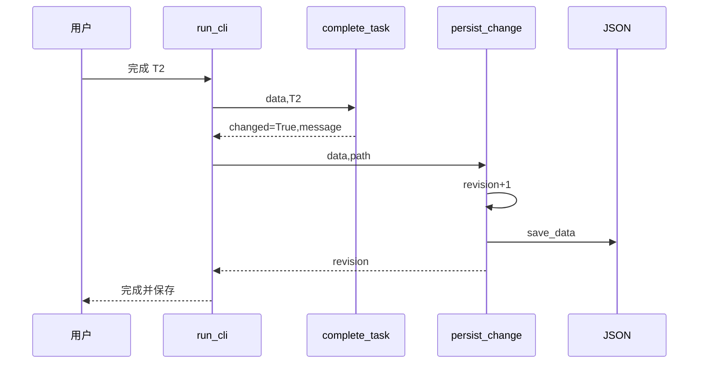
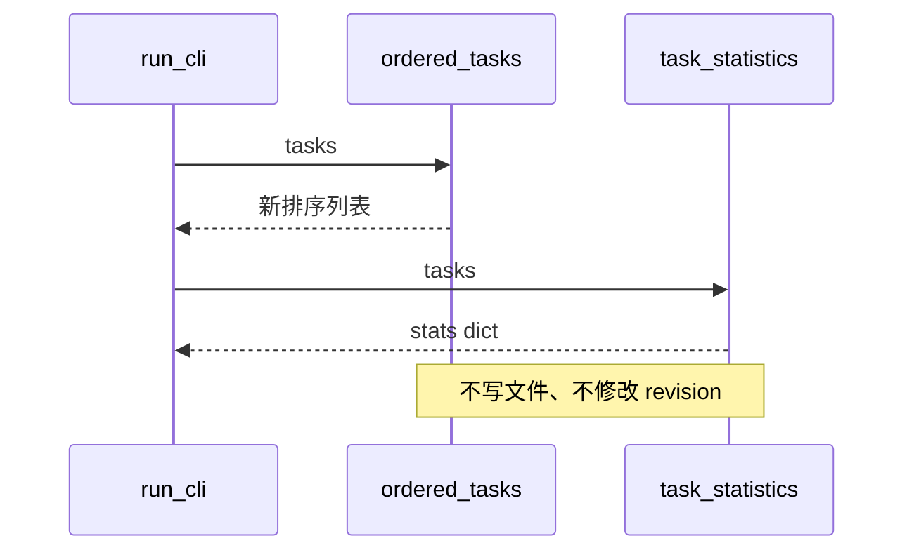
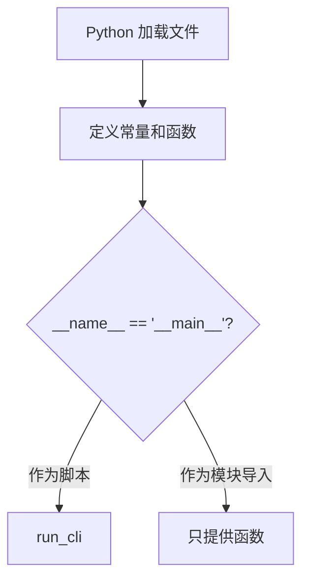
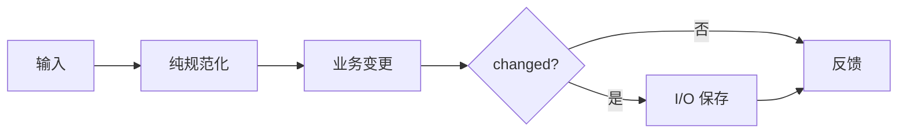
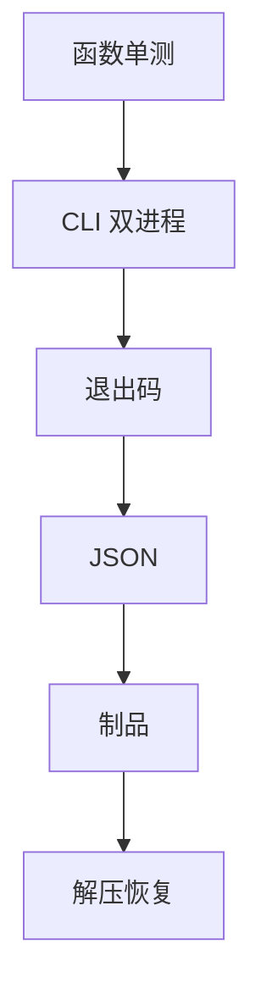
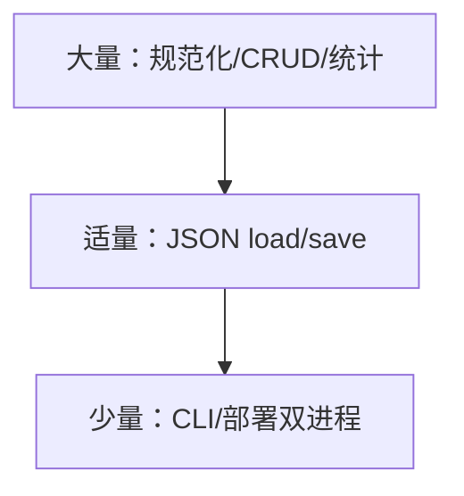

# Day 6｜从可运行脚本到可测试服务：函数、参数、返回值与作用域

> 课程阶段：第一阶段·Python 编程基础  
> 建议课时：授课 3 小时 + 实操 3.5 小时 + 晚自习 2 小时  
> 项目版本：NexusAI 0.0.6  
> 今日需求：US-FOUNDATION-006  
> 前置产物：Day 5 JSON 持久化任务台账  
> 今日交付：函数化任务服务、单元测试、CLI 回归、发布包  

---

## 0. 开场旁白：重复代码不是只难看，它会制造不一致

【讲师旁白】

Day 5 成功把任务保存为 JSON，但每个新增、完成、删除、清理分支都复制了 revision 加一、打开文件、dump、换行的代码。某一天开发者只在“新增”分支加了 `sort_keys=True`，其他分支仍用旧格式；另一天“清理”忘记把新列表赋回 data。脚本可以运行，却越来越难证明所有路径遵循同一规则。

今天我们不增加新的业务菜单，而是做一次企业中非常重要的重构：在保持外部行为不变的前提下，把重复和混杂逻辑拆成有名字、有参数、有返回值、可独立测试的函数。

```python
changed, message = complete_task(data, "T2")
if changed:
    revision = persist_change(data, data_file)
```

`complete_task` 只关心业务状态；`persist_change` 只关心 revision 和保存；`run_cli` 负责用户交互和编排。单元测试可以直接调用函数，不再为每条规则模拟整段终端输入。


函数是未来 Tool、API handler、LangGraph node 和模型适配器的基础。今天先把边界设计正确。

---

## 1. 今日目标与完成定义

### 1.1 Day 5 重构清单

| 重复/混杂点 | Day 6 函数 |
|---|---|
| 默认文档字面量 | `create_default_data()` |
| 编号清理校验 | `normalize_identifier()` |
| 部门别名 | `normalize_department()` |
| 标签多组合并 | `merge_tags(*tag_groups)` |
| 任务字典构造 | `create_task()` |
| 字段更新 | `update_task(**changes)` |
| 数据浅校验 | `validate_data()` |
| 加载 | `load_data()` |
| 保存 | `save_data()` |
| revision+保存 | `persist_change()` |
| CRUD | `add/complete/delete/cleanup` |
| 排序查询 | `ordered_tasks()` |
| 统计 | `task_statistics()` |
| CLI | `run_cli()` |

### 1.2 学习成果

1. 定义和调用函数。
2. 区分参数与实参。
3. 使用位置、关键字和默认参数。
4. 设计明确返回值。
5. 使用元组返回多项结果。
6. 理解局部、全局作用域。
7. 避免可变默认参数。
8. 使用 `*args` 和 `**kwargs`。
9. 理解递归基线。
10. 区分纯计算、状态变更、I/O 和编排。
11. 直接单测业务函数。
12. 保持 CLI 与持久化契约回归。

### 1.3 完成定义

- [ ] 每次默认数据调用返回独立对象。
- [ ] 编号标准化返回 valid/value/reason。
- [ ] `merge_tags` 可合并任意标签组。
- [ ] `create_task` 默认 priority=3、is_done=False。
- [ ] `update_task` 只允许白名单字段。
- [ ] load/save 支持自定义 data_file。
- [ ] CRUD 返回 changed/message。
- [ ] 查询函数不修改主列表。
- [ ] 统计返回字典，不直接打印。
- [ ] 递归有明确终止条件。
- [ ] CLI 双进程行为与 Day 5 一致。
- [ ] 模块导入不自动启动 CLI。
- [ ] 函数单测、E2E、发布部署全部通过。

### 1.4 今日边界

- 模块与包系统 Day 10 深入，今天只使用主入口保护测试导入。
- JSONDecodeError 和 OSError Day 10。
- 类型注解 Day 13。
- lambda Day 13。
- 类与对象 Day 8。
- 递归仅教学，不替代 `len`。

---

## 2. 企业迭代安排

| 时间 | 活动 | 内容 | 产物 |
|---|---|---|---|
| 09:00-09:20 | 晨会 | 重复保存差异风险 | 重构目标 |
| 09:20-10:00 | 函数边界评审 | 输入、输出、副作用 | 接口表 |
| 10:10-11:00 | 函数基础 | 定义、参数、return | 练习 |
| 11:00-12:00 | 进阶参数 | 默认、*args、**kwargs、作用域 | 练习 |
| 14:00-14:20 | 计划会 | 小步提取顺序 | 看板 |
| 14:20-15:20 | 重构一 | 工厂、规范化、持久化 | alpha |
| 15:30-16:20 | 重构二 | CRUD、查询、CLI | rc |
| 16:20-17:00 | 测试 | 函数单测+双进程 | 报告 |
| 17:00-17:30 | 发布 | 无数据制品、恢复 | 0.0.6 |
| 19:00-20:20 | 作业 | 函数化文档队列 | 作业 |
| 20:20-21:00 | 复盘 | 函数边界与 Day 7 | 日志 |



重构不应一次重写全部。每提取一个函数就验证行为。

---

## 3. 企业需求文档

### 3.1 基本信息

| 项目 | 内容 |
|---|---|
| 名称 | 持久化任务台账函数化重构 |
| 编号 | US-FOUNDATION-006 |
| 业务负责人 | 林岚 |
| 技术负责人 | 陈工 |
| 测试负责人 | 赵敏 |
| 版本 | 0.0.6 |
| 变更类型 | 保行为重构 |

### 3.2 用户故事

> 作为任务平台开发团队，  
> 我希望把加载、保存、校验、CRUD 和统计拆为明确函数，  
> 从而独立测试规则、复用能力，并为后续模块和 Agent 工具提供稳定接口。

### 3.3 函数契约表

| 函数 | 输入 | 返回 | 副作用 |
|---|---|---|---|
| create_default_data | 无 | 新 dict | 无 |
| normalize_identifier | raw,prefix | valid,value,reason | 无 |
| normalize_department | raw | valid,value | 无 |
| merge_tags | *groups | 排序 list | 无 |
| create_task | 字段/default | task dict | 无 |
| update_task | task,**changes | changed bool | 修改 task |
| validate_data | data | valid,error | 无 |
| load_data | path | data,status,error | 读文件 |
| save_data | data,path | path | 写文件 |
| persist_change | data,path | revision | 修改+写 |
| add_task | data,task | changed,message | 修改 data |
| complete_task | data,id | changed,message | 修改 data |
| delete_task | data,id | changed,message | 修改 data |
| cleanup_completed | data | removed int | 修改 data |
| ordered_tasks | tasks,limit | 新 list | 无 |
| task_statistics | tasks | stats dict | 无 |
| count_tasks_recursive | tasks,index | int | 无 |
| format_line | *parts,separator | str | 无 |
| run_cli | path | status code | I/O/编排 |

### 3.4 业务规则

**BR-06-01 返回值**

业务写函数不直接保存，返回是否改变；CLI 只在 changed True 时 persist。

**BR-06-02 查询无副作用**

排序、统计、格式化不改变主数据。

**BR-06-03 默认对象独立**

每次 `create_default_data` 的 tasks 是不同列表。

**BR-06-04 更新白名单**

`update_task` 只允许 title/priority/is_done/tags，忽略 owner 等未知字段。

**BR-06-05 参数化文件**

load/save/persist/run_cli 接受 data_file，测试无需修改全局常量。

**BR-06-06 入口保护**

导入模块只定义函数；作为脚本运行才调用 run_cli。

### 3.5 验收标准

**AC-01 工厂隔离**：修改第一次默认 tasks 不影响第二次。

**AC-02 多标签参数**：两个标签组经 *args 合并、清理、去重、排序。

**AC-03 关键字更新**：priority 更新成功，未知 owner 不进入任务。

**AC-04 CRUD 幂等**：重复新增/完成不改变，未知删除不改变。

**AC-05 查询不改主顺序**：ordered 返回 T1/T2，原列表仍 T2/T1。

**AC-06 持久化函数**：自定义临时路径保存恢复。

**AC-07 CLI 双进程**：revision 1→7、身份不重输、最终任务正确。

**AC-08 入口**：单测导入模块不产生 CLI 提示或文件。

**AC-09 发布**：zip 无 JSON，解压后双进程完成 T9。

### 3.6 非功能要求

- 函数名表达业务动作。
- 函数职责可用一句话说明。
- 核心业务函数不 print/input。
- 返回值足以让调用者决策。
- 不用隐藏全局可变状态。
- 单元测试使用临时目录。

### 3.7 风险

| 风险 | 处理 |
|---|---|
| 提取时改变行为 | E2E 回归 |
| 可变默认参数共享 | tags=None |
| 函数过度拆分 | 以业务职责为边界 |
| 返回结构含义不清 | 契约表/测试 |
| I/O 与业务混合 | run_cli 编排 |
| 递归深度 | 仅教学 |

---

## 4. 架构设计

### 4.1 分层



### 4.2 变更时序



### 4.3 查询时序



### 4.4 导入与运行



---

## 5. 函数基础课堂笔记

### 5.1 定义与调用

```python
def normalize_title(raw_title):
    return " ".join(raw_title.split())

title = normalize_title("  设计   Agent ")
```

定义不会立即执行函数体，调用才执行。

### 5.2 参数与实参

`raw_title` 是形参，调用中的字符串是实参。参数是函数边界，不是全局变量。

### 5.3 return

`return` 把结果交给调用者并结束函数。没有显式 return 的函数返回 None。

```python
def add(a, b):
    return a + b
```

不要把 print 当 return。print 只展示，调用者拿不到结构化结果。

### 5.4 多返回值

```python
return True, value, ""
```

实际上返回元组，可解包：

```python
valid, value, reason = normalize_identifier(raw, "E")
```

顺序必须在契约中明确。未来可用对象提升可读性。

### 5.5 早返回

```python
if value == "":
    return False, value, "不能为空"
```

无效条件立即返回，主成功路径更清晰。

### 5.6 函数命名

动词开头：create/load/save/add/complete/delete。布尔判断可用 is/has/validate。名字不要叫 `do_it`。

### 5.7 文档字符串

函数第一条字符串说明职责、输入输出和关键边界。注释解释为什么，docstring 解释接口。

---

## 6. 参数课堂笔记

### 6.1 位置参数

```python
normalize_identifier("e1", "E")
```

按顺序匹配。顺序互换会改变含义。

### 6.2 关键字参数

```python
save_data(data, data_file="state.json")
```

调用意图清晰，顺序更灵活。位置参数应在关键字参数之前。

### 6.3 默认参数

```python
def create_task(task_id, title, priority=3):
```

未提供时使用3，提供时覆盖。默认值适合最常见且稳定的业务选择，不要隐藏关键必填。

### 6.4 可变默认参数陷阱

错误：

```python
def create_task(tags=[]):
    tags.append("default")
    return tags
```

默认列表在函数定义时创建，多次调用共享。

正确：

```python
def create_task(tags=None):
    if tags is None:
        tags = []
```

### 6.5 `*args`

```python
def merge_tags(*tag_groups):
```

调用可传任意数量位置组：

```python
merge_tags(["rag"], ["agent"], ["urgent"])
```

函数内 tag_groups 是元组。适合数量不固定、含义相同的输入。

### 6.6 `**kwargs`

```python
def update_task(task, **changes):
```

调用：

```python
update_task(task, priority=1, is_done=True)
```

函数内 changes 是字典。必须字段白名单，不能无条件 update 不可信输入。

### 6.7 keyword-only 预告

今天 `separator` 可关键字传入。复杂接口可用 `*` 强制关键字，提高可读性，后续深入。

---

## 7. 作用域课堂笔记

### 7.1 局部变量

函数内 `normalized` 只在 merge_tags 调用期间存在。不同调用互不共享。

### 7.2 全局常量

SCHEMA_VERSION 等全大写常量可读取。业务函数不修改全局 tasks/data。

### 7.3 避免 global

若 add_task 依赖全局 data，测试必须先设置隐藏状态，多实例互相干扰。通过参数显式传入。

### 7.4 LEGB 概念

Python 查找名字大致按 Local、Enclosing、Global、Built-in。今天重点是局部与全局，闭包后续讨论。

### 7.5 引用与副作用

传入 dict 后修改其内容会影响调用者。返回 changed 明示发生了什么。查询函数应创建新列表，不修改。

### 7.6 重新绑定

函数内 `tasks = [...]` 只重新绑定局部名，若要更新 data 必须 `data["tasks"] = ...`。cleanup 直接更新 data。

---

## 8. 函数边界与副作用

### 8.1 纯函数倾向

normalize、merge、ordered、statistics 相同输入得到相同输出，不读写文件，易测试。

### 8.2 状态变更函数

add/complete/delete/cleanup 修改显式传入 data，返回 changed/message。

### 8.3 I/O 函数

load/save 负责文件。prompt 和 run_cli 负责终端。

### 8.4 编排函数

run_cli 不重复业务规则，只组合函数、根据 changed 决定是否 persist。



### 8.5 返回消息的权衡

业务函数返回中文消息便于 CLI，但会把展示文案耦合领域层。当前课程接受；后续可返回状态码，由界面国际化。

---

## 9. 递归课堂笔记

### 9.1 定义

函数调用自身解决规模更小的同类问题。

```python
def count_tasks_recursive(tasks, index=0):
    if index >= len(tasks):
        return 0
    return 1 + count_tasks_recursive(tasks, index + 1)
```

### 9.2 基线

index 到列表末尾返回0。如果没有基线，会无限递归直到 RecursionError。

### 9.3 递归步骤

当前一条贡献1，把剩余问题交给 index+1。

### 9.4 为什么生产用 len

`len(tasks)` 更快、更清晰、不受递归深度。递归用于理解调用栈，未来树形工作流/文档目录更合适。

### 9.5 递归追踪

三条任务：

```text
count(index0)
=1+count(index1)
=1+1+count(index2)
=1+1+1+count(index3)
=3
```

---

## 10. 主入口保护

```python
if __name__ == "__main__":
    raise SystemExit(run_cli())
```

直接运行时 `__name__` 是 `"__main__"`；测试导入时是模块名，因此不会启动 input。Day 10 系统学习模块机制，今天先理解测试需求。

入口返回状态码：

- 0 正常。
- 2 身份三次失败。
- 3 数据契约拒绝。

---

## 11. 课堂重构步骤

### 11.1 先锁行为

运行 Day 5 E2E，记录 revision 与输出。没有回归保护不要大改。

### 11.2 提取默认工厂

用函数避免默认可变对象共享，写两个调用隔离测试。

### 11.3 提取规范化

让编号函数不 input/print，返回三项，CLI 决定提示。

### 11.4 提取 load/save

参数化路径，测试使用临时目录，不改 cwd 也可。

### 11.5 提取 persist

revision 与保存只出现一处。真实变更调用，查询不调用。

### 11.6 提取 CRUD

每个返回 changed/message。先单测，再替换 CLI 分支。

### 11.7 提取查询

ordered 返回新列表；statistics 返回字典。展示留在 CLI。

### 11.8 最后提取 run_cli

加主入口保护，导入单测确认无交互。

---

## 12. 单元测试设计

### 12.1 为什么单测

E2E 能证明整条链，但失败定位慢。函数单测直接验证一个契约，反馈更精确。

### 12.2 工厂测试

两个默认 data，修改一个 tasks，另一个仍空。专门防可变共享。

### 12.3 参数测试

位置、关键字、默认、*args、**kwargs 都有实例。

### 12.4 无副作用测试

ordered 返回排序视图后，原 data 顺序不变。

### 12.5 幂等测试

重复 add/complete 返回 changed False。

### 12.6 临时文件

load/save 使用测试独享目录，结束自动清理。

### 12.7 递归测试

空列表0、两条2。大列表不使用递归压力测试。

### 12.8 导入测试

通过 importlib 加载模块。如果没有入口保护，测试会等待 input。

---

## 13. CLI 与全链路测试

### 13.1 首进程

身份 revision1；新增 T2/T1 到3；完成 T2 到4；统计与摘要不增加；退出。

### 13.2 第二进程

恢复4；删除 T1 到5；清理 T2 到6；重新新增 T2 到7。

### 13.3 锁定

三次无效 return2，run_cli 被 SystemExit 转进程码；无文件产生。

### 13.4 schema

version8 return3，原文件不变。

### 13.5 发布

构建时双进程冒烟，删除 JSON，白名单压缩；解压后再执行首次和恢复完成。



---

## 14. 发布、部署与回滚

构建：

```bash
python3 course/day06/deploy/build_release.py --output artifacts/day06
```

制品三项：

```text
functional_task_board.py
README.txt
SHA256SUMS
```

运行 JSON 不进入包。解压后脚本哈希匹配，两个进程验证恢复。函数化是内部结构变化，schema仍v1，因此可读 Day5数据；但回滚仍应备份。

---

## 15. 安全与工程评审

### 15.1 参数显式

data_file 参数使数据位置可控；生产仍需限制任意路径输入。CLI 不让用户直接指定路径。

### 15.2 kwargs 白名单

不可信字典不能直接 `task.update(**payload)`。update_task 只允许业务字段，task_id不可被悄悄更改。

### 15.3 函数不等于安全

拆函数提升可测试性，不自动提供认证、原子写或加密。

### 15.4 返回错误

当前用返回元组，不抛业务异常。调用者必须检查 changed/status，忽略返回会丢失失败。

### 15.5 数据制品隔离

重构不能破坏 Day5发布红线，测试继续守护。

---

## 16. 团队协作模拟

### 16.1 晨会

**开发**：保存逻辑复制五次。  
**测试**：先保持 Day5 E2E。  
**技术负责人**：业务函数不 input/print。  
**安全**：kwargs 必须白名单。  
**运维**：发布制品格式不变。

### 16.2 接口评审问题

1. 输入是什么？
2. 返回什么？
3. 是否修改参数？
4. 是否 I/O？
5. 失败如何表达？
6. 是否可独立测试？
7. 默认参数安全吗？
8. 调用者如何知道保存？

### 16.3 代码评审清单

- [ ] 函数一句话职责。
- [ ] 无隐藏全局可变状态。
- [ ] 可变默认用 None。
- [ ] 业务函数不 print/input。
- [ ] 查询不改变数据。
- [ ] changed 控制保存。
- [ ] kwargs 白名单。
- [ ] 入口保护。
- [ ] 单测与 E2E 都有。

---

## 17. 常见错误与排障

### 17.1 忘记调用括号

`result = create_default_data` 保存函数对象；应加 `()`.

### 17.2 忘记 return

函数计算了值但返回 None。测试明确检查。

### 17.3 print 代替 return

终端有输出但调用者得到 None，无法编排。

### 17.4 参数顺序错误

位置参数 prefix/raw 互换。关键字参数可提升清晰。

### 17.5 可变默认共享

多次任务共享同一 tags。用 None。

### 17.6 局部遮蔽

函数内 `DATA_FILE = ...` 只局部重新绑定，可能与预期不同。参数化更清晰。

### 17.7 忽略 changed

重复完成仍 persist，revision错误增长。调用者必须判断。

### 17.8 查询原地 sort

破坏主顺序。ordered 使用新装饰列表。

### 17.9 导入启动 input

缺主入口保护。单测会 EOF 或挂起。

### 17.10 无限递归

基线缺失或 index不增加。画调用栈。

---

## 18. 随堂练习与答案

1. 参数和实参区别？定义占位与调用具体值。
2. 无 return 返回？None。
3. 多返回本质？元组。
4. 默认参数何时用？稳定常用非必填。
5. tags=[] 风险？跨调用共享。
6. *args 内类型？元组。
7. **kwargs 内类型？字典。
8. 局部变量生命周期？调用期间。
9. 查询函数应有副作用吗？原则上无。
10. changed False 是否保存？不。
11. 递归必须有什么？基线和缩小问题。
12. 主入口保护用途？导入不执行CLI。
13. 函数单测替代E2E吗？不，互补。
14. kwargs为何白名单？防越权字段修改。
15. data_file默认参数价值？生产默认、测试可替换。

---

## 19. 课后作业

### 19.1 基础作业 A

把知识文档队列拆为 create/load/save/add/process/delete/stats 函数，并写函数测试。

### 19.2 进阶作业 B

实现 `filter_tasks(tasks, *tags, match_all=False)`，支持任一标签或全部标签匹配。

### 19.3 企业挑战 C

评审一个“万能 process(action, data, **kwargs)”函数，说明为何过度集中，提出职责拆分。

### 19.4 测试作业 D

为每个函数列正常、边界、失败和副作用断言。

### 19.5 发布作业 E

导入模块验证不启动；脚本运行双进程；zip 无数据；哈希一致。

---

## 20. 课后作业完整参考答案

### 20.1 基础作业核心

```python
def create_document(document_id, title, priority=3, tags=None):
    if tags is None:
        tags = []
    return {
        "document_id": document_id,
        "title": " ".join(title.split()),
        "priority": priority,
        "processed": False,
        "tags": sorted(set(tags)),
    }


def add_document(data, document):
    ids = {item["document_id"] for item in data["documents"]}
    if document["document_id"] in ids:
        return False
    data["documents"].append(document)
    return True
```

### 20.2 进阶作业答案

```python
def filter_tasks(tasks, *tags, match_all=False):
    wanted = {tag.strip().lower() for tag in tags if tag.strip()}
    result = []
    for task in tasks:
        current = set(task["tags"])
        if match_all and wanted.issubset(current):
            result.append(task)
        elif not match_all and wanted & current:
            result.append(task)
    return result
```

空 wanted 的语义需契约决定：返回空还是全部。参考实现返回空。

### 20.3 企业挑战答案

万能函数会包含巨大 if/elif，参数只在某些 action 有效，返回类型不稳定，单测组合爆炸，修改一类动作影响全部。应按业务职责拆 CRUD、查询、持久化；run_cli 只编排。共享规范化提取小函数，不强行把不同动作合并。

### 20.4 测试矩阵

| 函数 | 正常 | 边界 | 失败 | 副作用 |
|---|---|---|---|---|
| create | 默认/覆盖 | 空tags | — | 无共享 |
| add | 新编号 | 空列表 | 重复 | tasks+1 |
| complete | 未完成 | 已完成 | 未找到 | bool变化 |
| delete | 存在 | 单条 | 未找到 | tasks-1 |
| ordered | 多条 | 空/limit0 | — | 原序不变 |
| save/load | 往返 | 空文件 | schema | 文件 |

### 20.5 发布答案

```text
导入：无提示、无文件
单测：通过
CLI 首次：revision2
CLI 恢复：任务1
构建暂存：删除运行JSON
zip：三项
解压：哈希一致
部署双进程：状态恢复
```

---

## 21. 讲师逐字稿

### 21.1 开场

“今天没有新菜单。我们要让相同行为更容易理解、测试和改变。重构成功的证据是外部行为不变，内部边界更清晰。”

### 21.2 return

“函数打印成功不等于调用者知道成功。返回 changed，编排层才能决定是否增加 revision。”

### 21.3 参数

“参数把依赖显式化。data_file 参数让测试写临时目录，不必修改全局或真实文件。”

### 21.4 默认参数

“默认值是接口承诺。可变默认对象跨调用共享，是经典缺陷，使用 None 后在函数内创建。”

### 21.5 args/kwargs

“灵活参数不是越多越好。*args 适合相同含义的标签组，**kwargs 更新必须白名单。”

### 21.6 作用域

“业务状态从参数进入、返回值出去。隐藏 global 会让测试顺序影响结果。”

### 21.7 递归

“先找基线，再确保每次问题变小。任务计数用 len，递归只是理解调用栈。”

### 21.8 测试

“单测告诉我们哪个函数错，E2E告诉我们函数是否正确协作。两者不能互相替代。”

### 21.9 发布

“内部重构也要重跑发布。一个入口保护错误就可能让部署脚本导入时等待输入。”

---

## 22. 函数契约与故障注入实验室

### 实验 1：默认对象隔离

调用两次工厂，修改第一份，第二份必须不变。

### 实验 2：空编号

返回 False、空标准值、明确原因，不 print。

### 实验 3：前缀参数

同一函数分别验证 E/T，证明规则复用而非复制。

### 实验 4：部门别名

输入客服部得到 valid True/标准名；未知部 False但保留清理值供提示。

### 实验 5：零标签组

`merge_tags()` 返回空列表。

### 实验 6：多标签组

三组合并去重排序，输入列表不被修改。

### 实验 7：默认任务

priority3、False、空标签，连续两次 tags 不共享。

### 实验 8：关键字覆盖

priority=1/is_done=True 正确。

### 实验 9：kwargs 未知字段

owner被忽略，changed 不因未知字段变 True。

### 实验 10：相同更新

priority已经1，再更新1返回 False。

### 实验 11：顶层非字典

validate False，不尝试访问 keys。

### 实验 12：缺关键键

返回具体错误，不填默认后覆盖。

### 实验 13：load new

文件不存在 status new，返回独立默认。

### 实验 14：load empty

status empty，revision0。

### 实验 15：load rejected

schema2 status rejected，不写文件。

### 实验 16：save返回路径

调用者可记录实际路径，文件 UTF-8稳定。

### 实验 17：persist

revision先加再保存，加载后相同。

### 实验 18：add

首次True，重复False，任务数不重复增长。

### 实验 19：complete

首次True，重复False，未知False。

### 实验 20：delete

存在返回标题消息，未知不变。

### 实验 21：cleanup

返回准确数量，保留进行中。

### 实验 22：ordered

结果排序，原列表顺序不变。

### 实验 23：limit

None全部，1一条，0空列表，大于长度全部。

### 实验 24：statistics

空数据全0标签空；混合状态计数正确。

### 实验 25：递归空

基线立即0。

### 实验 26：递归两条

两层调用返回2。

### 实验 27：format_line

默认中文分隔，关键字参数改斜线。

### 实验 28：模块导入

无 input、无 banner、无 JSON。

### 实验 29：脚本运行

主入口调用 run_cli，返回码转进程码。

### 实验 30：CLI 首次

函数组合 revision1-4，输出与 JSON一致。

### 实验 31：CLI 恢复

不消耗身份输入，继续菜单。

### 实验 32：CLI 锁定

return2，不保存默认空文档。

### 实验 33：CLI schema

return3，原文件不变。

### 实验 34：制品导入

解压脚本也可被测试模块导入，不自动运行。

### 实验 35：部署双进程

首次新增、第二次完成，revision3。

### 实验 36：运行数据隔离

构建冒烟 JSON 删除后才 zip。

### 实验 37：函数过大检查

run_cli 仍较长，记录 Day10模块拆分，不在 Day6过度设计。

### 实验 38：消息耦合

CRUD返回中文消息，记录未来状态码演化。

### 实验 39：异常边界

malformed JSON仍抛异常，Day10处理，不在函数化时偷改错误契约。

### 实验 40：历史回归

Day1-5门禁全部通过，重构不覆盖旧课程。

### 实验记录

```text
函数：
输入：
返回：
参数是否改变：
文件是否改变：
revision：
异常/状态：
契约是否满足：
```

---

## 23. 重构事故推演

### 23.1 persist 忘记 revision

文件变化但revision不变，恢复审计失真。集中函数单测防护。

### 23.2 complete 内直接保存

函数难以复用到批量事务，测试必须提供文件。拆业务与持久化。

### 23.3 ordered 原地 sort

查看改变主数据。单测明确原顺序。

### 23.4 tags 默认共享

T1新增标签后T2也出现。工厂隔离测试。

### 23.5 kwargs 无白名单

调用者可改 task_id/schema相关字段。字段白名单。

### 23.6 导入自动CLI

单测挂起或EOF。主入口保护。

### 23.7 changed 被忽略

状态已改但未保存，第二进程丢失。编排测试。

### 23.8 消息当状态判断

用字符串是否含“成功”决定保存很脆弱。使用 bool。

### 23.9 递归无基线

RecursionError。空列表单测先行。

### 23.10 全局 data

测试相互污染。显式参数和工厂。

---

## 24. 逐函数契约深度评审

这一节用于下午代码评审。每个函数都按“职责、输入、返回、副作用、失败表达、测试证据、后续演化”七项检查。学员不得只复述代码语法。

### 24.1 `create_default_data`

职责是创建全新的 Schema v1 空文档。它必须每次构造新的 tasks 列表，不能把一个全局字典直接返回。

错误方案：

```python
DEFAULT_DATA = {"tasks": []}

def create_default_data():
    return DEFAULT_DATA
```

第一次调用追加任务会污染后续调用。测试通过两个返回对象验证隔离。后续可用 dataclass/Pydantic 工厂，但“每次得到独立可变状态”的契约不变。

### 24.2 `normalize_identifier`

输入是原始字符串和前缀，返回 valid、标准值、原因。它不读 input、不 print，因此同一规则可用于员工和任务编号，也可被 API 层调用。

返回无效时仍给标准值，调用者可用于日志或提示，但不得当有效主键。原因不包含用户原始敏感文本。

### 24.3 `normalize_department`

把别名字典封装在函数局部，返回是否白名单和标准部门。后续别名应来自配置或权威组织目录。当前函数是确定性纯计算，适合参数化测试。

### 24.4 `merge_tags`

`*tag_groups` 表达任意数量的同类输入。例如已有标签、用户新增标签、系统标签可一起合并：

```python
merge_tags(existing_tags, user_tags, system_tags)
```

函数不修改原组，返回新的排序列表。空组、空标签、大小写和重复都要测试。未来若标签有来源和权限，不能只保存字符串。

### 24.5 `create_task`

使用默认 priority=3 和 is_done=False。`tags=None` 是避免可变默认共享的关键。函数目前相信 task_id 已标准化；职责边界是“构造”，不是重复所有输入校验。

评审问题：是否应在工厂内部强制优先级范围？当前 CLI 已校验，单元调用可能绕过。后续领域对象应集中不变量；Day 6 先记录这一权衡。

### 24.6 `update_task`

`**changes` 提供扩展性，allowed_fields 提供控制。函数返回实际是否改变，而不是“是否传入参数”。传入相同 priority 返回 False；未知 owner 被忽略且不应让 changed 变 True。

生产接口可能应该对未知字段明确报错而不是忽略。当前教学选择避免意外写入，后续结构化错误改进。

### 24.7 `validate_data`

只做顶层浅校验。返回 `(False, reason)`，不 print，不写。它把“能否理解数据”与“怎样向用户展示错误”分开。

`required.issubset(data.keys())` 表达关键键集合关系。它不校验每条任务，课件必须标注边界。

### 24.8 `load_data`

输入路径，返回 data/status/error。status 有 new、empty、loaded、rejected。多返回让调用者区分正常首次与契约拒绝。

它读文件但不写，尤其 rejected 路径不能覆盖。JSON 语法异常尚未捕获，Day 10 处理。测试临时路径证明函数不依赖固定全局文件。

### 24.9 `save_data`

只保存，不增加 revision。这样备份、迁移或测试可明确控制版本。它返回路径，便于调用者记录。

为什么不把 revision 加法放 save？因为有些保存可能是格式重写或迁移，是否算业务 revision 需要调用者决定。当前 `persist_change` 组合常用语义。

### 24.10 `persist_change`

把 revision+1 与 save 绑定。调用前必须已经完成业务变更。若 save 失败，内存 revision 已增加；当前异常边界尚未解决，Day 11 原子持久化会调整。

所有 CLI 写路径都只调用这一函数，减少复制差异。单测保存后重新加载核对 revision。

### 24.11 `add_task`

从 data tasks 现场计算 existing_ids，避免维护第二个隐藏集合。重复返回 False/message，不修改。成功 append 后返回 True。

它不保存，允许未来一次添加多条后统一事务保存。调用者必须检查 changed。

### 24.12 `complete_task`

幂等：未完成变完成返回 True；已完成返回 False；未找到返回 False。两个 False 的消息不同，未来可用枚举状态区分。

函数使用 `update_task` 实际修改，展示函数组合。若忽略 update_task 返回仍没问题，因为进入前已确认 False，但单测守住。

### 24.13 `delete_task`

按编号遍历，找到后 pop 并返回被删标题。编号唯一假设来自新增规则。未知不修改。

未来数据库删除会有并发和软删除语义，函数接口可继续返回 changed/result。

### 24.14 `cleanup_completed`

直接把新列表赋回 data["tasks"]，返回删除数量。数量0表示无变化，CLI 不持久化。

它比在遍历中 pop 更安全。函数本身不处理 task_ids，因为 Day6不再维护派生集合，全局一致性复杂度降低。

### 24.15 `ordered_tasks`

返回新排序列表，limit 可选。`None` 表示不限，0 返回空。它不修改输入。

装饰排序是知识边界方案。Day13学习 lambda 后可：

```python
sorted(tasks, key=lambda task: (task["priority"], task["task_id"]))
```

替换实现时契约和测试不变。

### 24.16 `task_statistics`

返回结构化字典而不是 print。CLI、API、测试和未来图表都可复用。同一个统计结果可采用不同展示。

高优先级只统计 active；标签稳定排序。空列表返回全0和空标签。

### 24.17 `count_tasks_recursive`

教学函数展示基线和递归步骤。默认 index=0 允许普通调用，也允许测试从中间位置开始。它不应成为生产统计实现。

如果传负 index 会产生不符合业务的计数，这是未校验参数。内部教学函数假设调用者遵守契约。

### 24.18 `format_line`

`*parts` 接收任意数量展示值，`separator` 关键字参数改变连接方式。所有值通过 str 转换。

它只负责机械格式，不决定哪些字段可输出。敏感信息控制仍由调用者负责。

### 24.19 `prompt_employee`

这是交互函数，允许 input/print。它调用纯规范化函数，不复制规则。三次失败返回 None，由 run_cli 决定退出码。

后续可注入 input_fn/output_fn 以直接测试交互，但当前 E2E 已覆盖。不要让领域函数反向调用 prompt。

### 24.20 `prompt_new_task`

协调多字段重试并返回任务。现有 IDs 通过参数传入，不访问全局。它调用 create_task，保持标签规则统一。

此函数仍较长，Day10 可拆 validator/UI 模块。重构有终点，不能为了“每个函数都短”制造碎片。

### 24.21 `run_cli`

最高层编排：加载、拒绝、身份、菜单、业务函数、changed判断、持久化和输出。它不实现底层 CRUD 细节。

返回状态码而非在中途到处 SystemExit，使函数测试更容易；主入口统一转为进程退出。

### 24.22 主入口

不是普通业务函数，却是运行契约。导入时不执行 run_cli，脚本运行时执行并把返回码交给操作系统。

### 契约评审表

```text
函数：
一句话职责：
位置参数：
关键字参数：
默认参数：
返回类型：
是否修改参数：
是否读文件：
是否写文件：
是否终端交互：
失败表达：
单测：
后续演化：
```

---

## 25. 重构课堂分镜

### 25.1 09:00-09:20 重复风险演示

讲师把 Day5 五段 json.dump 投屏，用不同颜色标出微小差异。提问：如果修改格式，需要改几处？漏一处测试能否发现？让学员理解重构动机来自变更风险，不是行数审美。

【讲师】

“复制代码像复制合同。五份合同要改同一条款，只漏一份就产生不一致。函数让规则有单一来源。”

### 25.2 09:20-10:00 函数边界卡片

给每组 Day5 代码片段，让学员分类：

- 规范化计算。
- 业务变更。
- 文件I/O。
- 终端I/O。
- 编排。

把不同类别混在同一函数的片段重新分组。每组为函数写输入和返回，不先写代码。

### 25.3 10:10-10:30 定义与返回

从最小 normalize_title 开始。先写只 print 的错误版本，让调用者尝试复用，观察得到 None；再改 return。

### 25.4 10:30-11:00 多返回

对 valid/value/reason 画数据流。比较三种方案：

1. 只返回 bool，调用者拿不到标准值。
2. 返回字符串，无法区分有效空值。
3. 返回元组，信息完整但位置需契约。

当前选3，后续对象化。

### 25.5 11:00-11:25 默认参数

运行经典共享列表实验：

```python
def bad(tags=[]):
    tags.append("x")
    return tags
```

连续调用三次观察增长。再用 None 修复。要求学员解释“默认表达式何时创建”，不只背结论。

### 25.6 11:25-11:45 args/kwargs

让三个小组分别提供 user/system/imported 标签，merge_tags 合并。随后向 update_task 传 owner，证明白名单阻止未知字段。

### 25.7 11:45-12:00 作用域

故意建立全局 data，让两个测试相互污染。改为工厂和参数后，测试可任意顺序。讲解显式依赖。

### 25.8 14:00-14:20 重构计划

顺序：

1. 运行 Day5回归。
2. 提取纯函数。
3. 提取I/O。
4. 提取业务变更。
5. 提取查询。
6. 最后编排和入口。

不要先改 run_cli 全部结构，否则失败定位困难。

### 25.9 14:20-14:50 工厂与规范化

每提取一个函数立即写单测。驾驶员敲代码，领航员读契约。函数体之外的变量使用必须被指出。

### 25.10 14:50-15:20 持久化

测试用临时路径调用 load/save/persist。确认不写仓库默认文件。讲师检查 revision职责是否混入 save。

### 25.11 15:30-16:00 CRUD

先写 changed/message 测试，再实现。重复新增、重复完成、未知删除属于正常业务结果，不用 print。

### 25.12 16:00-16:20 查询和递归

ordered前后比较原列表；stats检查空/混合；递归画三层调用栈。明确 len 才是生产选择。

### 25.13 16:20-17:00 单测+E2E

故意破坏一个函数，观察单测精确失败；再破坏编排（忽略changed），单测通过但E2E revision失败。说明测试层互补。

### 25.14 17:00-17:30 发布

导入测试是新增风险：若入口保护缺失，构建或单测会等待输入。发布双进程继续验证持久化行为。

### 25.15 晚自习代码评审

每位学员随机抽一个函数，必须在两分钟内说明七项契约。不能解释副作用的函数退回重构。

---

## 26. 测试替身与可测试性专题

Day 6 不正式引入 mock 框架，但先理解为什么函数边界影响测试。

### 26.1 真实文件与临时文件

save_data 接受路径，因此测试传临时文件。这不是 mock，而是隔离的真实 I/O。它验证编码和 JSON 字节行为。

### 26.2 纯函数无需替身

normalize/merge/stats 直接给输入检查输出。纯函数测试速度快、无环境依赖。

### 26.3 终端交互为何用 E2E

prompt函数直接用 input/print，当前通过 subprocess模拟真实终端。未来可以参数化：

```python
def prompt_employee(input_fn=input, output_fn=print):
```

测试传入假函数。但这引入一等函数和依赖注入，后续系统讲。

### 26.4 时间与随机数

若 create_task 内直接读取当前时间或随机ID，测试结果不稳定。未来把 clock/id_generator 作为依赖，或在边界生成后传入。

### 26.5 网络

Day12 模型API不应在所有单测中真实调用。把HTTP客户端封装接口，单测使用可控响应，集成测试少量真实环境。

### 26.6 文件系统失败

Day10可通过不可写目录或替身模拟 OSError。当前正常路径和数据契约优先。

### 26.7 测试金字塔



图形宽度不代表严格比例，而是反馈速度和环境范围。所有层都要服务风险。

### 26.8 测试不是实现镜像

测试若逐行复制函数算法，两个地方可能同错。测试使用业务例子和不变量：

- 排序结果。
- 原列表不变。
- revision精确。
- 制品无数据。

### 26.9 参数化思想

同一规范化函数可用表格测试空、前缀、合法。今天手写断言，后续 pytest参数化减少重复。

### 26.10 测试命名

名称表达条件和结果，例如：

```text
test_complete_already_done_does_not_increment_revision
```

比 `test_complete_2` 更有维护价值。

---

## 27. 函数接口演化设计

### 27.1 从元组到结果对象

当前：

```python
changed, message = complete_task(...)
```

未来可能需要 code、task、audit。长元组易错，可用 dataclass：

```text
OperationResult(changed, code, message, value)
```

Day8对象后实现。

### 27.2 从字典到类型模型

task_statistics 返回字典，调用者可能拼错键。Day13类型注解、Pydantic后加强。

### 27.3 从本地函数到 Tool

Agent工具需要：

- 稳定名称。
- 参数schema。
- 结构化返回。
- 权限和审计。
- 幂等与超时。

今天 complete_task 的明确输入输出正是工具基础。

### 27.4 从 save_data 到仓储接口

未来 JSONRepository、DatabaseRepository 都实现 load/save。业务 CRUD 不关心存储细节。Day10模块、Day24数据库逐步演化。

### 27.5 从 run_cli 到 API

FastAPI handler 解析请求后调用相同业务函数，根据 changed/result 生成HTTP响应。业务规则不复制到路由。

### 27.6 向后兼容

改变函数参数名、默认值或返回形状会影响调用者。内部函数也应通过测试管理契约。重构实现不应随意改外部语义。

### 27.7 版本策略

当前应用版本0.0.6，JSON schema仍1。代码版本与数据版本独立。函数接口若公开，还可能有API版本，三者不要混同。

---

## 28. 函数代码评审案例

### 案例 1：万能保存

```python
def save(data, changed=True, print_message=True, exit_after=False):
```

布尔开关让函数承担过多职责。拆 persist、展示、退出。

### 案例 2：隐藏读取

```python
def complete_task(task_id):
    data = load_data()
```

测试和批量操作困难。显式传 data。

### 案例 3：返回不稳定

成功返回 task，失败返回 False，调用者类型判断复杂。返回统一结果。

### 案例 4：吞掉错误

未知字段 update_task 目前忽略。若安全关键，应返回拒绝列表。契约必须明确，不能静默既无文档又无测试。

### 案例 5：函数名误导

`get_tasks()` 却原地排序主列表。get暗示查询，副作用违反预期。ordered返回新列表。

### 案例 6：过度微函数

把 `revision += 1` 单独拆函数未必有价值；与保存组合成 persist_change有业务语义。

### 案例 7：重复校验

prompt与create都各写一套编号规则，未来不一致。规范化单一来源。

### 案例 8：直接暴露可变对象

ordered返回原任务字典引用，调用者仍可修改主数据。当前契约只保证外层顺序不变，不是深只读；文档必须准确。未来返回模型副本。

### 案例 9：递归炫技

用递归替代所有循环降低可读性。技术选择服务问题，不展示聪明。

### 案例 10：测试只看print

函数返回和数据状态才是核心。print由CLI E2E覆盖。

---

## 29. 第一周项目演化复盘

### 29.1 数据演化


### 29.2 工程证据演化

- Day1 手工验收和最小脚本。
- Day2 功能与发布链。
- Day3 控制流/退出码。
- Day4 CRUD组合与一致性。
- Day5 文件字节和双进程。
- Day6 函数单测加E2E。

### 29.3 安全边界演化

- 模拟数据。
- 输入治理。
- 有限重试。
- 唯一编号。
- schema拒绝。
- kwargs白名单与导入边界。

### 29.4 Day7周测准备

学员应能不看答案从需求拆出数据、规则、函数、测试和持久化。周测不是背 API，而是完成小型通讯录系统闭环。

---

## 30. 参数绑定与返回值逐例推演

### 30.1 位置参数正确绑定

```python
normalize_identifier("e1", "E")
```

第一个实参绑定 raw_value，第二个绑定 prefix。返回 `(True, "E1", "")`。

### 30.2 位置参数顺序错误

```python
normalize_identifier("E", "e1")
```

语法合法但业务含义错误。Python 不理解参数语义，只按位置绑定。关键字调用可减少误读：

```python
normalize_identifier(raw_value="e1", prefix="E")
```

### 30.3 缺少必填参数

```python
normalize_identifier("e1")
```

调用时 TypeError，因为 prefix 无默认。关键业务前缀不应偷偷默认为 E，否则任务编号调用容易忘记覆盖。

### 30.4 多余位置参数

```python
normalize_identifier("e1", "E", "extra")
```

函数未定义 `*args`，TypeError。只有确实支持可变数量时才加入 `*args`，不要为了“更灵活”吞掉错误。

### 30.5 默认优先级

```python
create_task("T1", "标题")
```

priority 使用3。默认值是接口行为，测试应固定。

### 30.6 关键字覆盖默认

```python
create_task("T1", "标题", priority=1)
```

priority为1。关键字名称使调用可读。

### 30.7 关键字重复赋值

```python
create_task("T1", "标题", 1, priority=2)
```

priority既被位置参数赋1又被关键字赋2，TypeError。一个形参只能绑定一次。

### 30.8 位置参数位于关键字之后

```python
create_task(task_id="T1", "标题")
```

SyntaxError。调用中普通位置参数必须在关键字参数前。

### 30.9 省略中间默认参数

若想只设置 tags：

```python
create_task("T1", "标题", tags=["rag"])
```

使用关键字跳过 priority，不能靠多个空占位。

### 30.10 `None` 与空列表

调用者明确传 `tags=[]` 与省略 tags 最终都得到独立空列表。传 None 表示使用默认创建逻辑。函数不能写 `if not tags` 后混淆某些合法空容器语义，当前两者业务等价但代码意图要清楚。

### 30.11 `*args` 零项

```python
merge_tags()
```

tag_groups 是空元组，循环零次，返回空列表。可变参数函数也要定义零项语义。

### 30.12 `*args` 展开

```python
groups = [["rag"], ["agent", "RAG"]]
merge_tags(*groups)
```

星号把列表中的两个组展开成两个位置实参。若不加星号，函数收到一个“组的列表”，内层 tag 实际是列表，调用 strip 会失败。数据层级必须匹配契约。

### 30.13 `**kwargs` 展开

```python
changes = {"priority": 1, "is_done": True}
update_task(task, **changes)
```

双星号把字典键绑定为关键字参数，函数内重新收集为 changes 字典。键必须是字符串。

### 30.14 kwargs 冲突

若函数同时有显式参数和 `**kwargs`，同名重复仍会 TypeError。`**kwargs` 不是绕过接口规则。

### 30.15 元组返回解包

```python
valid, value, reason = normalize_identifier("e1", "E")
```

左侧数量必须等于三。只关心部分可用下划线：

```python
valid, value, _ = normalize_identifier("e1", "E")
```

下划线只是普通变量的惯例，表示有意忽略。

### 30.16 返回后代码不执行

```python
def example():
    return 1
    print("不会执行")
```

return 立即结束本次调用。把必要清理放 return 后会失效；文件上下文管理器可保证退出清理。

### 30.17 多分支返回完整性

函数某分支 return 元组，另一分支没有 return，会得到 None，调用解包失败。评审所有路径是否返回同一形状。

### 30.18 修改参数对象

`complete_task(data, "T1")` 修改 data 内任务。函数返回 changed 之外，调用者持有对象也变化。这是文档化副作用。

### 30.19 重新赋值不影响调用者名字

```python
def replace_data(data):
    data = {"tasks": []}
```

只重新绑定局部参数，不改变调用者变量。修改 `data["tasks"]` 才作用于同一对象。

### 30.20 浅复制

```python
copy = data.copy()
```

只复制顶层字典，tasks 仍共享。函数若承诺无副作用，不能仅浅复制后修改嵌套任务并误以为安全。

### 30.21 返回新视图

ordered_tasks 创建新外层列表，但任务字典仍是原引用。调用者修改结果中的 task 字段会影响主数据。当前契约只保证“不改变排序”，不保证深只读。

### 30.22 默认参数求值时机

默认表达式在 def 执行时求值，不是每次调用。None 模式让可变对象在函数调用时新建。这个时机也影响把当前时间或随机值直接写默认参数的错误。

### 30.23 函数对象作为值

```python
normalizer = normalize_identifier
```

没有括号时保存函数对象，可以以后调用。Day13装饰器和依赖注入会使用。初学常见错误是本来想调用却漏括号。

### 30.24 递归默认 index

普通调用使用0；显式 `index=1` 从第二项开始计数。它是内部契约，CLI不暴露，避免用户传越界或负数。

### 30.25 状态码返回

`run_cli` 返回整数，主入口 `SystemExit` 把它转换为进程码。直接单元调用 run_cli 可检查返回而不强制整个测试进程退出（若能提供输入依赖）。

### 参数绑定检查表

```text
函数签名：
必填参数：
默认参数：
允许位置调用：
推荐关键字调用：
是否支持 *args：
零项语义：
是否支持 **kwargs：
字段白名单：
返回形状：
是否修改参数：
```

---

## 31. 复盘与次日衔接

### 31.1 保持

- 外部行为先锁定。
- 一函数一职责。
- 依赖通过参数。
- 结果通过return。
- 单测与E2E互补。
- changed控制持久化。

### 31.2 停止

- 复制保存逻辑。
- print代替return。
- 可变默认参数。
- 隐藏global。
- 查询修改主数据。
- 导入时启动CLI。

### 31.3 技术债

| 编号 | 内容 | 计划 |
|---|---|---|
| TD-022 | 保存重复 | Day6完成 |
| TD-026 | 单文件函数多 | Day10模块包 |
| TD-027 | 错误返回元组 | Day10异常/Day13类型 |
| TD-028 | CLI过长 | Day10拆分 |
| TD-029 | 无日志 | Day11 |

### 31.4 Day 7 输入

第一周复习、周测和通讯录综合练习。要求学员独立组合变量、字符串、条件、循环、列表、集合、字典、JSON和函数，完成可持久化企业联系人目录，并进行代码互评。

### 31.5 离场检查

- [ ] 我能设计函数契约。
- [ ] 我理解参数和返回。
- [ ] 我会默认/args/kwargs。
- [ ] 我能避免可变默认。
- [ ] 我理解局部与副作用。
- [ ] 我能区分业务/I/O/编排。
- [ ] 我会写函数单测。
- [ ] 我理解递归基线。
- [ ] 我会入口保护。
- [ ] 我能保持发布回归。

---

## 32. 教学质量门禁

| 指标 | 目标 |
|---|---:|
| 课件字符 | ≥30000 |
| Mermaid | ≥9 |
| 必备内容 | 全部 |
| 函数单测 | 通过 |
| CRUD契约 | 通过 |
| 无副作用查询 | 通过 |
| 双进程CLI | 通过 |
| exit2/3 | 通过 |
| 制品无数据 | 通过 |
| 部署恢复 | 通过 |
| Day1-5回归 | 通过 |

任一失败不交付。修复后重跑完整历史、单元、E2E、发布和部署链。

---

## 33. 今日交付与收尾旁白

```text
course/day06/day06-lesson.md
course/day06/starter/functional_task_board.py
course/day06/solution/functional_task_board.py
course/day06/tests/test_functions.py
course/day06/tests/test_cli.py
course/day06/deploy/build_release.py
course/day06/tests/test_release.py
tools/verify_day06.py
```

【收尾旁白】

“今天智枢从脚本变成了有边界的服务集合。参数让依赖显式，返回值让调用者决策，默认参数表达常用策略，args/kwargs提供受控扩展，作用域隔离状态，递归揭示调用栈，入口保护让代码可导入测试。业务行为没有变，但团队修改和验证它的成本显著降低。”
