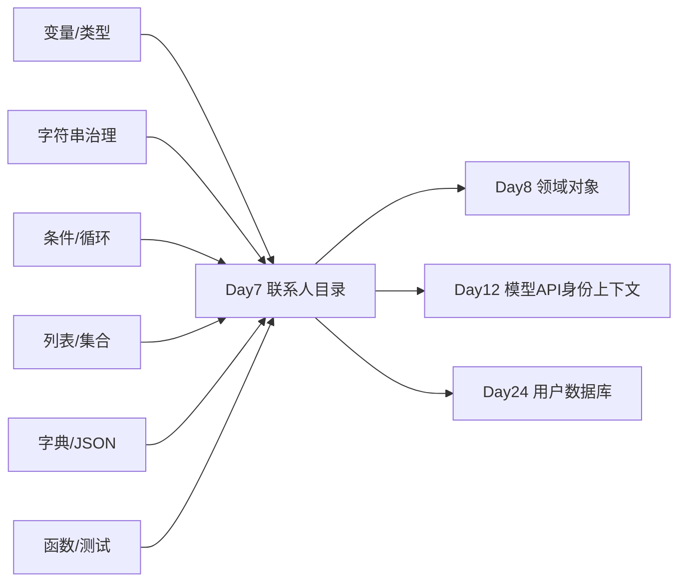
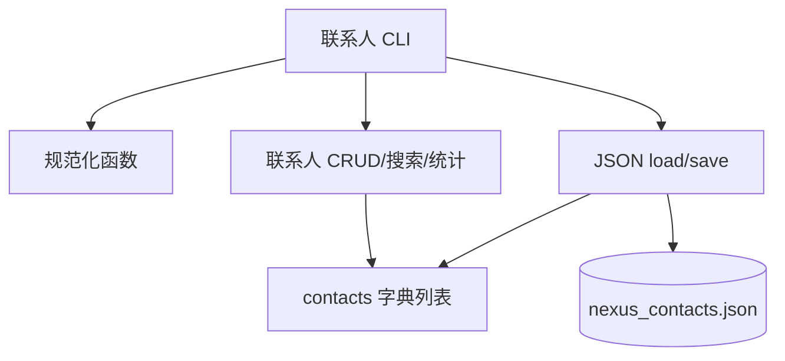
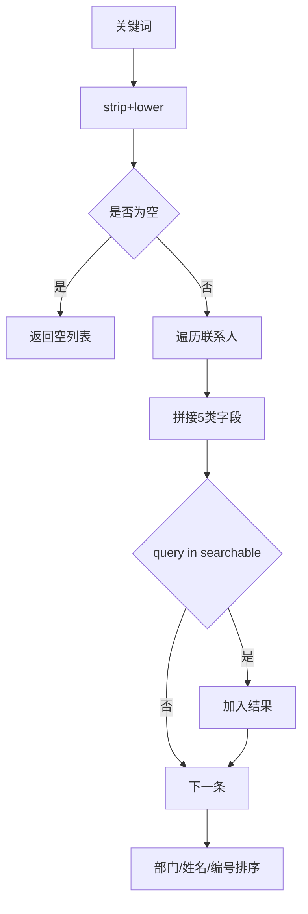
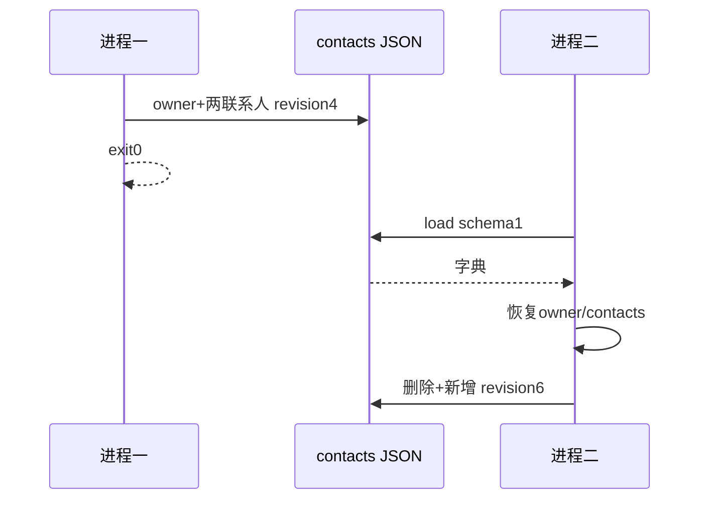

# Day 7｜第一周阶段项目：企业联系人目录、周测与代码评审

> 课程阶段：第一阶段·Python 编程基础·第一周验收  
> 建议课时：复习 1.5 小时 + 笔试 1 小时 + 项目 4 小时 + 评审 1.5 小时  
> 项目版本：NexusAI 0.0.7  
> 今日需求：US-FOUNDATION-007  
> 今日交付：联系人目录、周测、答辩、测试报告、发布包  

---

## 0. 开场旁白：第一周的目标不是“学完语法”

【讲师旁白】

前六天，我们每天只增加一类核心复杂度：Day 1 建立身份字段，Day 2 治理文本，Day 3 拒绝和恢复错误输入，Day 4 管理多条记录，Day 5 跨进程持久化，Day 6 用函数建立可测试边界。今天不再逐条跟写，而是把这些能力组合成一个新的企业需求：联系人目录。

联系人目录不是把“任务”改成“联系人”那么简单。它有两个唯一约束——联系人编号和模拟邮箱；需要跨姓名、部门、岗位、邮箱、技能搜索；需要按部门、姓名稳定排序；需要统计部门人数和技能集合；更新邮箱时还要排除联系人自己并检查其他记录。所有数据必须是虚构资料，邮箱使用 `.test` 保留域名，发布包不能夹带运行数据。



今天的“完成”需要需求、代码、单测、双进程 E2E、版本拒绝、发布隔离和演示答辩全部成立。笔试成绩不能代替项目，项目能运行也不能代替对原理的解释。

---

## 1. 第一周能力地图与完成定义

### 1.1 能力地图

| 日 | 核心能力 | 联系人项目中的落点 |
|---:|---|---|
| 1 | str/int/bool/input/print | 字段与展示 |
| 2 | 字符串方法/运算 | 编号、邮箱、技能清洗 |
| 3 | if/for/while | 校验、菜单、重试 |
| 4 | list/tuple/set | 联系人集合、白名单、唯一技能 |
| 5 | dict/JSON | 具名模型与持久化 |
| 6 | function/return/scope | 服务函数与测试 |

### 1.2 今日学习成果

学员能够：

1. 从用户故事提取数据模型和验收标准。
2. 为编号和邮箱设计唯一性约束。
3. 用函数隔离规范化、CRUD、搜索、统计和 I/O。
4. 用 JSON Schema/revision 保存联系人。
5. 用跨字段搜索实现最小目录查询。
6. 设计正常、边界、失败和安全测试。
7. 演示两个进程之间的数据恢复。
8. 进行基于证据的代码评审。
9. 解释当前系统为何不能存真实通讯录。
10. 形成第一周个人改进清单。

### 1.3 完成定义

- [ ] 首次维护人身份校验并保存。
- [ ] 联系人 C 编号唯一。
- [ ] 模拟邮箱标准化且唯一。
- [ ] 姓名、部门、岗位必填。
- [ ] 技能清理、去重、排序。
- [ ] 新增、查看、搜索、更新、删除、统计完整。
- [ ] 搜索覆盖五类字段。
- [ ] 更新无变化不增加 revision。
- [ ] 删除后编号/邮箱可复用。
- [ ] JSON 跨进程恢复。
- [ ] schema 未知时 exit3 且不覆盖。
- [ ] 三次维护人失败 exit2 且不写文件。
- [ ] 函数单测、CLI、发布部署通过。
- [ ] 周测和作业答案完整。

### 1.4 今日边界

- 邮箱只做教学格式判断，不验证真实归属。
- 不收集手机号、住址、身份证。
- 无登录、权限、审计和加密。
- JSON 仅适合单进程模拟。
- 真实目录必须接 HR/SSO 权威数据源。

---

## 2. 当日安排与团队节奏

| 时间 | 活动 | 产物 |
|---|---|---|
| 09:00-09:30 | 第一周知识图谱复盘 | 个人薄弱点 |
| 09:30-10:30 | 笔试周测 | 答卷 |
| 10:40-12:00 | 需求与架构评审 | 需求/模型/流程 |
| 14:00-14:20 | 迭代计划会 | 任务看板 |
| 14:20-16:20 | 独立编码 | 可运行项目 |
| 16:20-17:00 | 自动测试与缺陷修复 | 测试报告 |
| 17:00-17:30 | 发布部署 | 0.0.7 zip |
| 19:00-20:00 | 项目演示答辩 | 评审记录 |
| 20:00-21:00 | 讲评与复盘 | 改进计划 |


---

## 3. 企业需求文档

### 3.1 基本信息

| 项目 | 内容 |
|---|---|
| 名称 | Agent 试点企业联系人目录 |
| 编号 | US-FOUNDATION-007 |
| 业务负责人 | 林岚 |
| 产品经理 | 周宁 |
| 技术负责人 | 陈工 |
| 安全负责人 | 顾晴 |
| 目标版本 | 0.0.7 |

### 3.2 业务背景

Agent 试点涉及客服、销售、财务、技术和产品协作。员工需要按姓名、部门、岗位或技能找到合适协作者。现有模拟名单散落在消息中，名称和技能格式不统一。项目只做培训环境的虚构目录，验证数据模型与搜索能力，不导入真实员工信息。

### 3.3 用户故事

> 作为 Agent 试点目录维护人，  
> 我希望新增、查询、更新和删除模拟联系人，并跨进程保存，  
> 从而快速找到具备所需技能的协作者。

### 3.4 数据契约

```json
{
  "schema_version": 1,
  "revision": 4,
  "owner": {
    "employee_id": "E70007",
    "department": "客户服务部"
  },
  "contacts": [
    {
      "contact_id": "C2",
      "name": "李梅",
      "department": "技术部",
      "role": "高级 AI 工程师",
      "email": "limei@example.test",
      "skills": ["python", "rag"]
    }
  ]
}
```

### 3.5 字段规则

| 字段 | 规则 |
|---|---|
| contact_id | C 开头、非空、目录唯一 |
| name | 折叠空白、非空 |
| department | 五部门白名单，研发部→技术部 |
| role | 折叠空白、非空 |
| email | 小写、一个@、两侧非空、域名含点、目录唯一 |
| skills | 逗号输入、清理、小写、去重、排序 |

### 3.6 业务规则

**新增**：编号和邮箱都唯一才写入。失败不增加 revision。

**查看**：按部门、姓名、编号排序，不修改主列表。

**搜索**：关键词小写后，在姓名、部门、岗位、邮箱和技能拼接文本中做子串匹配；空关键词返回空。

**更新**：今日 CLI 更新岗位；业务函数允许姓名、部门、岗位、邮箱、技能，未知字段忽略。邮箱更新必须排除自己并检查其他联系人。

**删除**：按编号硬删除；当前没有审计，生产需软删除。

**统计**：总人数、各部门人数、唯一技能排序。

### 3.7 验收标准

**AC-01 首次初始化**：E70007/客服部保存 owner，revision1。

**AC-02 新增治理**：研发部保存技术部，邮箱小写，技能重复去除。

**AC-03 双唯一**：重复编号或重复邮箱拒绝，不增加 revision。

**AC-04 排序**：技术部李梅显示在销售部王芳之前。

**AC-05 搜索**：PYTHON 命中李梅；“销售”命中王芳；空词0。

**AC-06 更新**：C2 岗位更新后 revision+1；相同值不变。

**AC-07 删除复用**：删除 C1 后可用 C1 与新邮箱新增周宁。

**AC-08 恢复**：第二进程恢复 owner 和2名联系人，不再询问身份。

**AC-09 发布**：zip 无 nexus_contacts.json；解压后首次和恢复均成功。

### 3.8 非功能要求

- 仅模拟姓名与 `.test` 邮箱。
- 终端不输出未治理原始值。
- JSON UTF-8、稳定键、末尾换行。
- 所有测试使用临时目录。
- 发布包三项白名单。
- Python 3.10+ 标准库。

### 3.9 风险

| 风险 | 当前边界/后续 |
|---|---|
| 邮箱校验不完整 | 教学规则，生产使用权威身份源 |
| 搜索为子串 | 后续全文/向量检索 |
| JSON明文 | 不存真实数据 |
| 硬删除无审计 | Day11/24 |
| 多进程覆盖 | Day24数据库 |
| 角色更新无审批 | Agent阶段权限 |

---

## 4. 架构设计

### 4.1 组件图



### 4.2 数据流


### 4.3 搜索流



### 4.4 跨进程



### 4.5 发布流


---

## 5. 第一周知识复习课堂笔记

### 5.1 类型选择

编号和邮箱用 str；revision用 int；联系人列表用 list；联系人记录用 dict；技能唯一汇总用 set；固定部门用 tuple；校验结果用 bool。

### 5.2 字符串治理

`strip/split/join/lower/upper/replace/count/find` 都必须按字段语义使用。邮箱统一 lower，姓名不强制 lower，编号删除空格。

### 5.3 条件与循环

条件表达规则，while处理未知重试，for遍历联系人，break退出找到路径，continue跳过无效输入。

### 5.4 集合

编号/邮箱唯一检查使用集合视图；技能汇总使用集合。集合不负责稳定展示。

### 5.5 字典

具名字段降低位置错误。`.get` 可处理别名和计数，但关键字段不能用默认掩盖损坏。

### 5.6 JSON

对象/数组/字符串/数字/布尔/null 映射 Python。schema/version与revision分开。运行数据不进制品。

### 5.7 函数

输入参数、结构化返回、显式副作用。规范化和查询尽量纯，持久化集中，CLI编排。

---

## 6. 联系人核心函数解读

### 6.1 邮箱规范化

```python
value = raw_value.strip().lower()
```

一个@，本地和域名非空，域名含有效点。它不是 RFC 完整验证，也不发确认邮件。

### 6.2 新增双唯一

```python
ids = {item["contact_id"] for item in contacts}
emails = {item["email"] for item in contacts}
```

两项都通过才 append。失败返回 changed False。

### 6.3 更新邮箱

检查其他联系人：

```python
item["contact_id"] != contact_id and item["email"] == new_email
```

排除自己，否则保持同邮箱会被误判重复。

### 6.4 搜索

拼接多字段的标准展示值。子串搜索简单可解释，但“ai”可能命中 email 等非预期片段，产品需理解。

### 6.5 部门统计

```python
counts[department] = counts.get(department, 0) + 1
```

经典字典计数。最终按键排序生成稳定对象。

### 6.6 删除与复用

硬删除后编号和邮箱不在主列表，集合每次现算，因此可复用。生产历史主键通常不允许复用，当前仅模拟。

---

## 7. 项目实施步骤

1. 写需求和 JSON 样例。
2. 实现默认数据与 load/save。
3. 实现编号、部门、邮箱、技能规范化。
4. 实现联系人工厂。
5. 实现 add/update/delete。
6. 实现 order/search/stats。
7. 写函数单测。
8. 实现 prompt 与 run_cli。
9. 写双进程 E2E。
10. 构建无数据发布包。


---

## 8. 周测笔试题

### 一、选择与判断

1. `input()` 返回什么类型？  
2. `"100" * 2` 的结果？  
3. 空字符串布尔值？  
4. `range(1,4)` 包含哪些？  
5. `continue` 作用？  
6. 列表与元组主要差异？  
7. 集合是否保证展示顺序？  
8. 字典 `in` 默认检查键还是值？  
9. JSON null 对应什么？  
10. `json.dumps` 返回文件还是字符串？  
11. `ensure_ascii=False` 作用？  
12. 函数无 return 返回什么？  
13. `*args` 在函数内是什么？  
14. `**kwargs` 是什么？  
15. 可变默认参数是否安全？  
16. 查询函数原地排序是否有副作用？  
17. schema_version与revision是否相同？  
18. 哈希一致是否证明发布者身份？  
19. 邮箱格式通过是否证明邮箱归属？  
20. JSON 文件是否等于生产数据库？

### 二、代码阅读

21. 预测：

```python
items = ["a", "b"]
copy = items
copy.append("c")
print(items)
```

22. 预测：

```python
tags = {"rag", "rag", "agent"}
print(len(tags))
```

23. 找错：

```python
if value < 1 and value > 5:
    print("越界")
```

24. 找错：

```python
def add_tag(tags=[]):
    tags.append("x")
    return tags
```

25. 解释：

```python
data["revision"] += 1
```

26. 为什么 `task_ids` 可从 tasks 重建？  
27. 为什么未知 schema 不应默认空数据？  
28. 为什么模块导入要入口保护？  
29. 为什么搜索结果排序？  
30. 为什么发布包不能带运行 JSON？

### 三、简答与设计

31. 为联系人写字段字典。  
32. 设计邮箱唯一验收标准。  
33. 设计跨进程恢复测试。  
34. 说明函数单测与E2E差异。  
35. 说明显式参数优于global。  
36. 设计联系人搜索字段。  
37. 设计部门统计输出。  
38. 说明硬删除风险。  
39. 说明模拟数据边界。  
40. 画出新增联系人数据流。

---

## 9. 周测答案与评分标准

1. str。  
2. `100100`。  
3. False。  
4. 1、2、3。  
5. 跳过本轮剩余并进入下一轮。  
6. 列表可变、元组不可变。  
7. 不保证。  
8. 键。  
9. None。  
10. 字符串。  
11. 中文不转ASCII转义。  
12. None。  
13. 元组。  
14. 字典。  
15. 不安全，跨调用共享；用None。  
16. 有，会修改主列表。  
17. 不同，结构版本与数据变更。  
18. 不能，只证明字节一致。  
19. 不能，需要验证/权威源。  
20. 不是，无事务并发权限等。

21. `["a","b","c"]`，两变量引用同列表。  
22. 2。  
23. 越界两端应用or。  
24. 默认列表共享。  
25. 记录一次真实数据变更。  
26. 它是联系人/任务主数据的派生索引。  
27. 会覆盖不理解的数据。  
28. 测试导入不应启动CLI。  
29. 提供稳定可预测输出。  
30. 防数据泄漏与环境污染。

31-40 每题3分，需包含字段、类型、规则、边界和证据。总分100：选择20分、阅读30分、设计50分。60及格、75通过项目门槛、90优秀。答出结论但无理由只得一半。

---

## 10. 函数单测策略

### 10.1 规范化

编号空/前缀/合法；部门别名/未知；邮箱大小写/多个@/空侧/域名点；技能多组去重。

### 10.2 工厂

姓名岗位空白折叠、skills不共享。

### 10.3 唯一性

重复编号和重复邮箱分别拒绝。

### 10.4 更新

岗位变化True、相同False、重复邮箱False、未知编号False。

### 10.5 查询

排序不改主列表；搜索姓名/部门/岗位/邮箱/技能；空关键词。

### 10.6 统计

总数、部门字典、技能集合稳定排序。

### 10.7 持久化

临时路径 revision、加载往返。

---

## 11. CLI 全链路测试

首进程：

1. 保存维护人 revision1。
2. 新增C2 revision2。
3. 新增C1 revision3。
4. 尝试C3重复邮箱，不变。
5. 查看排序。
6. 搜索PYTHON。
7. 更新C2 revision4。
8. 统计/摘要不变。

第二进程：

1. 恢复revision4/2名。
2. 删除C1 revision5。
3. 重新新增C1周宁 revision6。
4. 搜索产品。
5. 解析最终JSON。

身份锁定exit2不建文件；schema9 exit3不覆盖。

---

## 12. 发布、部署与回滚

构建：

```bash
python3 course/day07/deploy/build_release.py --output artifacts/day07
```

zip 三项：脚本、README、SHA256SUMS。构建首次+恢复搜索后删除 JSON。解压后新增审计联系人，第二进程更新岗位、搜索、统计。

回滚前备份联系人 JSON。当前schema1与Day7专用文件，不能与任务文件混用。真实联系人不得进入教学制品。

---

## 13. 安全与隐私评审

### 13.1 为什么使用 `.test`

`.test` 保留用于测试，不应解析到真实邮箱。避免误发或指向真实个人。

### 13.2 数据最小化

项目不需要电话、地址、证件、生日。技能和岗位也只使用虚构信息。

### 13.3 邮箱不是认证

邮箱格式与唯一不证明操作者身份，不用于授权。

### 13.4 搜索泄漏

真实目录搜索需要权限过滤，不能让所有员工看到所有字段。当前本地模拟无真实数据。

### 13.5 删除

硬删除无审计。生产需记录操作者、原因和时间，并可能软删除。

### 13.6 发布隔离

构建冒烟联系人也必须删除。模拟数据仍不应进入通用制品，防止环境污染。

---

## 14. 项目管理与团队协作

### 14.1 看板

| 任务 | 验收 |
|---|---|
| Schema | JSON样例 |
| 规范化 | 函数单测 |
| CRUD | 唯一/幂等 |
| 搜索统计 | 多字段测试 |
| CLI | 双进程 |
| 安全 | 模拟域/无敏感字段 |
| 发布 | 无数据zip |

### 14.2 代码评审清单

- [ ] 所有字段具名。
- [ ] 编号/邮箱双唯一。
- [ ] 搜索空词返回空。
- [ ] 查询不改主数据。
- [ ] 更新邮箱排除自己。
- [ ] 失败不增加revision。
- [ ] 入口保护。
- [ ] JSON不入制品。
- [ ] 只用模拟信息。

### 14.3 演示脚本

先讲需求与边界；首次新增两人；重复邮箱；跨字段搜索；岗位更新；退出重启；删除并复用编号；展示JSON；展示测试与发布证据。

### 14.4 答辩问题

1. 为什么两个唯一约束？
2. 邮箱校验有什么不足？
3. 搜索为何不是RAG？
4. revision何时不变？
5. 为什么发布包无数据？
6. 若两进程同时写会怎样？
7. 下一步如何对象化？

---

## 15. 常见错误与排障

### 15.1 邮箱只查 `@ in`

多个@、空本地、无域名点仍通过。按契约分步判断。

### 15.2 重复邮箱大小写绕过

先lower再比较。

### 15.3 搜索只查姓名

不满足跨字段需求。拼接标准字段。

### 15.4 空搜索命中全部

空字符串是任意字符串子串，必须提前返回空。

### 15.5 更新自己邮箱误判重复

检查时排除相同contact_id。

### 15.6 查询原地排序

ordered使用装饰新列表。

### 15.7 失败仍保存

changed False不persist。

### 15.8 测试使用真实邮箱

统一 example.test。

### 15.9 构建夹带 JSON

冒烟后unlink并白名单。

### 15.10 求助模板

```text
目标：C2保持原邮箱更新岗位应成功
实际：提示邮箱重复
观察：唯一检查包含C2自身
建议：比较邮箱同时排除contact_id
```

---

## 16. 阶段项目路径覆盖实验室

1. 默认目录两次调用隔离。  
2. E编号空/错前缀/合法。  
3. C编号空/错前缀/合法。  
4. 研发部映射技术部。  
5. 未知部门拒绝。  
6. 邮箱转小写。  
7. 无@拒绝。  
8. 多@拒绝。  
9. @左空拒绝。  
10. 域名无点拒绝。  
11. 技能重复去除。  
12. 新增首人。  
13. 重复编号拒绝。  
14. 重复邮箱拒绝。  
15. 查看空目录。  
16. 按部门排序。  
17. 搜索姓名。  
18. 搜索部门。  
19. 搜索岗位。  
20. 搜索邮箱。  
21. 搜索技能。  
22. 搜索大小写。  
23. 空搜索0。  
24. 更新岗位。  
25. 相同岗位无变化。  
26. 更新重复邮箱拒绝。  
27. 未知联系人更新。  
28. 删除存在。  
29. 删除未知。  
30. 删除后编号复用。  
31. 部门统计。  
32. 技能统计。  
33. 首进程revision1-4。  
34. 第二进程恢复。  
35. 锁定exit2。  
36. schema exit3。  
37. 制品无JSON。  
38. 哈希一致。  
39. 解压双进程。  
40. Day1-6历史回归。

实验记录：

```text
编号：
前置JSON：
输入：
预期返回/输出：
revision：
文件变化：
隐私检查：
实际：
```

---

## 17. 课后作业

### 基础

增加按部门筛选菜单，不复制搜索逻辑。

### 进阶

实现技能交集查询：输入多个技能，支持任一/全部匹配。

### 企业挑战

设计真实企业目录接入方案：SSO/HR源、权限、字段最小化、审计、同步和离职处理。

### 测试

为邮箱写至少12个边界；为搜索写五字段和空值。

### 发布

录制首次部署、恢复、更新和无数据zip证据。

---

## 18. 课后作业完整参考答案

### 18.1 部门筛选

```python
def filter_by_department(contacts, department):
    valid, value = normalize_department(department)
    if not valid:
        return []
    return ordered_contacts([
        contact
        for contact in contacts
        if contact["department"] == value
    ])
```

### 18.2 技能查询

```python
def filter_by_skills(contacts, *skills, match_all=False):
    wanted = set(normalize_skills(skills))
    if not wanted:
        return []
    result = []
    for contact in contacts:
        current = set(contact["skills"])
        if match_all and wanted.issubset(current):
            result.append(contact)
        elif not match_all and wanted & current:
            result.append(contact)
    return ordered_contacts(result)
```

### 18.3 企业方案参考

真实目录以HR/统一身份为权威源，应用只缓存业务所需字段；员工编号不可由用户自填；按角色和组织过滤可见范围；敏感字段不进入模型上下文；同步有增量、重试、幂等和离职禁用；所有查询/导出有审计；数据传输加密、静态加密、保留期限和删除流程明确。Agent只能通过受控工具查询最小结果，不能直接读取整库。当前JSON项目只验证数据建模，不可直接迁移真实数据。

### 18.4 邮箱边界答案

| 输入 | 结果 |
|---|---|
| a@example.test | 通过 |
| A@EXAMPLE.TEST | 标准化通过 |
| 空 | 拒绝 |
| abc | 拒绝 |
| @example.test | 拒绝 |
| a@ | 拒绝 |
| a@@b.test | 拒绝 |
| a@localhost | 拒绝 |
| a@.test | 拒绝 |
| a@test. | 拒绝 |
| a+b@example.test | 当前通过 |
| 中文@example.test | 当前规则可能通过，记录边界 |

---

## 19. 讲师逐字稿

### 开场

“今天不跟写。先把需求转成字段、规则和验收，再独立实现。不会的地方可以查前六天课件，但必须解释提交的每一行。”

### 周测

“笔试检查概念，项目检查组合能力。答对语法但不能交付项目，仍需补练。”

### 需求

“唯一编号和邮箱是两个不同不变量。格式正确不等于唯一，唯一不等于真实身份。”

### 搜索

“子串搜索是第一版目录查询，不是语义检索。准确描述能力边界。”

### 安全

“使用.test和虚构姓名。真实通讯录不是练习数据。”

### 评审

“反馈引用需求、代码和测试。不要只说写得好或需要优化。”

### 发布

“阶段项目的冒烟要完成首次、恢复和更新，不只启动。”

### 收尾

“第一周你已经完成一个具备数据契约、测试和发布证据的小型企业应用。下周面向对象会把联系人和服务提升为更稳定的领域模型。”

---

## 20. 代码评审评分表

| 维度 | 分值 | 标准 |
|---|---:|---|
| 需求覆盖 | 20 | AC全部 |
| 数据模型 | 15 | 字段类型清晰 |
| 函数设计 | 15 | 职责/返回/副作用 |
| 校验唯一 | 10 | 编号邮箱 |
| 搜索统计 | 10 | 五字段稳定 |
| 持久化 | 10 | schema/revision恢复 |
| 测试 | 10 | 单测/E2E/失败 |
| 安全发布 | 10 | 模拟数据/无数据制品 |

低于75需补交；任何真实隐私、密钥或数据制品泄漏直接不通过并清理。

---

## 21. 第一周综合复盘

### 21.1 做到了什么

从零环境到函数化持久应用，建立需求、测试、发布习惯。代码规模不是目标，能力闭环是。

### 21.2 仍缺什么

对象模型、异常、模块包、文件可靠性、网络API、类型注解、数据库、权限与并发。

### 21.3 技术债

| 债务 | 计划 |
|---|---|
| 联系人字典无领域约束 | Day8类 |
| JSON异常未捕获 | Day10 |
| 单文件 | Day10 |
| 非原子写 | Day11 |
| 无权威身份 | 后续认证 |
| 子串搜索 | RAG阶段 |

### 21.4 Day 8 输入

把联系人字典重构为 Contact 类，理解实例属性、方法、`__init__`、类方法、静态方法，并保持JSON兼容。

### 21.5 离场检查

- [ ] 能独立建模。
- [ ] 能写CRUD函数。
- [ ] 能设计唯一约束。
- [ ] 能写跨字段搜索。
- [ ] 能保存恢复JSON。
- [ ] 能写单测/E2E。
- [ ] 能解释安全边界。
- [ ] 能构建无数据制品。
- [ ] 能进行代码评审。
- [ ] 有个人补弱计划。

---

## 22. 教学质量门禁

| 指标 | 目标 |
|---|---:|
| 课件字符 | ≥30000 |
| Mermaid | ≥9 |
| 必备内容 | 全部 |
| 周测答案 | 完整 |
| 函数单测 | 通过 |
| CLI双进程 | 通过 |
| 双唯一 | 通过 |
| 五字段搜索 | 通过 |
| schema/exit | 通过 |
| 制品数据泄漏 | 0 |
| 部署恢复 | 通过 |
| Day1-6回归 | 通过 |

---

## 23. 今日交付与收尾旁白

```text
course/day07/day07-lesson.md
course/day07/starter/contact_directory.py
course/day07/solution/contact_directory.py
course/day07/tests/test_functions.py
course/day07/tests/test_cli.py
course/day07/deploy/build_release.py
course/day07/tests/test_release.py
tools/verify_day07.py
```

【收尾旁白】

“Day 7 不只是复习。你从新的业务需求出发，独立完成了字段契约、双唯一约束、跨字段搜索、部门统计、JSON恢复、测试和发布。第一周的每个知识点已经汇聚成一个可演示、可验证、可演化的企业应用切片。”
