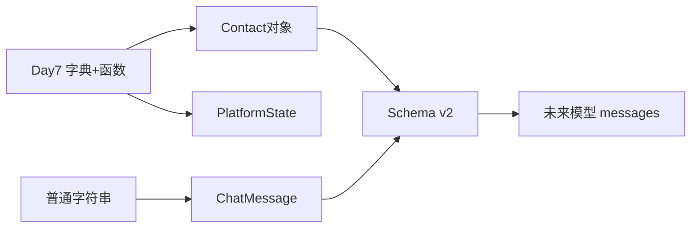
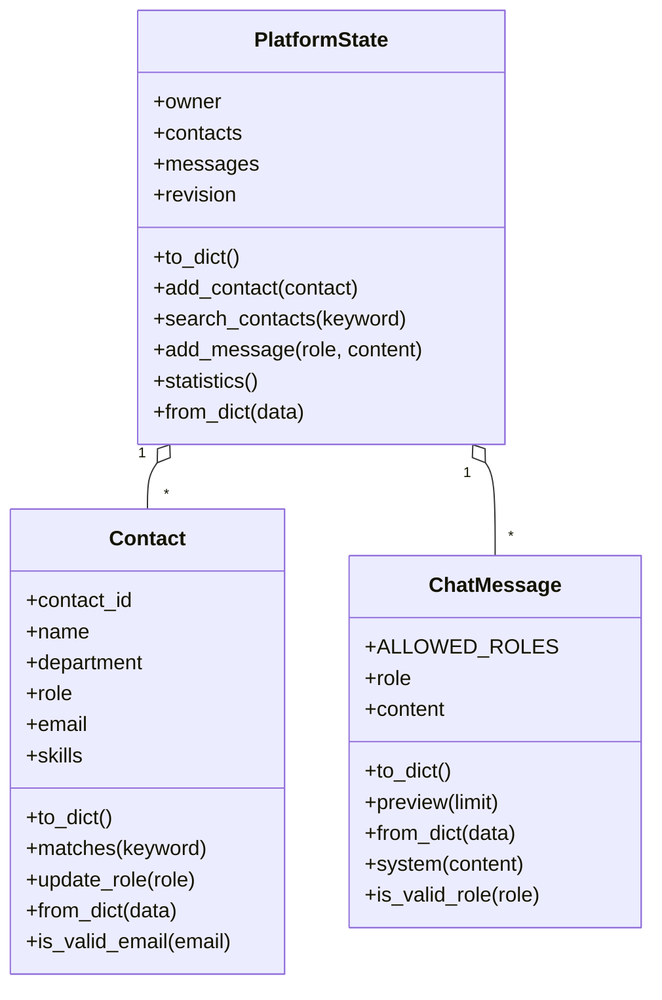
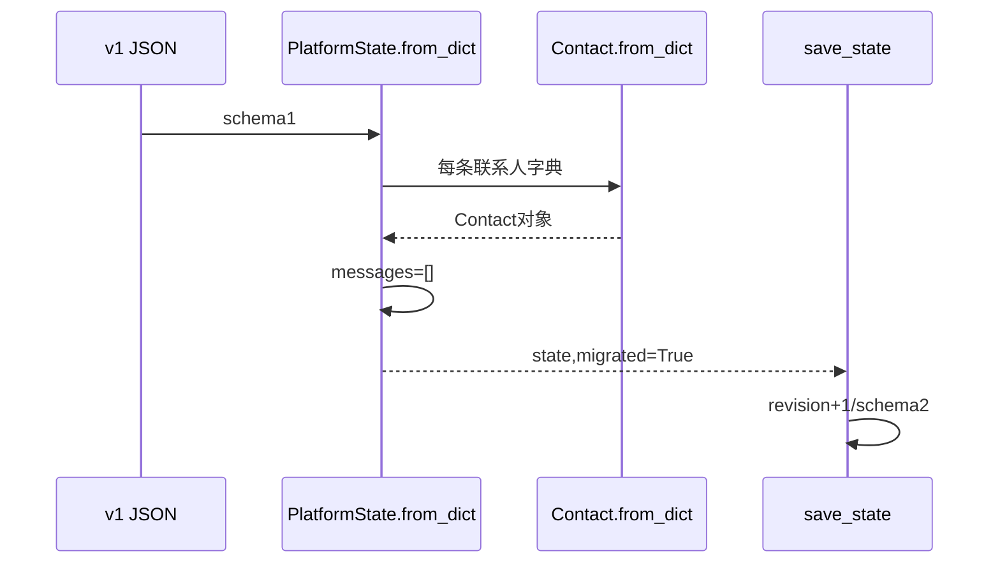
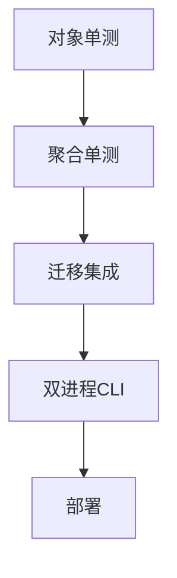

# Day 8｜让数据拥有行为：Contact、ChatMessage 与平台状态对象

> 阶段：Python 进阶·面向对象上  
> 项目版本：NexusAI 0.0.8  
> 需求：US-OOP-001  
> 交付：三个领域类、Schema v1→v2 迁移、对象持久化与部署  

---

## 0. 开场旁白

Day 7 的联系人由字典表示，规范化、搜索和更新散落在多个函数中。未来对话消息也不能只是一段字符串：模型 API 需要 role 与 content 始终成对，system/user/assistant 角色必须受控，消息需要预览和 JSON 往返。

今天用类把“数据”和“属于这类数据的行为”放在一起：

- `Contact` 管理联系人属性、搜索、岗位更新和序列化。
- `ChatMessage` 管理角色、内容、预览和消息工厂。
- `PlatformState` 聚合联系人、消息、维护人和 revision。



面向对象不是把所有函数塞进 class，也不是“真实世界都有对象”。它用于维护不变量、表达职责和提供稳定接口。今天还会真正执行 Day 5 设计过的 Schema 迁移：v1 联系人目录加载为对象，增加空 messages，保存为 v2。

---

## 1. 学习成果与完成定义

学员能够：

1. 区分类、对象、实例、属性和方法。
2. 使用 `__init__` 初始化实例状态。
3. 理解 `self` 指向当前实例。
4. 设计实例方法、类方法和静态方法。
5. 使用类属性表达所有实例共享规则。
6. 在对象与 JSON 字典间往返。
7. 聚合多个领域对象。
8. 迁移 Schema v1 到 v2。
9. 测试不同实例状态隔离。
10. 保持 CLI 和发布跨进程恢复。

完成定义：

- [ ] ChatMessage 角色校验和内容清洗。
- [ ] ChatMessage `to_dict/from_dict/system/preview`。
- [ ] Contact 属性标准化、搜索、更新、序列化。
- [ ] PlatformState 联系人和消息聚合。
- [ ] 编号/邮箱唯一约束在聚合内。
- [ ] v1 数据迁移至 v2 并 revision+1。
- [ ] v2 跨进程恢复消息。
- [ ] 未知 schema exit3。
- [ ] 单测、CLI、发布部署通过。
- [ ] 课件不少于30000字符。

今日不做：继承、多态、魔术方法和property安排Day9；模块包与异常Day10；类型注解Day13。

---

## 2. 企业需求文档

### 2.1 用户故事

> 作为 Agent 平台开发者，我希望联系人和对话消息成为具备自身规则的领域对象，并让旧联系人数据安全升级，从而为多模型对话和权限上下文建立稳定基础。

### 2.2 Schema v2

```json
{
  "schema_version": 2,
  "revision": 5,
  "owner": {
    "employee_id": "E70007",
    "department": "技术部"
  },
  "contacts": [],
  "messages": [
    {"role": "system", "content": "你是企业助手"},
    {"role": "user", "content": "查询制度"}
  ]
}
```

### 2.3 业务规则

**ChatMessage**

- role 标准化小写。
- 允许 system/user/assistant。
- content 折叠空白且非空。
- preview 默认30字符。

**Contact**

- 编号大写去空格。
- 邮箱小写。
- 技能去重排序。
- `matches` 搜索五字段。
- `update_role` 相同或空值不改变。

**PlatformState**

- 保存 Contact/ChatMessage 对象列表。
- 联系人编号、邮箱唯一。
- 消息角色/内容合法才增加。
- 统计联系人、消息和各角色数。

**迁移**

- v1 的 owner/contacts/revision 保留。
- messages 初始化为空。
- 保存为 v2。
- 迁移算一次变更，revision+1。
- 未知版本拒绝。

### 2.4 验收标准

1. `ChatMessage(" USER "," 查询   制度 ")` 得 user/`查询 制度`。
2. tool角色拒绝，空内容拒绝。
3. Contact C1/email/skills标准化。
4. 对象字典往返相等。
5. 两个实例状态互不污染。
6. v1 revision4迁移后v2 revision5/messages空。
7. 新系统消息、用户消息、助手消息分别持久化。
8. 第二进程恢复3条消息。
9. 发布包无运行JSON。

### 2.5 非功能要求

- 只使用模拟联系人和消息。
- 对象内部规则集中。
- 序列化结果为纯JSON类型。
- 类导入不启动CLI。
- Python3.10+标准库。

---

## 3. 架构与对象关系





对象关系是聚合：平台状态“拥有”联系人和消息。删除状态后对象若无其他引用可释放。今天不使用继承。

---

## 4. 类与对象课堂笔记

### 4.1 类是蓝图

```python
class ChatMessage:
    pass
```

类定义一种对象的属性和行为。对象是类创建的具体实例。

```python
a = ChatMessage("user", "你好")
b = ChatMessage("assistant", "您好")
```

a/b属于同一类但状态独立。

### 4.2 `__init__`

构造实例后自动调用，负责建立有效初始状态：

```python
def __init__(self, role, content):
    self.role = role
    self.content = content
```

`__init__` 不返回新对象，不应显式return其他值。

### 4.3 self

self 是当前实例。`a.preview()` 等价于类把a作为第一个参数调用实例方法。名字约定必须用self以保持可读性。

### 4.4 实例属性

`self.role` 每个对象一份。修改a不影响b，除非错误共享可变对象。

### 4.5 类属性

`ALLOWED_ROLES` 属于类，所有消息共享同一规则。实例可读取，但不应为单个实例修改共享规则。

### 4.6 实例方法

需要当前对象状态：

- `message.preview()`
- `contact.matches()`
- `state.add_message()`

### 4.7 类方法

第一个参数cls，使用 `@classmethod`。适合替代构造器：

```python
@classmethod
def from_dict(cls, data):
    return cls(data["role"], data["content"])
```

使用cls而非硬编码类名，后续子类可复用。

### 4.8 静态方法

不依赖实例或类状态，但概念上属于该类：

```python
@staticmethod
def is_valid_role(role):
    ...
```

如果逻辑不属于类领域，应保留普通函数，不要为了“面向对象”强塞。

---

## 5. ChatMessage 设计

### 5.1 为什么不能只用字符串

`"你好"`没有角色。模型API需要：

```json
{"role":"user","content":"你好"}
```

对象让两字段始终一起。

### 5.2 角色

类属性元组共享。静态方法只验证，不创建实例。聚合的 `add_message` 先验证再构造。

### 5.3 内容治理

静态 `normalize_content` 折叠空白。真实Prompt是否保留换行需重新评审，当前用于短消息。

### 5.4 预览

实例方法读取当前content，limit默认30。返回切片不修改。

### 5.5 工厂

`system` 类方法让常见角色更明确：

```python
ChatMessage.system("你是企业助手")
```

### 5.6 序列化

to_dict只返回role/content，不泄漏内部实现。from_dict负责恢复。

---

## 6. Contact 设计

构造器清理编号、姓名、岗位、邮箱和技能。`matches` 将搜索行为放回联系人。`update_role` 守住空值和幂等。`from_dict`/`to_dict`保持JSON边界。

静态邮箱校验是教学版。为什么不用实例方法？校验候选邮箱时对象可能还不存在，也不需要已有属性。

技能使用静态方法，返回新排序列表，避免调用者列表共享。

---

## 7. PlatformState 聚合

### 7.1 为什么需要聚合根

联系人唯一性无法由单个Contact判断，它需要看到整个集合；消息列表和revision也属于平台状态。

### 7.2 防共享默认

构造器参数 contacts/messages 默认None，内部 `list(contacts or [])` 创建新列表。

### 7.3 联系人新增

使用 `any` 检查对象属性。成功append，失败返回消息。

### 7.4 消息新增

先角色，再内容。只有成功对象进入列表。空消息不增加revision。

### 7.5 统计

角色计数从类属性生成，保证即使某角色0也有键。

### 7.6 JSON边界

state.to_dict遍历对象调用to_dict；from_dict遍历字典调用类方法。对象不会直接交给json.dump。

---

## 8. Schema 迁移

```mermaid
flowchart TD
    Load[读取JSON] --> Version{版本}
    Version -->|1| V1[恢复owner/contacts]
    V1 --> EmptyMessages[messages=[]]
    EmptyMessages --> Migrated[migrated=True]
    Migrated --> Revision[revision+1]
    Revision --> SaveV2[保存schema2]
    Version -->|2| V2[正常恢复]
    Version -->|其他| Reject[exit3不覆盖]
```

迁移不能伪造历史消息。v1没有messages，正确值是空列表。迁移保存一次，revision增加。原文件当前直接覆盖，生产需先备份和原子替换。

---

## 9. 课堂实操

1. 编写ChatMessage最小类。
2. 创建两个实例验证隔离。
3. 添加to_dict/from_dict往返。
4. 添加system类方法和角色静态方法。
5. 把Day7联系人字典重构为Contact。
6. 添加matches/update_role。
7. 创建PlatformState聚合。
8. 完成对象序列化。
9. 实现v1/v2加载。
10. 改造CLI与测试。

每一步先单测后接CLI。

---

## 10. 单元测试策略

- ChatMessage角色、内容、预览、字典往返、system工厂。
- Contact属性、技能、搜索、更新、邮箱、往返。
- PlatformState唯一联系人、消息拒绝、统计。
- 两个空state列表隔离。
- v1迁移、v2加载、未知拒绝。
- 自定义临时路径保存恢复。



---

## 11. CLI 全链路

首进程：

- owner revision1。
- Contact C1 revision2。
- tool消息拒绝不变。
- system/user/assistant revision3/4/5。
- 消息历史、统计、摘要。

第二进程恢复联系人1、消息3，按python搜索。

迁移进程：v1 revision4→v2 revision5，messages空。

---

## 12. 发布部署

构建：

```bash
python3 course/day08/deploy/build_release.py --output artifacts/day08
```

制品：脚本、README、SHA256SUMS。构建双进程新增用户消息并恢复；删除运行JSON。解压后system/user两消息跨进程恢复。

---

## 13. 安全与工程边界

- ChatMessage 不保存思维链或隐藏推理。
- system消息未来由受控配置产生，不信任普通用户。
- 联系人仍为模拟数据和 `.test` 邮箱。
- 对象封装不是权限控制。
- from_dict 当前浅信任字段，异常与模型验证后续实现。
- v1迁移生产需备份。
- 发布包不得含平台JSON。

---

## 14. 常见错误

1. 忘self，方法调用TypeError。  
2. `self`属性拼写错，新建错误属性。  
3. 把实例属性写成类属性，所有对象共享。  
4. 构造器默认列表共享。  
5. classmethod缺cls。  
6. staticmethod错误访问self。  
7. from_dict硬编码类名。  
8. 直接json.dump对象TypeError。  
9. 迁移伪造消息。  
10. 未知schema覆盖。  
11. 空消息仍持久化。  
12. 查询修改对象。  
13. 类过大承担所有I/O。  
14. 把工具函数都放类里。  
15. 导入时运行CLI。

---

## 15. 随堂练习与答案

1. 类与对象区别？蓝图与实例。  
2. self是什么？当前实例引用。  
3. `__init__`何时？实例创建后初始化。  
4. 类属性适合？共享规则。  
5. 实例方法何时？依赖对象状态。  
6. 类方法首参？cls。  
7. 静态方法依赖实例吗？不。  
8. from_dict为何类方法？替代构造。  
9. to_dict为何实例方法？读取实例状态。  
10. 空默认列表风险？实例共享。  
11. 聚合根为何检查唯一？能看到集合。  
12. 对象可直接JSON吗？默认不能。  
13. v1无消息迁移为何空？不伪造事实。  
14. 迁移是否增加revision？当前契约是。  
15. 封装等于权限吗？不是。

---

## 16. 课后作业

### 基础

给ChatMessage增加字符数和是否为空方法，补单测。

### 进阶

实现 `Conversation` 类：messages、add、last、window(limit)、to_dict/from_dict。

### 企业挑战

设计Schema v3：多会话 `conversations`，每个有session_id和messages；写迁移方案。

### 测试

覆盖不同实例隔离、错误角色、空内容、窗口边界和往返。

### 发布

构建后验证导入不运行、双进程恢复、zip无JSON。

---

## 17. 作业完整参考答案

```python
class Conversation:
    def __init__(self, session_id, messages=None):
        self.session_id = session_id
        self.messages = list(messages or [])

    def add(self, message):
        self.messages.append(message)

    def last(self):
        if not self.messages:
            return None
        return self.messages[-1]

    def window(self, limit=10):
        if limit <= 0:
            return []
        return self.messages[-limit:]

    def to_dict(self):
        return {
            "session_id": self.session_id,
            "messages": [item.to_dict() for item in self.messages],
        }

    @classmethod
    def from_dict(cls, data):
        return cls(
            data["session_id"],
            [ChatMessage.from_dict(item) for item in data["messages"]],
        )
```

测试空last、limit0、超过长度、对象往返、两个Conversation列表隔离。

Schema v3迁移：v2 messages放入默认session，生成明确迁移session_id；保留contacts/owner/revision；备份、转换、验证消息数与角色、保存、回滚。

---

## 18. 讲师逐字稿

### 开场

“字典把数据放一起，类把数据和行为放一起。只有行为真正属于数据时才放进类。”

### self

“a.preview 调用的是a自己的content。self不是魔法关键字，而是约定的实例参数。”

### 三类方法

“问三个问题：是否需要具体实例？是否需要类本身？都不需要但属于概念？分别实例、类、静态。”

### 聚合

“单个联系人无法知道邮箱是否与别人重复，聚合状态负责跨对象规则。”

### 迁移

“旧数据没有消息，就保持空。迁移不能编造历史。”

### 测试

“对象测试不仅看值，还看不同实例是否共享状态。”

### 发布

“内部从字典变对象，外部JSON契约仍需验证。部署测试才证明边界。”

---

## 19. 对象路径覆盖实验室

1. 两个message状态独立。  
2. role清理小写。  
3. tool角色拒绝。  
4. content空白清理。  
5. preview短/长/0。  
6. message字典往返。  
7. system工厂。  
8. 两个contact技能不共享。  
9. contact编号标准化。  
10. 邮箱小写。  
11. 技能去重。  
12. matches姓名。  
13. matches技能。  
14. 空搜索false。  
15. update_role变化。  
16. update_role相同。  
17. 邮箱合法/非法。  
18. Contact往返。  
19. 两个state列表隔离。  
20. 新联系人成功。  
21. 重复编号。  
22. 重复邮箱。  
23. user消息成功。  
24. 空消息拒绝。  
25. 各角色统计。  
26. state to_dict。  
27. schema1迁移。  
28. schema2恢复。  
29. schema99拒绝。  
30. 首进程revision1-5。  
31. 第二进程消息3。  
32. 迁移revision4→5。  
33. 发布数据清理。  
34. zip白名单。  
35. 哈希。  
36. 解压双进程。  
37. 导入不运行。  
38. Day1-7回归。

---

## 20. OOP 设计评审

### 20.1 贫血模型

若Contact只有属性，所有行为仍在外部函数，类价值有限。matches/update_role/to_dict属于联系人行为。

### 20.2 上帝对象

若PlatformState处理终端、文件、所有校验和发布，会过大。I/O仍保留普通函数。

### 20.3 静态方法滥用

任意工具放类里只增加命名层级。必须属于领域概念。

### 20.4 公开属性

今天属性公开，外部可绕过update直接修改。Day9 property讨论保护。

### 20.5 不变量

构造器应建立有效状态，但当前仍允许非法role直接构造ChatMessage；聚合add先校验。Day9/10改进异常策略。

### 20.6 对象身份

两个字段相同的Contact仍是两个对象。今天未实现eq，Day9魔术方法讨论。

---

## 21. 第一周模型到对象迁移对照

| Day7 | Day8 |
|---|---|
| contact["name"] | contact.name |
| search_contacts函数 | contact.matches |
| update_contact role | contact.update_role |
| create_contact函数 | Contact(...) |
| dict恢复 | Contact.from_dict |
| data顶层字典 | PlatformState |
| 新messages字段 | ChatMessage对象 |

不是所有函数都变方法：load/save/persist和CLI仍是外部边界函数。

---

## 22. 复盘与 Day 9

保持：类职责、实例隔离、三类方法、对象JSON边界、迁移证据。  
停止：所有代码塞class、共享默认列表、对象直接dump、迁移编造数据。  

技术债：

| 债务 | Day9 |
|---|---|
| 属性可绕过修改 | property |
| 对象展示默认难读 | `__str__/__repr__` |
| 模型接口无基类 | 继承/多态 |
| 对象相等未定义 | 魔术方法讨论 |

Day9 将设计 `BaseModel → OpenAIModel/QwenModel`，用继承、多态、super、property和魔术方法建立多供应商模型接口。

---

## 23. 教学质量门禁

| 指标 | 目标 |
|---|---:|
| 课件字符 | ≥30000 |
| Mermaid | ≥9 |
| 必备内容 | 全部 |
| 类/实例隔离 | 通过 |
| 三类方法 | 通过 |
| 对象JSON往返 | 通过 |
| v1→v2迁移 | 通过 |
| CLI双进程 | 通过 |
| 制品无数据 | 通过 |
| Day1-7回归 | 通过 |

---

## 24. 今日交付

```text
course/day08/day08-lesson.md
course/day08/starter/chat_message.py
course/day08/solution/oop_platform.py
course/day08/tests/test_models.py
course/day08/tests/test_cli.py
course/day08/deploy/build_release.py
course/day08/tests/test_release.py
tools/verify_day08.py
```

【收尾旁白】

“今天联系人和消息不再只是字典。Contact守住协作者行为，ChatMessage守住模型消息结构，PlatformState守住跨对象唯一和持久化。Schema迁移让新对象模型承接旧数据，而不是重新开始。”
