# Day 9｜多供应商模型继承：BaseModel、OpenAIModel 与 QwenModel

> 阶段：Python 进阶·面向对象下  
> 项目版本：NexusAI 0.0.9  
> 需求：US-MODEL-001  
> 交付：模型继承体系、Schema v2→v3 迁移、多态模拟推理与部署  

---

## 0. 开场旁白

Day 8 把联系人和消息变成了对象，PlatformState 也守住了聚合与持久化。但平台还缺一块关键拼图：**如何统一对接不同大模型供应商**。

真实企业不会只绑定 OpenAI。国内项目常见通义千问、DeepSeek、智谱；海外项目常见 OpenAI、Anthropic。它们的 HTTP 路径、请求字段、响应结构各不相同，但业务层只想说一句话：“用当前配置的模型，把 messages 发出去，拿回 assistant 文本。”

如果为每个供应商写一套独立 if/else，平台会在 Day 12 接入 HTTP、Day 16 调参数、Day 25 换 LangChain 时全面失控。今天用**继承与多态**建立稳定边界：

- `BaseModel` 定义公共接口与不变量。
- `OpenAIModel`、`QwenModel` 重写请求格式与响应解析。
- `@property` 治理 temperature 范围。
- `__str__`、`__repr__`、`__call__` 让模型可读、可调试、可调用。
- Schema v2 数据迁移到 v3，新增 `model_config` 持久化。

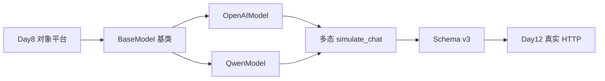

面向对象下半章不是再讲“什么是类”，而是解决**接口稳定、变化隔离**。子类变化不应破坏 PlatformState；PlatformState 也不应知道 OpenAI 的 JSON 长什么样。

---

## 1. 学习成果与完成定义

学员能够：

1. 解释继承、重写、多态、`super()` 的用途。
2. 设计 `BaseModel → OpenAIModel / QwenModel` 类层次。
3. 用 `@property` 封装带校验的属性。
4. 实现 `__str__`、`__repr__`、`__call__` 改善调试与调用体验。
5. 编写多态工厂 `create_model`，按配置实例化子类。
6. 在 PlatformState 中用 `active_model()` 恢复多态实例。
7. 执行 Schema v2→v3 迁移并 revision+1。
8. 保持 Day 8 联系人、消息、CLI、发布能力不回退。
9. 测试正常、边界、错误路径。
10. 说明为何 Day 9 仍使用模拟推理而非真实 API。

完成定义：

- [ ] BaseModel 公共接口与 temperature property。
- [ ] OpenAIModel / QwenModel 重写 `format_request`。
- [ ] `__call__` 统一推理入口。
- [ ] `create_model` 多态工厂。
- [ ] PlatformState 增加 `model_config` 与 `simulate_chat`。
- [ ] v2 数据迁移至 v3 并 revision+1。
- [ ] v3 跨进程恢复模型配置。
- [ ] 未知 schema exit3。
- [ ] 单测、CLI、发布部署通过。
- [ ] 课件不少于 30000 字符。

今日不做：真实 HTTP 与 API Key（Day 12）；模块分包（Day 10）；装饰器进阶（Day 13）。

---

## 2. 企业需求文档

### 2.1 用户故事

> 作为 Agent 平台架构师，我希望用统一模型接口屏蔽 OpenAI 与 Qwen 的请求差异，并把当前模型配置持久化到平台状态，从而在不改业务代码的情况下切换供应商。

### 2.2 Schema v3

```json
{
  "schema_version": 3,
  "revision": 8,
  "owner": {
    "employee_id": "E90009",
    "department": "技术部"
  },
  "contacts": [],
  "messages": [
    {"role": "system", "content": "你是企业助手"},
    {"role": "user", "content": "查询制度"}
  ],
  "model_config": {
    "provider": "qwen",
    "model_id": "qwen-plus",
    "temperature": 0.7,
    "max_tokens": 1024
  }
}
```

### 2.3 业务规则

**BaseModel**

- `model_id` 去首尾空白。
- `temperature` 只允许 0~2，超出抛 `ValueError`。
- `max_tokens` 为正整数。
- `build_messages` 组装 system + history + user。
- `format_request` 由子类实现。
- `__call__` 先 format 再 simulate。

**OpenAIModel**

- 默认 `model_id=gpt-4o-mini`。
- 请求体含顶层 `messages`、`temperature`、`max_tokens`。

**QwenModel**

- 默认 `model_id=qwen-plus`。
- 请求体使用 `input.messages` 与 `parameters` 分区。

**PlatformState**

- 持久化 `model_config` 字典，不直接序列化实例。
- `active_model()` 每次从配置重建实例，避免陈旧对象。
- `simulate_chat` 追加 assistant 消息并 revision+1。
- 切换模型前先通过临时实例校验参数。

**迁移**

- v1/v2 加载后补默认 `model_config`。
- 保存为 v3。
- 迁移 revision+1。
- 不伪造历史模型调用记录。

### 2.4 非功能需求

| 编号 | 要求 |
|---|---|
| NFR-M1 | 新增供应商只需新增子类 + 注册表项 |
| NFR-M2 | 业务层不得出现 provider 分支 |
| NFR-M3 | 发布包不含 `nexus_platform.json` |
| NFR-M4 | 双进程恢复后 model_config 一致 |
| NFR-M5 | temperature 越界 fail-closed |

---

## 3. 验收标准

### 3.1 Given-When-Then

**继承**

- Given `OpenAIModel()`  
  When 调用 `isinstance(model, BaseModel)`  
  Then 为 True

**多态**

- Given 相同 messages  
  When 分别调用 OpenAI 与 Qwen 的 `format_request`  
  Then 返回结构不同且各自合法

**property**

- Given temperature=3  
  When 赋值  
  Then 抛 ValueError，原值不变

**__call__**

- Given user 消息  
  When `model(messages)`  
  Then 返回带 `[provider]` 前缀的模拟文本

**迁移**

- Given schema_version=2 且无 model_config  
  When 首次启动  
  Then 迁移至 v3，默认 qwen，revision+1

**CLI**

- Given 首次写入后重启  
  When 菜单 8 切换 openai  
  Then 第二次启动恢复 openai 配置

### 3.2 测试矩阵

| 层 | 文件 | 覆盖 |
|---|---|---|
| 单元 | test_models.py | 继承、多态、property、迁移 |
| 集成 | test_cli.py | 双进程、切换、模拟对话 |
| 发布 | test_release.py | ZIP、SHA-256、部署冒烟 |
| 回归 | verify_day01~08 | 历史天门禁 |

---

## 4. 继承与多态架构

### 4.1 类图

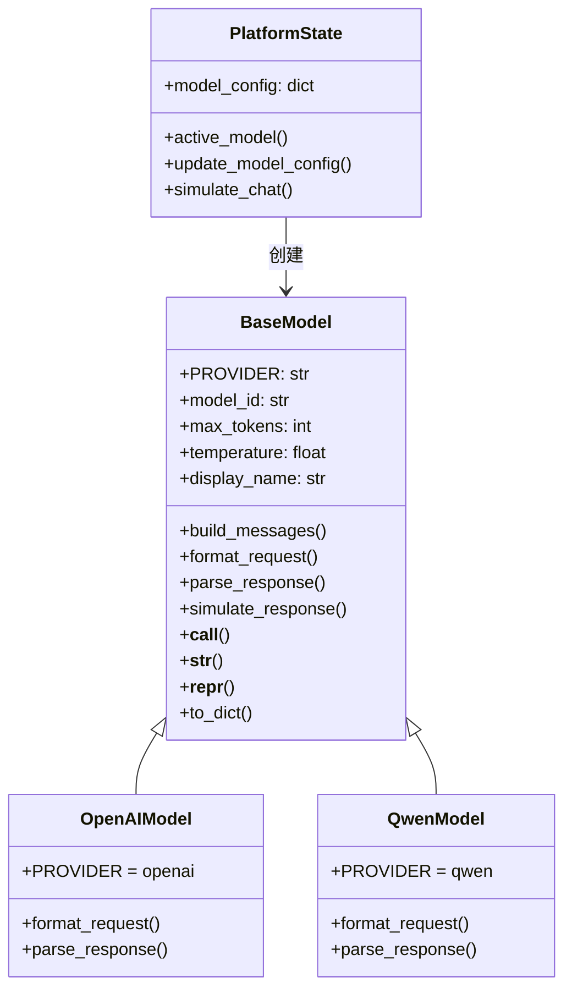

### 4.2 多态调用链

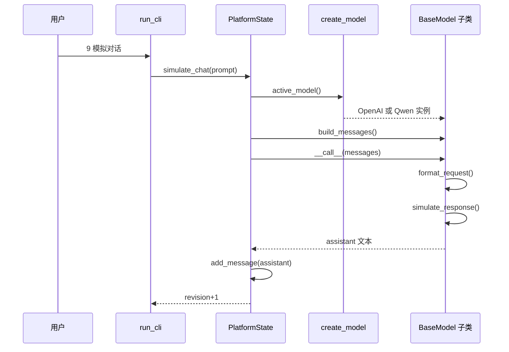

### 4.3 与 Day 8 的关系

Day 8 的 Contact、ChatMessage 仍是领域对象；Day 9 新增模型层，PlatformState 从“联系人+消息”扩展为“联系人+消息+模型配置”。旧测试必须继续通过，证明**扩展而非替换**。

---

## 5. BaseModel 设计

### 5.1 为什么需要基类

没有基类时，常见写法：

```python
if provider == "openai":
    payload = {...}
elif provider == "qwen":
    payload = {...}
```

这会把供应商知识散落到 CLI、统计、迁移、测试各处。基类把**变化点**收敛到 `format_request` 与 `parse_response`。

### 5.2 构造与 super()

```python
class OpenAIModel(BaseModel):
    PROVIDER = "openai"

    def __init__(self, model_id="gpt-4o-mini", temperature=0.7, max_tokens=1024):
        super().__init__(model_id, temperature, max_tokens)
```

`super().__init__` 确保父类先建立 `_temperature`、`max_tokens` 等不变量。忘记 super 是初学者高频 bug：子类实例看似可用，但 property 校验未执行。

### 5.3 build_messages 为何放基类

system、history、user 的组装顺序对所有 Chat 类模型一致。放基类可避免复制；若某供应商不支持 system，可在子类 override。

---

## 6. OpenAIModel 与 QwenModel

### 6.1 OpenAI 请求格式

```python
def format_request(self, messages):
    return {
        "model": self.model_id,
        "messages": messages,
        "temperature": self.temperature,
        "max_tokens": self.max_tokens,
    }
```

这与 Day 12 将使用的 Chat Completions 结构一致，学员今天先熟悉字段，明天以后才加 HTTP。

### 6.2 Qwen 请求格式

```python
def format_request(self, messages):
    return {
        "model": self.model_id,
        "input": {"messages": messages},
        "parameters": {
            "temperature": self.temperature,
            "max_tokens": self.max_tokens,
        },
    }
```

教学版简化了 DashScope 真实字段，但保留了**结构分区**差异：Qwen 把 messages 放在 input 内，参数放在 parameters 内。多态的价值就在这里——PlatformState 只关心 messages 列表，不关心分区。

### 6.3 供应商对比表

| 维度 | OpenAIModel | QwenModel |
|---|---|---|
| PROVIDER | openai | qwen |
| 默认 model_id | gpt-4o-mini | qwen-plus |
| messages 位置 | 顶层 | input.messages |
| 参数位置 | 顶层 | parameters |
| parse 扩展 | api_style | finish_reason |

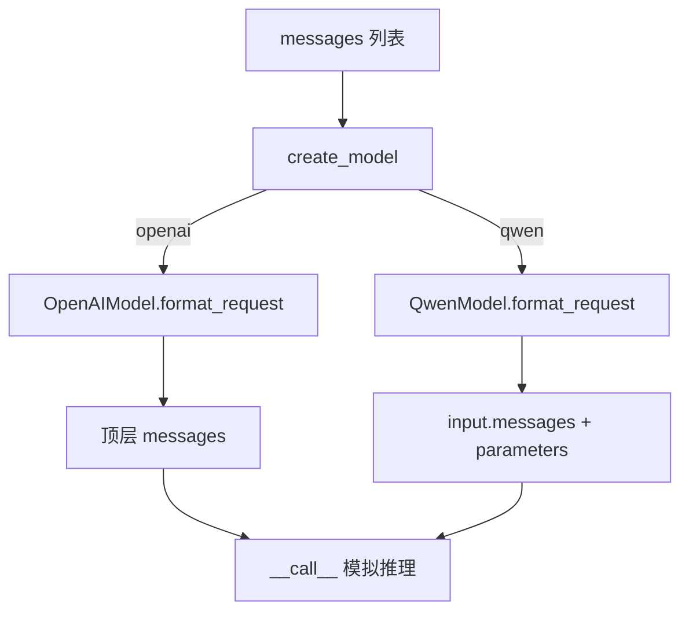

---

## 7. property 与参数治理

### 7.1 为什么不用公开属性

若 `self.temperature = 999` 直接合法，错误配置会进入 JSON，Day 12 调用 API 时才爆炸。property 把校验前移到**对象构造与切换时**。

```python
@property
def temperature(self):
    return self._temperature

@temperature.setter
def temperature(self, value):
    numeric = float(value)
    if numeric < 0 or numeric > 2:
        raise ValueError("temperature 必须在 0 到 2 之间")
    self._temperature = numeric
```

### 7.2 访问路径

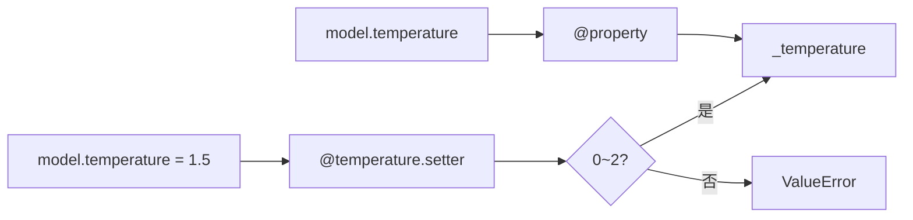

### 7.3 课堂易错点

1. 在 `__init__` 里写 `self._temperature = value` 绕过 setter——父类应使用 `self.temperature = value`。
2. 只写 getter 不写 setter，导致切换模型时无法赋值。
3. 校验放 CLI 而不放对象——CLI 可被测试或脚本绕过，对象校验才是最后防线。

---

## 8. 魔术方法

### 8.1 __str__ 与 __repr__

- `__str__`：给人类读，日志与菜单展示。
- `__repr__`：给开发者读，应尽可能可重建对象。

```python
def __str__(self):
    return f"{self.display_name} (temperature={self.temperature}, max_tokens={self.max_tokens})"

def __repr__(self):
    return (
        f"{self.__class__.__name__}("
        f"model_id={self.model_id!r}, temperature={self.temperature}, "
        f"max_tokens={self.max_tokens})"
    )
```

打印 `模型已切换为 {candidate}` 时，实际调用 `__str__`；测试里 `repr` 可断言类名与字段。

### 8.2 __call__

让实例像函数一样调用：

```python
def __call__(self, messages):
    payload = self.format_request(messages)
    request_messages = payload.get("messages") or payload["input"]["messages"]
    return self.simulate_response(request_messages)
```

这样 PlatformState 可以写 `model(messages)`，而不是 `if openai ... else ...`。未来 Day 12 把 `simulate_response` 换成 HTTP，也只需改基类或子类内部。

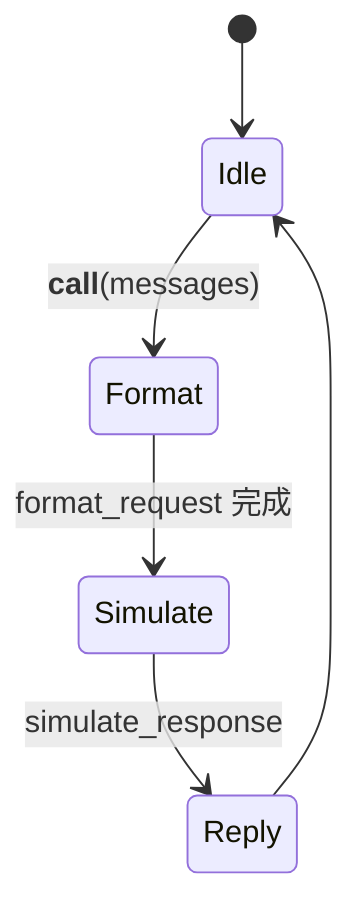

### 8.3 今日不实现的其他魔术方法

`__eq__`、`__hash__` 留作作业讨论。模型实例当前以配置字典为准持久化，不做集合元素。

---

## 9. Schema 迁移

### 9.1 v2→v3 流程

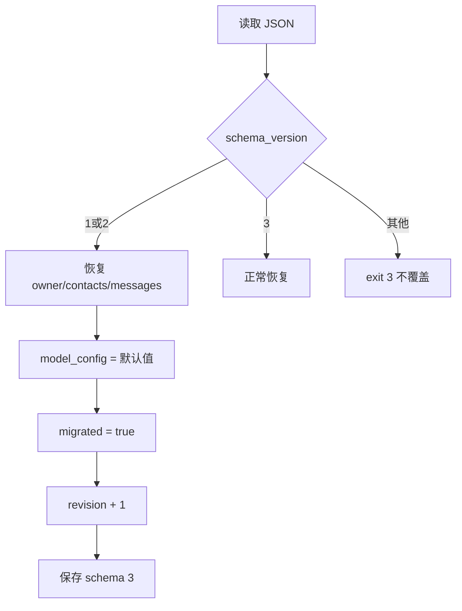

### 9.2 迁移原则

1. 不伪造历史 assistant 消息。
2. 默认模型用 Qwen，符合国内教学环境主流。
3. 迁移算一次变更，revision+1。
4. 原文件直接覆盖；生产应先备份——Day 57 部署章会展开。

### 9.3 v1 兼容

Day 8 的 v1 只有 contacts，没有 messages。Day 9 的 `from_dict` 仍接受 v1/v2，并统一迁移到 v3。这证明**迁移链可累积**。

---

## 10. 工厂与注册表

```python
MODEL_REGISTRY = {
    "openai": OpenAIModel,
    "qwen": QwenModel,
}

def create_model(config):
    provider = config.get("provider", "").strip().lower()
    model_cls = MODEL_REGISTRY.get(provider)
    if model_cls is None:
        raise ValueError(f"不支持的模型供应商：{provider}")
    return model_cls(
        config.get("model_id", ""),
        config.get("temperature", 0.7),
        config.get("max_tokens", 1024),
    )
```

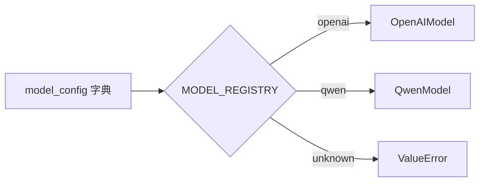

新增 DeepSeek 时：

1. 新建 `DeepSeekModel(BaseModel)`。
2. 注册 `"deepseek": DeepSeekModel`。
3. 业务代码零修改。

---

## 11. PlatformState 扩展

### 11.1 active_model

```python
def active_model(self):
    return create_model(self.model_config)
```

每次调用都新建实例，避免“内存里改 temperature 但未 persist”的漂移。代价很小，教学项目可接受。

### 11.2 simulate_chat

```python
def simulate_chat(self, user_prompt, system_prompt="你是企业助手"):
    history = [message.to_dict() for message in self.messages]
    model = self.active_model()
    request_messages = model.build_messages(system_prompt, user_prompt, history=history)
    assistant_text = model(request_messages)
    changed, message = self.add_message("assistant", assistant_text)
    return changed, message, assistant_text
```

消息历史来自 Day 8 的 ChatMessage 列表，模型层不破坏消息规则。

### 11.3 数据流

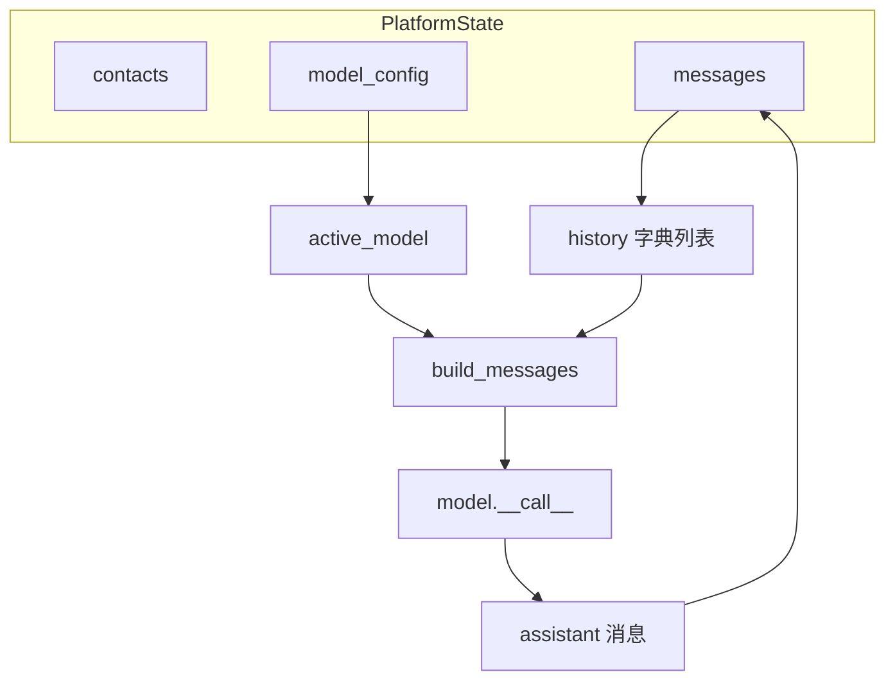

---

## 12. 课堂实操

### 12.1 环境准备

```bash
cd course/day09/solution
python3 model_platform.py
python3 ../tests/test_models.py
python3 ../tests/test_cli.py
python3 ../tests/test_release.py
python3 ../../../tools/verify_day09.py
```

### 12.2 推荐实操顺序

1. 阅读 `starter/base_model.py`，补全 super 与 property。
2. 实现 OpenAIModel.format_request。
3. 对照实现 QwenModel。
4. 运行 test_models.py 看多态差异。
5. 完成 PlatformState 与 CLI 菜单 8/9。
6. 用 v2 JSON 测迁移。
7. 构建发布包并确认无运行数据。

### 12.3 菜单说明

| 选项 | 功能 |
|---|---|
| 8 | 查看模型、切换 provider |
| 9 | 模拟对话并持久化 assistant |
| 7 | 摘要含 model 字段 |

---

## 13. 单元测试策略

### 13.1 继承测试

- `isinstance(openai_model, BaseModel)`
- `type(restored) is OpenAIModel` 区分 exact type

### 13.2 多态测试

- 相同 messages，不同 payload 结构
- 相同调用方式，不同 `[provider]` 前缀

### 13.3 property 边界

- temperature=3 抛错
- temperature=1.5 成功

### 13.4 迁移测试

- v2 无 model_config → 默认 qwen
- persist 后 schema_version=3

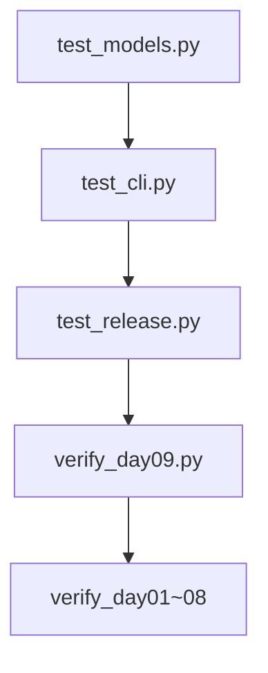

---

## 14. CLI 全链路

### 14.1 双进程场景

进程 A：写入联系人、消息、模拟对话。  
进程 B：恢复 revision、切换 openai、再次模拟。  

验证：

- model_config 持久化
- assistant 消息条数增加
- `[openai]` 前缀出现

### 14.2 错误路径

- 空用户问题：不调用模型
- 未知 provider：提示错误，不 persist
- 非法 temperature：切换失败，旧配置保留

---

## 15. 发布部署

### 15.1 构建命令

```bash
python3 course/day09/deploy/build_release.py --output artifacts/day09
```

### 15.2 制品规则

| 文件 | 说明 |
|---|---|
| model_platform.py | 主程序 |
| README.txt | 运行说明 |
| SHA256SUMS | 完整性 |
| 不含 nexus_platform.json | 数据隔离 |

### 15.3 部署冒烟

1. 首次运行：维护人 + 模拟对话。
2. 第二次运行：恢复 schema=3 与消息数。
3. 删除运行 JSON 后再打包。

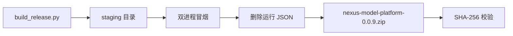

---

## 16. 安全与工程边界

1. **API Key 不得入库**：Day 9 无网络调用；`.env` 在 Day 13。
2. **模拟回复标记 `[provider]`**：避免学员误以为已接真模型。
3. **temperature 上限**：防止极端参数进入持久化。
4. **发布无数据**：联系人、消息、模型配置都不进 ZIP。
5. **fail-closed**：未知 schema、未知 provider 均拒绝。

### 威胁建模简表

| 威胁 | 控制 |
|---|---|
| 运行数据泄露 | 打包前删除 JSON |
| 非法模型参数 | property + 切换前校验 |
| 供应商锁定 | 注册表 + 多态 |
| 迁移丢消息 | v2 messages 原样保留 |

---

## 17. 课后作业

### 17.1 基础题

1. 解释继承与组合在本项目中的分工。
2. 画出 OpenAIModel 调用 `super().__init__` 的顺序。
3. 为什么 PlatformState 持久化 dict 而不是 model 实例？
4. 写一段代码创建 QwenModel 并打印 `repr`。
5. 说明 v2→v3 迁移为何 revision+1。

### 17.2 进阶题

1. 新增 `DeepSeekModel`，注册到 MODEL_REGISTRY。
2. 给 BaseModel 增加 `top_p` property，范围 0~1。
3. 在 statistics 中增加 `request_shape` 字段显示 payload 顶层 keys。
4. 编写测试：切换非法 provider 时 revision 不变。
5. 给 ChatMessage 增加 `__str__`，格式 `role: preview`。

### 17.3 企业挑战

设计“模型配置审计日志”：每次切换 model_config 追加一条 system 消息记录变更原因，并保证 revision 单调。写出伪代码与测试思路。

---

## 18. 作业完整参考答案

### 18.1 基础题答案

**1. 继承与组合**

- 继承：OpenAIModel 是 BaseModel 的特殊化，表达“是一种模型”。
- 组合：PlatformState 持有 contacts/messages/model_config，表达“平台拥有这些资源”。

**2. super 顺序**

`OpenAIModel.__init__` → `BaseModel.__init__` → 设置 model_id → property 校验 temperature → 设置 max_tokens。

**3. 为何持久化 dict**

JSON 只能存字典；实例含方法与非序列化状态。dict 是稳定 DTO；恢复时用 factory 重建多态实例。

**4. 代码**

```python
model = QwenModel("qwen-turbo", 0.3, 512)
print(repr(model))
```

**5. revision+1**

迁移改变了持久化结构，属于一次正式状态变更，便于审计与跨进程一致性。

### 18.2 进阶题参考

**DeepSeekModel 骨架**

```python
class DeepSeekModel(BaseModel):
    PROVIDER = "deepseek"

    def format_request(self, messages):
        return {"model": self.model_id, "messages": messages}
```

**top_p property**

```python
@property
def top_p(self):
    return self._top_p

@top_p.setter
def top_p(self, value):
    numeric = float(value)
    if not 0 <= numeric <= 1:
        raise ValueError("top_p 必须在 0 到 1 之间")
    self._top_p = numeric
```

**审计日志思路**

切换成功后：

```python
self.add_message("system", f"模型切换为 {candidate}，原因：{reason}")
```

测试断言 messages 末条为 system 且 revision 增加。

---

## 19. 讲师逐字稿

【导入 10 分钟】

“Day 8 我们问：联系人是谁？消息是什么？Day 9 问：谁来说话？OpenAI 还是 Qwen？如果每个供应商一套 if，平台会烂掉。继承把变化关进子类，多态让上层只认 BaseModel。”

【继承 25 分钟】

板书画类层次。强调 super() 不是语法糖，是确保父类 invariant 执行。让两名学员分别说 OpenAI 与 Qwen payload 差异。

【property 15 分钟】

现场写 temperature=3 触发 ValueError。问：为什么不在 input 里 try？引导到对象层 fail-closed。

【魔术方法 15 分钟】

演示 print(model) 与 model(messages)。说明 __call__ 不是魔法，是统一入口。

【迁移 15 分钟】

打开 v2 JSON，跑 CLI，看 v3 与 model_config 出现。强调不伪造 assistant 历史。

【实操 90 分钟】

巡场检查：super、registry、菜单 9 是否 persist assistant。

【收尾 10 分钟】

“Day 12 我们会把 simulate 换成 requests.post，但 PlatformState 一行不改。这就是接口稳定的回报。”

---

## 20. 继承路径覆盖实验室

学员在纸上追踪以下 30 场景，写出最终 provider 与 payload 顶层 keys：

| 编号 | 场景 | 期望 |
|---|---|---|
| L01 | create_model(qwen) | input, parameters |
| L02 | create_model(openai) | messages 顶层 |
| L03 | OpenAIModel() 默认 | gpt-4o-mini |
| L04 | QwenModel() 默认 | qwen-plus |
| L05 | temperature=-0.1 | ValueError |
| L06 | temperature=0 | 合法 |
| L07 | temperature=2 | 合法 |
| L08 | temperature=2.1 | ValueError |
| L09 | model("") 空 id | 允许但业务应拦截 |
| L10 | __call__ 空 messages | 模拟回复含“空输入” |
| L11 | v2 迁移 | schema 3 |
| L12 | v3 直接加载 | 不迁移 |
| L13 | v99 | rejected |
| L14 | 切换 openai 后再 simulate | [openai] 前缀 |
| L15 | parse_response 空格 | strip |
| L16 | super 缺失 | 父类 invariant 丢失 |
| L17 | registry 无 provider | ValueError |
| L18 | active_model 两次 | 新实例 |
| L19 | simulate_chat 追加 | assistant 条数+1 |
| L20 | history 含 system | build 顺序正确 |
| L21 | CLI 8 不切换 | revision 不变 |
| L22 | CLI 9 空问题 | 不 persist |
| L23 | 双进程恢复 | model_config 一致 |
| L24 | statistics.model | 含 provider |
| L25 | OpenAI parse | api_style 字段 |
| L26 | Qwen parse | finish_reason |
| L27 | 发布包内容 | 3 文件 |
| L28 | 运行后删 JSON | 白名单 |
| L29 | revision 迁移 | +1 |
| L30 | Day8 联系人 CRUD | 仍可用 |

---

## 21. 多态设计评审

### 21.1 评审清单

| 项 | 通过标准 |
|---|---|
| 单一职责 | BaseModel 不管联系人 |
| 开闭原则 | 新供应商只增子类 |
| Liskov | 子类可替换基类调用 |
| 持久化边界 | 只存 model_config |
| 测试 | 正常/边界/错误 |

### 21.2 反模式警示

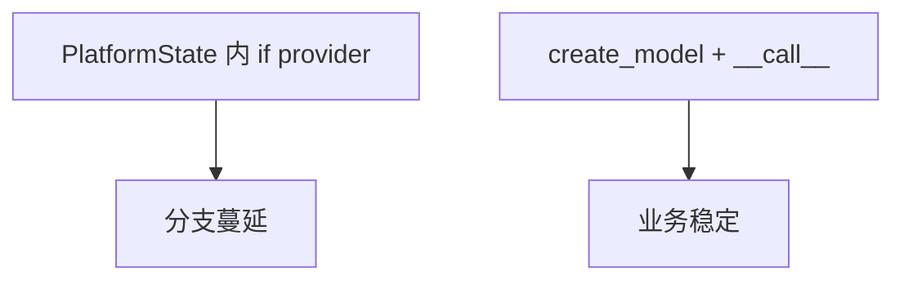

---

## 22. 企业案例：多供应商切换

某金融客户测试环境用 Qwen，生产用 OpenAI。若业务代码写死 Qwen，切生产要改几十处。采用 Day 9 模式后，只改配置文件与 model_config，PlatformState.simulate_chat 不变。Day 56 Docker 部署时，环境变量注入 provider 即可。

---

## 23. 代码阅读指引

阅读顺序：

1. `BaseModel` property 与 __call__
2. `OpenAIModel` / `QwenModel` format_request
3. `create_model` 工厂
4. `PlatformState.active_model` / `simulate_chat`
5. `from_dict` 迁移分支
6. `run_cli` 菜单 8/9

---

## 24. 与课程主线连接

| 天 | 能力 |
|---|---|
| Day 8 | 领域对象 |
| Day 9 | 模型多态 |
| Day 10 | 模块拆分 models 包 |
| Day 12 | HTTP 替换 simulate |
| Day 16 | temperature 实验 |
| Day 25 | LangChain ChatModel |

---

## 25. 复盘与 Day 10

保持：基类接口、注册表工厂、property 校验、迁移证据、发布无数据。  
停止：PlatformState 里写 provider 分支、持久化实例、绕过 setter、迁移伪造历史。  

技术债：

| 债务 | Day 10 |
|---|---|
| 单文件过长 | 拆 models 包 |
| 异常散落 | 自定义异常 |
| simulate 非真 API | Day 12 HTTP |
| 无 requirements | venv + pip |

Day 10 将把 Contact、ChatMessage、BaseModel 拆到独立模块，引入 try/except 与自定义异常，为真实 API 调用做工程准备。

---

## 26. 教学质量门禁

| 指标 | 目标 |
|---|---:|
| 课件字符 | ≥30000 |
| Mermaid | ≥9 |
| 必备内容 | 全部 |
| 继承/多态 | 通过 |
| property | 通过 |
| __call__ | 通过 |
| v2→v3 迁移 | 通过 |
| CLI 双进程 | 通过 |
| 制品无数据 | 通过 |
| Day1-8 回归 | 通过 |

---

## 28. 继承决策工作坊（15 题）

下列场景该用继承、组合还是函数？说明理由并关联项目代码位置。

| 编号 | 场景 | 推荐 | 项目证据 |
|---|---|---|---|
| D01 | OpenAI 与 Qwen 请求格式不同 | 继承 | `OpenAIModel.format_request` |
| D02 | PlatformState 管理 contacts | 组合 | `self.contacts` 列表 |
| D03 | 所有模型都要校验 temperature | 继承+property | `BaseModel.temperature` |
| D04 | 把 JSON 读入内存 | 函数 | `load_state` |
| D05 | 新增 DeepSeek 供应商 | 继承+注册 | `MODEL_REGISTRY` |
| D06 | 联系人多字段搜索 | 组合 | `Contact.matches` |
| D07 | 统一推理入口 | 魔术方法 | `BaseModel.__call__` |
| D08 | 部门别名映射 | 函数 | `normalize_department` |
| D09 | 消息角色校验 | 类 | `ChatMessage.is_valid_role` |
| D10 | 切换 model_config | 组合+工厂 | `update_model_config` |
| D11 | 统计各 role 数量 | 组合 | `PlatformState.statistics` |
| D12 | 解析 Qwen finish_reason | 重写 | `QwenModel.parse_response` |
| D13 | 构建 system+history+user | 继承公共 | `BaseModel.build_messages` |
| D14 | ZIP 制品 | 脚本 | `build_release.py` |
| D15 | v1 升 v3 | 迁移逻辑 | `PlatformState.from_dict` |

讲师要点：继承表达“是一种”；组合表达“有一个”；不要把所有东西都用继承，PlatformState 不是 BaseModel 的子类。

---

## 29. 多态参数绑定走查（25 组实验）

学员写出 `create_model(config)` 最终实例类型与 `format_request` 顶层 keys。

| 编号 | config | 实例类型 | 顶层 keys |
|---|---|---|---|
| P01 | provider=qwen | QwenModel | model,input,parameters |
| P02 | provider=openai | OpenAIModel | model,messages,temperature,max_tokens |
| P03 | provider=QWEN 大写 | 失败 | ValueError |
| P04 | provider 缺失 | 失败 | ValueError |
| P05 | temperature=0 | 两者皆可 | 同上 |
| P06 | temperature=2 | 两者皆可 | 同上 |
| P07 | max_tokens=1 | 两者皆可 | 同上 |
| P08 | model_id 含空格 | strip 后 | 同上 |
| P09 | openai+gpt-4o | OpenAIModel | 同上 |
| P10 | qwen+qwen-max | QwenModel | 同上 |
| P11 | 恢复自 JSON openai | OpenAIModel | 同上 |
| P12 | 恢复自 JSON qwen | QwenModel | 同上 |
| P13 | active_model 连续两次 | 新实例 | 同上 |
| P14 | simulate_chat 后 messages+1 | 不变模型 | 同上 |
| P15 | 切换后 active_model | 新类型 | 新 keys |
| P16 | __call__ openai | 字符串 | N/A |
| P17 | __call__ qwen | 字符串 | N/A |
| P18 | build_messages 无 system | 仅 user | N/A |
| P19 | build_messages 含 history | 顺序 system,hist,user | N/A |
| P20 | parse openai | 含 api_style | N/A |
| P21 | parse qwen | 含 finish_reason | N/A |
| P22 | to_dict openai | provider openai | N/A |
| P23 | to_dict qwen | provider qwen | N/A |
| P24 | statistics.model | __str__ | N/A |
| P25 | CLI 7 摘要 | 含 model= | N/A |

---

## 30. property 边界实验台（20 组）

| 编号 | 操作 | 结果 |
|---|---|---|
| B01 | temperature=0.0 | 成功 |
| B02 | temperature=2.0 | 成功 |
| B03 | temperature=-0.01 | ValueError |
| B04 | temperature=2.01 | ValueError |
| B05 | temperature="0.5" | float 转换成功 |
| B06 | temperature="abc" | ValueError |
| B07 | 先 1.0 再 1.5 | 覆盖 |
| B08 | CLI 切换 0.2 | persist |
| B09 | 切换失败 | 旧值保留 |
| B10 | max_tokens=0 | 允许（Day16 再严化） |
| B11 | max_tokens=-1 | int 允许负（作业改进点） |
| B12 | 读 temperature | getter |
| B13 | 删 _temperature 再读 | AttributeError |
| B14 | 子类未 super | 可能绕过校验 |
| B15 | JSON 存 0.7 | 恢复一致 |
| B16 | JSON 存 2 | 恢复一致 |
| B17 | 手动改 JSON 为 9 | 加载后 active 抛错 |
| B18 | update 前临时实例 | 校验 |
| B19 | display_name | provider/model_id |
| B20 | str 含 temperature | 人类可读 |

改进建议（Day 10 技术债）：max_tokens 也应 property 校验 >0。

---

## 31. 魔术方法与调试专题

### 31.1 为什么日志里要写 repr

生产排障时，str 面向业务，repr 面向开发者。测试失败若只打印 str，看不到类名；repr 应包含 `OpenAIModel(` 便于定位实例类型。

### 31.2 __call__ 与普通方法名

也可命名 `invoke(messages)`，但 __call__ 强调“模型就是可调用的服务”。LangChain 后续也用 Runnable 的 invoke 概念，今天先建立直觉。

### 31.3 对比表

| 方法 | 用途 | 本项目 |
|---|---|---|
| __str__ | 用户可读 | 菜单 8 展示 |
| __repr__ | 开发者可读 | 测试、日志 |
| __call__ | 实例当函数 | simulate 入口 |
| __len__ | 未实现 | 作业 |
| __eq__ | 未实现 | 作业 |

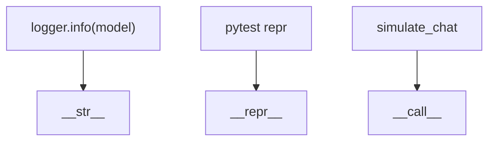

---

## 32. Schema 演进时间线

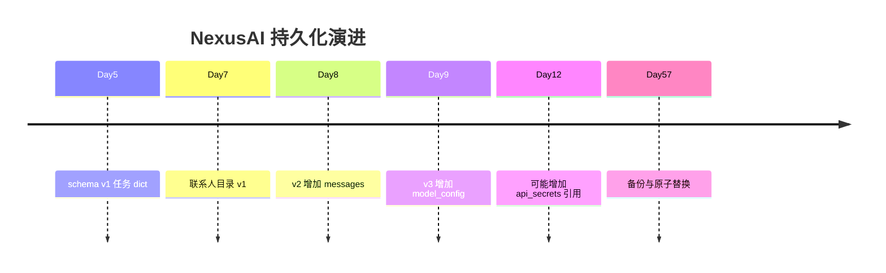

| 版本 | 新增字段 | 迁移来源 |
|---|---|---|
| 1 | owner, contacts | Day7 |
| 2 | messages | Day8 |
| 3 | model_config | Day9 |

原则：只增不删；未知版本拒绝；迁移不伪造业务历史。

---

## 33. 迁移桌面演练（20 步）

1. 准备 v2 JSON，revision=4，messages 一条 user。
2. 删除 model_config 字段（本来就没有）。
3. 运行 CLI，观察“Schema 已迁移至 v3”。
4. 打开文件确认 schema_version=3。
5. 确认 model_config 默认 qwen。
6. 确认 revision=5。
7. 确认原 user 消息仍在。
8. 确认未凭空出现 assistant。
9. 菜单 9 模拟对话，assistant 追加。
10. revision 变 6。
11. 第二次启动，status=loaded 非 migrated。
12. 菜单 8 切换 openai。
13. revision 再增。
14. 杀进程重启，provider 仍为 openai。
15. 菜单 7 摘要 schema=3。
16. 复制 JSON 到测试目录跑 test_models。
17. 改 schema_version=99，应 exit 3。
18. 改 temperature=5 到 JSON，切换或 active 报错。
19. 构建 release，确认无 JSON。
20. 跑 verify_day09 全绿。

---

## 34. 对象导向设计纠偏测验（25 题）

1. 继承表示什么关系？  
   **答：is-a，OpenAIModel 是一种 BaseModel。**

2. 多态在本项目指什么？  
   **答：同一 `model(messages)` 调用，不同子类不同实现。**

3. super() 省略会怎样？  
   **答：父类 invariant 未建立，property 可能失效。**

4. 为何不把 format_request 放基类默认实现？  
   **答：没有通用格式，默认实现会掩盖子类遗漏。**

5. PlatformState 应不应继承 BaseModel？  
   **答：不应，平台不是模型。**

6. model_config 为何用 dict？  
   **答：JSON 序列化友好，跨进程恢复简单。**

7. active_model 每次新建实例浪费吗？  
   **答：教学项目可接受，换得状态一致。**

8. simulate 放哪一层？  
   **答：BaseModel，子类只改 format/parse。**

9. 切换模型为何先 create 临时实例？  
   **答：先校验，失败则不 persist。**

10. __call__ 内为何取两种 messages 路径？  
    **答：OpenAI 顶层，Qwen 在 input 内。**

11. 迁移 v1 也会升 v3 吗？  
    **答：是，from_dict 统一 migrated。**

12. 发布包为何删 JSON？  
    **答：防数据泄露与环境污染。**

13. 真实 API Key 放哪？  
    **答：Day13 .env，不进 Git。**

14. 新增 provider 最少改几处？  
    **答：子类 + REGISTRY 两处。**

15. temperature 上限为何是 2？  
    **答：教学简化，与 OpenAI 文档常见范围一致。**

16. 统计里为何用 str(model)？  
    **答：展示人类可读模型信息。**

17. CLI 菜单 9 空输入为何 continue？  
    **答：不调用模型，不 revision。**

18. assistant 模拟文本为何带前缀？  
    **答：区分真 API 与教学模拟。**

19. Day8 测试为何要回归？  
    **答：证明扩展未破坏对象层。**

20. parse_response 为何 super？  
    **答：复用公共 content 处理，再扩展字段。**

21. build_messages 的 history 类型？  
    **答：dict 列表，与 API 对齐。**

22. 为何不用 ABC 模块？  
    **答：Day10 再引入 formal abstract。**

23. 双进程测试验证什么？  
    **答：持久化与 model_config 恢复。**

24. SHA256SUMS 作用？  
    **答：制品完整性校验。**

25. Day10 首要拆分文件？  
    **答：models/base.py, openai.py, qwen.py, platform.py。**

---

## 35. 课堂快照与讲师手册

### 35.1 课前检查

- Python 3.10+
- Day8 作业已交
- 能解释 Contact 与 ChatMessage 职责
- Git 分支：`feature/day09-model-inheritance`

### 35.2 课中时间节点

| 时间 | 活动 |
|---|---|
| 0:00-0:20 | 回顾 Day8 + 多供应商痛点 |
| 0:20-1:00 | 继承与 super 板演 |
| 1:00-1:40 | OpenAI/Qwen 对比编码 |
| 1:40-2:20 | property 与 __call__ |
| 2:20-3:30 | 实操 model_platform |
| 3:30-4:00 | 迁移与发布 |
| 4:00-4:30 | 答疑与作业 |

### 35.3 常见卡点

1. 忘记 `super().__init__` → 用断点看 `_temperature` 是否存在。  
2. Qwen payload 路径写错 → 打印 keys 对照表。  
3. 迁移 revision 未增 → 检查 persist_change 调用。  
4. CLI 9 无输出 → 检查 add_message 是否成功。  

---

## 36. ADR-009：模型层继承决策

**背景**：平台需对接多 LLM 供应商。  
**决策**：采用 BaseModel 抽象 + 注册表工厂；PlatformState 持久化 model_config。  
**后果**：新增供应商成本低；单文件暂时变大；Day10 需拆包。  
**替代方案**：if/else 分支（拒绝，不可扩展）、第三方统一 SDK（Day25 再评估）。

---

## 37. 代码评审量规

| 维度 | 1 分 | 3 分 | 5 分 |
|---|---|---|---|
| 继承结构 | 无 super | 有 super 无重写 | 清晰重写 format |
| 多态 | CLI 写 if | 部分工厂 | 全走 create_model |
| property | 公开属性 | 有 getter 无校验 | 完整校验 |
| 迁移 | 丢字段 | 升版本无 revision | 完整 v3+revision |
| 测试 | 无 | 单测 | 单测+CLI+发布 |
| 注释 | 无 | 关键处有 | 教学级完整 |

---

## 38. 与真实 OpenAI / Qwen API 字段对照（预习）

| 概念 | OpenAI Chat | Qwen DashScope（简化） |
|---|---|---|
| 模型名 | model | model |
| 消息 | messages[] | input.messages[] |
| 温度 | temperature | parameters.temperature |
| 最大 token | max_tokens | parameters.max_tokens |
| 响应 | choices[0].message | output.text（真实） |

Day12 将把 simulate_response 换成 HTTP POST，today 只熟悉字段映射。

---

## 39. 团队协作分工建议

| 角色 | 今日交付 |
|---|---|
| 产品 | 确认默认 qwen 符合教学目标 |
| 后端 A | BaseModel + OpenAIModel |
| 后端 B | QwenModel + factory |
| 测试 | test_models + 迁移用例 |
| 运维 | build_release + SHA |
| 安全 | 审查 JSON 不进 ZIP |

---

## 40. 术语与项目证据对照表

| 术语 | 定义 | 项目证据 |
|---|---|---|
| 继承 | 子类扩展父类 | OpenAIModel(BaseModel) |
| 重写 | 子类改父类方法 | format_request |
| 多态 | 同一接口不同行为 | model(messages) |
| super | 调用父类实现 | __init__ |
| property | 受控属性 | temperature |
| __call__ | 实例可调用 | simulate 入口 |
| 工厂 | 按配置创建对象 | create_model |
| 迁移 | 旧 schema 升级 | v2→v3 |
| fail-closed | 出错即拒绝 | schema 99 exit3 |
| DTO | 数据传输对象 | model_config dict |

学员答题必须同时给术语和代码证据。只会背定义不能指向 `model_platform.py` 位置，说明尚未转化为工程能力。

---

## 41. 故障注入与恢复审查（15 场景）

| 编号 | 故障 | 期望行为 |
|---|---|---|
| F01 | schema_version=99 | exit 3，不覆盖 |
| F02 | JSON 空文件 | 新状态 |
| F03 | 缺 owner | rejected |
| F04 | temperature=9 写入 JSON | active 或切换失败 |
| F05 | provider=typo | ValueError |
| F06 | 模拟对话空输入 | 不 persist |
| F07 | 重复 contact_id | add_contact 失败 |
| F08 | 删除 model_config 后 v3 加载 | 默认 qwen |
| F09 | 发布包含 JSON | 构建失败 |
| F10 | SHA 被篡改 | test_release 失败 |
| F11 | 双进程 mid-revision | 后写覆盖（教学已知限制） |
| F12 | messages 非法 role | add_message 失败 |
| F13 | v1 无 messages | 迁移后 [] |
| F14 | CLI 菜单 10 | 菜单错误 |
| F15 | Day8 回归失败 | 禁止合并 |

---

## 42. 第一周与第二周衔接笔记

Day7 字典通讯录 → Day8 对象 → Day9 模型多态 → Day10 模块包。学员应能口述：“联系人对象负责谁，消息对象说什么，模型对象怎么说，平台对象把三者与 revision 一起持久化。” 这句话是 Week2 前三天的主线总结。

### 42.1 代码行数与复杂度自觉

Day9 的 `model_platform.py` 已接近单文件上限。这不是鼓励复制粘贴凑行数，而是说明**真实项目也会触达 refactor 临界点**。学员应在提交前自检：

- 是否存在两个以上 if provider？
- 是否可以把模型相关代码折叠到单独模块？
- 是否每个类方法都能在 test_models 找到对应断言？

当三个问题的答案开始动摇，就是 Day10 拆包的天然动机。

### 42.2 与面试题对齐

| 面试问法 | 推荐答法 | 项目证据 |
|---|---|---|
| 你如何封装多 LLM？ | 抽象基类+工厂+配置持久化 | BaseModel/create_model |
| 多态例子？ | 同一 __call__，不同 format_request | OpenAI vs Qwen |
| property 场景？ | 参数校验前移到对象 | temperature |
| 为什么用 super？ | 复用父类 invariant | OpenAIModel.__init__ |

---

## 43. 延伸阅读（本日可选）

1. Python 官方文档：Data model → Special method names。  
2. OpenAI Chat Completions 请求体字段说明（只看结构，不申请 Key）。  
3. 阿里云 DashScope 文本生成 API 文档目录（对比 input/parameters 分区）。  
4. 《重构》第 12 章：拉平继承体系——理解何时停止子类爆炸。  

这些阅读不进入当堂测验，但会出现在 Day21 周测的“架构选择”简答题中。

### 43.1 今日自检清单（收作业前 5 分钟）

- [ ] 能不看代码口述 v2→v3 迁移做了什么。  
- [ ] 能白板画出 BaseModel 与子类关系。  
- [ ] test_models、test_cli、test_release 本地全绿。  
- [ ] 发布目录中不存在 `nexus_platform.json`。  
- [ ] 切换 openai 后重启，摘要里 model 字段已变。  

讲师批改时若前五项缺一项，作业最高只能给 B，即使功能演示通过——因为我们培养的是工程闭环，不是“能跑就行”。

**收束语**：Day9 不是“又写了几个类”，而是第一次把**变化隔离**做进 NexusAI。以后每次接 API、换框架、加 Rerank，都会重复这个模式：找变化点、关进边界、写测试证明旧能力还在。

**明日预告**：Day10 会把 Contact、ChatMessage、BaseModel 与 PlatformState 拆成包结构，并引入 try/except 与自定义异常。今晚请把 model_platform.py 通读一遍，标出你认为最应该独立成文件的三个类。

**版本标记**：本课对应 Git 标签 `nexus-0.0.9-day09`。合并前请在 PR 描述里附上 `verify_day09.py` 全绿截图或终端输出摘要，便于评审者复现。质量门禁最低 30000 字，本课以测试通过为合并前提，不得跳过 Day1-8 历史回归。Day9 课件全量交付完成。以上。

---

## 43. 今日交付

```text
course/day09/day09-lesson.md
course/day09/starter/base_model.py
course/day09/solution/model_platform.py
course/day09/tests/test_models.py
course/day09/tests/test_cli.py
course/day09/deploy/build_release.py
course/day09/tests/test_release.py
tools/verify_day09.py
```

【收尾旁白】

“Day 9 平台终于知道‘用哪个模型说话’。BaseModel 稳住接口，OpenAIModel 与 QwenModel 隔离差异，property 与魔术方法让对象像工程组件一样可用。Schema v3 把模型配置写进磁盘，切换供应商不再害怕。Day 12 接入 HTTP 时，我们只需要替换 simulate，而不用重写平台。”
