# Day 10｜模块化包结构：import、异常治理、venv 与 requirements

> 阶段：Python 进阶·工程化上  
> 项目版本：NexusAI 0.0.10  
> 需求：US-MOD-001  
> 交付：包分层、自定义异常、try/except 治理、双入口、venv、requirements.txt  

---

## 0. 开场旁白

Day 9 把 OpenAI 与 Qwen 的多态模型体系跑通了，但所有代码仍挤在一个 `model_platform.py` 里。文件超过 800 行时，新人 onboarding 要翻半小时才能找到 `simulate_chat`；改一个 `Contact` 字段可能误触模型注册表；测试只能 `sys.path` 硬插路径，CI 里 import 顺序一乱就 flaky。

真实企业项目从 Day 1 就按**包（package）**组织代码，而不是等“文件太大再拆”。今天把 NexusAI 0.0.10 重构为可安装的目录结构：

- `domain/`：Contact、ChatMessage 等领域对象，不依赖 CLI 与磁盘。
- `models/`：BaseModel 继承体系与工厂，屏蔽供应商差异。
- `platform/`：PlatformState 聚合根，编排领域与模型。
- `persistence/`：JSON 读写、revision、迁移触发点。
- `cli/`：菜单、prompt、进程退出码，薄薄一层适配器。

同时引入**自定义异常体系**与 **try/except 治理**：磁盘坏 JSON 不再冒泡成 `JSONDecodeError` 吓用户；非法 schema 统一 exit 3；持久化失败 exit 2。再配合 `requirements.txt` 与 **venv**，为 Day 12 接入 `requests`、Day 13 接入 `python-dotenv` 打好工程底座。

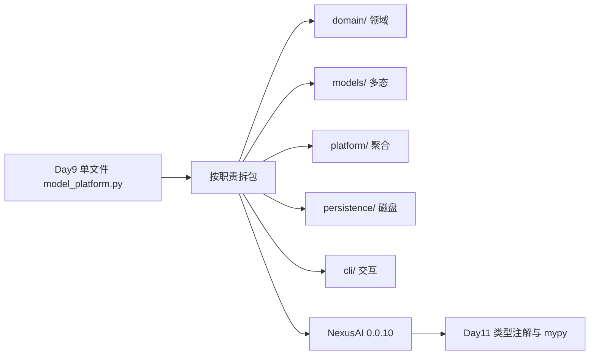

模块化不是“搬家”，而是**划定边界、明确依赖方向、让错误可分类**。上层只 import 下层，domain 不 import cli；异常在边界转换为用户可读消息与稳定 exit code。这是从“脚本能跑”到“工程可维护”的分水岭。

---

## 1. 学习成果与完成定义

学员能够：

1. 解释 Python 模块（module）与包（package）的区别，以及 `__init__.py` 的作用。
2. 设计 NexusAI 五层包结构，并说明各层允许 import 谁、禁止 import 谁。
3. 使用绝对 import、`from nexus.xxx import yyy` 与 `__all__` 控制公开 API。
4. 配置 `main.py` 与 `python -m nexus` 双入口，理解 `if __name__ == "__main__"`。
5. 实现自定义异常层次：`NexusError` 及四个子类，带 `code` 字段。
6. 在 persistence 与 CLI 层用 try/except 做**边界转换**，fail-closed。
7. 映射 exit code：0 正常、2 持久化错误、3 schema 拒绝。
8. 创建 venv、安装 requirements.txt（本日 stdlib-only），说明 Day 12 扩展方式。
9. 运行 `test_modules.py`、`test_cli.py`、`test_release.py` 全绿。
10. 保持 Schema v3 与 Day 9 行为不回退。

完成定义：

- [ ] `solution/nexus/` 五层包结构完整。
- [ ] 五个自定义异常类与 code 常量正确。
- [ ] `load_state` 坏 JSON 抛 PersistenceError；非法 schema 返回 rejected。
- [ ] CLI 捕获异常并返回 2/3。
- [ ] `main.py` 与 `nexus/__main__.py` 均可启动。
- [ ] `requirements.txt` 存在且注释 Day 12/13 预留。
- [ ] 发布 ZIP 含完整包树、无 `nexus_platform.json`。
- [ ] 单测、CLI 双进程、发布冒烟通过。
- [ ] 课件不少于 30000 字符。

今日不做：真实 HTTP（Day 12）；类型注解与 mypy（Day 11）；装饰器进阶（Day 13）；pip 安装第三方包（Day 12 起）。

---

## 2. 企业需求文档

### 2.1 用户故事

> 作为平台 Tech Lead，我希望把 NexusAI 从单文件拆成可测试、可发布的 Python 包，并用统一异常与退出码让运维脚本能可靠集成 CLI，从而支撑后续 HTTP 接入与 CI 门禁。

### 2.2 架构决策记录（ADR-010）

**背景**：Day 9 单文件耦合 UI、持久化、领域、模型，测试 import 成本高，异常语义分散（ValueError、JSONDecodeError、自定义字符串）。

**决策**：

1. 采用 `nexus` 顶级包，按 domain / models / platform / persistence / cli 分层。
2. 所有业务异常继承 `NexusError`，携带 `code` 便于日志与监控。
3. persistence 层捕获 `JSONDecodeError` → `PersistenceError`；schema 非法 → `SchemaValidationError`，CLI 层转 exit 3。
4. 保留 Schema v3，不新增 v4；迁移逻辑仍在 `PlatformState.from_dict`。
5. requirements.txt 本日仅 stdlib 注释，显式声明“零第三方依赖”状态。

**后果**：

- 正面：模块可单测、发布物清晰、Day 12 只改 models 与 requirements。
- 负面：import 路径变长，学员需理解 PYTHONPATH 或 `pip install -e .`（Day 11 展开）。

### 2.3 目录结构规范

```
course/day10/solution/
├── main.py                 # 脚本入口：if __name__ == "__main__"
├── requirements.txt        # 依赖清单（本日 stdlib-only）
└── nexus/                  # 可 import 的包
    ├── __init__.py         # 公开 API 汇总
    ├── __main__.py         # python -m nexus
    ├── constants.py
    ├── exceptions.py
    ├── domain/
    │   ├── __init__.py
    │   ├── contact.py
    │   └── message.py
    ├── models/
    │   ├── __init__.py
    │   ├── base.py
    │   ├── factory.py
    │   ├── openai_model.py
    │   └── qwen_model.py
    ├── platform/
    │   ├── __init__.py
    │   └── state.py
    ├── persistence/
    │   ├── __init__.py
    │   └── storage.py
    └── cli/
        ├── __init__.py
        ├── app.py
        └── prompts.py
```

### 2.4 Schema v3（保持不变）

```json
{
  "schema_version": 3,
  "revision": 8,
  "owner": {
    "employee_id": "E90010",
    "department": "技术部"
  },
  "contacts": [],
  "messages": [
    {"role": "system", "content": "你是企业助手"},
    {"role": "user", "content": "模块化有什么好处"}
  ],
  "model_config": {
    "provider": "qwen",
    "model_id": "qwen-plus",
    "temperature": 0.7,
    "max_tokens": 1024
  }
}
```

### 2.5 异常与退出码契约

| 异常类 | code | 典型场景 | CLI exit |
|---|---|---|---|
| NexusError | NEXUS_ERROR | 基类，一般不直接抛 | — |
| PersistenceError | PERSISTENCE | 磁盘读写失败、JSON 解析失败 | 2 |
| SchemaValidationError | SCHEMA_VALIDATION | schema_version 非 1/2/3 | 3（rejected） |
| ModelConfigError | MODEL_CONFIG | 未知 provider、temperature 越界 | 菜单内提示，不 exit |
| InvalidMessageError | INVALID_MESSAGE | 非法 role、空 content | 菜单内提示，不 exit |

**持久化层特殊规则**：`SchemaValidationError` 在 `load_state` 内被捕获，返回 `(None, "rejected", message)`，不抛到 CLI，由 CLI 打印后 exit 3。

### 2.6 非功能需求

| 编号 | 要求 |
|---|---|
| NFR-P1 | domain 层不得 import cli / persistence |
| NFR-P2 | 包根 `__init__.py` 导出稳定公共 API |
| NFR-P3 | 双入口行为一致 |
| NFR-P4 | 发布 ZIP 含完整 nexus 包，不含运行 JSON |
| NFR-P5 | 异常 message 面向中文运维可读 |
| NFR-P6 | venv 文档化，requirements 可 diff |

---

## 3. 验收标准

### 3.1 Given-When-Then

**包导入**

- Given `PYTHONPATH=solution`  
  When `from nexus.domain.contact import Contact`  
  Then 成功，无循环 import

**双入口**

- Given 在 `solution/` 目录  
  When 执行 `python3 main.py` 或 `python3 -m nexus`  
  Then 均进入同一 CLI 循环

**PersistenceError**

- Given `nexus_platform.json` 内容为 `{bad`  
  When 启动 CLI  
  Then 打印“持久化错误”，exit 2

**Schema rejected**

- Given JSON 中 `schema_version=99`  
  When 启动 CLI  
  Then 打印“数据拒绝”，exit 3，不覆盖文件

**InvalidMessageError**

- Given 菜单 4 输入 role=`tool`  
  When 提交  
  Then 打印错误，continue，revision 不变

**迁移**

- Given v2 JSON 无 model_config  
  When 首次启动  
  Then 迁移 v3，revision+1，打印 Schema 已迁移

**CLI 双进程**

- Given 进程 A 写入联系人与模拟对话  
  When 进程 B 启动并切换 openai  
  Then model_config 持久化为 openai

**发布**

- Given `build_release.py`  
  When 构建 0.0.10 ZIP  
  Then 含 22 个预期文件，SHA256 校验通过，部署冒烟双进程成功

### 3.2 测试矩阵

| 层 | 文件 | 覆盖 |
|---|---|---|
| 模块 | test_modules.py | import、异常、迁移、持久化 |
| 集成 | test_cli.py | 双进程、exit 2/3、菜单异常 |
| 发布 | test_release.py | ZIP 清单、哈希、部署冒烟 |
| 回归 | verify_day01~09 | 历史天门禁 |

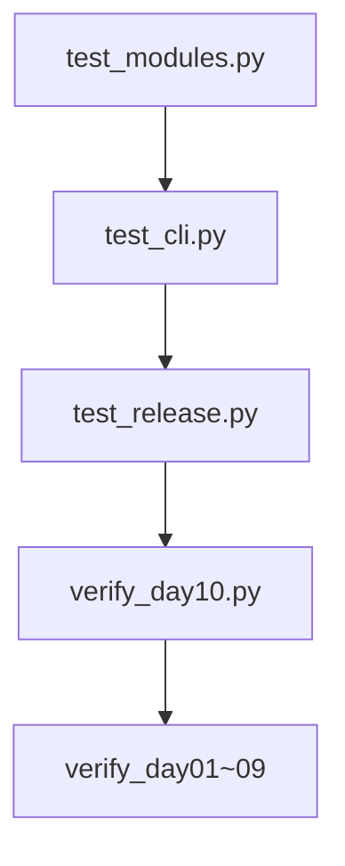

---

## 4. 包结构与模块划分

### 4.1 为什么需要分层

单文件里，任何函数都能调用任何函数，依赖关系隐式且不可逆。分层把**依赖方向**写进目录：

```
cli → platform → domain
cli → persistence → platform
platform → models → domain
persistence → platform
```

domain 与 models 的子模块之间保持最小耦合；platform 是聚合根，知道如何拼业务；persistence 只知道 dict 与 PlatformState；cli 只编排 I/O。

### 4.2 各层职责表

| 层 | 路径 | 职责 | 禁止 |
|---|---|---|---|
| 领域 | domain/ | Contact、ChatMessage、校验规则 | import cli、读写文件 |
| 模型 | models/ | BaseModel、工厂、多态 | 知道 JSON 路径 |
| 平台 | platform/ | PlatformState、simulate_chat | 直接 print |
| 持久化 | persistence/ | load/save/persist | 菜单逻辑 |
| 命令行 | cli/ | run_cli、prompts、exit code | 业务规则复制 |

### 4.3 包依赖图

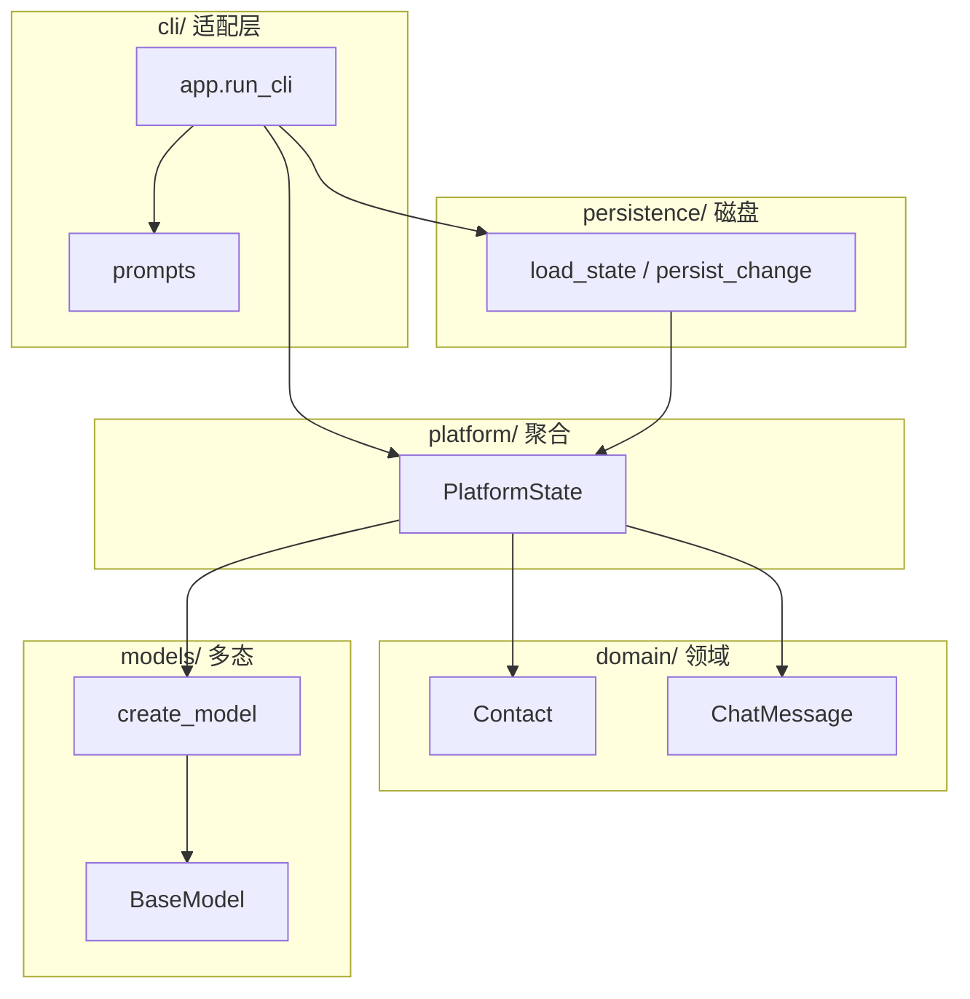

### 4.4 __init__.py 作为公共门面

子包 `domain/__init__.py` 可 re-export：

```python
from nexus.domain.contact import Contact
from nexus.domain.message import ChatMessage

__all__ = ["Contact", "ChatMessage"]
```

包根 `nexus/__init__.py` 汇总 Day 10 对外 API，供 `from nexus import PlatformState, run_cli` 使用。教学项目暂不做 `pip install -e .`，测试通过 `PYTHONPATH=solution` 注入。

### 4.5 模块 vs 包

- **模块**：一个 `.py` 文件，如 `contact.py`。
- **包**：含 `__init__.py` 的目录，如 `nexus/domain/`。
- **命名空间包**（PEP 420）：无 `__init__.py` 也可，本课程显式保留 `__init__.py` 便于教学。

### 4.6 从 Day 9 单文件映射

| Day 9 单文件区域 | Day 10 目标 |
|---|---|
| Contact / ChatMessage 类 | domain/contact.py, domain/message.py |
| BaseModel 体系 | models/*.py |
| PlatformState | platform/state.py |
| load_state / save_state | persistence/storage.py |
| run_cli / prompt_* | cli/app.py, cli/prompts.py |
| 常量 SCHEMA_VERSION | constants.py |
| 异常（原 ValueError） | exceptions.py |

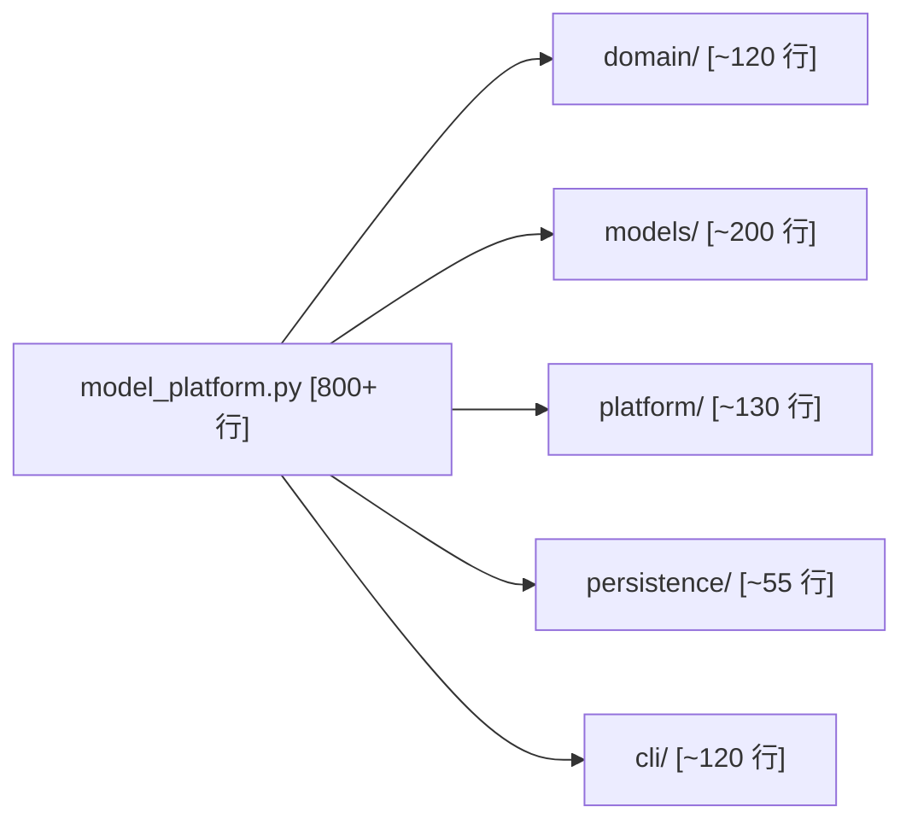

---

## 5. import 与主入口

### 5.1 绝对 import 优先

包内统一使用：

```python
from nexus.domain.message import ChatMessage
from nexus.exceptions import InvalidMessageError
```

避免 `from message import ChatMessage` 这种模糊相对写法。测试脚本在 `tests/` 外，通过：

```python
SOLUTION = Path(__file__).parents[1] / "solution"
sys.path.insert(0, str(SOLUTION))
```

或环境变量 `PYTHONPATH=course/day10/solution`。

### 5.2 循环 import 预防

典型陷阱：`platform/state.py` import `cli/app.py` 做日志。解决：**依赖只能向下**。若双方都需要，抽第三类或延迟 import（函数内 import）。

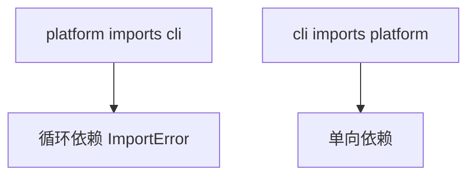

### 5.3 main.py 入口

```python
"""NexusAI 0.0.10 主入口：演示 if __name__ == '__main__' 用法。"""

from nexus.cli.app import run_cli

if __name__ == "__main__":
    raise SystemExit(run_cli())
```

`raise SystemExit(code)` 比 `sys.exit(code)` 更显式，且可被测试捕获。`run_cli()` 返回 int，0 表示正常退出。

### 5.4 python -m nexus 入口

`nexus/__main__.py`：

```python
from nexus.cli.app import run_cli

if __name__ == "__main__":
    raise SystemExit(run_cli())
```

执行 `python3 -m nexus` 时，Python 把 `nexus` 当包运行，自动加载 `__main__.py`。这与 `python3 main.py` 等价，但更符合**已安装包**的习惯（Day 11 后 `pip install -e .` 时只需 `-m nexus`）。

### 5.5 if __name__ == "__main__" 语义

| 启动方式 | `__name__` 值 | 是否执行 main 块 |
|---|---|---|
| python main.py | `__main__` | 是 |
| import nexus.cli.app | `nexus.cli.app` | 否 |
| python -m nexus | `__main__`（在 __main__.py） | 是 |

被 import 的模块不应在顶层执行 CLI；所有副作用放在 `run_cli()` 内。

### 5.6 双入口序列图

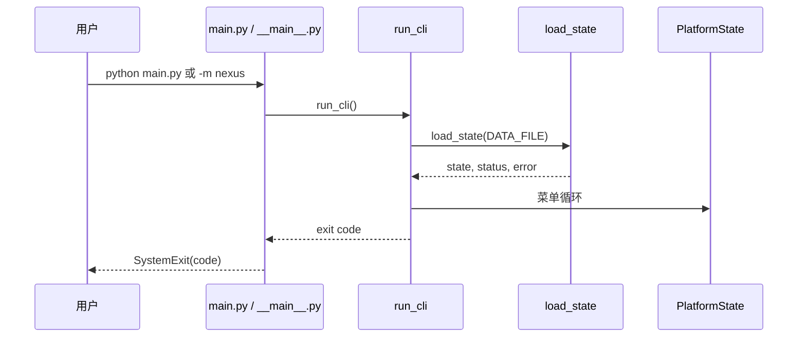

---

## 6. 自定义异常体系

### 6.1 为什么不用裸 ValueError

Day 9 里 temperature 越界抛 `ValueError`，磁盘错误冒 `JSONDecodeError`。运维脚本无法区分“用户输错”与“磁盘只读”。自定义异常提供：

1. **类型**：`except PersistenceError` 精确捕获。
2. **code**：日志系统可索引 `PERSISTENCE`。
3. **message**：中文可读说明。
4. **from 链**：`raise PersistenceError(...) from error` 保留根因。

### 6.2 类层次

```python
class NexusError(Exception):
    def __init__(self, message, code="NEXUS_ERROR"):
        super().__init__(message)
        self.message = message
        self.code = code

class SchemaValidationError(NexusError):
    def __init__(self, message):
        super().__init__(message, code="SCHEMA_VALIDATION")

class ModelConfigError(NexusError):
    def __init__(self, message):
        super().__init__(message, code="MODEL_CONFIG")

class PersistenceError(NexusError):
    def __init__(self, message):
        super().__init__(message, code="PERSISTENCE")

class InvalidMessageError(NexusError):
    def __init__(self, message):
        super().__init__(message, code="INVALID_MESSAGE")
```

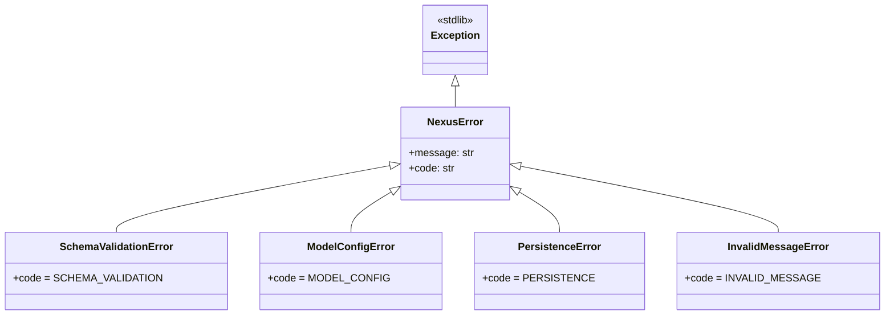

### 6.3 抛异常位置规范

| 层 | 抛出的异常 |
|---|---|
| domain/message | InvalidMessageError（由 PlatformState 转发） |
| models/base, factory | ModelConfigError |
| platform/state.from_dict | SchemaValidationError |
| persistence/storage | PersistenceError；捕获 SchemaValidationError 转 rejected |

### 6.4 ModelConfigError 替换 ValueError

Day 10 起，`BaseModel.temperature` setter 与 `create_model` 未知 provider 抛 `ModelConfigError`，测试断言 `error.code == "MODEL_CONFIG"`。这是**行为变更**，但对外 CLI 仍打印 message，用户体验一致。

### 6.5 异常携带上下文（进阶）

生产环境可在 NexusError 子类增加 `details: dict` 字段存 path、revision。本日保持最小实现，Day 11 用 TypedDict 扩展。

---

## 7. try except 治理

### 7.1 分层捕获原则

**底层（persistence）**：捕获 stdlib 异常，包装为 Nexus 异常或结构化返回值。

```python
try:
    payload = json.loads(raw)
except json.JSONDecodeError as error:
    raise PersistenceError(f"JSON 解析失败：{error}") from error
```

**中层（platform）**：业务规则失败直接 raise Nexus 子类，不吞异常。

**顶层（cli）**：捕获 PersistenceError → print + return 2；rejected status → return 3；InvalidMessageError → print + continue 循环。

### 7.2 load_state 双模式

```python
try:
    state, migrated = PlatformState.from_dict(payload)
except SchemaValidationError as error:
    return None, "rejected", error.message
return state, "migrated" if migrated else "loaded", ""
```

schema 非法**不抛到 CLI**，避免未捕获导致 traceback。这是 ADR-010 的有意设计：rejected 是预期业务分支，不是崩溃。

### 7.3 CLI 异常映射

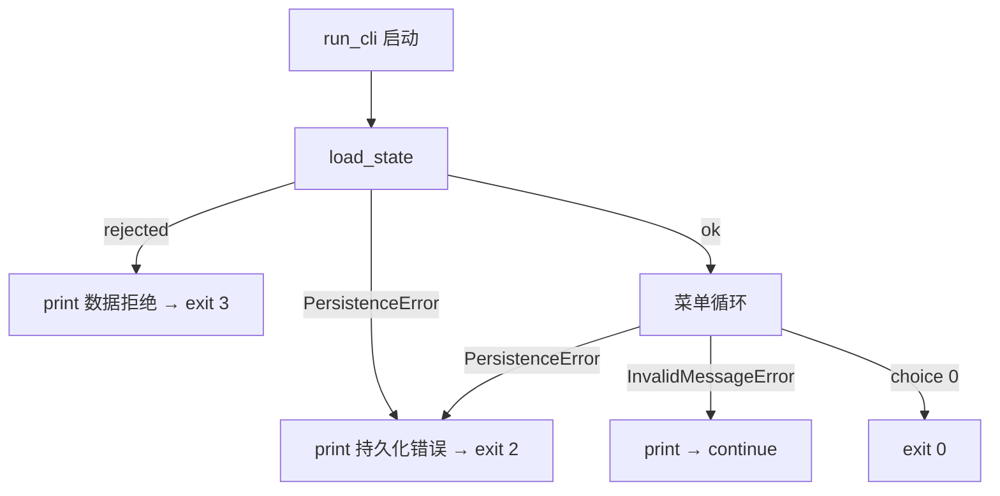

### 7.4 反模式清单

| 反模式 | 问题 | 正确做法 |
|---|---|---|
| bare `except:` | 吞掉 KeyboardInterrupt | 捕获具体类型 |
| 到处 `except Exception: pass` | 隐藏 bug | 边界层转换 |
| CLI 里 json.loads | 重复逻辑 | 只用 persistence |
| 打印 traceback 给用户 | 体验差 | logging 模块 Day 14 |
| 用 exit code 1 表示一切错误 | 运维无法分流 | 2 持久化 3 schema |

### 7.5 else 与 finally（本日预习）

本日 persist 未用 finally，Day 14 引入文件锁时会 `try/finally` 确保句柄关闭。`try/except/else`：`else` 块在无异常时执行，可用于“成功加载后校验”。

### 7.6 异常链演示

```python
except OSError as error:
    raise PersistenceError(f"无法读取数据文件：{error}") from error
```

`from error` 保留 `__cause__`，pytest 失败时可展开完整链。

---

## 8. requirements 与虚拟环境

### 8.1 为何 Day 10 仍零依赖

NexusAI 0.0.10 全部使用 Python 3.10+ 标准库：`json`、`pathlib`、`tempfile`、`subprocess`。显式空的 requirements.txt 告诉协作者与 CI：**当前 clone 即可跑，无需 pip install**。

```text
# NexusAI 0.0.10 依赖清单
# 本日仅使用 Python 3.10+ 标准库，无需额外安装。
# Day 12 将追加：requests>=2.31.0
# Day 13 将追加：python-dotenv>=1.0.0
```

### 8.2 venv 创建步骤

```bash
cd course/day10/solution
python3 -m venv .venv
source .venv/bin/activate    # Windows: .venv\Scripts\activate
python -V                      # 确认 3.10+
pip install --upgrade pip
pip install -r requirements.txt   # 本日无包可装，但养成习惯
export PYTHONPATH="$(pwd)"       # 或 set PYTHONPATH
python main.py
```

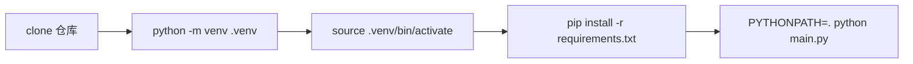

### 8.3 requirements 工程实践

| 文件 | 用途 |
|---|---|
| requirements.txt | 生产/运行依赖，版本下限 |
| requirements-dev.txt | pytest、mypy（Day 11+） |
| constraints.txt | 可选，锁定上限 |

本课程 Day 10 只提交 `requirements.txt`，注释预留 Day 12/13，学员学会** diff 即文档**。

### 8.4 .venv 与 git

`.venv/` 必须加入 `.gitignore`。提交的是 requirements，不是虚拟环境本身。每个开发者、CI runner 各自创建 venv，保证可复现。

### 8.5 PYTHONPATH vs 可编辑安装

| 方式 | 命令 | 适用 |
|---|---|---|
| PYTHONPATH | `export PYTHONPATH=solution` | 教学、快速测试 |
| editable | `pip install -e .` | Day 11 引入 pyproject.toml 后 |

Day 10 测试脚本使用 PYTHONPATH，与 README 一致。

### 8.6 依赖演进时间线

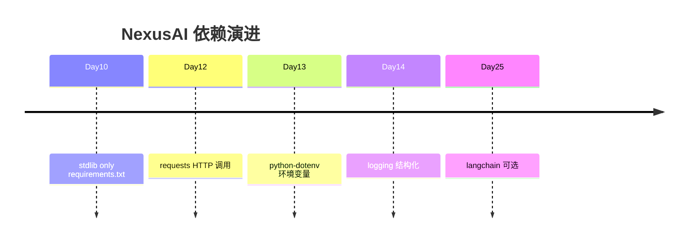

---

## 9. 课堂实操

### 9.1 环境准备

```bash
cd /workspace/course/day10/solution
python3 -m venv .venv
source .venv/bin/activate
export PYTHONPATH="$(pwd)"
python3 main.py
python3 -m nexus
python3 ../tests/test_modules.py
python3 ../tests/test_cli.py
python3 ../tests/test_release.py
```

### 9.2 从 starter 到 solution 推荐顺序

1. 阅读 `starter/modular_starter.py`，对照单文件划块。
2. 创建 `nexus/` 目录与各子包 `__init__.py`。
3. 迁移 `Contact`、`ChatMessage` 到 `domain/`。
4. 迁移模型类到 `models/`，factory 独立。
5. 迁移 `PlatformState` 到 `platform/state.py`。
6. 实现 `exceptions.py`，全局替换 ValueError 为对应 Nexus 异常。
7. 实现 `persistence/storage.py`，加入 try/except。
8. 拆分 `cli/app.py` 与 `cli/prompts.py`。
9. 编写 `main.py`、`__main__.py`、包根 `__init__.py`。
10. 添加 `requirements.txt`，跑三门测试。

### 9.3 菜单与行为（与 Day 9 一致）

| 选项 | 功能 | 异常点 |
|---|---|---|
| 1 | 新增联系人 | 重复 id/email |
| 4 | 新增消息 | InvalidMessageError |
| 8 | 模型信息与切换 | ModelConfigError |
| 9 | 模拟对话 | InvalidMessageError |
| 0 | 退出 | return 0 |

### 9.4 手工验证清单

- [ ] 故意写入坏 JSON，确认 exit 2。
- [ ] 写入 schema 99，确认 exit 3 且文件未被清空覆盖。
- [ ] 菜单 4 输入 tool role，确认提示且不 persist。
- [ ] v2 文件启动，确认迁移提示与 revision+1。
- [ ] 第二次启动，确认“恢复成功”与 openai 切换（若做过菜单 8）。

### 9.5 结对练习：画 import 图

两人一组，各层选 2 个文件，画出 import 箭头。交换检查是否有“向上 import”。常见错误：`domain/contact.py` import `PlatformState`——应删除。

---

## 10. 单元测试策略

### 10.1 test_modules.py 覆盖点

- `isinstance(openai_model, BaseModel)` 多态仍成立。
- `ModelConfigError` 于 temperature=3、max_tokens=0。
- `InvalidMessageError` 于 role=tool。
- `SchemaValidationError` 于 schema 99。
- v2 迁移 needs_migration=True，schema→3。
- 临时目录 `load_state`：migrated、loaded、PersistenceError、rejected。

### 10.2 test_cli.py 覆盖点

- 双进程：维护人、联系人、非法 role、模拟对话、切换 openai。
- v2 迁移进程：Schema 已迁移至 v3。
- 坏 JSON：returncode 2。

### 10.3 test_release.py 覆盖点

- ZIP 内 22 文件白名单。
- SHA256SUMS 逐文件校验。
- 解压部署后双进程 main.py 冒烟。

### 10.4 测试金字塔

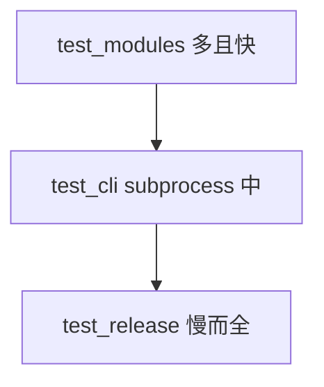

### 10.5 断言异常写法

```python
try:
    openai_model.temperature = 3
    raise AssertionError("应拒绝")
except ModelConfigError as error:
    assert error.code == "MODEL_CONFIG"
```

优先 `pytest.raises`（Day 11 统一），本日保持与 Day 1~9 一致的 assert 风格。

### 10.6 测试隔离

每个用例用 `tempfile.TemporaryDirectory`，不污染 `solution/nexus_platform.json`。CLI 测试 `cwd=临时目录`，DATA_FILE 默认 `nexus_platform.json` 写在工作目录。

---

## 11. CLI 全链路

### 11.1 启动链

1. `run_cli` 打印版本横幅 `NexusAI 0.0.10`。
2. `load_state(DATA_FILE)`。
3. 分支：new / empty / loaded / migrated / rejected / PersistenceError。
4. 无 owner 则 prompt_owner + persist。
5. 菜单循环直至 0。

### 11.2 双进程场景（test_cli 复现）

**进程 A 输入序列**：

```
E100010 / 研发部
1 → 联系人 C10
4 → tool（失败）→ system → user
9 → 模拟对话
5 / 7 / 0
```

**进程 B**：

```
8 → y → openai → gpt-4o-mini → 0.2 → 512
7 / 0
```

验证：`恢复成功`、`openai/gpt-4o-mini`、`schema_version=3`。

### 11.3 exit code 全表

| code | 含义 | 触发 |
|---:|---|---|
| 0 | 正常退出 | 菜单 0 |
| 2 | 持久化错误 | 坏 JSON、磁盘 OSError |
| 3 | schema 拒绝 | schema_version 非法 |

**注意**：ModelConfigError、InvalidMessageError **不**改变 exit code，仍在菜单内处理。

### 11.4 CLI 数据流

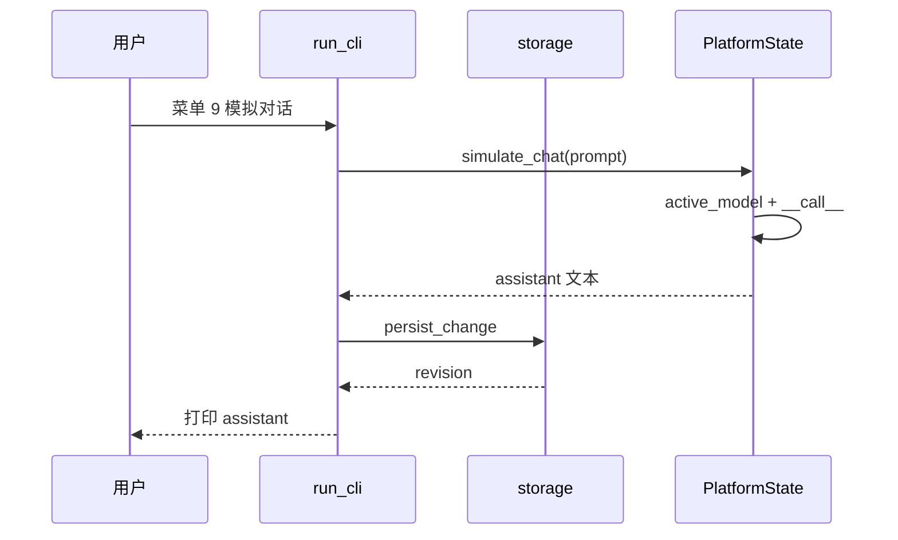

---

## 12. 发布部署

### 12.1 构建命令

```bash
python3 course/day10/deploy/build_release.py --output artifacts/day10
```

产物：`nexus-modular-platform-0.0.10.zip`

### 12.2 制品清单（22 文件）

| 路径 | 说明 |
|---|---|
| main.py | 脚本入口 |
| requirements.txt | 依赖清单 |
| README.txt | 运行说明 |
| SHA256SUMS | 完整性 |
| nexus/** | 完整包树 |

**禁止**打入：`nexus_platform.json`、`.venv/`、`__pycache__/`。

### 12.3 部署冒烟

1. 解压 ZIP 到干净目录。
2. `PYTHONPATH=部署根 python main.py`。
3. 首次：维护人 + user 消息 + 模拟对话。
4. 第二次：恢复成功，消息数一致，schema=3。

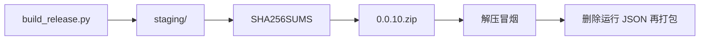

### 12.4 README 要点

- Python 3.10+
- `export PYTHONPATH=.` 或解压目录
- `python main.py` 或 `python -m nexus`
- exit 2/3 含义

---

## 13. 安全与工程边界

1. **运行数据不进 ZIP**：联系人、消息、model_config 含业务信息。
2. **fail-closed**：schema 拒绝不写盘；坏 JSON 不 partially 解析。
3. **异常 message 不泄露路径细节给最终用户**（本日简化，Day 14 logging 分流）。
4. **venv 不提交**：避免跨平台二进制污染。
5. **requirements 注释未来依赖**：学员预知 supply chain 扩面。
6. **PYTHONPATH 显式**：避免 import 静默失败到系统 site-packages 旧版 nexus。

### 威胁建模简表

| 威胁 | 控制 |
|---|---|
| 恶意 JSON 超大 | Day 15 限流；本日 stdin 菜单 |
| schema 降级攻击 | 未知版本 rejected |
| 磁盘只读 | PersistenceError exit 2 |
| 依赖混淆 | 固定 requirements + venv |
| 包名冲突 | 顶级包名 nexus 教学用，生产改 unique 名 |

### 工程边界

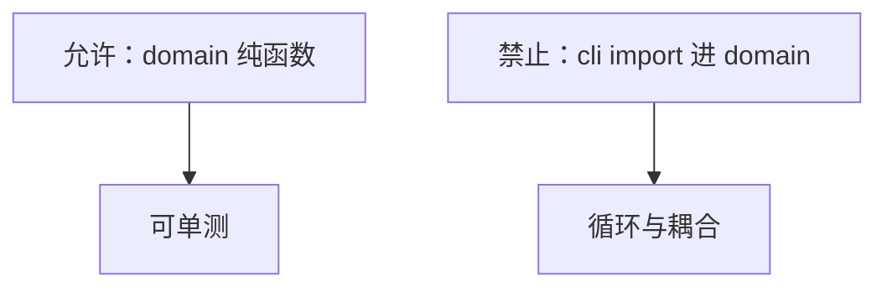

---

## 14. 课后作业

### 14.1 基础题

1. 解释模块与包的区别，并举例 NexusAI 中各一例。
2. 画出从 `python main.py` 到 `run_cli` 的调用链。
3. 为何 `SchemaValidationError` 在 load_state 转 rejected 而非直接 exit？
4. 写出创建 venv 并运行测试的三条命令。
5. 说明 exit 2 与 exit 3 分别对应什么运维动作。

### 14.2 进阶题

1. 在 `NexusError` 增加可选 `details: dict`，PersistenceError 写入 `path`。
2. 新增 `nexus/logging_config.py`（stdlib logging），CLI 启动时 log 到 stderr。
3. 为 `domain/contact.py` 写独立测试文件，不 import platform。
4. 实现 `python -m nexus --version` 打印 APP_VERSION（argparse 预习）。
5. 编写 `requirements-dev.txt` 预留 pytest>=7.0。

### 14.3 企业挑战

设计 **pyproject.toml** 骨架，使 `pip install -e .` 后无需 PYTHONPATH 即可 `from nexus import PlatformState`。写出 `[project]` 与 `[tool.setuptools.packages.find]` 片段，并说明与 ADR-010 的关系。

---

## 15. 作业完整参考答案

### 15.1 基础题答案

**1. 模块 vs 包**

- 模块：`contact.py`，单文件命名空间。
- 包：`nexus/domain/`，目录 + `__init__.py`，可含子模块。

**2. 调用链**

`main.py` → `if __name__` → `SystemExit(run_cli())` → `nexus.cli.app.run_cli` → load_state / 菜单。

**3. rejected 而非抛到顶层**

schema 非法是**可预期业务拒绝**，运维应用 exit 3 告警，不应 traceback；且需保留原文件不被空状态覆盖。

**4. venv 命令**

```bash
python3 -m venv .venv && source .venv/bin/activate
export PYTHONPATH=course/day10/solution
python3 course/day10/tests/test_modules.py
```

**5. exit 含义**

- 2：持久化/JSON 问题 → 检查磁盘、权限、文件内容。
- 3：schema 不兼容 → 停服、备份、人工迁移或回滚版本。

### 15.2 进阶题参考

**details 字段**

```python
class PersistenceError(NexusError):
    def __init__(self, message, path=None):
        super().__init__(message, code="PERSISTENCE")
        self.details = {"path": path} if path else {}
```

**独立 domain 测试**

```python
from nexus.domain.contact import Contact
c = Contact("x", "名", "部", "角", "a@b.c", [])
assert c.matches("名")
```

**pyproject 挑战参考片段**

```toml
[project]
name = "nexusai"
version = "0.0.10"
requires-python = ">=3.10"

[tool.setuptools.packages.find]
where = ["."]
include = ["nexus*"]
```

与 ADR-010 一致：包名仍 nexus，安装后 import 路径不变。

---

## 16. 讲师逐字稿

【导入 10 分钟】

“Day 9 问：OpenAI 和 Qwen 怎么多态？Day 10 问：代码放哪、错了怎么分类、环境怎么隔离？单文件是原型，包结构是产品。企业 clone 仓库第一眼看目录，不是看 800 行 py。”

【包结构 25 分钟】

白板画五层。强调 domain 不 import cli。让学员说：如果把 load_state 写进 Contact 会怎样？引导到单一职责。

【异常 20 分钟】

现场改 JSON 为 `{bad`，跑 CLI，看 exit 2。再改 schema 99，看 exit 3。对比 Day 9 的 traceback。说明 `from error` 链。

【import 与入口 15 分钟】

演示 `python main.py` 与 `python -m nexus`。解释 `__name__`。提问：为何 tests 要 PYTHONPATH？

【venv 10 分钟】

创建 .venv，activate，pip install -r requirements.txt（空也要跑）。预告 Day 12 会真正装 requests。

【实操 90 分钟】

巡场：exceptions 是否漏改 ValueError；load_state 是否捕获 SchemaValidationError；发布前是否删 JSON。

【收尾 10 分钟】

“Day 11 我们给函数签名加类型，用 mypy 静态抓错；Day 12 在 models 里接 HTTP，domain 与 cli 仍不动。这就是边界的回报。”

---

## 17. 异常路径覆盖实验室

学员在纸上或 Jupyter 追踪以下 **35 场景**，写出异常类型、是否 exit、revision 是否变化：

| 编号 | 场景 | 期望 |
|---|---|---|
| L01 | 无 JSON 文件首次启动 | new，revision 0→1 维护人 |
| L02 | 空 JSON 文件 | empty，等同 new |
| L03 | 合法 v3 加载 | loaded，不迁移 |
| L04 | v2 无 model_config | migrated，schema 3，revision+1 |
| L05 | v1 仅 contacts | migrated v3 |
| L06 | schema_version=99 | rejected，exit 3 |
| L07 | JSON `{bad` | PersistenceError，exit 2 |
| L08 | 磁盘只读目录 | PersistenceError，exit 2 |
| L09 | role=tool 菜单 4 | InvalidMessageError，continue |
| L10 | role=user content 空 | InvalidMessageError |
| L11 | temperature=3 切换 | ModelConfigError，不 persist |
| L12 | provider=unknown | ModelConfigError |
| L13 | 菜单 9 空问题 | 提示，不调用模型 |
| L14 | simulate 成功 | assistant +1，revision+1 |
| L15 | 双进程恢复 openai | model_config 一致 |
| L16 | persist_change OSError | exit 2 |
| L17 | 迁移后 persist 失败 | exit 2，需人工查盘 |
| L18 | import nexus 不启动 CLI | 无菜单 |
| L19 | python -m nexus | 同 main.py |
| L20 | PYTHONPATH 缺失 | ImportError nexus |
| L21 | from nexus import PlatformState | 成功 |
| L22 | SchemaValidationError.code | SCHEMA_VALIDATION |
| L23 | PersistenceError.code | PERSISTENCE |
| L24 | 坏 JSON 后文件不变 | 不 truncate |
| L25 | rejected 后文件不变 | 不覆盖 |
| L26 | CLI 0 退出 | exit 0 |
| L27 | 菜单 99 | 菜单错误，不 exit |
| L28 | 重复 contact_id | 业务 False，不 revision |
| L29 | 发布 ZIP 无 JSON | 通过 |
| L30 | 部署冒烟 assistant | [qwen] 前缀 |
| L31 | max_tokens=0 | ModelConfigError |
| L32 | InvalidMessageError.code | INVALID_MESSAGE |
| L33 | load_state rejected 三元组 | None, rejected, msg |
| L34 | v2 迁移 model 默认 qwen | model_config 存在 |
| L35 | statistics 仍可用 | 菜单 6 正常 |

### 17.1 实验室分组建议

- A 组 L01~L12：持久化与 schema。
- B 组 L13~L24：CLI 与异常 code。
- C 组 L25~L35：发布与回归。

### 17.2 异常路径决策树

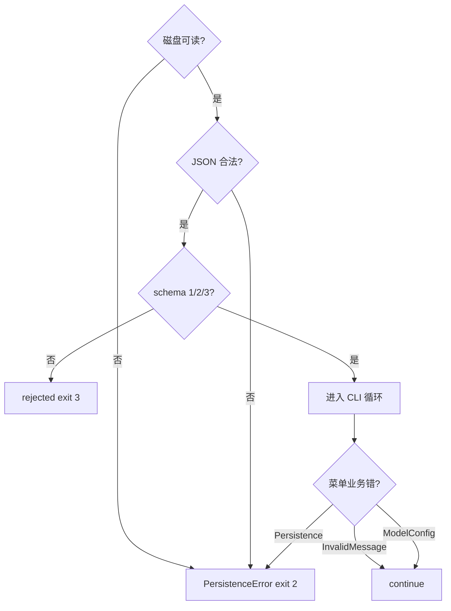

---

## 18. 模块边界评审

### 18.1 评审清单

| 项 | 通过标准 |
|---|---|
| 依赖方向 | 无向上 import |
| 单一职责 | 每层文件 < 200 行为宜 |
| 异常边界 | persistence 包装 JSON，platform 抛业务 |
| 公共 API | 包根 __all__ 明确 |
| 双入口 | main 与 -m 行为一致 |
| 测试 | 三门测试绿 |
| 数据隔离 | ZIP 无 JSON |

### 18.2 常见违规与修复

| 违规 | 修复 |
|---|---|
| domain import persistence | 上移逻辑到 platform |
| models 读 DATA_FILE | 常量下沉 constants，路径只 persistence/cli |
| cli 内 json.loads 文件 | 删，改 load_state |
| 到处 ValueError | 映射到 Nexus 子类 |

### 18.3 评审流程

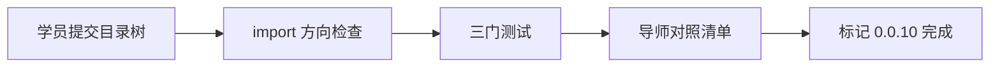

### 18.4 ADR 回顾问题

1. 为何不把 cli 合并进 platform？——UI 变化频率高于领域。
2. 为何 persistence 不返回 PlatformState OR raise？——schema rejected 是第三种状态。
3. 为何 requirements 空仍提交？——声明依赖基线，便于 diff。

---

## 19. 复盘与 Day 11

### 19.1 今日保持

- 五层包结构与依赖方向。
- NexusError 五类与 code 字段。
- exit 0/2/3 契约。
- Schema v3 与 Day 9 多态行为。
- 发布无运行数据、SHA256 门禁。

### 19.2 今日停止

- 在 domain 写 print 调试。
- bare except 吞异常。
- 新功能继续堆单文件。
- 把 API Key 写进 constants（永远禁止）。
- 跳过 venv 直接系统 Python 装包污染全局。

### 19.3 技术债与偿还计划

| 债务 | 偿还日 |
|---|---|
| 无类型注解 | Day 11 mypy |
| 无 pyproject editable | Day 11 |
| simulate 非真 HTTP | Day 12 requests |
| 无结构化 logging | Day 14 |
| max_tokens 边界 | Day 16 |

### 19.4 Day 11 预览

Day 11 **类型注解与静态检查**：为 Contact、PlatformState、load_state 返回值添加 TypedDict 与 Optional；引入 `mypy.ini`；讨论 `from __future__ import annotations`。包结构今日已定，明日只加“契约层”，不改行为。

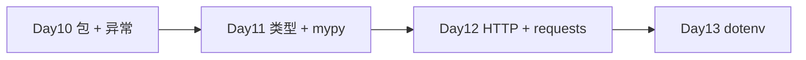

### 19.5 与课程主线连接

| 天 | 能力 |
|---|---|
| Day 8 | 领域对象 |
| Day 9 | 模型多态 |
| Day 10 | 包结构 + 异常 + venv |
| Day 11 | 类型系统 |
| Day 12 | HTTP 接入 |
| Day 25 | LangChain 集成 |

---

## 20. 模块划分工作坊（15 题）

| 编号 | 代码片段应放哪层 | 理由 |
|---|---|---|
| W01 | Contact.matches | domain/contact.py |
| W02 | create_model | models/factory.py |
| W03 | persist_change | persistence/storage.py |
| W04 | prompt_owner | cli/prompts.py |
| W05 | simulate_chat | platform/state.py |
| W06 | SCHEMA_VERSION | constants.py |
| W07 | run_cli 菜单循环 | cli/app.py |
| W08 | OpenAIModel.format_request | models/openai_model.py |
| W09 | json.loads 文件 | persistence/storage.py |
| W10 | InvalidMessageError | exceptions.py + platform 抛 |
| W11 | __all__ 导出 | nexus/__init__.py |
| W12 | DATA_FILE 路径 | constants.py |
| W13 | 切换模型 input | cli/prompts.py |
| W14 | from_dict 迁移 | platform/state.py |
| W15 | SystemExit 入口 | main.py / __main__.py |

讲师要点：先问“这段知识属于哪个 bounded context”，再定目录，而非“文件太长就切一刀”。

---

## 21. import 路径走查（20 组）

| 编号 | import 语句 | 结果 |
|---|---|---|
| I01 | from nexus.domain import Contact | 成功 |
| I02 | from nexus.models import create_model | 成功 |
| I03 | from nexus import PlatformState | 成功（包根导出） |
| I04 | import nexus.cli.app | 成功，不运行 CLI |
| I05 | from contact import Contact | 失败，无 PYTHONPATH 相对 |
| I06 | from nexus.persistence import load_state | 成功 |
| I07 | from nexus.exceptions import NexusError | 成功 |
| I08 | from nexus.platform.state import PlatformState | 成功，绕过 __init__ |
| I09 | import nexus | 成功，不自动 run_cli |
| I10 | from nexus.cli import run_cli | 成功 |
| I11 | domain 内 from nexus.cli | 设计违规，可能循环 |
| I12 | tests 无 path 插入 | ImportError |
| I13 | PYTHONPATH=solution | 全部课程 import 通过 |
| I14 | from nexus.models.base import BaseModel | 成功 |
| I15 | from nexus import __version__ | 0.0.10 |
| I16 | import nexus.models.openai_model | 成功 |
| I17 | from nexus.constants import DATA_FILE | nexus_platform.json |
| I18 | 重复 import nexus | 模块缓存，无二次执行 |
| I19 | from nexus.domain.message import ChatMessage | 成功 |
| I20 | from nexus.persistence.storage import save_state | 成功 |

---

## 22. 企业案例：从单体脚本到可安装包

某内部 Agent 平台 6000 行 `platform.py`，三人团队改同一文件，每周 merge 冲突。Tech Lead 按 NexusAI Day 10 模式拆包后：

- CR 可按 domain/models 分 reviewer。
- persistence 单测覆盖坏 JSON，无需 subprocess。
- 运维用 exit 3 监控 schema 漂移告警。

六周后接入 requests 仅改 models 与 requirements.txt，CLI 零改动。学员今日练的是可扩展架构，不是“整理文件夹”。

---

## 23. 代码阅读指引

推荐阅读顺序：

1. `nexus/exceptions.py` — 错误词汇表。
2. `nexus/constants.py` — 版本、路径、schema。
3. `domain/contact.py`, `domain/message.py` — 无 I/O 纯领域。
4. `models/base.py`, `models/factory.py` — Day 9 多态迁移。
5. `platform/state.py` — 聚合与迁移。
6. `persistence/storage.py` — 边界转换核心。
7. `cli/app.py` — exit code 落地。
8. `main.py`, `__main__.py` — 入口。

---

## 24. 持久化与迁移复习

Day 10 不改变 v3 字段，但 `from_dict` 仍在 platform。迁移流程与 Day 9 相同：

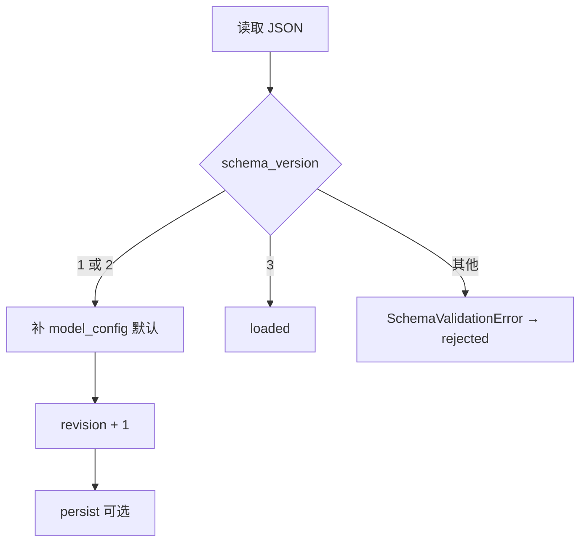

persist_change 始终 revision+=1 后 save_state；任何 OSError 包装 PersistenceError。

---

## 25. 虚拟环境故障排除

| 现象 | 原因 | 解决 |
|---|---|---|
| ImportError: nexus | 未 activate 或未 PYTHONPATH | export PYTHONPATH |
| python 指向 2.7 | 未用 venv | python3 -m venv |
| pip 装到系统 | 未 activate | source .venv/bin/activate |
| 测试通过 CLI 失败 | cwd 不同 | CLI 测试用临时目录 |
| ModuleNotFoundError requests | Day 10 无此依赖 | 等到 Day 12 |

---

## 26. 发布检查单（讲师用）

- [ ] ZIP 22 文件完整。
- [ ] SHA256 可复现。
- [ ] 解压后 PYTHONPATH 说明在 README。
- [ ] 冒烟含 simulate 与恢复。
- [ ] 打包机无 nexus_platform.json。
- [ ] 版本号 APP_VERSION=0.0.10 一致。

---

## 27. 教学质量门禁

| 指标 | 目标 |
|---|---:|
| 课件字符 | ≥30000 |
| Mermaid | ≥9 |
| 必备章节 | 全部 |
| 包五层 | 通过 |
| 异常五类 | 通过 |
| exit 0/2/3 | 通过 |
| 双入口 | 通过 |
| venv + requirements | 文档化 |
| 三门测试 | 通过 |
| Day1-9 回归 | 通过 |

---

## 28. 术语表

| 术语 | 含义 |
|---|---|
| module | 单个 .py 文件 |
| package | 含 __init__.py 的目录 |
| PYTHONPATH | 额外模块搜索路径 |
| venv | 隔离的 Python 环境 |
| requirements.txt | pip 依赖列表 |
| fail-closed | 出错时拒绝而非降级 |
| rejected | load_state 第三种状态 |
| ADR | 架构决策记录 |
| bounded context | 有边界的业务语境 |

---

## 29. 延伸阅读

- PEP 328 — 绝对 import 与相对 import
- PEP 420 — 命名空间包
- Python 文档：Tutorial § Modules, § Errors and Exceptions
- 《Clean Architecture》依赖规则与今日分层对照

---

## 30. 结语

Day 10 是 NexusAI 从“课程脚本”迈向“工程仓库”的转折点：**目录即架构，异常即契约，venv 即 reproducibility**。把 Day 9 的多态能力原封不动搬进包里，同时让运维读 exit code 就能行动——这是模块化的真正价值。明天 Day 11 用类型注解把这些契约写进签名，让错误在运行前就被 mypy 抓住。

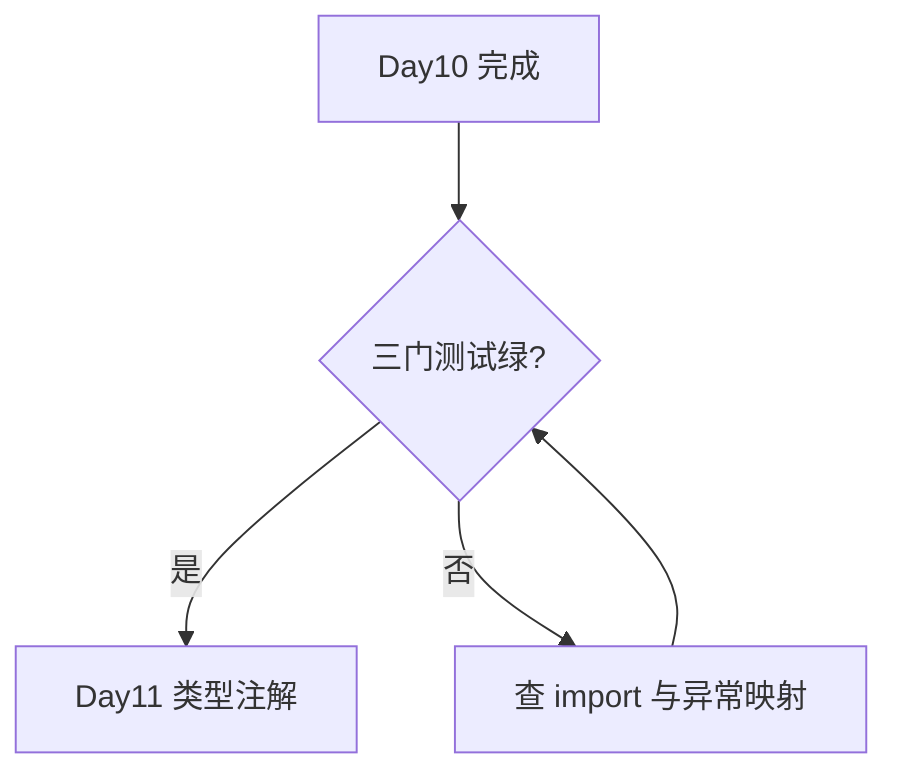

---

*文档版本：NexusAI 0.0.10｜Day 10 模块化包结构｜Schema v3｜stdlib-only requirements*
