# Day 11｜文件 I/O、pathlib 与语料索引：RAG 前置工程

> 阶段：Python 进阶·数据与检索基础  
> 项目版本：NexusAI 0.0.11  
> 需求：US-DOC-001  
> 交付：`nexus/documents/` 语料模块、Schema v4、菜单 10/11、关键词统计与片段检索  

---

## 0. 开场旁白

Day 10 把 NexusAI 拆成了可维护的五层包，异常与 exit code 让运维脚本能可靠集成 CLI。但企业 Agent 平台真正有价值的，往往不是“能聊几句”，而是**能读自家文档、在制度与 FAQ 里找答案**。Day 28 我们会用向量检索做完整 RAG；今天先打好地基：**批量读 txt/md/csv/json、统一 UTF-8、用 pathlib 发现文件、用 re 做关键词统计**。

想象周一早上，财务同事问：“报销截止日是哪天？”如果平台只能模拟对话、不能读 `policy.txt`，答案就是幻觉。真实产品里，语料导入是 RAG 流水线第一步：读文件 → 归一化文本 → 统计/索引 → 持久化 → CLI 可检索。NexusAI 0.0.11 在 Day 10 包结构上新增 `nexus/documents/`，把 loader、keywords、corpus 三层职责写清楚；Schema 从 v3 迁到 v4，增加 `document_index`；菜单 10 导入语料、菜单 11 检索语料；退出码仍保持 **0 正常、2 持久化、3 schema 拒绝**。

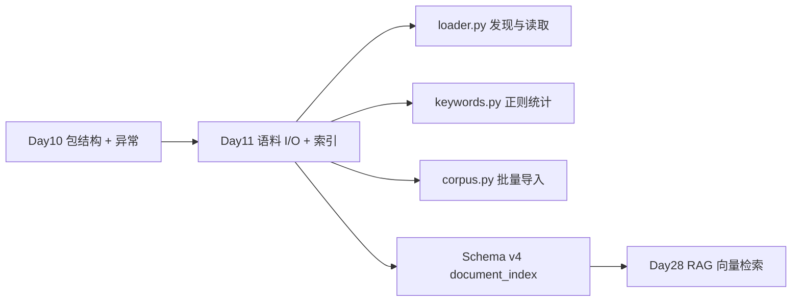

今天你会反复看到四个工程主题：**pathlib 与文件发现**、**UTF-8 与 with 上下文**、**正则关键词统计**、**语料模块设计**。它们不是孤立语法点，而是 Day 28 RAG 的前置能力：没有可靠的批量读盘与编码边界，后面的 chunk、embedding、检索全是空中楼阁。

---

## 1. 学习成果与完成定义

学员能够：

1. 使用 `with open(..., encoding="utf-8")` 读写 txt，并解释为何必须显式 UTF-8。
2. 用 `csv.reader` 与 `json.load` 读取结构化文件，并归一化为可检索纯文本。
3. 使用 `pathlib.Path` 的 `exists`、`is_dir`、`rglob` 递归发现语料，跳过隐藏文件。
4. 使用 `re.escape` + `re.compile(..., re.IGNORECASE)` 做中英文关键词计数与片段截取。
5. 使用 `datetime.now(timezone.utc).isoformat()` 记录 `last_ingested_at`。
6. 说明 `os`、`random` 在本日与后续课程中的定位（路径检查、抽样预览）。
7. 设计 `DocumentRecord`、`CorpusService.ingest_directory` 与 `document_index` 结构。
8. 解释 Schema v3→v4 迁移：旧 JSON 自动补空 `document_index`，revision+1。
9. 在 CLI 菜单 10/11 完成导入与检索，捕获 `DocumentLoadError` 不崩溃。
10. 运行 `test_documents.py`、`test_cli.py`、`test_release.py` 全绿。

完成定义：

- [ ] `nexus/documents/loader.py`、`keywords.py`、`corpus.py` 实现完整。
- [ ] `DocumentLoadError` 继承 `NexusError`，code=`DOCUMENT_LOAD`。
- [ ] fixtures 四文件（policy.txt、faq.md、contacts.csv、meta.json）导入后 documents=4。
- [ ] 关键词「报销」跨文件合计 ≥3 次（policy + csv + meta）。
- [ ] v3 JSON 启动迁移至 v4，含 `document_index`。
- [ ] CLI 菜单 10 目录不存在时提示 continue，不 exit。
- [ ] 发布 ZIP 含 documents 包，APP_VERSION=0.0.11。
- [ ] 课件不少于 30000 字符。

今日不做：向量 embedding（Day 28）；真实 HTTP 拉取文档（Day 12）；PDF/Word 解析（Day 22）；分词与 BM25（Day 26）。

---

## 2. 企业需求文档

### 2.1 用户故事

> 作为企业知识库管理员，我希望把制度 txt、FAQ md、联系人 csv、元数据 json 批量导入 NexusAI，并按关键词统计命中与检索，以便在接入大模型前先验证语料覆盖，并为 Day 28 RAG 提供可持久化的文档索引。

### 2.2 架构决策记录（ADR-011）

**背景**：Day 10 平台能管联系人、消息、模型，但无法回答“制度里报销截止日”。单文件脚本式 `open()` 散落各处会导致编码不一致、异常语义混乱、无法单测。

**决策**：

1. 新增 `nexus/documents/` 子包：`loader`（读盘）、`keywords`（re 统计）、`corpus`（批量导入与索引）。
2. 所有语料读操作统一 `encoding="utf-8"`，非 UTF-8 抛 `DocumentLoadError`。
3. CSV 全单元格拼接为空格分隔文本；JSON 优先提取 `content` 字符串字段。
4. `discover_documents` 用 `Path.rglob("*")`，后缀白名单 `.txt/.md/.csv/.json`，跳过 `.` 开头隐藏文件。
5. Schema v4 增加 `document_index`：`corpus_dir`、`documents[]`、`keyword_totals`、`last_ingested_at`。
6. v3 加载时 `migrated=True`，补空索引，revision+1 后 persist。
7. CLI 菜单 10 导入、11 检索；`DocumentLoadError` 在菜单内打印 message，continue，不映射新 exit code。

**后果**：

- 正面：RAG 前置数据管道清晰；loader/keywords 可单测；索引可持久化跨进程。
- 负面：大语料全量读入内存，Day 26 需流式与分块；当前 `_text_cache` 仅会话内有效，重启后检索依赖 `keyword_hits` 与重新 load 文件。

### 2.3 目录结构（Day 11 增量）

```
course/day11/solution/
├── main.py
├── requirements.txt          # 仍 stdlib-only
├── nexus/
│   ├── constants.py          # SCHEMA_VERSION=4, APP_VERSION=0.0.11
│   ├── exceptions.py         # + DocumentLoadError
│   ├── documents/            # ★ 本日新增
│   │   ├── __init__.py
│   │   ├── loader.py
│   │   ├── keywords.py
│   │   └── corpus.py
│   ├── platform/state.py     # ingest_corpus, search_corpus, statistics
│   └── cli/app.py            # 菜单 10/11
└── fixtures/corpus/          # 实验语料
    ├── policy.txt
    ├── faq.md
    ├── contacts.csv
    └── meta.json
```

### 2.4 Schema v4 示例

```json
{
  "schema_version": 4,
  "revision": 12,
  "owner": {
    "employee_id": "E110011",
    "department": "技术部"
  },
  "contacts": [],
  "messages": [],
  "model_config": {
    "provider": "qwen",
    "model_id": "qwen-plus",
    "temperature": 0.7,
    "max_tokens": 1024
  },
  "document_index": {
    "corpus_dir": "corpus",
    "documents": [
      {
        "doc_id": "D001",
        "filename": "policy.txt",
        "suffix": ".txt",
        "char_count": 128,
        "keyword_hits": {"报销": 3, "制度": 2}
      }
    ],
    "keyword_totals": {"报销": 5, "制度": 4, "Agent": 1},
    "last_ingested_at": "2026-07-16T02:00:00+00:00"
  }
}
```

### 2.5 异常与退出码（继承 Day 10）

| 异常类 | code | 典型场景 | CLI exit |
|---|---|---|---|
| DocumentLoadError | DOCUMENT_LOAD | 目录不存在、非 UTF-8、空关键词 | 菜单内 continue |
| PersistenceError | PERSISTENCE | 磁盘读写失败 | 2 |
| SchemaValidationError | SCHEMA_VALIDATION | schema_version 非 1~4 | 3（rejected） |
| InvalidMessageError | INVALID_MESSAGE | 非法 role | continue |
| ModelConfigError | MODEL_CONFIG | 模型参数非法 | continue |

**重要**：`DocumentLoadError` 是业务可恢复错误（用户输错路径、语料编码问题），不新增 exit 4；持久化与 schema 契约不变。

### 2.6 非功能需求

| 编号 | 要求 |
|---|---|
| NFR-D1 | loader 不得 import cli |
| NFR-D2 | 读文件必须 `with` + UTF-8 |
| NFR-D3 | re 统计必须 `re.escape` 防注入式 pattern |
| NFR-D4 | ingest 后 revision 通过 persist_change +1 |
| NFR-D5 | 双进程：进程 B 恢复后语料 documents 数量一致 |
| NFR-D6 | 发布物不含运行 JSON 与语料副本 |

---

## 3. 验收标准

### 3.1 Given-When-Then

**UTF-8 读取 policy.txt**

- Given `fixtures/corpus/policy.txt` 存在  
- When `load_document(path)`  
- Then 返回含「报销」「制度」的字符串，`char_count > 0`

**pathlib 发现四文件**

- Given `fixtures/corpus/`  
- When `discover_documents(corpus_dir)`  
- Then 返回 4 个 Path，含 policy.txt、faq.md、contacts.csv、meta.json

**批量导入**

- Given 关键词 `报销,制度,Agent`  
- When `state.ingest_corpus(fixtures, keywords)`  
- Then message 含「已导入 4 份语料」，`keyword_totals["报销"] >= 3`

**语料检索**

- Given 已导入索引  
- When `state.search_corpus("制度")`  
- Then 至少 1 条命中，按 hits 降序

**v3→v4 迁移**

- Given JSON `schema_version=3` 且无 document_index  
- When `load_state`  
- Then status=`migrated`，保存后 schema_version=4，含空 documents 列表

**非 UTF-8 拒绝**

- Given 文件内容为 `\xff\xfe` 二进制  
- When `load_document`  
- Then `DocumentLoadError`，message 含「不是 UTF-8」

**CLI 菜单 10 坏目录**

- Given 输入 `missing_dir`  
- When 菜单 10  
- Then 打印「语料目录不存在」，returncode=0，不 crash

**CLI 双进程**

- Given 进程 A 导入语料并退出  
- When 进程 B 启动菜单 11 检索  
- Then 「恢复成功」且「语料=4」

**Schema rejected 不变**

- Given `schema_version=99`  
- When 启动 CLI  
- Then exit 3，文件不覆盖

### 3.2 测试矩阵

| 层 | 文件 | 覆盖 |
|---|---|---|
| 模块 | test_documents.py | loader、keywords、corpus、迁移 |
| 集成 | test_cli.py | 菜单 10/11、双进程、迁移 stdout |
| 发布 | test_release.py | ZIP 清单、0.0.11 版本 |
| 回归 | verify_day01~10 | 历史天门禁 |

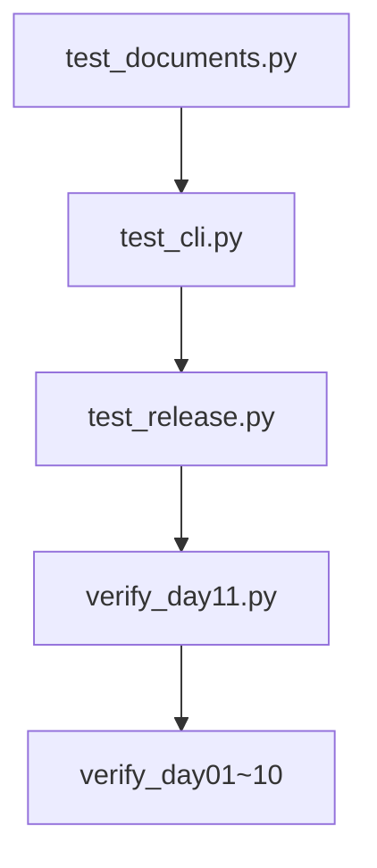

---

## 4. pathlib 与文件发现

### 4.1 为何用 pathlib 而非 os.path

`os.path.join`、`os.listdir` 在 Python 3.4+ 仍可用，但 **pathlib** 把路径当对象，链式调用更清晰：

```python
from pathlib import Path

root = Path("corpus")
for path in sorted(root.rglob("*")):
    if path.is_file() and not path.name.startswith("."):
        print(path.suffix.lower(), path.name)
```

对比 `os.walk`：rglob 写法更短，且 Path 与 open 直接兼容 `open(path, ...)`。

### 4.2 discover_documents 算法

1. `root = Path(corpus_dir)`  
2. 不存在 → `DocumentLoadError("语料目录不存在")`  
3. 非目录 → `DocumentLoadError("语料路径不是目录")`  
4. `sorted(root.rglob("*"))` 保证跨平台稳定顺序（D001、D002…）  
5. 过滤：`is_file()`、非隐藏、后缀在 `ALLOWED_SUFFIXES`

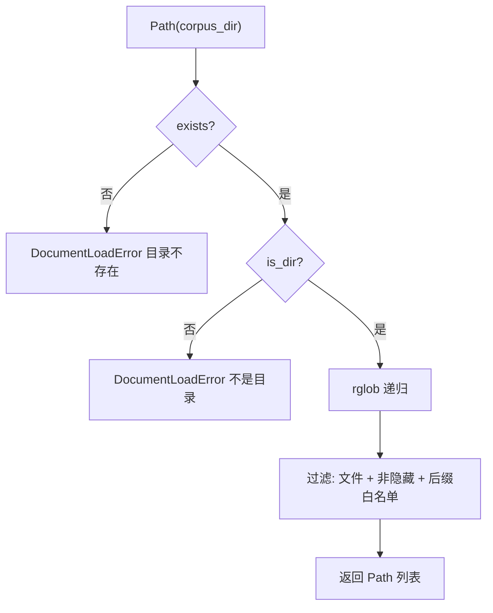

### 4.3 os 模块在本日的辅助角色

| os API | 用途 | 示例 |
|---|---|---|
| `os.environ` | 测试注入 PYTHONPATH | test_cli.py |
| `os.path.exists` | 可替代 Path.exists | 不推荐混用 |
| `os.getcwd()` | CLI cwd 与相对 corpus_dir | 菜单 10 默认 corpus |

**规范**：新代码统一 pathlib；测试里 `os.environ` 复制环境可保留。

### 4.4 相对路径与 corpus_dir 持久化

菜单 10 默认 `corpus` 是相对 **进程 cwd** 的路径。`ingest_directory` 把 `str(corpus_dir)` 写入 `document_index["corpus_dir"]`。进程 B 恢复时 `corpus_service()` 用 `Path(corpus_dir) / record.filename` 重建 `_text_cache`。

**陷阱**：进程 A 在 `/tmp/work/corpus` 导入，JSON 拷贝到别的工作目录但未拷贝 corpus 文件夹 → 检索只剩 keyword_hits，片段可能为空。实验环境应 `shutil.copytree(fixtures, working/corpus)`。

### 4.5 隐藏文件与后缀策略

- 跳过 `.gitkeep`、`.DS_Store`：`path.name.startswith(".")`  
- 不支持 `.pdf`、`.docx`：明确 `DocumentLoadError("不支持的文件类型")`  
- 大小写：`.suffix.lower()` 统一比较

### 4.6 pathlib 工作坊（8 题）

| 编号 | 操作 | 结果 |
|---|---|---|
| P01 | `Path("a/b") / "c.txt"` | POSIX: a/b/c.txt |
| P02 | `Path("corpus").exists()` | 取决于 cwd |
| P03 | `Path("x.md").suffix` | .md |
| P04 | `Path("X.TXT").suffix.lower()` | .txt |
| P05 | `.rglob("*.csv")` | 仅 csv，不递归其他后缀需 `*` |
| P06 | `sorted(paths)` | 稳定 doc_id 顺序 |
| P07 | `path.is_file()` 对目录 | False |
| P08 | `path.name` | 含扩展名的文件名 |

---

## 5. UTF-8 与 with 上下文

### 5.1 with 上下文管理器

文件句柄必须在用完后关闭，否则 Windows 上可能锁文件、泄漏 fd。`with` 保证异常时也能 `__exit__` 关闭：

```python
def read_text_file(path):
    try:
        with open(path, "r", encoding="utf-8") as handle:
            return handle.read()
    except OSError as error:
        raise DocumentLoadError(f"无法读取文件 {path.name}：{error}") from error
    except UnicodeDecodeError as error:
        raise DocumentLoadError(
            f"文件 {path.name} 不是 UTF-8 编码，请转换后再导入"
        ) from error
```

**教学点**：`from error` 保留异常链，日志里能看到原始 `UnicodeDecodeError`。

### 5.2 为何显式 encoding="utf-8"

Python 3 默认 locale 编码；Linux 容器常为 UTF-8，但 Windows 中文环境可能是 gbk。企业语料含中文制度文本，**不写 encoding 等于把正确性交给运气**。统一 UTF-8 是 NexusAI 与 Day 28 RAG 的硬约束。

### 5.3 CSV 的 newline=""

PEP 278：`open(..., newline="")` 让 csv 模块自己处理换行，避免 `\r\r\n` 双转义。读 csv 同样 UTF-8：

```python
with open(path, "r", encoding="utf-8", newline="") as handle:
    reader = csv.reader(handle)
    cells = [cell.strip() for row in reader for cell in row if cell.strip()]
return " ".join(cells)
```

contacts.csv 三行数据会变成「department topic note 财务部 报销 …」可检索串。

### 5.4 JSON 读取与 content 优先

```python
with open(path, "r", encoding="utf-8") as handle:
    payload = json.load(handle)
if isinstance(payload, dict) and isinstance(payload.get("content"), str):
    return payload["content"]
return json.dumps(payload, ensure_ascii=False)
```

meta.json 走 content 分支；复杂 JSON 退化为紧凑字符串仍可做关键词统计。

### 5.5 写入持久化（复习 Day 10）

`persist_change` 仍用 UTF-8 写 JSON：`ensure_ascii=False` 保留中文。语料文件本身本日只读；Day 12 可能写下载缓存。

### 5.6 编码故障对照表

| 现象 | 根因 | 处理 |
|---|---|---|
| UnicodeDecodeError | GBK 文件当 UTF-8 读 | iconv 转 UTF-8 或 DocumentLoadError |
| 空文件 | 合法，char_count=0 | 允许导入，hits 全 0 |
| BOM UTF-8 | 仍可读 | 可选 strip `\ufeff`（本日未强制） |
| 二进制误命名为 .txt | decode 失败 | DocumentLoadError |

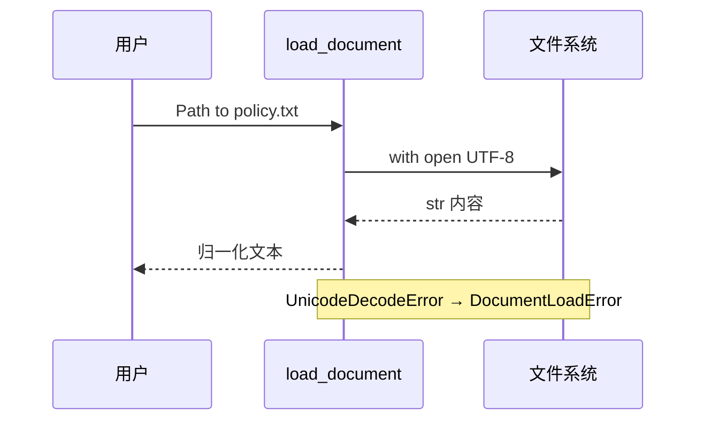

---

## 6. datetime、random 与标准库定位

### 6.1 datetime 记录 ingest 时间

```python
from datetime import datetime, timezone

self.document_index["last_ingested_at"] = (
    datetime.now(timezone.utc).replace(microsecond=0).isoformat()
)
```

使用 **UTC** 避免服务器时区差异；ISO 8601 字符串可直接写入 JSON。Day 28 审计「索引是否过期」会读该字段。

### 6.2 random 的后续用途（本日仅概念）

| 场景 | API | 日次 |
|---|---|---|
| 从语料随机抽 3 条做预览 | `random.sample(docs, k=3)` | Day 11 讨论 |
| 数据增强 shuffle | `random.shuffle` | Day 20 |
| 负样本采样 | `random.choice` | Day 28 |

本日 ingest 顺序用 `sorted(rglob)` 保 deterministic，**不用 random**，保证测试可重复。

### 6.3 re 模块预告

下一章展开 **正则关键词统计**；记住：关键词检索不是「写正则表达式」，而是「对用户输入 literal 做 escape 后当子串找」。

---

## 7. 正则关键词统计

### 7.1 为何 re.escape

用户关键词可能是 `C++`、`file.txt`、`(制度)`。若不 escape，括号会被当成 regex 分组。`re.escape(keyword)` 把 metacharacter 转义为 literal。

```python
import re

def count_keyword(text, keyword):
    pattern = re.compile(re.escape(keyword), flags=re.IGNORECASE)
    return len(pattern.findall(text))
```

### 7.2 IGNORECASE 与中英文

中文无大小写，英文 FAQ 里 “Agent” 与 “agent” 应同一命中。`re.IGNORECASE` 统一处理。

### 7.3 normalize_keywords

```python
def normalize_keywords(raw_keywords):
    if isinstance(raw_keywords, str):
        items = raw_keywords.split(",")
    else:
        items = list(raw_keywords)
    # 去空白、去重、保序
```

菜单 10 输入 `报销, 制度 ,报销` → `["报销", "制度"]`。

### 7.4 merge_keyword_totals

跨文件累加：`keyword_totals` 是 corpus 级汇总；每份 `DocumentRecord.keyword_hits` 是文件级。

### 7.5 search_snippets

```python
def search_snippets(text, keyword, limit=2, window=20):
    pattern = re.compile(re.escape(keyword), flags=re.IGNORECASE)
    for match in pattern.finditer(text):
        start = max(0, match.start() - window)
        end = min(len(text), match.end() + window)
        snippet = text[start:end].replace("\n", " ")
```

CLI 菜单 11 本日只打印 doc_id 与 hits；片段函数供 Day 12 扩展展示。

### 7.6 正则工作坊（10 题）

| 编号 | 输入 | 期望 |
|---|---|---|
| R01 | text="报销报销", kw="报销" | 2 |
| R02 | kw="制 度" vs text="制度" | 0（空格敏感） |
| R03 | re.escape("a.b") | a\.b |
| R04 | IGNORECASE "AGENT" in faq | ≥1 |
| R05 | 空关键词列表 ingest | DocumentLoadError |
| R06 | keyword="" search | [] |
| R07 | merge {a:1}+{a:2,b:1} | a:3,b:1 |
| R08 | finditer 超长文本 | 线性扫描 |
| R09 | 特殊字符 `(报销)` | escape 后 literal |
| R10 | top_keywords limit=2 | 按 count 降序 |


---

## 8. 语料模块设计

### 8.1 三层职责

| 模块 | 职责 | 不做什么 |
|---|---|---|
| loader.py | 发现、按后缀读、编码错误 | 不算关键词 |
| keywords.py | 纯函数统计、片段 | 不读盘 |
| corpus.py | 编排 ingest、DocumentRecord | 不 print |

### 8.2 DocumentRecord

```python
class DocumentRecord:
    def __init__(self, doc_id, filename, suffix, char_count, keyword_hits):
        ...
    def to_dict(self): ...
    @classmethod
    def from_dict(cls, data): ...
```

`doc_id` 格式 `D{index:03d}`，与导入顺序绑定。文件名存 basename，不存绝对路径，便于迁移工作目录。

### 8.3 CorpusService

```python
class CorpusService:
    def __init__(self, document_index):
        self.document_index = document_index
        self._text_cache = {}

    def ingest_directory(self, corpus_dir, keywords):
        ...
        return len(records), totals

    def search_keyword(self, keyword):
        ...
```

ingest 流程：discover → load_document → count_keywords → append record → merge totals → 写 UTC 时间戳。

### 8.4 PlatformState 集成

```python
def ingest_corpus(self, corpus_dir, keywords):
    service = CorpusService(self.document_index)
    count, totals = service.ingest_directory(corpus_dir, keywords)
    self.document_index = service.document_index
    return True, f"已导入 {count} 份语料｜关键词统计 {totals}"

def corpus_service(self):
    service = CorpusService(self.document_index)
    # 从磁盘预热 _text_cache
    ...
    return service
```

`statistics()` 增加 `documents` 与 `keyword_totals` 字段。

### 8.5 依赖图

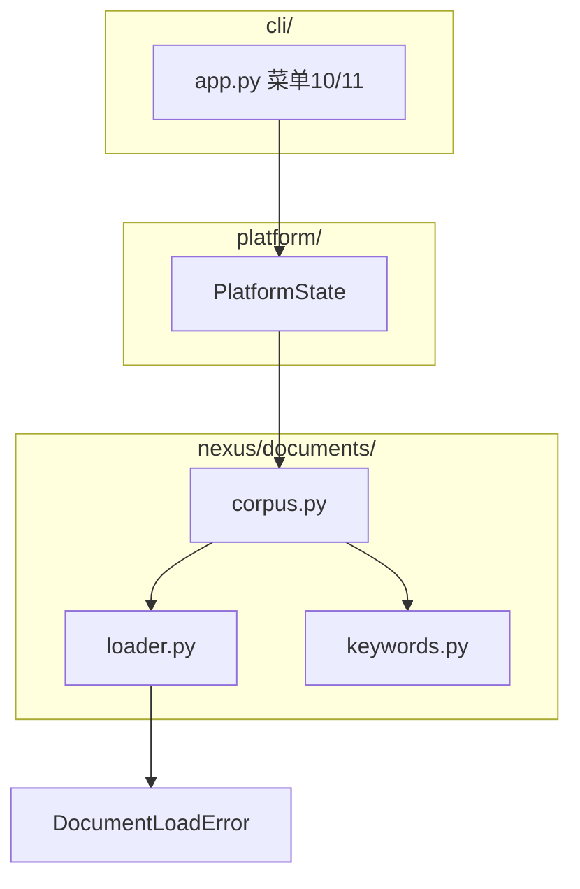

### 8.6 empty_document_index

```python
def empty_document_index(corpus_dir="corpus"):
    return {
        "corpus_dir": corpus_dir,
        "documents": [],
        "keyword_totals": {},
        "last_ingested_at": None,
    }
```

v3 迁移与全新 v4 共用该默认值。

### 8.7 与 Day 28 RAG 的接口预留

| 本日字段 | Day 28 演进 |
|---|---|
| documents[].char_count | chunk 切分依据 |
| keyword_hits | 混合检索 lexical 路 |
| _text_cache | 内存 chunk 源 |
| corpus_dir | 监视目录热更新 |
| last_ingested_at | 索引 freshness |

---

## 9. Schema 迁移

### 9.1 v3 → v4 差异

| 字段 | v3 | v4 |
|---|---|---|
| schema_version | 3 | 4 |
| document_index | 无 | 必填结构 |
| 行为 | loaded/migrated 至 3 | v3 文件 migrated 至 4 |

### 9.2 from_dict 逻辑

```python
version = data.get("schema_version")
if version not in (1, 2, 3, 4):
    raise SchemaValidationError("不支持的 schema_version")
migrated = version in (1, 2, 3)
document_index = data.get("document_index", empty_document_index(CORPUS_DIR))
if not isinstance(document_index.get("documents"), list):
    raise SchemaValidationError("document_index.documents 必须是列表")
```

v1/v2 仍先补 model_config（Day 10 逻辑），再到 v4；`migrated=True` 触发 persist revision+1。

### 9.3 迁移序列

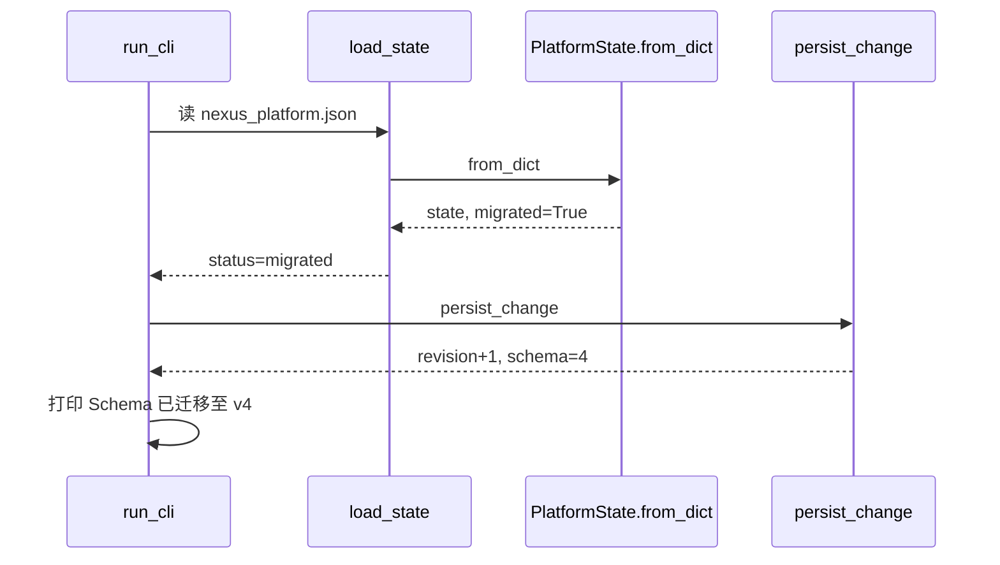

### 9.4 拒绝路径不变

- schema_version=99 → rejected，exit 3  
- document_index.documents 不是 list → SchemaValidationError  
- 坏 JSON → PersistenceError exit 2

### 9.5 迁移测试断言

```python
v3 = {"schema_version": 3, "revision": 8, ...}
migrated, needs_migration = PlatformState.from_dict(v3)
assert needs_migration is True
assert migrated.to_dict()["schema_version"] == 4
assert "document_index" in migrated.to_dict()
```

---

## 10. 课堂实操

### 10.1 环境准备（15 分钟）

```bash
cd course/day11/solution
python3 -m venv .venv
source .venv/bin/activate
export PYTHONPATH=.
python3 ../tests/test_documents.py
```

### 10.2 实操场景（35+）

| 编号 | 场景 | 操作 | 期望 |
|---|---|---|---|
| W01 | 读 policy.txt | load_document | 含「出差」「报销」 |
| W02 | 读 faq.md | load_document | 含 markdown 标题 |
| W03 | 读 contacts.csv | load_csv_as_text | 单元格拼接 |
| W04 | 读 meta.json | load_json_as_text | content 字段 |
| W05 | discover 四文件 | discover_documents | len=4 |
| W06 | 空目录 ingest | 空文件夹 | DocumentLoadError 无可导入 |
| W07 | 关键词统计 | count_keywords | totals 字典 |
| W08 | ingest fixtures | ingest_corpus | 4 份语料 |
| W09 | 检索「报销」 | search_corpus | 多文件命中 |
| W10 | 检索「不存在词」 | search_corpus | 空列表 |
| W11 | CLI 菜单 10 | 导入 corpus | revision+1 |
| W12 | CLI 菜单 11 | 检索制度 | 语料命中 |
| W13 | 菜单 6 统计 | statistics | documents:4 |
| W14 | 菜单 7 摘要 | schema=4 | documents=4 |
| W15 | v3 迁移启动 | 旧 JSON | Schema 已迁移至 v4 |
| W16 | 双进程恢复 | 第二次启动 | 语料=4 |
| W17 | 非 UTF-8 文件 | bad.txt | DocumentLoadError |
| W18 | 不支持 .pdf | 改后缀 | 不支持的文件类型 |
| W19 | 空关键词 | ingest "" | 至少提供一个关键词 |
| W20 | 隐藏文件 | .secret.txt | discover 跳过 |
| W21 | normalize 去重 | 报销,报销 | 单条报销 |
| W22 | merge totals | 两文件 | 累加正确 |
| W23 | top_keywords | limit=3 | 降序 |
| W24 | snippets | search_snippets | 窗口文本 |
| W25 | persist 后 JSON | 打开文件 | document_index 完整 |
| W26 | missing_dir CLI | 菜单10 | 语料目录不存在 |
| W27 | schema 99 | 启动 | exit 3 |
| W28 | 坏 JSON | `{bad` | exit 2 |
| W29 | 菜单 0 退出 | exit 0 | 安全退出 |
| W30 | python -m nexus | 双入口 | 同 main.py |
| W31 | datetime ISO | last_ingested_at | 含 +00:00 |
| W32 | doc_id 顺序 | sorted rglob | D001..D004 |
| W33 | char_count | policy | len(text) |
| W34 | keyword_hits  per file | 单文件统计 | 与 totals 一致 |
| W35 | corpus_service 缓存 | 重启后 search | 仍靠 hits+reload |
| W36 | shutil.copytree | CLI 测试 | corpus 随 cwd |
| W37 | APP_VERSION | 启动 banner | 0.0.11 |
| W38 | DocumentLoadError.code | 捕获 | DOCUMENT_LOAD |

### 10.3 讲师巡场检查清单

- [ ] 是否所有 open 都写了 encoding=utf-8  
- [ ] csv 是否 newline=""  
- [ ] re 是否 escape  
- [ ] ingest 是否更新 document_index 引用  
- [ ] CLI 是否 catch DocumentLoadError continue  
- [ ] 迁移后 schema_version 是否 4  

### 10.4 分组练习

- **A 组**：loader + pathlib（W01~W06）  
- **B 组**：keywords + corpus（W07~W10）  
- **C 组**：CLI + 迁移（W11~W20）  

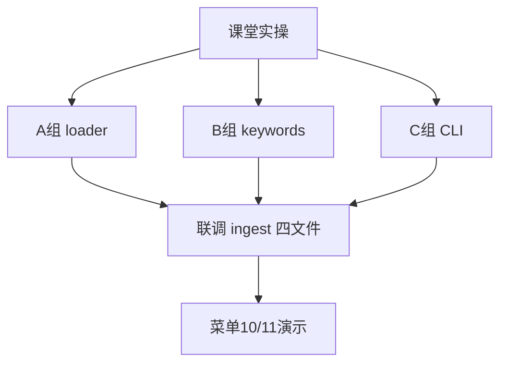

---

## 11. 单元测试策略

### 11.1 test_documents.py 结构

1. **纯函数**：normalize_keywords、count_keyword、discover len  
2. **文件读**：fixtures 四类型  
3. **集成**：PlatformState.ingest_corpus + search_corpus  
4. **迁移**：from_dict v3、load_state migrated、persist revision  
5. **异常**：非 UTF-8、空关键词、schema 99  

### 11.2 断言要点

```python
assert state.document_index["keyword_totals"]["报销"] >= 3
assert len(state.document_index["documents"]) == 4
assert saved["schema_version"] == 4
assert error.code == "DOCUMENT_LOAD"
```

### 11.3 测试隔离

- 使用 `tempfile.TemporaryDirectory`  
- 不写 solution 目录下 nexus_platform.json  
- sys.path 插入 SOLUTION  

### 11.4 mock 边界

本日**不 mock** 文件系统，fixtures 即集成测试。Day 26 可对 embedding API mock。

### 11.5 覆盖率目标

| 模块 | 目标 |
|---|---|
| loader.py | 全分支 |
| keywords.py | 100% |
| corpus.py | ingest + search |
| state.py | ingest_corpus 新增行 |


---

## 12. CLI 全链路

### 12.1 启动 banner

```
智枢 NexusAI 0.0.11｜语料导入与关键词统计
```

恢复行增加语料计数：`语料={len(document_index.documents)}`。

### 12.2 菜单 10 导入语料

```python
elif choice == "10":
    corpus_dir = input("语料目录（默认 corpus）：").strip() or "corpus"
    keywords = input("关键词（逗号分隔）：").strip()
    try:
        changed, message = state.ingest_corpus(corpus_dir, keywords)
    except DocumentLoadError as error:
        print(error.message)
        continue
    if changed:
        corpus_path = Path(corpus_dir)
        corpus_path.mkdir(parents=True, exist_ok=True)
        revision = persist_change(state, data_file)
        print(f"{message}｜revision={revision}。")
```

注意：`mkdir` 在成功 ingest 后执行，避免坏路径也创建目录。

### 12.3 菜单 11 语料检索

```python
elif choice == "11":
    keyword = input("检索关键词：").strip()
    if keyword == "":
        print("关键词不能为空。")
        continue
    matched = state.search_corpus(keyword)
    print(f"语料命中：{len(matched)} 份。")
    for record, hits in matched:
        print(f"{record.doc_id}｜{record.filename}｜命中={hits}")
```

### 12.4 CLI 序列图

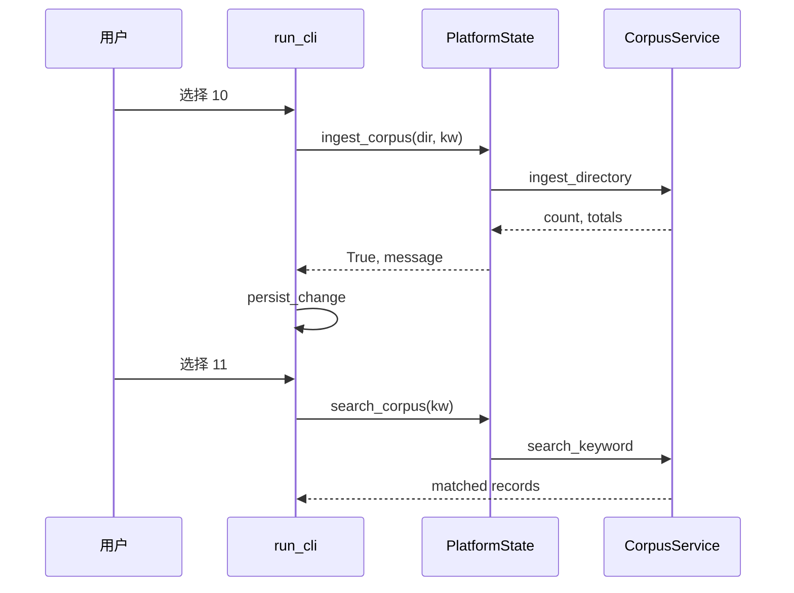

### 12.5 test_cli 输入脚本

```python
"\n".join([
    "E110011", "研发部",
    f"10\n{corpus}\n报销,制度,Agent",
    "11\n报销",
    "6", "7", "0",
])
```

### 12.6 exit code 回归

| 场景 | exit |
|---|---|
| 正常 0 退出 | 0 |
| JSON 损坏 | 2 |
| schema 99 | 3 |
| 语料目录不存在 | 0（continue 后退出） |

---

## 13. 发布部署

### 13.1 build_release.py

- 版本 0.0.11  
- ZIP 含 `nexus/documents/` 四文件  
- 不含 nexus_platform.json、不含 corpus 运行数据  
- SHA256 门禁  

### 13.2 部署冒烟

1. 解压 ZIP  
2. `PYTHONPATH=. python3 main.py`  
3. 复制 fixtures 到 corpus  
4. 菜单 10 导入 → 11 检索 → 0 退出  

### 13.3 与 Day 10 发布差异

| 项 | Day 10 | Day 11 |
|---|---|---|
| APP_VERSION | 0.0.10 | 0.0.11 |
| 新增包 | — | documents/ |
| Schema | v3 | v4 |
| 文件数 | 22+ | +4 documents |

### 13.4 发布检查单

- [ ] documents __init__ 导出 CorpusService  
- [ ] constants SCHEMA_VERSION=4  
- [ ] test_release 版本字符串  
- [ ] ZIP 无 __pycache__  


---

## 14. 安全与工程边界

### 14.1 路径遍历

本日 corpus_dir 由用户输入，**未做** `resolve()` 限制在 chroot 内。生产系统应：

- 禁止 `..` 逃逸  
- 白名单根目录  
- 记录 audit log  

教学环境仅在临时目录实验。

### 14.2 正则 DoS

使用 `re.escape` 后 pattern 为 literal，避免 catastrophic backtracking。仍勿对用户开放 raw regex。

### 14.3 大文件内存

ingest 全量 `read()` 进内存；GB 级语料需 Day 26 流式。DocumentLoadError 可扩展「文件过大」。

### 14.4 敏感语料

corpus 可能含员工邮箱（contacts.csv）。持久化 JSON 的 keyword_hits 不存原文，但磁盘 corpus 仍明文。Day 18 讨论加密 at rest。

### 14.5 编码攻击

非 UTF-8 拒绝写入索引，防止脏数据进入 Day 28 embedding 管道。

### 14.6 fail-closed 继承

schema 非法仍 exit 3；语料错误在菜单内 fail-closed（不部分导入坏文件以外的 silent skip——当前任一路径失败整次 ingest 抛错）。

---

## 15. 课后作业

### 15.1 基础题（必做）

1. 手写 `read_text_file`，含 UTF-8 与 DocumentLoadError。  
2. 对 `fixtures/corpus` 运行 discover，列出四文件 suffix。  
3. 统计「制度」在四个文件中的总命中，与 `keyword_totals` 对照。  
4. 绘制 v3 JSON 迁移前后 document_index 差异（文字即可）。  
5. 解释为何 csv 要 `newline=""`。  

### 15.2 进阶题（选做）

1. 扩展 loader 支持 `.rst`，更新 ALLOWED_SUFFIXES 与测试。  
2. 菜单 11 打印 `search_snippets` 首条片段。  
3. 写脚本对比 `os.walk` 与 `rglob` 性能（1000 小文件）。  
4. ingest 前用 `random.sample` 预览 2 个将读的文件名（仅打印）。  
5. 读 ADR-011，写三条「若不做 re.escape 的风险」。  

### 15.3 项目题（挑战）

实现「增量 ingest」：仅当文件 mtime 新于 last_ingested_at 时重读。提示：`Path.stat().st_mtime` 与 datetime 比较。

---

## 16. 作业完整参考答案

### 16.1 基础题 1

```python
from pathlib import Path
from nexus.exceptions import DocumentLoadError

def read_text_file(path):
    try:
        with open(path, "r", encoding="utf-8") as handle:
            return handle.read()
    except OSError as error:
        raise DocumentLoadError(f"无法读取文件 {Path(path).name}：{error}") from error
    except UnicodeDecodeError as error:
        raise DocumentLoadError(
            f"文件 {Path(path).name} 不是 UTF-8 编码，请转换后再导入"
        ) from error
```

### 16.2 基础题 2

```
policy.txt  -> .txt
faq.md      -> .md
contacts.csv -> .csv
meta.json   -> .json
```

### 16.3 基础题 3

policy.txt 中「制度」至少 1 次；faq.md 有「制度」；contacts.csv 有「制度」列值；meta.json content 含「制度」。合计与 ingest 后 `keyword_totals["制度"]` 一致（参考值 ≥4，以实际运行 test_documents 为准）。

### 16.4 基础题 4

v3 无 document_index 键；迁移后 v4 含 `document_index: {corpus_dir, documents:[], keyword_totals:{}, last_ingested_at:null}`，直至菜单 10 导入才填充 documents。

### 16.5 基础题 5

csv 模块规范要求控制换行翻译；`newline=""` 防止 Windows 下 `\r\n` 被错误加倍，保证 row 解析正确。

### 16.6 进阶题 2 提示

在菜单 11 循环内：`text = service._text_cache.get(record.filename,"")`，`snippets = search_snippets(text, keyword, 1)`，打印 snippets[0] if snippets。

### 16.7 项目题思路

ingest 前读取 `last_ingested_at` 解析为 datetime；对每个 path `stat().st_mtime`；过滤出新文件；若无新文件可跳过或全量重扫——需在 ADR 中记录策略。

---

## 17. 讲师逐字稿

【开场 5 分钟】

“各位早上好，Day 11 我们解决企业 Agent 的第一性问题：平台能不能读自家文档？Day 10 的包还在，今天只加 `documents` 文件夹。请打开课件 **开场旁白**，记住 Day 28 RAG 不是魔法，是今天这种读盘、统计、索引的延长线。”

【pathlib 15 分钟】

“打开 loader.py，看 **pathlib 与文件发现**。`Path.rglob` 递归， `sorted` 保证 doc_id 稳定。提问：为什么要跳过点开头的文件？——因为 .git、.DS_Store 不是语料。”

【UTF-8 15 分钟】

“所有 `open` 必须 **UTF-8 与 with 上下文**。请学员闭卷写 read_text_file。强调 `with` 自动 close，强调 `UnicodeDecodeError` 转 DocumentLoadError，用户看得懂。”

【正则 20 分钟】

“**正则关键词统计**不是让学员写复杂 pattern，而是 `re.escape`。现场输入 `C++`，看不 escape 会怎样。再演示 IGNORECASE 找 Agent。”

【语料模块 20 分钟】

“读 **语料模块设计** 三层图。CorpusService 是编排者，loader 和 keywords 是工具。PlatformState.ingest_corpus 只有三行，但背后整管道。”

【Schema 10 分钟】

“**Schema 迁移** v3→v4，打开旧 JSON，启动 CLI，看「Schema 已迁移至 v4」。revision 为什么 +1？——因为 persist_change 每次写入都 bump。”

【课堂实操 60 分钟】

“按 **课堂实操** 表 W01 起做。A 组先做 loader，B 组 keywords，C 组 CLI。40 分钟时必须能菜单 10 导入 fixtures 四文件。”

【测试 10 分钟】

“跑 test_documents、test_cli。解释 **单元测试策略**：为什么不 mock 磁盘？——fixtures 就是小型真实语料库。”

【收尾 5 分钟】

“Day 12 我们接 HTTP 拉远程文档，loader 会多一种来源。Day 28 把今天 keyword_hits 升级成向量检索。今日门禁：三门测试绿，schema=4，documents=4。”

---

## 18. 语料路径覆盖实验室

学员追踪以下 **40 场景**，写出异常类型、document_index 变化、revision 是否 +1：

| 编号 | 场景 | 期望 |
|---|---|---|
| L01 | fixtures 四文件 discover | 4 paths |
| L02 | 空 corpus 目录 | DocumentLoadError 无可导入 |
| L03 | corpus_dir 是文件 | DocumentLoadError 不是目录 |
| L04 | policy.txt UTF-8 读 | 成功 |
| L05 | bad.txt 二进制 | DocumentLoadError UTF-8 |
| L06 | .hidden.md | discover 跳过 |
| L07 | 仅 .txt 后缀白名单 | .pdf 拒绝 |
| L08 | ingest 报销,制度,Agent | totals 非空 |
| L09 | 重复 ingest 同目录 | 覆盖 documents 列表 |
| L10 | search 命中排序 | hits 降序 |
| L11 | search 无命中 | [] |
| L12 | 空关键词 ingest | DocumentLoadError |
| L13 | CLI 10 missing_dir | message continue |
| L14 | CLI 11 空关键词 | 提示 continue |
| L15 | v3 无 document_index | migrated v4 |
| L16 | v4 合法 loaded | 不迁移 |
| L17 | schema 99 | exit 3 |
| L18 | 坏 JSON | exit 2 |
| L19 | ingest 后 persist | revision+1 |
| L20 | 双进程语料=4 | 恢复成功 |
| L21 | statistics documents | 整数 |
| L22 | last_ingested_at 格式 | ISO UTC |
| L23 | doc_id D001 | 第一个 sorted 文件 |
| L24 | csv 拼接空格 | 可检索 |
| L25 | json content 优先 | meta 走 content |
| L26 | json 无 content | dumps 字符串 |
| L27 | merge_keyword_totals | 累加 |
| L28 | normalize 逗号分隔 | 去重 |
| L29 | re.escape 括号 | literal |
| L30 | IGNORECASE | 英文命中 |
| L31 | char_count | len text |
| L32 | keyword_hits 单文件 | 字典 |
| L33 | corpus_service 预热缓存 | path.exists |
| L34 | 菜单 7 schema=4 | stdout |
| L35 | APP_VERSION 0.0.11 | banner |
| L36 | DocumentLoadError.code | DOCUMENT_LOAD |
| L37 | ingest 后 mkdir corpus | 目录存在 |
| L38 | 迁移 persist 失败 | exit 2 |
| L39 | PYTHONPATH 缺失 | ImportError |
| L40 | python -m nexus | 同 main |

### 18.1 决策树

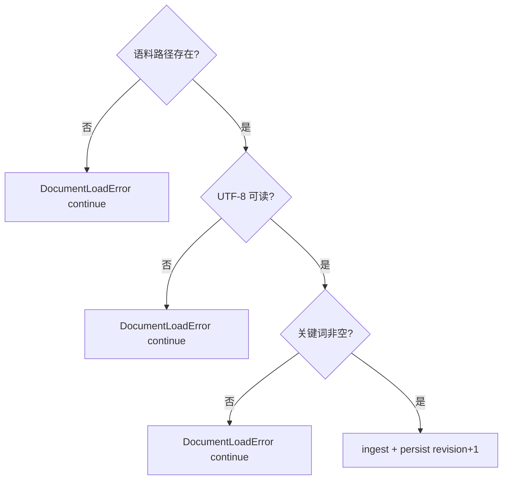

### 18.2 分组

- A 组 L01~L15：路径与编码  
- B 组 L16~L30：索引与正则  
- C 组 L31~L40：CLI 与迁移  

---

## 19. RAG 前置评审

### 19.1 评审问题清单

| # | 问题 | 通过标准 |
|---|---|---|
| 1 | 语料是否统一 UTF-8？ | 全部 loader 显式 encoding |
| 2 | 发现策略是否确定序？ | sorted rglob |
| 3 | 错误是否可分类？ | DocumentLoadError + code |
| 4 | 索引是否持久化？ | document_index 写入 JSON |
| 5 | 检索是否可复现？ | keyword_hits 跨进程 |
| 6 | 是否 re.escape？ | 是 |
| 7 | 大文件策略？ | 已知限制，ADR 记录 |
| 8 | 与 Day 28 接口？ | documents + corpus_dir |

### 19.2 RAG 流水线占位

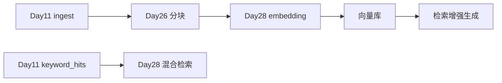

### 19.3 技术债

| 债务 | 偿还日 |
|---|---|
| 全量内存 read | Day 26 streaming |
| 无 chunk | Day 26 |
| 无 embedding | Day 28 |
| 无 snippet CLI | Day 12 可选 |
| 路径无 chroot | Day 18 安全章 |

### 19.4 评审结论模板

“语料路径覆盖实验室 L01~L40 通过；**RAG 前置评审** 8 项中 7 项通过，大文件限制已登记 Day 26。”

---

## 20. 复盘与 Day 12

### 20.1 今日保持

- Day 10 五层包与 exit 0/2/3。  
- 新增 documents 三层，不污染 domain。  
- UTF-8 + with 统一读盘。  
- re.escape 关键词 literal 匹配。  
- Schema v4 document_index 与 v3 迁移。  
- fixtures 四文件 golden path。  

### 20.2 今日停止

- 在 loader 里 print 调试（应用 logging，Day 14）。  
- 不用 encoding 读中文文件。  
- 让用户输入 raw regex。  
- 把语料绝对路径写进 JSON（只存 basename + corpus_dir）。  
- 跳过 test_documents 直接演示 CLI。  

### 20.3 Day 12 预览

Day 12 在 `models/` 接入 **requests** HTTP：从 URL 拉取文本，复用 loader 归一化思路；domain 与 cli 仍不大改。语料来源从「仅本地目录」扩展到「本地 + 远程」。


### 20.4 与课程主线

| 天 | 能力 |
|---|---|
| Day 10 | 包结构 + 异常 |
| Day 11 | 文件 I/O + 语料索引 |
| Day 12 | HTTP + requests |
| Day 26 | 分块 + BM25 |
| Day 28 | RAG 向量检索 |

### 20.5 结语

Day 11 让 NexusAI 首次「看得见企业文档」：**pathlib 发现、UTF-8 读取、正则统计、持久化索引**，是 Day 28 RAG 的真实前置。把四门测试跑绿，你就完成了从聊天玩具到知识库原型的关键一步。

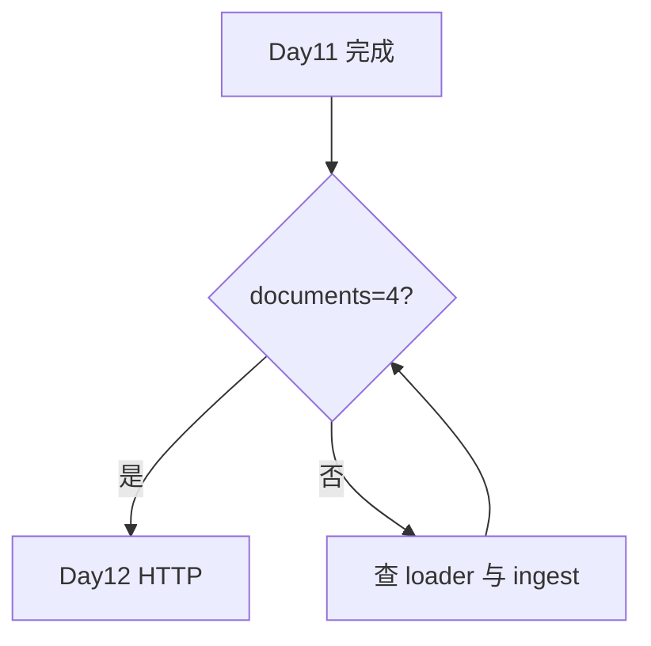

---

## 21. fixtures 语料说明

### 21.1 policy.txt

企业报销制度摘要，含「报销」「制度」「出差」等词，char_count 约 100+。

### 21.2 faq.md

Markdown FAQ，含「制度」「报销」「Agent」「NexusAI」。

### 21.3 contacts.csv

三行 CSV：财务部/报销、技术部/制度、产品部/Agent。

### 21.4 meta.json

`content` 字段故意含「制度」「报销」各两次，验证 JSON 提取分支。

---

## 22. 代码阅读顺序

1. `exceptions.py` — DocumentLoadError  
2. `documents/loader.py` — 读盘入口  
3. `documents/keywords.py` — 纯函数  
4. `documents/corpus.py` — ingest 编排  
5. `platform/state.py` — ingest_corpus / search_corpus  
6. `cli/app.py` — 菜单 10/11  
7. `tests/test_documents.py` — 断言范本  

---

## 23. 术语表

| 术语 | 含义 |
|---|---|
| corpus | 语料库，多文件集合 |
| document_index | Schema v4 语料索引根 |
| ingest | 批量导入并统计 |
| literal match | escape 后的子串匹配 |
| rglob | pathlib 递归 glob |
| migrated | 加载时发生 schema 升级 |
| RAG | Retrieval-Augmented Generation |

---

## 24. 教学质量门禁

| 指标 | 目标 |
|---|---:|
| 课件字符 | ≥30000 |
| Mermaid | ≥9 |
| 必备章节 | 全部 |
| documents 三层 | 通过 |
| Schema v4 | 通过 |
| 菜单 10/11 | 通过 |
| exit 0/2/3 不变 | 通过 |
| 三门测试 | 通过 |

---

## 25. 延伸阅读

- Python 文档：pathlib、csv、json、re  
- PEP 597 — UTF-8 mode 讨论  
- 《Designing Data-Intensive Applications》批处理 vs 流式（Day 26 预告）  

---

*课件版本：Day 11｜NexusAI 0.0.11｜字符数与 Mermaid 数以构建脚本验收为准*
