# Day 12｜HTTP 基础、requests 与首次 LLM API 调用

> 阶段：Python 进阶·网络与 AI 集成  
> 项目版本：NexusAI 0.0.12  
> 需求：US-API-001  
> 交付：`nexus/http/` 客户端、`BaseModel.invoke_api`、菜单 12 API对话、Mock HTTP 服务器  

---

## 0. 开场旁白

Day 11 让 NexusAI 能读本地语料、做关键词索引，为 Day 28 RAG 铺好了「读盘」地基。但企业 Agent 真正上线时，**大脑不在你的硬盘里，而在云端大模型 API 后面**。从「本地模拟字符串拼接」到「发 HTTP POST、收 JSON、解析 assistant 回复」，是今天的主线跨越。

想象周五下午，产品总监问：“菜单 9 的模拟对话能演示流程，但客户要看**真实 Qwen/OpenAI 回复**。密钥放哪？超时怎么办？401 怎么提示？” Day 12 的 NexusAI 0.0.12 给出工程答案：新增 `nexus/http/` 封装 `requests`；`BaseModel.invoke_api` 走 Chat Completions 兼容路径；环境变量 `NEXUS_API_KEY` / `NEXUS_API_BASE_URL` 管凭证；`NEXUS_USE_MOCK=1` 或菜单 9 的 `force_mock` 保留离线演示；菜单 **12API对话** 走真实 HTTP（或 Mock 服务器）；**Schema 仍为 v4，API Key 永不写入 JSON**；退出码继承 Day 10：**0 正常、2 持久化、3 schema 拒绝**——不因网络失败新增 exit 4。

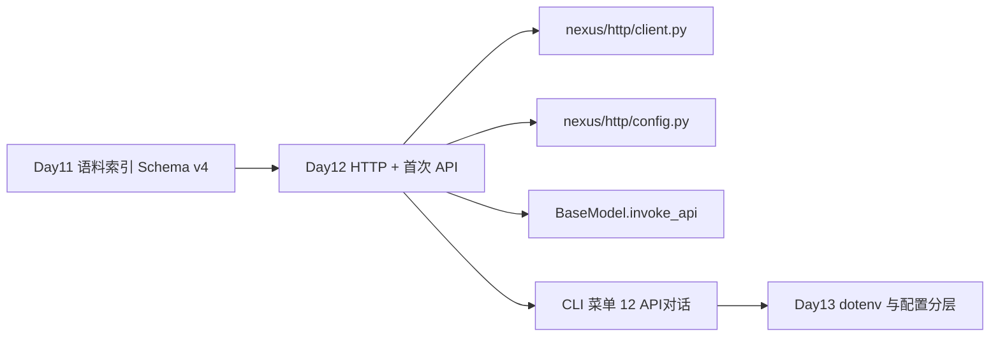

今天你会反复看到六个工程主题：**HTTP 协议要点**（GET/POST、状态码、头、体）、**requests 封装**（超时、异常映射）、**API Key 与环境变量**（不进 JSON）、**Chat Completions 请求**（messages 数组）、**响应解析**（choices[0].message.content）、**Mock 测试策略**（本地 ThreadingHTTPServer）。它们不是孤立语法点，而是把 NexusAI 从「教学玩具」推进到「可对接 DashScope/OpenAI 兼容网关」的最小可用集成。

---

## 1. 学习成果与完成定义

学员能够：

1. 解释 HTTP 请求四要素：方法、URL、Headers、Body；区分 GET 与 POST 的典型用途。
2. 列举常见状态码：200 成功、400 客户端错误、401 未授权、429 限流、500 服务端错误。
3. 使用 `requests.post(..., json=..., timeout=...)` 发送 JSON，并说明 `json=` 与手动 `dumps` 的差异。
4. 阅读 `nexus/http/client.py` 中 `post_json`、`build_bearer_headers`、`ApiCallError` 的职责边界。
5. 配置 `NEXUS_API_KEY`、`NEXUS_API_BASE_URL`、`NEXUS_USE_MOCK`，并说明为何 Key 不进 `nexus_platform.json`。
6. 构造 OpenAI / Qwen DashScope **兼容模式** 的 Chat Completions 请求体：`model`、`messages`、`temperature`、`max_tokens`。
7. 从响应 JSON 提取 `choices[0]["message"]["content"]`，并处理结构缺失时的 `ApiCallError`。
8. 对比菜单 9（`force_mock=True`）与菜单 12（真实 HTTP 或 Mock 服务器）的行为差异。
9. 启动 `tests/mock_api.py` 本地服务器，在单测与 CLI 中指向 `NEXUS_API_BASE_URL`。
10. 运行 `test_api.py`、`test_cli.py`、`test_release.py` 全绿；确认 `requirements.txt` 含 `requests>=2.31.0`。

完成定义：

- [ ] `nexus/http/client.py`、`config.py` 实现完整，`ApiCallError` code=`API_CALL`。
- [ ] `BaseModel.invoke_api`、`__call__` 分支清晰：mock / 真实 HTTP。
- [ ] `PlatformState.api_chat` 持久化 assistant 消息，revision+1。
- [ ] CLI 菜单 12 无 Key 且非 Mock 时提示 continue，不 crash。
- [ ] Mock 服务器返回 OpenAI 兼容 JSON，单测不访问公网。
- [ ] Schema v4 的 `model_config` 仍无 `api_key` 字段。
- [ ] 发布 ZIP 含 `nexus/http/`，APP_VERSION=0.0.12。
- [ ] 课件不少于 30000 字符。

今日不做：流式 SSE（Day 19）；重试与指数退避（Day 15）；python-dotenv 文件加载（Day 13）；Function Calling（Day 24）；多模态图片（Day 30）。

---

## 2. 企业需求文档

### 2.1 用户故事

> 作为企业 AI 平台工程师，我希望 NexusAI 通过标准 HTTP 调用通义千问 DashScope OpenAI 兼容接口（或 OpenAI 本身），在 CLI 菜单 12 完成真实问答并持久化消息，同时保留菜单 9 离线模拟与 Mock 服务器单测能力，以便在无公网环境的 CI 中验证全链路且不泄露密钥。

### 2.2 架构决策记录（ADR-012）

**背景**：Day 09~11 的 `BaseModel.__call__` 仅 `simulate_response`，无法对接生产 API。 scattered `requests.post` 会导致超时、401、JSON 解析错误语义不一致；若把 api_key 写入 JSON，Git 泄漏即资金损失。

**决策**：

1. 新增 `nexus/http/` 子包：`client.py`（post_json、build_bearer_headers）、`config.py`（环境变量解析）。
2. `BaseModel.invoke_api` 统一 POST `{base}/v1/chat/completions`（或 base 已含 `/v1` 时拼接 `/chat/completions`）。
3. 凭证只来自参数或环境变量 `NEXUS_API_KEY`；`resolve_base_url` 支持 `NEXUS_API_BASE_URL` 覆盖，默认 OpenAI 与 Qwen 兼容 URL。
4. `use_mock_mode()` 读 `NEXUS_USE_MOCK`；`__call__(force_mock=True)` 供菜单 9；二者任一为真则不走 HTTP。
5. 网络/HTTP/JSON 错误统一 `ApiCallError`；CLI 菜单内打印 message 后 continue，**不新增 exit code**。
6. 测试用 `tests/mock_api.py` ThreadingHTTPServer，返回标准 choices 结构；单测与 CLI 测试注入 base URL。
7. `requirements.txt` 首次引入第三方依赖 `requests>=2.31.0`；Schema **保持 v4**，不在 `model_config` 增加密钥字段。

**后果**：

- 正面：HTTP 边界清晰；OpenAI/Qwen 共用一套 messages 格式；CI 零公网；密钥与持久化分离。
- 负面：暂无自动重试；超时固定 30s；流式响应未支持；Mock 与真实 API 行为差异需在 Day 15 对齐。

### 2.3 目录结构（Day 12 增量）

```
course/day12/solution/
├── main.py
├── requirements.txt          # ★ requests>=2.31.0
├── nexus/
│   ├── constants.py          # APP_VERSION=0.0.12
│   ├── exceptions.py         # + ApiCallError
│   ├── http/                 # ★ 本日新增
│   │   ├── __init__.py
│   │   ├── client.py         # post_json, build_bearer_headers
│   │   └── config.py         # NEXUS_API_KEY, NEXUS_USE_MOCK
│   ├── models/
│   │   ├── base.py           # invoke_api, extract_assistant_content
│   │   ├── openai_model.py
│   │   └── qwen_model.py
│   ├── platform/state.py     # api_chat
│   └── cli/app.py            # 菜单 12 API对话
├── starter/api_client.py     # 课堂起步 POST 草稿
└── tests/
    ├── mock_api.py           # Mock Chat Completions 服务器
    ├── test_api.py
    ├── test_cli.py
    └── test_release.py
```

### 2.4 Schema v4 与 model_config（密钥缺席）

```json
{
  "schema_version": 4,
  "revision": 18,
  "owner": {
    "employee_id": "E120012",
    "department": "技术部"
  },
  "contacts": [],
  "messages": [
    {"role": "user", "content": "报销流程？"},
    {"role": "assistant", "content": "请参考制度第三章…"}
  ],
  "model_config": {
    "provider": "qwen",
    "model_id": "qwen-plus",
    "temperature": 0.7,
    "max_tokens": 1024
  },
  "document_index": {
    "corpus_dir": "corpus",
    "documents": [],
    "keyword_totals": {},
    "last_ingested_at": null
  }
}
```

**硬性规则**：`model_config` 中**不得**出现 `api_key`、`secret`、`token` 等字段。运维在部署环境注入 `NEXUS_API_KEY`；开发演示可 `export NEXUS_USE_MOCK=1`。

### 2.5 异常与退出码（继承 Day 10/11）

| 异常类 | code | 典型场景 | CLI exit |
|---|---|---|---|
| ApiCallError | API_CALL | 缺 Key、超时、HTTP≥400、JSON 非法、响应结构缺失 | 菜单内 continue |
| DocumentLoadError | DOCUMENT_LOAD | 语料错误 | 菜单内 continue |
| PersistenceError | PERSISTENCE | 磁盘读写失败 | 2 |
| SchemaValidationError | SCHEMA_VALIDATION | schema_version 非 1~4 | 3（rejected） |
| InvalidMessageError | INVALID_MESSAGE | 非法 role | continue |
| ModelConfigError | MODEL_CONFIG | 模型参数非法 | continue |

**重要**：`ApiCallError` 是可恢复业务错误（网络抖动、Key 未配），用户可重试或切 Mock；持久化与 schema 契约不变，仍为 **0 / 2 / 3**。

### 2.6 非功能需求

| 编号 | 要求 |
|---|---|
| NFR-H1 | http 包不得 import cli |
| NFR-H2 | post_json 必须设置 timeout 默认 30s |
| NFR-H3 | HTTP≥400 时错误信息含 status 与 body 前 300 字符 |
| NFR-H4 | api_chat 成功后 revision 通过 persist_change +1 |
| NFR-H5 | 单测默认走 Mock 服务器，禁止硬编码真实 Key |
| NFR-H6 | 发布物 ZIP 含 requirements.txt 且声明 requests |

---

## 3. 验收标准

### 3.1 Given-When-Then

**post_json 成功 200**

- Given Mock 服务器运行于 `127.0.0.1:随机端口`  
- When `post_json(f"{base}/chat/completions", headers, payload)`  
- Then 返回 dict 且含 `choices` 键

**invoke_api 解析 assistant**

- Given `NEXUS_API_KEY=test-key` 且 base 指向 Mock  
- When `OpenAIModel("gpt-4o-mini").invoke_api([{"role":"user","content":"制度"}])`  
- Then 返回字符串含 `HTTP mock 回复`

**缺 Key 失败**

- Given 环境无 `NEXUS_API_KEY` 且 `force_mock=False`  
- When `invoke_api(...)`  
- Then `ApiCallError`，message 含「缺少 API Key」

**菜单 12 持久化**

- Given CLI 已配置 Key 与 Mock base  
- When 菜单 12 输入「API 对话测试」  
- Then stdout 含 `HTTP mock 回复`，JSON messages 新增 assistant，revision+1

**菜单 9 仍模拟**

- Given 任意环境  
- When 菜单 9 输入「模拟对话测试」  
- Then stdout 含 `[qwen] 模拟回复`，不发 HTTP

**无 Key CLI 提示**

- Given 无 `NEXUS_API_KEY` 且未设 `NEXUS_USE_MOCK`  
- When 菜单 12  
- Then 打印「未设置 NEXUS_API_KEY」，returncode=0

**Schema 拒绝不变**

- Given `schema_version=99`  
- When 启动 CLI  
- Then exit 3，文件不覆盖

**双进程 API 消息恢复**

- Given 进程 A 菜单 12 成功并退出  
- When 进程 B 菜单 5 查看历史  
- Then 「恢复成功」且 messages 含 API 对话

### 3.2 测试矩阵

| 层 | 文件 | 覆盖 |
|---|---|---|
| HTTP | test_api.py | post_json、invoke_api、缺 Key、Mock |
| 集成 | test_cli.py | 菜单 12/9、双进程、无 Key 提示 |
| 发布 | test_release.py | ZIP 含 http/、0.0.12、部署冒烟 |
| 回归 | verify_day01~11 | 历史天门禁 |

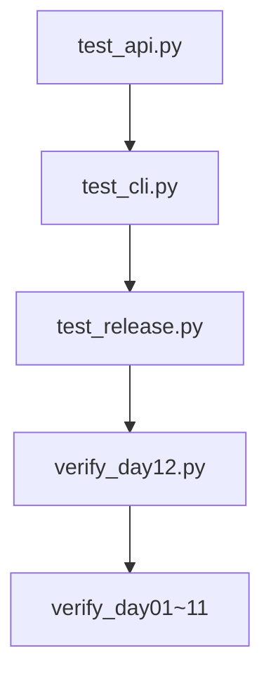

---

## 4. HTTP 协议要点

### 4.1 请求-响应模型

HTTP（HyperText Transfer Protocol）是客户端与服务器之间的**应用层**协议。一次交互包含：

1. **请求行**：方法 + 路径 + 协议版本，例如 `POST /v1/chat/completions HTTP/1.1`
2. **请求头**：键值对元数据，如 `Authorization`、`Content-Type`
3. **请求体**（可选）：POST/PUT 常带 JSON 或表单
4. **响应行**：状态码 + 原因短语，如 `HTTP/1.1 200 OK`
5. **响应头**：如 `Content-Type: application/json`
6. **响应体**：JSON 文本、HTML、二进制等

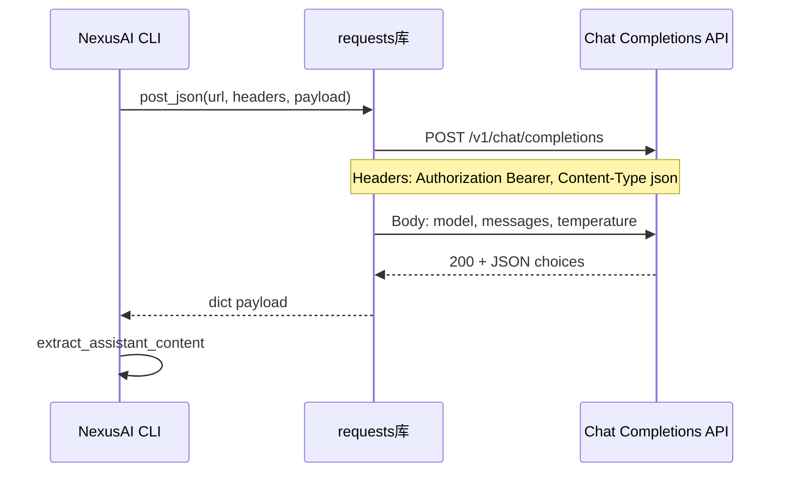

### 4.2 GET 与 POST

| 方法 | 语义 | 典型用途 | Body | 本日 |
|---|---|---|---|---|
| GET | 安全、幂等，取资源 | 下载文档、健康检查 | 通常无 | Day 12 扩展语料拉取用 |
| POST | 提交数据，可能改状态 | Chat Completions | JSON | **invoke_api 核心** |
| PUT/PATCH | 更新资源 | 配置中心 | JSON | 本日不涉及 |
| DELETE | 删除资源 | 撤销密钥 | 无 | 本日不涉及 |

Chat Completions **必须用 POST**：messages 可能很长，且服务端要分配算力生成回复，不符合 GET 语义。

### 4.3 状态码速查

| 码 | 含义 | NexusAI 处理 |
|---|---|---|
| 200 | OK | `response.json()` 解析 |
| 400 | Bad Request | ApiCallError 含 body 片段 |
| 401 | Unauthorized | Key 错误或过期 |
| 403 | Forbidden | 权限/地域限制 |
| 404 | Not Found | base URL 或 path 配错 |
| 429 | Too Many Requests | 限流，Day 15 加重试 |
| 500 | Internal Server Error | 供应商故障 |
| 502/503 | 网关/过载 | 临时不可用 |

`post_json` 将 **status_code >= 400** 一律视为失败，抛出 `ApiCallError`，避免把错误 HTML 当 JSON 解析。

### 4.4 常见请求头

| Header | 示例 | 作用 |
|---|---|---|
| Authorization | Bearer sk-xxx | 身份凭证，OpenAI 兼容标准 |
| Content-Type | application/json | 声明 body 为 JSON |
| User-Agent | NexusAI/0.0.12 | 识别客户端（可选） |
| Accept | application/json | 期望响应格式 |

`build_bearer_headers(api_key)` 封装 Authorization 与 Content-Type，避免每个调用点拼字符串出错。

### 4.5 URL 组成

```
https://dashscope.aliyuncs.com/compatible-mode/v1/chat/completions
└─┬─┘ └──────────────┬──────────────┘ └─┬─┘ └───────┬────────┘
  scheme            host              port        path
```

`BaseModel.chat_url(base_url)` 规则：

- 若 `base_url` 已以 `/v1` 结尾 → `{base}{CHAT_PATH}`，即 `.../v1/chat/completions`
- 否则 → `{base}/v1/chat/completions`

Mock 服务器返回 `http://127.0.0.1:端口/v1`，与生产一致。

### 4.6 HTTP 工作坊（10 题）

| 编号 | 问题 | 答案要点 |
|---|---|---|
| H01 | Chat 为何用 POST 不用 GET？ |  body 大、非幂等、语义为「提交生成任务」 |
| H02 | 401 最可能原因？ | Key 缺失/错误/过期 |
| H03 | Content-Type 缺失会怎样？ | 服务端可能无法解析 JSON |
| H04 | HTTPS 与 HTTP 区别？ | TLS 加密传输，生产必须 HTTPS |
| H05 | 超时发生在哪一层？ | requests 客户端等待响应上限 |
| H06 | 200 但 body 非 JSON？ | post_json 抛 ApiCallError |
| H07 | Bearer 前缀含义？ | OAuth2 令牌类型，后接 Key |
| H08 | Keep-Alive 谁管？ | requests/urllib3 连接池 |
| H09 | 429 业务应对？ | 退避重试、降并发（Day 15） |
| H10 | path 多写 /v1 会怎样？ | 404，需 chat_url 规范化 |

### 4.7 curl 对照（讲师演示）

```bash
export NEXUS_API_KEY="sk-demo"
export NEXUS_API_BASE_URL="https://dashscope.aliyuncs.com/compatible-mode/v1"

curl -sS -X POST "${NEXUS_API_BASE_URL}/chat/completions" \
  -H "Authorization: Bearer ${NEXUS_API_KEY}" \
  -H "Content-Type: application/json" \
  -d '{
    "model": "qwen-plus",
    "messages": [{"role": "user", "content": "你好"}],
    "temperature": 0.7,
    "max_tokens": 256
  }'
```

学员用 curl 打通后再看 Python `requests` 等价代码，降低「黑盒 API」恐惧。

---

## 5. requests 封装

### 5.1 为何引入 requests

标准库 `urllib.request` 可发 HTTP，但 API 冗长、HTTPS 证书、超时、JSON 需手动处理。`requests` 是事实上的 Python HTTP 客户端：

```python
import requests

response = requests.post(
    url,
    headers=headers,
    json=payload,      # 自动 dumps + Content-Type
    timeout=30,        # 连接+读取总超时
)
response.status_code
response.json()
response.text
```

Day 12 起 `requirements.txt` 不再 stdlib-only，部署需 `pip install -r requirements.txt`。

### 5.2 post_json 完整语义

```python
def post_json(url, headers, payload, timeout=DEFAULT_TIMEOUT):
    try:
        response = requests.post(
            url, headers=headers, json=payload, timeout=timeout,
        )
    except requests.Timeout as error:
        raise ApiCallError(f"请求超时（>{timeout}s）：{url}") from error
    except requests.RequestException as error:
        raise ApiCallError(f"网络请求失败：{error}") from error
    if response.status_code >= 400:
        snippet = response.text[:300].replace("\n", " ")
        raise ApiCallError(
            f"HTTP {response.status_code}：{snippet or '无响应体'}"
        )
    try:
        return response.json()
    except ValueError as error:
        raise ApiCallError(f"响应不是合法 JSON：{error}") from error
```

设计要点：

1. **窄入口**：模型层只调 `post_json`，不散落 `requests.post`。
2. **异常链**：`from error` 保留 Timeout 原始类型，便于日志。
3. **fail-closed**：4xx/5xx 不尝试「猜测」assistant 内容。
4. **snippet 限长**：避免把巨大 HTML 错误页打进 message。

### 5.3 build_bearer_headers

```python
def build_bearer_headers(api_key):
    return {
        "Authorization": f"Bearer {api_key}",
        "Content-Type": "application/json",
    }
```

OpenAI 与 DashScope 兼容模式均认 `Bearer {key}`。切勿把 Key 放进 URL query（会进 access log）。

### 5.4 错误映射流程

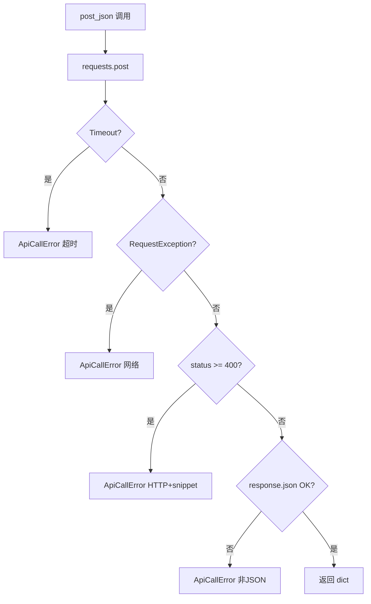

### 5.5 starter/api_client.py 课堂起点

`starter/api_client.py` 留 TODO：import requests、post、捕获 Timeout。学员先在此文件手写一遍，再对照 `nexus/http/client.py` 生产版。

### 5.6 requests 工作坊（8 题）

| 编号 | 操作 | 说明 |
|---|---|---|
| R01 | `json=` vs `data=json.dumps()` | json= 自动设 Content-Type |
| R02 | timeout=30 | 秒，非毫秒 |
| R03 | response.raise_for_status() | 本项目中由 post_json 手动判断 |
| R04 | Session 复用连接 | Day 15 优化 |
| R05 | verify=False | 禁止生产关闭 SSL 验证 |
| R06 | proxies= | 企业内网代理 Day 18 |
| R07 | stream=True | Day 19 SSE 流式 |
| R08 | response.encoding | 非 JSON 文本响应才需 |

---

## 6. API Key 与环境变量

### 6.1 密钥不进 JSON 的三条理由

1. **Git 泄漏**：JSON 常进仓库或备份；Key 一旦 push 即轮换成本。
2. **权限分离**：开发读代码、运维管密钥，符合最小权限。
3. **环境差异**：dev/staging/prod 用不同 Key，不应写死在磁盘状态文件。

Schema v4 的 `model_config` 只存 **provider / model_id / temperature / max_tokens**——谁用哪个模型，不存「用什么钥匙」。

### 6.2 环境变量契约

| 变量 | 含义 | 示例 |
|---|---|---|
| NEXUS_API_KEY | Bearer 令牌 | sk-xxx 或 DashScope Key |
| NEXUS_API_BASE_URL | 覆盖默认 base | http://127.0.0.1:54321/v1 |
| NEXUS_USE_MOCK | 全局 Mock | 1 / true / yes / on |

```python
def use_mock_mode():
    value = os.environ.get("NEXUS_USE_MOCK", "").strip().lower()
    return value in ("1", "true", "yes", "on")

def resolve_api_key(explicit_key=None):
    return (explicit_key or os.environ.get("NEXUS_API_KEY", "")).strip()
```

### 6.3 resolve_base_url 优先级

1. 函数参数 `explicit_base`（测试注入 Mock URL）
2. 环境变量 `NEXUS_API_BASE_URL`
3. 默认：`qwen` → DashScope 兼容 URL；其他 → OpenAI 官方 URL

```python
DEFAULT_OPENAI_BASE = "https://api.openai.com/v1"
DEFAULT_QWEN_BASE = "https://dashscope.aliyuncs.com/compatible-mode/v1"
```

### 6.4 配置解析流程

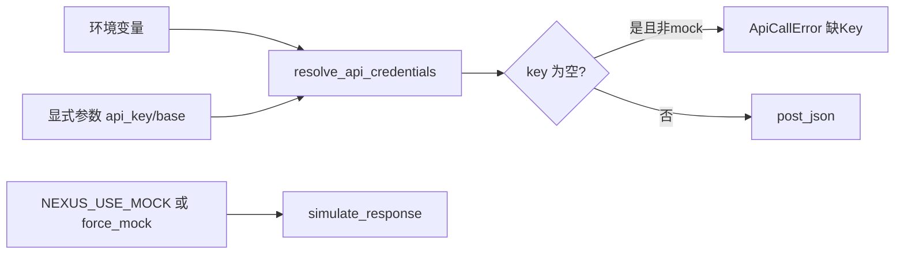

### 6.5 本地开发三种模式

| 模式 | 配置 | 用途 |
|---|---|---|
| 真实 API | NEXUS_API_KEY + 默认 base | 联调 Qwen/OpenAI |
| Mock 服务器 | Key 任意 + NEXUS_API_BASE_URL=Mock | 单测/CI |
| 纯模拟 | NEXUS_USE_MOCK=1 或菜单 9 | 无网络演示 |

### 6.6 .gitignore 与 pre-commit（安全预习）

即使 Key 不进 JSON，也要确保：

- `.env` 进 `.gitignore`（Day 13 dotenv）
- 禁止 `print(api_key)` 调试
- CI 用 Masked Variables 注入 Key

---

## 7. Chat Completions 请求

### 7.1 OpenAI 兼容 messages 格式

```json
{
  "model": "qwen-plus",
  "messages": [
    {"role": "system", "content": "你是企业助手"},
    {"role": "user", "content": "报销截止日？"},
    {"role": "assistant", "content": "每月25日"},
    {"role": "user", "content": "出差呢？"}
  ],
  "temperature": 0.7,
  "max_tokens": 1024
}
```

| role | 含义 |
|---|---|
| system | 系统指令，设定人设与边界 |
| user | 用户输入 |
| assistant | 历史模型回复，多轮对话必需 |

### 7.2 build_messages

```python
def build_messages(self, system_prompt, user_prompt, history=None):
    messages = []
    if system_prompt:
        messages.append({"role": "system", "content": system_prompt})
    if history:
        messages.extend(history)
    messages.append({"role": "user", "content": user_prompt})
    return messages
```

`PlatformState.api_chat` 将 `state.messages` 转为 dict 列表作为 history，实现**带平台记忆**的多轮 API 对话。

### 7.3 format_request 多态

OpenAI 与 Qwen 本日请求体相同（兼容模式刻意对齐）：

```python
def format_request(self, messages):
    return {
        "model": self.model_id,
        "messages": messages,
        "temperature": self.temperature,
        "max_tokens": self.max_tokens,
    }
```

差异在 **base URL 与 model_id 字符串**，不在 JSON 形状。

### 7.4 invoke_api 编排

```python
def invoke_api(self, messages, api_key=None, base_url=None):
    key, base = resolve_api_credentials(self.PROVIDER, api_key, base_url)
    if key == "":
        raise ApiCallError("缺少 API Key：请设置环境变量 NEXUS_API_KEY")
    body = self.format_request(messages)
    response_payload = post_json(
        self.chat_url(base),
        build_bearer_headers(key),
        body,
    )
    content = self.extract_assistant_content(response_payload)
    return self.parse_response(content)["content"]
```

### 7.5 __call__ 分支

```python
def __call__(self, messages, api_key=None, base_url=None, force_mock=False):
    if force_mock or use_mock_mode():
        return self.simulate_response(messages)
    return self.invoke_api(messages, api_key=api_key, base_url=base_url)
```

| 入口 | force_mock | NEXUS_USE_MOCK | 行为 |
|---|---|---|---|
| 菜单 9 simulate_chat | True | 任意 | 模拟 |
| 菜单 12 api_chat | False | 0 | HTTP |
| 单测 state.api_chat | False | 未设 | HTTP→Mock |
| 演示 | False | 1 | 模拟 |

### 7.6 请求构造序列图

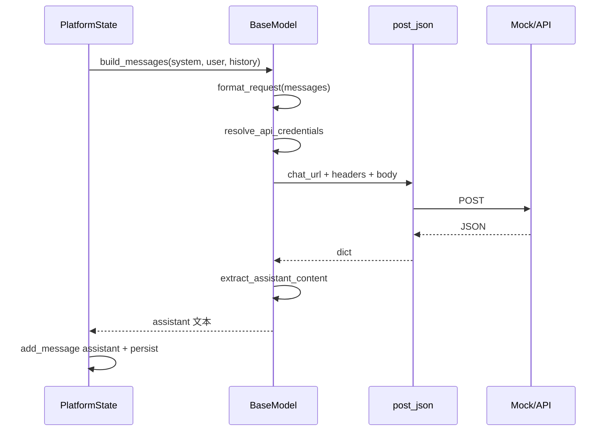

---

## 8. 响应解析

### 8.1 标准成功响应

```json
{
  "id": "chatcmpl-mock",
  "object": "chat.completion",
  "choices": [
    {
      "index": 0,
      "message": {
        "role": "assistant",
        "content": "报销请参照财务制度第三章。"
      },
      "finish_reason": "stop"
    }
  ],
  "usage": {
    "prompt_tokens": 42,
    "completion_tokens": 18,
    "total_tokens": 60
  }
}
```

NexusAI Day 12 **只提取 content**；`usage` 留 Day 16 计费监控。

### 8.2 extract_assistant_content

```python
def extract_assistant_content(self, payload):
    try:
        return payload["choices"][0]["message"]["content"].strip()
    except (KeyError, IndexError, TypeError) as error:
        raise ApiCallError(f"无法解析 API 响应结构：{payload}") from error
```

为何 strict：兼容接口若返回 error 包在 200 里（少数网关），或 choices 为空，应 fail-closed 而非返回空串误导用户。

### 8.3 parse_response 扩展点

```python
def parse_response(self, raw_text):
    return {"provider": self.PROVIDER, "content": raw_text.strip()}
```

子类可加 metadata：

- `OpenAIModel` → `api_style: chat.completions`
- `QwenModel` → `finish_reason: stop`

CLI 本日只打印 content 字符串；Day 17 可展示 token usage。

### 8.4 常见异常响应

| 情况 | 表现 | NexusAI |
|---|---|---|
| Key 错误 | HTTP 401 + JSON error | ApiCallError HTTP 401 |
| model 不存在 | HTTP 400 | snippet 含 model 字段提示 |
| 内容过滤 | finish_reason=content_filter | 仍可能有 content 或空 |
| 网关 HTML | 502 页面 | ApiCallError 非 JSON 或 HTTP 502 |

### 8.5 simulate_response 对比

```python
def simulate_response(self, messages):
    last_user = ""
    for item in reversed(messages):
        if item["role"] == "user":
            last_user = item["content"]
            break
    preview = last_user[:40] if last_user else "空输入"
    return f"[{self.PROVIDER}] 模拟回复：{preview}"
```

模拟路径**不解析 JSON**，便于离线；与 HTTP 路径输出格式不同，测试用断言区分。

### 8.6 响应解析工作坊（6 题）

| 编号 | payload 变化 | 期望 |
|---|---|---|
| P01 | choices 正常 | 提取 content |
| P02 | choices=[] | ApiCallError |
| P03 | message 无 content | ApiCallError 或空 strip |
| P04 | content 前后空白 | strip 后存储 |
| P05 | 200 但 error 字段 | 可能 KeyError→ApiCallError |
| P06 | Mock 回显 user 前30字 | 单测断言子串 |

---

## 9. Mock 测试策略

### 9.1 为何需要 Mock 服务器

- CI 环境**无公网**或**禁止真实 Key**
- 真实 API **慢、贵、不稳定**，不适合单元测试
- 需要确定性响应断言 `HTTP mock 回复`

`tests/mock_api.py` 用标准库 `ThreadingHTTPServer` 实现 OpenAI 兼容 POST handler，**零额外依赖**。

### 9.2 Mock handler 行为

```python
def do_POST(self):
    length = int(self.headers.get("Content-Length", 0))
    raw = self.rfile.read(length) if length else b"{}"
    payload = json.loads(raw.decode("utf-8"))
    # 取最后一条 user content 前 30 字回显
    body = {
        "choices": [{
            "message": {"role": "assistant", "content": f"{reply_text}｜{last_user[:30]}"},
            "finish_reason": "stop",
        }]
    }
    self.send_response(200)
    ...
```

### 9.3 启动与注入

```python
server, base_url = mock_api.start_mock_api_server()
os.environ["NEXUS_API_KEY"] = "test-key-day12"
os.environ["NEXUS_API_BASE_URL"] = base_url
os.environ.pop("NEXUS_USE_MOCK", None)
# 测试结束 server.shutdown()
```

`base_url` 形如 `http://127.0.0.1:45678/v1`，与 `chat_url` 拼接一致。

### 9.4 Mock 架构图

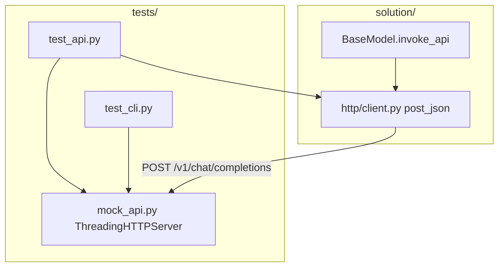

### 9.5 与 NEXUS_USE_MOCK 的区别

| 机制 | 层级 | 验证点 |
|---|---|---|
| Mock 服务器 | 真实 HTTP 栈 | post_json、headers、JSON 解析 |
| NEXUS_USE_MOCK | 跳过 HTTP | simulate_response 逻辑 |
| force_mock | 同左 | 菜单 9 专用 |

**推荐**：单测优先 Mock 服务器，覆盖 HTTP 层；仅测 simulate 时设 `NEXUS_USE_MOCK=1`。

### 9.6 test_api.py 断言清单

1. `build_bearer_headers` + `post_json` → choices 存在  
2. `OpenAIModel.invoke_api` → 含 `HTTP mock 回复`  
3. `QwenModel.invoke_api` → 回显 user 内容  
4. `state.api_chat` → changed 且 assistant 正确  
5. `NEXUS_USE_MOCK=1` → simulate 路径  
6. 无 Key → `ApiCallError` code=`API_CALL`

### 9.7 故障注入扩展（选做）

可在 Mock 增加 query 开关：`?status=500` 返回 500，供 Day 15 重试测试预留。

---

## 10. 课堂实操

### 10.1 环境准备（15 分钟）

```bash
cd course/day12/solution
python3 -m venv .venv
source .venv/bin/activate
pip install -r requirements.txt
export NEXUS_USE_MOCK=1   # 首轮无 Key 演示
python main.py
```

### 10.2 实操任务表

| 编号 | 任务 | 验收 |
|---|---|---|
| W01 | 阅读 `post_json` 画出异常分支 | 4 条 ApiCallError 路径 |
| W02 | starter 完成 `demo_post` 真实 requests | 打印 payload 或 Mock 响应 |
| W03 | export NEXUS_API_KEY + 启动 mock_api | curl/post_json 200 |
| W04 | OpenAIModel.format_request 打印 | 含 model/messages |
| W05 | 菜单 8 查看请求样例 | stdout 有 dict |
| W06 | 菜单 9 模拟对话 | `[qwen] 模拟回复` |
| W07 | 菜单 12 API 对话（Mock base） | `HTTP mock 回复` |
| W08 | 菜单 5 查看 messages | user+assistant 成对 |
| W09 | 双进程：A 退出 B 恢复 | revision、messages 一致 |
| W10 | 无 Key 菜单 12 | 提示 continue |
| W11 | 跑 test_api.py | 全断言绿 |
| W12 | 跑 test_cli.py | 含语料+API |
| W13 | 故意错 base URL | ApiCallError 网络或 HTTP |
| W14 | 菜单 10 导入 fixtures | 语料=4（复习 Day 11） |
| W15 | 菜单 7 摘要 | schema=4 |

### 10.3 结对编程角色

- **Driver**：写 `invoke_api` 调用链  
- **Navigator**：查 HTTP 状态码表、拼环境变量  
- 每 25 分钟互换  

### 10.4 演示脚本（讲师）

1. 终端 A：`python tests/mock_api.py` 或单测内嵌启动  
2. 终端 B：export Key 与 BASE，菜单 12 提问「报销流程」  
3. 展示 JSON 文件 messages 新增 assistant，强调 **无 api_key 字段**

### 10.5 常见卡点

| 现象 | 原因 | 解决 |
|---|---|---|
| ModuleNotFoundError: requests | 未 pip install | requirements.txt |
| 缺少 API Key | 未 export | Key 或 USE_MOCK |
| Connection refused | Mock 未启动或 port 错 | 对齐 BASE_URL |
| HTTP 404 | base 多/少 /v1 | chat_url 规则 |
| JSON 解析失败 | 代理返回 HTML | 查网络/URL |

---

## 11. 单元测试策略

### 11.1 测试金字塔（Day 12）

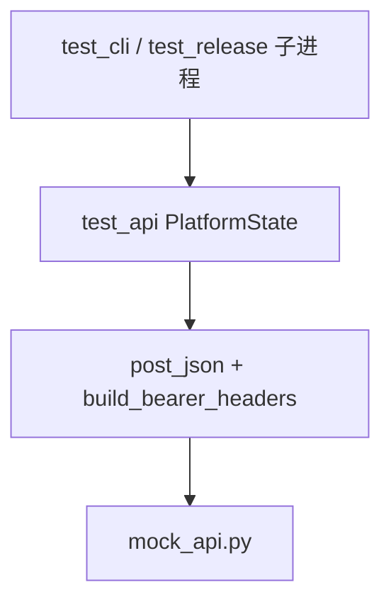

### 11.2 为何 subprocess 测 CLI

`test_cli.py` 用 `subprocess.run(main.py)` 验证：

- 真实 stdin/stdout 交互  
- PYTHONPATH 注入  
- 环境变量隔离（无 Key 场景 pop 变量）  
- returncode 仍为 0（业务错误不崩进程）

### 11.3 环境隔离模式

```python
env = {**os.environ, "PYTHONPATH": str(SOLUTION), "NEXUS_API_KEY": "cli-test-key"}
env.pop("NEXUS_USE_MOCK", None)
```

每个 `TemporaryDirectory` 独立工作区，避免 JSON 污染。

### 11.4 断言风格

- **包含断言**：`assert "HTTP mock 回复" in stdout`（允许前缀 banner）  
- **结构断言**：`assert "choices" in response`  
- **异常断言**：`pytest.raises` 或 try/except ApiCallError + code  

### 11.5 不 mock requests 的理由

Mock 服务器已站在 HTTP 边界；再 mock `requests.post` 会测不到 header/url 拼接。仅在网络单元测试极慢时才考虑 `responses` 库（本日不用）。

### 11.6 覆盖率目标

| 模块 | 目标 |
|---|---|
| http/client.py | 100% 分支 |
| http/config.py | use_mock 各真值 |
| models/base invoke | mock vs api |
| cli 菜单 12 | Key 检查 + 成功路径 |

---

## 12. CLI 全链路

### 12.1 菜单布局（0.0.12）

```
1新增联系人 2查看联系人 3搜索 4新增消息 5消息历史
6统计 7摘要 8模型信息 9模拟对话 10导入语料 11语料检索
12API对话 0退出
```

Banner：`智枢 NexusAI 0.0.12｜HTTP API 与首次模型调用`

### 12.2 菜单 12 代码路径

```python
elif choice == "12":
    user_prompt = input("API 用户问题：").strip()
    if user_prompt == "":
        print("用户问题不能为空。")
        continue
    if not use_mock_mode() and resolve_api_key() == "":
        print("未设置 NEXUS_API_KEY。可 export NEXUS_USE_MOCK=1 做本地演示。")
        continue
    try:
        changed, message, assistant_text = state.api_chat(user_prompt)
    except (InvalidMessageError, ApiCallError) as error:
        print(error.message)
        continue
    if changed:
        revision = persist_change(state, data_file)
        print(f"{message}｜revision={revision}。")
        print(f"assistant：{assistant_text}")
```

### 12.3 api_chat 与 simulate_chat

```python
def api_chat(self, user_prompt, system_prompt="你是企业助手", ...):
    history = [message.to_dict() for message in self.messages]
    model = self.active_model()
    request_messages = model.build_messages(system_prompt, user_prompt, history=history)
    assistant_text = model(request_messages, api_key=..., base_url=..., force_mock=False)
    changed, message = self.add_message("assistant", assistant_text)
    return changed, message, assistant_text

def simulate_chat(self, user_prompt, ...):
    ...
    assistant_text = model(request_messages, force_mock=True)
```

唯一关键差异：`force_mock` 默认值。

### 12.4 CLI 全链路图

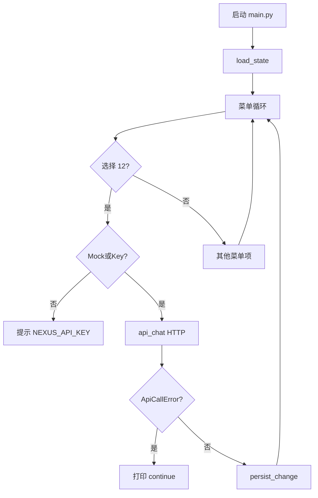

### 12.5 双进程叙事（test_cli 复现）

**进程 A**：维护人 → 语料导入 → 菜单 12 API → 菜单 9 模拟 → 摘要 → 退出  
**进程 B**：恢复 → 菜单 12 再次 API → 消息历史 → 退出  

验证：schema=4、messages 累积、API 与模拟内容可区分。

### 12.6 exit code 回归

| 场景 | exit |
|---|---|
| 正常 0 退出 | 0 |
| 坏 JSON / 写盘失败 | 2 |
| schema_version=99 | 3 |
| 菜单 12 ApiCallError | 0（continue 后选 0） |
| 菜单 12 无 Key | 0 |

---

## 13. 发布部署

### 13.1 build_release.py

Day 12 发布物命名：`nexus-api-platform-0.0.12.zip`，内含：

- `main.py`  
- `requirements.txt`（**requests>=2.31.0**）  
- 完整 `nexus/` 包含 `http/`  

### 13.2 部署步骤

```bash
unzip nexus-api-platform-0.0.12.zip
cd nexus-api-platform-0.0.12
pip install -r requirements.txt
export NEXUS_API_KEY="生产密钥"
export NEXUS_API_BASE_URL="https://dashscope.aliyuncs.com/compatible-mode/v1"
python main.py
```

### 13.3 test_release 冒烟

1. 构建 ZIP  
2. 解压到临时目录  
3. PYTHONPATH + Mock base + Key  
4. 子进程：新增消息 → 菜单 12 API → 退出  
5. 第二子进程：历史 + 摘要 → schema=4  

### 13.4 与 Day 11 发布差异

| 项 | Day 11 | Day 12 |
|---|---|---|
| APP_VERSION | 0.0.11 | 0.0.12 |
| 第三方依赖 | 无 | requests |
| 新增包 | documents/ | http/ |
| 菜单 | 10/11 | +12 API对话 |
| ZIP 名 | nexusai-0.0.11 | nexus-api-platform-0.0.12 |

### 13.5 发布检查单

- [ ] requirements.txt 含 requests>=2.31.0  
- [ ] http __init__ 可 import  
- [ ] constants APP_VERSION=0.0.12  
- [ ] test_release 版本字符串  
- [ ] ZIP 无 __pycache__、无真实 Key  

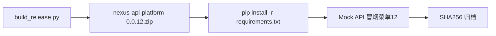

---

## 14. 安全与工程边界

### 14.1 密钥生命周期

| 阶段 | 做法 |
|---|---|
| 开发 | 个人 Key 放 shell profile，不进 repo |
| CI | Masked env + Mock 服务器 |
| 生产 | KMS/密钥管理服务（Day 40 预告） |
| 泄漏 | 立即轮换 Key，扫 Git 历史 |

**API Key NEVER in JSON** 写进 Code Review 检查项。

### 14.2 日志脱敏

禁止：

```python
print(f"debug headers={headers}")  # 含 Bearer
logging.info(payload)  # 若将来 payload 含 key
```

允许：

```python
print(f"HTTP {status} len={len(text)}")
```

### 14.3 传输安全

- 生产 base URL 必须 **HTTPS**  
- 禁止 `verify=False` 绕过 TLS  
- 内网代理需显式配置（Day 18）

### 14.4 提示注入与内容安全

API 返回的 assistant 文本**原样持久化**到 messages。企业场景 Day 23 加内容过滤；本日仅默认 system_prompt「你是企业助手」。

### 14.5 配额与成本

真实 Key 调用计费。菜单 12 误循环可能烧额度。建议：

- 开发用 Mock  
- staging 用低 max_tokens  
- Day 16 加 usage 监控  

### 14.6 fail-closed 继承

- schema 非法 → exit 3  
- API 失败 → 菜单内提示，**不** silent fallback 到 simulate（除非用户改菜单 9 或 USE_MOCK）  
- 响应结构异常 → ApiCallError，不返回空 assistant 假装成功  

### 14.7 供应链

`requests` 从 PyPI 安装，锁定 `>=2.31.0`；Day 70 讨论 pin 版本与 SBOM。

---

## 15. 课后作业

### 15.1 基础题（必做）

1. 手绘 HTTP POST 请求四层结构（行/头/体/响应码）。  
2. 解释 `json=` 参数在 requests 里做了什么。  
3. 写出 `NEXUS_API_KEY`、`NEXUS_API_BASE_URL`、`NEXUS_USE_MOCK` 各何时使用。  
4. 阅读 `extract_assistant_content`，说明 choices 为空时行为。  
5. 对比菜单 9 与 12 的调用链差异（一段话）。  

### 15.2 进阶题（选做）

1. 扩展 Mock：支持 `?status=401` 返回 401 JSON。  
2. 菜单 12 捕获 ApiCallError 后打印 `error.code`。  
3. 用 curl 调真实 DashScope（自备 Key），对比 Python 请求体。  
4. 为 `post_json` 增加可选 `expected_status=200` 参数（默认 2xx）。  
5. 读 ADR-012，写三条「若 Key 写入 JSON 的风险」。  

### 15.3 项目题（挑战）

实现 `get_json(url, headers, timeout)` 用于 Day 12+ 远程语料 GET；要求同样映射 ApiCallError，并在 Mock 服务器增加 GET `/v1/health` 返回 `{"ok":true}`。

---

## 16. 作业完整参考答案

### 16.1 基础题 1

请求行：`POST /v1/chat/completions HTTP/1.1`  
请求头：`Host`、`Authorization: Bearer ...`、`Content-Type: application/json`  
请求体：JSON 字符串  
响应：状态行 `HTTP/1.1 200 OK` + 响应头 + JSON body  

### 16.2 基础题 2

`json=payload` 会用 `json.dumps` 序列化 body，并设置 `Content-Type: application/json`（若未手动覆盖）。比 `data=json.dumps()` 更少样板代码且不易忘 header。

### 16.3 基础题 3

| 变量 | 使用场景 |
|---|---|
| NEXUS_API_KEY | 真实或 Mock HTTP 时 Bearer 认证 |
| NEXUS_API_BASE_URL | 指向 Mock 服务器或私有网关 |
| NEXUS_USE_MOCK | 无网络/无 Key 时全局走 simulate_response |

### 16.4 基础题 4

`choices` 为空或缺少 `message.content` 时触发 KeyError/IndexError，包装为 `ApiCallError("无法解析 API 响应结构：...")`，不返回 None 给上层。

### 16.5 基础题 5

菜单 9 经 `simulate_chat` → `model(..., force_mock=True)` → `simulate_response`，无 HTTP。菜单 12 经 `api_chat` → `force_mock=False` → 检查 Key/Mock 环境 → `invoke_api` → `post_json` → 解析 choices。

### 16.6 进阶题 1 提示

Mock handler 读 `self.path`，若含 `status=401` 则 `send_response(401)` 并写 error JSON。

### 16.7 项目题思路

```python
def get_json(url, headers, timeout=DEFAULT_TIMEOUT):
    try:
        response = requests.get(url, headers=headers, timeout=timeout)
    except requests.Timeout as error:
        raise ApiCallError(...) from error
    ...
```

Mock 增加 `do_GET` 返回 health JSON；语料 GET 在 Day 13 接 dotenv 后联调。

---

## 17. 讲师逐字稿

【开场 5 分钟】

“各位好，Day 11 我们能让 NexusAI 读 corpus 里制度与 FAQ。客户下一句话往往是：‘我要真大模型回答。’ 今天 Day 12，版本 0.0.12，主题就八个字：**HTTP 出去，JSON 回来**。请打开课件 **开场旁白**，记住密钥不进 JSON，这是铁律。”

【HTTP 20 分钟】

“讲 **HTTP 协议要点**。GET 取资源，POST 提交；Chat Completions 一定是 POST。状态码 200 成功，401 多半是 Key，429 是限流。画请求行、头、体三层。提问：为什么 Key 放 Header 不放 URL？——因为 URL 会进日志。”

【requests 15 分钟】

“打开 `nexus/http/client.py`，**requests 封装** 只有两函数：`post_json` 和 `build_bearer_headers`。跟学员过异常分支：Timeout、RequestException、4xx、非 JSON。强调 timeout=30 是秒。”

【API Key 10 分钟】

“**API Key 与环境变量** 三变量背下来。演示 unset Key 跑菜单 12，看到友好提示。再 export Mock base，同样的菜单 12 成功。对比 JSON 里 model_config 没有 key 字段。”

【Chat Completions 20 分钟】

“**Chat Completions 请求** 看 messages 数组：system、user、assistant 历史。`build_messages` 把平台 messages 接进去，这是多轮对话关键。菜单 8 打印 format_request 样例。”

【响应解析 10 分钟】

“**响应解析** 只取 `choices[0].message.content`。故意展示 choices=[] 的 payload，看 ApiCallError。Mock 服务器返回结构跟 OpenAI 文档一致。”

【Mock 15 分钟】

“**Mock 测试策略**：`tests/mock_api.py` 不装第三方，ThreadingHTTPServer。单测里 start_mock_api_server，设 BASE_URL，跑 test_api。解释 Mock 与 NEXUS_USE_MOCK 区别：前者测 HTTP 栈，后者测 simulate。”

【课堂实操 60 分钟】

“按 **课堂实操** W01 起。40 分钟必须菜单 12 出 `HTTP mock 回复`。结对：一人写 env，一人跑 CLI。”

【测试 10 分钟】

“三门测试：test_api、test_cli、test_release。讲 **单元测试策略**：CLI 为什么 subprocess？——测真实交互与 exit code。”

【安全 5 分钟】

“**安全与工程边界**：Key 不进 Git、不进 JSON、不进 print。Day 13 用 dotenv 管理 .env，今天先用 export。”

【收尾 5 分钟】

“Day 13 加 python-dotenv 与配置分层；Day 15 加重试。今日门禁：0.0.12、菜单 12、requests 依赖、schema v4 不变、exit 0/2/3 不变。”

---

## 18. HTTP 路径覆盖实验室

学员追踪以下 **40 场景**，写出异常类型、messages/revision 变化、是否发 HTTP：

| 编号 | 场景 | 期望 |
|---|---|---|
| L01 | post_json Mock 200 | 返回 choices |
| L02 | post_json 超时 | ApiCallError 超时 |
| L03 | HTTP 401 | ApiCallError HTTP 401 |
| L04 | 响应非 JSON | ApiCallError 非JSON |
| L05 | choices 缺失 | ApiCallError 结构 |
| L06 | invoke_api 无 Key | ApiCallError 缺Key |
| L07 | OpenAI model invoke | Mock 回显 |
| L08 | Qwen model invoke | Mock 回显 |
| L09 | chat_url base 含 /v1 | 正确 path |
| L10 | chat_url base 不含 /v1 | 自动补 /v1 |
| L11 | build_bearer_headers | Authorization Bearer |
| L12 | NEXUS_USE_MOCK=1 | simulate |
| L13 | force_mock True | simulate |
| L14 | api_chat 成功 | messages+assistant revision+1 |
| L15 | simulate_chat | 无 HTTP |
| L16 | CLI 12 无 Key | 提示 continue |
| L17 | CLI 12 Mock | HTTP mock 回复 |
| L18 | CLI 9 | [qwen] 模拟 |
| L19 | 双进程 API | 恢复成功 |
| L20 | ApiCallError CLI | continue 不 exit |
| L21 | schema 99 | exit 3 |
| L22 | 坏 JSON 磁盘 | exit 2 |
| L23 | model_config 无 key | JSON 合规 |
| L24 | statistics 含 model | str active_model |
| L25 | 菜单 8 样例 | format_request dict |
| L26 | history 多轮 | messages 递增 |
| L27 | system_prompt 默认 | 你是企业助手 |
| L28 | temperature 校验 | ModelConfigError |
| L29 | max_tokens 校验 | ModelConfigError |
| L30 | APP_VERSION 0.0.12 | banner |
| L31 | requirements requests | pip 可装 |
| L32 | Mock shutdown | 端口释放 |
| L33 | test_release ZIP | 含 http/client.py |
| L34 | 语料+API 同会话 | test_cli 路径 |
| L35 | PYTHONPATH | 子进程 import |
| L36 | ApiCallError.code | API_CALL |
| L37 | persist 失败 | exit 2 |
| L38 | 空 user 菜单12 | 提示 continue |
| L39 | python -m nexus | 同 main |
| L40 | curl 对照 | 与 post_json 等价 |

### 18.1 决策树

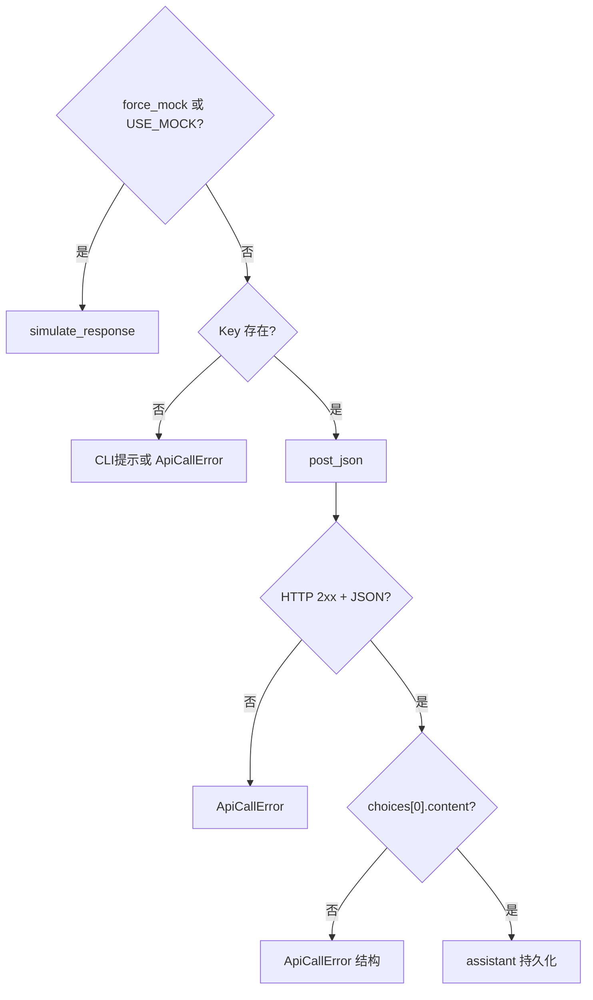

### 18.2 分组

- A 组 L01~L15：HTTP 与 invoke_api  
- B 组 L16~L30：CLI 与配置  
- C 组 L31~L40：发布与回归  

---

## 19. API 设计评审

### 19.1 评审问题清单

| # | 问题 | 通过标准 |
|---|---|---|
| 1 | Key 是否仅环境变量？ | JSON 无 key 字段 |
| 2 | HTTP 错误是否统一？ | 全部 ApiCallError |
| 3 | 超时是否设置？ | DEFAULT_TIMEOUT=30 |
| 4 | Mock 是否 OpenAI 兼容？ | choices/message/content |
| 5 | 菜单 9/12 是否分离？ | force_mock vs HTTP |
| 6 | 多轮是否带 history？ | build_messages extend |
| 7 | base URL 是否可配置？ | NEXUS_API_BASE_URL |
| 8 | 退出码是否未扩散？ | 仍 0/2/3 |
| 9 | 依赖是否声明？ | requirements requests |
| 10 | 响应解析 fail-closed？ | 结构错抛异常 |

### 19.2 OpenAI 兼容层占位

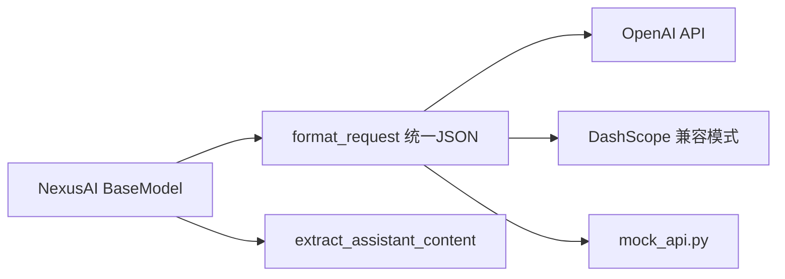

### 19.3 技术债

| 债务 | 偿还日 |
|---|---|
| 无自动重试 | Day 15 |
| 无流式 SSE | Day 19 |
| 无 usage 持久化 | Day 16 |
| 无 dotenv | Day 13 |
| GET 语料 | Day 12+ 作业 |

### 19.4 评审结论模板

“HTTP 路径覆盖实验室 L01~L40 通过；**API 设计评审** 10 项中 9 项通过，GET 语料留挑战作业。”

---

## 20. 复盘与 Day 13

### 20.1 今日保持

- Day 10/11 五层包与 Schema v4 document_index。  
- 退出码 **0 / 2 / 3** 语义不变。  
- 菜单 9 模拟、菜单 10/11 语料能力回归。  
- `ApiCallError` 在菜单内 recover，不 crash CLI。  
- Mock 服务器 + requests 真实 HTTP 栈单测。  
- **API Key 永不写入 nexus_platform.json**。  

### 20.2 今日停止

- 在 `model_config` 增加 `api_key` 字段。  
- 在仓库 commit `.env` 或真实 Key。  
- 散弹式 `requests.post` 不写 post_json。  
- API 失败 silent 改 simulate（除非用户显式选菜单 9）。  
- 跳过 test_api 直接演示真实 Key（烧钱且 flaky）。  

### 20.3 Day 13 预览

Day 13 引入 **python-dotenv**：`.env` 本地加载、`NEXUS_API_KEY` 与配置分层、与今日环境变量方案平滑衔接；仍保持 Key 不进 JSON。

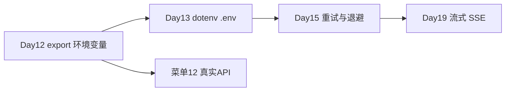

### 20.4 与课程主线

| 天 | 能力 |
|---|---|
| Day 11 | 语料 I/O + 索引 |
| Day 12 | HTTP + Chat Completions |
| Day 13 | dotenv 配置 |
| Day 15 | 重试/限流 |
| Day 28 | RAG + API 综合 |

### 20.5 结语

Day 12 让 NexusAI 首次「连上云端大脑」：**HTTP 协议、requests 封装、环境变量密钥、OpenAI 兼容请求与响应解析、Mock 测试、菜单 12 API 对话**，是从本地模拟走向生产集成的分水岭。把三门测试跑绿，你就完成了平台从「能读文档」到「能调大模型」的关键一跃。

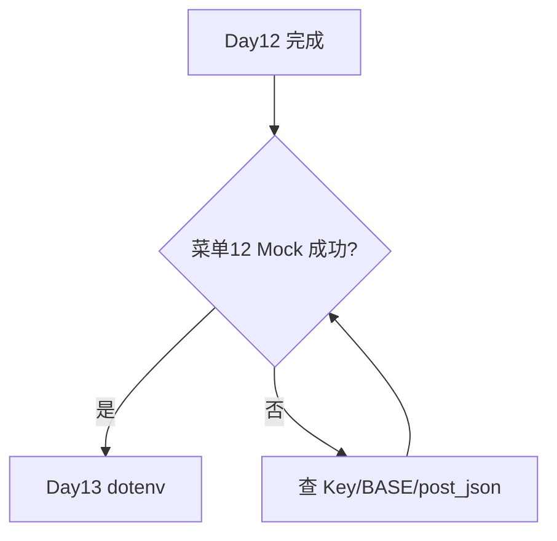

---

## 21. OpenAI / Qwen 兼容对照

### 21.1 端点

| 供应商 | 兼容 base | model 示例 |
|---|---|---|
| OpenAI | https://api.openai.com/v1 | gpt-4o-mini |
| 通义千问 | https://dashscope.aliyuncs.com/compatible-mode/v1 | qwen-plus |

### 21.2 请求体（本日相同）

两者均使用顶层 `messages` 数组；Qwen 原生 DashScope 非兼容 API 在课程中**不采用**，降低学员认知负担。

### 21.3 切换模型 CLI

菜单 8 → 切换 provider/model_id → persist model_config → 菜单 12 用新 model 调 API。

---

## 22. 代码阅读顺序

1. `exceptions.py` — ApiCallError  
2. `http/config.py` — 环境变量  
3. `http/client.py` — post_json  
4. `models/base.py` — invoke_api、extract_assistant_content  
5. `models/openai_model.py` / `qwen_model.py` — format_request  
6. `platform/state.py` — api_chat / simulate_chat  
7. `cli/app.py` — 菜单 12  
8. `tests/mock_api.py` — Mock 服务器  
9. `tests/test_api.py` — 断言范本  

---

## 23. 术语表

| 术语 | 含义 |
|---|---|
| Chat Completions | OpenAI 风格对话补全 API |
| Bearer Token | Authorization 头中的令牌类型 |
| base URL | API 根地址，含 /v1 |
| compatible-mode | DashScope 的 OpenAI 兼容网关 |
| force_mock | 强制本地 simulate，不发 HTTP |
| post_json | 项目内 POST+JSON 统一入口 |
| choices | 响应中候选回复数组 |
| ApiCallError | HTTP/API 层业务异常 |

---

## 24. 教学质量门禁

| 指标 | 目标 |
|---|---:|
| 课件字符 | ≥30000 |
| Mermaid | ≥9 |
| 必备章节 | 全部 |
| http 两层 | 通过 |
| 菜单 12 | 通过 |
| Schema v4 无 key | 通过 |
| exit 0/2/3 不变 | 通过 |
| 三门测试 | 通过 |

---

## 25. 延伸阅读

- MDN：HTTP 概述、状态码、Headers  
- requests 文档：Quickstart、Timeouts  
- OpenAI API Reference：Chat Completions  
- 阿里云 DashScope：OpenAI 兼容模式说明  

---

*课件版本：Day 12｜NexusAI 0.0.12｜字符数与 Mermaid 数以构建脚本验收为准*
