# Day 13｜装饰器、生成器、类型注解、dotenv 与 API 重试治理

> 阶段：Python 进阶·工程化与韧性 HTTP  
> 项目版本：NexusAI 0.0.13  
> 需求：US-RES-001  
> 交付：`nexus/config/env_loader.py`、`nexus/http/decorators.py`、`nexus/utils/generators.py`、菜单 13 配置、`.env.example`  

---

## 0. 开场旁白

Day 12 让 NexusAI 首次通过 `requests` 发出 Chat Completions POST，密钥靠 `export NEXUS_API_KEY` 注入，超时固定 30 秒，网络抖动一次失败即抛 `ApiCallError`。企业上线后，运维会问三个连环问题：**本地开发能否用 `.env` 文件而不是手敲 export？API 429/503 能否自动退避重试？消息历史窗口能否用生成器惰性迭代，为 Day 19 流式 SSE 铺路？** Day 13 的 NexusAI 0.0.13 给出工程化答案。

想象周一晨会，SRE 提交 incident：`菜单 12` 在弱网环境偶发超时，用户看到「请求超时」后手动重试三次才成功；安全审计发现某实习生把 `sk-xxx` 写进了演示 JSON；代码审查指出 `post_json` 返回类型不明确，IDE 无法提示 `choices` 键。Day 13 一次性解决配置分层、韧性调用与类型可读性：**python-dotenv 加载 `.env`（Key 仍不进 JSON）**；**`@retry_api_call` 装饰器对 `ApiCallError` 指数退避**；**`post_json` 带类型别名与装饰器**；**`iter_message_dicts` / `take_last` 生成器窗口**；**菜单 13 展示脱敏 Key 与 dotenv 路径**；**Schema 仍为 v4，API Key 永不写入 `nexus_platform.json`**；退出码继承 Day 10：**0 正常、2 持久化、3 schema 拒绝**——不因重试失败新增 exit 4。

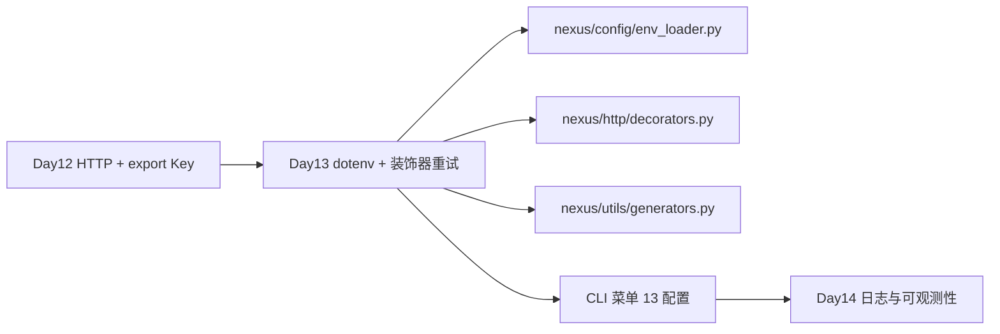

今天你会反复看到九个工程主题：**装饰器原理**（闭包、@syntax、functools.wraps）、**重试与超时治理**（有限次、指数退避、只捕 ApiCallError）、**python-dotenv 配置**（load_dotenv、bootstrap 一次）、**类型注解入门**（Dict、Optional、TypeVar、Generator）、**生成器与 yield**（惰性迭代、窗口记忆）、**asyncio 预习**（理解 event loop，本日不重写 HTTP 栈）、**课堂实操**（starter/retry_dotenv.py → 生产装饰器）、**单元测试策略**（dotenv 临时目录、装饰器 flaky 模拟）、**CLI 全链路**（菜单 13 脱敏、菜单 12 重试透明）。它们不是孤立语法课，而是把 NexusAI 从「能调 API」推进到「配置安全、调用 resilient、类型可读」的企业最小工程基线。

---

## 1. 学习成果与完成定义

学员能够：

1. 解释装饰器本质：高阶函数接收 callable、返回增强 callable；`@decorator` 是语法糖。
2. 手写带参数的装饰器工厂（如 `retry_api_call(max_attempts=3)`），并用 `functools.wraps` 保留元数据。
3. 说明 `retry_api_call` 为何只捕获 `ApiCallError`，而不吞掉 `KeyboardInterrupt` 或 `PersistenceError`。
4. 使用 `python-dotenv` 的 `load_dotenv`，理解 `override=False` 时已有环境变量优先。
5. 阅读 `bootstrap_env` 的单例加载语义，以及 `NEXUS_ENV_FILE` 自定义路径。
6. 使用 `mask_secret` 在 CLI/日志展示 Key 末四位，绝不打印完整密钥。
7. 为 HTTP 函数添加 `Headers`、`JsonPayload`、`JsonResponse` 类型别名，说明静态检查价值。
8. 实现并调用 `iter_message_dicts` 生成器与 `take_last` 窗口函数，对比 list 全量复制的内存差异。
9. 用 asyncio 术语解释「协程」「await」「event loop」，并说明本日 `post_json` 仍为同步 requests。
10. 配置 `.env.example` → 复制 `.env` → 菜单 13 验证路径与脱敏 Key → 菜单 12 Mock API 成功。
11. 运行 `test_dotenv.py`、`test_decorators.py`、`test_generators.py`、`test_cli.py`、`test_release.py` 全绿。
12. 确认 `requirements.txt` 含 `python-dotenv>=1.0.0` 与 `requests>=2.31.0`。

完成定义：

- [ ] `nexus/config/env_loader.py` 实现 `load_env`、`mask_secret`、`loaded_env_path`。
- [ ] `nexus/http/config.py` 增加 `bootstrap_env`，各 resolve 函数首次调用时加载 dotenv。
- [ ] `nexus/http/decorators.py` 实现 `retry_api_call`，支持 `NEXUS_API_RETRY`、`NEXUS_API_BACKOFF`。
- [ ] `nexus/http/client.py` 的 `post_json` 带类型注解且 `@retry_api_call()`。
- [ ] `nexus/utils/generators.py` 实现 `iter_message_dicts`、`take_last`。
- [ ] CLI 菜单 13 展示 app 版本、mock 模式、provider、base URL、脱敏 Key、`.env` 路径。
- [ ] `.env.example` 在 solution 根目录，注释说明勿提交真实 Key。
- [ ] Schema v4 的 `model_config` 仍无 `api_key` 字段。
- [ ] 发布 ZIP 含 `nexus/config/`、`decorators.py`、`generators.py`，APP_VERSION=0.0.13。
- [ ] 课件不少于 30000 字符、不少于 9 个 Mermaid 图。

今日不做：全项目 asyncio 重写（Day 25+）；OpenTelemetry 追踪（Day 14）；Circuit Breaker（Day 18）；流式 SSE（Day 19）；把 Key 加密写入 JSON（永不）。

---

## 2. 企业需求文档

### 2.1 用户故事

> 作为企业 AI 平台工程师，我希望 NexusAI 通过 `.env` 文件管理 `NEXUS_API_KEY` 与重试参数，HTTP 层对 transient `ApiCallError` 自动指数退避，CLI 菜单 13 安全展示配置摘要（密钥脱敏），消息历史通过生成器窗口截取，以便本地开发与 CI 配置一致、弱网环境减少人工重试，且审计确认密钥从未进入 `nexus_platform.json`。

### 2.2 架构决策记录（ADR-013）

**背景**：Day 12 依赖 shell `export`，Windows 学员体验差；单次 HTTP 失败即中断菜单 12；`post_json` 无类型提示；消息列表复制成本高。 scattered retry 逻辑会导致退避策略不一致；若把 Key 写入 JSON 或 `.env` 进 Git，泄漏风险剧增。

**决策**：

1. 新增 `nexus/config/env_loader.py`：`load_dotenv` 封装、`mask_secret` 脱敏、`NEXUS_ENV_FILE` 支持自定义路径。
2. `nexus/http/config.py` 增加 `bootstrap_env()`：进程内首次 resolve 时加载 `.env`，默认 **不 override** 已有环境变量。
3. 新增 `nexus/http/decorators.py`：`retry_api_call` 装饰器工厂，默认 3 次、退避 `0.05 * attempt` 秒，仅重试 `ApiCallError`。
4. `post_json` 添加 `@retry_api_call()` 与 `Headers`/`JsonPayload`/`JsonResponse` 类型别名。
5. 新增 `nexus/utils/generators.py`：`iter_message_dicts` yield 消息 dict；`take_last` 取最近 N 条，为长上下文窗口与流式铺垫。
6. CLI 菜单 **13配置**：`bootstrap_env` + `mask_secret(resolve_api_key())` + `loaded_env_path()`。
7. 根目录提供 `.env.example`；`requirements.txt` 增加 `python-dotenv>=1.0.0`。
8. Schema **保持 v4**；`model_config` **不得** 出现 `api_key`；`.env` 加入 `.gitignore`（若尚未）。
9. asyncio 本日仅概念预习，`requests` 保持同步；Day 25 再引入 `httpx`/`aiohttp` 异步客户端。
10. 测试：`test_dotenv` 用临时目录写 `.env`；`test_decorators` 模拟 flaky；`test_cli` 断言菜单 13 不含明文 Key。

**后果**：

- 正面：配置与代码分离；重试策略集中；类型可读；生成器为 SSE/RAG 窗口做准备；菜单 13 运维友好。
- 负面：同步 sleep 阻塞线程；重试可能放大 429（Day 18 限流感知）；dotenv 仅适合开发/单机，K8s 仍用 Secret 注入。

### 2.3 目录结构（Day 13 增量）

```
course/day13/solution/
├── main.py
├── requirements.txt          # ★ python-dotenv>=1.0.0, requests>=2.31.0
├── .env.example              # ★ Key 占位与注释
├── nexus/
│   ├── constants.py          # APP_VERSION=0.0.13
│   ├── config/               # ★ 本日新增
│   │   ├── __init__.py
│   │   └── env_loader.py     # load_env, mask_secret
│   ├── http/
│   │   ├── client.py         # ★ @retry_api_call, 类型别名
│   │   ├── config.py         # ★ bootstrap_env
│   │   └── decorators.py     # ★ retry_api_call
│   ├── utils/                # ★ 本日新增
│   │   ├── __init__.py
│   │   └── generators.py     # iter_message_dicts, take_last
│   ├── models/base.py        # invoke_api 经 post_json 自动重试
│   └── cli/app.py            # ★ 菜单 13 配置
├── starter/retry_dotenv.py   # 课堂装饰器起步
└── tests/
    ├── test_dotenv.py
    ├── test_decorators.py
    ├── test_generators.py
    ├── test_cli.py
    └── test_release.py
```

### 2.4 Schema v4 与 model_config（密钥缺席）

```json
{
  "schema_version": 4,
  "revision": 22,
  "owner": {
    "employee_id": "E130013",
    "department": "研发部"
  },
  "contacts": [],
  "messages": [
    {"role": "user", "content": "报销制度？"},
    {"role": "assistant", "content": "请参考财务部 FAQ 第三章…"}
  ],
  "model_config": {
    "provider": "qwen",
    "model_id": "qwen-plus",
    "temperature": 0.7,
    "max_tokens": 1024
  },
  "document_index": {
    "corpus_dir": "corpus",
    "documents": [],
    "keyword_totals": {},
    "last_ingested_at": null
  }
}
```

**硬性规则**：`model_config` 中**不得**出现 `api_key`、`secret`、`token`、`dotenv_path` 等字段。`.env` 是**本地配置文件**，不是持久化状态；运维在生产用 Secret/ConfigMap 注入环境变量，效果与 dotenv 加载后一致，但文件不进镜像。

### 2.5 环境变量契约（Day 13 扩展）

| 变量 | 含义 | 示例 | 来源 |
|---|---|---|---|
| NEXUS_API_KEY | Bearer 令牌 | sk-xxx | .env / export / K8s Secret |
| NEXUS_API_BASE_URL | 覆盖 base | http://127.0.0.1:端口/v1 | .env |
| NEXUS_USE_MOCK | 全局 Mock | 1 | .env |
| NEXUS_API_RETRY | 最大尝试次数 | 3 | .env，装饰器默认 |
| NEXUS_API_BACKOFF | 退避基数秒 | 0.05 | .env，第 n 次 sleep backoff*n |
| NEXUS_ENV_FILE | 自定义 .env 路径 | /etc/nexus/.env | export |

### 2.6 异常与退出码（继承 Day 10/11/12）

| 异常类 | code | 典型场景 | CLI 行为 |
|---|---|---|---|
| ApiCallError | API_CALL | 超时、HTTP≥400、重试耗尽 | 菜单内 continue |
| PersistenceError | PERSISTENCE | 磁盘读写失败 | exit 2 |
| SchemaValidationError | SCHEMA_VALIDATION | schema_version 非 1~4 | exit 3 |
| InvalidMessageError | INVALID_MESSAGE | 非法 role | continue |
| ModelConfigError | MODEL_CONFIG | 模型参数非法 | continue |
| DocumentLoadError | DOCUMENT_LOAD | 语料错误 | continue |

**重要**：重试耗尽后仍抛 `ApiCallError`，语义与 Day 12 一致；**不**因重试新增 exit code。

### 2.7 非功能需求

| 编号 | 要求 |
|---|---|
| NFR-D1 | env_loader 不得 import cli |
| NFR-D2 | load_dotenv 默认 override=False |
| NFR-D3 | mask_secret 短于 4 字符全打星 |
| NFR-D4 | retry 仅捕 ApiCallError |
| NFR-D5 | bootstrap_env 进程内只加载一次（可 reset 测） |
| NFR-D6 | 菜单 13 stdout 不得含完整 NEXUS_API_KEY |
| NFR-D7 | post_json timeout 仍默认 30s |
| NFR-D8 | 发布 ZIP 含 .env.example 不含 .env |

---

## 3. 验收标准

### 3.1 Given-When-Then

**dotenv 加载 Key**

- Given 临时目录存在 `.env` 含 `NEXUS_API_KEY=dotenv-secret-key`  
- When `load_env(path, override=True)` 后 `resolve_api_key()`  
- Then 返回 `dotenv-secret-key`

**mask_secret 脱敏**

- Given Key=`sk-abcdef1234`  
- When `mask_secret(key)`  
- Then 输出 `*********1234`，不含完整 Key

**retry 第三次成功**

- Given 函数前两次抛 `ApiCallError`，第三次返回 OK  
- When `@retry_api_call(max_attempts=3)` 装饰  
- Then 调用 3 次后返回 OK

**retry 耗尽**

- Given 函数始终抛 `ApiCallError`，max_attempts=2  
- When 调用  
- Then 抛 ApiCallError，调用次数=2

**post_json 带重试**

- Given Mock 服务器第一次 503、第二次 200  
- When `post_json(...)`（若 Mock 支持）或单测装饰器层  
- Then 最终返回 choices（装饰器单测覆盖 flaky 即可）

**菜单 13 脱敏**

- Given `.env` 含 `NEXUS_API_KEY=cli-dotenv-key`  
- When CLI 输入菜单 13  
- Then stdout 含 `API Key：` 且**不含** `cli-dotenv-key` 明文

**菜单 12 仍可用**

- Given `.env` + Mock base URL  
- When 菜单 12 API 对话  
- Then `HTTP mock 回复`，revision+1

**Schema 拒绝不变**

- Given `schema_version=99`  
- When 启动 CLI  
- Then exit 3

**生成器窗口**

- Given 3 条 ChatMessage  
- When `take_last(messages, 2)`  
- Then 返回最后 2 条 dict，content 正确

### 3.2 测试矩阵

| 层 | 文件 | 覆盖 |
|---|---|---|
| 配置 | test_dotenv.py | load_env、mask_secret、bootstrap |
| 装饰器 | test_decorators.py | 成功重试、耗尽 |
| 生成器 | test_generators.py | yield、take_last |
| HTTP | test_api.py | post_json 回归 |
| 集成 | test_cli.py | 菜单 13/12、双进程、无明文 Key |
| 发布 | test_release.py | 0.0.13、ZIP 含 config/ |

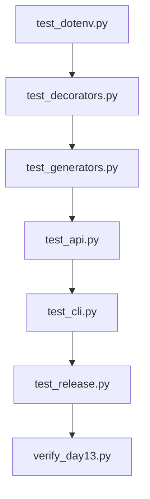

---

## 4. 装饰器原理

### 4.1 什么是装饰器

装饰器是**接受 callable、返回 callable 的高阶函数**，用于在不修改原函数源码的前提下增强行为：日志、计时、权限、**重试**、缓存等。Python 提供 `@decorator` 语法糖：

```python
@retry_api_call(max_attempts=3)
def post_json(...):
    ...
```

等价于：

```python
def post_json(...):
    ...
post_json = retry_api_call(max_attempts=3)(post_json)
```

执行顺序：先调用 `retry_api_call(max_attempts=3)` 得到真正的 `decorator`；再 `decorator(post_json)` 得到 `wrapper`；外部调用 `post_json(...)` 实际进入 `wrapper`。

### 4.2 闭包与 functools.wraps

`wrapper` 需要访问 `max_attempts`、`backoff` 等配置，这些变量被**闭包**捕获。务必使用 `@functools.wraps(func)`，否则 `post_json.__name__` 变成 `wrapper`，调试栈与文档生成混乱。

```python
import functools

def retry_api_call(max_attempts=3, backoff_seconds=0.05):
    def decorator(func):
        @functools.wraps(func)
        def wrapper(*args, **kwargs):
            ...
            return func(*args, **kwargs)
        return wrapper
    return decorator
```

### 4.3 带参数 vs 不带参数

| 形式 | 示例 | 说明 |
|---|---|---|
| 无参装饰器 | `@login_required` | 一层函数：`def deco(f): ...` |
| 有参工厂 | `@retry_api_call(max_attempts=3)` | 两层：工厂返回 decorator |
| 类装饰器 | `@dataclass` | 本日不涉及 |

NexusAI 的 `retry_api_call` 是**带参数工厂**：参数可来自装饰器括号，也可为 `None` 时读 `NEXUS_API_RETRY` 环境变量。

### 4.4 装饰器执行流

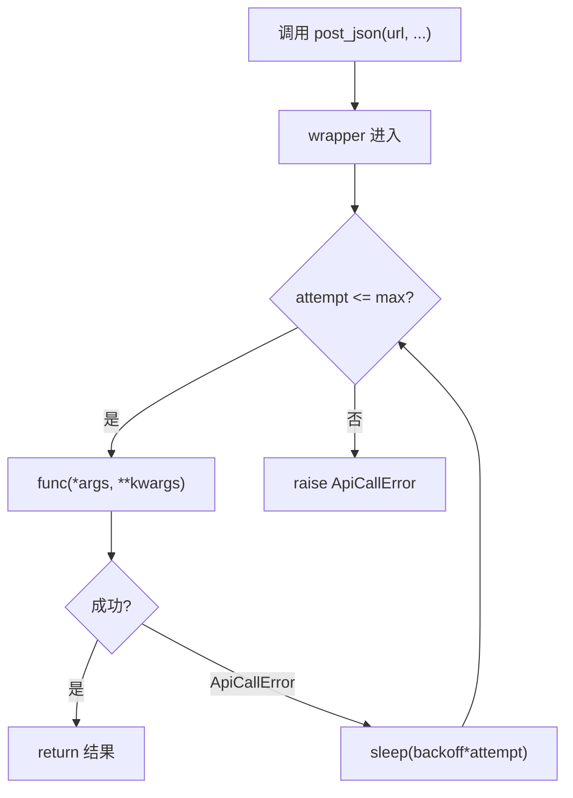

### 4.5 装饰器原则（企业实践）

1. **单一职责**：一个装饰器只做一件事（本日只做 ApiCallError 重试）。
2. **可测试**：通过注入 `max_attempts=2, backoff_seconds=0.01` 加速单测。
3. **可配置**：环境变量作为默认值，代码括号参数覆盖环境。
4. **不吞异常**：只捕明确可恢复异常；`PersistenceError` 必须立即上浮。
5. **保留元数据**：`functools.wraps` 非可选。
6. **幂等意识**：重试 POST 在严格 REST 里需 idempotency key；Chat Completions 本课程视为可安全重试（相同 messages 多要一次回复，业务可接受）。

### 4.6 常见误区

| 误区 | 正确做法 |
|---|---|
| 装饰器里 `return wrapper()` 多了括号 | 应 `return wrapper` |
| 捕获 `Exception` 太宽 | 只捕 `ApiCallError` |
| 忘记三层缩进 | 工厂 → decorator → wrapper |
| 重试无限循环 | 必须 `max_attempts` 上限 |
| 在 wrapper 改函数签名 | 用 `*args, **kwargs` 透传 |

### 4.7 装饰器工作坊（12 题）

| 编号 | 问题 | 答案要点 |
|---|---|---|
| D01 | `@deco` 等价于什么？ | `f = deco(f)` |
| D02 | 为何需要 wraps？ | 保留 __name__ __doc__ |
| D03 | 带参装饰器几层函数？ | 至少两层：工厂 + wrapper |
| D04 | 装饰器在 import 时还是 call 时执行？ | import 时包装；call 时 wrapper |
| D05 | 多个装饰器顺序？ | 自下而上应用：`@a @b` → `a(b(f))` |
| D06 | 类方法能装饰吗？ | 能，`@classmethod` 与装饰器可组合 |
| D07 | retry 为何不用 while True？ | 必须有 attempts 上限 |
| D08 | 装饰器能改返回值类型吗？ | 能，但应文档化 |
| D09 | 装饰器性能开销？ | 一次闭包查找，可忽略 |
| D10 | 如何禁用装饰器测试？ | 直接测内部 func 或 mock |
| D11 | `@retry_api_call()` 为何有括号？ | 工厂调用返回 decorator |
| D12 | TypeVar F 作用？ | 保留被装饰函数类型给 mypy |

### 4.8 starter/retry_dotenv.py 对照

课堂起点 `starter/retry_dotenv.py` 用 `RuntimeError` 演示退避；生产版改为 `ApiCallError`，并与 `nexus/http/decorators.py` 对齐环境变量名。

---

## 5. 重试与超时治理

### 5.1 为何要重试

LLM API 失败分两类：

| 类型 | 示例 | 是否重试 |
|---|---|---|
| Transient 瞬时 | 超时、502、503、偶发 429 | 是（有限次） |
| Permanent 永久 | 401 Key 错、400 参数错 | 否（立即失败） |

Day 12 把所有 HTTP≥400 都映射为 `ApiCallError`；Day 13 装饰器**不区分** 401 与 503——一律重试直到耗尽。这是教学简化；Day 18 将按 status code 分流：401 不重试，503 重试。

### 5.2 指数退避

本日退避公式：`sleep(backoff_seconds * attempt)`，其中 `attempt` 为 1-based 当前次数。

| attempt | backoff=0.05 时 sleep |
|---|---:|
| 1 失败后 | 0.05s |
| 2 失败后 | 0.10s |
| 3 失败 | 不再 sleep，直接 raise |

环境变量 `NEXUS_API_BACKOFF=0.05` 可调；生产常配合 jitter（Day 18）。

### 5.3 超时与重试的关系

`post_json` 的 `timeout=30` 是**单次 HTTP 调用**上限。`max_attempts=3` 最坏情况约 3×30s + 退避 ≈ 90s+。运维应知晓：**总等待时间 ≈ attempts × timeout + 退避和**。

```python
DEFAULT_TIMEOUT = 30

@retry_api_call()
def post_json(url, headers, payload, timeout=DEFAULT_TIMEOUT):
    response = requests.post(..., timeout=timeout)
```

装饰器在外层；每次 attempt 都是完整一次 `requests.post`，每次独立受 timeout 约束。

### 5.4 retry_api_call 完整语义

```python
def retry_api_call(max_attempts=None, backoff_seconds=None):
    def decorator(func):
        @functools.wraps(func)
        def wrapper(*args, **kwargs):
            attempts = max_attempts or int(os.environ.get("NEXUS_API_RETRY", "3"))
            backoff = backoff_seconds or float(os.environ.get("NEXUS_API_BACKOFF", "0.05"))
            last_error = None
            for attempt in range(1, attempts + 1):
                try:
                    return func(*args, **kwargs)
                except ApiCallError as error:
                    last_error = error
                    if attempt >= attempts:
                        raise
                    time.sleep(backoff * attempt)
            ...
        return wrapper
    return decorator
```

### 5.5 重试决策流

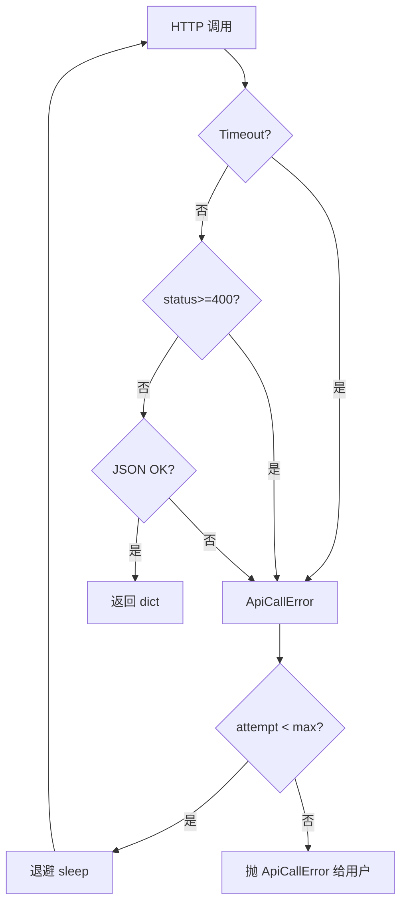

### 5.6 与菜单 12 集成

用户无感知：`state.api_chat` → `invoke_api` → `post_json`（已装饰）。CLI 仍 `except ApiCallError: print; continue`。若三次皆败，用户看到最后一次错误 message（如「HTTP 503：…」）。

### 5.7 重试工作坊（8 题）

| 编号 | 场景 | 期望 |
|---|---|---|
| R01 | 第 2 次成功 | 调用 2 次 |
| R02 | 永远失败 max=3 | 调用 3 次后 raise |
| R03 | NEXUS_API_RETRY=5 | 默认 5 次 |
| R04 | backoff=0 单测 | 无 sleep 等待 |
| R05 | 非 ApiCallError | 不重试，直接抛 |
| R06 | 成功第一次 | 只调用 1 次 |
| R07 | 菜单 12 弱网 | 用户见一次错误 or 成功 |
| R08 | 429 连击 | Day 18 前可能放大压力 |

---

## 6. python-dotenv 配置

### 6.1 为何引入 dotenv

Day 12 要求学员 `export NEXUS_API_KEY=...`，问题：

1. Windows PowerShell 语法不同，课堂摩擦大。  
2. 多变量（Key、base、retry）每次开终端都要敲。  
3. 文档难以「复制即用」——`.env.example` 是行业标准 onboarding 方式。

`python-dotenv` 在应用启动时读取 `.env` 文件，把 `KEY=VALUE` 注入 `os.environ`，与 export 效果一致，但**文件不进 Git**（`.gitignore`）。

### 6.2 load_env 实现要点

```python
from dotenv import load_dotenv

def load_env(env_path=None, override=False):
    candidate = env_path or os.environ.get("NEXUS_ENV_FILE", ".env")
    path = Path(candidate)
    if path.is_file():
        load_dotenv(path, override=override)
        _loaded_path = str(path.resolve())
    else:
        _loaded_path = ""
    return _loaded_path
```

| 参数 | 含义 |
|---|---|
| override=False | 已存在的系统环境变量**不被** .env 覆盖（12-factor 推荐） |
| override=True | 单测强制以 .env 为准 |
| NEXUS_ENV_FILE | 指向非默认路径 |

### 6.3 bootstrap_env 单例

```python
_dotenv_bootstrapped = False

def bootstrap_env(env_path=None):
    global _dotenv_bootstrapped
    if not _dotenv_bootstrapped:
        load_env(env_path)
        _dotenv_bootstrapped = True
    return loaded_env_path()
```

`resolve_api_key`、`use_mock_mode`、`resolve_base_url` 在读取 env 前均调用 `bootstrap_env()`，保证**懒加载**：无 API 调用时不读盘；CLI 菜单 13 显式 `bootstrap_env()` 展示路径。

### 6.4 配置加载流程

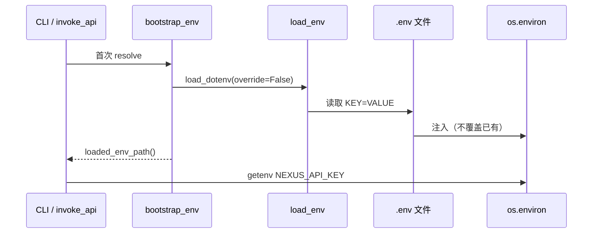

### 6.5 .env.example 模板

```bash
# NexusAI 本地环境变量示例（复制为 .env 后填写，勿提交真实 Key）
NEXUS_API_KEY=sk-your-key-here
# NEXUS_API_BASE_URL=https://dashscope.aliyuncs.com/compatible-mode/v1
# NEXUS_USE_MOCK=1
# NEXUS_API_RETRY=3
# NEXUS_API_BACKOFF=0.05
```

学员流程：`cp .env.example .env` → 编辑 Key → `python main.py` → 菜单 13 验证。

### 6.6 mask_secret 与配置展示

```python
def mask_secret(value, visible=4):
    if value.strip() == "":
        return "(未设置)"
    if len(value) <= visible:
        return "*" * len(value)
    return f"{'*' * (len(value) - visible)}{value[-visible:]}"
```

菜单 13 输出示例：

```
配置摘要：app=0.0.13｜mock=False｜provider=qwen｜base=https://...
API Key：*********v-key
.env：/tmp/nexus-day13-cli-xxx/.env
```

**绝不**打印 `sk-your-key-here` 全文。

### 6.7 dotenv 工作坊（10 题）

| 编号 | 操作 | 说明 |
|---|---|---|
| E01 | cp .env.example .env | 标准 onboarding |
| E02 | override=False 行为 | export 优先于 .env |
| E03 | NEXUS_ENV_FILE | 自定义路径 |
| E04 | .env 进 Git？ | 禁止，仅 example |
| E05 | 生产 K8s | Secret 注入 env，不用文件 |
| E06 | 菜单 13 无 .env | 显示「未找到」 |
| E07 | bootstrap 两次 | 只 load 一次 |
| E08 | reset_bootstrap 测 | 测试隔离 |
| E09 | Key 进 JSON？ | 永不 |
| E10 | python-dotenv 版本 | >=1.0.0 |

### 6.8 与 Schema v4 边界

| 存储位置 | 可存 | 不可存 |
|---|---|---|
| nexus_platform.json | provider, model_id | api_key |
| .env | NEXUS_API_KEY | 业务 messages |
| os.environ | 全部 NEXUS_* | — |
| CLI 菜单 13 输出 | mask 后 Key | 完整 Key |

---

## 7. 类型注解入门

### 7.1 为何在 Day 13 引入

HTTP 层返回 `dict` 太模糊：是 `{}` 还是含 `choices`？IDE 无法自动补全。类型注解（PEP 484）不强制运行时检查（除非用 pydantic），但提升：

1. **可读性**：新人读签名即懂契约。  
2. **静态检查**：mypy/pyright 在 CI 抓错。  
3. **文档**：签名即文档。

### 7.2 Day 13 用到的 typing 构件

```python
from typing import Any, Callable, Dict, Generator, Iterable, List, Optional, Tuple, TypeVar

Headers = Dict[str, str]
JsonPayload = Dict[str, Any]
JsonResponse = Dict[str, Any]
MessageDict = Dict[str, str]

F = TypeVar("F", bound=Callable[..., Any])
```

| 类型 | 含义 | 出现位置 |
|---|---|---|
| Dict[str, str] | 字符串键值 dict | Headers |
| Optional[str] | str 或 None | env_path |
| Tuple[str, str] | 二元组 | resolve_api_credentials |
| TypeVar F | 保留 callable 类型 | retry 装饰器 |
| Generator[Y, S, R] | 生成器 yield 类型 | iter_message_dicts |

### 7.3 post_json 签名

```python
@retry_api_call()
def post_json(
    url: str,
    headers: Headers,
    payload: JsonPayload,
    timeout: int = DEFAULT_TIMEOUT,
) -> JsonResponse:
    ...
```

调用方知：传入 headers 为 str→str，返回为 dict（期望含 choices）。

### 7.4 Python 3.10+ 联合类型

本仓库使用 `int | None` 与 `ApiCallError | None`（3.10+ 语法），等价于 `Optional[int]`。

### 7.5 装饰器与 TypeVar

```python
F = TypeVar("F", bound=Callable[..., Any])

def retry_api_call(...) -> Callable[[F], F]:
    ...
```

告诉类型检查器：装饰后的函数与装饰前**同签名**。运行时 `# type: ignore[misc]` 因 wrapper 动态特性偶需。

### 7.6 类型注解工作坊（8 题）

| 编号 | 问题 | 答案 |
|---|---|---|
| T01 | 注解运行时会强制吗？ | 默认不会 |
| T02 | Headers 为何不用 dict？ | 别名表达语义 |
| T03 | Any 何时用？ | JSON 动态键 |
| T04 | Optional[str] 默认值 | 常配合 None |
| T05 | mypy 谁跑？ | CI 可选 |
| T06 | list vs List | 3.9+ 可小写 list[str] |
| T07 | 返回值 -> None | 无 return |
| T08 | Generator 三参数 | Yield, Send, Return |

### 7.7 与 Day 24 pydantic 预告

Day 13 用轻量 typing；Day 24 用 pydantic 模型校验 API 响应结构，替代裸 `Dict[str, Any]`。

---

## 8. 生成器与 yield

### 8.1 生成器 vs 列表

| 方式 | 内存 | 适用 |
|---|---|---|
| `[x for x in items]` | 一次分配全量 | 小集合 |
| `yield` 生成器 | 惰性，O(1) 额外 | 大历史、流式 |

LLM 对话 history 可达数百条；Day 19 SSE 需逐 token 推送。Day 13 用 `iter_message_dicts` 建立 yield 心智模型。

### 8.2 iter_message_dicts

```python
def iter_message_dicts(messages: Iterable[Any]) -> Generator[MessageDict, None, None]:
    for item in messages:
        if hasattr(item, "to_dict"):
            yield item.to_dict()
        elif isinstance(item, dict):
            yield {"role": item["role"], "content": item["content"]}
        else:
            raise TypeError("消息必须是 dict 或带 to_dict 的对象")
```

**逐个 yield**，不构建中间大 list（除非消费者 list() 全收）。

### 8.3 take_last 窗口

```python
def take_last(messages: List[MessageDict], limit: int) -> List[MessageDict]:
    if limit <= 0:
        return []
    collected = []
    for message in iter_message_dicts(messages):
        collected.append(message)
    return collected[-limit:]
```

用于 `build_messages` 前截取最近 N 条，控制 token 上限（Day 17 精算 token）。

### 8.4 yield 执行模型

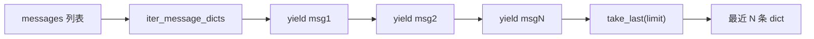

### 8.5 与 invoke_api 衔接（概念）

`BaseModel.build_messages` 可改为：

```python
history = take_last(state.messages, limit=20)
```

再 extend 进 messages 数组——本日 generator 模块独立，Day 17 接入 state。

### 8.6 生成器工作坊（8 题）

| 编号 | 代码 | 结果 |
|---|---|---|
| G01 | `list(iter_message_dicts([dict]))` | 1 元素 |
| G02 | ChatMessage 输入 | 调 to_dict |
| G03 | take_last(..., 0) | [] |
| G04 | take_last(..., 2) 共 3 条 | 后 2 条 |
| G05 | yield vs return | yield 可多次 |
| G06 | 生成器只能遍历一次？ | 是，除非 tee |
| G07 | 大文件语料 | Day 11 可改 yield 行 |
| G08 | SSE 铺垫 | Day 19 流式 token |

---

## 9. asyncio 预习

### 9.1 同步 requests 的局限

`post_json` 阻塞当前线程直到响应返回。菜单 CLI 单线程可接受；高并发 Agent 需同时调 API、读盘、推 WebSocket 时，阻塞导致吞吐低。**asyncio** 提供单线程协作式并发。

### 9.2 核心概念（本日仅理解）

| 概念 | 说明 |
|---|---|
| coroutine 协程 | `async def` 定义，可暂停 |
| await | 等待协程或 IO 完成，让出控制权 |
| event loop 事件循环 | 调度协程执行 |
| Task | loop 中调度的协程包装 |

```python
import asyncio

async def fetch_status():
    await asyncio.sleep(1)  # 模拟 IO，非阻塞等待
    return "ok"

asyncio.run(fetch_status())
```

### 9.3 为何 Day 13 不重写 HTTP

1. `requests` 是同步库，在 async 里直接调用会**阻塞 event loop**。  
2. 全面改 async 牵动 cli、state、测试，超出本日范围。  
3. 先掌握装饰器重试与 dotenv，Day 25 引入 `httpx.AsyncClient` 或 `aiohttp`。

### 9.4 同步 vs 异步对照

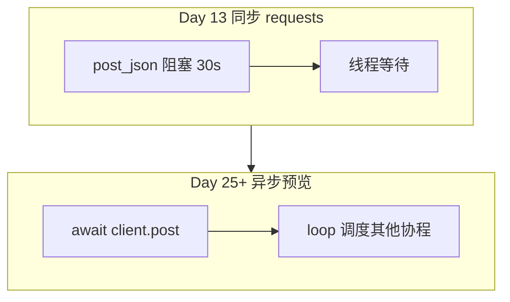

### 9.5 asyncio 与 retry 的组合（预习）

异步版重试伪代码（**非本日实现**）：

```python
async def retry_async(func, max_attempts=3):
    for attempt in range(1, max_attempts + 1):
        try:
            return await func()
        except ApiCallError:
            if attempt >= max_attempts:
                raise
            await asyncio.sleep(0.05 * attempt)
```

注意用 `asyncio.sleep` 而非 `time.sleep`，避免阻塞 loop。

### 9.6 asyncio 工作坊（6 题）

| 编号 | 问题 | 要点 |
|---|---|---|
| A01 | async def 返回什么？ | coroutine 对象 |
| A02 | 为何不 asyncio.run 在已有 loop？ | 嵌套规则 |
| A03 | requests 在 async 里？ | 阻塞，需线程池 |
| A04 | await 什么都能等？ | 仅 awaitable |
| A05 | NexusAI 何时全 async？ | Day 25+ |
| A06 | sleep 对比 | time 阻塞 vs asyncio 让出 |

---

## 10. 课堂实操

### 10.1 环境准备（15 分钟）

```bash
cd course/day13/solution
python -m venv .venv
source .venv/bin/activate   # Windows: .venv\Scripts\activate
pip install -r requirements.txt
cp .env.example .env
# 编辑 .env 填入 Key 或设 NEXUS_USE_MOCK=1
```

### 10.2 实操 W01：starter 装饰器（20 分钟）

1. 打开 `starter/retry_dotenv.py`，完成 TODO：只对 `RuntimeError` 重试。  
2. 运行观察 attempt 与 sleep。  
3. 对照 `nexus/http/decorators.py` 改为 `ApiCallError` + 环境变量。

### 10.3 实操 W02：dotenv 加载（15 分钟）

1. 在临时目录写 `.env`：`NEXUS_API_KEY=test-from-dotenv`。  
2. REPL：`from nexus.config.env_loader import load_env` → `load_env(path, override=True)`。  
3. `from nexus.http.config import resolve_api_key` → 断言 Key。  
4. 设 `export NEXUS_API_KEY=from-export`，`override=False` 再 load，断言 export 优先。

### 10.4 实操 W03：菜单 13（10 分钟）

1. `python main.py`。  
2. 选 13，确认 `API Key：` 行末四位可见，全文不可见。  
3. 确认 `.env：` 显示绝对路径。  
4. 删除 `.env`，再选 13，见「未找到」提示。

### 10.5 实操 W04：菜单 12 + 重试（20 分钟）

1. 终端 1：`python tests/mock_api.py` 或单测自动起 Mock。  
2. `.env` 设 `NEXUS_API_BASE_URL=http://127.0.0.1:端口/v1`。  
3. 菜单 12 提问，确认 `HTTP mock 回复`。  
4. 阅读 `test_decorators.py` flaky 用例，理解重试次数。

### 10.6 实操 W05：生成器（15 分钟）

1. REPL 构造 5 条 `ChatMessage`。  
2. `take_last(msgs, 3)` 得 3 条。  
3. 对比 `[m.to_dict() for m in msgs]` 与 `list(iter_message_dicts(msgs))` 结果一致。

### 10.7 实操 W06：类型阅读（10 分钟）

1. 打开 `client.py`，抄写 `post_json` 签名到笔记本。  
2. 说明 `JsonResponse` 与 OpenAI choices 关系。  
3. 可选：安装 mypy，`mypy nexus/http/client.py`（允许第三方 stub 缺失）。

### 10.8 课堂时间盒

| 时段 | 内容 |
|---|---|
| 0:00-0:15 | 装饰器原理讲授 |
| 0:15-0:35 | W01 starter |
| 0:35-0:50 | python-dotenv 配置 W02 |
| 0:50-1:10 | 重试与 post_json W04 |
| 1:10-1:25 | 生成器 W05 |
| 1:25-1:40 | asyncio 预习讲授 |
| 1:40-2:00 | 菜单 13 + 测试 W03 |

---

## 11. 单元测试策略

### 11.1 分层

| 层 | 文件 | 隔离手段 |
|---|---|---|
| env | test_dotenv.py | TemporaryDirectory + override=True |
| 装饰器 | test_decorators.py | 内存计数器 flaky_call |
| 生成器 | test_generators.py | ChatMessage  fixture |
| HTTP | test_api.py | Mock 服务器 |
| CLI | test_cli.py | subprocess + .env 文件 |
| 发布 | test_release.py | ZIP 结构 |

### 11.2 test_dotenv 要点

- `reset_env_loader_state()` + `reset_bootstrap()` 保证测试顺序无关。  
- 临时 `.env` 写入 Key，断言 `resolve_api_key()`。  
- `mask_secret` 边界：空串、短串、正常 Key。

### 11.3 test_decorators 要点

- `flaky_call` 第三次成功，断言 `attempts["count"]==3`。  
- `always_fail` max=2，断言调用 2 次后 ApiCallError。  
- `backoff_seconds=0.01` 加速 CI。

### 11.4 test_cli 安全断言

```python
assert "API Key：" in first.stdout
assert "cli-dotenv-key" not in first.stdout
```

**明文 Key 不得出现在 stdout**，这是 Day 13 安全门禁。

### 11.5 测试金字塔

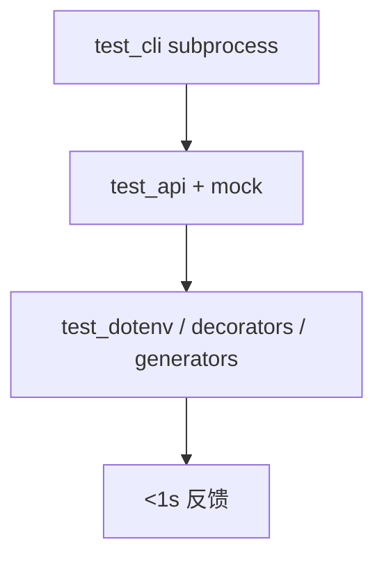

### 11.6 回归策略

每日 `verify_dayNN.py` 聚合；Day 13 不得破坏 Day 12 菜单 12 行为与 exit 0/2/3。

---

## 12. CLI 全链路

### 12.1 菜单表（0.0.13）

| 选项 | 功能 | Day 13 变化 |
|---|---|---|
| 1-11 | 同 Day 12 | 回归 |
| 12 | API 对话 | post_json 自动重试 |
| **13** | **配置摘要** | **新增，脱敏 Key** |
| 0 | 退出 | 不变 |

### 12.2 菜单 13 实现

```python
elif choice == "13":
    bootstrap_env()
    model = state.active_model()
    print(
        f"配置摘要：app={APP_VERSION}｜mock={use_mock_mode()}｜"
        f"provider={model.PROVIDER}｜base={resolve_base_url(model.PROVIDER)}"
    )
    print(f"API Key：{mask_secret(resolve_api_key())}")
    env_path = loaded_env_path()
    print(f".env：{env_path if env_path else '未找到（可用 export 或 .env.example）'}")
```

### 12.3 CLI 数据流

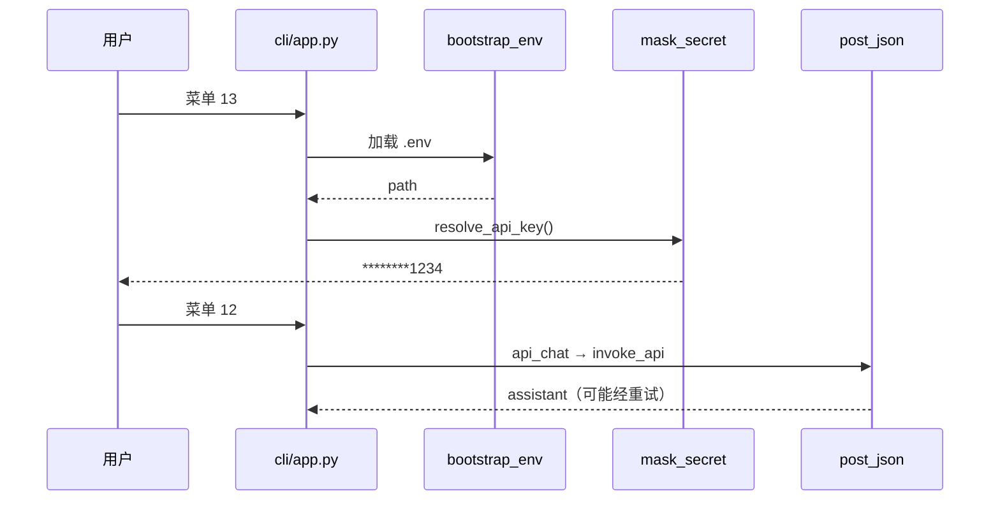

### 12.4 双进程验收

进程 A：菜单 12 成功写入 messages。进程 B：启动见「恢复成功」，菜单 5 见历史。与 Day 12 一致，证明重试与 dotenv 未破坏持久化。

### 12.5 Banner

```
智枢 NexusAI 0.0.13｜dotenv、装饰器与 API 重试
```

---

## 13. 发布部署

### 13.1 版本 bump

`nexus/constants.py`：`APP_VERSION = "0.0.13"`。

### 13.2 requirements.txt

```
requests>=2.31.0
python-dotenv>=1.0.0
```

部署文档增加：复制 `.env.example` 为 `.env` 或在 systemd/K8s 注入环境变量。

### 13.3 发布清单

| 路径 | 必须 |
|---|---|
| nexus/config/env_loader.py | 是 |
| nexus/http/decorators.py | 是 |
| nexus/utils/generators.py | 是 |
| .env.example | 是 |
| .env 真实 | **否** |
| nexus_platform.json | 无 key |

### 13.4 build_release.py

ZIP 含 solution 树；test_release 断言版本号、包路径、不含 `__pycache__`。

### 13.5 部署环境对照

| 环境 | Key 来源 |
|---|---|
| 本地 dev | .env |
| CI | TemporaryDirectory .env 或 env inject |
| staging/prod | K8s Secret / Vault |
| 演示 | NEXUS_USE_MOCK=1 |

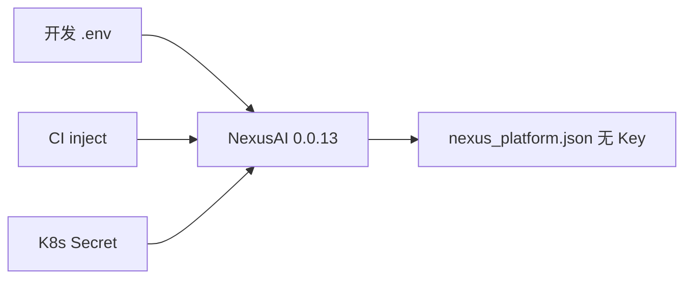

---

## 14. 安全与工程边界

### 14.1 密钥三板斧

1. **不进 Git**：`.gitignore` 含 `.env`；仅 `.env.example` 占位。  
2. **不进 JSON**：Schema v4 model_config 无 api_key。  
3. **不进日志**：用 `mask_secret`；禁止 `print(os.environ["NEXUS_API_KEY"])`。

### 14.2 重试与安全

重试不应用于「已明确 401  unauthorized」时仍狂发——Day 18 细化。本日教学版统一 ApiCallError 重试，讲师需口头警示生产应区分 status。

### 14.3 dotenv 威胁模型

| 威胁 | 缓解 |
|---|---|
| .env 误 commit | pre-commit 扫描、gitignore |
| 路径遍历 NEXUS_ENV_FILE | 仅团队可信配置 |
| 容器镜像含 .env | CI 检查镜像层 |
| 菜单 13  shoulder surfing | 仅末四位 |

### 14.4 fail-closed 继承

- schema 非法 → exit 3  
- API 重试耗尽 → ApiCallError message，不 silent 改 simulate  
- 生成器 TypeError → 立即抛，不 skip 坏消息  

### 14.5 供应链

`python-dotenv` 与 `requests` 均来自 PyPI；锁定 `>=` 最低版本，Day 70 讨论 hash pin。

### 14.6 安全边界图

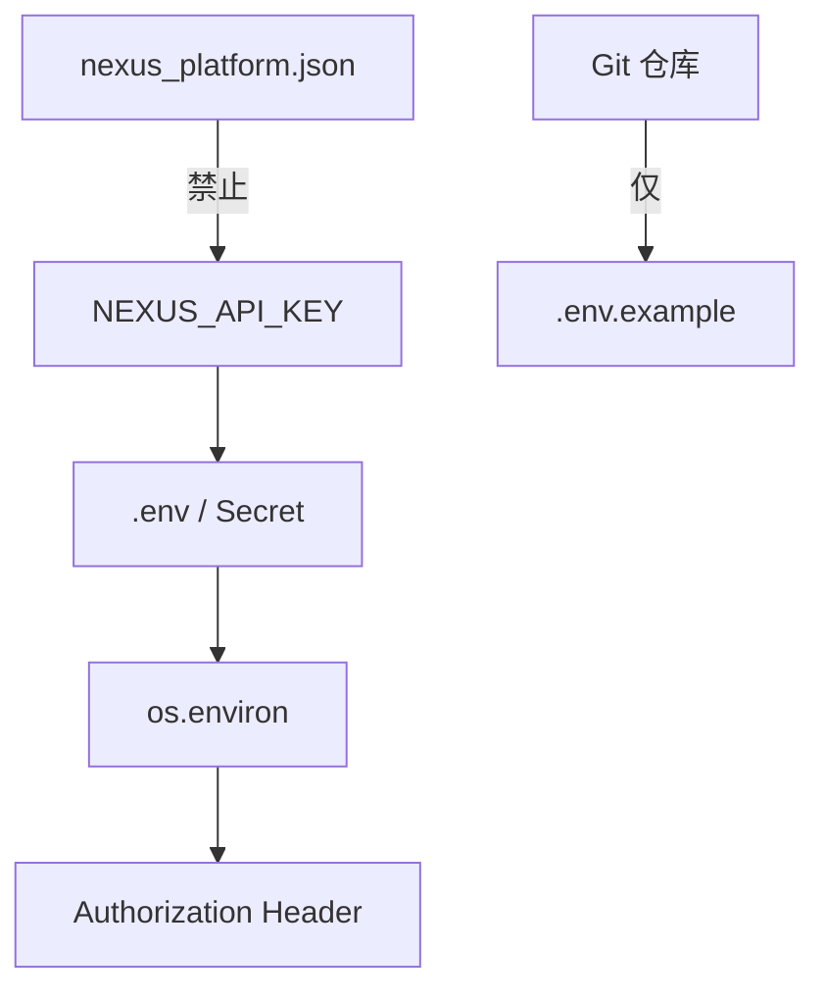

---

## 15. 课后作业

### 15.1 基础题（必做）

1. 手写无语法糖：`@retry_api_call(2)` 应用到 `def f(): pass` 的展开形式。  
2. 解释 `bootstrap_env` 为何用全局 `_dotenv_bootstrapped`。  
3. 写出 `mask_secret("abc")` 与 `mask_secret("")` 的输出。  
4. 对比 `list` 与 `generator` 在 10000 条消息上的内存直觉（文字说明）。  
5. 说明 `async def` 与 `def` 在 Day 13 项目中的分界。  

### 15.2 进阶题（选做）

1. 为 `retry_api_call` 增加仅当 message 含「超时」或「503」才重试的分支（提示：读 `str(error)`）。  
2. 菜单 13 增加打印 `NEXUS_API_RETRY` 与 `NEXUS_API_BACKOFF` 当前值。  
3. 用 `take_last` 改造 `build_messages` 接入最近 10 条 history（改 base.py）。  
4. 写 mypy 友好的 `TypedDict` 描述 `MessageDict` 的 role/content。  
5. 读 ADR-013，列举 dotenv 与 K8s Secret 各适用场景。  

### 15.3 项目题（挑战）

实现 `@timeout(seconds)` 装饰器：任意函数执行超过 N 秒抛 `ApiCallError("执行超时")`（可用 `signal` 或 `threading`，文档说明局限）；为 `flaky_call` 写单测；**不要**与 `retry_api_call` 循环依赖。

---

## 16. 作业完整参考答案

### 16.1 基础题 1

```python
def f():
    pass
f = retry_api_call(2)(f)
# 或 retry_api_call(max_attempts=2) 若 2 传给 max_attempts
```

### 16.2 基础题 2

避免每次 `resolve_api_key` 重复读盘解析 `.env`；进程内配置快照一致；测试可 `reset_bootstrap` 重置。

### 16.3 基础题 3

- `mask_secret("abc")` → `***`（长度 3 ≤ visible 4，全星）  
- `mask_secret("")` → `(未设置)`

### 16.4 基础题 4

list 一次性分配 10000 个 dict 引用；generator 每次 yield 一个，消费者若只取 last N 可 O(N) 窗口而不保留全量（优化版 take_last 可环形缓冲，本日实现为清晰起见全收集后切片）。

### 16.5 基础题 5

全项目 HTTP 仍 `def post_json` 同步；async 仅在预习章节与笔记；Day 25 再改 async client。

### 16.6 进阶题 1 提示

```python
except ApiCallError as error:
    if "503" not in str(error) and "超时" not in str(error):
        raise
```

### 16.7 进阶题 3 提示

在 `invoke_api` 里 `history=take_last(platform_messages, 10)` 传入 `build_messages`。

### 16.8 项目题思路

```python
def timeout(seconds):
    def decorator(func):
        @functools.wraps(func)
        def wrapper(*args, **kwargs):
            # threading + result container，或 signal.alarm（Unix）
            ...
        return wrapper
    return decorator
```

注意 `requests` 已有 timeout；此装饰器更泛化，与 post_json 的 timeout 参数不同层。

---

## 17. 讲师逐字稿

【开场 5 分钟】

“各位好，Day 12 我们发出了第一条真实 HTTP Chat Completions。客户反馈：export 太麻烦、网络抖一下菜单就报错。Day 13，版本 **0.0.13**，四个关键词：**dotenv、装饰器、生成器、类型**。请打开课件 **开场旁白**，记住 **Key 永不进 JSON**，从 Day 01 到 Day 70 都不变。”

【装饰器原理 25 分钟】

“进入 **装饰器原理**。`@retry_api_call()` 是语法糖，本质是 `post_json = retry_api_call()(post_json)`。带参数装饰器三层：工厂、decorator、wrapper。必须 `functools.wraps`。提问：为什么要 wraps？——否则 stack trace 全是 wrapper。带领看 `nexus/http/decorators.py` 的 for attempt 循环。”

【重试与超时治理 20 分钟】

“讲 **重试与超时治理**。只捕 `ApiCallError`，不捕 `KeyboardInterrupt`。退避 `0.05 * attempt`，环境变量 `NEXUS_API_RETRY`、`NEXUS_API_BACKOFF` 可配。强调：单次 timeout 30s，三次最坏约 90s。画 **重试决策流** mermaid。警示：生产 401 不应重试，Day 18 修。”

【python-dotenv 配置 20 分钟】

“**python-dotenv 配置**：`load_dotenv(override=False)`，已有 export 优先。`bootstrap_env` 懒加载一次。演示 `cp .env.example .env`，菜单 **13** 看脱敏 Key 和路径。强调 `.env` 不进 Git，JSON 里没有 key 字段。`mask_secret` 空串返回 `(未设置)`。”

【类型注解入门 15 分钟】

“**类型注解入门**：`Headers = Dict[str, str]`，`post_json -> JsonResponse`。不为运行时，为 IDE 和 mypy。`TypeVar F` 保留装饰器签名。学员抄写 client.py 签名。”

【生成器与 yield 15 分钟】

“**生成器与 yield**：`iter_message_dicts` 逐个 yield，为 Day 19 SSE 铺垫。`take_last` 窗口记忆。对比 list 全量。REPL 演示 5 条 message 取 3。”

【asyncio 预习 10 分钟】

“**asyncio 预习**：`async def`、`await`、event loop。本日 **不重写** requests。问：为何不在 async 里直接 requests？——阻塞 loop。Day 25 httpx AsyncClient。”

【课堂实操 60 分钟】

“按 **课堂实操** W01~W06。40 分钟必须：菜单 13 无明文 Key，菜单 12 Mock 成功。结对：一人写 .env，一人跑 test_dotenv。”

【单元测试策略 10 分钟】

“四门新测：dotenv、decorators、generators、cli。讲 **单元测试策略**：`assert 'cli-dotenv-key' not in stdout` 是安全门禁。reset_bootstrap 隔离。”

【CLI 全链路 5 分钟】

“**CLI 全链路**：菜单 0-13，banner 0.0.13。双进程恢复 messages。”

【发布部署 5 分钟】

“**发布部署**：requirements 加 python-dotenv，ZIP 含 .env.example 不含 .env。”

【安全与工程边界 5 分钟】

“**安全与工程边界**：三板斧——不进 Git、不进 JSON、不进 print。菜单 13 仅末四位。”

【收尾 5 分钟】

“Day 14 结构化日志与 trace_id；Day 18 限流感知重试。今日门禁：0.0.13、菜单 13、retry 装饰器、schema v4、exit 0/2/3。”

---

## 18. 装饰器路径覆盖实验室

学员追踪以下 **45 场景**，写出异常类型、是否重试、stdout 是否含明文 Key：

| 编号 | 场景 | 期望 |
|---|---|---|
| L01 | load_env 有效 .env | 返回绝对路径 |
| L02 | load_env 无文件 | 空路径 |
| L03 | override=False export 优先 | export 值 |
| L04 | override=True .env 优先 | .env 值 |
| L05 | mask_secret 正常 Key | 末 4 可见 |
| L06 | mask_secret 空 | (未设置) |
| L07 | bootstrap 两次 | 读盘一次 |
| L08 | flaky 第 3 次成功 | 调用 3 次 |
| L09 | always_fail max=2 | 2 次后 ApiCallError |
| L10 | 非 ApiCallError | 不重试 |
| L11 | post_json Mock 200 | 1~3 次内成功 |
| L12 | NEXUS_API_RETRY=5 | 默认 5 次 |
| L13 | iter_message_dicts dict | yield 正确 |
| L14 | iter_message_dicts ChatMessage | to_dict |
| L15 | take_last limit=2 | 2 条 |
| L16 | take_last limit=0 | [] |
| L17 | 菜单 13 | 有 API Key：行 |
| L18 | 菜单 13 无明文 | 安全 |
| L19 | 菜单 12 .env+Mock | HTTP mock |
| L20 | 菜单 9 | 模拟无 HTTP |
| L21 | CLI 无 Key 无 mock | 提示 continue |
| L22 | 双进程 API | 恢复成功 |
| L23 | schema 99 | exit 3 |
| L24 | model_config 无 key | 合规 |
| L25 | APP_VERSION 0.0.13 | banner |
| L26 | requirements dotenv | pip 可装 |
| L27 | .env.example 存在 | 可复制 |
| L28 | ApiCallError.code | API_CALL |
| L29 | persist 失败 | exit 2 |
| L30 | reset_bootstrap 测 | 隔离 |
| L31 | NEXUS_ENV_FILE | 自定义路径 |
| L32 | resolve_base_url qwen | 默认 DashScope |
| L33 | use_mock_mode .env=1 | True |
| L34 | 装饰器 wraps __name__ | post_json |
| L35 | TypeVar 装饰器 | 类型保留 |
| L36 | generator TypeError | 抛错 |
| L37 | test_cli subprocess | returncode 0 |
| L38 | test_release ZIP | config/ |
| L39 | python -m nexus | 同 main |
| L40 | 语料+API 同会话 | 回归 |
| L41 | backoff 0.01 单测 | 快速 |
| L42 | 空 user 菜单 12 | continue |
| L43 | statistics | 含 model |
| L44 | 迁移 schema | 正常 |
| L45 | 重试耗尽 message | 末次错误 |

### 18.1 决策树

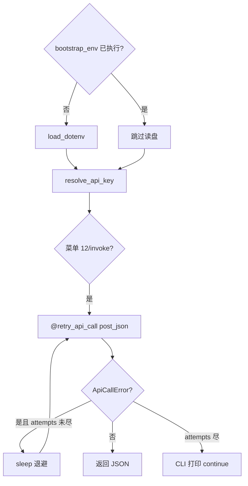

### 18.2 分组

- A 组 L01~L16：dotenv、装饰器、生成器  
- B 组 L17~L30：CLI 与安全  
- C 组 L31~L45：配置、发布、回归  

---

## 19. 配置安全评审

### 19.1 评审问题清单

| # | 问题 | 通过标准 |
|---|---|---|
| 1 | Key 是否仅 env/.env？ | JSON 无 key |
| 2 | .env 是否不进 Git？ | gitignore + 无真实 .env in repo |
| 3 | 菜单 13 是否脱敏？ | mask_secret |
| 4 | load_dotenv override 默认？ | False |
| 5 | 重试是否有限？ | max_attempts |
| 6 | 重试是否只 ApiCallError？ | 是 |
| 7 | bootstrap 是否单例？ | _dotenv_bootstrapped |
| 8 | 退出码是否未扩散？ | 0/2/3 |
| 9 | 依赖是否声明？ | python-dotenv |
| 10 | test_cli 是否断言无明文 Key？ | assert not in stdout |

### 19.2 配置分层图

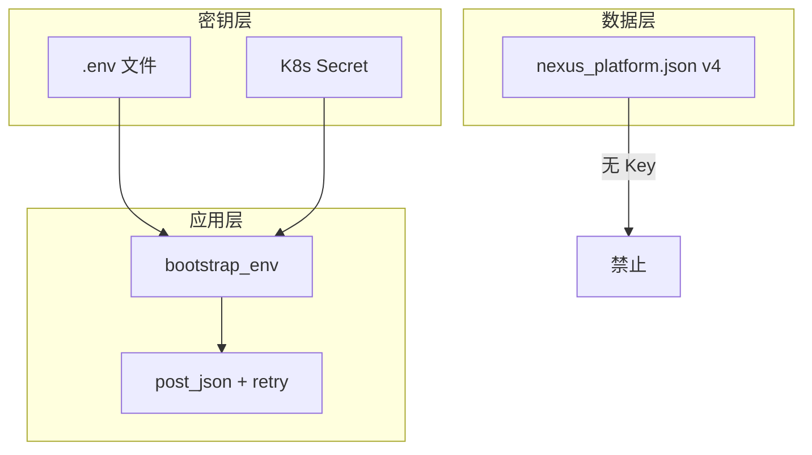

### 19.3 技术债

| 债务 | 偿还日 |
|---|---|
| 401 仍重试 | Day 18 |
| take_last 全收集 | Day 17 环形缓冲 |
| 同步 requests | Day 25 async |
| 无结构化日志 | Day 14 |
| 无 timeout 装饰器 | 挑战作业 |

### 19.4 评审结论模板

“装饰器路径覆盖实验室 L01~L45 通过；**配置安全评审** 10 项全通过；401 分流记 Day 18。”

---

## 20. 复盘与 Day 14

### 20.1 今日保持

- Schema v4 与 document_index 回归。  
- 退出码 **0 / 2 / 3** 不变。  
- 菜单 9/10/11/12 行为兼容，12 增加透明重试。  
- **API Key 永不写入 nexus_platform.json**。  
- Mock 服务器 + requests 单测仍有效。  
- ApiCallError 菜单内 recover。  

### 20.2 今日停止

- 把 api_key 写入 model_config。  
- commit 真实 `.env`。  
- print 完整 Key 调试。  
- 无限重试 while True。  
- 本日全项目改 asyncio（仅预习）。  

### 20.3 Day 14 预览

Day 14 引入 **结构化日志**：`trace_id` 贯穿 CLI → HTTP → 持久化；错误日志仍 **不** 记录 Key；与今日 `mask_secret` 衔接。

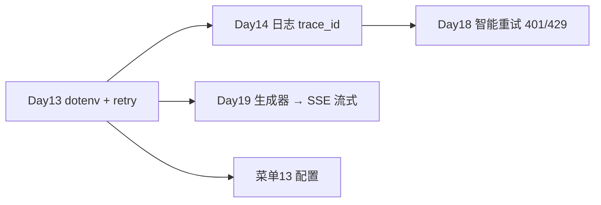

### 20.4 与课程主线

| 天 | 能力 |
|---|---|
| Day 12 | HTTP + Chat Completions |
| Day 13 | dotenv + 装饰器重试 + 生成器 |
| Day 14 | 日志与 trace |
| Day 17 | token 窗口 |
| Day 19 | SSE 流式 |
| Day 25 | async HTTP |

### 20.5 结语

Day 13 让 NexusAI 从「能调 API」升级为「**配置可移植、调用有韧性、类型可读、历史可流式扩展**」：**装饰器原理、重试与超时治理、python-dotenv 配置、类型注解入门、生成器与 yield、asyncio 预习、菜单 13 脱敏配置**，是从脚本走向工程的分水岭。跑绿 dotenv/decorators/generators/cli/release 五测，即完成平台 resilience 与 secrets hygiene 的关键一跃。

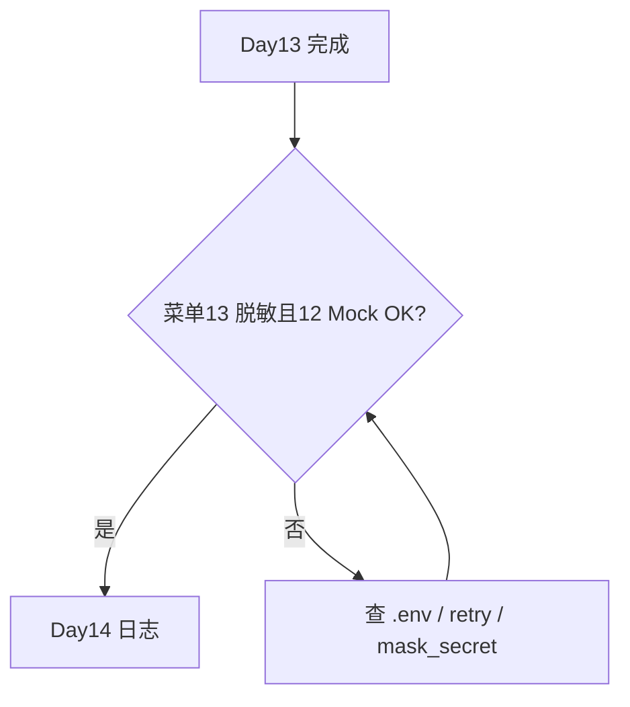

---

## 21. 代码阅读顺序

1. `nexus/config/env_loader.py` — load_env、mask_secret  
2. `nexus/http/config.py` — bootstrap_env、resolve_*  
3. `nexus/http/decorators.py` — retry_api_call  
4. `nexus/http/client.py` — 类型别名 + @retry_api_call  
5. `nexus/utils/generators.py` — iter_message_dicts、take_last  
6. `nexus/models/base.py` — invoke_api 间接用重试  
7. `nexus/cli/app.py` — 菜单 13  
8. `tests/test_dotenv.py` — 配置测试范本  
9. `tests/test_decorators.py` — flaky 范本  

---

## 22. OpenAI / Qwen 与重试说明

供应商 429/503 时，OpenAI 与 DashScope 文档均建议 **exponential backoff**。NexusAI 0.0.13 在客户端用 `retry_api_call` 统一实现，不区分供应商；切换 provider 仍只需改 `model_config` 与环境 base URL，**无需改装饰器**。

| 供应商 | 默认 base | 重试层 |
|---|---|---|
| qwen | DashScope compatible-mode/v1 | post_json 装饰器 |
| openai | api.openai.com/v1 | 同上 |

---

## 23. 术语表

| 术语 | 含义 |
|---|---|
| 装饰器 | 增强 callable 的高阶函数 |
| 指数退避 | 逐次增加 sleep 间隔 |
| dotenv | 从 .env 加载到 os.environ |
| bootstrap_env | 进程内首次 dotenv 加载 |
| mask_secret | 密钥脱敏展示 |
| Generator | yield 惰性迭代器 |
| TypeVar | 泛型类型变量 |
| asyncio | 协作式并发框架 |
| ApiCallError | 可重试 HTTP 业务错误 |
| Schema v4 | 无密钥的持久化契约 |

---

## 24. 教学质量门禁

| 指标 | 目标 |
|---|---:|
| 课件字符 | ≥30000 |
| Mermaid | ≥9 |
| 必备章节 | 全部 |
| 菜单 13 脱敏 | 通过 |
| retry 装饰器 | 通过 |
| Schema v4 无 key | 通过 |
| exit 0/2/3 不变 | 通过 |
| 五层测试 | 通过 |

---

## 25. 延伸阅读

- Python 文档：Decorators、typing、asyncio  
- python-dotenv README：load_dotenv、override  
- PEP 484 / PEP 585：类型注解  
- OpenAI API：Rate limits、Retries  
- 12-Factor App：Config 章节  

---

*课件版本：Day 13｜NexusAI 0.0.13｜字符数与 Mermaid 数以构建脚本验收为准*
