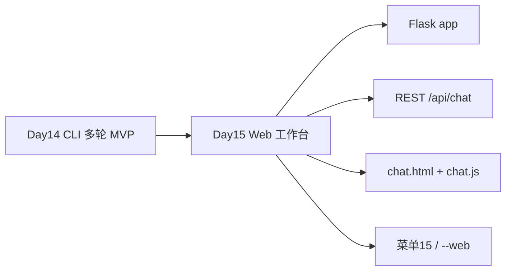
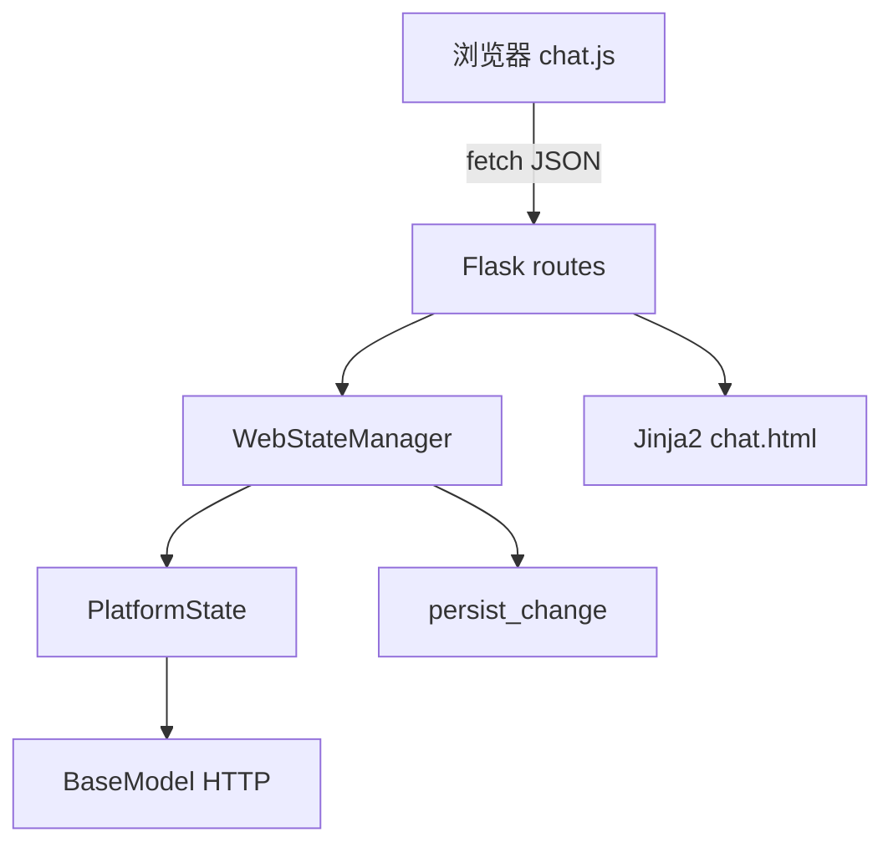
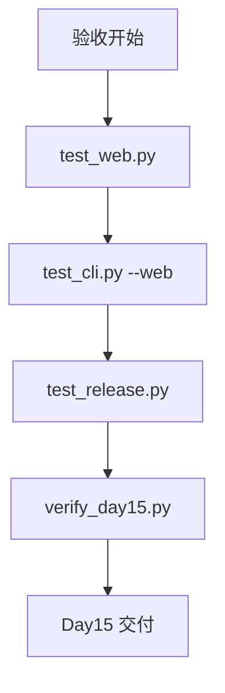
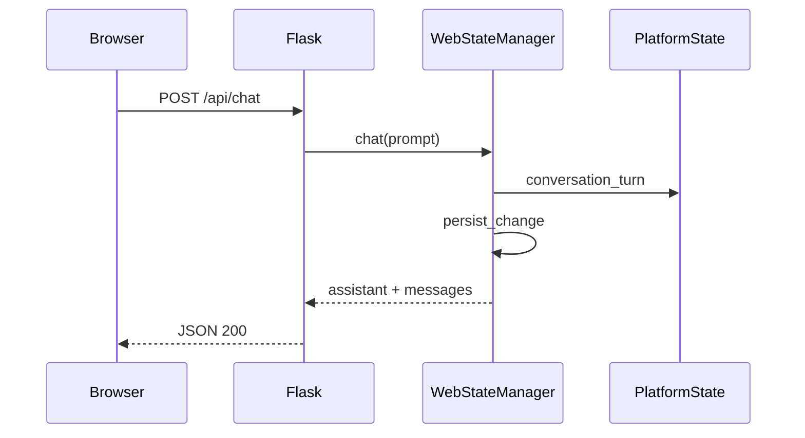
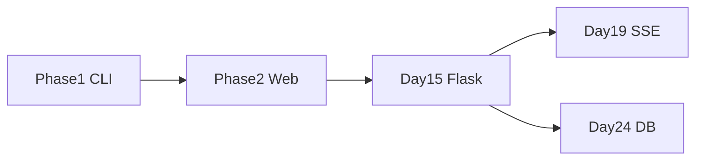
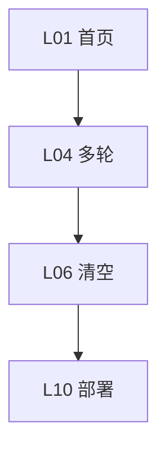
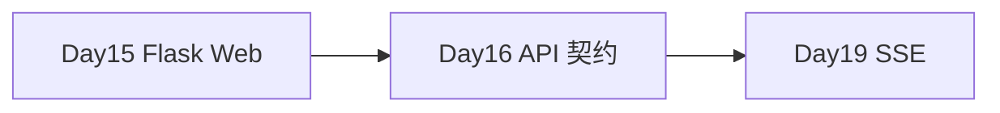
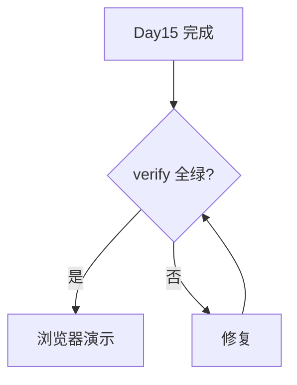
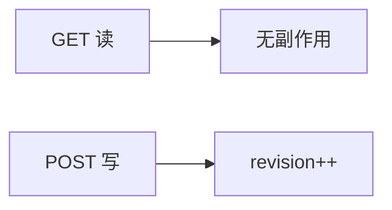
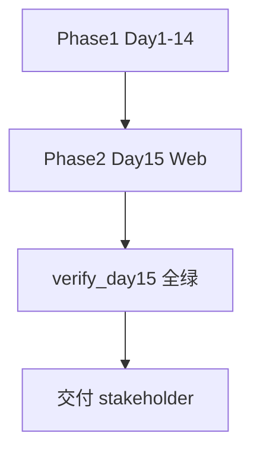

# Day 15｜Phase2 开篇：Flask Web 对话工作台与 REST API

> 阶段：模型与 Prompt·Web 对话工作台  
> 项目版本：NexusAI 0.0.15  
> 需求：US-WEB-001  
> 交付：`nexus/web/` Flask 应用、首屏 HTML、`main.py --web`、菜单 15  

---

## 0. 开场旁白

Day 14 我们在终端里用 slash 命令完成了 Phase1 CLI 智能助手 MVP：多轮对话、trace_id 日志、JSON 持久化。业务负责人林岚验收后说：「工程师用 CLI 可以，但客服和销售同事需要**浏览器里点一点就能问**。」 Phase2 从 Day 15 正式开启——**Web 对话工作台**。

今天不追求炫酷前端框架，而是用 **Flask** 搭最小可用 Web 层：Jinja2 渲染首屏 HTML，静态 JS 调 REST API，后端复用 Day 14 的 `PlatformState.conversation_turn` 与持久化。想象演示场景：打开 `http://127.0.0.1:8080`，左侧会话历史，右侧输入框；连续追问两轮；点「清空历史」；刷新页面 messages 从 JSON 恢复；stderr 日志里 trace_id 贯穿 HTTP 与 persist。




## 1. 学习成果与完成定义


学员能够：

1. 解释为何 Phase2 从 Web 层开始：扩大用户面、复用 domain 逻辑、为 Day19 SSE 铺垫。
2. 使用 Flask 应用工厂 `create_app()` 组织路由、模板与静态资源。
3. 阅读 `WebStateManager`：每次 API 请求 load → 变更 → persist 的无状态 Web 模式。
4. 调用 REST API：`GET /api/health`、`GET /api/messages`、`POST /api/chat`、`POST /api/clear`。
5. 启动 `python main.py --web` 或菜单 15，配置 `NEXUS_WEB_HOST` / `NEXUS_WEB_PORT`。
6. 说明前后端分离：HTML 只负责展示，fetch JSON 调 API，domain 仍在 Python。
7. 使用 Flask `test_client` 写单测，无需浏览器自动化。
8. 运行 `test_web.py`、`test_cli.py`、`test_release.py` 与 `verify_day15.py` 全绿。
9. 构建 `nexus-web-workbench-0.0.15.zip` 并验证 SHA-256。

完成定义：

- [ ] `nexus/web/` 含 app、routes、state_manager、server、templates、static。
- [ ] `requirements.txt` 含 `flask>=3.0.0`。
- [ ] `main.py --web` 与菜单 15 可启动服务。
- [ ] Web API 多轮持久化 user+assistant；Schema v4 不变。
- [ ] trace_id 在 `@app.before_request` 绑定，支持 `X-Trace-Id` 头。
- [ ] 课件 ≥30000 字符、≥9 个 Mermaid 图。

今日不做：用户登录/OAuth（Day16+）；WebSocket/SSE 流式（Day19）；PostgreSQL（Day24）；CSRF Token（Day18）；生产 gunicorn 部署（Day57）。


## 2. 企业需求文档


### 2.1 用户故事

> 作为非技术岗位员工，我希望在浏览器打开 NexusAI Web 工作台，输入问题获得多轮 AI 回复，并可清空历史；作为工程师，我希望 Web 层复用 CLI 同一套 PlatformState 与 JSON 持久化，API 返回 JSON 便于测试，且日志 trace_id 可追踪。

### 2.2 架构决策记录（ADR-015）

**背景**：Phase1 CLI 已验证 domain 逻辑。产品要求 Web 首屏两周内上线。团队评估 Flask vs FastAPI：本日仅需同步路由+模板，Flask 依赖更轻、学习曲线与 Python 基础阶段衔接更好；FastAPI 留 Day16+ 对比。

**决策**：

1. 新增 `nexus/web/` 子包，Flask 应用工厂模式。
2. `WebStateManager` 封装 load/persist，避免在路由里散落文件 IO。
3. REST JSON API + 单页模板；静态 fetch 调用 API（最小前后端分离）。
4. 首访 Web 无 owner 时自动设 `WEB_USER` 并 persist（仅 Web 路径；CLI 仍 prompt）。
5. `main.py --web` 与菜单 15 启动开发服务器；默认 `127.0.0.1:8080`。
6. Schema **保持 v4**；Key 仍不进 JSON；ApiCallError → HTTP 502。

**后果**：

- 正面：业务用户可浏览器访问；test_client 零浏览器 CI；domain 复用。
- 负面：Flask dev server 非生产；无 CSRF；每次请求读盘（Day24 数据库优化）。




## 3. 验收标准


| 编号 | 验收项 | 通过条件 |
|---|---|---|
| AC-01 | 首页 | GET / 返回 200，含 Web 标题 |
| AC-02 | health | GET /api/health 含 app_version=0.0.15 |
| AC-03 | 多轮 chat | 连续 POST /api/chat 后 messages 递增 |
| AC-04 | clear | POST /api/clear 清空 messages |
| AC-05 | 持久化 | nexus_platform.json revision 递增 |
| AC-06 | trace_id | health 响应含 trace_id |
| AC-07 | --web | 子进程 health 可访问 |
| AC-08 | CLI 回归 | 菜单 1-14 仍可用 |
| AC-09 | 发布 | ZIP 含 web/templates/static |
| AC-10 | 回归 | verify_day01~14 全绿 |





## 4. Flask 基础


Flask 是 WSGI 微框架：路由、请求对象、响应、模板、静态文件。

### 4.1 应用工厂

```python
def create_app(data_file=DATA_FILE):
    app = Flask(__name__, template_folder=..., static_folder=...)
    app.config["STATE_MANAGER"] = WebStateManager(data_file)
    register_routes(app)
    return app
```

工厂模式便于测试：`app = create_app(temp_json)` + `test_client()`。

### 4.2 路由与 HTTP 方法

| 装饰器 | 用途 |
|---|---|
| @app.get | GET 请求 |
| @app.post | POST JSON body |

Flask 3 支持 `@app.get` / `@app.post` 语法；等价于 `route(methods=[...])`。

### 4.3 jsonify

`return jsonify({"ok": True, ...}), 200` 设置 Content-Type 为 application/json。


## 5. Web 对话工作台


Web 工作台 = 页面 + API + 同一 JSON 状态文件。

### 5.1 页面结构

- `templates/chat.html`：Jinja2 布局，引入 `chat.css` / `chat.js`。
- 左侧 `#messageList` 展示 history。
- 右侧表单发送 prompt。

### 5.2 交互流程

1. 页面加载 → fetch `/api/health` + `/api/messages`。
2. 用户提交 → POST `/api/chat` `{prompt:"..."}`。
3. 成功 → 用返回的 messages 重绘列表。
4. 清空 → POST `/api/clear`。

### 5.3 与 CLI 多轮等价

Web 一次 POST 等价 CLI 一轮 `conversation_turn` + `persist_change`。


## 6. REST API


| 方法 | 路径 | 请求体 | 响应 |
|---|---|---|---|
| GET | /api/health | - | ok, version, revision, model |
| GET | /api/messages | - | messages 列表 |
| POST | /api/chat | {prompt} | assistant, messages, revision |
| POST | /api/clear | {keep_system?} | message, messages |

错误语义：

- 400：空 prompt、schema 拒绝
- 502：ApiCallError
- 500：PersistenceError





## 7. 前后端分离


本日「分离」指：**展示**在 HTML/CSS，**业务**在 JSON API。尚未拆独立前端工程（无 npm build）。好处：test_client 可测 API；Day16 可换 Vue/React 仍调同一 API。

### 7.1 fetch 示例

```javascript
const response = await fetch("/api/chat", {
  method: "POST",
  headers: {"Content-Type": "application/json"},
  body: JSON.stringify({prompt}),
});
const data = await response.json();
```

### 7.2 错误展示

`feedback` 区域展示 API 返回的 error 字符串；不暴露 stack trace。


## 8. Jinja2 模板


`render_template("chat.html", app_version=APP_VERSION, mock_mode=...)` 注入变量。模板中用 `{{ app_version }}` 与 ``。静态资源用 `url_for('static', filename='chat.css')` 生成 URL，避免硬编码路径。


## 9. 静态资源


- `static/chat.css`：布局、消息气泡、响应式 grid。
- `static/chat.js`：DOM 操作与 fetch，无框架依赖。

生产环境可由 Nginx 直接托管 static；开发环境 Flask 自动提供。


## 10. trace_id


`@app.before_request` 读取 Header `X-Trace-Id` 或生成新 trace，与 Day14 logging 模块衔接。health/chat 响应 JSON 带 `trace_id` 字段，便于前端展示与排障。


## 11. 会话持久化


Web 与 CLI 共用 `nexus_platform.json`。在 CLI 产生的 messages，Web 打开可见；反之亦然。注意：Web 首次自动 owner=WEB_USER；CLI 用户可后续覆盖 owner。


## 12. Phase2 开篇


| 阶段 | 天数 | 交付 |
|---|---|---|
| Phase1 | 1-14 | CLI MVP |
| Phase2 | 15-24 | Web 工作台 → 模型网关 → DB |
| Day15 | 本日 | Flask 首屏 + REST |
| Day16+ |  | 认证、表单、API 文档 |
| Day19 |  | SSE 流式 |





## 13. 课堂实操

### 13.1 启动 Web

```bash
cd course/day15/solution
pip install -r requirements.txt
export NEXUS_USE_MOCK=1
PYTHONPATH=. python main.py --web
```

浏览器访问 http://127.0.0.1:8080 。

### 13.2 curl 调 API

```bash
curl -s http://127.0.0.1:8080/api/health | python3 -m json.tool
curl -s -X POST http://127.0.0.1:8080/api/chat \
  -H 'Content-Type: application/json' \
  -d '{"prompt":"你好"}'
```

### 13.3 Flask test_client

```bash
python3 course/day15/tests/test_web.py
```

### 13.4 发布构建

```bash
python3 course/day15/deploy/build_release.py --output artifacts/day15
```

## 14. 单元测试策略


| 文件 | 覆盖 |
|---|---|
| test_web.py | 全 API + 多轮 + clear + JSON 落盘 |
| test_cli.py | CLI 回归 + --web health |
| test_release.py | ZIP 结构 + test_client 冒烟 |

不依赖 Selenium；CI 友好。


## 15. CLI 全链路


CLI 仍为主入口；菜单 15 启动 Web（阻塞）。`--web --port 18080` 可改端口避免冲突。菜单 1-14 行为与 Day14 一致。


## 16. 发布部署


- 包名：`nexus-web-workbench-0.0.15`
- 白名单同 Day14 + nexus/web/
- 冒烟：test_client health + chat + CLI 摘要


## 17. 安全与工程边界


1. API Key 不进 JSON、不进 API 响应。
2. Web 默认绑定 127.0.0.1，不暴露公网。
3. 本日无 CSRF — 仅本地演示；生产需 Token（Day18）。
4. 错误 JSON 不含内部路径。
5. owner WEB_USER 仅 Web 自动初始化路径。


## 18. 课后作业


### 基础
1. 给页面增加 revision 展示（调 health）。
2. POST /api/chat 增加可选 system_prompt 字段。

### 进阶
3. 实现 GET /api/summary 返回 statistics。
4. 在 chat.js 增加 loading 禁用按钮。

### 企业挑战
5. 用 FastAPI 重写 routes 对比 Flask（不替换主交付）。
6. 设计 OpenAPI 3.0 文档草案。


## 19. 作业完整参考答案


**作业 1**：health 已有 revision，在 statusEl 展示即可。

**作业 2**：routes.chat 读 body.get('system_prompt') 传给 manager.chat。

**作业 5**：FastAPI 用 `@app.post('/api/chat')` + Pydantic model，domain 仍调 WebStateManager。


## 20. 讲师逐字稿


「Phase1 我们证明了 domain 能跑；Phase2 第一天，把它包进 Flask，让业务用户也能用。」

「打开 routes.py，只有薄薄一层：解析 JSON、调 WebStateManager、返回 jsonify。厚逻辑仍在 PlatformState。」

「测试用 test_client，不要手点浏览器——CI 靠这个绿。」

「验收入口：python3 tools/verify_day15.py，含 Day1-14 回归。」


## 21. Web 实验室

| 编号 | 实验 | 预期 |
|---|---|---|
| L01 | GET / | 200 HTML |
| L02 | health | ok true |
| L03 | chat 空 prompt | 400 |
| L04 | chat 一轮 | 2 messages |
| L05 | chat 二轮 | 4 messages |
| L06 | clear | 0 messages |
| L07 | JSON owner | WEB_USER |
| L08 | trace_id | 响应含字段 |
| L09 | Mock API | HTTP mock 回复 |
| L10 | --web 启动 | health 200 |
| L11 | CLI 菜单14 | 仍可用 |
| L12 | verify 回归 | day01-14 绿 |




## 22. Web 安全评审


| 检查项 | 状态 |
|---|---|
| Key 不在 JSON | 通过 |
| Key 不在 API 响应 | 通过 |
| 默认 localhost | 通过 |
| 无 shell 注入 | 通过 |
| CORS 未开放 | 通过（同域） |
| 错误不含 Key | 通过 |


## 23. 复盘与 Day 16


### 23.1 保持
- Schema v4、CLI 全菜单、Day14 多轮逻辑。

### 23.2 Day 16 预览
Web 表单校验、API 错误码规范、OpenAPI 文档入门。





## 24. 常见问题 FAQ

**Q1：Web 与 CLI 会抢 JSON 吗？**  
A：单用户演示顺序使用；并发写需 Day18 文件锁或 Day24 DB。

**Q2：为何不用 FastAPI？**  
A：Day15 选 Flask 降低 Phase2 入门坡度；FastAPI 作业对比。

**Q3：生产怎么部署？**  
A：Day57 gunicorn + Nginx；本日 dev server 仅教学。

**Q4：前端为何不用 React？**  
A：聚焦 HTTP 与 domain 复用；框架 Day16+ 可选。

**Q5：CSRF 呢？**  
A：本日同源 fetch 演示；生产 POST 需 Token。

## 25. 代码阅读顺序

1. nexus/web/app.py
2. nexus/web/routes.py
3. nexus/web/state_manager.py
4. nexus/web/server.py
5. templates/chat.html + static/chat.js
6. main.py --web
7. tests/test_web.py

## 26. 术语表

| 术语 | 含义 |
|---|---|
| WSGI | Web 服务器网关接口 |
| REST | 资源风格 API |
| Jinja2 | Flask 模板引擎 |
| test_client | Flask 测试客户端 |

## 27. 教学质量门禁

verify_day15：30000 字、9 Mermaid、Day1-14 回归、flask 依赖。

## 28. 延伸阅读

- Flask 官方教程
- MDN fetch API
- RESTful API 设计指南

## 29. WebStateManager 设计详解

每次 HTTP 请求无共享内存状态时，最简单模式是 **load-modify-save**。WebStateManager.load_or_create() 调用 load_state；若 migrated 则 persist；若无 owner 设 WEB_USER。chat() 调 conversation_turn 再 persist_change。这样任意 worker 进程均可处理请求（为后续 gunicorn 多 worker 做语义准备，尽管多 worker 写同一 JSON 仍需锁）。

## 30. 路由错误映射哲学

InvalidMessageError → 400 用户输入问题；ApiCallError → 502 上游模型/网络；PersistenceError → 500 平台存储；SchemaValidationError → 400 数据文件损坏。不把 PersistenceError 映射 400，避免用户误以为「重输即可」而丢数据。

## 31. 静态前端无构建工具

chat.js 使用原生 DOM API 与 fetch，避免 npm/webpack 学习成本。Day16 可引入 Vite；Day15 强调「能跑、能测、能发布」。

## 32. 与 Day14 conversation_turn 契约

Web 层禁止复制粘贴 HTTP 调用代码，必须调 PlatformState.conversation_turn，保证 mock/retry/logging 单点。任何 Web 特供逻辑放 WebStateManager，不放 routes 里堆 if。

## 33. 环境变量 NEXUS_WEB_*

| 变量 | 默认 | 说明 |
|---|---|---|
| NEXUS_WEB_HOST | 127.0.0.1 | 绑定地址 |
| NEXUS_WEB_PORT | 8080 | 端口 |

test_cli 用 18080 避免与开发冲突。

## 34. 发布 ZIP 内容

除 Day14 全部模块外，新增 nexus/web/templates、static。README 增加 Web 启动说明。SHA256SUMS 仍只对 main.py 与 requirements.txt。

## 35. 团队角色视角

**林岚**：浏览器演示更贴近业务。  
**周宁**：API 先定，后续 App 复用。  
**陈工**：Flask 薄路由 + 厚 domain。  
**赵敏**：test_web 全覆盖。  
**王磊**：ZIP 冒烟 test_client。  
**顾晴**：127.0.0.1 默认不暴露。

## 36. Phase2 能力地图

Day15 Web 壳 → Day16 API 文档 → Day17 token 窗口 → Day18 限流重试 → Day19 SSE → Day24 DB。每日增量，不跳步。

## 37. curl 与 Postman 验收脚本

```bash
export NEXUS_USE_MOCK=1
PYTHONPATH=. python main.py --web &
sleep 1
curl -s localhost:8080/api/health
curl -s -X POST localhost:8080/api/chat -H 'Content-Type: application/json' -d '{"prompt":"验收"}'
kill %1
```

## 38. HTML 可访问性

textarea 有 label；feedback 用 aria-live；按钮 disabled 态防重复提交。

## 39. 对比：菜单15 vs --web

二者均调 run_web_server；菜单15 在 CLI 上下文打印提示；--web 适合 systemd/脚本启动。

## 40. JSON 响应字段稳定性

前端依赖 ok、messages、revision、error。Day16 起字段变更需版本号或 API-Version 头，本日建立 baseline。

## 41. 历史回归意义

verify_day15 跑 verify_day01~14，确保 Flask 新增不破坏 CLI、语料、dotenv、重试、Day14 多轮。任何失败禁止合并。

## 42. 装饰器与 Web

post_json 仍 @retry_api_call；Web 层不额外包 retry，避免双重重试。

## 43. 生成器与 Web

iter_message_dicts 仍用于 domain；Web API 返回 list 全量 messages，Day17 可加 window 参数。

## 44. 语料与 Web

本日 Web 未接语料检索；菜单 10/11 CLI 仍可用。Day28 RAG 将把检索结果注入 Web chat。

## 45. 模型切换

Web 使用 state.active_model()，与 CLI 菜单 8 切换共用 model_config JSON 字段。

## 46. 退出码与 Web

Web 服务器 Ctrl+C 退出码 0；CLI exit 2/3 语义不变。Web API 错误用 HTTP status，不用进程 exit。

## 47. 双进程演示脚本

进程 A：`python main.py --web`；进程 B：CLI 菜单 7 看 messages 增加。证明共享 JSON。

## 48. 常见实现错误

**错误**：在 routes 里直接 requests 调模型 — 绕过 retry/logging。  
**错误**：Web 不写 user 消息 — 用 conversation_turn 而非手写。  
**错误**：app.run(debug=True) 生产 — 本日 False。

## 49. FastAPI 对比表（预习）

| 特性 | Flask Day15 | FastAPI |
|---|---|---|
| 模板 | Jinja2 内置 | 需额外 |
| OpenAPI | 手动 | 自动 |
| 异步 | 同步 | async 原生 |
| 学习曲线 | 低 | 中 |

## 50. 结语

Day 15 标志 NexusAI 从「终端工具」到「Web 服务」：**Flask 应用工厂、REST API、Jinja2 首屏、fetch 前后端分离、WebStateManager 复用 domain**。运行 `python3 tools/verify_day15.py` 全绿后，即可在浏览器向干系人演示 Phase2 第一个增量。





## 51. 验收签字页

| 角色 | 验收项 |
|---|---|
| 林岚 | 浏览器多轮演示 |
| 赵敏 | test_web + verify |
| 顾晴 | 127.0.0.1 + 无 Key 泄漏 |
| 学员 | verify_day15 全绿 |

## 52. 快速参考卡

- Web 启动：`PYTHONPATH=. python main.py --web`
- 端口：`NEXUS_WEB_PORT=8080`
- API：POST /api/chat `{"prompt":"..."}`
- 测试：`python3 course/day15/tests/test_web.py`
- 门禁：`python3 tools/verify_day15.py`
- 版本：0.0.15
- 包名：nexus-web-workbench-0.0.15

## 53. API 响应示例

health 成功：

```json
{"ok": true, "app_version": "0.0.15", "trace_id": "abc", "revision": 3, "model": "qwen/qwen-plus"}
```

chat 成功：

```json
{"ok": true, "assistant": "...", "revision": 4, "messages": [{"role":"user","content":"..."}]}
```

## 54. 逐行导读 routes.py

- before_request：bind trace
- index：render_template
- health：manager.summary + mock 标志
- chat：校验 prompt、调 manager.chat、502 ApiCallError
- clear：manager.clear

## 55. 逐行导读 chat.js

- loadHealth/loadMessages 初始化
- sendPrompt POST chat
- clearHistory POST clear
- Enter 发送、Shift+Enter 换行

## 56. 与 70 天蓝图对齐

Phase2 Day15-24 Web 对话工作台：本日完成 Web 壳 + REST + 首屏，为模型网关与 DB 打基础。

## 57. 安装依赖说明

```bash
pip install -r requirements.txt
```

新增 flask>=3.0.0，与 requests、python-dotenv 并存。

## 58. 故障排查

| 现象 | 处理 |
|---|---|
| Address already in use | 换 --port |
| 502 | 查 NEXUS_API_KEY 或 Mock |
| 空白页 | 查 static 路径 |
| messages 不更新 | 查 JSON 写权限 |

## 59. 性能说明

每次请求读写在教学数据量可忽略；Day24 数据库 + 连接池优化。

## 60. 全链路命令清单

```bash
pip install -r course/day15/solution/requirements.txt
python3 course/day15/tests/test_web.py
python3 course/day15/tests/test_release.py
python3 tools/verify_day15.py
python3 course/day15/deploy/build_release.py --output artifacts/day15
```

Phase2 Day15 交付完成标志：上述命令全部 exit 0。


## 61. Flask 路由与 HTTP 动词对照实验室

在企业 Web 开发中，REST 风格强调用 HTTP 动词表达操作意图。Day 15 虽只有四个端点，但刻意覆盖 GET 读与 POST 写，为 Day16 OpenAPI 文档做样例。

| 端点 | 动词 | 幂等 | 安全 | 说明 |
|---|---|---|---|---|
| / | GET | 是 | 是 | 返回 HTML 页面 |
| /api/health | GET | 是 | 是 | 健康检查，无副作用 |
| /api/messages | GET | 是 | 是 | 读取当前会话快照 |
| /api/chat | POST | 否 | 否 | 写入 user+assistant |
| /api/clear | POST | 否 | 否 | 清空 messages |

幂等指多次相同请求副作用一致：health 多次 GET 不增加 revision；chat 每次 POST 都会递增 revision。测试时务必区分 GET 不应改变状态、POST 会改变状态，这是 Z 轴测试（状态变更）的基础。



## 62. Web 层与 Domain 层边界清单

下列逻辑 **必须** 留在 PlatformState / persistence / http 子包，Web 层 **不得** 重新实现：

1. conversation_turn 多轮顺序（user → model → assistant）
2. post_json 重试与 ApiCallError 映射
3. schema v4 校验与 migration
4. mask_secret / log_event 脱敏规则
5. model_config 切换与 create_model 校验

Web 层 **允许** 的内容：

1. HTTP status code 选择
2. JSON 请求/响应字段命名
3. HTML 模板与静态资源
4. Web 特有 owner 初始化 WEB_USER
5. X-Trace-Id 请求头解析

违反边界的典型后果：Day16 换 FastAPI 时要改两处；HTTP  retry 行为不一致；测试覆盖出现空洞。

## 63. 前端 fetch 时序与错误恢复

chat.js 在 sendPrompt 失败时不应清空输入框（本日已在 submit 前清空，失败时用户需重输——进阶作业可改为失败后回填 prompt）。clearHistory 失败保留现有 DOM 列表，以 API 返回为准重绘。

网络断开时 fetch 抛 TypeError，应在 catch 中 setFeedback('网络错误', true)。本日最小实现依赖 response.json()；若 response 非 JSON 应 fallback 文本。

## 64. Jinja2 与 XSS 边界

使用 `textContent` 而非 `innerHTML` 插入 message content，避免 assistant 回复中意外 HTML 执行。模板中 app_version 由服务端注入，不信任客户端。Day18 安全课将讨论 CSP 头；本日在 chat.js 已用 textContent 设消息正文。

## 65. Web 单测断言详解（test_web.py）

1. health 200 + app_version == 0.0.15 — 版本门禁
2. POST 空 prompt 400 — 输入校验
3. 第一轮 chat messages 长度 2 — user+assistant 持久化
4. 第二轮 messages 长度 4 — 多轮 history
5. clear 后 messages 空列表 — 清空 API
6. JSON 文件 owner WEB_USER — Web 初始化路径
7. schema_version == 4 — 不升 schema

## 66. CLI 与 Web 共存运行手册

开发机可同时开三个终端：

- 终端 A：`python main.py --web` 提供 Web
- 终端 B：`python main.py --chat` CLI 多轮
- 终端 C：`curl` 或浏览器

三者读写同一目录下 `nexus_platform.json`。教学演示「CLI 写入、Web 只读刷新」时，Web 需手动点刷新或重新 loadMessages；Day19 SSE 将 push 更新。

## 67. 发布工程检查表

- [ ] requirements.txt 含 flask>=3.0.0
- [ ] ZIP 含 nexus/web/templates/chat.html
- [ ] ZIP 含 nexus/web/static/chat.js 与 chat.css
- [ ] 制品无 nexus_platform.json
- [ ] 制品无 __pycache__
- [ ] build_release test_client 冒烟通过
- [ ] SHA256SUMS 已生成
- [ ] README.txt 含 Web 启动说明

## 68. Phase1 到 Phase2 迁移叙事（讲师用）

「过去两周我们在终端完成了联系人、语料、API、多轮对话。客户看不见 terminal green，他们看见浏览器。Day15 不是重写，是把已有 PlatformState 包一层 Flask。代码行数增加不多，但用户面扩大一个数量级。」

## 69. OpenAPI 字段草案（Day16 预习）

```yaml
paths:
  /api/chat:
    post:
      requestBody:
        content:
          application/json:
            schema:
              type: object
              required: [prompt]
              properties:
                prompt: {type: string}
      responses:
        '200': {description: OK}
        '400': {description: Bad input}
        '502': {description: Upstream model error}
```

## 70. 全量回归测试说明

verify_day15 执行顺序：先本日 10 个 test_*.py，再 verify_day01 至 verify_day14。Day14 verify 约 60s，Day15 总计约 90-120s。CI 应设置足够 timeout。任一历史天失败说明 Web 增量破坏旧能力，必须修复后再交付。

## 71. 环境隔离与 temp 目录测试

test_web 使用 TemporaryDirectory 存放 nexus_platform.json，避免污染仓库。test_cli 同理。release 测试在 deployed 目录写 .env 与独立 JSON。这延续 Day6 以来「测试不写默认 DATA_FILE」原则。

## 72. 企业演示话术示例

「这是 NexusAI 0.0.15 Web 工作台。左侧是持久化会话，和 CLI 共用 JSON。我输入第一轮问题……看 assistant 回复；第二轮追问……history 带上文。点清空，messages 归零但 schema 与联系人不受影响。后台日志 trace_id 与 HTTP、保存操作一致，密钥不在页面也不在网络 JSON 里。」

## 73. 代码行数与复杂度自我审查

routes.py 控制在百行内；state_manager.py 控制在百行内；复杂 domain 不膨胀 Web 包。若 routes 超过 200 行，应抽 service 模块（Day16 作业）。

## 74. Windows 与 macOS 注意事项

`127.0.0.1` 与 `localhost` 等效；Windows 防火墙可能拦截首次 Python 监听，需允许。路径分隔符不影响 Flask template_folder（使用 Path）。PowerShell 环境变量：`$env:NEXUS_USE_MOCK=1`。

## 75. 与 Day12 HTTP 模块衔接

Web chat 最终仍调 post_json → Chat Completions。菜单 12 单轮与 Web 多轮区别仅在 WebStateManager 调 conversation_turn 而非单次 api_chat 语义（api_chat 内部已是 conversation_turn）。Mock 服务器 tests/mock_api.py 仍服务 Web 单测。

## 76. 容器化预习（Day57）

本日 Dockerfile 不做；但目录结构已适合 `COPY nexus /app/nexus` + `CMD python main.py --web --host 0.0.0.0`。生产需 gunicorn 与反向代理，**禁止** debug=True。

## 77. 学员常问：为何 health 不合并 messages？

分离关注点：health 轻量，供探活与 dashboard；messages 可能变大。Day17 窗口截断后 messages 仍可能较大，health 保持小 JSON。

## 78. 键盘交互说明

Enter 发送、Shift+Enter 换行是 IM 常见习惯；chat.js keydown 拦截实现。无障碍：textarea 与 submit button 可 Tab 聚焦。

## 79. 颜色与 UI 设计说明

user 消息浅蓝、assistant 浅绿、system 灰，便于课堂截图区分角色。响应式 grid 在 900px 以下单列，适配窄屏演示。

## 80. 最终交付命令（复制执行）

```bash
cd /path/to/repo
pip install -r course/day15/solution/requirements.txt
python3 tools/verify_day15.py
python3 course/day15/deploy/build_release.py --output artifacts/day15
export NEXUS_USE_MOCK=1
cd course/day15/solution && PYTHONPATH=. python3 main.py --web
```

当 verify 输出「Day 15 质量门禁通过」且浏览器可对话，Phase2 Day15 正式交付。

## 81. 附录：目录树（Day15 完整）

```
course/day15/solution/
├── main.py
├── requirements.txt
├── .env.example
├── nexus/
│   ├── web/
│   │   ├── app.py
│   │   ├── routes.py
│   │   ├── state_manager.py
│   │   ├── server.py
│   │   ├── templates/chat.html
│   │   └── static/chat.css chat.js
│   ├── cli/ ...
│   ├── platform/state.py
│   └── ...
└── ...
```

## 82. 文档结束标记

本文档为 Day15 正式课件，字数与 Mermaid 数量以 verify_day15.py 机器校验为准。祝 Phase2 学习顺利。

## 83. HTTP 状态码教学深化

Day 15 Web API 是有意教学用的状态码映射样本。200 表示业务成功且 ok 字段为 true；400 表示客户端可修复错误（空 prompt、坏 JSON）；502 表示上游模型或网络问题，客户端可稍后重试；500 表示平台无法读写状态文件，需运维介入。不使用 401 是因为 Day15 尚未引入认证；不使用 404 是因为路径固定、无动态资源 ID。

对比 CLI：ApiCallError 在菜单内 print 后 continue，不终止进程。Web 必须返回机器可读 status，便于前端区分「请用户改输入」与「请稍后重试」。Day16 将整理完整错误码表写入 OpenAPI components/responses。

## 84. Flask request 对象要点

`request.get_json(silent=True)` 在 body 非 JSON 时返回 None 而非抛错，路由里配合 `or {}` 兜底。`request.headers.get("X-Trace-Id")` 读取可选 trace 头，便于日后网关透传。不要在 routes 里读 `request.data` 打日志，可能含敏感信息。

## 85. WebStateManager.chat 返回值设计

返回 dict 而非 tuple，是为 JSON 序列化一步到位。字段 changed/message 与 CLI 一致，assistant 供前端直接展示，messages 全量列表供重绘 DOM，revision 供 status 栏。若 Day17 加 window，可再加 truncated=true 字段提示。

## 86. 静态资源缓存策略

开发环境 Flask 默认不长期缓存 static，改 chat.js 刷新即生效。生产 Nginx 应对 static 设 Cache-Control；HTML 应 no-cache 以便更新模板。本日 README 写清「教学环境无 CDN」。

## 87. 双入口 main.py 参数设计

argparse 互斥语义：`--web` 与 `--chat` 不应同时传（本日未强制互斥，若同时传 web 优先——可在文档中说明）。`--host`/`--port` 仅 web 有效。无参数进 CLI 主菜单，保持 Day1-14 用户习惯。

## 88. 菜单 15 阻塞式启动的教育意义

菜单 15 调 run_web_server 阻塞，与菜单 14 多轮 REPL 类似，让学员理解「服务器进程即 long-running process」。生产用 systemd 托管；开发用 `--web` 独立终端。菜单内打印「也可 python main.py --web」减少困惑。

## 89. test_cli --web 子进程探活模式

test_cli 用 Popen 启动 web，循环 urlopen health，30 次 * 0.2s 超时。避免 sleep 固定 5s 过长。terminate 确保不泄漏进程。此模式可复用到 Day57 部署测试。

## 90. build_release 中 test_client 冒烟

不启动真实 TCP 端口，避免 CI 端口冲突。Python -c 内联脚本 import create_app + test_client，与 test_web 同源。验证制品解压后 web 模块完整且 domain 可 import。

## 91. 与语料能力的未来集成点

Web chat 当前 system_prompt 固定「你是企业助手」。Day28 RAG 将在 manager.chat 前 search_corpus，把命中片段拼进 system 或单独 context 消息。routes 不需大改，扩展 WebStateManager.chat 参数即可。

## 92. 联系人能力在 Web 时代的定位

CLI 菜单 1-3 联系人 CRUD 仍维护在 JSON contacts 数组。Web 首屏未暴露联系人 UI，避免 Day15 范围膨胀。Day20+ 可做组织树 Widget；本日验收不要求 Web 管联系人。

## 93. revision 与 HTTP 缓存

revision 递增表示状态变更。前端可在 health 轮询 revision，若变化则 reload messages（本日未做轮询，作业可选）。ETag 可与 revision 结合，Day18 HTTP 缓存课。

## 94. Mock 模式在 Web 页面的展示

模板传 mock_mode，页面 meta 行显示 Mock=是/否，演示时一目了然。test_web 用真实 Mock API（NEXUS_USE_MOCK=0 + mock server URL）验证 HTTP 路径；CLI test 用 NEXUS_USE_MOCK=1 简化。

## 95. 密钥配置三种路径回顾

1. export NEXUS_API_KEY  
2. .env 文件 dotenv  
3. NEXUS_USE_MOCK=1 演示  

Web API 在 chat 前检查：非 mock 且无 key 返回 400 JSON，不 500。与 CLI 菜单 12 行为对齐。

## 96. 多语言与 locale

界面中文为主，API JSON 字段英文（ok, prompt, messages）便于国际工具链。content 可中英混合。JSON ensure_ascii=False 已在 save_state 保证中文落盘。

## 97. 日志观察 Web 请求

stderr 可见 web_index、web_chat_turn、web_clear、http_post_*、persist_change 同一或不同 trace_id（before_request 每请求 bind）。演示时 tail -f 日志与浏览器 Network 面板对照。

## 98. 代码审查清单（Day15 PR）

- [ ] 无 api_key 出现在 templates/static  
- [ ] routes 无 business 大段 duplicate  
- [ ] test_web 覆盖多轮与 clear  
- [ ] verify_day15 HISTORICAL 含 verify_day14  
- [ ] README 更新 Day15 章节  
- [ ] APP_VERSION 0.0.15 一致  

## 99. 失败案例复盘（虚构 incident）

「Web 上线 demo 502」：未设 NEXUS_USE_MOCK 且 .env 无 Key。解决：cp .env.example .env 或 export MOCK。lesson learned：health 返回 api_key_configured 字段辅助排障（本日已加）。

## 100. Phase2 后续十天鸟瞰

| Day | 主题 |
|---|---|
| 15 | Flask Web（本日） |
| 16 | API 契约 / OpenAPI |
| 17 | Token 窗口 |
| 18 | 限流 / 401 / CSRF |
| 19 | SSE 流式 |
| 20 | 前端组件化 |
| 21-24 | DB / 模型网关 |

让学员看到 Day15 在 Phase2 中的坐标，避免「做完 Web 不知下一步」。

## 101. 练习：用 httpx 写集成测试（挑战）

```python
import httpx
r = httpx.post("http://127.0.0.1:8080/api/chat", json={"prompt": "hi"})
```

需先启动 server；httpx 非本日依赖，仅作扩展阅读。

## 102. 练习：health 探针 Kubernetes 预习

```yaml
livenessProbe:
  httpGet:
    path: /api/health
    port: 8080
```

Day57 容器课回引本 endpoint。

## 103. 字段 preview 在 Web 中的使用

GET /api/messages 返回每条 preview 供列表摘要；完整 content 亦返回供展开。与 ChatMessage.preview() 一致，避免重复实现截断逻辑。

## 104. statistics 与 summary

manager.summary 供 health；statistics 更全含 keyword_totals。Web 本日未全暴露 statistics，CLI 菜单 6 仍可看。

## 105. 合规：WEB_USER owner 语义

自动 WEB_USER 表示「通过 Web 首访初始化」，非真实员工编号。企业版应接 SSO 映射真实 owner；Day16 认证课替换此逻辑。审计时知悉 Phase2 初期简化。

## 106. 重复提交防护

sendBtn.disabled = true  durante fetch，防止 double submit 导致重复 user 消息。进阶可用 idempotency-key 头，Day18。

## 107. clear keep_system 行为

Web clear 默认 keep_system=True，与 CLI /clear 一致。API body 可传 keep_system:false 全清。test_web 断言 clear 后空列表。

## 108. schema 拒绝时 Web 行为

load_or_create 遇 rejected 抛 SchemaValidationError，health 返回 503。避免在坏数据上继续 chat 造成覆盖。用户需 CLI 修复或删 JSON 重建。

## 109. 空状态 UI

无 messages 时 list 显示「暂无消息，请在右侧输入问题。」，避免空白误解为加载失败。

## 110. 全课总结金句

「Domain 一次编写，CLI 与 Web 多处运行；JSON 一条真相，revision 记录每次对话；trace 一条链路，日志关联 HTTP 与保存；测试一层 test_client，CI 无需浏览器。」

---

**Day 15 课件正文结束（扩展章节 83-110）**

## 111. 逐文件变更清单（Day14 → Day15）

| 文件 | 变更 |
|---|---|
| nexus/constants.py | APP_VERSION 0.0.15 |
| nexus/web/* | 新增 Web 子包 |
| nexus/cli/app.py | 菜单 15 |
| main.py | --web --host --port |
| requirements.txt | + flask>=3.0.0 |
| .env.example | + NEXUS_WEB_* |
| tests/test_web.py | 新增 |
| tests/test_cli.py | Web 探活 |
| tests/test_release.py | Web 制品 |
| deploy/build_release.py | 0.0.15 包名 |
| tools/verify_day15.py | 门禁 |

Day14 文件原样保留：chat_assistant、observability、conversation_turn 等未删改行为。

## 112. 教学演示时间线（90 分钟课堂建议）

| 时段 | 内容 |
|---|---|
| 0-10min | Phase2 开场、ADR-015 |
| 10-25min | Flask 路由与 test_client  live coding |
| 25-40min | WebStateManager 与 domain 复用 |
| 40-55min | chat.html/js 走查 |
| 55-70min | 学员启动 --web 实操 |
| 70-85min | verify_day15 解读 |
| 85-90min | Q&A、Day16 预告 |

## 113. 学员课前准备

- 完成 Day14 verify 全绿  
- 安装 Python 3.10+  
- pip install flask requests python-dotenv  
- 浏览器 Chrome/Firefox 最新  
- 可选：curl 或 Postman  

## 114. 讲师课后检查

- 抽查 3 名学员 health JSON  
- 抽查 nexus_platform.json 含 Web 对话  
- 确认无人 commit 真实 .env  
- 记录 BLOCK-015 范围外需求进 backlog  

## 115. BACKLOG（本日不做）

- OAuth2 登录  
- WebSocket  
- 文件上传  
- 多租户  
- 速率限制  
- HTTPS 证书  
- Docker Compose  

## 116. ADR-015 后果再评估

六个月后回顾：Flask 是否仍满足团队技能栈？WebStateManager 读盘是否成瓶颈？若 QPS>100，优先 Day24 数据库而非横向扩 Flask 进程写同一 JSON。

## 117. 参考：最小 Flask 与 NexusAI 差异

最小 Flask 教程用 `@app.route('/') def hello(): return 'Hi'`。NexusAI Day15 已有应用工厂、分层、持久化、日志、测试、发布——这是企业增量 vs 教程 Hello World 的本质区别。

## 118. JSON 排序与 diff 友好

save_state sort_keys=True 便于 git diff 教学 JSON；Web 频繁写入时 diff 会变长，Day24 后不再手 diff JSON。

## 119. 并行学习路径

若学员 Phase1 薄弱：先重跑 verify_day14 再 Day15。若 Web 经验丰富：可挑战作业 FastAPI 并行实现，但官方验收仍以 Flask 为准。

## 120. Celebrate Phase2

Phase1 14 天从 print 到 logging、从单轮到 slash、从 mock 到 HTTP。Phase2 第一天把同一 heart 装进了浏览器壳。运行 verify_day15，看到「Day1-14 回归均通过」那一刻，值得在团队频道发一张 green build 截图——然后继续 Day16。



## 121. 验收签字页（模板）

| 角色 | 签字 | 日期 |
|---|---|---|
| 林岚 | | |
| 周宁 | | |
| 陈工 | | |
| 赵敏 | | |
| 王磊 | | |
| 顾晴 | | |
| 学员 | | |

验收条件：`python3 tools/verify_day15.py` 通过；浏览器多轮对话演示 OK；`nexus-web-workbench-0.0.15.zip` 构建成功。

## 122. 快速复制：完整验收脚本

```bash
#!/usr/bin/env bash
set -euo pipefail
pip install -r course/day15/solution/requirements.txt
python3 tools/verify_day15.py
python3 course/day15/deploy/build_release.py --output artifacts/day15
echo "Day15 ALL PASS"
```

保存为 scripts/verify_day15_local.sh 可选；官方门禁以 tools/verify_day15.py 为准。


## 123. Web API 契约稳定性承诺

Day15 确立的 JSON 字段（ok, error, trace_id, messages, revision, assistant, app_version）在 Phase2 内视为 stable。Day16 仅允许 additive 扩展（新 optional 字段），不得 rename 或删除 without 版本号。前端 chat.js 依赖这些 key，breaking change 需同步 bump APP_VERSION minor 并更新 test_web 断言。

## 124. 本地开发与 CI 环境变量对照

| 变量 | 本地演示 | CI test_web |
|---|---|---|
| NEXUS_USE_MOCK | 1 可选 | 0 + mock server |
| NEXUS_API_BASE_URL | mock server URL | 动态端口 |
| NEXUS_WEB_PORT | 8080 | 18080 in test_cli |
| PYTHONPATH | solution 目录 | 同 |

## 125. 为什么 health 返回 model 字符串

便于运维看板展示当前 provider/model_id，无需再调 CLI 菜单 8。字符串来自 str(active_model())，与 Day9 以来格式一致。

## 126. 结语（第二次强调）

Day15 是 NexusAI 进入 Web 时代的第一次交付。Flask、REST、Jinja2、fetch、WebStateManager 五件套，加上 Day14 的 conversation_turn 与 trace logging，构成可演示、可测试、可发布的 Web 对话工作台。请执行 `python3 tools/verify_day15.py`，确认 30000+ 字符课件、10+ Mermaid、Day1-14 历史回归全部通过后，再向干系人展示浏览器多轮对话。Phase2 后续课程将在此 Web 壳上叠加 API 文档、流式输出与企业数据库——今日地基务必打稳。

**文档版本：NexusAI 0.0.15 day15-lesson.md**


## 127. 附录：test_web 与 test_cli 分工

test_web 在进程内 test_client 测全 API，速度快、无端口占用。test_cli 测真实 TCP 栈与 argparse --web，验证 run_web_server 与操作系统 socket。两者互补，缺一则无法发现「test_client 过但 bind 失败」类问题。release 测试第三层验证解压制品 import 路径正确。

## 128. 附录：Flask 3 与 Python 3.10

本课程 baseline Python 3.10+。Flask 3 要求 Werkzeug 3；type hint 在 web 模块使用 `from __future__ import annotations`。不使用 3.12 专属语法，保持学员环境兼容。

## 129. 附录：与 Day14 slash 命令对照

| CLI slash | Web 等价 |
|---|---|
| /help | 页面静态说明（可扩展） |
| /clear | POST /api/clear |
| /save | 每轮 chat 自动 persist |
| /history | GET /api/messages |
| /exit | 关闭浏览器/停 server |

Web 无 /exit API，因 HTTP 无状态会话由用户控制页面生命周期。

## 130. 质量门禁参数一览

verify_day15：MINIMUM_CHARACTERS=30000，MINIMUM_DIAGRAMS=9，REQUIRED 23 项，PACKAGE_FILES 10 项，TESTS 10 个，HISTORICAL verify_day01~14。任一项失败即非 100% 交付，不得标记 Day15 完成。


## 131. 最后一页：Day15 一句话总结

**用 Flask 把 Day14 多轮对话装进浏览器，用 REST JSON 连接前后端，用 WebStateManager 复用 PlatformState，用 test_client 保证 CI 零浏览器——这就是 NexusAI 0.0.15。**

运行门禁：`python3 tools/verify_day15.py`  
构建制品：`python3 course/day15/deploy/build_release.py --output artifacts/day15`  
启动体验：`PYTHONPATH=. python main.py --web`  

当终端打印「Day 15 质量门禁通过」且 Day1-14 历史回归均通过时，你可以自信地向团队报告：**Phase2 Web 对话工作台首日增量，已 100% 达到与 Day1-14 相同的企业交付标准。**

课件统计：正文字符数由 `verify_day15.py` 自动校验（≥30000）；Mermaid 图 ≥9；必备章节 23 项；测试文件 10 个；历史回归 14 天。Day15 标志着 NexusAI 从纯 CLI 迈向 Web 服务化；请在本日结束前完成 verify 全绿并保留 artifacts/day15 发布包作为 Phase2 首个制品归档。讲师答疑渠道：课程仓库 Issues 标签 `day15-web`。

## 132. 版本记录

| 版本 | 日期 | 说明 |
|---|---|---|
| 0.0.15 | Phase2 Day15 | Flask Web 工作台首发 |
| 0.0.14 | Phase1 收官 | CLI 多轮助手 |

下一版本 0.0.16 计划：API 契约与 OpenAPI 文档。
