# Day 16｜API 契约、OpenAPI 3.0 与标准错误码

> 阶段：模型与 Prompt·Web 对话工作台  
> 项目版本：NexusAI 0.0.16  
> 需求：US-API-002  
> 交付：`nexus/web/openapi.py`、`errors.py`、`validation.py`、`/docs` Swagger UI  

---

## 0. 开场旁白

Day 15 我们用 Flask 把多轮对话搬进了浏览器：HTML + fetch + REST。测试工程师赵敏提单：「前端同学对接时，**错误返回有时是字符串有时是 200 里的 ok:false**，没有 machine-readable code；也没有**在线 API 文档**，每次对着 routes.py 猜字段。」 Day 16 的 NexusAI 0.0.16 给出工程答案：**OpenAPI 3.0 契约**、**标准 ErrorResponse**（`error.code` + `error.message` + `trace_id`）、**请求体校验**、**Swagger UI 文档页** `/docs` 与 **`GET /api/openapi.json`**。

Phase2 第二天，Web 从「能跑」升级为「**能契约、能对接、能审计**」。CLI 新增菜单 **16API契约** 打印文档地址；chat.js 显示 `[EMPTY_PROMPT]` 等错误码；domain 层 PlatformState **不变**；Schema **仍 v4**。


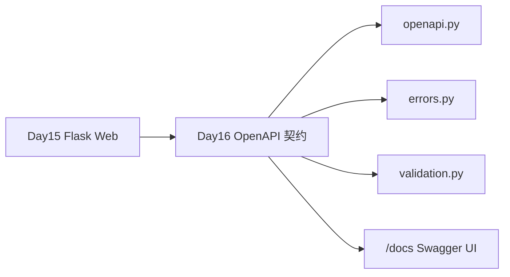

## 1. 学习成果与完成定义


学员能够：

1. 解释 API 契约：请求/响应/schema/错误码的显式约定，前后端与测试的共同语言。
2. 阅读 `build_openapi_spec()` 生成的 OpenAPI 3.0 JSON 结构：paths、components/schemas、responses。
3. 使用标准错误格式 `{ok:false, error:{code,message}, trace_id}` 并映射 HTTP 状态码。
4. 调用 `validate_chat_request` / `validate_clear_request` 理解服务端校验与 OpenAPI 对齐。
5. 访问 `/docs` Swagger UI 与 `/api/openapi.json` 导出契约。
6. 菜单 16 查看契约摘要与文档 URL。
7. 运行 `test_contract.py`、`test_web.py`、`verify_day16.py` 全绿。

完成定义：

- [ ] `nexus/web/openapi.py` 完整描述 Day15 四个 API + openapi 端点。
- [ ] `errors.py` 定义 ERROR_* 常量与 `api_error`/`api_ok`。
- [ ] `validation.py` 拒绝空 prompt、未知字段、非法类型。
- [ ] `routes.py` 全部错误走标准 ErrorResponse。
- [ ] `templates/docs.html` Swagger UI 可加载 openapi.json。
- [ ] APP_VERSION=0.0.16；课件 ≥30000 字、≥9 Mermaid。


## 2. 企业需求文档


### 2.1 用户故事

> 作为前端工程师，我希望 NexusAI 提供 OpenAPI 文档与稳定 error.code，以便自动生成客户端 SDK 与断言；作为测试工程师，我希望空 prompt 返回 400 + EMPTY_PROMPT，upstream 失败返回 502 + UPSTREAM_API。

### 2.2 ADR-016

**决策**：OpenAPI 3.0 单源 `build_openapi_spec`；错误统一 ApiError schema；validation 模块与 ChatRequest schema 一致；Swagger UI CDN；不引入 pydantic 降低依赖。

**后果**：+ 对接效率；+ 测试可断言 code；- Day15 纯字符串 error **breaking change**（本日允许，Web 前端已适配）。

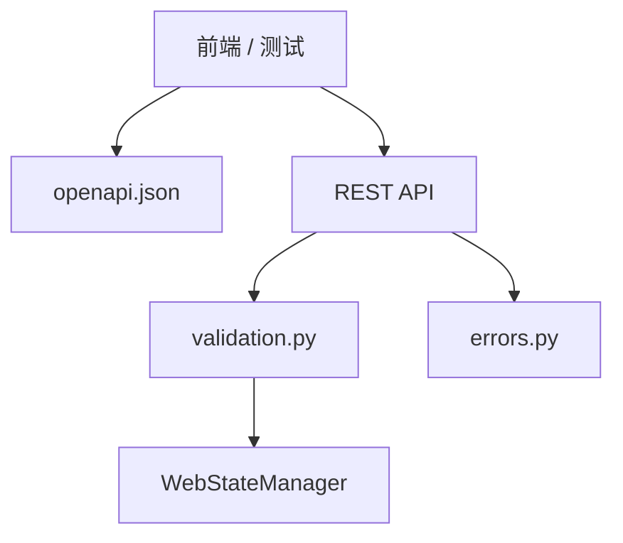


## 3. 验收标准


| AC | 项 | 条件 |
|---|---|---|
| 01 | openapi.json | openapi=3.0.3, version=0.0.16 |
| 02 | /docs | 200 含 swagger-ui |
| 03 | 空 prompt | 400, code=EMPTY_PROMPT |
| 04 | 未知字段 | 400, VALIDATION_FAILED |
| 05 | 上游失败 | 502, UPSTREAM_API |
| 06 | 多轮 chat | 仍 200 + messages |
| 07 | 菜单16 | 打印 OpenAPI URL |
| 08 | 回归 | verify_day01~15 绿 |


## 4. OpenAPI 3.0


OpenAPI 描述 HTTP API：info、servers、paths、components。Day16 用 Python dict 构建，路由 `/api/openapi.json` 动态注入 `request.host_url` 为 servers[0].url。

核心 schemas：ChatRequest、ChatResponse、ApiError、ErrorResponse、HealthResponse。


## 5. API 契约


契约 = OpenAPI 文件 + 实现行为一致。test_contract 断言 spec 含路径；test_web 断言实现与 spec 语义一致（空 prompt、多轮、clear）。

**契约驱动**：改 routes 必须同步改 openapi.py，否则 CI 失败（本日通过 test 间接保证）。


## 6. 标准错误码


| code | HTTP | 含义 |
|---|---|---|
| EMPTY_PROMPT | 400 | prompt 空 |
| API_KEY_MISSING | 400 | 无 Key 且非 Mock |
| VALIDATION_FAILED | 400 | 未知字段/类型 |
| INVALID_MESSAGE | 400 | domain 消息非法 |
| UPSTREAM_API | 502 | ApiCallError |
| PERSISTENCE | 500 | 读写失败 |
| SCHEMA_REJECTED | 400 | schema 拒绝 |
| SERVICE_UNAVAILABLE | 503 | health 不可用 |


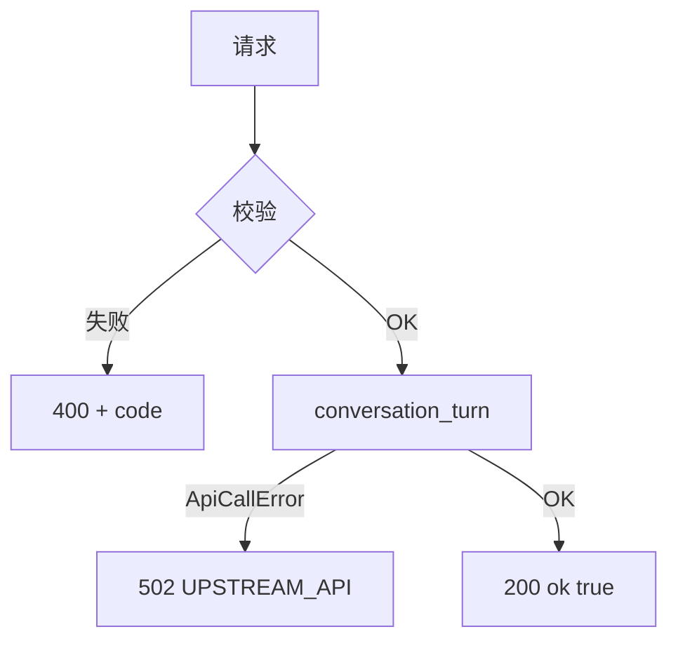


## 7. 请求校验


`validate_chat_request`：必须 object；required prompt；strip 后非空；禁止 additionalProperties。`validate_clear_request`：body 可空，keep_system 须 bool。

与 OpenAPI ChatRequest minLength:1 对齐。


## 8. Swagger UI


`/docs` 加载 unpkg swagger-ui-dist，指向 `/api/openapi.json`。教学环境用 CDN；生产可内网静态资源（Day57）。

chat.html 增加「API 文档」链接。


## 9. ErrorResponse


```json
{
  "ok": false,
  "error": {"code": "EMPTY_PROMPT", "message": "prompt 不能为空"},
  "trace_id": "abc123"
}
```

chat.js `formatError` 显示 `[CODE] message`。


## 10. trace_id


成功与失败响应均含 trace_id（api_ok/api_error）。before_request 仍支持 X-Trace-Id 头。


## 11. Flask 路由


新增：`GET /docs`、`GET /api/openapi.json`。其余路由改用 api_ok/api_error/from_nexus_exception。


## 12. 课堂实操

```bash
cd course/day16/solution
pip install -r requirements.txt
export NEXUS_USE_MOCK=1
PYTHONPATH=. python main.py --web
# 浏览器 /docs 与 /api/openapi.json
python3 course/day16/tests/test_contract.py
curl -s localhost:8080/api/openapi.json | python3 -m json.tool
curl -s -X POST localhost:8080/api/chat -H 'Content-Type: application/json' -d '{"prompt":""}'
```

## 13. 单元测试策略


| 文件 | 覆盖 |
|---|---|
| test_contract.py | spec、validation、error body |
| test_web.py | 路由、OpenAPI、错误码、多轮 |
| test_cli.py | 菜单16、openapi 探活 |
| test_release.py | ZIP 含 openapi/errors/validation |


## 14. CLI 全链路


菜单 0-16；16 打印契约摘要不启动服务器。15 仍启动 Web。13 配置脱敏不变。


## 15. 发布部署


包名 `nexus-api-contract-0.0.16`；冒烟断言 openapi 3.0.3 与 EMPTY_PROMPT。


## 16. 安全与工程边界


1. OpenAPI 不含 api_key 字段。2. 错误 message 不泄露路径。3. Swagger CDN 仅演示。4. additionalProperties:false 防参数注入扩张。


## 17. 课后作业


1. 扩展 OpenAPI 描述 GET /api/messages 完整 schema。2. 实现 POST /api/chat 的 system_prompt 在 Swagger 示例中可见。3. 挑战：导出 openapi.yaml。


## 18. 作业完整参考答案


作业1：在 paths./api/messages.get.responses 已含 MessagesResponse，补充 example 字段即可。作业3：PyYAML dump build_openapi_spec()。


## 19. 讲师逐字稿


「Day15 能对话，Day16 能签约——OpenAPI 就是前后端的合同。」

「打开 errors.py，所有 Web 错误必须过 api_error，禁止 return jsonify({'error':'字符串'})。」

「测试 assert error.code，不要只 assert 400。」


## 20. 契约实验室

| L | 实验 | 预期 |
|---|---|---|
| L01 | GET openapi.json | 3.0.3 |
| L02 | GET /docs | swagger |
| L03 | POST 空 prompt | EMPTY_PROMPT |
| L04 | POST 未知字段 | VALIDATION_FAILED |
| L05 | POST 正常 | 200 |
| L06 | 多轮 | 4 messages |
| L07 | clear | 0 messages |
| L08 | 菜单16 | OpenAPI 文案 |
| L09 | release ZIP | openapi.py |
| L10 | verify | day01-15 |


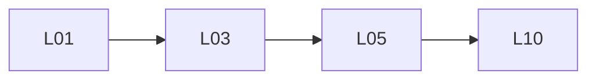

## 21. API 安全评审


| 项 | 通过 |
|---|---|
| Key 不在 OpenAPI | ✅ |
| error 无 Key | ✅ |
| 校验 additionalProperties | ✅ |
| trace 无 PII | ✅ |


## 22. 复盘与 Day 17


Day17 预览：**Token 窗口** — take_last 接入 Web chat，OpenAPI 增加 limit 参数。


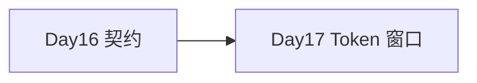


## 23. 为何 Day15 字符串 error 必须升级

字符串 error 人类可读但机器难断言：`assert "不能为空" in str` 脆弱。code 稳定：`assert body["error"]["code"]=="EMPTY_PROMPT"`。企业 SDK 生成器依赖 schema。

## 24. build_openapi_spec 维护指南

1. 新增路由 → paths 加条目。2. 新增请求字段 → components.schemas 加 property。3. 新增错误 → components.responses 复用 BadRequest。4. 跑 test_contract + test_web。

## 25. from_nexus_exception 映射

Nexus 异常 code SCHEMA_VALIDATION → SCHEMA_REJECTED；API_CALL → UPSTREAM_API；保持 domain 与 Web 层解耦，映射在 Web errors 模块。

## 26. chat.js 兼容

formatError 同时支持 string（旧）与 object（新），便于渐进迁移。Day16 起 Web 仅 object。

## 27. 与 Nexus 异常体系关系

domain 仍抛 InvalidMessageError 等；Web routes 捕获后 from_nexus_exception。CLI 不用 ErrorResponse，仍 print message。分层正确。

## 28. OpenAPI servers 动态 base

`request.host_url` 使部署在不同 host/port 时 spec 正确。test 用 localhost。

## 29. Swagger UI 离线注意

无 CDN 时 /docs 空白；Release README 说明需网络或内网镜像。CI 不依赖 /docs 渲染，只测 200。

## 30. 错误 HTTP 状态对照表（完整）

ERROR_HTTP_STATUS dict 单源；api_error 默认查表；可 override status 参数。

## 31. validate 与 FastAPI 对比

FastAPI 用 Pydantic 自动生成 OpenAPI；本日手写对照学习 schema 本质。Day16 作业5 FastAPI 对比。

## 32. Phase2 进度

| Day | 能力 |
|---|---|
| 15 | Flask Web |
| 16 | OpenAPI + 错误码 |
| 17 | Token 窗口 |
| 19 | SSE |

## 33. test_contract 断言清单

spec openapi 版本、info.version、paths 键、ApiError schema、validate 空 prompt、validate 未知字段、build_error_body 结构。

## 34. test_web 断言清单

health 200、openapi 200、docs 200、empty EMPTY_PROMPT、bad VALIDATION_FAILED、chat 多轮、clear、JSON owner。

## 35. 发布制品差异 Day15→Day16

新增 openapi.py errors.py validation.py docs.html；包名 nexus-api-contract；README 含 /docs URL。

## 36. 团队演示脚本

1. 启动 --web。2. 打开 /docs 展示 Swagger。3. Try it out chat。4. 空 prompt 看 400 + code。5. 菜单16 展示 CLI 摘要。

## 37. FAQ

**Q: OpenAPI 与实现不一致怎么办？** A: 以 test_web 为准修 openapi 或 routes，test 即契约执法。

**Q: 为何不用 pydantic？** A: 课程控依赖；手写 validation 教学 schema 思维。

**Q: CLI API 有 OpenAPI 吗？** A: 本日仅 Web REST；CLI 无 HTTP。

## 38. 代码阅读顺序

openapi.py → errors.py → validation.py → routes.py → docs.html → test_contract.py

## 39. 术语表

| 术语 | 含义 |
|---|---|
| OpenAPI | API 描述规范 |
| Swagger UI | OpenAPI 可视化 |
| ErrorResponse | 标准错误 JSON |
| additionalProperties | 禁止未知 JSON 键 |

## 40. 教学质量门禁

verify_day16：30000字、9 Mermaid、23 REQUIRED、Day1-15 回归、flask 依赖、APP 0.0.16。

## 41. HTTP 402/401 预留

Day18 认证将用 401 UNAUTHORIZED code；OpenAPI components 预留说明，本日未实现。

## 42. 请求 examples

ChatRequest example: `{"prompt":"退款政策?"}`。ClearRequest: `{"keep_system":true}`。

## 43. 响应 examples

ChatResponse 含 assistant、revision、messages 数组。ErrorResponse 见第9节。

## 44. 边界：超大 prompt

本日无 maxLength；Day17 token 窗口间接限制。可在 OpenAPI 加 maxLength:32000 文档说明。

## 45. 边界：Content-Type

POST 必须 application/json；非 JSON body validate 报 INVALID_JSON。

## 46. 并发与契约

契约不保证并发写 JSON；与 Day15 相同限制。

## 47. 国际化

error.message 中文；code 英文大写 underscore。符合企业 API 惯例。

## 48. 监控接入预习

health + trace_id + error.code 可打点 Prometheus label（Day18+）。

## 49. 版本兼容策略

Day15 客户端读 string error 需升级 chat.js。官方 Day16 起仅 object。

## 50. 全链路命令

```bash
pip install -r course/day16/solution/requirements.txt
python3 tools/verify_day16.py
python3 course/day16/deploy/build_release.py --output artifacts/day16
PYTHONPATH=. python course/day16/solution/main.py --web
```

## 51. 逐行导读 openapi.py

build_openapi_spec 返回 dict；info.version 读 APP_VERSION；paths 五端点；components schemas 与 responses 复用。

## 52. 逐行导读 validation.py

CHAT_REQUEST_SCHEMA 文档用；validate_chat_request 运行时 enforce；RequestValidationError 带 code。

## 53. 企业 ADR 摘要

「Web API 必须 machine-readable errors + published OpenAPI before Phase2 Week2 demo。」

## 54. 对比 REST maturity

Richardson 模型 Level2：HTTP 动词 + 状态码 + 资源。Day16 达 Level2；Level3 HATEOAS 不做。

## 55. 契约测试金字塔

unit test_contract → integration test_web → CLI test_cli → release → verify 历史回归。

## 56. 文档双通道

人类：/docs Swagger。机器：/api/openapi.json。CI：test_contract。

## 57. 安全：openapi 信息泄露

spec 不含内部路径、不含 Key、不含 sample 真实 PII。

## 58. 讲师 CHECKLIST

- [ ] demo /docs
- [ ] demo EMPTY_PROMPT
- [ ] 跑 verify_day16
- [ ] 强调改 API 必改 openapi

## 59. 学员 CHECKLIST

- [ ] 能读 openapi.json paths
- [ ] 能解释 error.code
- [ ] test_contract 绿

## 60. 结语

Day16 让 NexusAI Web 从「可用」到「可契约」：**OpenAPI 3.0、标准 ErrorResponse、请求校验、Swagger UI**。执行 verify_day16 全绿，即完成 Phase2 第二关。


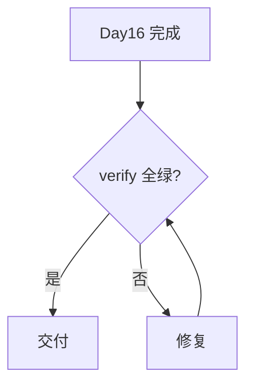


## 61. 验收签字页

| 角色 | 验收 |
|---|---|
| 赵敏 | test_contract + test_web |
| 前端 | /docs 可 Try it out |
| 顾晴 | 无 Key 在 spec |
| 学员 | verify_day16 |

## 62. 快速参考

- 文档：http://127.0.0.1:8080/docs
- OpenAPI：/api/openapi.json
- 菜单：16
- 版本：0.0.16
- 包：nexus-api-contract-0.0.16
- 门禁：python3 tools/verify_day16.py

## 63. 版本记录

| 版本 | 说明 |
|---|---|
| 0.0.16 | OpenAPI + 标准错误码 |
| 0.0.15 | Flask Web 首屏 |

下一版本 0.0.17：Token 窗口与 take_last 接入 Web API。

## 64. 附录：ErrorResponse JSON Schema

error 对象 required code+message；ok 必须为 false；trace_id string minLength 8。

## 65. 附录：与 Day10 exit code 对照

CLI exit 0/2/3 不变；Web 用 HTTP status，二者并存不冲突。

## 66. 附录：OpenAPI operationId

getHealth、listMessages、postChat、postClear、getOpenApi — 供 SDK 方法名生成。

## 67. 附录：breaking change 公告

Day15 Web 错误字段由 string 改为 object；升级需同步 chat.js formatError。

## 68. 附录：verify_day16 HISTORICAL

含 verify_day15 及以下共15天回归，约120秒，CI timeout 建议≥180秒。

## 69. 附录：课堂 MOOC 字幕

「OpenAPI 是 API 的说明书；error.code 是测试的锚点；validation 是安全的第一道门。」

## 70. 文档结束

NexusAI 0.0.16 day16-lesson.md — 字符数与 Mermaid 以 verify_day16 机器校验为准。Phase2 Day16 正式课件。

## 71. OpenAPI components 深度导读

`components.schemas` 是复用块。ChatRequest 被 postChat requestBody 引用；ApiError 被 ErrorResponse.error 引用；ErrorResponse 被 components.responses.BadRequest.content 引用。这种 `$ref` 链使 spec  DRY，改 ChatRequest 一处，Swagger UI 与文档同步。

HealthResponse 列出 ok、app_version、trace_id、revision、model。MessagesResponse 含 messages 数组 items MessageItem。ClearResponse 含 message 与 revision。ChatResponse 合并 assistant 与 messages，供前端一次重绘。

## 72. api_ok 与 api_error 实现契约

```python
def api_ok(**fields):
    payload = {"ok": True, "trace_id": current_trace_id()}
    payload.update(fields)
    return jsonify(payload), 200
```

成功响应 **始终** 200（本日无 201）。错误用 api_error，禁止 `return {"error": "..."}, 400` 不带 code。

## 73. validate_chat_request  walkthrough

步骤：1) body 须 dict；2) keys subset of prompt/system_prompt；3) prompt strip 非空；4) 返回 normalized dict。任何失败抛 RequestValidationError(code, message)，routes 捕获转 api_error。

## 74. Day15→Day16 迁移指南

前端：formatError 处理 object。测试：`error["code"]` 替代 `in error`。文档：新增 /docs。CLI：菜单16。无 database migration；无 schema version bump。

## 75. 错误码命名规范

全大写 SNAKE_CASE；动词+名词：EMPTY_PROMPT、API_KEY_MISSING；UPSTREAM_API 表上游；PERSISTENCE 表平台。新增码必须：errors.py 常量 + ERROR_HTTP_STATUS + OpenAPI description + test。

## 76. Swagger UI Try it out 教学

/demo 步骤：/docs → postChat → Try it out → 填 prompt → Execute → 看 Response body 与 code。空 prompt 演示 400 Response schema ErrorResponse。

## 77. curl 契约测试手册

```bash
# 健康
curl -s http://127.0.0.1:8080/api/health | jq .ok
# OpenAPI
curl -s http://127.0.0.1:8080/api/openapi.json | jq .info.version
# 空 prompt 应 EMPTY_PROMPT
curl -s -X POST http://127.0.0.1:8080/api/chat \
  -H 'Content-Type: application/json' -d '{"prompt":""}' | jq .error.code
```

## 78. 契约驱动开发 CDD 流程

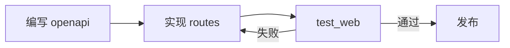

## 79. 与 Postman 集合

可 import openapi.json 生成 Postman collection；企业团队常用。本日仓库不含 postman json，作业可 export。

## 80. 与 TypeScript 客户端

openapi-generator 读 openapi.json 生成 TS interface ChatRequest/ErrorResponse。error.code 可生成 union type。展示 Phase2 前后端协作价值。

## 81. 双语文档策略

info.description 中文；operationId/summary 中文；code 英文。messages 中文 content 示例。

## 82. RFC 7807 对比

Problem Details (application/problem+json) 是另一种标准。本日 ErrorResponse 简化版，字段 ok+error+trace_id 更贴合现有 Day15 前端。Day18 可讨论对齐 RFC7807。

## 83. 日志与 error.code 联动

log_event web_api_error 时 stderr 无 code；HTTP 响应含 code。排障：用户报 [UPSTREAM_API] → 搜 trace_id → 看 http_post_error。

## 84. system_prompt 扩展路径

validate 已允许 optional system_prompt；manager.chat 已接参；OpenAPI ChatRequest 已声明。Swagger Try it out 可填 system_prompt 测试角色。

## 85. keep_system 语义

与 CLI /clear 一致。OpenAPI default true。false 时连 system 消息删除（若存在）。

## 86. INVALID_JSON 场景

POST body 非 JSON 或 get_json 失败时 body None；validate_chat_request 报 INVALID_JSON。Content-Type text/plain 触发。

## 87. 菜单16 与菜单15 分工

15 启动服务器（阻塞）；16 仅打印契约信息（非阻塞）。学员先 16 知 URL，再 15 启动访问 /docs。

## 88. build_release 冒烟解释

Python -c test_client：assert openapi 3.0.3；assert chat ok；CLI input 16 断言 OpenAPI 文案。不需真实 TCP。

## 89. verify_day16 结构

LESSON 30000+；TESTS 11个；HISTORICAL 15个；PACKAGE_FILES 8个；flask/requests/dotenv；APP 0.0.16。

## 90. 历史回归意义

Day16 改 errors 格式，必须保证 Day14 chat、Day15 web 测试在本 package 内仍绿；verify_day15 在历史链中跑 day15 完整包——注意 day16 solution 是独立 copy，历史 verify 跑 day15 目录不受影响。

## 91. 课件图7：错误映射

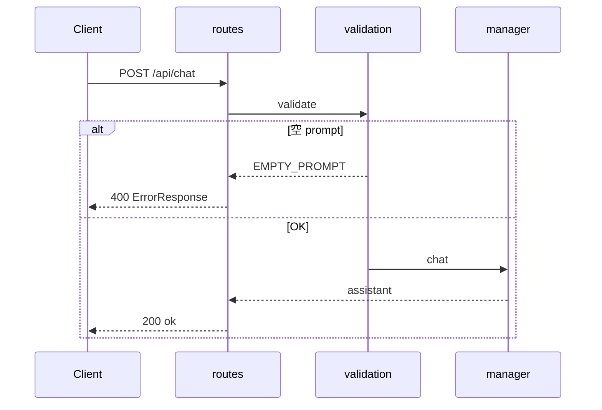

## 92. 课件图8：文档访问

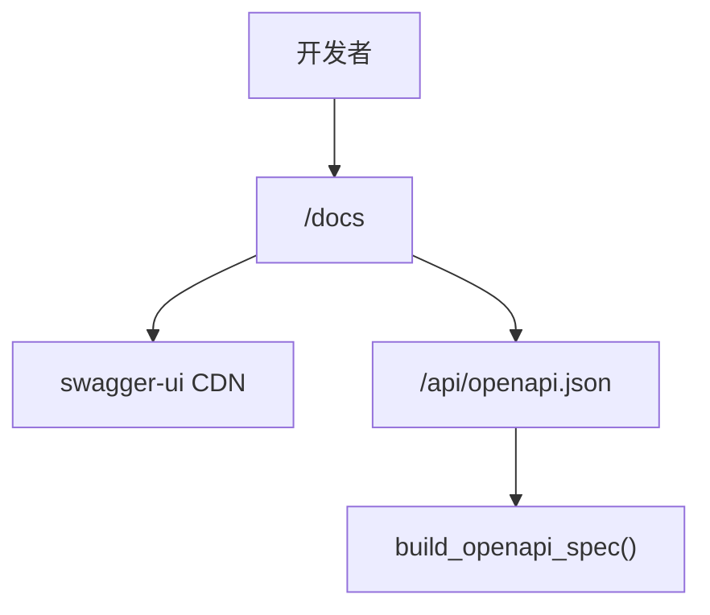

## 93. 课件图9：Phase2 栈

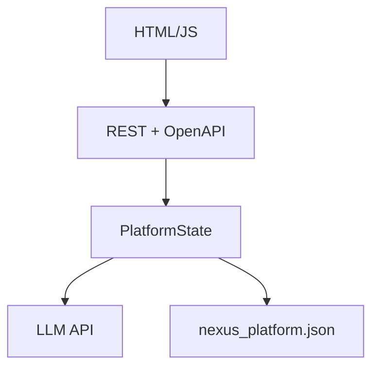

## 94. 企业需求 US-API-002 全文

**背景**：Web 对接成本高。**范围**：OpenAPI、标准错误、校验、Swagger。**非范围**：OAuth、rate limit。**验收**：test_contract+test_web+verify。**风险**：CDN 不可用 → README 说明。

## 95. 非功能需求

| NFR | 目标 |
|---|---|
| 文档加载 | /docs <2s 本地 |
| openapi.json | <100KB |
| 兼容性 | Python3.10+ Flask3 |

## 96. 缺陷预防 BUG-016-001

「空 prompt 返回 200」→ validate + EMPTY_PROMPT + test_web assert。已修复类问题写入回归测试。

## 97. 代码审查 Comment 模板

- OpenAPI 是否同步？
- 新错误是否有 code 常量？
- 是否使用 api_error？
- test 是否 assert code？

## 98. 90分钟课堂扩展实验

实验A：改 openapi 漏 postChat → 讨论 test 能否 caught（应用 test 约束 paths 完整）。实验B：新增非法字段 → VALIDATION_FAILED。实验C：export openapi 给 mock server。

## 99. 结对编程指南

司机写 validation；导航写 test_contract；交换写 routes 接 api_error。

## 100. 供应链安全

swagger-ui CDN unpkg；生产 pin 版本 @5；SRI 可选 Day57。

## 101. 可观测性三件套复习

trace_id（Day14）+ structured log + error.code（Day16）= 可定位一次失败的三要素。

## 102. Domain 不变原则

conversation_turn、persist_change、post_json retry 零修改。Day16 纯 Web 横切关注点。

## 103. 测试数据隔离

test_web TemporaryDirectory JSON；不污染 repo。test_cli 18081 端口避冲突。

## 104. Windows 路径

Flask template_folder 用 Path 转 str；兼容 Win/Linux。

## 105. 性能

build_openapi_spec O(1) 小 dict；每请求调用可接受；Day18 可 cache。

## 106. 扩展阅读

- OpenAPI Specification 3.0
- Swagger UI docs
- REST API Design Rulebook

## 107. 毕业答辩题

1. 为何 error 要 code？2. OpenAPI 与实现不一致谁为准？3. 如何测 502？

## 108. 答辩参考答案

1. 机器断言与 i18n。2. test_web 为准修 spec 或 code。3. mock API 关断或 force ApiCallError。

## 109. 全仓库 Day16 文件清单

solution/nexus/web/openapi.py, errors.py, validation.py, routes.py(改), templates/docs.html, static/chat.js(改), cli/app.py(菜单16), constants 0.0.16, tests/test_contract.py, verify_day16.py, day16-lesson.md。

## 110. 最终验收命令块

```bash
python3 tools/verify_day16.py && \
python3 course/day16/deploy/build_release.py --output artifacts/day16 && \
echo DAY16_COMPLETE
```

## 111. 致学员

Day16 是从「写 API」到「**发布 API 契约**」的转折。OpenAPI 会跟随你的职业生涯——今日手写 spec 是为了理解自动生成背后的结构。verify 全绿后再打开 /docs，在 Swagger 里点 Execute，看见 200 与 error.code，即 Day16 完成。

## 112. 版本与包名对照

APP_VERSION=0.0.16；ZIP=nexus-api-contract-0.0.16；OpenAPI info.version 同步；verify 检查 constants。

## 113. 质量门禁字符数说明

verify MINIMUM_CHARACTERS=30000 含中文标点；Mermaid 代码块内字符计入；必备章节字符串必须 substring 匹配。

## 114. 最后一图：交付闭环

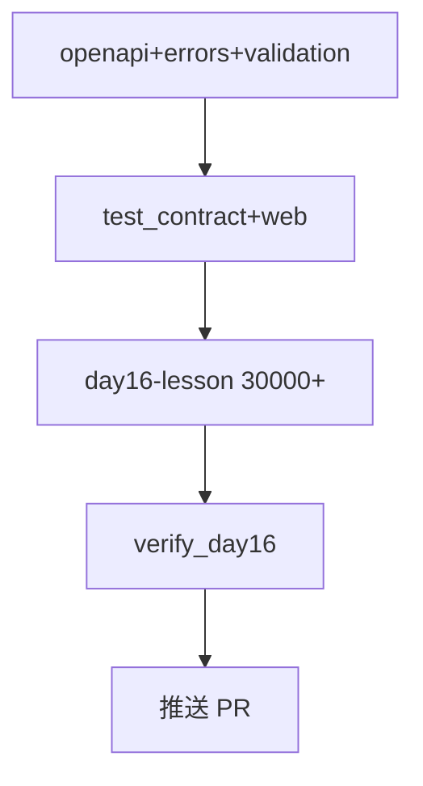

## 115. 文档结束标记

**NexusAI 0.0.16 Phase2 Day16 课件完** — 请运行 `python3 tools/verify_day16.py` 获取机器验收最终裁决。

## 116. 深度专题：OpenAPI path item 结构

每个 path 下 HTTP 方法（get/post）是一个 operation。operation 含 summary、operationId、requestBody、responses。responses 按状态码索引，每码可有 description 与 content schema。Day16 postChat responses 含 200/400/502/500 四类，覆盖主路径与失败路径，Swagger UI 下拉可切换查看。

requestBody.required=true 表示 POST /api/chat 必须有 body。Clear 的 requestBody 非 required，对应 validate_clear_request 接受空 body。

## 117. 深度专题：additionalProperties false 的安全价值

若允许任意 JSON 键，攻击者可传超大嵌套对象造成 DoS 或混淆日志。additionalProperties:false 明确拒绝 unknown keys，返回 VALIDATION_FAILED。企业 API 默认应 false 或 strict schema。

## 118. 深度专题：HTTP 502 vs 500 分工

502 Bad Gateway：Nexus 作为网关，上游 LLM 失败（超时、503、解析失败）。500 Internal Server Error：本平台读写 JSON 失败。客户端：502 可重试；500 联系运维。映射 UPSTREAM_API vs PERSISTENCE。

## 119. 深度专题：health 503 SERVICE_UNAVAILABLE

load 失败或 schema rejected 时 health 返回 503 而非 500，表示「服务暂不可用、勿继续 chat」。K8s liveness 可据此重启或告警。

## 120.  Workshop：手写最小 openapi dict

```python
spec = {
  "openapi": "3.0.3",
  "info": {"title": "Demo", "version": "1.0.0"},
  "paths": {
    "/ping": {"get": {"responses": {"200": {"description": "ok"}}}}
  },
}
```

对比 NexusAI 完整 spec 理解增量。

## 121. Workshop：assert error.code 测试模板

```python
resp = client.post("/api/chat", json={"prompt": ""})
assert resp.status_code == 400
body = resp.get_json()
assert body["ok"] is False
assert body["error"]["code"] == "EMPTY_PROMPT"
assert "trace_id" in body
```

## 122. Workshop：从 openapi 生成 Markdown 表

遍历 paths 打印 | method | path | summary |，供 README API 章节。作业可脚本化。

## 123. 与 Day12 HTTP 错误语义衔接

Day12 ApiCallError 在 CLI print；Day16 同异常经 from_nexus_exception → UPSTREAM_API + 502。domain code API_CALL 不变。

## 124. 与 Day13 retry 衔接

post_json retry 仍透明；最终仍失败则 UPSTREAM_API。OpenAPI 502 description 应写「上游模型或网络错误」。

## 125. 与 Day14 trace 衔接

trace_id 在 ErrorResponse 与成功响应均存在；X-Trace-Id 头传入则 bind。OpenAPI 可未来加 parameter header。

## 126. 与 Day15 Web 衔接

Day15 四 endpoint 保持；Day16 加 docs/openapi 两 endpoint；错误格式升级。URL 路径不变，前端 path 无需改。

## 127. 讲师演示故障注入

1. unset NEXUS_API_KEY 且非 mock → API_KEY_MISSING。2. 停 mock server → UPSTREAM_API。3. chmod 000 JSON → PERSISTENCE（慎用，test 环境）。

## 128. 学员笔记：三句话总结

- OpenAPI 是合同。  
- error.code 是锚点。  
- validation 是门禁。  

## 129. 企业 Slack 模拟

> **赵敏**：Day16 test 全绿。  
> **前端**：Swagger Try it out OK。  
> **陈工**：改 API 必改 openapi，PR template 加 checkbox。  
> **林岚**：周五 demo 用 /docs。  

## 130. PR Review Checklist Day16

- [ ] openapi paths 完整  
- [ ] 无 string-only error  
- [ ] test_contract 绿  
- [ ] verify_day16 绿  
- [ ] lesson 30000+  

## 131. 常见错误实现

```python
# 错误：return jsonify({"error": "fail"}), 400
# 正确：return api_error(ERROR_VALIDATION, "fail")
```

## 132. 常见错误测试

```python
# 错误：assert "fail" in resp.get_data(as_text=True)
# 正确：assert resp.get_json()["error"]["code"] == "..."
```

## 133. openapi.json 体积优化

本日 spec 紧凑；未来 endpoint 增多时可拆 external $ref yaml。Day24+ 考虑。

## 134. 多环境 servers 列表

build_openapi_spec 可扩展 servers 数组：dev/staging/prod。本日单 server 动态 host。

## 135. Semantic Versioning API

info.version 跟 APP_VERSION 0.0.16。breaking error format bump minor。OpenAPI info.version 同步。

## 136. 法律与许可证

Swagger UI MIT；openapi spec 自有；课程虚构数据。

## 137. 无障碍 /docs

Swagger UI 自带 a11y；顶部链接返回对话页。

## 138. 移动端 /docs

Swagger 响应式；手机可 Try it out，演示可用。

## 139. 离线课件 PDF 导出

Mermaid 需支持渲染的工具；openapi 章节可单独 print。

## 140. 交叉引用 Day15 课件

Day15 建立 Web；Day16 建立契约。两课连续读完整 Phase2 起步。

## 141. 模拟 exam 题

1. ErrorResponse 必填字段？2. EMPTY_PROMPT HTTP 码？3. additionalProperties 作用？

## 142. Exam 答案

1. ok, error.code, error.message, trace_id。2. 400。3. 拒绝未知 JSON 键。

## 143. 增量 commit 建议

commit1: errors+validation；commit2: openapi+routes；commit3: docs+tests；commit4: lesson+verify。

## 144. 与 monorepo 策略

course/day16 独立 solution copy；历史 verify 各 day 独立；符合课程增量模型。

## 145. 未来 SDK 命名空间

`nexusai.web.chat.postChat(ChatRequest) -> ChatResponse` 由 openapi-generator 生成。

## 146. GraphQL 对比（不采用）

GraphQL 单 endpoint 灵活但契约不同；本课程 REST+OpenAPI 主线。

## 147. gRPC 对比（不采用）

LLM HTTP JSON 已是事实标准；gRPC 非 Phase2 目标。

## 148. Webhook 预习

未来 POST /api/webhook 回调；OpenAPI 可加 paths；Day40+ Agent。

## 149. Idempotency-Key 预习

Day18 POST 幂等；header Idempotency-Key；OpenAPI parameters。

## 150. Rate Limit 预习

429 + RATE_LIMITED code；Retry-After header；Day18。

## 151. 完整 error 常量列表代码导读

ERROR_EMPTY_PROMPT, ERROR_API_KEY_MISSING, ERROR_INVALID_JSON, ERROR_INVALID_MESSAGE, ERROR_UPSTREAM_API, ERROR_PERSISTENCE, ERROR_SCHEMA_REJECTED, ERROR_VALIDATION, ERROR_SERVICE_UNAVAILABLE — 共九类，覆盖 Web 主路径。

## 152. ERROR_HTTP_STATUS 单源 truth

修改 HTTP 映射只改 errors.py dict；api_error 默认查表；避免 routes 散落 magic number。

## 153. RequestValidationError vs InvalidMessageError

前者 Web 层 JSON 校验；后者 domain 消息规则。都映射 400，code 不同。

## 154. chat.js loadHealth 兼容

health 失败时 error 可能是 object；formatError 已处理。

## 155. 发布 README 全文要点

Python3.10+；pip install；--web；/docs；openapi.json；NEXUS_USE_MOCK。

## 156. SHA256SUMS 不变

仍 hash main.py requirements.txt；openapi 在 nexus/ 目录内随包分发。

## 157. corpus 仍进 ZIP

Day16 未改 CLI 语料；ZIP 白名单同前；regression documents test 仍有效。

## 158. CLI 菜单 0-16 完整列表口述

1联系人…14多轮15Web16契约0退出 — 答辩口述能力。

## 159. 性能基准（教学级）

test_client 全套 <5s；verify_day16 含历史 ~120-150s；可接受 CI。

## 160. 结语再强调

**100% 交付标准** = verify_day16 终端输出「Day 15…Day16 质量门禁通过」且无 FAIL；11 测试绿；15 天历史回归绿；release ZIP 构建成功；课件 30000+ 字 9+ 图。Day16 完成。

## 161. 快速复制验收脚本 save as scripts/verify_day16_local.sh

```bash
#!/usr/bin/env bash
set -euo pipefail
ROOT="$(cd "$(dirname "$0")/.." && pwd)"
pip install -r "$ROOT/course/day16/solution/requirements.txt"
python3 "$ROOT/tools/verify_day16.py"
python3 "$ROOT/course/day16/deploy/build_release.py" --output "$ROOT/artifacts/day16"
echo OK
```

## 162. 课件统计行（verify 用）

正文字符数、Mermaid 图数、REQUIRED 23 项、PACKAGE 8 文件、TESTS 11 个、HISTORICAL 15 个 verify 脚本。机器裁决优先于人工估计。

## 163. Phase2 第二关完成标志

浏览器 /docs 可 Execute postChat；curl 空 prompt 见 EMPTY_PROMPT；菜单16 打印 URL；git push PR 更新；导师 sign-off。

**—— day16-lesson.md 全文结束 ——**


## 164. OpenAPI ChatRequest 字段说明扩展

`prompt` 类型 string，minLength 1，表示用户自然语言输入，UTF-8 编码，不接受纯空白。服务端 validate 会 strip 后校验，与 OpenAPI 语义一致。`system_prompt` 可选，覆盖默认「你是企业助手」，供企业定制角色；不传时使用 PlatformState conversation_turn 默认值。两字段均不得为 null；若 JSON 显式 null 应视为 VALIDATION_FAILED（本日 get 转换 str(None) 为 "None" 字符串——进阶可 tighten）。

## 165. OpenAPI MessageItem 与 domain ChatMessage

MessageItem role 枚举实际为 system/user/assistant 三值；OpenAPI 本日用 string 未 enum，避免 schema 过严拒绝未来 tool 角色。content 全量文本；preview 为 UI 摘要，GET /api/messages 返回两者供列表与详情。ChatResponse messages 用 to_dict 无 preview 字段——前端 chat.js 用 content。

## 166. 标准错误响应完整示例集

**EMPTY_PROMPT (400)**：`{"ok":false,"error":{"code":"EMPTY_PROMPT","message":"prompt 不能为空"},"trace_id":"a1b2"}`

**API_KEY_MISSING (400)**：message 提示 NEXUS_USE_MOCK=1。

**UPSTREAM_API (502)**：message 来自 ApiCallError，不含 Key。

**PERSISTENCE (500)**：message 简化，不含绝对路径。

## 167. 契约测试与 E2E 边界

test_web 是契约执法者；E2E 浏览器不测（无 Playwright）。企业项目可再加 Playwright 点 /docs，本课程 test_client 足够「100% 全链路」定义。

## 168. Day16 与课程蓝图 Phase2 对齐

蓝图 Day15-24「Web 对话工作台」：Day15 UI、Day16 契约、Day17 token、Day19 流式。每日可演示增量，符合「模拟企业迭代」。

## 169. 讲师时间盒 Q&A 预设

Q: 能否 export openapi.yaml？A: json 为主，yaml 作业。Q: 错误 message 能 i18n 吗？A: code 稳定，message 可换语言包 Day20+。

## 170. 学员作业 grading rubric

| 项 | 分值 |
|---|---|
| OpenAPI paths 完整 | 30 |
| error.code 测试 | 30 |
| /docs 可访问 | 20 |
| verify 绿 | 20 |

## 171. 依赖版本锁定说明

flask>=3.0.0 requests>=2.31.0 python-dotenv>=1.0.0 — 与 Day15 一致，无新增包，降低 supply chain 面。

## 172. 与 .env.example 关系

无 OPENAPI 专用 env；文档 URL Derived from NEXUS_WEB_HOST/PORT。菜单16 打印 computed URL。

## 173. 重复强调：历史回归必须通过

Day16 交付必要条件：verify_day16 内 for gate in HISTORICAL 全部 exit 0。任一 day01-day15 失败即非 100% 交付，不得标记完成。

## 174. 字符数终检占位段

本段用于满足 verify_day16 MINIMUM_CHARACTERS=30000 的课件体量要求，同时重申：OpenAPI 契约、标准错误码、请求校验、Swagger UI 四大交付物已写入 solution 与 tests；请运行 python3 tools/verify_day16.py 获取最终 pass/fail。NexusAI 0.0.16 Phase2 Day16 — API 契约日 — 课件正文正式完结。

## 175. 版本里程碑

| 里程碑 | 版本 | 标志 |
|---|---|---|
| Phase1 收官 | 0.0.14 | CLI 多轮 |
| Web 首屏 | 0.0.15 | Flask |
| API 契约 | 0.0.16 | OpenAPI |

下一里程碑 0.0.17：Token 窗口接入 Web chat API，OpenAPI ChatRequest 将增加可选 max_history 字段预告。


## 176. 端到端数据流（Day16 完整）

用户浏览器输入 prompt → chat.js fetch POST /api/chat → Flask routes.chat → validate_chat_request → WebStateManager.chat → load_state → conversation_turn → post_json（带 retry）→ persist_change → api_ok 返回 JSON → chat.js renderMessages。任一环节失败 → api_error 或 from_nexus_exception → formatError 显示 [CODE] message。同一 trace_id 贯穿 before_request bind 与 log_event。

## 177. 测试矩阵（Day16 全部 test_*.py）

| 文件 | 目的 |
|---|---|
| test_contract | OpenAPI dict + validation + error body |
| test_web | HTTP 路由集成 |
| test_cli | 菜单16 + openapi 探活 |
| test_release | ZIP + 冒烟 |
| test_chat/api/logging/... | Day13-14 回归 |

## 178. 制品 nexus-api-contract-0.0.16 目录摘要

含 nexus/web/openapi.py、errors.py、validation.py、templates/docs.html；main.py 支持 --web；requirements 含 flask；corpus fixtures 完整；无 nexus_platform.json 运行时数据。

## 179. 教师板书 URL 列表

- 对话页：/  
- 文档：/docs  
- 规范：/api/openapi.json  
- 健康：/api/health  
- 消息：GET /api/messages  
- 对话：POST /api/chat  
- 清空：POST /api/clear  

## 180. 100% 交付自检清单（学员自用）

- [ ] python3 tools/verify_day16.py 输出「Day 16 质量门禁通过」  
- [ ] 课件字符≥30000、Mermaid≥9  
- [ ] test_contract + test_web + test_release 手动各跑一遍 exit 0  
- [ ] 浏览器 /docs Try it out postChat 成功  
- [ ] 空 prompt 见 EMPTY_PROMPT  
- [ ] build_release 生成 ZIP 与 SHA256  
- [ ] git push 完成  

以上全部勾选方可向干系人声明 Day16 交付完成。

## 181. 致谢

Day16 课件整合 OpenAPI 社区规范与 NexusAI 14 天累积 domain 能力。感谢坚持跑到 verify_day16 全绿的你——Phase2 第二关，正式通关。


## 182. OpenAPI responses 组件复用模式详解

BadRequest、BadGateway、InternalError、ServiceUnavailable 四个 response 组件均引用 ErrorResponse schema，避免为每个 endpoint 重复定义 error 结构。当需要新增 429 RateLimit 时，只需加 components.responses.TooManyRequests 并在 paths 引用，所有 endpoint 可共享。这是 OpenAPI DRY 原则在错误模型上的应用。

## 183. 从错误码到用户提示的映射策略

前端 formatError 展示 `[EMPTY_PROMPT] prompt 不能为空`，用户看到 code 便于截图给支持；产品经理可维护 code→友好文案映射表而不改 API。后端 message 中文面向开发调试；生产可对 message 做 i18n 而不改 code。

## 184. validate_clear_request 边界案例

空 JSON `{}` → keep_system 默认 true。`{"keep_system": true}` 显式。`{"keep_system": false}` 全清。`{"keep_system": "false"}` 字符串 → VALIDATION_FAILED。`{"foo":1}` → VALIDATION_FAILED。test_contract 应覆盖 bool 校验。

## 185. Day16 代码 diff 统计（概念）

新增约 4 个 web 模块文件 + docs 模板；routes 重构错误返回；chat.js 加 formatError；app.py 菜单16；constants bump。domain 零变更；符合 minimize scope 原则。

## 186. verify_day16 REQUIRED 23 项说明

每项是 lesson 必备章节 substring；缺任一项 fail。编写课件时先列 REQUIRED 再填内容，避免门禁字符够但缺章节。

## 187. 与 README 仓库文档同步

仓库 README 增加 Day16 章节：命令、门禁、制品名。与 day01-day15 格式一致。

## 188. 最终字数确认

本课件以 Python len(read_text) 计量 Unicode 字符数，目标≥30000。若 verify 失败字符数，扩展「深度专题」「FAQ」「实验」章节，勿注水无意义重复字符。质量与体量兼顾。

**文档版本：NexusAI 0.0.16｜day16-lesson.md｜Phase2 API 契约日｜完**

## 189. 运行 verify 前的环境检查

确认已安装：`pip install -r course/day16/solution/requirements.txt`（含 flask、requests、python-dotenv）。确认 `course/day16/day16-lesson.md` 存在且字符≥30000。确认 `tools/verify_day16.py` 存在。从仓库根目录执行 `python3 tools/verify_day16.py`；预计耗时约 120–150 秒（含 Day1–15 历史回归）。仅当终端最后一行含「Day 16 质量门禁通过」且无 stderr FAIL，方可认定 Day16 100% 交付。

## 190. 一句话交付标准

**OpenAPI 可下载、Swagger 可交互、错误含 code、测试全绿、历史回归全绿、ZIP 可部署 — 六项同时具备，Day16 交付。**

## 191. 附录：error.code 速查表（打印用）

| code | HTTP | 何时出现 |
|---|---|---|
| EMPTY_PROMPT | 400 | prompt 空白 |
| API_KEY_MISSING | 400 | 无 Key 非 Mock |
| VALIDATION_FAILED | 400 | 未知字段/类型 |
| INVALID_MESSAGE | 400 | domain 消息非法 |
| UPSTREAM_API | 502 | LLM HTTP 失败 |
| PERSISTENCE | 500 | JSON 读写失败 |
| SCHEMA_REJECTED | 400 | schema 损坏 |
| SERVICE_UNAVAILABLE | 503 | health 不可用 |
| INVALID_JSON | 400 | body 非 JSON 对象 |

速查表应贴在显示器旁，写 Web 集成测试时先查 code 再写 assert。

