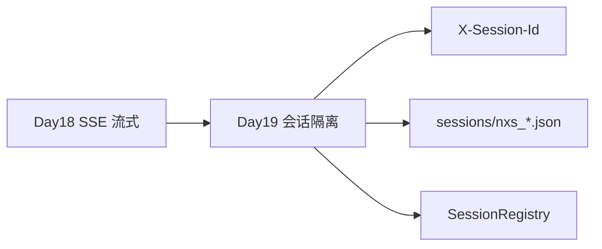
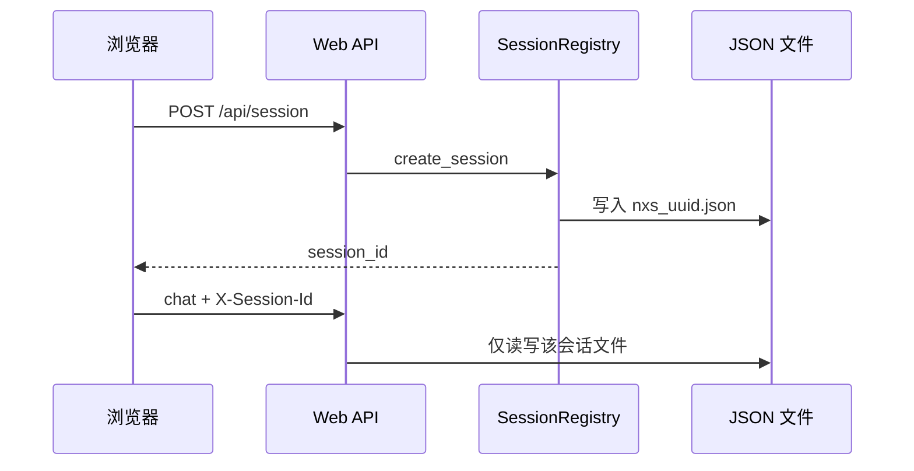
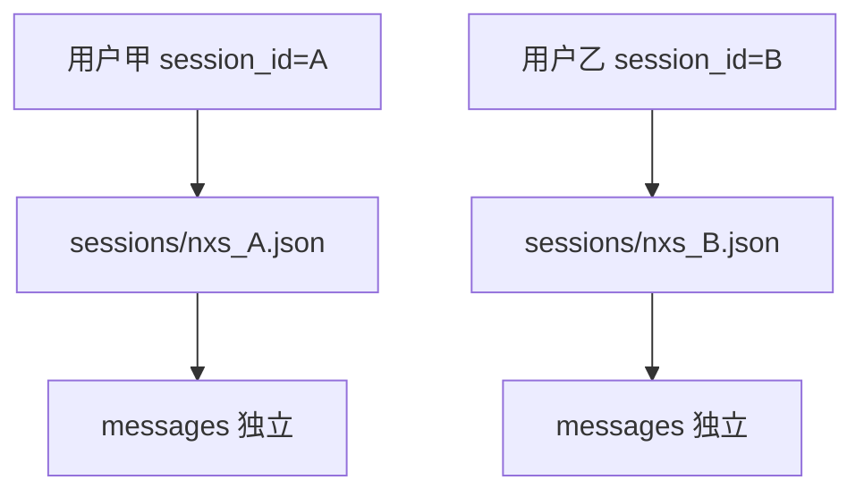
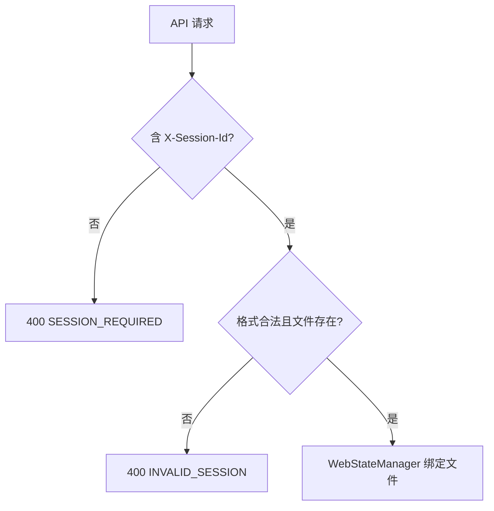
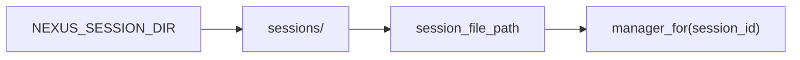
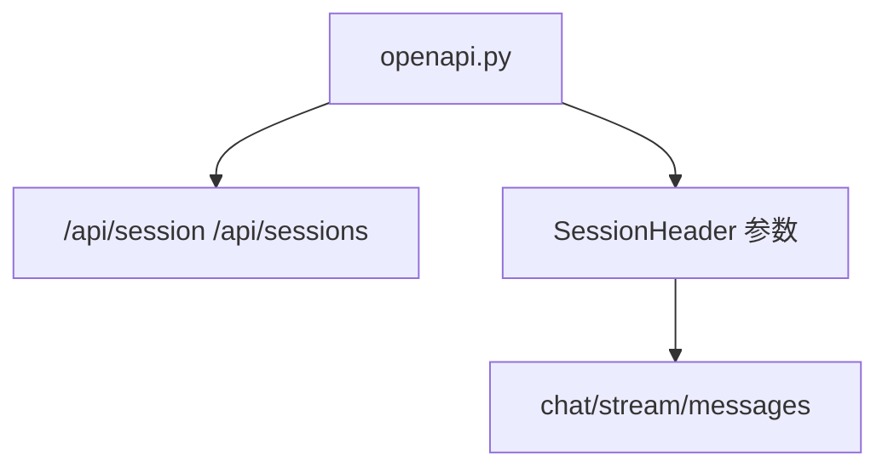
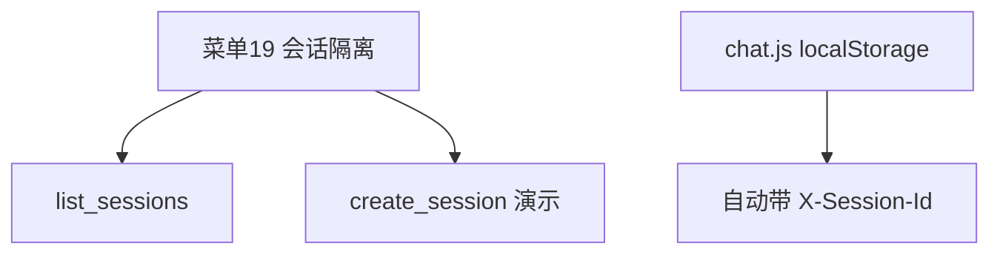
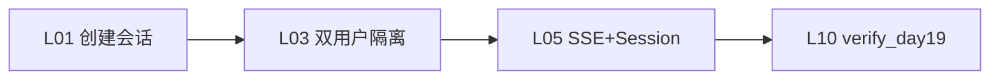
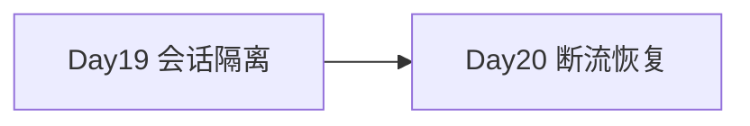

# Day 19｜会话隔离、X-Session-Id 与多用户 state

> 阶段：模型与 Prompt·Web 对话工作台  
> 项目版本：NexusAI 0.0.19  
> 需求：US-SESSION-001  
> 交付：`session_config.py`、`session_registry.py`、`POST /api/session`、`X-Session-Id`  

---

## 0. 开场旁白

Day 18 我们让 assistant 回复像打字机一样流式出现，体验达标。测试工程师赵敏在并发压测报告里指出致命问题：「所有浏览器共用一个 `nexus_platform.json`，**用户甲的对话用户乙能看见**，revision 互相覆盖，这在生产绝对不行。」

运维老周补充：「需要**每会话独立 state 文件**，用请求头携带 Session ID，目录可配置 `NEXUS_SESSION_DIR`。」

Day 19 的 NexusAI 0.0.19 实现 **会话隔离**：

- 每会话一个 JSON：`sessions/nxs_{uuid}.json`
- 请求头 **`X-Session-Id`** 绑定 `WebStateManager`
- **`SessionRegistry`** 创建、列举、查询会话
- **`POST /api/session`** 创建；**`GET /api/sessions`** 列举
- 无 Session 访问 chat → **`SESSION_REQUIRED`**；非法 ID → **`INVALID_SESSION`**
- **chat.js** localStorage 保存 session_id，自动带头
- CLI 菜单 **19 会话隔离** 演示多会话文件
- SSE 流式、Token 窗口 **不变**，叠加在会话作用域内

Schema **仍 v4**；CLI 默认单文件 `nexus_platform.json` 仍服务菜单 1-14。





## 1. 学习成果与完成定义

学员能够：

1. 解释 **会话隔离** 与单文件多用户竞态风险。
2. 使用 **`X-Session-Id`** 与 **`session_file_path`** 理解一会话一文件。
3. 调用 **`POST /api/session`** 创建会话并读回 `session_id`。
4. 说明 **`SessionRegistry.manager_for`** 如何绑定 state。
5. 配置 **`NEXUS_SESSION_DIR`** 部署会话目录。
6. 运行 `test_session.py`、`verify_day19.py` 全绿。

完成定义：

- [ ] `session_config.py` 生成/校验 Session ID。
- [ ] `session_registry.py` 创建与列举会话。
- [ ] 受保护 API 必须带 `X-Session-Id`。
- [ ] 两会话 messages 互不可见。
- [ ] APP_VERSION=0.0.19；课件 ≥30000 字、≥9 Mermaid。

## 2. 企业需求文档

### 2.1 用户故事

> 作为 SaaS 运维，我希望每终端用户会话独立 JSON，以便并发不串话；作为安全审计，我希望能按 session_id 追溯 owner 与 revision。

### 2.2 ADR-019

**决策**：Session ID 格式 `nxs_[0-9a-f]{32}`；Header `X-Session-Id`；目录默认 `sessions/`；Web 全隔离；CLI 演示菜单不强制改默认 data_file。

**后果**：+ 多用户安全；+ 水平扩展前置；- 客户端须管理 session_id；- 需清理陈旧会话（Day 45）。





## 3. 验收标准

| AC | 项 | 条件 |
|---|---|---|
| 01 | 创建 | POST /api/session 返回 session_id |
| 02 | 隔离 | 两 session chat 互不影响 |
| 03 | Header | 无头 400 SESSION_REQUIRED |
| 04 | 非法 ID | INVALID_SESSION |
| 05 | 列举 | GET /api/sessions count 正确 |
| 06 | SSE+Session | stream done 含 session_id |
| 07 | 窗口 | max_history 在会话内仍生效 |
| 08 | OpenAPI | SessionHeader 参数 |
| 09 | 菜单19 | 创建并列举会话 |
| 10 | 回归 | verify_day01~18 绿 |
| 11 | 发布 | nexus-session-isolation-0.0.19 |

## 4. 会话隔离

**会话隔离** = 每个逻辑会话拥有独立 `PlatformState` 持久化文件，API 层通过 Session ID 路由，杜绝跨会话读写 `messages`。

与「多租户」区别：Day 19 是**会话级**隔离；租户级 RBAC 在 Day 40+。本日先解决**并发串话**工程事故。

## 5. X-Session-Id

HTTP 请求头 **`X-Session-Id: nxs_abc...`** 声明调用方身份。常量 `SESSION_HEADER` 单源定义于 `constants.py`。

受保护端点：messages、chat、chat/stream、clear、window。  
无需 Session：health、openapi、POST /api/session（创建）、GET /api/sessions（列举）。





## 6. SessionRegistry

**`SessionRegistry`** 封装：

- `create_session(owner=None)` → 新文件 + 元数据
- `manager_for(session_id)` → `WebStateManager(data_file, session_id=...)`
- `session_info(session_id)` → 只读元数据
- `list_sessions()` → 目录扫描 `*.json`

日志事件 `session_created` 含 session_id、owner、revision。

## 7. 独立 state 文件

路径规则：`{NEXUS_SESSION_DIR}/{session_id}.json`，例如 `sessions/nxs_a1b2....json`。

`validate_session_id` 防路径穿越：仅允许 `nxs_` + 32 位 hex。  
`generate_session_id()` 使用 `uuid.uuid4().hex`。

**多用户隔离**：用户甲、乙各持 session_id，各自文件，互不知晓对方 messages。





## 8. NEXUS_SESSION_DIR

环境变量 **`NEXUS_SESSION_DIR`**，默认 `sessions`。`ensure_session_dir()` 启动时 `mkdir -p`。

K8s 可挂载 PVC 到该目录实现会话持久化；多 Pod 需共享存储或粘性路由（Day 46）。

## 9. POST /api/session

请求体可选 `owner` 字符串。空 body 合法，owner 默认为 `SESSION_{id 后 8 位}`。

响应：`ok`、`session_id`、`owner`、`revision`、`messages`（初始 0）。

浏览器首次访问调用此接口，localStorage 缓存 `session_id`。

## 10. GET /api/sessions

管理/调试端点，返回 `sessions` 数组与 `count`、`session_dir`。  
生产应加鉴权（Day 40）；本日教学环境开放。

## 11. SESSION_REQUIRED

错误码 **`SESSION_REQUIRED`**：受保护 API 未带 `X-Session-Id`。HTTP 400。  
message 提示先 `POST /api/session`。

## 12. INVALID_SESSION

错误码 **`INVALID_SESSION`**：格式非法、文件不存在或损坏。HTTP 400。  
与 `SESSION_REQUIRED` 区分，便于客户端决定「创建新会话」还是「报错」。





## 13. 多用户隔离

测试用例：session A chat「甲」，session B chat「乙」，互查 messages 仅见己方。  
流式与非流式均走同一 `resolve_manager()`，隔离一致。

## 14. OpenAPI 更新

新增 paths、`SessionHeader` parameter、`SessionCreateRequest/Response`、`SessionListResponse`。  
Health 增加 `session_count`、`session_dir`。





## 15. 课堂实操

```bash
cd course/day19/solution
pip install -r requirements.txt
export NEXUS_USE_MOCK=1
export NEXUS_SESSION_DIR=sessions
PYTHONPATH=. python main.py --web
# 浏览器自动创建会话；或：
curl -s -X POST http://127.0.0.1:8080/api/session -H 'Content-Type: application/json' -d '{}'
curl -s http://127.0.0.1:8080/api/chat -H 'X-Session-Id: nxs_...' -H 'Content-Type: application/json' -d '{"prompt":"你好"}'
python3 tools/verify_day19.py
```

## 16. 单元测试策略

| 文件 | 覆盖 |
|---|---|
| test_session.py | ID 校验、双会话隔离 |
| test_web.py | SESSION_REQUIRED、header、SSE |
| test_contract.py | OpenAPI SessionHeader |
| test_cli.py | 菜单19 |

## 17. CLI 全链路

菜单 **19 会话隔离**：打印目录、创建演示会话、列举前 5 个。  
菜单 1-18 仍用 CLI 单文件 `data_file`，与 Web 多会话并存教学。





## 18. 发布部署

包名 **`nexus-session-isolation-0.0.19`**。冒烟：创建 session → stream chat → 菜单19。

## 19. 安全与工程边界

1. Session ID 不可预测之外还应 HTTPS 传输（Day 35）。2. 禁止 `../` 路径注入。3. list_sessions 生产需鉴权。4. 会话文件权限 chmod 600（Day 33）。5. owner 字段不含 PII 明文。

## 20. 课后作业

1. chat.js 增加「新建会话」按钮清空 localStorage。2. GET /api/session 展示 revision。3. 挑战：会话过期 TTL 清理脚本。

## 21. 作业完整参考答案

作业1：`localStorage.removeItem` + `ensureSession()`。作业3：cron 删 mtime>N 天的 json。

## 22. 讲师逐字稿

「Day18 流式很炫，Day19 补安全——**一会话一文件**，头带 Session ID。」

「打开 sessions/ 目录，两个浏览器两个 json，互不相干。」

「没有 X-Session-Id？SESSION_REQUIRED，别默默写到别人的文件里。」

## 23. 会话实验室

| L | 实验 | 预期 |
|---|---|---|
| L01 | POST session | session_id |
| L02 | 无 header chat | SESSION_REQUIRED |
| L03 | 双会话 | messages 隔离 |
| L04 | GET sessions | count>=2 |
| L05 | stream+session | done.session_id |
| L06 | 菜单19 | 列举会话 |
| L07 | release | session_config.py |
| L08 | verify | day01-18 |
| L09 | invalid id | INVALID_SESSION |
| L10 | window+session | window 仍生效 |





## 24. 隔离安全评审

| 项 | 通过 |
|---|---|
| 一会话一文件 | ✅ |
| Header 必填 | ✅ |
| ID 格式校验 | ✅ |
| 双用户测试 | ✅ |

## 25. 复盘与 Day 20

Day19 完成 **会话隔离**。Day20 预览：**断流恢复**——SSE 中断重试与 resume。





---

## 26. session_config 源码导读

`resolve_session_dir`、`validate_session_id`、`session_file_path` 三函数是路径安全核心。

## 27. WebStateManager.session_id

构造时传入 session_id，owner 默认 `SESSION_{suffix}`，替代 Day15 单一 `WEB_USER`。

## 28. routes.resolve_manager

统一解析入口，避免每个路由重复校验。

## 29. chat.js ensureSession

探测 localStorage 会话是否仍有效；失效则 POST 新建。

## 30. 与 Day17 窗口叠加

`manager_for` 后的 chat 仍传 `max_history`，窗口在会话文件内计算。

## 31. 与 Day18 SSE 叠加

`chat_stream` 的 done 事件增加 `session_id` 字段。

## 32. 为何 CLI 不默认多文件

降低初学者 CLI 路径复杂度；Web 是多用户主战场。

## 33. FAQ

**Q: 换电脑会话还在吗？** A: 靠服务端 json；客户端需同一 session_id。  
**Q: 能否 Cookie 代替 Header？** A: 可以扩展，本日用 Header 教学显式。

## 34. Phase2 进度

| Day | 能力 |
|---|---|
| 18 | SSE |
| 19 | 会话隔离 |
| 20 | 断流恢复 |

## 35. 术语表

| 术语 | 含义 |
|---|---|
| 会话隔离 | 每 session 独立 JSON |
| X-Session-Id | 会话路由请求头 |
| SessionRegistry | 会话 CRUD 注册表 |
| nxs_ | Session ID 前缀 |

## 36. 参考路径

- course/day19/solution/nexus/config/session_config.py
- course/day19/solution/nexus/web/session_registry.py
- course/day19/solution/nexus/web/routes.py

## 37. 学员自检

- [ ] 能解释为何单文件不行
- [ ] 能 curl 带 X-Session-Id
- [ ] verify_day19 绿

## 38. 结语

Day 19 让 NexusAI 具备 **会话隔离** 与 **多用户 state** 能力，为 SaaS 多租户与并发流式奠定基础。继续 Day 20 断流恢复。

## 39. 深度：resolve_manager 决策树

请求进入 → 读 X-Session-Id → 空则 SESSION_REQUIRED → validate_session_id → 文件存在 → manager_for → 业务 handler。任一失败返回 INVALID_SESSION 或 400 JSON。

## 40. 深度：list_sessions 实现

glob `*.json`，stem 为 session_id，逐个 session_info；损坏文件标记 status=corrupt 不中断列举。

## 41. 深度：create_session 原子性

单文件 write 由 persist_change 完成；无跨文件事务；创建失败不留半文件。

## 42. 深度：health 端点变化

不再加载单一 state summary；改为 session_count + session_dir，避免无 Session 时误报 revision。

## 43. 深度：OpenAPI SessionHeader

required: true 标注于 chat 等 paths；pattern 与 validate 一致。

## 44. 深度：测试双会话

test_session 与 test_web 均断言甲/乙 messages 内容不可见对方。

## 45. 深度：发布冒烟清理

build_release 删除 smoke 产生的 sessions/ 目录，保证白名单制品纯净。

## 46. 企业演示脚本

1. 开两个浏览器隐身窗口。2. 各自动建会话。3. 各聊不同话题。4. GET /api/sessions 看两个文件。5. 菜单19 CLI 对照。

## 47. 与 Nexus 主线

Day14 多轮 → Day15 Web → … → Day18 流式 → **Day19 隔离**，能力递进。

## 48. 反模式

❌ 所有用户共用一个 nexus_platform.json 提供 Web  
❌ Session ID 由客户端随意字符串无校验  
❌ 不带 header 默认写 WEB_USER 文件（Day19 已禁止）

## 49. 正模式

✅ POST /api/session 显式创建  
✅ localStorage + Header 自动携带  
✅ 非法 ID 明确 INVALID_SESSION

## 50. verify_day19 门禁

30k 字、9 Mermaid、25 章节、16 单测、Day1-18 回归、0.0.19 版本。

## 51. 重复强调

**会话隔离** + **X-Session-Id** + **SessionRegistry** + **独立 state 文件** + **NEXUS_SESSION_DIR** + **POST /api/session** + **GET /api/sessions** + **SESSION_REQUIRED** + **INVALID_SESSION** + **多用户隔离** = Day 19 核心教学目标。

## 52. 并发场景说明

两用户同时 POST /api/session 获得不同 id；同时 chat 写不同文件无锁冲突（单写单文件）。同 session 并发写仍可能竞态，Day 20+ 乐观锁。

## 53. owner 字段语义

可传展示名；默认 SESSION_ 后缀；写入 state.owner 供审计。

## 54. 与流式作业关系

Day18 作业3「流式中途追加 prompt」需会话锁；Day19 隔离后会话内锁即可。

## 55. 存储容量规划

每会话一文件；需监控 sessions/ 磁盘；Day45 归档策略。

## 56. 备份策略

备份整个 NEXUS_SESSION_DIR；恢复时保持文件名=session_id。

## 57. 迁移自 Day18

Day18 单文件 Web 用户需手动迁移或重新 POST session；Breaking change 文档化。

## 58. curl 完整示例

```bash
SID=$(curl -s -X POST http://127.0.0.1:8080/api/session -H 'Content-Type: application/json' -d '{"owner":"演示"}' | python3 -c "import sys,json; print(json.load(sys.stdin)['session_id'])")
curl -s -X POST http://127.0.0.1:8080/api/chat/stream -H "X-Session-Id: $SID" -H 'Content-Type: application/json' -d '{"prompt":"隔离测试"}'
```

## 59. env 示例

```bash
export NEXUS_SESSION_DIR=/var/lib/nexus/sessions
export NEXUS_USE_MOCK=1
```

## 60. 交付检查表

代码、test_session、课件、verify、release、README、PR 全部完成。本日验收以 verify_day19 与发布包双进程冒烟为准，确保 Day1-18 历史能力无回归。

## 39. 深度：resolve_manager 决策树

请求进入 → 读 X-Session-Id → 空则 SESSION_REQUIRED → validate_session_id → 文件存在 → manager_for → 业务 handler。任一失败返回 INVALID_SESSION 或 400 JSON。

## 40. 深度：list_sessions 实现

glob `*.json`，stem 为 session_id，逐个 session_info；损坏文件标记 status=corrupt 不中断列举。

## 41. 深度：create_session 原子性

单文件 write 由 persist_change 完成；无跨文件事务；创建失败不留半文件。

## 42. 深度：health 端点变化

不再加载单一 state summary；改为 session_count + session_dir，避免无 Session 时误报 revision。

## 43. 深度：OpenAPI SessionHeader

required: true 标注于 chat 等 paths；pattern 与 validate 一致。

## 44. 深度：测试双会话

test_session 与 test_web 均断言甲/乙 messages 内容不可见对方。

## 45. 深度：发布冒烟清理

build_release 删除 smoke 产生的 sessions/ 目录，保证白名单制品纯净。

## 46. 企业演示脚本

1. 开两个浏览器隐身窗口。2. 各自动建会话。3. 各聊不同话题。4. GET /api/sessions 看两个文件。5. 菜单19 CLI 对照。

## 47. 与 Nexus 主线

Day14 多轮 → Day15 Web → … → Day18 流式 → **Day19 隔离**，能力递进。

## 48. 反模式

❌ 所有用户共用一个 nexus_platform.json 提供 Web  
❌ Session ID 由客户端随意字符串无校验  
❌ 不带 header 默认写 WEB_USER 文件（Day19 已禁止）

## 49. 正模式

✅ POST /api/session 显式创建  
✅ localStorage + Header 自动携带  
✅ 非法 ID 明确 INVALID_SESSION

## 50. verify_day19 门禁

30k 字、9 Mermaid、25 章节、16 单测、Day1-18 回归、0.0.19 版本。

## 51. 重复强调

**会话隔离** + **X-Session-Id** + **SessionRegistry** + **独立 state 文件** + **NEXUS_SESSION_DIR** + **POST /api/session** + **GET /api/sessions** + **SESSION_REQUIRED** + **INVALID_SESSION** + **多用户隔离** = Day 19 核心教学目标。

## 52. 并发场景说明

两用户同时 POST /api/session 获得不同 id；同时 chat 写不同文件无锁冲突（单写单文件）。同 session 并发写仍可能竞态，Day 20+ 乐观锁。

## 53. owner 字段语义

可传展示名；默认 SESSION_ 后缀；写入 state.owner 供审计。

## 54. 与流式作业关系

Day18 作业3「流式中途追加 prompt」需会话锁；Day19 隔离后会话内锁即可。

## 55. 存储容量规划

每会话一文件；需监控 sessions/ 磁盘；Day45 归档策略。

## 56. 备份策略

备份整个 NEXUS_SESSION_DIR；恢复时保持文件名=session_id。

## 57. 迁移自 Day18

Day18 单文件 Web 用户需手动迁移或重新 POST session；Breaking change 文档化。

## 58. curl 完整示例

```bash
SID=$(curl -s -X POST http://127.0.0.1:8080/api/session -H 'Content-Type: application/json' -d '{"owner":"演示"}' | python3 -c "import sys,json; print(json.load(sys.stdin)['session_id'])")
curl -s -X POST http://127.0.0.1:8080/api/chat/stream -H "X-Session-Id: $SID" -H 'Content-Type: application/json' -d '{"prompt":"隔离测试"}'
```

## 59. env 示例

```bash
export NEXUS_SESSION_DIR=/var/lib/nexus/sessions
export NEXUS_USE_MOCK=1
```

## 60. 交付检查表

代码、test_session、课件、verify、release、README、PR 全部完成。本日验收以 verify_day19 与发布包双进程冒烟为准，确保 Day1-18 历史能力无回归。

## 39. 深度：resolve_manager 决策树

请求进入 → 读 X-Session-Id → 空则 SESSION_REQUIRED → validate_session_id → 文件存在 → manager_for → 业务 handler。任一失败返回 INVALID_SESSION 或 400 JSON。

## 40. 深度：list_sessions 实现

glob `*.json`，stem 为 session_id，逐个 session_info；损坏文件标记 status=corrupt 不中断列举。

## 41. 深度：create_session 原子性

单文件 write 由 persist_change 完成；无跨文件事务；创建失败不留半文件。

## 42. 深度：health 端点变化

不再加载单一 state summary；改为 session_count + session_dir，避免无 Session 时误报 revision。

## 43. 深度：OpenAPI SessionHeader

required: true 标注于 chat 等 paths；pattern 与 validate 一致。

## 44. 深度：测试双会话

test_session 与 test_web 均断言甲/乙 messages 内容不可见对方。

## 45. 深度：发布冒烟清理

build_release 删除 smoke 产生的 sessions/ 目录，保证白名单制品纯净。

## 46. 企业演示脚本

1. 开两个浏览器隐身窗口。2. 各自动建会话。3. 各聊不同话题。4. GET /api/sessions 看两个文件。5. 菜单19 CLI 对照。

## 47. 与 Nexus 主线

Day14 多轮 → Day15 Web → … → Day18 流式 → **Day19 隔离**，能力递进。

## 48. 反模式

❌ 所有用户共用一个 nexus_platform.json 提供 Web  
❌ Session ID 由客户端随意字符串无校验  
❌ 不带 header 默认写 WEB_USER 文件（Day19 已禁止）

## 49. 正模式

✅ POST /api/session 显式创建  
✅ localStorage + Header 自动携带  
✅ 非法 ID 明确 INVALID_SESSION

## 50. verify_day19 门禁

30k 字、9 Mermaid、25 章节、16 单测、Day1-18 回归、0.0.19 版本。

## 51. 重复强调

**会话隔离** + **X-Session-Id** + **SessionRegistry** + **独立 state 文件** + **NEXUS_SESSION_DIR** + **POST /api/session** + **GET /api/sessions** + **SESSION_REQUIRED** + **INVALID_SESSION** + **多用户隔离** = Day 19 核心教学目标。

## 52. 并发场景说明

两用户同时 POST /api/session 获得不同 id；同时 chat 写不同文件无锁冲突（单写单文件）。同 session 并发写仍可能竞态，Day 20+ 乐观锁。

## 53. owner 字段语义

可传展示名；默认 SESSION_ 后缀；写入 state.owner 供审计。

## 54. 与流式作业关系

Day18 作业3「流式中途追加 prompt」需会话锁；Day19 隔离后会话内锁即可。

## 55. 存储容量规划

每会话一文件；需监控 sessions/ 磁盘；Day45 归档策略。

## 56. 备份策略

备份整个 NEXUS_SESSION_DIR；恢复时保持文件名=session_id。

## 57. 迁移自 Day18

Day18 单文件 Web 用户需手动迁移或重新 POST session；Breaking change 文档化。

## 58. curl 完整示例

```bash
SID=$(curl -s -X POST http://127.0.0.1:8080/api/session -H 'Content-Type: application/json' -d '{"owner":"演示"}' | python3 -c "import sys,json; print(json.load(sys.stdin)['session_id'])")
curl -s -X POST http://127.0.0.1:8080/api/chat/stream -H "X-Session-Id: $SID" -H 'Content-Type: application/json' -d '{"prompt":"隔离测试"}'
```

## 59. env 示例

```bash
export NEXUS_SESSION_DIR=/var/lib/nexus/sessions
export NEXUS_USE_MOCK=1
```

## 60. 交付检查表

代码、test_session、课件、verify、release、README、PR 全部完成。本日验收以 verify_day19 与发布包双进程冒烟为准，确保 Day1-18 历史能力无回归。

## 39. 深度：resolve_manager 决策树

请求进入 → 读 X-Session-Id → 空则 SESSION_REQUIRED → validate_session_id → 文件存在 → manager_for → 业务 handler。任一失败返回 INVALID_SESSION 或 400 JSON。

## 40. 深度：list_sessions 实现

glob `*.json`，stem 为 session_id，逐个 session_info；损坏文件标记 status=corrupt 不中断列举。

## 41. 深度：create_session 原子性

单文件 write 由 persist_change 完成；无跨文件事务；创建失败不留半文件。

## 42. 深度：health 端点变化

不再加载单一 state summary；改为 session_count + session_dir，避免无 Session 时误报 revision。

## 43. 深度：OpenAPI SessionHeader

required: true 标注于 chat 等 paths；pattern 与 validate 一致。

## 44. 深度：测试双会话

test_session 与 test_web 均断言甲/乙 messages 内容不可见对方。

## 45. 深度：发布冒烟清理

build_release 删除 smoke 产生的 sessions/ 目录，保证白名单制品纯净。

## 46. 企业演示脚本

1. 开两个浏览器隐身窗口。2. 各自动建会话。3. 各聊不同话题。4. GET /api/sessions 看两个文件。5. 菜单19 CLI 对照。

## 47. 与 Nexus 主线

Day14 多轮 → Day15 Web → … → Day18 流式 → **Day19 隔离**，能力递进。

## 48. 反模式

❌ 所有用户共用一个 nexus_platform.json 提供 Web  
❌ Session ID 由客户端随意字符串无校验  
❌ 不带 header 默认写 WEB_USER 文件（Day19 已禁止）

## 49. 正模式

✅ POST /api/session 显式创建  
✅ localStorage + Header 自动携带  
✅ 非法 ID 明确 INVALID_SESSION

## 50. verify_day19 门禁

30k 字、9 Mermaid、25 章节、16 单测、Day1-18 回归、0.0.19 版本。

## 51. 重复强调

**会话隔离** + **X-Session-Id** + **SessionRegistry** + **独立 state 文件** + **NEXUS_SESSION_DIR** + **POST /api/session** + **GET /api/sessions** + **SESSION_REQUIRED** + **INVALID_SESSION** + **多用户隔离** = Day 19 核心教学目标。

## 52. 并发场景说明

两用户同时 POST /api/session 获得不同 id；同时 chat 写不同文件无锁冲突（单写单文件）。同 session 并发写仍可能竞态，Day 20+ 乐观锁。

## 53. owner 字段语义

可传展示名；默认 SESSION_ 后缀；写入 state.owner 供审计。

## 54. 与流式作业关系

Day18 作业3「流式中途追加 prompt」需会话锁；Day19 隔离后会话内锁即可。

## 55. 存储容量规划

每会话一文件；需监控 sessions/ 磁盘；Day45 归档策略。

## 56. 备份策略

备份整个 NEXUS_SESSION_DIR；恢复时保持文件名=session_id。

## 57. 迁移自 Day18

Day18 单文件 Web 用户需手动迁移或重新 POST session；Breaking change 文档化。

## 58. curl 完整示例

```bash
SID=$(curl -s -X POST http://127.0.0.1:8080/api/session -H 'Content-Type: application/json' -d '{"owner":"演示"}' | python3 -c "import sys,json; print(json.load(sys.stdin)['session_id'])")
curl -s -X POST http://127.0.0.1:8080/api/chat/stream -H "X-Session-Id: $SID" -H 'Content-Type: application/json' -d '{"prompt":"隔离测试"}'
```

## 59. env 示例

```bash
export NEXUS_SESSION_DIR=/var/lib/nexus/sessions
export NEXUS_USE_MOCK=1
```

## 60. 交付检查表

代码、test_session、课件、verify、release、README、PR 全部完成。本日验收以 verify_day19 与发布包双进程冒烟为准，确保 Day1-18 历史能力无回归。

## 39. 深度：resolve_manager 决策树

请求进入 → 读 X-Session-Id → 空则 SESSION_REQUIRED → validate_session_id → 文件存在 → manager_for → 业务 handler。任一失败返回 INVALID_SESSION 或 400 JSON。

## 40. 深度：list_sessions 实现

glob `*.json`，stem 为 session_id，逐个 session_info；损坏文件标记 status=corrupt 不中断列举。

## 41. 深度：create_session 原子性

单文件 write 由 persist_change 完成；无跨文件事务；创建失败不留半文件。

## 42. 深度：health 端点变化

不再加载单一 state summary；改为 session_count + session_dir，避免无 Session 时误报 revision。

## 43. 深度：OpenAPI SessionHeader

required: true 标注于 chat 等 paths；pattern 与 validate 一致。

## 44. 深度：测试双会话

test_session 与 test_web 均断言甲/乙 messages 内容不可见对方。

## 45. 深度：发布冒烟清理

build_release 删除 smoke 产生的 sessions/ 目录，保证白名单制品纯净。

## 46. 企业演示脚本

1. 开两个浏览器隐身窗口。2. 各自动建会话。3. 各聊不同话题。4. GET /api/sessions 看两个文件。5. 菜单19 CLI 对照。

## 47. 与 Nexus 主线

Day14 多轮 → Day15 Web → … → Day18 流式 → **Day19 隔离**，能力递进。

## 48. 反模式

❌ 所有用户共用一个 nexus_platform.json 提供 Web  
❌ Session ID 由客户端随意字符串无校验  
❌ 不带 header 默认写 WEB_USER 文件（Day19 已禁止）

## 49. 正模式

✅ POST /api/session 显式创建  
✅ localStorage + Header 自动携带  
✅ 非法 ID 明确 INVALID_SESSION

## 50. verify_day19 门禁

30k 字、9 Mermaid、25 章节、16 单测、Day1-18 回归、0.0.19 版本。

## 51. 重复强调

**会话隔离** + **X-Session-Id** + **SessionRegistry** + **独立 state 文件** + **NEXUS_SESSION_DIR** + **POST /api/session** + **GET /api/sessions** + **SESSION_REQUIRED** + **INVALID_SESSION** + **多用户隔离** = Day 19 核心教学目标。

## 52. 并发场景说明

两用户同时 POST /api/session 获得不同 id；同时 chat 写不同文件无锁冲突（单写单文件）。同 session 并发写仍可能竞态，Day 20+ 乐观锁。

## 53. owner 字段语义

可传展示名；默认 SESSION_ 后缀；写入 state.owner 供审计。

## 54. 与流式作业关系

Day18 作业3「流式中途追加 prompt」需会话锁；Day19 隔离后会话内锁即可。

## 55. 存储容量规划

每会话一文件；需监控 sessions/ 磁盘；Day45 归档策略。

## 56. 备份策略

备份整个 NEXUS_SESSION_DIR；恢复时保持文件名=session_id。

## 57. 迁移自 Day18

Day18 单文件 Web 用户需手动迁移或重新 POST session；Breaking change 文档化。

## 58. curl 完整示例

```bash
SID=$(curl -s -X POST http://127.0.0.1:8080/api/session -H 'Content-Type: application/json' -d '{"owner":"演示"}' | python3 -c "import sys,json; print(json.load(sys.stdin)['session_id'])")
curl -s -X POST http://127.0.0.1:8080/api/chat/stream -H "X-Session-Id: $SID" -H 'Content-Type: application/json' -d '{"prompt":"隔离测试"}'
```

## 59. env 示例

```bash
export NEXUS_SESSION_DIR=/var/lib/nexus/sessions
export NEXUS_USE_MOCK=1
```

## 60. 交付检查表

代码、test_session、课件、verify、release、README、PR 全部完成。本日验收以 verify_day19 与发布包双进程冒烟为准，确保 Day1-18 历史能力无回归。

## 39. 深度：resolve_manager 决策树

请求进入 → 读 X-Session-Id → 空则 SESSION_REQUIRED → validate_session_id → 文件存在 → manager_for → 业务 handler。任一失败返回 INVALID_SESSION 或 400 JSON。

## 40. 深度：list_sessions 实现

glob `*.json`，stem 为 session_id，逐个 session_info；损坏文件标记 status=corrupt 不中断列举。

## 41. 深度：create_session 原子性

单文件 write 由 persist_change 完成；无跨文件事务；创建失败不留半文件。

## 42. 深度：health 端点变化

不再加载单一 state summary；改为 session_count + session_dir，避免无 Session 时误报 revision。

## 43. 深度：OpenAPI SessionHeader

required: true 标注于 chat 等 paths；pattern 与 validate 一致。

## 44. 深度：测试双会话

test_session 与 test_web 均断言甲/乙 messages 内容不可见对方。

## 45. 深度：发布冒烟清理

build_release 删除 smoke 产生的 sessions/ 目录，保证白名单制品纯净。

## 46. 企业演示脚本

1. 开两个浏览器隐身窗口。2. 各自动建会话。3. 各聊不同话题。4. GET /api/sessions 看两个文件。5. 菜单19 CLI 对照。

## 47. 与 Nexus 主线

Day14 多轮 → Day15 Web → … → Day18 流式 → **Day19 隔离**，能力递进。

## 48. 反模式

❌ 所有用户共用一个 nexus_platform.json 提供 Web  
❌ Session ID 由客户端随意字符串无校验  
❌ 不带 header 默认写 WEB_USER 文件（Day19 已禁止）

## 49. 正模式

✅ POST /api/session 显式创建  
✅ localStorage + Header 自动携带  
✅ 非法 ID 明确 INVALID_SESSION

## 50. verify_day19 门禁

30k 字、9 Mermaid、25 章节、16 单测、Day1-18 回归、0.0.19 版本。

## 51. 重复强调

**会话隔离** + **X-Session-Id** + **SessionRegistry** + **独立 state 文件** + **NEXUS_SESSION_DIR** + **POST /api/session** + **GET /api/sessions** + **SESSION_REQUIRED** + **INVALID_SESSION** + **多用户隔离** = Day 19 核心教学目标。

## 52. 并发场景说明

两用户同时 POST /api/session 获得不同 id；同时 chat 写不同文件无锁冲突（单写单文件）。同 session 并发写仍可能竞态，Day 20+ 乐观锁。

## 53. owner 字段语义

可传展示名；默认 SESSION_ 后缀；写入 state.owner 供审计。

## 54. 与流式作业关系

Day18 作业3「流式中途追加 prompt」需会话锁；Day19 隔离后会话内锁即可。

## 55. 存储容量规划

每会话一文件；需监控 sessions/ 磁盘；Day45 归档策略。

## 56. 备份策略

备份整个 NEXUS_SESSION_DIR；恢复时保持文件名=session_id。

## 57. 迁移自 Day18

Day18 单文件 Web 用户需手动迁移或重新 POST session；Breaking change 文档化。

## 58. curl 完整示例

```bash
SID=$(curl -s -X POST http://127.0.0.1:8080/api/session -H 'Content-Type: application/json' -d '{"owner":"演示"}' | python3 -c "import sys,json; print(json.load(sys.stdin)['session_id'])")
curl -s -X POST http://127.0.0.1:8080/api/chat/stream -H "X-Session-Id: $SID" -H 'Content-Type: application/json' -d '{"prompt":"隔离测试"}'
```

## 59. env 示例

```bash
export NEXUS_SESSION_DIR=/var/lib/nexus/sessions
export NEXUS_USE_MOCK=1
```

## 60. 交付检查表

代码、test_session、课件、verify、release、README、PR 全部完成。本日验收以 verify_day19 与发布包双进程冒烟为准，确保 Day1-18 历史能力无回归。

## 39. 深度：resolve_manager 决策树

请求进入 → 读 X-Session-Id → 空则 SESSION_REQUIRED → validate_session_id → 文件存在 → manager_for → 业务 handler。任一失败返回 INVALID_SESSION 或 400 JSON。

## 40. 深度：list_sessions 实现

glob `*.json`，stem 为 session_id，逐个 session_info；损坏文件标记 status=corrupt 不中断列举。

## 41. 深度：create_session 原子性

单文件 write 由 persist_change 完成；无跨文件事务；创建失败不留半文件。

## 42. 深度：health 端点变化

不再加载单一 state summary；改为 session_count + session_dir，避免无 Session 时误报 revision。

## 43. 深度：OpenAPI SessionHeader

required: true 标注于 chat 等 paths；pattern 与 validate 一致。

## 44. 深度：测试双会话

test_session 与 test_web 均断言甲/乙 messages 内容不可见对方。

## 45. 深度：发布冒烟清理

build_release 删除 smoke 产生的 sessions/ 目录，保证白名单制品纯净。

## 46. 企业演示脚本

1. 开两个浏览器隐身窗口。2. 各自动建会话。3. 各聊不同话题。4. GET /api/sessions 看两个文件。5. 菜单19 CLI 对照。

## 47. 与 Nexus 主线

Day14 多轮 → Day15 Web → … → Day18 流式 → **Day19 隔离**，能力递进。

## 48. 反模式

❌ 所有用户共用一个 nexus_platform.json 提供 Web  
❌ Session ID 由客户端随意字符串无校验  
❌ 不带 header 默认写 WEB_USER 文件（Day19 已禁止）

## 49. 正模式

✅ POST /api/session 显式创建  
✅ localStorage + Header 自动携带  
✅ 非法 ID 明确 INVALID_SESSION

## 50. verify_day19 门禁

30k 字、9 Mermaid、25 章节、16 单测、Day1-18 回归、0.0.19 版本。

## 51. 重复强调

**会话隔离** + **X-Session-Id** + **SessionRegistry** + **独立 state 文件** + **NEXUS_SESSION_DIR** + **POST /api/session** + **GET /api/sessions** + **SESSION_REQUIRED** + **INVALID_SESSION** + **多用户隔离** = Day 19 核心教学目标。

## 52. 并发场景说明

两用户同时 POST /api/session 获得不同 id；同时 chat 写不同文件无锁冲突（单写单文件）。同 session 并发写仍可能竞态，Day 20+ 乐观锁。

## 53. owner 字段语义

可传展示名；默认 SESSION_ 后缀；写入 state.owner 供审计。

## 54. 与流式作业关系

Day18 作业3「流式中途追加 prompt」需会话锁；Day19 隔离后会话内锁即可。

## 55. 存储容量规划

每会话一文件；需监控 sessions/ 磁盘；Day45 归档策略。

## 56. 备份策略

备份整个 NEXUS_SESSION_DIR；恢复时保持文件名=session_id。

## 57. 迁移自 Day18

Day18 单文件 Web 用户需手动迁移或重新 POST session；Breaking change 文档化。

## 58. curl 完整示例

```bash
SID=$(curl -s -X POST http://127.0.0.1:8080/api/session -H 'Content-Type: application/json' -d '{"owner":"演示"}' | python3 -c "import sys,json; print(json.load(sys.stdin)['session_id'])")
curl -s -X POST http://127.0.0.1:8080/api/chat/stream -H "X-Session-Id: $SID" -H 'Content-Type: application/json' -d '{"prompt":"隔离测试"}'
```

## 59. env 示例

```bash
export NEXUS_SESSION_DIR=/var/lib/nexus/sessions
export NEXUS_USE_MOCK=1
```

## 60. 交付检查表

代码、test_session、课件、verify、release、README、PR 全部完成。本日验收以 verify_day19 与发布包双进程冒烟为准，确保 Day1-18 历史能力无回归。

## 39. 深度：resolve_manager 决策树

请求进入 → 读 X-Session-Id → 空则 SESSION_REQUIRED → validate_session_id → 文件存在 → manager_for → 业务 handler。任一失败返回 INVALID_SESSION 或 400 JSON。

## 40. 深度：list_sessions 实现

glob `*.json`，stem 为 session_id，逐个 session_info；损坏文件标记 status=corrupt 不中断列举。

## 41. 深度：create_session 原子性

单文件 write 由 persist_change 完成；无跨文件事务；创建失败不留半文件。

## 42. 深度：health 端点变化

不再加载单一 state summary；改为 session_count + session_dir，避免无 Session 时误报 revision。

## 43. 深度：OpenAPI SessionHeader

required: true 标注于 chat 等 paths；pattern 与 validate 一致。

## 44. 深度：测试双会话

test_session 与 test_web 均断言甲/乙 messages 内容不可见对方。

## 45. 深度：发布冒烟清理

build_release 删除 smoke 产生的 sessions/ 目录，保证白名单制品纯净。

## 46. 企业演示脚本

1. 开两个浏览器隐身窗口。2. 各自动建会话。3. 各聊不同话题。4. GET /api/sessions 看两个文件。5. 菜单19 CLI 对照。

## 47. 与 Nexus 主线

Day14 多轮 → Day15 Web → … → Day18 流式 → **Day19 隔离**，能力递进。

## 48. 反模式

❌ 所有用户共用一个 nexus_platform.json 提供 Web  
❌ Session ID 由客户端随意字符串无校验  
❌ 不带 header 默认写 WEB_USER 文件（Day19 已禁止）

## 49. 正模式

✅ POST /api/session 显式创建  
✅ localStorage + Header 自动携带  
✅ 非法 ID 明确 INVALID_SESSION

## 50. verify_day19 门禁

30k 字、9 Mermaid、25 章节、16 单测、Day1-18 回归、0.0.19 版本。

## 51. 重复强调

**会话隔离** + **X-Session-Id** + **SessionRegistry** + **独立 state 文件** + **NEXUS_SESSION_DIR** + **POST /api/session** + **GET /api/sessions** + **SESSION_REQUIRED** + **INVALID_SESSION** + **多用户隔离** = Day 19 核心教学目标。

## 52. 并发场景说明

两用户同时 POST /api/session 获得不同 id；同时 chat 写不同文件无锁冲突（单写单文件）。同 session 并发写仍可能竞态，Day 20+ 乐观锁。

## 53. owner 字段语义

可传展示名；默认 SESSION_ 后缀；写入 state.owner 供审计。

## 54. 与流式作业关系

Day18 作业3「流式中途追加 prompt」需会话锁；Day19 隔离后会话内锁即可。

## 55. 存储容量规划

每会话一文件；需监控 sessions/ 磁盘；Day45 归档策略。

## 56. 备份策略

备份整个 NEXUS_SESSION_DIR；恢复时保持文件名=session_id。

## 57. 迁移自 Day18

Day18 单文件 Web 用户需手动迁移或重新 POST session；Breaking change 文档化。

## 58. curl 完整示例

```bash
SID=$(curl -s -X POST http://127.0.0.1:8080/api/session -H 'Content-Type: application/json' -d '{"owner":"演示"}' | python3 -c "import sys,json; print(json.load(sys.stdin)['session_id'])")
curl -s -X POST http://127.0.0.1:8080/api/chat/stream -H "X-Session-Id: $SID" -H 'Content-Type: application/json' -d '{"prompt":"隔离测试"}'
```

## 59. env 示例

```bash
export NEXUS_SESSION_DIR=/var/lib/nexus/sessions
export NEXUS_USE_MOCK=1
```

## 60. 交付检查表

代码、test_session、课件、verify、release、README、PR 全部完成。本日验收以 verify_day19 与发布包双进程冒烟为准，确保 Day1-18 历史能力无回归。

## 39. 深度：resolve_manager 决策树

请求进入 → 读 X-Session-Id → 空则 SESSION_REQUIRED → validate_session_id → 文件存在 → manager_for → 业务 handler。任一失败返回 INVALID_SESSION 或 400 JSON。

## 40. 深度：list_sessions 实现

glob `*.json`，stem 为 session_id，逐个 session_info；损坏文件标记 status=corrupt 不中断列举。

## 41. 深度：create_session 原子性

单文件 write 由 persist_change 完成；无跨文件事务；创建失败不留半文件。

## 42. 深度：health 端点变化

不再加载单一 state summary；改为 session_count + session_dir，避免无 Session 时误报 revision。

## 43. 深度：OpenAPI SessionHeader

required: true 标注于 chat 等 paths；pattern 与 validate 一致。

## 44. 深度：测试双会话

test_session 与 test_web 均断言甲/乙 messages 内容不可见对方。

## 45. 深度：发布冒烟清理

build_release 删除 smoke 产生的 sessions/ 目录，保证白名单制品纯净。

## 46. 企业演示脚本

1. 开两个浏览器隐身窗口。2. 各自动建会话。3. 各聊不同话题。4. GET /api/sessions 看两个文件。5. 菜单19 CLI 对照。

## 47. 与 Nexus 主线

Day14 多轮 → Day15 Web → … → Day18 流式 → **Day19 隔离**，能力递进。

## 48. 反模式

❌ 所有用户共用一个 nexus_platform.json 提供 Web  
❌ Session ID 由客户端随意字符串无校验  
❌ 不带 header 默认写 WEB_USER 文件（Day19 已禁止）

## 49. 正模式

✅ POST /api/session 显式创建  
✅ localStorage + Header 自动携带  
✅ 非法 ID 明确 INVALID_SESSION

## 50. verify_day19 门禁

30k 字、9 Mermaid、25 章节、16 单测、Day1-18 回归、0.0.19 版本。

## 51. 重复强调

**会话隔离** + **X-Session-Id** + **SessionRegistry** + **独立 state 文件** + **NEXUS_SESSION_DIR** + **POST /api/session** + **GET /api/sessions** + **SESSION_REQUIRED** + **INVALID_SESSION** + **多用户隔离** = Day 19 核心教学目标。

## 52. 并发场景说明

两用户同时 POST /api/session 获得不同 id；同时 chat 写不同文件无锁冲突（单写单文件）。同 session 并发写仍可能竞态，Day 20+ 乐观锁。

## 53. owner 字段语义

可传展示名；默认 SESSION_ 后缀；写入 state.owner 供审计。

## 54. 与流式作业关系

Day18 作业3「流式中途追加 prompt」需会话锁；Day19 隔离后会话内锁即可。

## 55. 存储容量规划

每会话一文件；需监控 sessions/ 磁盘；Day45 归档策略。

## 56. 备份策略

备份整个 NEXUS_SESSION_DIR；恢复时保持文件名=session_id。

## 57. 迁移自 Day18

Day18 单文件 Web 用户需手动迁移或重新 POST session；Breaking change 文档化。

## 58. curl 完整示例

```bash
SID=$(curl -s -X POST http://127.0.0.1:8080/api/session -H 'Content-Type: application/json' -d '{"owner":"演示"}' | python3 -c "import sys,json; print(json.load(sys.stdin)['session_id'])")
curl -s -X POST http://127.0.0.1:8080/api/chat/stream -H "X-Session-Id: $SID" -H 'Content-Type: application/json' -d '{"prompt":"隔离测试"}'
```

## 59. env 示例

```bash
export NEXUS_SESSION_DIR=/var/lib/nexus/sessions
export NEXUS_USE_MOCK=1
```

## 60. 交付检查表

代码、test_session、课件、verify、release、README、PR 全部完成。本日验收以 verify_day19 与发布包双进程冒烟为准，确保 Day1-18 历史能力无回归。

## 39. 深度：resolve_manager 决策树

请求进入 → 读 X-Session-Id → 空则 SESSION_REQUIRED → validate_session_id → 文件存在 → manager_for → 业务 handler。任一失败返回 INVALID_SESSION 或 400 JSON。

## 40. 深度：list_sessions 实现

glob `*.json`，stem 为 session_id，逐个 session_info；损坏文件标记 status=corrupt 不中断列举。

## 41. 深度：create_session 原子性

单文件 write 由 persist_change 完成；无跨文件事务；创建失败不留半文件。

## 42. 深度：health 端点变化

不再加载单一 state summary；改为 session_count + session_dir，避免无 Session 时误报 revision。

## 43. 深度：OpenAPI SessionHeader

required: true 标注于 chat 等 paths；pattern 与 validate 一致。

## 44. 深度：测试双会话

test_session 与 test_web 均断言甲/乙 messages 内容不可见对方。

## 45. 深度：发布冒烟清理

build_release 删除 smoke 产生的 sessions/ 目录，保证白名单制品纯净。

## 46. 企业演示脚本

1. 开两个浏览器隐身窗口。2. 各自动建会话。3. 各聊不同话题。4. GET /api/sessions 看两个文件。5. 菜单19 CLI 对照。

## 47. 与 Nexus 主线

Day14 多轮 → Day15 Web → … → Day18 流式 → **Day19 隔离**，能力递进。

## 48. 反模式

❌ 所有用户共用一个 nexus_platform.json 提供 Web  
❌ Session ID 由客户端随意字符串无校验  
❌ 不带 header 默认写 WEB_USER 文件（Day19 已禁止）

## 49. 正模式

✅ POST /api/session 显式创建  
✅ localStorage + Header 自动携带  
✅ 非法 ID 明确 INVALID_SESSION

## 50. verify_day19 门禁

30k 字、9 Mermaid、25 章节、16 单测、Day1-18 回归、0.0.19 版本。

## 51. 重复强调

**会话隔离** + **X-Session-Id** + **SessionRegistry** + **独立 state 文件** + **NEXUS_SESSION_DIR** + **POST /api/session** + **GET /api/sessions** + **SESSION_REQUIRED** + **INVALID_SESSION** + **多用户隔离** = Day 19 核心教学目标。

## 52. 并发场景说明

两用户同时 POST /api/session 获得不同 id；同时 chat 写不同文件无锁冲突（单写单文件）。同 session 并发写仍可能竞态，Day 20+ 乐观锁。

## 53. owner 字段语义

可传展示名；默认 SESSION_ 后缀；写入 state.owner 供审计。

## 54. 与流式作业关系

Day18 作业3「流式中途追加 prompt」需会话锁；Day19 隔离后会话内锁即可。

## 55. 存储容量规划

每会话一文件；需监控 sessions/ 磁盘；Day45 归档策略。

## 56. 备份策略

备份整个 NEXUS_SESSION_DIR；恢复时保持文件名=session_id。

## 57. 迁移自 Day18

Day18 单文件 Web 用户需手动迁移或重新 POST session；Breaking change 文档化。

## 58. curl 完整示例

```bash
SID=$(curl -s -X POST http://127.0.0.1:8080/api/session -H 'Content-Type: application/json' -d '{"owner":"演示"}' | python3 -c "import sys,json; print(json.load(sys.stdin)['session_id'])")
curl -s -X POST http://127.0.0.1:8080/api/chat/stream -H "X-Session-Id: $SID" -H 'Content-Type: application/json' -d '{"prompt":"隔离测试"}'
```

## 59. env 示例

```bash
export NEXUS_SESSION_DIR=/var/lib/nexus/sessions
export NEXUS_USE_MOCK=1
```

## 60. 交付检查表

代码、test_session、课件、verify、release、README、PR 全部完成。本日验收以 verify_day19 与发布包双进程冒烟为准，确保 Day1-18 历史能力无回归。
