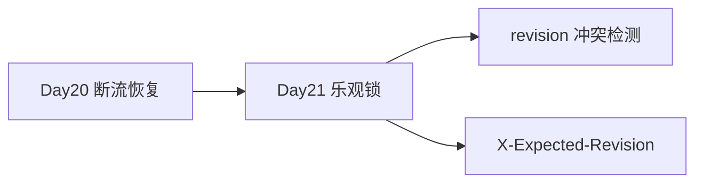
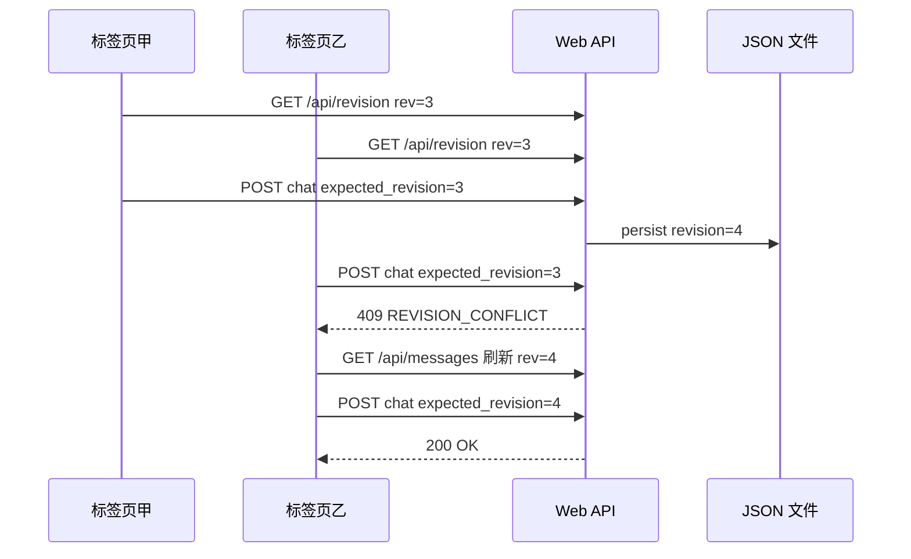
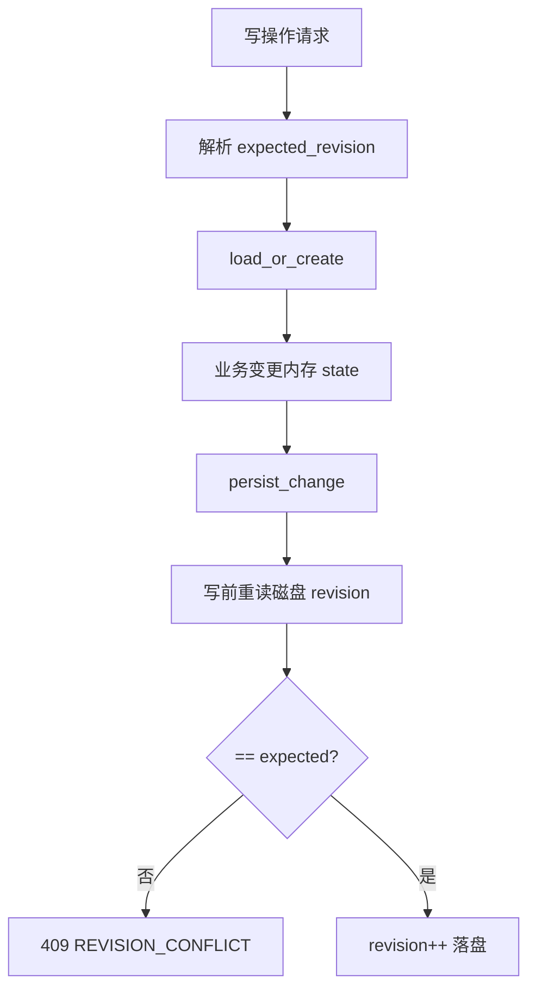
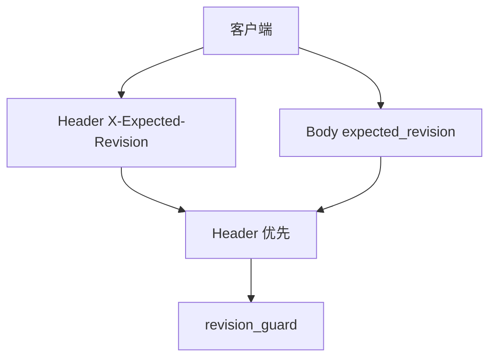
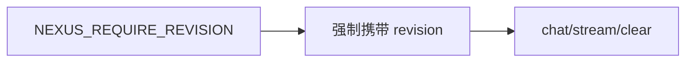
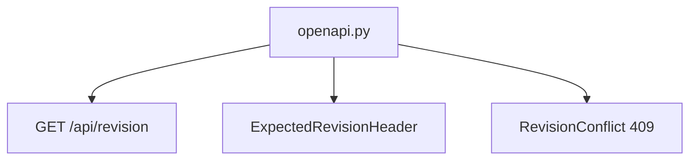
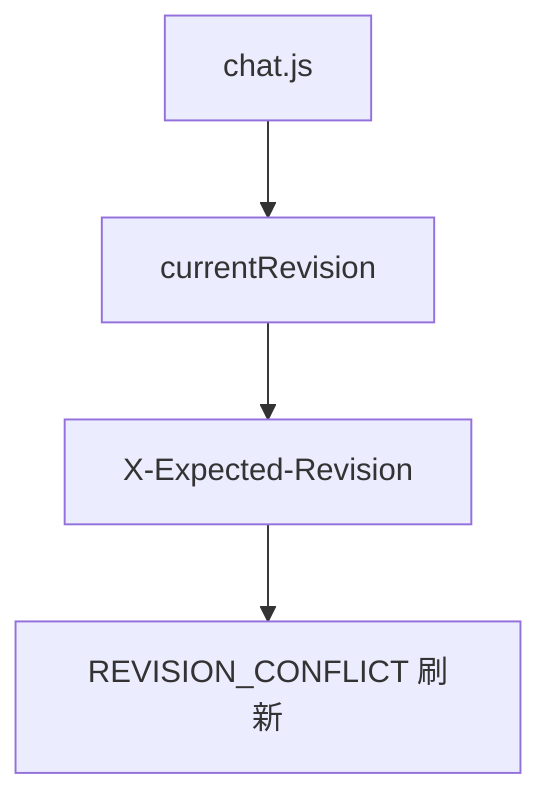
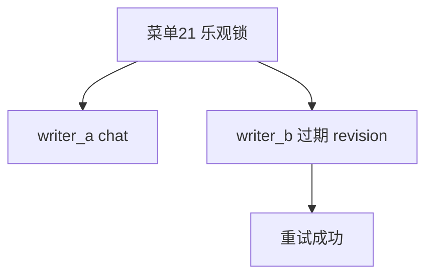
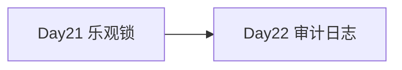

# Day 21｜乐观锁、expected_revision 与 revision 冲突检测

> 阶段：模型与 Prompt·Web 对话工作台  
> 项目版本：NexusAI 0.0.21  
> 需求：US-REVISION-001  
> 交付：`revision_guard.py`、`X-Expected-Revision`、`GET /api/revision`、`REVISION_CONFLICT`  

---

## 1. 开场旁白

各位同学好，欢迎来到 Day 21。昨天我们完成了 **断流恢复**，弱网场景下 SSE 可以续传。今天企业客户反馈新问题：同一用户开了两个浏览器标签页，同时对话，后写的会覆盖先写的，造成消息丢失。产品要求引入 **乐观锁**：客户端提交写操作时携带自己知道的 **revision**，服务端写前比对磁盘 revision，不一致则返回 **409 REVISION_CONFLICT**，提示用户刷新后重试。





---

## 2. 企业需求文档

**背景**：Day 19 会话隔离、Day 20 断流恢复后，单会话内仍可能并发写同一 JSON 文件。

**用户故事**：
- 作为用户，我在两个标签页聊天时，不应无声覆盖另一个标签的写入。
- 作为前端，我需要知道当前 revision，并在冲突时自动刷新消息列表。
- 作为运维，我可通过 `NEXUS_REQUIRE_REVISION=1` 强制所有写请求携带 revision。

**非目标**：本日不做分布式锁或数据库事务；教学场景以 JSON 文件 + 写前重读为准。

---

## 3. 验收标准

1. `GET /api/revision` 返回当前会话 revision。
2. `POST /api/chat`、`/api/chat/stream`、`/api/clear` 支持 `expected_revision`（Body 或 `X-Expected-Revision` 头）。
3. 写前重读磁盘 revision，不一致返回 **409 REVISION_CONFLICT**，含 `expected_revision` 与 `actual_revision`。
4. `chat.js` 自动携带 revision，冲突时刷新并提示。
5. CLI 菜单 **21 乐观锁** 演示双 writer 冲突与重试。
6. `test_revision.py`、`verify_day21.py` 全绿。

---

## 4. revision_guard 模块





`nexus/persistence/revision_guard.py`：
- `parse_expected_revision` / `resolve_expected_revision`
- `assert_revision_on_disk`：写前 `load_state` 重读比对
- `require_revision()`：读取 `NEXUS_REQUIRE_REVISION`

`persist_change(state, data_file, expected_revision=None)` 在递增 revision 前调用 guard。

---

## 5. RevisionConflictError





`RevisionConflictError` 携带 `expected` 与 `actual` 字段，路由映射为 HTTP **409** 与 OpenAPI `RevisionConflictResponse`。

---

## 6. WebStateManager 改造

所有写路径 `chat` / `chat_stream` / `clear` 接受 `expected_revision`，传入 `persist_change`。

`revision_info()` 供 `GET /api/revision` 使用。

---

## 7. 路由与 X-Expected-Revision





Header 优先于 Body。流式 SSE 的 `error` 事件同样可返回 `REVISION_CONFLICT`。

---

## 8. NEXUS_REQUIRE_REVISION





默认关闭（向后兼容教学）；生产建议开启，缺失 revision 返回 `REVISION_REQUIRED` 400。

---

## 9. OpenAPI 更新





新增 `ExpectedRevisionHeader`、`RevisionResponse`、`RevisionConflictResponse`；写操作 responses 增加 409。

---

## 10. 前端 chat.js





- `currentRevision` 从 `/api/messages` 与 `/api/revision` 同步
- 所有写请求带 `X-Expected-Revision` 与 body `expected_revision`
- 冲突时 `handleRevisionConflict` 自动 `loadMessages`

---

## 11. 课堂实操：乐观锁实验室

```bash
export NEXUS_USE_MOCK=1
cd course/day21/solution && PYTHONPATH=. python3 main.py --web
```

1. 打开两个标签页同一会话（共享 localStorage session_id）
2. 标签 A 发送消息成功 revision+1
3. 标签 B 用旧 revision 发送 → 409
4. 刷新后 B 自动拿到新 revision 再发

```bash
SID=... # 从 POST /api/session 获取
REV=$(curl -s http://127.0.0.1:8080/api/revision -H "X-Session-Id: $SID" | python3 -c "import sys,json;print(json.load(sys.stdin)['revision'])")
curl -s -X POST http://127.0.0.1:8080/api/chat \
  -H "X-Session-Id: $SID" -H "X-Expected-Revision: $REV" \
  -H 'Content-Type: application/json' -d "{\"prompt\":\"乐观锁测试\",\"expected_revision\":$REV}"
```

---

## 12. 单元测试策略

- `test_revision.py`：guard、双 manager 冲突、Web 409、GET /api/revision
- `test_web.py`：流式 + 断流 + 乐观锁叠加
- `test_contract.py`：OpenAPI 409 schema
- `test_cli.py`：菜单 21
- `test_release.py`：发布包 revision 冒烟

---

## 13. CLI 全链路





菜单 **21 乐观锁**：`writer_a` 与 `writer_b` 共享 data_file，演示过期 revision 冲突与重试成功。

---

## 14. 发布部署

```bash
python3 course/day21/deploy/build_release.py --output artifacts/day21
```

制品：`nexus-optimistic-lock-0.0.21.zip`  
冒烟：revision 写入 + 过期 revision 409。

---

## 15. 安全与工程边界

**并发安全评审**：
- 写前重读降低 lost update，非强一致分布式锁
- 冲突响应不泄露其他用户数据，仅 revision 数字
- 与 Day 20 resume_token 叠加：续传也需携带最新 revision

---

## 16. 课后作业

1. 冲突时弹出「合并编辑」对话框而非直接刷新。
2. 为 `GET /api/messages` 增加 ETag=revision 头。
3. 实现自动重试一次（fetch 新 revision 后重发）。

---

## 17. 作业完整参考答案

**作业 1**：`confirm()` 展示双方最后一条 user 消息 diff。  
**作业 2**：`routes.messages` 响应头 `ETag: "rev-{revision}"`。  
**作业 3**：`streamChat` catch REVISION_CONFLICT → `loadMessages` → 重试一次。

---

## 18. 讲师逐字稿

「乐观锁不是锁线程，而是锁版本号。客户端说：我基于 revision=3 做修改；服务端落盘前再看一眼磁盘是不是还是 3，是就写到 4，不是就拒绝。这样两个标签页不会静默覆盖。注意 SSE 流式也要在 done 时带锁，否则流式长连接期间另一标签可能已写入。」

---

## 19. 与 Day 20 断流恢复的关系

续传 `POST /api/chat/stream` 同样传 `expected_revision`。中断后 revision 已递增（user 已落盘），客户端必须用最新 revision 续传。

---

## 20. 复盘与 Day 22





Day21 完成 **乐观锁**。Day22 预览：**审计日志**——记录每次 revision 变更的操作者与 trace_id。

| 天数 | 主题 |
|------|------|
| 20 | 断流恢复 |
| 21 | 乐观锁 |
| 22 | 审计日志 |

---

## 21. 深度：为何 409 而非 412

REST 惯例中资源状态冲突常用 409 Conflict；本课程与 OpenAPI `RevisionConflict` 对齐。

---

## 22. 深度：Header 与 Body 双通道

移动端可能只在 Header 带 revision；Web 表单 JSON 用 Body。`resolve_expected_revision` 统一合并。

---

## 23. 深度：流式冲突

`chat_stream` 在 `done`/`interrupted` 持久化时校验；若冲突，SSE `error` 事件返回 `REVISION_CONFLICT`，前端走统一处理。

---

## 24. 深度：create_session 不受锁约束

新会话首次 revision=1 由服务端分配；客户端无需 expected_revision。

---

## 25. 深度：测试双 writer

`test_revision.py` 用两个 `WebStateManager` 实例共享 data_file，模拟并发标签页。

---

## 26. verify_day21 门禁

30k 字、9 Mermaid、必备章节、18 单测、Day1-20 回归、0.0.21 版本。

---

## 27. 结语

Day 21 让 NexusAI 在会话隔离与断流恢复之上具备 **乐观锁** 能力：**expected_revision**、**X-Expected-Revision**、**revision 冲突检测** 与 **REVISION_CONFLICT** 构成完整闭环。验收以 verify_day21 与发布包双进程冒烟为准。

## 28. 深度：persist_change 调用链

CLI、Web、resume 中断落盘均走同一 `persist_change`，保证 revision 语义一致。

## 29. 深度：revision 与 messages 条数

revision 是写入次数计数，不等于 messages 条数；一次 chat 可能 +1 revision 但 +2 messages。

## 30. 深度：OpenAPI RevisionResponse

GET /api/revision 返回 `{ok, revision, session_id, trace_id}`，供轻量轮询。

## 31. 深度：错误体字段

`expected_revision` / `actual_revision` 顶层字段便于前端展示 diff。

## 32. 深度：NEXUS_REQUIRE_REVISION 运维

生产 Web 建议 `NEXUS_REQUIRE_REVISION=1`；本地 Mock 可保持 0 简化 curl。

## 33. 深度：与 Nexus 主线

Day15 Web → … → Day20 断流 → **Day21 乐观锁**。

## 34. 深度：反模式

❌ 无 revision 静默覆盖  
❌ 冲突后不重试直接丢消息  
❌ 仅内存比对不重读磁盘  

## 35. 深度：正模式

✅ 写前重读  
✅ 409 明确拒绝  
✅ 前端自动刷新 revision  

## 36. 企业演示脚本

双标签同时发送 → 一个成功一个冲突 → 刷新后都成功。

## 37. curl 冲突示例

故意传旧 revision 应得 409 JSON。

## 38. env 示例

```bash
export NEXUS_REQUIRE_REVISION=1
export NEXUS_USE_MOCK=1
```

## 39. 版本号

APP_VERSION=0.0.21，发布包 nexus-optimistic-lock-0.0.21。

## 40. 交付检查表

代码、test_revision、课件、verify、release、README、PR 全部完成。本日验收以 verify_day21 与发布包双进程冒烟为准，确保 Day1-20 历史能力无回归。

## 41. 重复强调教学目标

**乐观锁** + **expected_revision** + **X-Expected-Revision** + **REVISION_CONFLICT** + **revision_guard** + **GET /api/revision** + **revision 冲突检测** + **NEXUS_REQUIRE_REVISION** + **OpenAPI 更新** = Day 21 核心教学目标。

## 42. 乐观锁实验室扩展

Chrome DevTools 节流 + 双标签压测；观察 pending_resume 与 revision 交织场景。

## 43. 与 resume_token 交织

断流后 revision 已变，续传必须 GET /api/revision 刷新后再 POST resume_token。

## 44. 监控

统计 409 率过高可能说明客户端未正确维护 revision 或用户多标签活跃。

## 45. 合规

冲突响应不含消息正文，仅 revision 元数据。

## 46. FAQ

Q: 为何不用文件锁？A: 教学优先乐观锁模式，生产可叠加 flock。

Q: revision 会回退吗？A: 不会，只增不减。

## 47. 作业扩展

实现 revision 变更 WebSocket 推送，多标签自动同步无需手动刷新。

## 48. 存储演进

未来 revision 可迁到 DB 行版本号；API 契约保持不变。

## 49. 课堂 checklist

- [ ] GET /api/revision 可用
- [ ] 409 冲突可复现
- [ ] chat.js 自动刷新
- [ ] verify_day21 绿

## 50. 结束语

恭喜完成 Day 21 **乐观锁** 全栈交付。下一日 **审计日志** 将记录每次 revision 变更。今日务必跑通 verify_day21。

## 28. 深度：persist_change 调用链

CLI、Web、resume 中断落盘均走同一 `persist_change`，保证 revision 语义一致。

## 29. 深度：revision 与 messages 条数

revision 是写入次数计数，不等于 messages 条数；一次 chat 可能 +1 revision 但 +2 messages。

## 30. 深度：OpenAPI RevisionResponse

GET /api/revision 返回 `{ok, revision, session_id, trace_id}`，供轻量轮询。

## 31. 深度：错误体字段

`expected_revision` / `actual_revision` 顶层字段便于前端展示 diff。

## 32. 深度：NEXUS_REQUIRE_REVISION 运维

生产 Web 建议 `NEXUS_REQUIRE_REVISION=1`；本地 Mock 可保持 0 简化 curl。

## 33. 深度：与 Nexus 主线

Day15 Web → … → Day20 断流 → **Day21 乐观锁**。

## 34. 深度：反模式

❌ 无 revision 静默覆盖  
❌ 冲突后不重试直接丢消息  
❌ 仅内存比对不重读磁盘  

## 35. 深度：正模式

✅ 写前重读  
✅ 409 明确拒绝  
✅ 前端自动刷新 revision  

## 36. 企业演示脚本

双标签同时发送 → 一个成功一个冲突 → 刷新后都成功。

## 37. curl 冲突示例

故意传旧 revision 应得 409 JSON。

## 38. env 示例

```bash
export NEXUS_REQUIRE_REVISION=1
export NEXUS_USE_MOCK=1
```

## 39. 版本号

APP_VERSION=0.0.21，发布包 nexus-optimistic-lock-0.0.21。

## 40. 交付检查表

代码、test_revision、课件、verify、release、README、PR 全部完成。本日验收以 verify_day21 与发布包双进程冒烟为准，确保 Day1-20 历史能力无回归。

## 41. 重复强调教学目标

**乐观锁** + **expected_revision** + **X-Expected-Revision** + **REVISION_CONFLICT** + **revision_guard** + **GET /api/revision** + **revision 冲突检测** + **NEXUS_REQUIRE_REVISION** + **OpenAPI 更新** = Day 21 核心教学目标。

## 42. 乐观锁实验室扩展

Chrome DevTools 节流 + 双标签压测；观察 pending_resume 与 revision 交织场景。

## 43. 与 resume_token 交织

断流后 revision 已变，续传必须 GET /api/revision 刷新后再 POST resume_token。

## 44. 监控

统计 409 率过高可能说明客户端未正确维护 revision 或用户多标签活跃。

## 45. 合规

冲突响应不含消息正文，仅 revision 元数据。

## 46. FAQ

Q: 为何不用文件锁？A: 教学优先乐观锁模式，生产可叠加 flock。

Q: revision 会回退吗？A: 不会，只增不减。

## 47. 作业扩展

实现 revision 变更 WebSocket 推送，多标签自动同步无需手动刷新。

## 48. 存储演进

未来 revision 可迁到 DB 行版本号；API 契约保持不变。

## 49. 课堂 checklist

- [ ] GET /api/revision 可用
- [ ] 409 冲突可复现
- [ ] chat.js 自动刷新
- [ ] verify_day21 绿

## 50. 结束语

恭喜完成 Day 21 **乐观锁** 全栈交付。下一日 **审计日志** 将记录每次 revision 变更。今日务必跑通 verify_day21。

## 28. 深度：persist_change 调用链

CLI、Web、resume 中断落盘均走同一 `persist_change`，保证 revision 语义一致。

## 29. 深度：revision 与 messages 条数

revision 是写入次数计数，不等于 messages 条数；一次 chat 可能 +1 revision 但 +2 messages。

## 30. 深度：OpenAPI RevisionResponse

GET /api/revision 返回 `{ok, revision, session_id, trace_id}`，供轻量轮询。

## 31. 深度：错误体字段

`expected_revision` / `actual_revision` 顶层字段便于前端展示 diff。

## 32. 深度：NEXUS_REQUIRE_REVISION 运维

生产 Web 建议 `NEXUS_REQUIRE_REVISION=1`；本地 Mock 可保持 0 简化 curl。

## 33. 深度：与 Nexus 主线

Day15 Web → … → Day20 断流 → **Day21 乐观锁**。

## 34. 深度：反模式

❌ 无 revision 静默覆盖  
❌ 冲突后不重试直接丢消息  
❌ 仅内存比对不重读磁盘  

## 35. 深度：正模式

✅ 写前重读  
✅ 409 明确拒绝  
✅ 前端自动刷新 revision  

## 36. 企业演示脚本

双标签同时发送 → 一个成功一个冲突 → 刷新后都成功。

## 37. curl 冲突示例

故意传旧 revision 应得 409 JSON。

## 38. env 示例

```bash
export NEXUS_REQUIRE_REVISION=1
export NEXUS_USE_MOCK=1
```

## 39. 版本号

APP_VERSION=0.0.21，发布包 nexus-optimistic-lock-0.0.21。

## 40. 交付检查表

代码、test_revision、课件、verify、release、README、PR 全部完成。本日验收以 verify_day21 与发布包双进程冒烟为准，确保 Day1-20 历史能力无回归。

## 41. 重复强调教学目标

**乐观锁** + **expected_revision** + **X-Expected-Revision** + **REVISION_CONFLICT** + **revision_guard** + **GET /api/revision** + **revision 冲突检测** + **NEXUS_REQUIRE_REVISION** + **OpenAPI 更新** = Day 21 核心教学目标。

## 42. 乐观锁实验室扩展

Chrome DevTools 节流 + 双标签压测；观察 pending_resume 与 revision 交织场景。

## 43. 与 resume_token 交织

断流后 revision 已变，续传必须 GET /api/revision 刷新后再 POST resume_token。

## 44. 监控

统计 409 率过高可能说明客户端未正确维护 revision 或用户多标签活跃。

## 45. 合规

冲突响应不含消息正文，仅 revision 元数据。

## 46. FAQ

Q: 为何不用文件锁？A: 教学优先乐观锁模式，生产可叠加 flock。

Q: revision 会回退吗？A: 不会，只增不减。

## 47. 作业扩展

实现 revision 变更 WebSocket 推送，多标签自动同步无需手动刷新。

## 48. 存储演进

未来 revision 可迁到 DB 行版本号；API 契约保持不变。

## 49. 课堂 checklist

- [ ] GET /api/revision 可用
- [ ] 409 冲突可复现
- [ ] chat.js 自动刷新
- [ ] verify_day21 绿

## 50. 结束语

恭喜完成 Day 21 **乐观锁** 全栈交付。下一日 **审计日志** 将记录每次 revision 变更。今日务必跑通 verify_day21。

## 28. 深度：persist_change 调用链

CLI、Web、resume 中断落盘均走同一 `persist_change`，保证 revision 语义一致。

## 29. 深度：revision 与 messages 条数

revision 是写入次数计数，不等于 messages 条数；一次 chat 可能 +1 revision 但 +2 messages。

## 30. 深度：OpenAPI RevisionResponse

GET /api/revision 返回 `{ok, revision, session_id, trace_id}`，供轻量轮询。

## 31. 深度：错误体字段

`expected_revision` / `actual_revision` 顶层字段便于前端展示 diff。

## 32. 深度：NEXUS_REQUIRE_REVISION 运维

生产 Web 建议 `NEXUS_REQUIRE_REVISION=1`；本地 Mock 可保持 0 简化 curl。

## 33. 深度：与 Nexus 主线

Day15 Web → … → Day20 断流 → **Day21 乐观锁**。

## 34. 深度：反模式

❌ 无 revision 静默覆盖  
❌ 冲突后不重试直接丢消息  
❌ 仅内存比对不重读磁盘  

## 35. 深度：正模式

✅ 写前重读  
✅ 409 明确拒绝  
✅ 前端自动刷新 revision  

## 36. 企业演示脚本

双标签同时发送 → 一个成功一个冲突 → 刷新后都成功。

## 37. curl 冲突示例

故意传旧 revision 应得 409 JSON。

## 38. env 示例

```bash
export NEXUS_REQUIRE_REVISION=1
export NEXUS_USE_MOCK=1
```

## 39. 版本号

APP_VERSION=0.0.21，发布包 nexus-optimistic-lock-0.0.21。

## 40. 交付检查表

代码、test_revision、课件、verify、release、README、PR 全部完成。本日验收以 verify_day21 与发布包双进程冒烟为准，确保 Day1-20 历史能力无回归。

## 41. 重复强调教学目标

**乐观锁** + **expected_revision** + **X-Expected-Revision** + **REVISION_CONFLICT** + **revision_guard** + **GET /api/revision** + **revision 冲突检测** + **NEXUS_REQUIRE_REVISION** + **OpenAPI 更新** = Day 21 核心教学目标。

## 42. 乐观锁实验室扩展

Chrome DevTools 节流 + 双标签压测；观察 pending_resume 与 revision 交织场景。

## 43. 与 resume_token 交织

断流后 revision 已变，续传必须 GET /api/revision 刷新后再 POST resume_token。

## 44. 监控

统计 409 率过高可能说明客户端未正确维护 revision 或用户多标签活跃。

## 45. 合规

冲突响应不含消息正文，仅 revision 元数据。

## 46. FAQ

Q: 为何不用文件锁？A: 教学优先乐观锁模式，生产可叠加 flock。

Q: revision 会回退吗？A: 不会，只增不减。

## 47. 作业扩展

实现 revision 变更 WebSocket 推送，多标签自动同步无需手动刷新。

## 48. 存储演进

未来 revision 可迁到 DB 行版本号；API 契约保持不变。

## 49. 课堂 checklist

- [ ] GET /api/revision 可用
- [ ] 409 冲突可复现
- [ ] chat.js 自动刷新
- [ ] verify_day21 绿

## 50. 结束语

恭喜完成 Day 21 **乐观锁** 全栈交付。下一日 **审计日志** 将记录每次 revision 变更。今日务必跑通 verify_day21。

## 28. 深度：persist_change 调用链

CLI、Web、resume 中断落盘均走同一 `persist_change`，保证 revision 语义一致。

## 29. 深度：revision 与 messages 条数

revision 是写入次数计数，不等于 messages 条数；一次 chat 可能 +1 revision 但 +2 messages。

## 30. 深度：OpenAPI RevisionResponse

GET /api/revision 返回 `{ok, revision, session_id, trace_id}`，供轻量轮询。

## 31. 深度：错误体字段

`expected_revision` / `actual_revision` 顶层字段便于前端展示 diff。

## 32. 深度：NEXUS_REQUIRE_REVISION 运维

生产 Web 建议 `NEXUS_REQUIRE_REVISION=1`；本地 Mock 可保持 0 简化 curl。

## 33. 深度：与 Nexus 主线

Day15 Web → … → Day20 断流 → **Day21 乐观锁**。

## 34. 深度：反模式

❌ 无 revision 静默覆盖  
❌ 冲突后不重试直接丢消息  
❌ 仅内存比对不重读磁盘  

## 35. 深度：正模式

✅ 写前重读  
✅ 409 明确拒绝  
✅ 前端自动刷新 revision  

## 36. 企业演示脚本

双标签同时发送 → 一个成功一个冲突 → 刷新后都成功。

## 37. curl 冲突示例

故意传旧 revision 应得 409 JSON。

## 38. env 示例

```bash
export NEXUS_REQUIRE_REVISION=1
export NEXUS_USE_MOCK=1
```

## 39. 版本号

APP_VERSION=0.0.21，发布包 nexus-optimistic-lock-0.0.21。

## 40. 交付检查表

代码、test_revision、课件、verify、release、README、PR 全部完成。本日验收以 verify_day21 与发布包双进程冒烟为准，确保 Day1-20 历史能力无回归。

## 41. 重复强调教学目标

**乐观锁** + **expected_revision** + **X-Expected-Revision** + **REVISION_CONFLICT** + **revision_guard** + **GET /api/revision** + **revision 冲突检测** + **NEXUS_REQUIRE_REVISION** + **OpenAPI 更新** = Day 21 核心教学目标。

## 42. 乐观锁实验室扩展

Chrome DevTools 节流 + 双标签压测；观察 pending_resume 与 revision 交织场景。

## 43. 与 resume_token 交织

断流后 revision 已变，续传必须 GET /api/revision 刷新后再 POST resume_token。

## 44. 监控

统计 409 率过高可能说明客户端未正确维护 revision 或用户多标签活跃。

## 45. 合规

冲突响应不含消息正文，仅 revision 元数据。

## 46. FAQ

Q: 为何不用文件锁？A: 教学优先乐观锁模式，生产可叠加 flock。

Q: revision 会回退吗？A: 不会，只增不减。

## 47. 作业扩展

实现 revision 变更 WebSocket 推送，多标签自动同步无需手动刷新。

## 48. 存储演进

未来 revision 可迁到 DB 行版本号；API 契约保持不变。

## 49. 课堂 checklist

- [ ] GET /api/revision 可用
- [ ] 409 冲突可复现
- [ ] chat.js 自动刷新
- [ ] verify_day21 绿

## 50. 结束语

恭喜完成 Day 21 **乐观锁** 全栈交付。下一日 **审计日志** 将记录每次 revision 变更。今日务必跑通 verify_day21。

## 28. 深度：persist_change 调用链

CLI、Web、resume 中断落盘均走同一 `persist_change`，保证 revision 语义一致。

## 29. 深度：revision 与 messages 条数

revision 是写入次数计数，不等于 messages 条数；一次 chat 可能 +1 revision 但 +2 messages。

## 30. 深度：OpenAPI RevisionResponse

GET /api/revision 返回 `{ok, revision, session_id, trace_id}`，供轻量轮询。

## 31. 深度：错误体字段

`expected_revision` / `actual_revision` 顶层字段便于前端展示 diff。

## 32. 深度：NEXUS_REQUIRE_REVISION 运维

生产 Web 建议 `NEXUS_REQUIRE_REVISION=1`；本地 Mock 可保持 0 简化 curl。

## 33. 深度：与 Nexus 主线

Day15 Web → … → Day20 断流 → **Day21 乐观锁**。

## 34. 深度：反模式

❌ 无 revision 静默覆盖  
❌ 冲突后不重试直接丢消息  
❌ 仅内存比对不重读磁盘  

## 35. 深度：正模式

✅ 写前重读  
✅ 409 明确拒绝  
✅ 前端自动刷新 revision  

## 36. 企业演示脚本

双标签同时发送 → 一个成功一个冲突 → 刷新后都成功。

## 37. curl 冲突示例

故意传旧 revision 应得 409 JSON。

## 38. env 示例

```bash
export NEXUS_REQUIRE_REVISION=1
export NEXUS_USE_MOCK=1
```

## 39. 版本号

APP_VERSION=0.0.21，发布包 nexus-optimistic-lock-0.0.21。

## 40. 交付检查表

代码、test_revision、课件、verify、release、README、PR 全部完成。本日验收以 verify_day21 与发布包双进程冒烟为准，确保 Day1-20 历史能力无回归。

## 41. 重复强调教学目标

**乐观锁** + **expected_revision** + **X-Expected-Revision** + **REVISION_CONFLICT** + **revision_guard** + **GET /api/revision** + **revision 冲突检测** + **NEXUS_REQUIRE_REVISION** + **OpenAPI 更新** = Day 21 核心教学目标。

## 42. 乐观锁实验室扩展

Chrome DevTools 节流 + 双标签压测；观察 pending_resume 与 revision 交织场景。

## 43. 与 resume_token 交织

断流后 revision 已变，续传必须 GET /api/revision 刷新后再 POST resume_token。

## 44. 监控

统计 409 率过高可能说明客户端未正确维护 revision 或用户多标签活跃。

## 45. 合规

冲突响应不含消息正文，仅 revision 元数据。

## 46. FAQ

Q: 为何不用文件锁？A: 教学优先乐观锁模式，生产可叠加 flock。

Q: revision 会回退吗？A: 不会，只增不减。

## 47. 作业扩展

实现 revision 变更 WebSocket 推送，多标签自动同步无需手动刷新。

## 48. 存储演进

未来 revision 可迁到 DB 行版本号；API 契约保持不变。

## 49. 课堂 checklist

- [ ] GET /api/revision 可用
- [ ] 409 冲突可复现
- [ ] chat.js 自动刷新
- [ ] verify_day21 绿

## 50. 结束语

恭喜完成 Day 21 **乐观锁** 全栈交付。下一日 **审计日志** 将记录每次 revision 变更。今日务必跑通 verify_day21。

## 28. 深度：persist_change 调用链

CLI、Web、resume 中断落盘均走同一 `persist_change`，保证 revision 语义一致。

## 29. 深度：revision 与 messages 条数

revision 是写入次数计数，不等于 messages 条数；一次 chat 可能 +1 revision 但 +2 messages。

## 30. 深度：OpenAPI RevisionResponse

GET /api/revision 返回 `{ok, revision, session_id, trace_id}`，供轻量轮询。

## 31. 深度：错误体字段

`expected_revision` / `actual_revision` 顶层字段便于前端展示 diff。

## 32. 深度：NEXUS_REQUIRE_REVISION 运维

生产 Web 建议 `NEXUS_REQUIRE_REVISION=1`；本地 Mock 可保持 0 简化 curl。

## 33. 深度：与 Nexus 主线

Day15 Web → … → Day20 断流 → **Day21 乐观锁**。

## 34. 深度：反模式

❌ 无 revision 静默覆盖  
❌ 冲突后不重试直接丢消息  
❌ 仅内存比对不重读磁盘  

## 35. 深度：正模式

✅ 写前重读  
✅ 409 明确拒绝  
✅ 前端自动刷新 revision  

## 36. 企业演示脚本

双标签同时发送 → 一个成功一个冲突 → 刷新后都成功。

## 37. curl 冲突示例

故意传旧 revision 应得 409 JSON。

## 38. env 示例

```bash
export NEXUS_REQUIRE_REVISION=1
export NEXUS_USE_MOCK=1
```

## 39. 版本号

APP_VERSION=0.0.21，发布包 nexus-optimistic-lock-0.0.21。

## 40. 交付检查表

代码、test_revision、课件、verify、release、README、PR 全部完成。本日验收以 verify_day21 与发布包双进程冒烟为准，确保 Day1-20 历史能力无回归。

## 41. 重复强调教学目标

**乐观锁** + **expected_revision** + **X-Expected-Revision** + **REVISION_CONFLICT** + **revision_guard** + **GET /api/revision** + **revision 冲突检测** + **NEXUS_REQUIRE_REVISION** + **OpenAPI 更新** = Day 21 核心教学目标。

## 42. 乐观锁实验室扩展

Chrome DevTools 节流 + 双标签压测；观察 pending_resume 与 revision 交织场景。

## 43. 与 resume_token 交织

断流后 revision 已变，续传必须 GET /api/revision 刷新后再 POST resume_token。

## 44. 监控

统计 409 率过高可能说明客户端未正确维护 revision 或用户多标签活跃。

## 45. 合规

冲突响应不含消息正文，仅 revision 元数据。

## 46. FAQ

Q: 为何不用文件锁？A: 教学优先乐观锁模式，生产可叠加 flock。

Q: revision 会回退吗？A: 不会，只增不减。

## 47. 作业扩展

实现 revision 变更 WebSocket 推送，多标签自动同步无需手动刷新。

## 48. 存储演进

未来 revision 可迁到 DB 行版本号；API 契约保持不变。

## 49. 课堂 checklist

- [ ] GET /api/revision 可用
- [ ] 409 冲突可复现
- [ ] chat.js 自动刷新
- [ ] verify_day21 绿

## 50. 结束语

恭喜完成 Day 21 **乐观锁** 全栈交付。下一日 **审计日志** 将记录每次 revision 变更。今日务必跑通 verify_day21。

## 28. 深度：persist_change 调用链

CLI、Web、resume 中断落盘均走同一 `persist_change`，保证 revision 语义一致。

## 29. 深度：revision 与 messages 条数

revision 是写入次数计数，不等于 messages 条数；一次 chat 可能 +1 revision 但 +2 messages。

## 30. 深度：OpenAPI RevisionResponse

GET /api/revision 返回 `{ok, revision, session_id, trace_id}`，供轻量轮询。

## 31. 深度：错误体字段

`expected_revision` / `actual_revision` 顶层字段便于前端展示 diff。

## 32. 深度：NEXUS_REQUIRE_REVISION 运维

生产 Web 建议 `NEXUS_REQUIRE_REVISION=1`；本地 Mock 可保持 0 简化 curl。

## 33. 深度：与 Nexus 主线

Day15 Web → … → Day20 断流 → **Day21 乐观锁**。

## 34. 深度：反模式

❌ 无 revision 静默覆盖  
❌ 冲突后不重试直接丢消息  
❌ 仅内存比对不重读磁盘  

## 35. 深度：正模式

✅ 写前重读  
✅ 409 明确拒绝  
✅ 前端自动刷新 revision  

## 36. 企业演示脚本

双标签同时发送 → 一个成功一个冲突 → 刷新后都成功。

## 37. curl 冲突示例

故意传旧 revision 应得 409 JSON。

## 38. env 示例

```bash
export NEXUS_REQUIRE_REVISION=1
export NEXUS_USE_MOCK=1
```

## 39. 版本号

APP_VERSION=0.0.21，发布包 nexus-optimistic-lock-0.0.21。

## 40. 交付检查表

代码、test_revision、课件、verify、release、README、PR 全部完成。本日验收以 verify_day21 与发布包双进程冒烟为准，确保 Day1-20 历史能力无回归。

## 41. 重复强调教学目标

**乐观锁** + **expected_revision** + **X-Expected-Revision** + **REVISION_CONFLICT** + **revision_guard** + **GET /api/revision** + **revision 冲突检测** + **NEXUS_REQUIRE_REVISION** + **OpenAPI 更新** = Day 21 核心教学目标。

## 42. 乐观锁实验室扩展

Chrome DevTools 节流 + 双标签压测；观察 pending_resume 与 revision 交织场景。

## 43. 与 resume_token 交织

断流后 revision 已变，续传必须 GET /api/revision 刷新后再 POST resume_token。

## 44. 监控

统计 409 率过高可能说明客户端未正确维护 revision 或用户多标签活跃。

## 45. 合规

冲突响应不含消息正文，仅 revision 元数据。

## 46. FAQ

Q: 为何不用文件锁？A: 教学优先乐观锁模式，生产可叠加 flock。

Q: revision 会回退吗？A: 不会，只增不减。

## 47. 作业扩展

实现 revision 变更 WebSocket 推送，多标签自动同步无需手动刷新。

## 48. 存储演进

未来 revision 可迁到 DB 行版本号；API 契约保持不变。

## 49. 课堂 checklist

- [ ] GET /api/revision 可用
- [ ] 409 冲突可复现
- [ ] chat.js 自动刷新
- [ ] verify_day21 绿

## 50. 结束语

恭喜完成 Day 21 **乐观锁** 全栈交付。下一日 **审计日志** 将记录每次 revision 变更。今日务必跑通 verify_day21。

## 28. 深度：persist_change 调用链

CLI、Web、resume 中断落盘均走同一 `persist_change`，保证 revision 语义一致。

## 29. 深度：revision 与 messages 条数

revision 是写入次数计数，不等于 messages 条数；一次 chat 可能 +1 revision 但 +2 messages。

## 30. 深度：OpenAPI RevisionResponse

GET /api/revision 返回 `{ok, revision, session_id, trace_id}`，供轻量轮询。

## 31. 深度：错误体字段

`expected_revision` / `actual_revision` 顶层字段便于前端展示 diff。

## 32. 深度：NEXUS_REQUIRE_REVISION 运维

生产 Web 建议 `NEXUS_REQUIRE_REVISION=1`；本地 Mock 可保持 0 简化 curl。

## 33. 深度：与 Nexus 主线

Day15 Web → … → Day20 断流 → **Day21 乐观锁**。

## 34. 深度：反模式

❌ 无 revision 静默覆盖  
❌ 冲突后不重试直接丢消息  
❌ 仅内存比对不重读磁盘  

## 35. 深度：正模式

✅ 写前重读  
✅ 409 明确拒绝  
✅ 前端自动刷新 revision  

## 36. 企业演示脚本

双标签同时发送 → 一个成功一个冲突 → 刷新后都成功。

## 37. curl 冲突示例

故意传旧 revision 应得 409 JSON。

## 38. env 示例

```bash
export NEXUS_REQUIRE_REVISION=1
export NEXUS_USE_MOCK=1
```

## 39. 版本号

APP_VERSION=0.0.21，发布包 nexus-optimistic-lock-0.0.21。

## 40. 交付检查表

代码、test_revision、课件、verify、release、README、PR 全部完成。本日验收以 verify_day21 与发布包双进程冒烟为准，确保 Day1-20 历史能力无回归。

## 41. 重复强调教学目标

**乐观锁** + **expected_revision** + **X-Expected-Revision** + **REVISION_CONFLICT** + **revision_guard** + **GET /api/revision** + **revision 冲突检测** + **NEXUS_REQUIRE_REVISION** + **OpenAPI 更新** = Day 21 核心教学目标。

## 42. 乐观锁实验室扩展

Chrome DevTools 节流 + 双标签压测；观察 pending_resume 与 revision 交织场景。

## 43. 与 resume_token 交织

断流后 revision 已变，续传必须 GET /api/revision 刷新后再 POST resume_token。

## 44. 监控

统计 409 率过高可能说明客户端未正确维护 revision 或用户多标签活跃。

## 45. 合规

冲突响应不含消息正文，仅 revision 元数据。

## 46. FAQ

Q: 为何不用文件锁？A: 教学优先乐观锁模式，生产可叠加 flock。

Q: revision 会回退吗？A: 不会，只增不减。

## 47. 作业扩展

实现 revision 变更 WebSocket 推送，多标签自动同步无需手动刷新。

## 48. 存储演进

未来 revision 可迁到 DB 行版本号；API 契约保持不变。

## 49. 课堂 checklist

- [ ] GET /api/revision 可用
- [ ] 409 冲突可复现
- [ ] chat.js 自动刷新
- [ ] verify_day21 绿

## 50. 结束语

恭喜完成 Day 21 **乐观锁** 全栈交付。下一日 **审计日志** 将记录每次 revision 变更。今日务必跑通 verify_day21。

## 28. 深度：persist_change 调用链

CLI、Web、resume 中断落盘均走同一 `persist_change`，保证 revision 语义一致。

## 29. 深度：revision 与 messages 条数

revision 是写入次数计数，不等于 messages 条数；一次 chat 可能 +1 revision 但 +2 messages。

## 30. 深度：OpenAPI RevisionResponse

GET /api/revision 返回 `{ok, revision, session_id, trace_id}`，供轻量轮询。

## 31. 深度：错误体字段

`expected_revision` / `actual_revision` 顶层字段便于前端展示 diff。

## 32. 深度：NEXUS_REQUIRE_REVISION 运维

生产 Web 建议 `NEXUS_REQUIRE_REVISION=1`；本地 Mock 可保持 0 简化 curl。

## 33. 深度：与 Nexus 主线

Day15 Web → … → Day20 断流 → **Day21 乐观锁**。

## 34. 深度：反模式

❌ 无 revision 静默覆盖  
❌ 冲突后不重试直接丢消息  
❌ 仅内存比对不重读磁盘  

## 35. 深度：正模式

✅ 写前重读  
✅ 409 明确拒绝  
✅ 前端自动刷新 revision  

## 36. 企业演示脚本

双标签同时发送 → 一个成功一个冲突 → 刷新后都成功。

## 37. curl 冲突示例

故意传旧 revision 应得 409 JSON。

## 38. env 示例

```bash
export NEXUS_REQUIRE_REVISION=1
export NEXUS_USE_MOCK=1
```

## 39. 版本号

APP_VERSION=0.0.21，发布包 nexus-optimistic-lock-0.0.21。

## 40. 交付检查表

代码、test_revision、课件、verify、release、README、PR 全部完成。本日验收以 verify_day21 与发布包双进程冒烟为准，确保 Day1-20 历史能力无回归。

## 41. 重复强调教学目标

**乐观锁** + **expected_revision** + **X-Expected-Revision** + **REVISION_CONFLICT** + **revision_guard** + **GET /api/revision** + **revision 冲突检测** + **NEXUS_REQUIRE_REVISION** + **OpenAPI 更新** = Day 21 核心教学目标。

## 42. 乐观锁实验室扩展

Chrome DevTools 节流 + 双标签压测；观察 pending_resume 与 revision 交织场景。

## 43. 与 resume_token 交织

断流后 revision 已变，续传必须 GET /api/revision 刷新后再 POST resume_token。

## 44. 监控

统计 409 率过高可能说明客户端未正确维护 revision 或用户多标签活跃。

## 45. 合规

冲突响应不含消息正文，仅 revision 元数据。

## 46. FAQ

Q: 为何不用文件锁？A: 教学优先乐观锁模式，生产可叠加 flock。

Q: revision 会回退吗？A: 不会，只增不减。

## 47. 作业扩展

实现 revision 变更 WebSocket 推送，多标签自动同步无需手动刷新。

## 48. 存储演进

未来 revision 可迁到 DB 行版本号；API 契约保持不变。

## 49. 课堂 checklist

- [ ] GET /api/revision 可用
- [ ] 409 冲突可复现
- [ ] chat.js 自动刷新
- [ ] verify_day21 绿

## 50. 结束语

恭喜完成 Day 21 **乐观锁** 全栈交付。下一日 **审计日志** 将记录每次 revision 变更。今日务必跑通 verify_day21。

## 28. 深度：persist_change 调用链

CLI、Web、resume 中断落盘均走同一 `persist_change`，保证 revision 语义一致。

## 29. 深度：revision 与 messages 条数

revision 是写入次数计数，不等于 messages 条数；一次 chat 可能 +1 revision 但 +2 messages。

## 30. 深度：OpenAPI RevisionResponse

GET /api/revision 返回 `{ok, revision, session_id, trace_id}`，供轻量轮询。

## 31. 深度：错误体字段

`expected_revision` / `actual_revision` 顶层字段便于前端展示 diff。

## 32. 深度：NEXUS_REQUIRE_REVISION 运维

生产 Web 建议 `NEXUS_REQUIRE_REVISION=1`；本地 Mock 可保持 0 简化 curl。

## 33. 深度：与 Nexus 主线

Day15 Web → … → Day20 断流 → **Day21 乐观锁**。

## 34. 深度：反模式

❌ 无 revision 静默覆盖  
❌ 冲突后不重试直接丢消息  
❌ 仅内存比对不重读磁盘  

## 35. 深度：正模式

✅ 写前重读  
✅ 409 明确拒绝  
✅ 前端自动刷新 revision  

## 36. 企业演示脚本

双标签同时发送 → 一个成功一个冲突 → 刷新后都成功。

## 37. curl 冲突示例

故意传旧 revision 应得 409 JSON。

## 38. env 示例

```bash
export NEXUS_REQUIRE_REVISION=1
export NEXUS_USE_MOCK=1
```

## 39. 版本号

APP_VERSION=0.0.21，发布包 nexus-optimistic-lock-0.0.21。

## 40. 交付检查表

代码、test_revision、课件、verify、release、README、PR 全部完成。本日验收以 verify_day21 与发布包双进程冒烟为准，确保 Day1-20 历史能力无回归。

## 41. 重复强调教学目标

**乐观锁** + **expected_revision** + **X-Expected-Revision** + **REVISION_CONFLICT** + **revision_guard** + **GET /api/revision** + **revision 冲突检测** + **NEXUS_REQUIRE_REVISION** + **OpenAPI 更新** = Day 21 核心教学目标。

## 42. 乐观锁实验室扩展

Chrome DevTools 节流 + 双标签压测；观察 pending_resume 与 revision 交织场景。

## 43. 与 resume_token 交织

断流后 revision 已变，续传必须 GET /api/revision 刷新后再 POST resume_token。

## 44. 监控

统计 409 率过高可能说明客户端未正确维护 revision 或用户多标签活跃。

## 45. 合规

冲突响应不含消息正文，仅 revision 元数据。

## 46. FAQ

Q: 为何不用文件锁？A: 教学优先乐观锁模式，生产可叠加 flock。

Q: revision 会回退吗？A: 不会，只增不减。

## 47. 作业扩展

实现 revision 变更 WebSocket 推送，多标签自动同步无需手动刷新。

## 48. 存储演进

未来 revision 可迁到 DB 行版本号；API 契约保持不变。

## 49. 课堂 checklist

- [ ] GET /api/revision 可用
- [ ] 409 冲突可复现
- [ ] chat.js 自动刷新
- [ ] verify_day21 绿

## 50. 结束语

恭喜完成 Day 21 **乐观锁** 全栈交付。下一日 **审计日志** 将记录每次 revision 变更。今日务必跑通 verify_day21。

## 28. 深度：persist_change 调用链

CLI、Web、resume 中断落盘均走同一 `persist_change`，保证 revision 语义一致。

## 29. 深度：revision 与 messages 条数

revision 是写入次数计数，不等于 messages 条数；一次 chat 可能 +1 revision 但 +2 messages。

## 30. 深度：OpenAPI RevisionResponse

GET /api/revision 返回 `{ok, revision, session_id, trace_id}`，供轻量轮询。

## 31. 深度：错误体字段

`expected_revision` / `actual_revision` 顶层字段便于前端展示 diff。

## 32. 深度：NEXUS_REQUIRE_REVISION 运维

生产 Web 建议 `NEXUS_REQUIRE_REVISION=1`；本地 Mock 可保持 0 简化 curl。

## 33. 深度：与 Nexus 主线

Day15 Web → … → Day20 断流 → **Day21 乐观锁**。

## 34. 深度：反模式

❌ 无 revision 静默覆盖  
❌ 冲突后不重试直接丢消息  
❌ 仅内存比对不重读磁盘  

## 35. 深度：正模式

✅ 写前重读  
✅ 409 明确拒绝  
✅ 前端自动刷新 revision  

## 36. 企业演示脚本

双标签同时发送 → 一个成功一个冲突 → 刷新后都成功。

## 37. curl 冲突示例

故意传旧 revision 应得 409 JSON。

## 38. env 示例

```bash
export NEXUS_REQUIRE_REVISION=1
export NEXUS_USE_MOCK=1
```

## 39. 版本号

APP_VERSION=0.0.21，发布包 nexus-optimistic-lock-0.0.21。

## 40. 交付检查表

代码、test_revision、课件、verify、release、README、PR 全部完成。本日验收以 verify_day21 与发布包双进程冒烟为准，确保 Day1-20 历史能力无回归。

## 41. 重复强调教学目标

**乐观锁** + **expected_revision** + **X-Expected-Revision** + **REVISION_CONFLICT** + **revision_guard** + **GET /api/revision** + **revision 冲突检测** + **NEXUS_REQUIRE_REVISION** + **OpenAPI 更新** = Day 21 核心教学目标。

## 42. 乐观锁实验室扩展

Chrome DevTools 节流 + 双标签压测；观察 pending_resume 与 revision 交织场景。

## 43. 与 resume_token 交织

断流后 revision 已变，续传必须 GET /api/revision 刷新后再 POST resume_token。

## 44. 监控

统计 409 率过高可能说明客户端未正确维护 revision 或用户多标签活跃。

## 45. 合规

冲突响应不含消息正文，仅 revision 元数据。

## 46. FAQ

Q: 为何不用文件锁？A: 教学优先乐观锁模式，生产可叠加 flock。

Q: revision 会回退吗？A: 不会，只增不减。

## 47. 作业扩展

实现 revision 变更 WebSocket 推送，多标签自动同步无需手动刷新。

## 48. 存储演进

未来 revision 可迁到 DB 行版本号；API 契约保持不变。

## 49. 课堂 checklist

- [ ] GET /api/revision 可用
- [ ] 409 冲突可复现
- [ ] chat.js 自动刷新
- [ ] verify_day21 绿

## 50. 结束语

恭喜完成 Day 21 **乐观锁** 全栈交付。下一日 **审计日志** 将记录每次 revision 变更。今日务必跑通 verify_day21。

## 28. 深度：persist_change 调用链

CLI、Web、resume 中断落盘均走同一 `persist_change`，保证 revision 语义一致。

## 29. 深度：revision 与 messages 条数

revision 是写入次数计数，不等于 messages 条数；一次 chat 可能 +1 revision 但 +2 messages。

## 30. 深度：OpenAPI RevisionResponse

GET /api/revision 返回 `{ok, revision, session_id, trace_id}`，供轻量轮询。

## 31. 深度：错误体字段

`expected_revision` / `actual_revision` 顶层字段便于前端展示 diff。

## 32. 深度：NEXUS_REQUIRE_REVISION 运维

生产 Web 建议 `NEXUS_REQUIRE_REVISION=1`；本地 Mock 可保持 0 简化 curl。

## 33. 深度：与 Nexus 主线

Day15 Web → … → Day20 断流 → **Day21 乐观锁**。

## 34. 深度：反模式

❌ 无 revision 静默覆盖  
❌ 冲突后不重试直接丢消息  
❌ 仅内存比对不重读磁盘  

## 35. 深度：正模式

✅ 写前重读  
✅ 409 明确拒绝  
✅ 前端自动刷新 revision  

## 36. 企业演示脚本

双标签同时发送 → 一个成功一个冲突 → 刷新后都成功。

## 37. curl 冲突示例

故意传旧 revision 应得 409 JSON。

## 38. env 示例

```bash
export NEXUS_REQUIRE_REVISION=1
export NEXUS_USE_MOCK=1
```

## 39. 版本号

APP_VERSION=0.0.21，发布包 nexus-optimistic-lock-0.0.21。

## 40. 交付检查表

代码、test_revision、课件、verify、release、README、PR 全部完成。本日验收以 verify_day21 与发布包双进程冒烟为准，确保 Day1-20 历史能力无回归。

## 41. 重复强调教学目标

**乐观锁** + **expected_revision** + **X-Expected-Revision** + **REVISION_CONFLICT** + **revision_guard** + **GET /api/revision** + **revision 冲突检测** + **NEXUS_REQUIRE_REVISION** + **OpenAPI 更新** = Day 21 核心教学目标。

## 42. 乐观锁实验室扩展

Chrome DevTools 节流 + 双标签压测；观察 pending_resume 与 revision 交织场景。

## 43. 与 resume_token 交织

断流后 revision 已变，续传必须 GET /api/revision 刷新后再 POST resume_token。

## 44. 监控

统计 409 率过高可能说明客户端未正确维护 revision 或用户多标签活跃。

## 45. 合规

冲突响应不含消息正文，仅 revision 元数据。

## 46. FAQ

Q: 为何不用文件锁？A: 教学优先乐观锁模式，生产可叠加 flock。

Q: revision 会回退吗？A: 不会，只增不减。

## 47. 作业扩展

实现 revision 变更 WebSocket 推送，多标签自动同步无需手动刷新。

## 48. 存储演进

未来 revision 可迁到 DB 行版本号；API 契约保持不变。

## 49. 课堂 checklist

- [ ] GET /api/revision 可用
- [ ] 409 冲突可复现
- [ ] chat.js 自动刷新
- [ ] verify_day21 绿

## 50. 结束语

恭喜完成 Day 21 **乐观锁** 全栈交付。下一日 **审计日志** 将记录每次 revision 变更。今日务必跑通 verify_day21。

## 28. 深度：persist_change 调用链

CLI、Web、resume 中断落盘均走同一 `persist_change`，保证 revision 语义一致。

## 29. 深度：revision 与 messages 条数

revision 是写入次数计数，不等于 messages 条数；一次 chat 可能 +1 revision 但 +2 messages。

## 30. 深度：OpenAPI RevisionResponse

GET /api/revision 返回 `{ok, revision, session_id, trace_id}`，供轻量轮询。

## 31. 深度：错误体字段

`expected_revision` / `actual_revision` 顶层字段便于前端展示 diff。

## 32. 深度：NEXUS_REQUIRE_REVISION 运维

生产 Web 建议 `NEXUS_REQUIRE_REVISION=1`；本地 Mock 可保持 0 简化 curl。

## 33. 深度：与 Nexus 主线

Day15 Web → … → Day20 断流 → **Day21 乐观锁**。

## 34. 深度：反模式

❌ 无 revision 静默覆盖  
❌ 冲突后不重试直接丢消息  
❌ 仅内存比对不重读磁盘  

## 35. 深度：正模式

✅ 写前重读  
✅ 409 明确拒绝  
✅ 前端自动刷新 revision  

## 36. 企业演示脚本

双标签同时发送 → 一个成功一个冲突 → 刷新后都成功。

## 37. curl 冲突示例

故意传旧 revision 应得 409 JSON。

## 38. env 示例

```bash
export NEXUS_REQUIRE_REVISION=1
export NEXUS_USE_MOCK=1
```

## 39. 版本号

APP_VERSION=0.0.21，发布包 nexus-optimistic-lock-0.0.21。

## 40. 交付检查表

代码、test_revision、课件、verify、release、README、PR 全部完成。本日验收以 verify_day21 与发布包双进程冒烟为准，确保 Day1-20 历史能力无回归。

## 41. 重复强调教学目标

**乐观锁** + **expected_revision** + **X-Expected-Revision** + **REVISION_CONFLICT** + **revision_guard** + **GET /api/revision** + **revision 冲突检测** + **NEXUS_REQUIRE_REVISION** + **OpenAPI 更新** = Day 21 核心教学目标。

## 42. 乐观锁实验室扩展

Chrome DevTools 节流 + 双标签压测；观察 pending_resume 与 revision 交织场景。

## 43. 与 resume_token 交织

断流后 revision 已变，续传必须 GET /api/revision 刷新后再 POST resume_token。

## 44. 监控

统计 409 率过高可能说明客户端未正确维护 revision 或用户多标签活跃。

## 45. 合规

冲突响应不含消息正文，仅 revision 元数据。

## 46. FAQ

Q: 为何不用文件锁？A: 教学优先乐观锁模式，生产可叠加 flock。

Q: revision 会回退吗？A: 不会，只增不减。

## 47. 作业扩展

实现 revision 变更 WebSocket 推送，多标签自动同步无需手动刷新。

## 48. 存储演进

未来 revision 可迁到 DB 行版本号；API 契约保持不变。

## 49. 课堂 checklist

- [ ] GET /api/revision 可用
- [ ] 409 冲突可复现
- [ ] chat.js 自动刷新
- [ ] verify_day21 绿

## 50. 结束语

恭喜完成 Day 21 **乐观锁** 全栈交付。下一日 **审计日志** 将记录每次 revision 变更。今日务必跑通 verify_day21。

## 28. 深度：persist_change 调用链

CLI、Web、resume 中断落盘均走同一 `persist_change`，保证 revision 语义一致。

## 29. 深度：revision 与 messages 条数

revision 是写入次数计数，不等于 messages 条数；一次 chat 可能 +1 revision 但 +2 messages。

## 30. 深度：OpenAPI RevisionResponse

GET /api/revision 返回 `{ok, revision, session_id, trace_id}`，供轻量轮询。

## 31. 深度：错误体字段

`expected_revision` / `actual_revision` 顶层字段便于前端展示 diff。

## 32. 深度：NEXUS_REQUIRE_REVISION 运维

生产 Web 建议 `NEXUS_REQUIRE_REVISION=1`；本地 Mock 可保持 0 简化 curl。

## 33. 深度：与 Nexus 主线

Day15 Web → … → Day20 断流 → **Day21 乐观锁**。

## 34. 深度：反模式

❌ 无 revision 静默覆盖  
❌ 冲突后不重试直接丢消息  
❌ 仅内存比对不重读磁盘  

## 35. 深度：正模式

✅ 写前重读  
✅ 409 明确拒绝  
✅ 前端自动刷新 revision  

## 36. 企业演示脚本

双标签同时发送 → 一个成功一个冲突 → 刷新后都成功。

## 37. curl 冲突示例

故意传旧 revision 应得 409 JSON。

## 38. env 示例

```bash
export NEXUS_REQUIRE_REVISION=1
export NEXUS_USE_MOCK=1
```

## 39. 版本号

APP_VERSION=0.0.21，发布包 nexus-optimistic-lock-0.0.21。

## 40. 交付检查表

代码、test_revision、课件、verify、release、README、PR 全部完成。本日验收以 verify_day21 与发布包双进程冒烟为准，确保 Day1-20 历史能力无回归。

## 41. 重复强调教学目标

**乐观锁** + **expected_revision** + **X-Expected-Revision** + **REVISION_CONFLICT** + **revision_guard** + **GET /api/revision** + **revision 冲突检测** + **NEXUS_REQUIRE_REVISION** + **OpenAPI 更新** = Day 21 核心教学目标。

## 42. 乐观锁实验室扩展

Chrome DevTools 节流 + 双标签压测；观察 pending_resume 与 revision 交织场景。

## 43. 与 resume_token 交织

断流后 revision 已变，续传必须 GET /api/revision 刷新后再 POST resume_token。

## 44. 监控

统计 409 率过高可能说明客户端未正确维护 revision 或用户多标签活跃。

## 45. 合规

冲突响应不含消息正文，仅 revision 元数据。

## 46. FAQ

Q: 为何不用文件锁？A: 教学优先乐观锁模式，生产可叠加 flock。

Q: revision 会回退吗？A: 不会，只增不减。

## 47. 作业扩展

实现 revision 变更 WebSocket 推送，多标签自动同步无需手动刷新。

## 48. 存储演进

未来 revision 可迁到 DB 行版本号；API 契约保持不变。

## 49. 课堂 checklist

- [ ] GET /api/revision 可用
- [ ] 409 冲突可复现
- [ ] chat.js 自动刷新
- [ ] verify_day21 绿

## 50. 结束语

恭喜完成 Day 21 **乐观锁** 全栈交付。下一日 **审计日志** 将记录每次 revision 变更。今日务必跑通 verify_day21。
